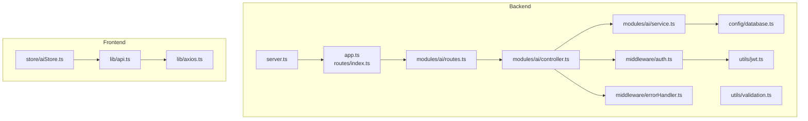
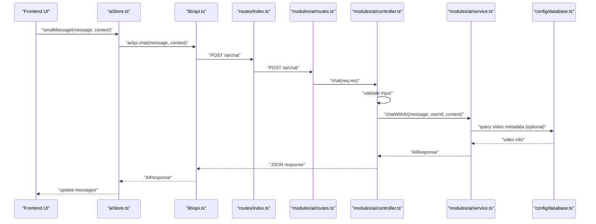
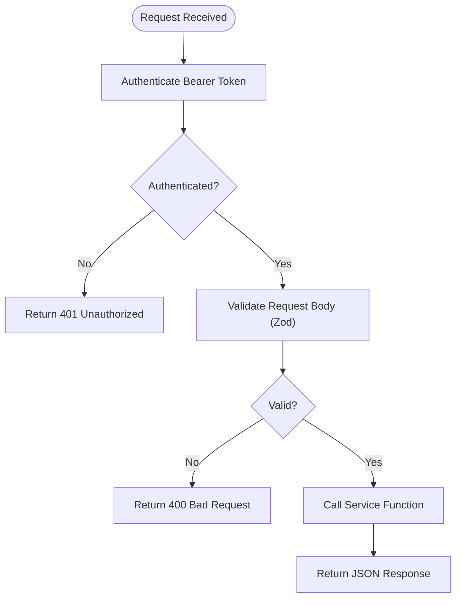
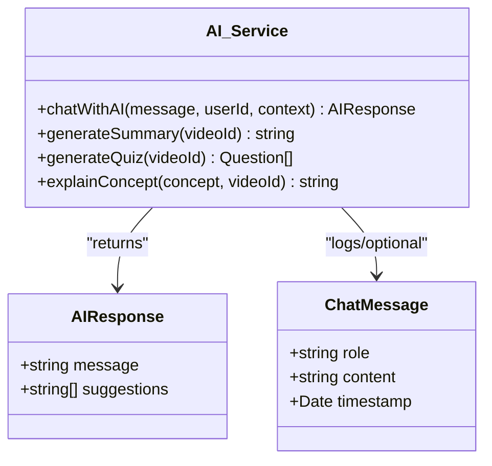
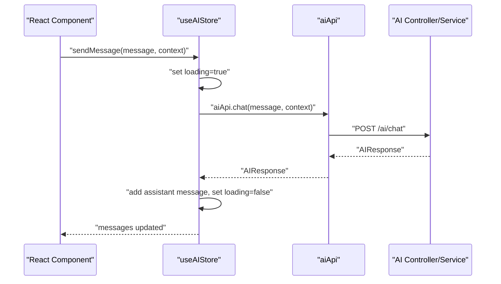
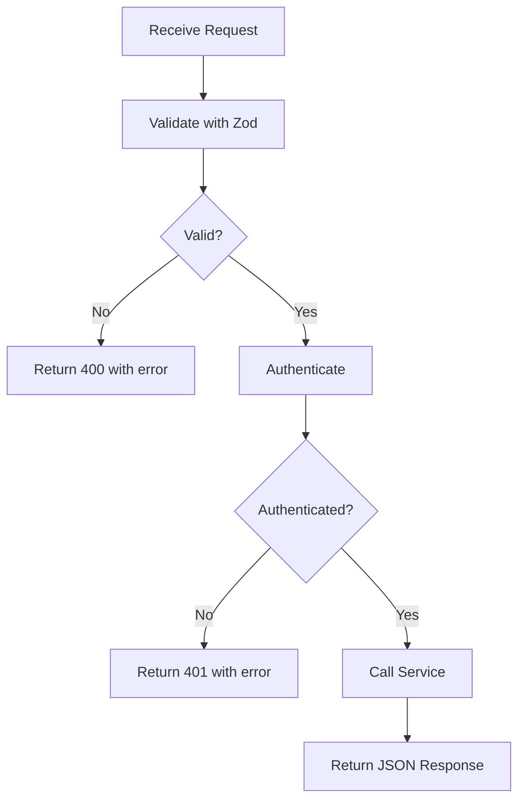
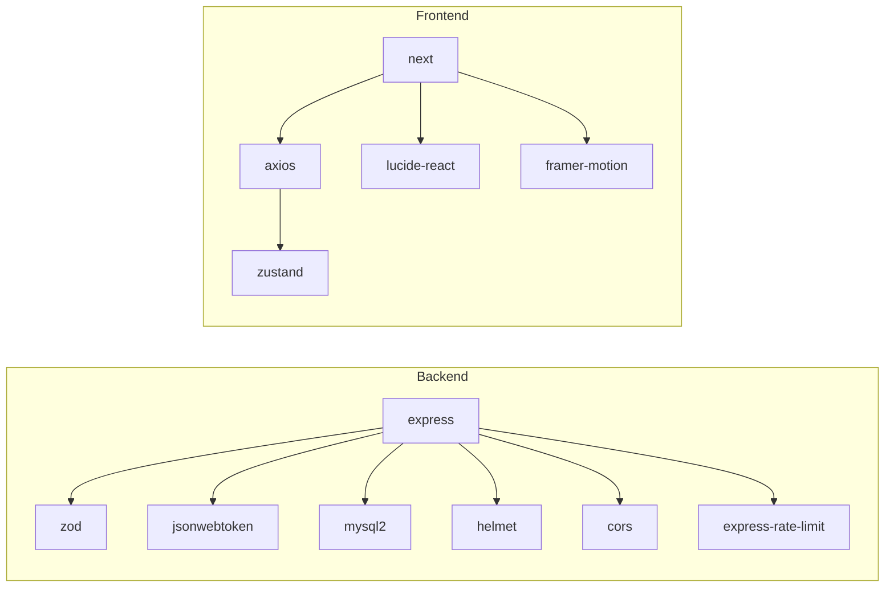

# AI Assistant System

<cite>
**Referenced Files in This Document**
- [controller.ts](file://backend/src/modules/ai/controller.ts)
- [service.ts](file://backend/src/modules/ai/service.ts)
- [routes.ts](file://backend/src/modules/ai/routes.ts)
- [validation.ts](file://backend/src/utils/validation.ts)
- [auth.ts](file://backend/src/middleware/auth.ts)
- [errorHandler.ts](file://backend/src/middleware/errorHandler.ts)
- [database.ts](file://backend/src/config/database.ts)
- [api.ts](file://frontend/app/lib/api.ts)
- [aiStore.ts](file://frontend/app/store/aiStore.ts)
- [index.ts](file://backend/src/routes/index.ts)
- [server.ts](file://backend/src/server.ts)
- [jwt.ts](file://backend/src/utils/jwt.ts)
- [package.json](file://backend/package.json)
- [package.json](file://frontend/package.json)
</cite>

## Table of Contents
1. [Introduction](#introduction)
2. [Project Structure](#project-structure)
3. [Core Components](#core-components)
4. [Architecture Overview](#architecture-overview)
5. [Detailed Component Analysis](#detailed-component-analysis)
6. [Dependency Analysis](#dependency-analysis)
7. [Performance Considerations](#performance-considerations)
8. [Troubleshooting Guide](#troubleshooting-guide)
9. [Conclusion](#conclusion)
10. [Appendices](#appendices)

## Introduction
This document describes the AI Assistant System integrated into the Learning Management Platform. It covers the OpenAI API integration strategy, chat interface implementation, content processing capabilities (summarization, quiz generation, concept explanation), and AI-powered learning features. The documentation also outlines prompt engineering strategies, response handling, integration with the learning platform, practical usage examples, API configuration, rate limiting, error handling, and performance optimization recommendations.

## Project Structure
The AI Assistant System spans both backend and frontend layers:
- Backend: Express routes, controllers, AI service, validation, authentication, and database utilities.
- Frontend: API client and Zustand store for managing AI interactions and UI state.

**Diagram sources**
- [server.ts:1-32](file://backend/src/server.ts#L1-L32)
- [index.ts:1-25](file://backend/src/routes/index.ts#L1-L25)
- [routes.ts:1-13](file://backend/src/modules/ai/routes.ts#L1-L13)
- [controller.ts:1-73](file://backend/src/modules/ai/controller.ts#L1-L73)
- [service.ts:1-151](file://backend/src/modules/ai/service.ts#L1-L151)
- [auth.ts:1-42](file://backend/src/middleware/auth.ts#L1-L42)
- [errorHandler.ts:1-38](file://backend/src/middleware/errorHandler.ts#L1-L38)
- [validation.ts:1-31](file://backend/src/utils/validation.ts#L1-L31)
- [database.ts:1-53](file://backend/src/config/database.ts#L1-L53)
- [jwt.ts:1-78](file://backend/src/utils/jwt.ts#L1-L78)
- [api.ts:1-80](file://frontend/app/lib/api.ts#L1-L80)
- [aiStore.ts:1-129](file://frontend/app/store/aiStore.ts#L1-L129)

**Section sources**
- [server.ts:1-32](file://backend/src/server.ts#L1-L32)
- [index.ts:1-25](file://backend/src/routes/index.ts#L1-L25)
- [routes.ts:1-13](file://backend/src/modules/ai/routes.ts#L1-L13)
- [controller.ts:1-73](file://backend/src/modules/ai/controller.ts#L1-L73)
- [service.ts:1-151](file://backend/src/modules/ai/service.ts#L1-L151)
- [auth.ts:1-42](file://backend/src/middleware/auth.ts#L1-L42)
- [errorHandler.ts:1-38](file://backend/src/middleware/errorHandler.ts#L1-L38)
- [validation.ts:1-31](file://backend/src/utils/validation.ts#L1-L31)
- [database.ts:1-53](file://backend/src/config/database.ts#L1-L53)
- [jwt.ts:1-78](file://backend/src/utils/jwt.ts#L1-L78)
- [api.ts:1-80](file://frontend/app/lib/api.ts#L1-L80)
- [aiStore.ts:1-129](file://frontend/app/store/aiStore.ts#L1-L129)

## Core Components
- AI Routes: Expose endpoints for chat, summarize, quiz, and explain under /ai.
- AI Controller: Validates requests, enforces authentication, and orchestrates service calls.
- AI Service: Implements chat, summarization, quiz generation, and concept explanation. Currently uses mock responses; ready for OpenAI integration.
- Validation: Zod schemas for AI chat input validation.
- Authentication: Middleware to verify Bearer tokens and attach user context.
- Error Handling: Centralized async wrapper and error handler.
- Database: MySQL connection pool abstraction used for content retrieval.
- Frontend API Client: Axios-based client for AI endpoints.
- Frontend Store: Zustand store for managing chat messages, loading states, errors, and AI actions.

**Section sources**
- [routes.ts:1-13](file://backend/src/modules/ai/routes.ts#L1-L13)
- [controller.ts:1-73](file://backend/src/modules/ai/controller.ts#L1-L73)
- [service.ts:1-151](file://backend/src/modules/ai/service.ts#L1-L151)
- [validation.ts:19-25](file://backend/src/utils/validation.ts#L19-L25)
- [auth.ts:8-24](file://backend/src/middleware/auth.ts#L8-L24)
- [errorHandler.ts:33-37](file://backend/src/middleware/errorHandler.ts#L33-L37)
- [database.ts:19-50](file://backend/src/config/database.ts#L19-L50)
- [api.ts:67-79](file://frontend/app/lib/api.ts#L67-L79)
- [aiStore.ts:35-128](file://frontend/app/store/aiStore.ts#L35-L128)

## Architecture Overview
The AI Assistant System follows a layered architecture:
- Presentation Layer (Frontend): React components consume the Zustand store and call the API client.
- Application Layer (Backend): Express routes delegate to controllers, which validate inputs, enforce auth, and call services.
- Domain Layer (AI Service): Encapsulates AI logic and integrates with external APIs (mocked currently).
- Infrastructure Layer: Database utilities, JWT utilities, and error handling.

**Diagram sources**
- [aiStore.ts:41-77](file://frontend/app/store/aiStore.ts#L41-L77)
- [api.ts:68-69](file://frontend/app/lib/api.ts#L68-L69)
- [index.ts:22](file://backend/src/routes/index.ts#L22)
- [routes.ts:7](file://backend/src/modules/ai/routes.ts#L7)
- [controller.ts:7-21](file://backend/src/modules/ai/controller.ts#L7-L21)
- [service.ts:60-86](file://backend/src/modules/ai/service.ts#L60-L86)
- [database.ts:68-75](file://backend/src/config/database.ts#L68-L75)

## Detailed Component Analysis

### AI Routes and Controller
- Routes define four endpoints: POST /ai/chat, /ai/summarize, /ai/quiz, and /ai/explain. All endpoints require authentication via the auth middleware.
- Controller enforces authentication, validates request bodies using Zod schemas, and delegates to service functions. It wraps handlers with an async error handler to centralize error responses.

**Diagram sources**
- [routes.ts:7-10](file://backend/src/modules/ai/routes.ts#L7-L10)
- [controller.ts:13](file://backend/src/modules/ai/controller.ts#L13)
- [validation.ts:19-25](file://backend/src/utils/validation.ts#L19-L25)
- [auth.ts:8-24](file://backend/src/middleware/auth.ts#L8-L24)
- [errorHandler.ts:33-37](file://backend/src/middleware/errorHandler.ts#L33-L37)

**Section sources**
- [routes.ts:1-13](file://backend/src/modules/ai/routes.ts#L1-L13)
- [controller.ts:1-73](file://backend/src/modules/ai/controller.ts#L1-L73)
- [validation.ts:19-25](file://backend/src/utils/validation.ts#L19-L25)
- [auth.ts:8-24](file://backend/src/middleware/auth.ts#L8-L24)
- [errorHandler.ts:33-37](file://backend/src/middleware/errorHandler.ts#L33-L37)

### AI Service Implementation
- chatWithAI: Accepts user message, userId, and optional context (videoId/subjectId). Retrieves video metadata when videoId is present and returns a mock AIResponse with a message and optional suggestions.
- generateSummary: Returns a mock summary string for a given videoId after validating existence.
- generateQuiz: Returns mock quiz questions for a given videoId after validating existence.
- explainConcept: Returns a mock explanation string for a given concept, optionally contextualized by videoId.

**Diagram sources**
- [service.ts:3-12](file://backend/src/modules/ai/service.ts#L3-L12)
- [service.ts:60-151](file://backend/src/modules/ai/service.ts#L60-L151)

**Section sources**
- [service.ts:14-86](file://backend/src/modules/ai/service.ts#L14-L86)
- [service.ts:88-100](file://backend/src/modules/ai/service.ts#L88-L100)
- [service.ts:102-145](file://backend/src/modules/ai/service.ts#L102-L145)
- [service.ts:147-151](file://backend/src/modules/ai/service.ts#L147-L151)

### Frontend Integration: API Client and Store
- API Client: Provides typed methods for AI endpoints (chat, summarize, quiz, explain) using Axios.
- Zustand Store: Manages chat messages, loading states, and errors. Dispatches actions to call backend endpoints and updates UI state accordingly.

**Diagram sources**
- [aiStore.ts:41-77](file://frontend/app/store/aiStore.ts#L41-L77)
- [api.ts:68-69](file://frontend/app/lib/api.ts#L68-L69)
- [controller.ts:14-20](file://backend/src/modules/ai/controller.ts#L14-L20)
- [service.ts:79](file://backend/src/modules/ai/service.ts#L79)

**Section sources**
- [api.ts:67-79](file://frontend/app/lib/api.ts#L67-L79)
- [aiStore.ts:35-128](file://frontend/app/store/aiStore.ts#L35-L128)

### Prompt Engineering Strategies
- Contextual Awareness: The service retrieves video metadata when videoId is provided to enrich prompts with current lesson context.
- Keyword-Based Routing: The mock service demonstrates keyword-based routing to trigger summarization, explanation, quiz generation, and note-taking behaviors.
- Suggestion Engine: Responses include actionable suggestions to guide learners toward next steps.

Recommendations for production:
- Define explicit system and user messages for summarization, quiz creation, and concept explanation.
- Inject retrieved video metadata into prompts to improve accuracy.
- Use structured outputs (JSON) for quiz generation to simplify parsing and validation.

**Section sources**
- [service.ts:67-75](file://backend/src/modules/ai/service.ts#L67-L75)
- [service.ts:25-57](file://backend/src/modules/ai/service.ts#L25-L57)

### Response Handling and Content Processing
- Validation: Zod schemas ensure minimal input correctness before processing.
- Error Handling: Centralized async wrapper and error handler return standardized error responses with appropriate status codes.
- Database Integration: Video metadata retrieval supports contextual summarization and quiz generation.

**Diagram sources**
- [validation.ts:19-25](file://backend/src/utils/validation.ts#L19-L25)
- [auth.ts:8-24](file://backend/src/middleware/auth.ts#L8-L24)
- [errorHandler.ts:33-37](file://backend/src/middleware/errorHandler.ts#L33-L37)

**Section sources**
- [validation.ts:19-25](file://backend/src/utils/validation.ts#L19-L25)
- [auth.ts:8-24](file://backend/src/middleware/auth.ts#L8-L24)
- [errorHandler.ts:8-24](file://backend/src/middleware/errorHandler.ts#L8-L24)

### Practical Examples
- Chat Functionality: Users send messages with optional context (videoId/subjectId). The system responds with contextual answers and suggestions.
- Content Summarization: Summarizes a lesson by retrieving video metadata and generating a concise summary.
- Quiz Generation: Creates assessment items aligned with the current lesson content.
- Concept Explanation: Provides simplified explanations of specific concepts, optionally tied to a video.

**Section sources**
- [controller.ts:7-21](file://backend/src/modules/ai/controller.ts#L7-L21)
- [controller.ts:23-38](file://backend/src/modules/ai/controller.ts#L23-L38)
- [controller.ts:40-55](file://backend/src/modules/ai/controller.ts#L40-L55)
- [controller.ts:57-72](file://backend/src/modules/ai/controller.ts#L57-L72)
- [service.ts:88-100](file://backend/src/modules/ai/service.ts#L88-L100)
- [service.ts:102-145](file://backend/src/modules/ai/service.ts#L102-L145)
- [service.ts:147-151](file://backend/src/modules/ai/service.ts#L147-L151)

## Dependency Analysis
- Backend Dependencies: Express, Zod, jsonwebtoken, mysql2, helmet, cors, express-rate-limit.
- Frontend Dependencies: Next.js, React, axios, zustand, lucide-react, framer-motion.

**Diagram sources**
- [package.json:15-26](file://backend/package.json#L15-L26)
- [package.json:12-22](file://frontend/package.json#L12-L22)

**Section sources**
- [package.json:15-26](file://backend/package.json#L15-L26)
- [package.json:12-22](file://frontend/package.json#L12-L22)

## Performance Considerations
- Database Pooling: The MySQL pool limits concurrent connections and enables keep-alive to reduce overhead.
- Async Error Handling: Centralized async wrapper prevents unhandled rejections and streamlines error propagation.
- Frontend Loading States: Zustand store manages loading states to prevent redundant requests and improve UX.
- Recommendations:
  - Introduce rate limiting at the API gateway or middleware to protect downstream AI services.
  - Cache frequent summaries/quizzes keyed by videoId to reduce repeated computation.
  - Use streaming responses for long-form content when integrating with OpenAI to improve perceived performance.
  - Monitor database query latency and consider indexing for video metadata retrieval.

**Section sources**
- [database.ts:6-17](file://backend/src/config/database.ts#L6-L17)
- [errorHandler.ts:33-37](file://backend/src/middleware/errorHandler.ts#L33-L37)
- [aiStore.ts:41-77](file://frontend/app/store/aiStore.ts#L41-L77)

## Troubleshooting Guide
- Authentication Failures:
  - Ensure Authorization header includes a valid Bearer token.
  - Verify JWT secret and expiration settings.
- Validation Errors:
  - Confirm message presence and context shape for chat requests.
- Database Errors:
  - Check videoId validity and database connectivity.
- Error Responses:
  - The centralized error handler returns standardized JSON with status code and error code.

**Section sources**
- [auth.ts:8-24](file://backend/src/middleware/auth.ts#L8-L24)
- [jwt.ts:43-44](file://backend/src/utils/jwt.ts#L43-L44)
- [validation.ts:19-25](file://backend/src/utils/validation.ts#L19-L25)
- [errorHandler.ts:8-24](file://backend/src/middleware/errorHandler.ts#L8-L24)

## Conclusion
The AI Assistant System provides a robust foundation for AI-powered learning features. The current implementation uses mock responses and is structured to integrate seamlessly with OpenAI or similar services. By implementing the prompt engineering strategies, standardizing response handling, and adding rate limiting and caching, the system can scale effectively while delivering valuable learning experiences.

## Appendices

### API Endpoints
- POST /ai/chat
  - Authenticated: Yes
  - Body: { message: string, context?: { videoId?: string, subjectId?: string } }
  - Response: { message: string, suggestions?: string[] }
- POST /ai/summarize
  - Authenticated: Yes
  - Body: { videoId: string }
  - Response: { summary: string }
- POST /ai/quiz
  - Authenticated: Yes
  - Body: { videoId: string }
  - Response: { questions: [{ question: string, options: string[], correctAnswer: number }] }
- POST /ai/explain
  - Authenticated: Yes
  - Body: { concept: string, videoId?: string }
  - Response: { explanation: string }

**Section sources**
- [routes.ts:7-10](file://backend/src/modules/ai/routes.ts#L7-L10)
- [validation.ts:19-25](file://backend/src/utils/validation.ts#L19-L25)
- [controller.ts:14-20](file://backend/src/modules/ai/controller.ts#L14-L20)
- [controller.ts:36](file://backend/src/modules/ai/controller.ts#L36)
- [controller.ts:53](file://backend/src/modules/ai/controller.ts#L53)
- [controller.ts:70](file://backend/src/modules/ai/controller.ts#L70)

### OpenAI Integration Checklist
- Environment Variables:
  - OPENAI_API_KEY
  - Optional: OPENAI_ORG_ID, OPENAI_PROJECT_ID
- Replace Mock Responses:
  - chatWithAI: Integrate OpenAI Chat Completions with system/user messages.
  - generateSummary: Use OpenAI to summarize video transcripts or metadata.
  - generateQuiz: Use structured outputs to produce questions and answers.
  - explainConcept: Use few-shot examples to explain concepts clearly.
- Rate Limiting:
  - Apply per-user or per-minute limits using express-rate-limit.
  - Backoff and retry strategies for upstream rate limits.
- Monitoring and Logging:
  - Track token usage, latency, and error rates.
  - Log prompts and responses (anonymized) for debugging and improvement.

[No sources needed since this section provides general guidance]