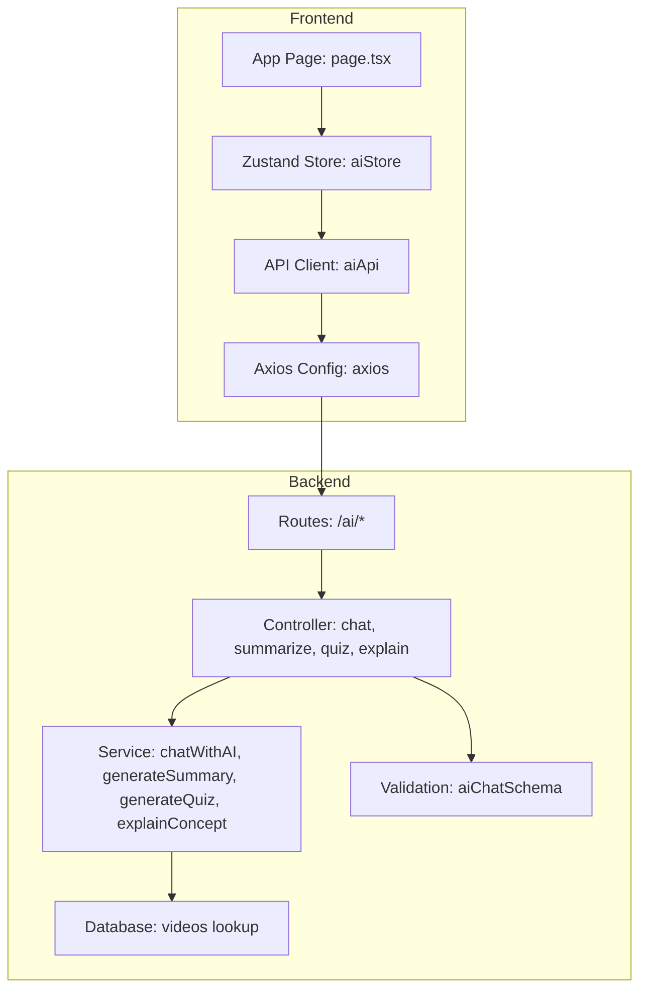
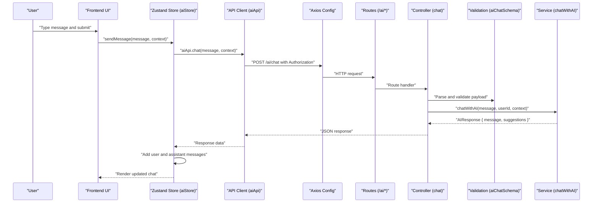
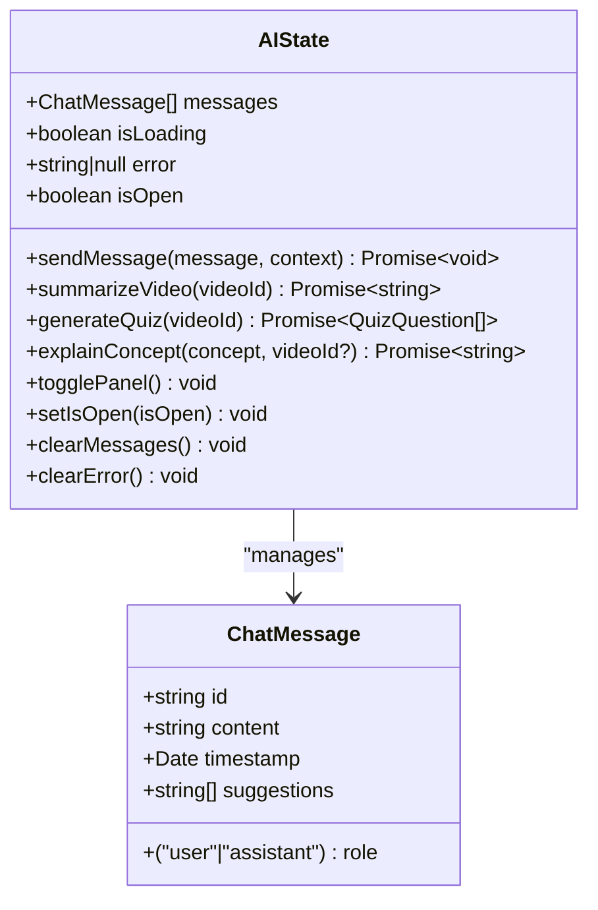
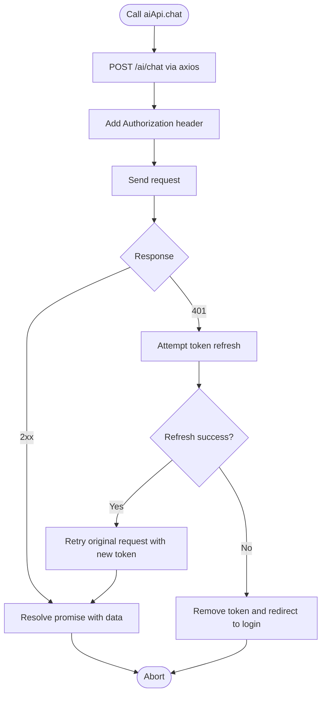
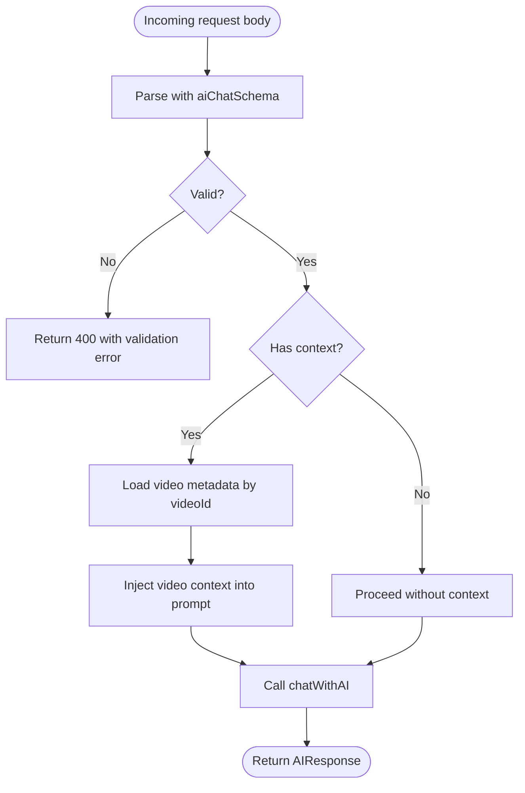
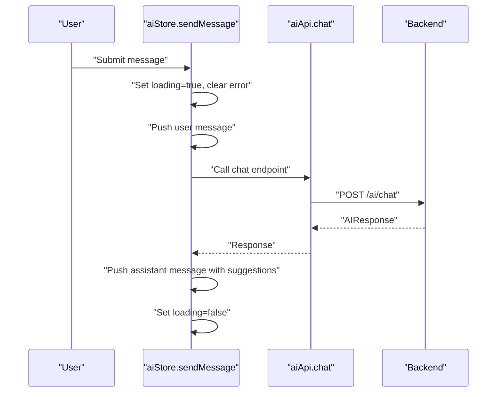
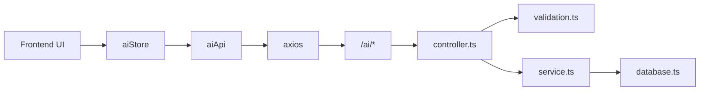

# Chat Interface

<cite>
**Referenced Files in This Document**
- [controller.ts](file://backend/src/modules/ai/controller.ts)
- [service.ts](file://backend/src/modules/ai/service.ts)
- [routes.ts](file://backend/src/modules/ai/routes.ts)
- [validation.ts](file://backend/src/utils/validation.ts)
- [index.ts](file://backend/src/routes/index.ts)
- [aiStore.ts](file://frontend/app/store/aiStore.ts)
- [api.ts](file://frontend/app/lib/api.ts)
- [axios.ts](file://frontend/app/lib/axios.ts)
- [page.tsx](file://frontend/app/page.tsx)
</cite>

## Table of Contents
1. [Introduction](#introduction)
2. [Project Structure](#project-structure)
3. [Core Components](#core-components)
4. [Architecture Overview](#architecture-overview)
5. [Detailed Component Analysis](#detailed-component-analysis)
6. [Dependency Analysis](#dependency-analysis)
7. [Performance Considerations](#performance-considerations)
8. [Troubleshooting Guide](#troubleshooting-guide)
9. [Conclusion](#conclusion)

## Introduction
This document provides comprehensive documentation for the AI chat interface functionality. It covers the backend chat controller and service implementation, message validation, context handling, and conversation flow management. On the frontend, it documents the state management with Zustand, real-time message display, and user interaction patterns. It also includes examples of chat message formatting, context preservation, error handling, loading states, conversation history management, message persistence considerations, and user experience optimizations for seamless AI interactions.

## Project Structure
The chat interface spans both backend and frontend layers:
- Backend: Express routes, controller, service, and validation modules for AI chat and related features.
- Frontend: Zustand store for state management, Axios-based API client, and integration points in the application layout.

**Diagram sources**
- [routes.ts:1-13](file://backend/src/modules/ai/routes.ts#L1-L13)
- [controller.ts:1-73](file://backend/src/modules/ai/controller.ts#L1-L73)
- [service.ts:1-151](file://backend/src/modules/ai/service.ts#L1-L151)
- [validation.ts:19-25](file://backend/src/utils/validation.ts#L19-L25)
- [aiStore.ts:1-129](file://frontend/app/store/aiStore.ts#L1-L129)
- [api.ts:66-79](file://frontend/app/lib/api.ts#L66-L79)
- [axios.ts:1-61](file://frontend/app/lib/axios.ts#L1-L61)
- [page.tsx:1-165](file://frontend/app/page.tsx#L1-L165)

**Section sources**
- [routes.ts:1-13](file://backend/src/modules/ai/routes.ts#L1-L13)
- [controller.ts:1-73](file://backend/src/modules/ai/controller.ts#L1-L73)
- [service.ts:1-151](file://backend/src/modules/ai/service.ts#L1-L151)
- [validation.ts:19-25](file://backend/src/utils/validation.ts#L19-L25)
- [aiStore.ts:1-129](file://frontend/app/store/aiStore.ts#L1-L129)
- [api.ts:66-79](file://frontend/app/lib/api.ts#L66-L79)
- [axios.ts:1-61](file://frontend/app/lib/axios.ts#L1-L61)
- [page.tsx:1-165](file://frontend/app/page.tsx#L1-L165)

## Core Components
- Backend AI Routes: Expose endpoints for chat, summarization, quiz generation, and concept explanation under the /ai namespace.
- Controller: Handles authenticated requests, validates input, and orchestrates service calls.
- Service: Implements chat logic with optional video context retrieval, mock AI responses, and helper functions for summaries, quizzes, and explanations.
- Validation: Defines strict schema for chat messages and context payloads.
- Frontend Zustand Store: Manages chat messages, loading states, errors, and panel visibility; integrates with API client.
- API Client: Provides typed methods for AI endpoints and centralizes HTTP configuration.
- Axios Configuration: Adds authentication tokens and handles token refresh automatically.

**Section sources**
- [routes.ts:1-13](file://backend/src/modules/ai/routes.ts#L1-L13)
- [controller.ts:1-73](file://backend/src/modules/ai/controller.ts#L1-L73)
- [service.ts:1-151](file://backend/src/modules/ai/service.ts#L1-L151)
- [validation.ts:19-25](file://backend/src/utils/validation.ts#L19-L25)
- [aiStore.ts:1-129](file://frontend/app/store/aiStore.ts#L1-L129)
- [api.ts:66-79](file://frontend/app/lib/api.ts#L66-L79)
- [axios.ts:13-58](file://frontend/app/lib/axios.ts#L13-L58)

## Architecture Overview
The chat interface follows a clean separation of concerns:
- Frontend triggers actions in the Zustand store.
- Store invokes the API client with message and optional context.
- API client sends authenticated requests to backend routes.
- Controller validates payload and delegates to service.
- Service optionally enriches context from the database and returns mock AI responses.
- Store updates UI state with messages, suggestions, loading, and error indicators.

**Diagram sources**
- [aiStore.ts:41-77](file://frontend/app/store/aiStore.ts#L41-L77)
- [api.ts:68-69](file://frontend/app/lib/api.ts#L68-L69)
- [axios.ts:14-25](file://frontend/app/lib/axios.ts#L14-L25)
- [routes.ts:7](file://backend/src/modules/ai/routes.ts#L7)
- [controller.ts:7-21](file://backend/src/modules/ai/controller.ts#L7-L21)
- [validation.ts:19-25](file://backend/src/utils/validation.ts#L19-L25)
- [service.ts:60-86](file://backend/src/modules/ai/service.ts#L60-L86)

## Detailed Component Analysis

### Backend Chat Controller
- Authentication: Requires a valid user session before processing chat requests.
- Validation: Uses Zod schema to enforce presence and shape of message and optional context.
- Delegation: Calls service function with validated inputs and responds with structured JSON.

Key behaviors:
- Enforces authentication and returns 401 if missing.
- Parses and validates request body using aiChatSchema.
- Invokes chatWithAI with message, user ID, and optional context.
- Returns standardized AIResponse.

**Section sources**
- [controller.ts:7-21](file://backend/src/modules/ai/controller.ts#L7-L21)
- [validation.ts:19-25](file://backend/src/utils/validation.ts#L19-L25)

### Backend AI Service
- Context enrichment: Retrieves current video metadata when videoId is provided and injects it into the prompt context.
- Mock AI responses: Keyword-based responses for commands like summarize, explain, quiz, note, with suggested follow-ups.
- Structured outputs: Returns message and optional suggestions array for UI rendering.

Important implementation details:
- Video context retrieval via database query.
- Consistent AIResponse shape for downstream consumption.
- Helper functions for generateSummary, generateQuiz, and explainConcept.

**Section sources**
- [service.ts:60-86](file://backend/src/modules/ai/service.ts#L60-L86)
- [service.ts:88-100](file://backend/src/modules/ai/service.ts#L88-L100)
- [service.ts:102-145](file://backend/src/modules/ai/service.ts#L102-L145)
- [service.ts:147-150](file://backend/src/modules/ai/service.ts#L147-L150)

### Backend Routes and Application Wiring
- Route registration: Mounts AI routes under /ai with authentication middleware applied.
- Application router: Registers AI routes alongside other module routes.

**Section sources**
- [routes.ts:1-13](file://backend/src/modules/ai/routes.ts#L1-L13)
- [index.ts:22](file://backend/src/routes/index.ts#L22)

### Frontend Zustand Store (aiStore)
State model:
- messages: Array of ChatMessage with id, role, content, timestamp, and optional suggestions.
- isLoading: Boolean flag indicating ongoing network operation.
- error: String|null for displaying error messages.
- isOpen: Boolean controlling chat panel visibility.

Actions:
- sendMessage: Adds user message, calls aiApi.chat, merges assistant response with suggestions, manages loading and error states.
- summarizeVideo, generateQuiz, explainConcept: Similar pattern for specialized AI features.
- UI controls: togglePanel, setIsOpen, clearMessages, clearError.

**Diagram sources**
- [aiStore.ts:4-33](file://frontend/app/store/aiStore.ts#L4-L33)

**Section sources**
- [aiStore.ts:18-33](file://frontend/app/store/aiStore.ts#L18-L33)
- [aiStore.ts:41-77](file://frontend/app/store/aiStore.ts#L41-L77)
- [aiStore.ts:79-122](file://frontend/app/store/aiStore.ts#L79-L122)

### Frontend API Client and Axios Configuration
- aiApi exposes typed methods for chat, summarize, quiz, and explain.
- Axios client configured with base URL, credentials, and interceptors.
- Request interceptor adds Authorization header from localStorage.
- Response interceptor handles token refresh on 401 and redirects to login if refresh fails.

**Diagram sources**
- [api.ts:66-79](file://frontend/app/lib/api.ts#L66-L79)
- [axios.ts:14-58](file://frontend/app/lib/axios.ts#L14-L58)

**Section sources**
- [api.ts:66-79](file://frontend/app/lib/api.ts#L66-L79)
- [axios.ts:14-58](file://frontend/app/lib/axios.ts#L14-L58)

### Message Validation and Context Handling
- Validation schema enforces:
  - message: required string.
  - context: optional object with videoId and subjectId as optional strings.
- Controller parses and validates incoming payload before proceeding.
- Service optionally enriches context by fetching video metadata and constructing a context string for the AI.

**Diagram sources**
- [validation.ts:19-25](file://backend/src/utils/validation.ts#L19-L25)
- [controller.ts:13](file://backend/src/modules/ai/controller.ts#L13)
- [service.ts:60-75](file://backend/src/modules/ai/service.ts#L60-L75)

**Section sources**
- [validation.ts:19-25](file://backend/src/utils/validation.ts#L19-L25)
- [controller.ts:13](file://backend/src/modules/ai/controller.ts#L13)
- [service.ts:60-75](file://backend/src/modules/ai/service.ts#L60-L75)

### Conversation Flow Management
- User message lifecycle:
  - Add user message to state immediately upon send.
  - Set loading=true and clear previous errors.
  - Call backend chat endpoint.
  - On success, append assistant message with suggestions.
  - On failure, set error message and keep loading=false.
- Panel controls:
  - togglePanel and setIsOpen manage visibility.
- Clearing:
  - clearMessages resets conversation history.
  - clearError clears transient errors.

**Diagram sources**
- [aiStore.ts:41-77](file://frontend/app/store/aiStore.ts#L41-L77)
- [api.ts:68-69](file://frontend/app/lib/api.ts#L68-L69)
- [controller.ts:14-20](file://backend/src/modules/ai/controller.ts#L14-L20)
- [service.ts:79](file://backend/src/modules/ai/service.ts#L79)

**Section sources**
- [aiStore.ts:41-77](file://frontend/app/store/aiStore.ts#L41-L77)
- [controller.ts:14-20](file://backend/src/modules/ai/controller.ts#L14-L20)
- [service.ts:79](file://backend/src/modules/ai/service.ts#L79)

### Examples of Chat Message Formatting and Context Preservation
- Message formatting:
  - Assistant responses include structured text and optional suggestions for follow-up actions.
  - Suggestions enable quick user-driven navigation to summarize, explain, quiz, or note generation.
- Context preservation:
  - When videoId is present, the service fetches the video title and description and incorporates them into the context string passed to the AI.
  - This ensures that conversational relevance remains tied to the current learning material.

**Section sources**
- [service.ts:24-57](file://backend/src/modules/ai/service.ts#L24-L57)
- [service.ts:67-75](file://backend/src/modules/ai/service.ts#L67-L75)

### Error Handling and Loading States
- Frontend:
  - Loading state prevents duplicate submissions and indicates network activity.
  - Errors are captured from response data or defaulted to a generic message; cleared on successful operations.
- Backend:
  - Validation errors return 400 with structured error messages.
  - Missing authentication returns 401.
  - Resource-not-found conditions (e.g., video lookup) surface meaningful errors.

**Section sources**
- [aiStore.ts:71-76](file://frontend/app/store/aiStore.ts#L71-L76)
- [controller.ts:8-11](file://backend/src/modules/ai/controller.ts#L8-L11)
- [controller.ts:31-34](file://backend/src/modules/ai/controller.ts#L31-L34)
- [service.ts:94-96](file://backend/src/modules/ai/service.ts#L94-L96)

### Conversation History Management and Persistence
- Current state:
  - Messages are stored in frontend Zustand store and rendered in real time.
- Persistence considerations:
  - No server-side message persistence is implemented in the current code.
  - Recommendations:
    - Persist messages per user and per video context in the database.
    - Provide endpoints to load conversation history by videoId or session.
    - Implement optimistic updates and conflict resolution for concurrent edits.

**Section sources**
- [aiStore.ts:36](file://frontend/app/store/aiStore.ts#L36)
- [service.ts:82-83](file://backend/src/modules/ai/service.ts#L82-L83)

### User Experience Optimization
- Immediate feedback:
  - User messages appear instantly; assistant replies stream in after backend processing.
- Suggested actions:
  - Assistant responses include actionable suggestions to guide further exploration.
- Accessibility and UX:
  - Keep loading indicators visible during network requests.
  - Provide clear error messaging with retry options.
  - Allow users to toggle the chat panel and clear conversation history.

**Section sources**
- [aiStore.ts:59-65](file://frontend/app/store/aiStore.ts#L59-L65)
- [service.ts:28](file://backend/src/modules/ai/service.ts#L28)
- [service.ts:36](file://backend/src/modules/ai/service.ts#L36)

## Dependency Analysis
The chat interface exhibits low coupling and high cohesion:
- Frontend depends on aiApi and axios for HTTP communication.
- Backend routes depend on controller and validation modules.
- Controller depends on service and shared validation schema.
- Service depends on database configuration for context enrichment.

**Diagram sources**
- [aiStore.ts:1-2](file://frontend/app/store/aiStore.ts#L1-L2)
- [api.ts:1-2](file://frontend/app/lib/api.ts#L1-L2)
- [axios.ts:1-2](file://frontend/app/lib/axios.ts#L1-L2)
- [routes.ts:1-13](file://backend/src/modules/ai/routes.ts#L1-L13)
- [controller.ts:1-6](file://backend/src/modules/ai/controller.ts#L1-L6)
- [validation.ts:1-2](file://backend/src/utils/validation.ts#L1-L2)
- [service.ts:1](file://backend/src/config/database.ts)

**Section sources**
- [routes.ts:1-13](file://backend/src/modules/ai/routes.ts#L1-L13)
- [controller.ts:1-6](file://backend/src/modules/ai/controller.ts#L1-L6)
- [service.ts:1](file://backend/src/config/database.ts)

## Performance Considerations
- Network latency:
  - The mock AI service simulates delay; production integrations should leverage streaming responses for smoother UX.
- Debouncing:
  - Consider debouncing rapid successive sends to reduce redundant requests.
- Rendering:
  - Virtualized lists for long conversations to maintain smooth scrolling.
- Caching:
  - Cache recent summaries and explanations keyed by videoId to minimize repeated calls.

## Troubleshooting Guide
Common issues and resolutions:
- Authentication failures:
  - Verify Authorization header is present and token is valid; ensure token refresh logic executes on 401 responses.
- Validation errors:
  - Ensure message is non-empty and context object (if provided) contains optional videoId/subjectId strings.
- Resource not found:
  - VideoId must correspond to an existing record; otherwise, backend throws a not-found error.
- UI not updating:
  - Confirm isLoading flags are toggled and messages are appended after successful responses.

**Section sources**
- [axios.ts:34-54](file://frontend/app/lib/axios.ts#L34-L54)
- [validation.ts:19-25](file://backend/src/utils/validation.ts#L19-L25)
- [controller.ts:31-34](file://backend/src/modules/ai/controller.ts#L31-L34)
- [service.ts:94-96](file://backend/src/modules/ai/service.ts#L94-L96)

## Conclusion
The AI chat interface is built with a clear separation between frontend state management and backend orchestration. The system supports contextual chat, structured responses with suggestions, robust validation, and resilient HTTP handling. Future enhancements should focus on message persistence, streaming responses, and improved UX patterns to deliver a seamless AI-assisted learning experience.