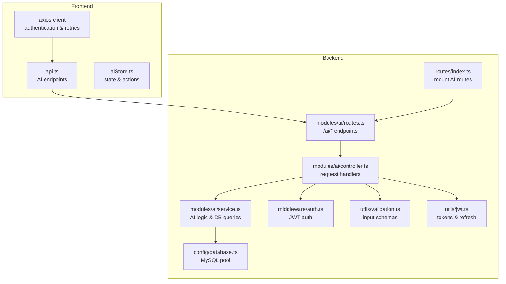
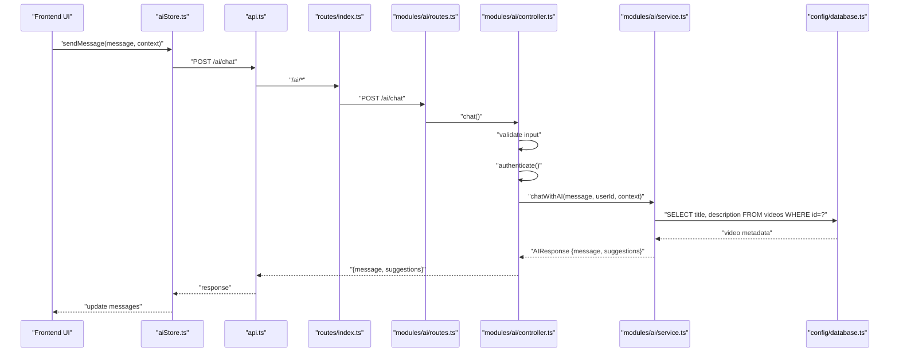
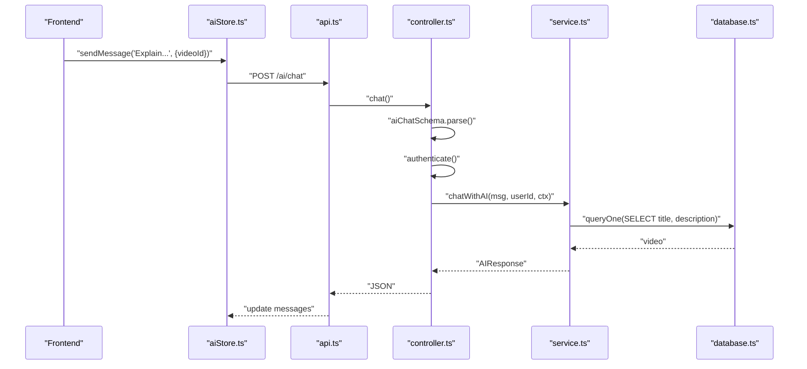
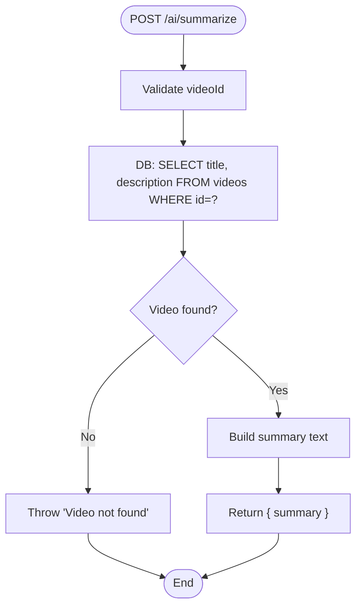
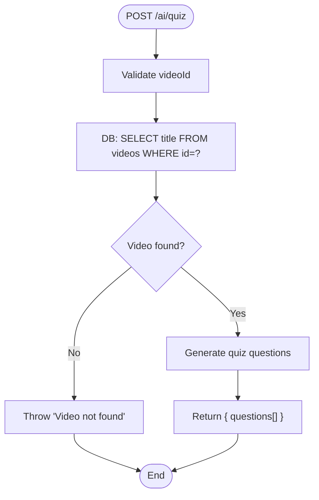
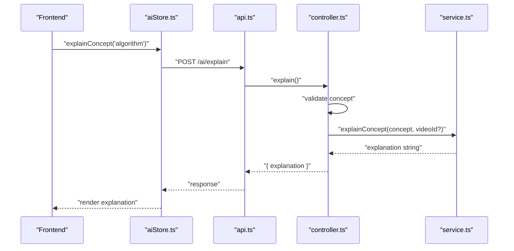
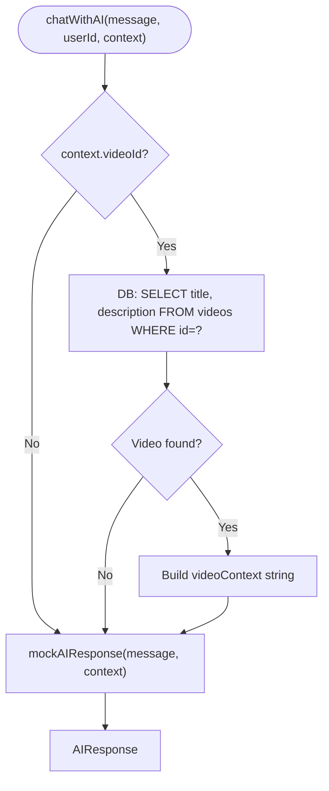
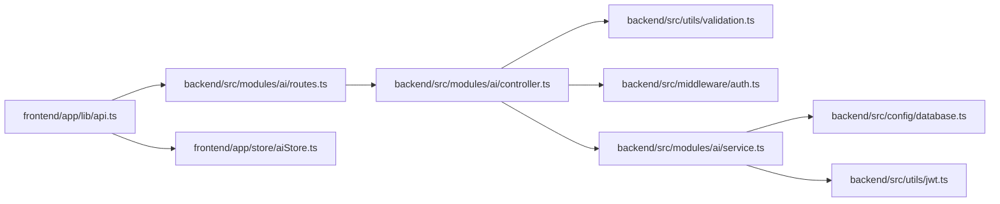

# Concept Explanation

<cite>
**Referenced Files in This Document**
- [controller.ts](file://backend/src/modules/ai/controller.ts)
- [service.ts](file://backend/src/modules/ai/service.ts)
- [routes.ts](file://backend/src/modules/ai/routes.ts)
- [validation.ts](file://backend/src/utils/validation.ts)
- [auth.ts](file://backend/src/middleware/auth.ts)
- [index.ts](file://backend/src/routes/index.ts)
- [database.ts](file://backend/src/config/database.ts)
- [jwt.ts](file://backend/src/utils/jwt.ts)
- [api.ts](file://frontend/app/lib/api.ts)
- [axios.ts](file://frontend/app/lib/axios.ts)
- [aiStore.ts](file://frontend/app/store/aiStore.ts)
- [004_create_videos.sql](file://backend/migrations/004_create_videos.sql)
</cite>

## Table of Contents
1. [Introduction](#introduction)
2. [Project Structure](#project-structure)
3. [Core Components](#core-components)
4. [Architecture Overview](#architecture-overview)
5. [Detailed Component Analysis](#detailed-component-analysis)
6. [Dependency Analysis](#dependency-analysis)
7. [Performance Considerations](#performance-considerations)
8. [Troubleshooting Guide](#troubleshooting-guide)
9. [Conclusion](#conclusion)
10. [Appendices](#appendices)

## Introduction
This document describes the AI concept explanation system that powers personalized, contextualized learning within the platform. It explains how concept explanations are generated, how the system integrates with video content, and how it supports interactive learning via chat, summaries, quizzes, and concept explanations. The system is designed to be extensible so that the current mock AI responses can be replaced with real AI APIs while preserving the same interfaces and user experience.

## Project Structure
The AI subsystem is organized around a clear separation of concerns:
- Backend routes define the public endpoints for AI features.
- Controllers validate inputs and enforce authentication.
- Services encapsulate AI logic and data retrieval.
- Frontend stores manage UI state and async actions.
- Utilities and middleware support validation, authentication, and database access.

**Diagram sources**
- [index.ts:1-25](file://backend/src/routes/index.ts#L1-L25)
- [routes.ts:1-13](file://backend/src/modules/ai/routes.ts#L1-L13)
- [controller.ts:1-73](file://backend/src/modules/ai/controller.ts#L1-L73)
- [service.ts:1-151](file://backend/src/modules/ai/service.ts#L1-L151)
- [validation.ts:1-31](file://backend/src/utils/validation.ts#L1-L31)
- [auth.ts:1-42](file://backend/src/middleware/auth.ts#L1-L42)
- [database.ts:1-53](file://backend/src/config/database.ts#L1-L53)
- [jwt.ts:1-78](file://backend/src/utils/jwt.ts#L1-L78)
- [api.ts:1-80](file://frontend/app/lib/api.ts#L1-L80)
- [axios.ts:1-61](file://frontend/app/lib/axios.ts#L1-L61)
- [aiStore.ts:1-129](file://frontend/app/store/aiStore.ts#L1-L129)

**Section sources**
- [index.ts:1-25](file://backend/src/routes/index.ts#L1-L25)
- [routes.ts:1-13](file://backend/src/modules/ai/routes.ts#L1-L13)
- [controller.ts:1-73](file://backend/src/modules/ai/controller.ts#L1-L73)
- [service.ts:1-151](file://backend/src/modules/ai/service.ts#L1-L151)
- [validation.ts:1-31](file://backend/src/utils/validation.ts#L1-L31)
- [auth.ts:1-42](file://backend/src/middleware/auth.ts#L1-L42)
- [database.ts:1-53](file://backend/src/config/database.ts#L1-L53)
- [jwt.ts:1-78](file://backend/src/utils/jwt.ts#L1-L78)
- [api.ts:1-80](file://frontend/app/lib/api.ts#L1-L80)
- [axios.ts:1-61](file://frontend/app/lib/axios.ts#L1-L61)
- [aiStore.ts:1-129](file://frontend/app/store/aiStore.ts#L1-L129)

## Core Components
- AI Routes: Expose four endpoints under /ai:
  - POST /ai/chat for conversational AI with optional context
  - POST /ai/summarize for generating a textual summary of a video
  - POST /ai/quiz for generating quiz questions for a video
  - POST /ai/explain for generating a contextual explanation of a concept
- AI Controller: Validates requests, enforces authentication, and delegates to services.
- AI Service: Implements mock AI responses and contextualization logic; includes DB queries for video metadata.
- Validation: Zod schemas for AI chat inputs (message, optional context).
- Authentication: Middleware to extract and verify JWTs; optional-auth variant for non-mandatory contexts.
- Frontend API Layer: Typed wrappers for AI endpoints.
- Frontend Store: Zustand store managing messages, loading states, errors, and actions for AI features.

**Section sources**
- [routes.ts:1-13](file://backend/src/modules/ai/routes.ts#L1-L13)
- [controller.ts:1-73](file://backend/src/modules/ai/controller.ts#L1-L73)
- [service.ts:1-151](file://backend/src/modules/ai/service.ts#L1-L151)
- [validation.ts:19-25](file://backend/src/utils/validation.ts#L19-L25)
- [auth.ts:8-24](file://backend/src/middleware/auth.ts#L8-L24)
- [api.ts:66-79](file://frontend/app/lib/api.ts#L66-L79)
- [aiStore.ts:18-33](file://frontend/app/store/aiStore.ts#L18-L33)

## Architecture Overview
The AI subsystem follows a layered architecture:
- Presentation: Frontend components trigger actions via aiStore, which call aiApi.
- API: Express routes forward to controllers.
- Application: Controllers validate and authenticate, then call services.
- Persistence: Services query the database for video metadata.
- External AI: Services currently use mock responses; production-ready services would integrate with external AI providers.

**Diagram sources**
- [index.ts:16-22](file://backend/src/routes/index.ts#L16-L22)
- [routes.ts:7](file://backend/src/modules/ai/routes.ts#L7)
- [controller.ts:7-21](file://backend/src/modules/ai/controller.ts#L7-L21)
- [service.ts:60-86](file://backend/src/modules/ai/service.ts#L60-L86)
- [database.ts:19-29](file://backend/src/config/database.ts#L19-L29)
- [api.ts:67-69](file://frontend/app/lib/api.ts#L67-L69)
- [aiStore.ts:41-77](file://frontend/app/store/aiStore.ts#L41-L77)

## Detailed Component Analysis

### AI Chat Workflow
The chat endpoint supports contextual awareness by accepting a videoId or subjectId in the request body. The controller validates inputs and ensures authentication. The service retrieves video metadata to enrich the AI prompt and returns a structured response with a message and suggested follow-up prompts.

**Diagram sources**
- [controller.ts:7-21](file://backend/src/modules/ai/controller.ts#L7-L21)
- [service.ts:60-86](file://backend/src/modules/ai/service.ts#L60-L86)
- [database.ts:19-29](file://backend/src/config/database.ts#L19-L29)
- [validation.ts:19-25](file://backend/src/utils/validation.ts#L19-L25)
- [auth.ts:8-24](file://backend/src/middleware/auth.ts#L8-L24)
- [api.ts:67-69](file://frontend/app/lib/api.ts#L67-L69)
- [aiStore.ts:41-77](file://frontend/app/store/aiStore.ts#L41-L77)

**Section sources**
- [controller.ts:7-21](file://backend/src/modules/ai/controller.ts#L7-L21)
- [service.ts:60-86](file://backend/src/modules/ai/service.ts#L60-L86)
- [validation.ts:19-25](file://backend/src/utils/validation.ts#L19-L25)
- [auth.ts:8-24](file://backend/src/middleware/auth.ts#L8-L24)
- [api.ts:67-69](file://frontend/app/lib/api.ts#L67-L69)
- [aiStore.ts:41-77](file://frontend/app/store/aiStore.ts#L41-L77)

### Video Summary Generation
The summarize endpoint requires a videoId and returns a formatted summary string. The service fetches the video title and description from the database and constructs a summary template.

**Diagram sources**
- [controller.ts:23-38](file://backend/src/modules/ai/controller.ts#L23-L38)
- [service.ts:88-100](file://backend/src/modules/ai/service.ts#L88-L100)
- [database.ts:19-29](file://backend/src/config/database.ts#L19-L29)

**Section sources**
- [controller.ts:23-38](file://backend/src/modules/ai/controller.ts#L23-L38)
- [service.ts:88-100](file://backend/src/modules/ai/service.ts#L88-L100)
- [database.ts:19-29](file://backend/src/config/database.ts#L19-L29)

### Quiz Generation
The quiz endpoint generates multiple-choice questions aligned to a video’s content. The service fetches the video title and returns a fixed set of questions with options and indices for correct answers.

**Diagram sources**
- [controller.ts:40-55](file://backend/src/modules/ai/controller.ts#L40-L55)
- [service.ts:102-145](file://backend/src/modules/ai/service.ts#L102-L145)
- [database.ts:19-29](file://backend/src/config/database.ts#L19-L29)

**Section sources**
- [controller.ts:40-55](file://backend/src/modules/ai/controller.ts#L40-L55)
- [service.ts:102-145](file://backend/src/modules/ai/service.ts#L102-L145)
- [database.ts:19-29](file://backend/src/config/database.ts#L19-L29)

### Concept Explanation
The explain endpoint accepts a concept name and an optional videoId. The service returns a structured explanation tailored to the concept, optionally enriched by video context.

**Diagram sources**
- [controller.ts:57-72](file://backend/src/modules/ai/controller.ts#L57-L72)
- [service.ts:147-150](file://backend/src/modules/ai/service.ts#L147-L150)
- [api.ts:77-78](file://frontend/app/lib/api.ts#L77-L78)
- [aiStore.ts:109-122](file://frontend/app/store/aiStore.ts#L109-L122)

**Section sources**
- [controller.ts:57-72](file://backend/src/modules/ai/controller.ts#L57-L72)
- [service.ts:147-150](file://backend/src/modules/ai/service.ts#L147-L150)
- [api.ts:77-78](file://frontend/app/lib/api.ts#L77-L78)
- [aiStore.ts:109-122](file://frontend/app/store/aiStore.ts#L109-L122)

### Contextualization Based on Video Content
The service demonstrates contextualization by retrieving the current video’s title and description and incorporating them into the AI response pipeline. This allows explanations and summaries to be grounded in the learner’s current activity.

**Diagram sources**
- [service.ts:60-86](file://backend/src/modules/ai/service.ts#L60-L86)
- [database.ts:19-29](file://backend/src/config/database.ts#L19-L29)

**Section sources**
- [service.ts:60-86](file://backend/src/modules/ai/service.ts#L60-L86)
- [database.ts:19-29](file://backend/src/config/database.ts#L19-L29)

### Pedagogical Approaches and Adaptive Learning Strategies
- Conversational scaffolding: The mock AI provides follow-up suggestions to guide learners toward deeper engagement (e.g., “Explain more,” “Give me examples,” “Create a quiz”).
- Concept-to-practice mapping: Explanations include “Why It Matters,” “How to Practice,” and “Common Questions” to connect theory with actionable steps.
- Adaptive content delivery: Summaries and quizzes are generated per video, aligning instruction with the learner’s current context.
- Personalization hooks: The system accepts optional subjectId in the chat context, enabling cross-topic alignment when integrated with subject/curriculum data.

Note: These pedagogical patterns are demonstrated in the mock responses and can be extended to incorporate proficiency-based adaptation and spaced repetition when integrated with learner progress and assessment systems.

**Section sources**
- [service.ts:15-58](file://backend/src/modules/ai/service.ts#L15-L58)
- [service.ts:147-150](file://backend/src/modules/ai/service.ts#L147-L150)
- [validation.ts:19-25](file://backend/src/utils/validation.ts#L19-L25)

### Interactive Learning Features
- Chat panel with suggestions: The frontend store captures suggestions from AI responses and renders interactive follow-ups.
- Panel toggling: The store exposes open/close controls for the AI panel.
- Loading and error states: The store manages UI feedback during async operations.

**Section sources**
- [aiStore.ts:18-33](file://frontend/app/store/aiStore.ts#L18-L33)
- [aiStore.ts:41-77](file://frontend/app/store/aiStore.ts#L41-L77)
- [aiStore.ts:109-122](file://frontend/app/store/aiStore.ts#L109-L122)

### Examples of Explanation Formats
- Chat responses: Structured text with optional suggestion prompts.
- Summaries: Markdown-formatted summaries with headings and bullet lists.
- Quiz items: Objects containing questions, options, and correct answer indices.
- Concept explanations: Markdown-formatted explanations with headings, lists, and Q&A.

These formats are returned by the backend and rendered by the frontend components.

**Section sources**
- [service.ts:9-12](file://backend/src/modules/ai/service.ts#L9-L12)
- [service.ts:25-57](file://backend/src/modules/ai/service.ts#L25-L57)
- [service.ts:88-100](file://backend/src/modules/ai/service.ts#L88-L100)
- [service.ts:102-145](file://backend/src/modules/ai/service.ts#L102-L145)
- [service.ts:147-150](file://backend/src/modules/ai/service.ts#L147-L150)

### Multimedia Integration
- Video metadata: The system retrieves titles and descriptions from the videos table to contextualize AI outputs.
- YouTube integration: The videos table includes a YouTube video identifier, enabling embedding and playback in the broader platform.

**Section sources**
- [004_create_videos.sql:1-15](file://backend/migrations/004_create_videos.sql#L1-L15)
- [service.ts:68-75](file://backend/src/modules/ai/service.ts#L68-L75)

### Customization Options
- Context-awareness: Pass videoId or subjectId in the chat context to tailor responses.
- Endpoint flexibility: Separate endpoints for chat, summarize, quiz, and explain allow fine-grained customization of the learning experience.
- Frontend store actions: The store exposes actions to toggle the panel, clear messages, and manage errors.

**Section sources**
- [validation.ts:19-25](file://backend/src/utils/validation.ts#L19-L25)
- [routes.ts:7-10](file://backend/src/modules/ai/routes.ts#L7-L10)
- [aiStore.ts:124-127](file://frontend/app/store/aiStore.ts#L124-L127)

### Explanation Quality Metrics
The current implementation uses mock responses. To evaluate quality, production integrations could:
- Capture latency and success rates for AI API calls.
- Track user engagement with suggestions and follow-up actions.
- Measure quiz completion and correctness to infer comprehension.
- Log user feedback and sentiment for continuous improvement.

[No sources needed since this section provides general guidance]

### Integration with the Broader Learning Platform
- Authentication: All AI endpoints require a valid JWT; refresh tokens are supported.
- Routing: AI routes are mounted under /api and exposed via the central router.
- Database: Shared MySQL pool enables cross-module data access for video metadata and other domain entities.
- Frontend: Axios client handles authentication headers and token refresh; the AI store coordinates async flows.

**Section sources**
- [auth.ts:8-24](file://backend/src/middleware/auth.ts#L8-L24)
- [jwt.ts:20-41](file://backend/src/utils/jwt.ts#L20-L41)
- [index.ts:16-22](file://backend/src/routes/index.ts#L16-L22)
- [database.ts:19-50](file://backend/src/config/database.ts#L19-L50)
- [axios.ts:13-58](file://frontend/app/lib/axios.ts#L13-L58)

## Dependency Analysis
The AI module depends on:
- Express routes and controllers for HTTP handling
- Zod schemas for input validation
- JWT middleware for authentication
- Database abstraction for video metadata
- Frontend API and store for user interactions

**Diagram sources**
- [api.ts:66-79](file://frontend/app/lib/api.ts#L66-L79)
- [routes.ts:1-13](file://backend/src/modules/ai/routes.ts#L1-L13)
- [controller.ts:1-73](file://backend/src/modules/ai/controller.ts#L1-L73)
- [validation.ts:1-31](file://backend/src/utils/validation.ts#L1-L31)
- [auth.ts:1-42](file://backend/src/middleware/auth.ts#L1-L42)
- [service.ts:1-151](file://backend/src/modules/ai/service.ts#L1-L151)
- [database.ts:1-53](file://backend/src/config/database.ts#L1-L53)
- [jwt.ts:1-78](file://backend/src/utils/jwt.ts#L1-L78)
- [aiStore.ts:1-129](file://frontend/app/store/aiStore.ts#L1-L129)

**Section sources**
- [routes.ts:1-13](file://backend/src/modules/ai/routes.ts#L1-L13)
- [controller.ts:1-73](file://backend/src/modules/ai/controller.ts#L1-L73)
- [service.ts:1-151](file://backend/src/modules/ai/service.ts#L1-L151)
- [validation.ts:1-31](file://backend/src/utils/validation.ts#L1-L31)
- [auth.ts:1-42](file://backend/src/middleware/auth.ts#L1-L42)
- [database.ts:1-53](file://backend/src/config/database.ts#L1-L53)
- [jwt.ts:1-78](file://backend/src/utils/jwt.ts#L1-L78)
- [api.ts:1-80](file://frontend/app/lib/api.ts#L1-L80)
- [aiStore.ts:1-129](file://frontend/app/store/aiStore.ts#L1-L129)

## Performance Considerations
- Current mock responses simulate latency; production AI calls should be monitored for response times and retry policies.
- Database queries for video metadata are lightweight but should be cached if called frequently.
- Frontend state updates are efficient with Zustand; avoid unnecessary re-renders by keeping payloads minimal.
- Consider batching or debouncing chat inputs to reduce redundant requests.

[No sources needed since this section provides general guidance]

## Troubleshooting Guide
- Authentication failures: Ensure the Authorization header is present and contains a valid Bearer token. The middleware returns 401 for missing or invalid tokens.
- Validation errors: The chat endpoint requires a non-empty message and optional context object with videoId/subjectId as strings.
- Video not found: Summarize and quiz endpoints throw an error if the videoId is invalid.
- Network issues: The frontend axios client handles token refresh; persistent 401 errors lead to logout.

**Section sources**
- [auth.ts:8-24](file://backend/src/middleware/auth.ts#L8-L24)
- [validation.ts:19-25](file://backend/src/utils/validation.ts#L19-L25)
- [controller.ts:23-38](file://backend/src/modules/ai/controller.ts#L23-L38)
- [controller.ts:40-55](file://backend/src/modules/ai/controller.ts#L40-L55)
- [axios.ts:28-58](file://frontend/app/lib/axios.ts#L28-L58)

## Conclusion
The AI concept explanation system provides a robust foundation for contextualized, interactive learning. Its modular design enables straightforward replacement of mock AI responses with production-grade AI services while maintaining consistent user experiences across chat, summaries, quizzes, and concept explanations. By integrating video metadata and leveraging JWT-based authentication, the system supports personalized education experiences that can evolve with additional learner data and adaptive strategies.

## Appendices
- Endpoint reference
  - POST /api/ai/chat: Requires authenticated user; accepts { message, context: { videoId?, subjectId? } }
  - POST /api/ai/summarize: Requires authenticated user; accepts { videoId }
  - POST /api/ai/quiz: Requires authenticated user; accepts { videoId }
  - POST /api/ai/explain: Requires authenticated user; accepts { concept, videoId? }

**Section sources**
- [routes.ts:7-10](file://backend/src/modules/ai/routes.ts#L7-L10)
- [controller.ts:7-72](file://backend/src/modules/ai/controller.ts#L7-L72)
- [validation.ts:19-25](file://backend/src/utils/validation.ts#L19-L25)