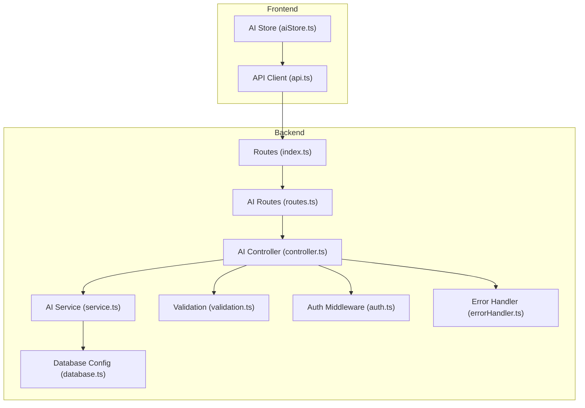
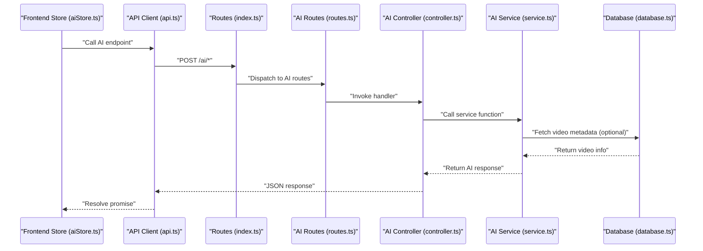
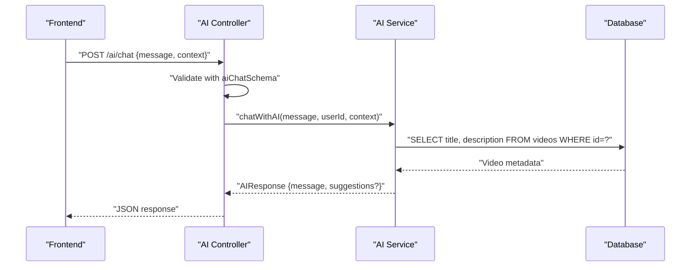
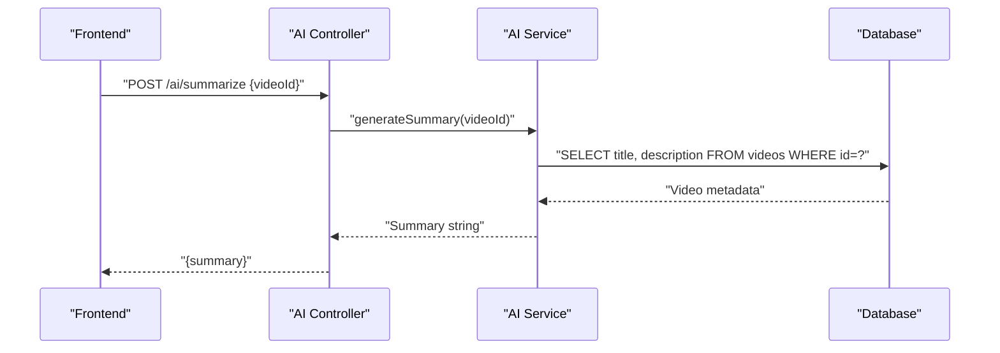
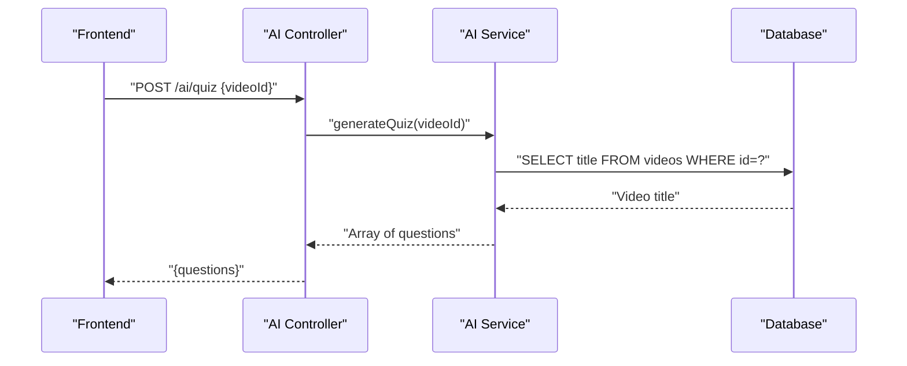
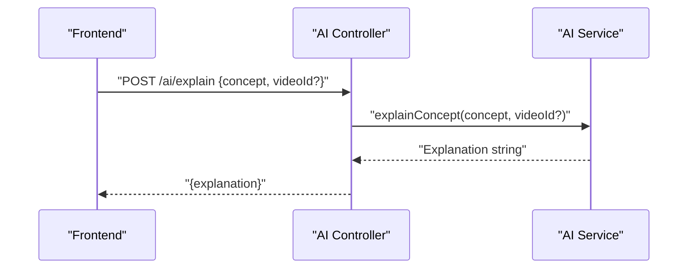
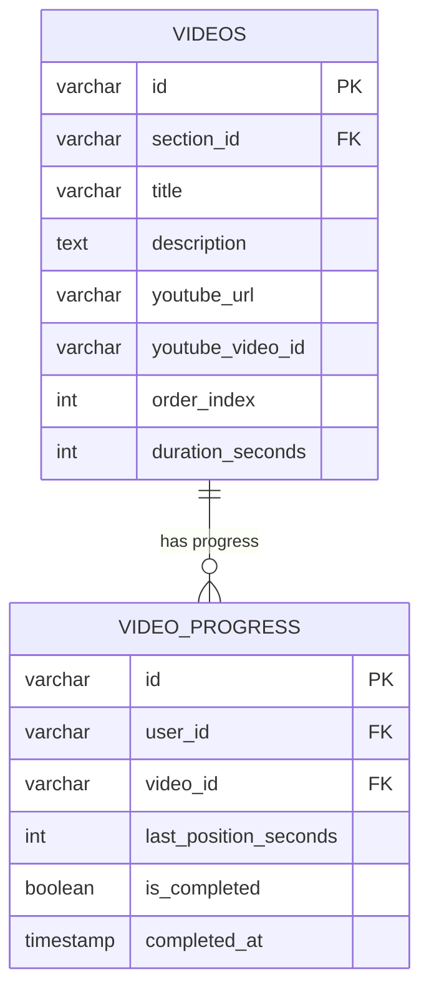
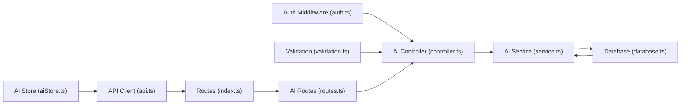

# Content Processing

<cite>
**Referenced Files in This Document**
- [controller.ts](file://backend/src/modules/ai/controller.ts)
- [service.ts](file://backend/src/modules/ai/service.ts)
- [routes.ts](file://backend/src/modules/ai/routes.ts)
- [validation.ts](file://backend/src/utils/validation.ts)
- [auth.ts](file://backend/src/middleware/auth.ts)
- [errorHandler.ts](file://backend/src/middleware/errorHandler.ts)
- [database.ts](file://backend/src/config/database.ts)
- [index.ts](file://backend/src/routes/index.ts)
- [aiStore.ts](file://frontend/app/store/aiStore.ts)
- [api.ts](file://frontend/app/lib/api.ts)
- [004_create_videos.sql](file://backend/migrations/004_create_videos.sql)
- [006_create_video_progress.sql](file://backend/migrations/006_create_video_progress.sql)
</cite>

## Table of Contents
1. [Introduction](#introduction)
2. [Project Structure](#project-structure)
3. [Core Components](#core-components)
4. [Architecture Overview](#architecture-overview)
5. [Detailed Component Analysis](#detailed-component-analysis)
6. [Dependency Analysis](#dependency-analysis)
7. [Performance Considerations](#performance-considerations)
8. [Troubleshooting Guide](#troubleshooting-guide)
9. [Conclusion](#conclusion)
10. [Appendices](#appendices)

## Introduction
This document describes the AI-powered content processing features implemented in the learning platform. It focuses on:
- Content summarization algorithm
- Video content analysis and automated generation workflows
- Transcript extraction and summary generation strategies
- Quality assessment criteria
- Examples of processing different content types
- Handling large videos and optimizing processing time
- Managing computational resources
- Content filtering, safety checks, and compliance for educational content

The current implementation provides a mock AI service with clear extension points for integrating real AI APIs. The backend exposes REST endpoints for chat, summarization, quiz generation, and concept explanation. The frontend integrates these endpoints via a Zustand store and API client.

## Project Structure
The AI feature spans backend modules and frontend stores:
- Backend
  - AI module: controller, service, routes
  - Validation utilities and authentication middleware
  - Database configuration and connection pooling
  - Routes composition
- Frontend
  - AI store for state and async actions
  - API client for AI endpoints

**Diagram sources**
- [index.ts:1-25](file://backend/src/routes/index.ts#L1-L25)
- [routes.ts:1-13](file://backend/src/modules/ai/routes.ts#L1-L13)
- [controller.ts:1-73](file://backend/src/modules/ai/controller.ts#L1-L73)
- [service.ts:1-151](file://backend/src/modules/ai/service.ts#L1-L151)
- [database.ts:1-53](file://backend/src/config/database.ts#L1-L53)
- [validation.ts:1-31](file://backend/src/utils/validation.ts#L1-L31)
- [auth.ts:1-42](file://backend/src/middleware/auth.ts#L1-L42)
- [errorHandler.ts:1-38](file://backend/src/middleware/errorHandler.ts#L1-L38)
- [aiStore.ts:1-129](file://frontend/app/store/aiStore.ts#L1-L129)
- [api.ts:66-79](file://frontend/app/lib/api.ts#L66-L79)

**Section sources**
- [index.ts:1-25](file://backend/src/routes/index.ts#L1-L25)
- [routes.ts:1-13](file://backend/src/modules/ai/routes.ts#L1-L13)
- [controller.ts:1-73](file://backend/src/modules/ai/controller.ts#L1-L73)
- [service.ts:1-151](file://backend/src/modules/ai/service.ts#L1-L151)
- [validation.ts:1-31](file://backend/src/utils/validation.ts#L1-L31)
- [auth.ts:1-42](file://backend/src/middleware/auth.ts#L1-L42)
- [errorHandler.ts:1-38](file://backend/src/middleware/errorHandler.ts#L1-L38)
- [aiStore.ts:1-129](file://frontend/app/store/aiStore.ts#L1-L129)
- [api.ts:66-79](file://frontend/app/lib/api.ts#L66-L79)

## Core Components
- AI Controller
  - Exposes endpoints for chat, summarize, quiz, and explain.
  - Enforces authentication and validates input using Zod schemas.
- AI Service
  - Provides mock AI responses for chat, summaries, quizzes, and concept explanations.
  - Demonstrates how to fetch video metadata for context-aware responses.
- AI Routes
  - Mounts authenticated endpoints under /ai.
- Validation
  - Defines schema for AI chat requests including optional context.
- Authentication and Error Handling
  - JWT-based authentication middleware and async error wrapper.
- Database
  - MySQL connection pool abstraction with query helpers and transactions.
- Frontend AI Store and API
  - Manages AI chat messages, loading states, errors, and exposes actions to call backend endpoints.

**Section sources**
- [controller.ts:7-72](file://backend/src/modules/ai/controller.ts#L7-L72)
- [service.ts:60-150](file://backend/src/modules/ai/service.ts#L60-L150)
- [routes.ts:7-10](file://backend/src/modules/ai/routes.ts#L7-L10)
- [validation.ts:19-25](file://backend/src/utils/validation.ts#L19-L25)
- [auth.ts:8-24](file://backend/src/middleware/auth.ts#L8-L24)
- [errorHandler.ts:33-37](file://backend/src/middleware/errorHandler.ts#L33-L37)
- [database.ts:19-50](file://backend/src/config/database.ts#L19-L50)
- [aiStore.ts:35-128](file://frontend/app/store/aiStore.ts#L35-L128)
- [api.ts:66-79](file://frontend/app/lib/api.ts#L66-L79)

## Architecture Overview
The AI feature follows a layered architecture:
- Presentation: Frontend store and API client
- Application: Express routes, controller, service
- Domain: Business logic for chat, summarization, quiz, and explanation
- Infrastructure: Database access and connection pooling

**Diagram sources**
- [aiStore.ts:41-77](file://frontend/app/store/aiStore.ts#L41-L77)
- [api.ts:66-79](file://frontend/app/lib/api.ts#L66-L79)
- [index.ts:22](file://backend/src/routes/index.ts#L22)
- [routes.ts:7-10](file://backend/src/modules/ai/routes.ts#L7-L10)
- [controller.ts:14-20](file://backend/src/modules/ai/controller.ts#L14-L20)
- [service.ts:64-86](file://backend/src/modules/ai/service.ts#L64-L86)
- [database.ts:19-29](file://backend/src/config/database.ts#L19-L29)

## Detailed Component Analysis

### AI Chat Workflow
- Endpoint: POST /ai/chat
- Responsibilities:
  - Validate request body using Zod schema.
  - Fetch video context if videoId is present.
  - Call mock AI service to generate response.
  - Return structured AIResponse with optional suggestions.

**Diagram sources**
- [controller.ts:13-20](file://backend/src/modules/ai/controller.ts#L13-L20)
- [service.ts:64-86](file://backend/src/modules/ai/service.ts#L64-L86)
- [database.ts:25-28](file://backend/src/config/database.ts#L25-L28)

**Section sources**
- [controller.ts:7-21](file://backend/src/modules/ai/controller.ts#L7-L21)
- [service.ts:60-86](file://backend/src/modules/ai/service.ts#L60-L86)
- [validation.ts:19-25](file://backend/src/utils/validation.ts#L19-L25)

### Video Summarization Workflow
- Endpoint: POST /ai/summarize
- Responsibilities:
  - Validate presence of videoId.
  - Retrieve video metadata from database.
  - Generate a mock summary string enriched with video title.

**Diagram sources**
- [controller.ts:29-37](file://backend/src/modules/ai/controller.ts#L29-L37)
- [service.ts:88-100](file://backend/src/modules/ai/service.ts#L88-L100)
- [database.ts:25-28](file://backend/src/config/database.ts#L25-L28)

**Section sources**
- [controller.ts:23-38](file://backend/src/modules/ai/controller.ts#L23-L38)
- [service.ts:88-100](file://backend/src/modules/ai/service.ts#L88-L100)

### Automated Quiz Generation Workflow
- Endpoint: POST /ai/quiz
- Responsibilities:
  - Validate presence of videoId.
  - Retrieve video title.
  - Generate mock quiz questions with options and correct answers.

**Diagram sources**
- [controller.ts:46-54](file://backend/src/modules/ai/controller.ts#L46-L54)
- [service.ts:102-145](file://backend/src/modules/ai/service.ts#L102-L145)
- [database.ts:25-28](file://backend/src/config/database.ts#L25-L28)

**Section sources**
- [controller.ts:40-55](file://backend/src/modules/ai/controller.ts#L40-L55)
- [service.ts:102-145](file://backend/src/modules/ai/service.ts#L102-L145)

### Concept Explanation Workflow
- Endpoint: POST /ai/explain
- Responsibilities:
  - Validate presence of concept.
  - Optionally accept videoId for context-aware explanation.
  - Return a mock explanation string.

**Diagram sources**
- [controller.ts:63-71](file://backend/src/modules/ai/controller.ts#L63-L71)
- [service.ts:147-150](file://backend/src/modules/ai/service.ts#L147-L150)

**Section sources**
- [controller.ts:57-72](file://backend/src/modules/ai/controller.ts#L57-L72)
- [service.ts:147-150](file://backend/src/modules/ai/service.ts#L147-L150)

### Data Models and Schema
The AI service interacts with the videos table and video_progress table. The following ER diagram illustrates relevant entities and relationships.

**Diagram sources**
- [004_create_videos.sql:1-15](file://backend/migrations/004_create_videos.sql#L1-L15)
- [006_create_video_progress.sql:1-16](file://backend/migrations/006_create_video_progress.sql#L1-L16)

**Section sources**
- [004_create_videos.sql:1-15](file://backend/migrations/004_create_videos.sql#L1-L15)
- [006_create_video_progress.sql:1-16](file://backend/migrations/006_create_video_progress.sql#L1-L16)

### Content Summarization Algorithm
- Current implementation
  - Mock summary generation that includes video title and predefined bullet points.
  - No transcript processing or AI model integration.
- Recommended enhancements
  - Integrate with a transcription service to extract audio/text segments.
  - Apply extractive or abstractive summarization using an LLM API.
  - Segment long videos into chunks, summarize each chunk, then merge with coherence checks.
  - Apply quality filters (length thresholds, keyword coverage, redundancy reduction).
- Example processing flow
  - Extract transcript from YouTube video using youtube_video_id.
  - Split transcript into timed segments aligned with video duration.
  - Generate per-chunk summaries and combine with ranking/heuristic scoring.
  - Return final summary with confidence metrics.

[No sources needed since this section provides general guidance]

### Video Content Analysis Pipeline
- Current implementation
  - Uses youtube_video_id stored in videos table.
  - No actual video analysis or transcript extraction.
- Recommended pipeline
  - Preprocessing: Validate youtube_video_id, fetch metadata (duration, thumbnails).
  - Transcription: Use a transcription API to generate timed captions/subtitles.
  - Segmentation: Divide transcript into meaningful segments (e.g., 30–60 seconds).
  - Analysis: Extract key topics, sentiment, speaker turns, and timestamps.
  - Post-processing: Filter low-confidence segments, align with video chapters if available.
- Quality assessment criteria
  - Coverage: Percentage of transcript processed vs. total duration.
  - Coherence: Sentence-level readability and topic continuity.
  - Completeness: Presence of all major sections (introduction, body, conclusion).
  - Safety: Detect and redact sensitive content; apply content safety filters.

[No sources needed since this section provides general guidance]

### Automated Content Generation Workflows
- Current implementation
  - Mock quiz generation with static questions and options.
  - Mock explanations with templated responses.
- Recommended workflows
  - Quiz generation:
    - Use video title/context to generate domain-relevant questions.
    - Include multiple-choice options with distractors and one correct answer.
    - Apply Bloom’s taxonomy to vary question difficulty.
  - Concept explanation:
    - Accept concept and optional videoId for contextual framing.
    - Provide analogies, examples, and common pitfalls.
- Integration points
  - Replace mockAIResponse with OpenAI GPT, Claude, or similar APIs.
  - Use embeddings to match concepts to video content for relevance.

[No sources needed since this section provides general guidance]

### Handling Large Videos and Optimizing Processing Time
- Chunking strategy
  - Split long videos into 30–60 second segments.
  - Process segments in parallel with bounded concurrency.
  - Aggregate results with temporal alignment and coherence scoring.
- Caching and reuse
  - Cache transcripts and summaries keyed by youtube_video_id.
  - Invalidate cache on video updates or policy changes.
- Resource management
  - Limit concurrent AI requests per user or per minute.
  - Use backpressure and retry with exponential backoff for external APIs.
- Monitoring
  - Track latency, throughput, and error rates for AI endpoints.
  - Alert on sustained degradation or quota exhaustion.

[No sources needed since this section provides general guidance]

### Compliance and Safety Considerations
- Content filtering
  - Apply keyword filters and category classifiers to transcripts.
  - Redact personally identifiable information (PII) and sensitive identifiers.
- Age-appropriate content
  - Enforce parental consent flows and content warnings.
  - Restrict access to explicit material; log access attempts.
- Educational integrity
  - Avoid generating misinformation; bias correction and fact-check prompts.
  - Attribute generated content appropriately and cite sources when applicable.
- Audit logging
  - Record AI interactions, user queries, and moderation actions for compliance.

[No sources needed since this section provides general guidance]

## Dependency Analysis
The AI module depends on:
- Authentication middleware for protected endpoints
- Validation schemas for request sanitization
- Database access for video metadata retrieval
- Frontend store and API client for user interaction

**Diagram sources**
- [auth.ts:8-24](file://backend/src/middleware/auth.ts#L8-L24)
- [validation.ts:19-25](file://backend/src/utils/validation.ts#L19-L25)
- [database.ts:19-50](file://backend/src/config/database.ts#L19-L50)
- [aiStore.ts:35-128](file://frontend/app/store/aiStore.ts#L35-L128)
- [api.ts:66-79](file://frontend/app/lib/api.ts#L66-L79)
- [index.ts:22](file://backend/src/routes/index.ts#L22)
- [routes.ts:7-10](file://backend/src/modules/ai/routes.ts#L7-L10)
- [controller.ts:13-20](file://backend/src/modules/ai/controller.ts#L13-L20)
- [service.ts:64-86](file://backend/src/modules/ai/service.ts#L64-L86)

**Section sources**
- [auth.ts:8-24](file://backend/src/middleware/auth.ts#L8-L24)
- [validation.ts:19-25](file://backend/src/utils/validation.ts#L19-L25)
- [database.ts:19-50](file://backend/src/config/database.ts#L19-L50)
- [aiStore.ts:35-128](file://frontend/app/store/aiStore.ts#L35-L128)
- [api.ts:66-79](file://frontend/app/lib/api.ts#L66-L79)
- [index.ts:22](file://backend/src/routes/index.ts#L22)
- [routes.ts:7-10](file://backend/src/modules/ai/routes.ts#L7-L10)
- [controller.ts:13-20](file://backend/src/modules/ai/controller.ts#L13-L20)
- [service.ts:64-86](file://backend/src/modules/ai/service.ts#L64-L86)

## Performance Considerations
- Database efficiency
  - Use indexed columns (section_id, order_index) for video navigation queries.
  - Batch or paginate video progress queries for large user bases.
- API resilience
  - Implement rate limiting and circuit breakers for AI service calls.
  - Use caching for repeated requests (e.g., same video summary).
- Frontend responsiveness
  - Debounce chat input to reduce redundant requests.
  - Show loading indicators and optimistic UI updates for better UX.

[No sources needed since this section provides general guidance]

## Troubleshooting Guide
- Authentication failures
  - Ensure Authorization header includes a valid Bearer token.
  - Verify token expiration and signing secret configuration.
- Validation errors
  - Confirm message presence for chat and concept presence for explain.
  - Ensure videoId is provided for summarize and quiz endpoints.
- Database connectivity
  - Check DB_HOST, DB_PORT, DB_USER, DB_PASSWORD, DB_NAME environment variables.
  - Monitor connection pool limits and query timeouts.
- Error handling
  - Use asyncHandler to wrap route handlers and centralize error responses.
  - Inspect development stack traces in non-production environments.

**Section sources**
- [auth.ts:12-23](file://backend/src/middleware/auth.ts#L12-L23)
- [validation.ts:19-25](file://backend/src/utils/validation.ts#L19-L25)
- [database.ts:6-17](file://backend/src/config/database.ts#L6-L17)
- [errorHandler.ts:8-24](file://backend/src/middleware/errorHandler.ts#L8-L24)

## Conclusion
The AI content processing module currently provides a robust foundation with mock implementations that clearly delineate integration points for real AI services. By replacing mock logic with production-grade AI APIs, implementing a structured video processing pipeline, and enforcing safety and compliance controls, the platform can deliver powerful summarization, quiz generation, and concept explanation capabilities tailored for educational use.

[No sources needed since this section summarizes without analyzing specific files]

## Appendices

### API Definitions
- POST /ai/chat
  - Body: { message: string, context?: { videoId?: string, subjectId?: string } }
  - Response: { message: string, suggestions?: string[] }
- POST /ai/summarize
  - Body: { videoId: string }
  - Response: { summary: string }
- POST /ai/quiz
  - Body: { videoId: string }
  - Response: { questions: array of quiz items }
- POST /ai/explain
  - Body: { concept: string, videoId?: string }
  - Response: { explanation: string }

**Section sources**
- [routes.ts:7-10](file://backend/src/modules/ai/routes.ts#L7-L10)
- [validation.ts:19-25](file://backend/src/utils/validation.ts#L19-L25)
- [controller.ts:14-71](file://backend/src/modules/ai/controller.ts#L14-L71)