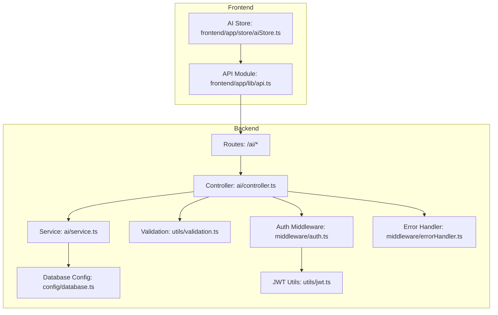
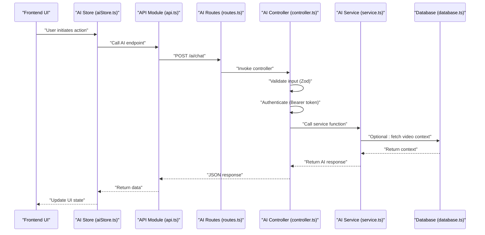
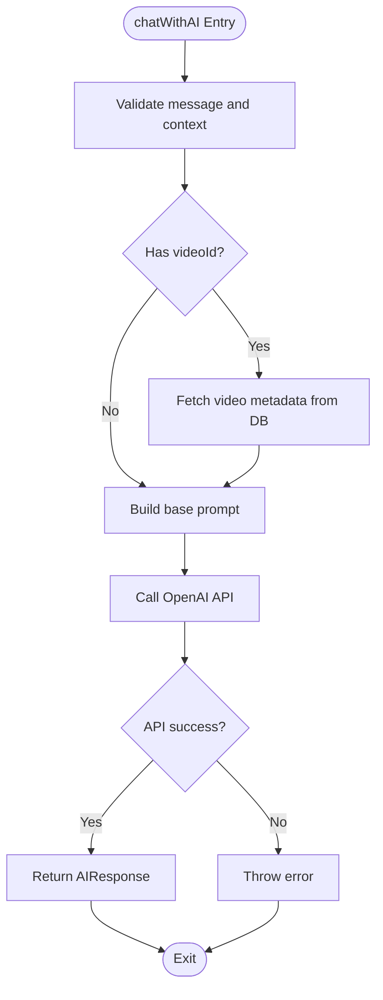
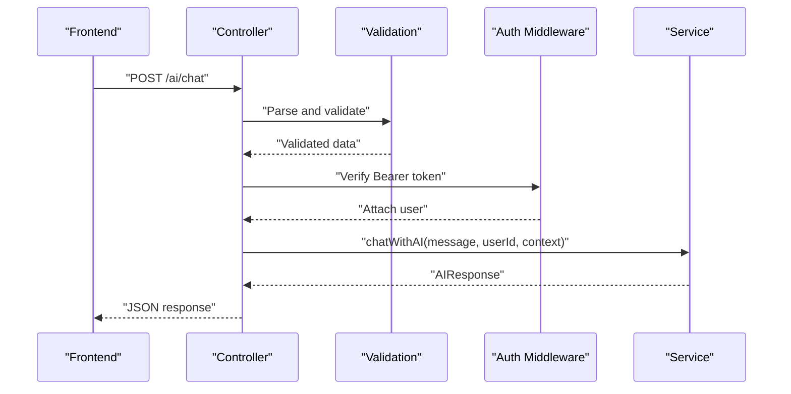
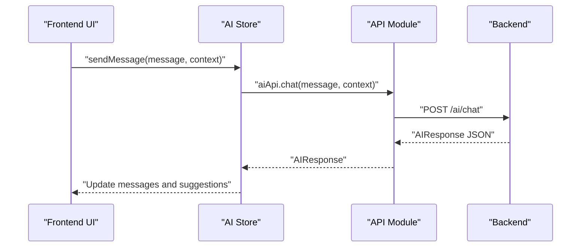
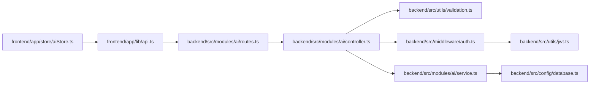

# OpenAI Integration

<cite>
**Referenced Files in This Document**
- [service.ts](file://backend/src/modules/ai/service.ts)
- [controller.ts](file://backend/src/modules/ai/controller.ts)
- [routes.ts](file://backend/src/modules/ai/routes.ts)
- [validation.ts](file://backend/src/utils/validation.ts)
- [auth.ts](file://backend/src/middleware/auth.ts)
- [errorHandler.ts](file://backend/src/middleware/errorHandler.ts)
- [database.ts](file://backend/src/config/database.ts)
- [jwt.ts](file://backend/src/utils/jwt.ts)
- [api.ts](file://frontend/app/lib/api.ts)
- [aiStore.ts](file://frontend/app/store/aiStore.ts)
- [package.json](file://backend/package.json)
</cite>

## Table of Contents
1. [Introduction](#introduction)
2. [Project Structure](#project-structure)
3. [Core Components](#core-components)
4. [Architecture Overview](#architecture-overview)
5. [Detailed Component Analysis](#detailed-component-analysis)
6. [Dependency Analysis](#dependency-analysis)
7. [Performance Considerations](#performance-considerations)
8. [Troubleshooting Guide](#troubleshooting-guide)
9. [Conclusion](#conclusion)
10. [Appendices](#appendices)

## Introduction
This document explains the OpenAI API integration within the AI Assistant System. It details the service layer implementation, API configuration, authentication setup, and request/response handling patterns. It also documents how to replace the current mock AI service with a real OpenAI client, including model selection, temperature settings, and prompt engineering strategies. Practical examples of API calls, error handling mechanisms, rate limiting considerations, and cost optimization techniques are included, along with security best practices for API key management and environment variable configuration.

## Project Structure
The AI Assistant System is organized into a modular backend and a separate frontend. The backend exposes AI endpoints under the /ai namespace, protected by authentication middleware. The frontend integrates with these endpoints via a dedicated API module and state store.

**Diagram sources**
- [routes.ts:1-13](file://backend/src/modules/ai/routes.ts#L1-L13)
- [controller.ts:1-73](file://backend/src/modules/ai/controller.ts#L1-L73)
- [service.ts:1-151](file://backend/src/modules/ai/service.ts#L1-L151)
- [validation.ts:1-31](file://backend/src/utils/validation.ts#L1-L31)
- [auth.ts:1-42](file://backend/src/middleware/auth.ts#L1-L42)
- [errorHandler.ts:1-38](file://backend/src/middleware/errorHandler.ts#L1-L38)
- [database.ts:1-53](file://backend/src/config/database.ts#L1-L53)
- [jwt.ts:1-78](file://backend/src/utils/jwt.ts#L1-L78)
- [api.ts:1-80](file://frontend/app/lib/api.ts#L1-L80)
- [aiStore.ts:1-129](file://frontend/app/store/aiStore.ts#L1-L129)

**Section sources**
- [routes.ts:1-13](file://backend/src/modules/ai/routes.ts#L1-L13)
- [controller.ts:1-73](file://backend/src/modules/ai/controller.ts#L1-L73)
- [service.ts:1-151](file://backend/src/modules/ai/service.ts#L1-L151)
- [validation.ts:1-31](file://backend/src/utils/validation.ts#L1-L31)
- [auth.ts:1-42](file://backend/src/middleware/auth.ts#L1-L42)
- [errorHandler.ts:1-38](file://backend/src/middleware/errorHandler.ts#L1-L38)
- [database.ts:1-53](file://backend/src/config/database.ts#L1-L53)
- [jwt.ts:1-78](file://backend/src/utils/jwt.ts#L1-L78)
- [api.ts:1-80](file://frontend/app/lib/api.ts#L1-L80)
- [aiStore.ts:1-129](file://frontend/app/store/aiStore.ts#L1-L129)

## Core Components
- AI Service Layer: Provides chat, summarization, quiz generation, and concept explanation functions. Currently implemented as mock responses; ready to integrate with OpenAI.
- AI Controller: Handles HTTP requests, validates input, enforces authentication, and delegates to the service layer.
- AI Routes: Exposes endpoints for chat, summarize, quiz, and explain under /ai.
- Validation: Zod schemas define request contracts for AI chat inputs.
- Authentication: Bearer token verification middleware protects endpoints.
- Error Handling: Centralized error handler and async wrapper for robust error propagation.
- Database Access: Shared MySQL pool abstraction used by AI service for context retrieval.
- JWT Utilities: Token generation and verification used by authentication middleware.
- Frontend Integration: API module and Zustand store orchestrate AI interactions.

**Section sources**
- [service.ts:1-151](file://backend/src/modules/ai/service.ts#L1-L151)
- [controller.ts:1-73](file://backend/src/modules/ai/controller.ts#L1-L73)
- [routes.ts:1-13](file://backend/src/modules/ai/routes.ts#L1-L13)
- [validation.ts:19-25](file://backend/src/utils/validation.ts#L19-L25)
- [auth.ts:8-24](file://backend/src/middleware/auth.ts#L8-L24)
- [errorHandler.ts:33-37](file://backend/src/middleware/errorHandler.ts#L33-L37)
- [database.ts:19-50](file://backend/src/config/database.ts#L19-L50)
- [jwt.ts:20-45](file://backend/src/utils/jwt.ts#L20-L45)
- [api.ts:66-79](file://frontend/app/lib/api.ts#L66-L79)
- [aiStore.ts:35-129](file://frontend/app/store/aiStore.ts#L35-L129)

## Architecture Overview
The AI Assistant follows a layered architecture:
- Presentation Layer (Frontend): UI components trigger actions in the AI store, which call the API module.
- API Layer (Backend): Express routes delegate to controllers after applying authentication and validation.
- Service Layer: Business logic for AI interactions; currently mock, ready for OpenAI integration.
- Persistence Layer: Database access via a shared pool abstraction.

**Diagram sources**
- [routes.ts:7-10](file://backend/src/modules/ai/routes.ts#L7-L10)
- [controller.ts:7-21](file://backend/src/modules/ai/controller.ts#L7-L21)
- [service.ts:60-86](file://backend/src/modules/ai/service.ts#L60-L86)
- [database.ts:19-29](file://backend/src/config/database.ts#L19-L29)
- [api.ts:66-79](file://frontend/app/lib/api.ts#L66-L79)
- [aiStore.ts:41-77](file://frontend/app/store/aiStore.ts#L41-L77)

## Detailed Component Analysis

### AI Service Layer
The service layer encapsulates AI-related business logic:
- chatWithAI: Accepts a message, user ID, and optional context (videoId/subjectId). It optionally enriches the prompt with video metadata from the database and returns a structured AIResponse.
- generateSummary: Returns a formatted summary string for a given videoId.
- generateQuiz: Returns an array of quiz questions for a given videoId.
- explainConcept: Returns a contextual explanation string for a given concept.

Current implementation uses mock responses. To integrate OpenAI:
- Initialize the OpenAI client with environment variables for API keys and base URLs.
- Select a model (e.g., gpt-4o, gpt-3.5-turbo) and tune temperature for desired creativity vs. determinism.
- Engineer prompts to incorporate video context and user intent.
- Wrap calls with error handling and consider rate limiting and retries.

**Diagram sources**
- [service.ts:60-86](file://backend/src/modules/ai/service.ts#L60-L86)
- [database.ts:19-29](file://backend/src/config/database.ts#L19-L29)

**Section sources**
- [service.ts:3-12](file://backend/src/modules/ai/service.ts#L3-L12)
- [service.ts:60-86](file://backend/src/modules/ai/service.ts#L60-L86)
- [service.ts:88-100](file://backend/src/modules/ai/service.ts#L88-L100)
- [service.ts:102-145](file://backend/src/modules/ai/service.ts#L102-L145)
- [service.ts:147-151](file://backend/src/modules/ai/service.ts#L147-L151)

### AI Controller
The controller enforces authentication, validates input, and delegates to the service layer:
- chat: Validates message and optional context, ensures user is authenticated, and returns AIResponse.
- summarize: Requires videoId and returns a summary.
- quiz: Requires videoId and returns quiz questions.
- explain: Requires concept and optional videoId and returns an explanation.

**Diagram sources**
- [controller.ts:7-21](file://backend/src/modules/ai/controller.ts#L7-L21)
- [validation.ts:19-25](file://backend/src/utils/validation.ts#L19-L25)
- [auth.ts:8-24](file://backend/src/middleware/auth.ts#L8-L24)
- [service.ts:60-86](file://backend/src/modules/ai/service.ts#L60-L86)

**Section sources**
- [controller.ts:7-21](file://backend/src/modules/ai/controller.ts#L7-L21)
- [controller.ts:23-38](file://backend/src/modules/ai/controller.ts#L23-L38)
- [controller.ts:40-55](file://backend/src/modules/ai/controller.ts#L40-L55)
- [controller.ts:57-72](file://backend/src/modules/ai/controller.ts#L57-L72)

### AI Routes
The routes module defines the AI endpoints and applies authentication:
- POST /ai/chat
- POST /ai/summarize
- POST /ai/quiz
- POST /ai/explain

**Section sources**
- [routes.ts:7-10](file://backend/src/modules/ai/routes.ts#L7-L10)

### Validation Schema
The Zod schema for AI chat input ensures:
- message is a non-empty string
- context is an object containing optional videoId and subjectId

**Section sources**
- [validation.ts:19-25](file://backend/src/utils/validation.ts#L19-L25)

### Authentication Middleware
Authentication middleware verifies Bearer tokens and attaches user info to the request:
- Enforces presence of Authorization header with Bearer scheme
- Verifies token using JWT secret and expiration settings
- Continues to the next handler if valid

**Section sources**
- [auth.ts:8-24](file://backend/src/middleware/auth.ts#L8-L24)
- [jwt.ts:20-45](file://backend/src/utils/jwt.ts#L20-L45)

### Error Handling
The async handler wraps route handlers to catch asynchronous errors and pass them to the centralized error handler. The error handler responds with standardized JSON including error code and message, and includes stack traces in development mode.

**Section sources**
- [errorHandler.ts:33-37](file://backend/src/middleware/errorHandler.ts#L33-L37)
- [errorHandler.ts:8-24](file://backend/src/middleware/errorHandler.ts#L8-L24)

### Database Access
The shared database abstraction provides:
- query and queryOne helpers
- transaction support
- connection pooling configuration

The AI service uses queryOne to fetch video metadata for context enrichment.

**Section sources**
- [database.ts:19-50](file://backend/src/config/database.ts#L19-L50)
- [service.ts:68-75](file://backend/src/modules/ai/service.ts#L68-L75)

### Frontend Integration
The frontend integrates with AI endpoints via:
- API module: Defines typed functions for chat, summarize, quiz, and explain
- AI Store: Manages loading states, errors, and maintains chat history; triggers API calls and updates UI state

**Diagram sources**
- [aiStore.ts:41-77](file://frontend/app/store/aiStore.ts#L41-L77)
- [api.ts:66-79](file://frontend/app/lib/api.ts#L66-L79)
- [controller.ts:7-21](file://backend/src/modules/ai/controller.ts#L7-L21)

**Section sources**
- [api.ts:66-79](file://frontend/app/lib/api.ts#L66-L79)
- [aiStore.ts:41-77](file://frontend/app/store/aiStore.ts#L41-L77)

## Dependency Analysis
The AI module depends on:
- Validation for input contracts
- Authentication middleware for access control
- Service layer for business logic
- Database abstraction for context retrieval
- Frontend API module and store for user interactions

**Diagram sources**
- [api.ts:66-79](file://frontend/app/lib/api.ts#L66-L79)
- [aiStore.ts:41-77](file://frontend/app/store/aiStore.ts#L41-L77)
- [routes.ts:7-10](file://backend/src/modules/ai/routes.ts#L7-L10)
- [controller.ts:1-73](file://backend/src/modules/ai/controller.ts#L1-L73)
- [validation.ts:19-25](file://backend/src/utils/validation.ts#L19-L25)
- [auth.ts:8-24](file://backend/src/middleware/auth.ts#L8-L24)
- [service.ts:1-151](file://backend/src/modules/ai/service.ts#L1-L151)
- [database.ts:19-50](file://backend/src/config/database.ts#L19-L50)
- [jwt.ts:20-45](file://backend/src/utils/jwt.ts#L20-L45)

**Section sources**
- [routes.ts:1-13](file://backend/src/modules/ai/routes.ts#L1-L13)
- [controller.ts:1-73](file://backend/src/modules/ai/controller.ts#L1-L73)
- [service.ts:1-151](file://backend/src/modules/ai/service.ts#L1-L151)
- [validation.ts:1-31](file://backend/src/utils/validation.ts#L1-L31)
- [auth.ts:1-42](file://backend/src/middleware/auth.ts#L1-L42)
- [errorHandler.ts:1-38](file://backend/src/middleware/errorHandler.ts#L1-L38)
- [database.ts:1-53](file://backend/src/config/database.ts#L1-L53)
- [jwt.ts:1-78](file://backend/src/utils/jwt.ts#L1-L78)
- [api.ts:1-80](file://frontend/app/lib/api.ts#L1-L80)
- [aiStore.ts:1-129](file://frontend/app/store/aiStore.ts#L1-L129)

## Performance Considerations
- Rate Limiting: Apply rate limiting at the application level using express-rate-limit to prevent abuse and control costs.
- Caching: Cache frequent prompts and responses where safe to reduce API calls.
- Streaming: Consider streaming responses from OpenAI for improved UX, though ensure compatibility with current response shapes.
- Model Selection: Choose models based on complexity and cost; use smaller models for routine tasks and larger ones for nuanced content.
- Prompt Efficiency: Keep prompts concise while providing sufficient context to minimize token usage.
- Batch Operations: Group related requests where possible to reduce overhead.

[No sources needed since this section provides general guidance]

## Troubleshooting Guide
Common issues and resolutions:
- Authentication failures: Ensure Authorization header includes a valid Bearer token; verify token expiration and secret configuration.
- Validation errors: Confirm request body matches the Zod schema for AI chat inputs.
- Database connectivity: Verify database credentials and availability; check connection limits and pooling settings.
- API timeouts: Increase timeout thresholds and implement retry logic with exponential backoff.
- Cost spikes: Monitor token usage per request and implement quotas or caching to limit expensive calls.

**Section sources**
- [auth.ts:8-24](file://backend/src/middleware/auth.ts#L8-L24)
- [validation.ts:19-25](file://backend/src/utils/validation.ts#L19-L25)
- [database.ts:6-17](file://backend/src/config/database.ts#L6-L17)
- [errorHandler.ts:8-24](file://backend/src/middleware/errorHandler.ts#L8-L24)

## Conclusion
The AI Assistant System is structured to seamlessly integrate OpenAI by replacing the mock service layer with a real OpenAI client. The existing authentication, validation, error handling, and frontend integration layers provide a solid foundation. By focusing on secure API key management, thoughtful prompt engineering, and performance optimizations, the system can deliver a robust and scalable AI experience.

[No sources needed since this section summarizes without analyzing specific files]

## Appendices

### Environment Variables and Security Best Practices
- API Keys: Store OpenAI API keys in environment variables and restrict access to deployment environments.
- Secrets Management: Use secrets managers or encrypted configuration stores; avoid committing secrets to version control.
- Network Security: Restrict outbound network access to OpenAI endpoints only; use private networks if required.
- Logging: Avoid logging sensitive API keys or request bodies; sanitize logs appropriately.

[No sources needed since this section provides general guidance]

### OpenAI Client Initialization and Configuration
- Initialize the OpenAI client with environment variables for API keys and base URLs.
- Configure model selection and temperature settings based on use case requirements.
- Implement retry logic and circuit breakers to handle transient failures gracefully.

[No sources needed since this section provides general guidance]

### Prompt Engineering Strategies
- Contextual grounding: Incorporate video metadata and user context into prompts to improve relevance.
- Instruction clarity: Use explicit instructions and desired output formats to guide model behavior.
- Iterative refinement: Test and iterate on prompts to balance helpfulness and efficiency.

[No sources needed since this section provides general guidance]