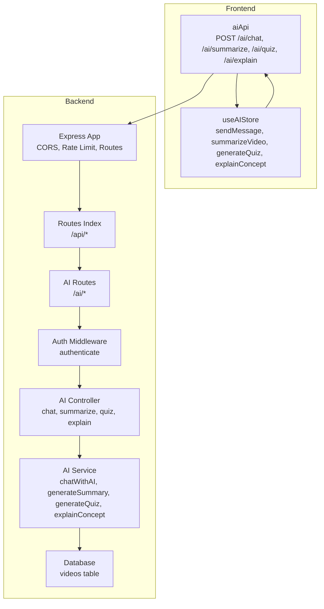
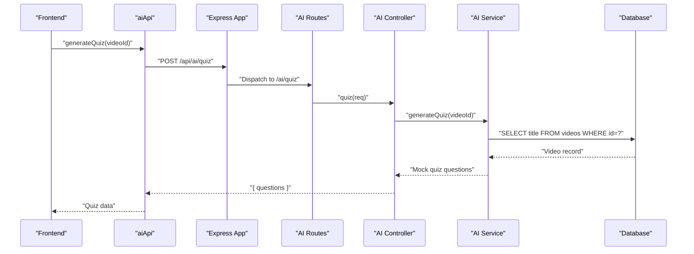
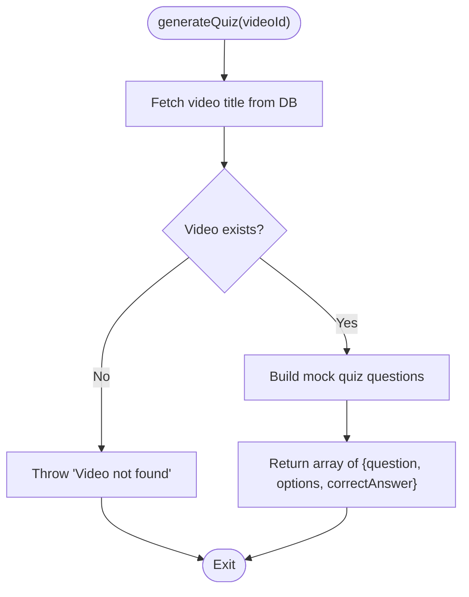
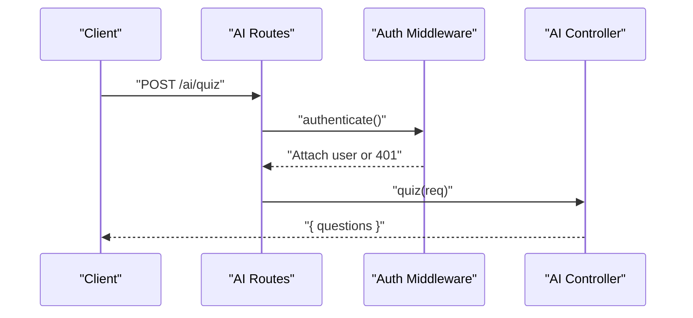
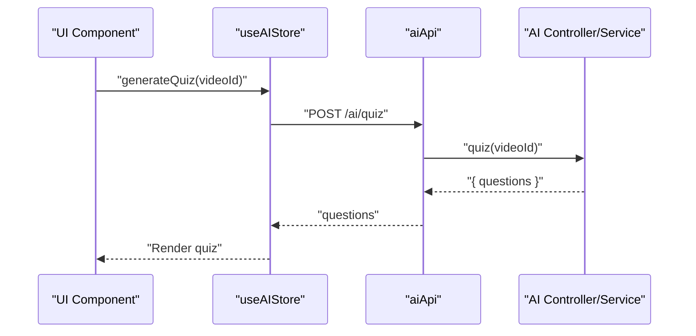
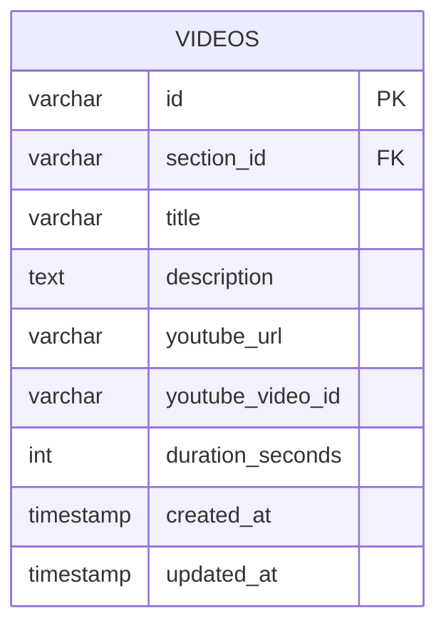
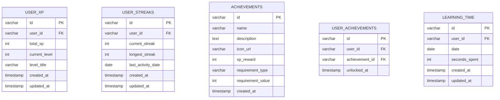
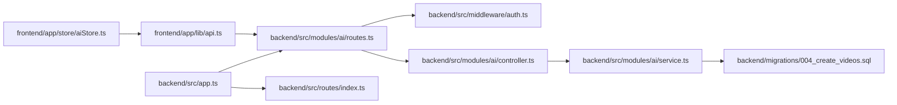

# Quiz Generation

<cite>
**Referenced Files in This Document**
- [controller.ts](file://backend/src/modules/ai/controller.ts)
- [service.ts](file://backend/src/modules/ai/service.ts)
- [routes.ts](file://backend/src/modules/ai/routes.ts)
- [validation.ts](file://backend/src/utils/validation.ts)
- [auth.ts](file://backend/src/middleware/auth.ts)
- [api.ts](file://frontend/app/lib/api.ts)
- [aiStore.ts](file://frontend/app/store/aiStore.ts)
- [index.ts](file://backend/src/routes/index.ts)
- [app.ts](file://backend/src/app.ts)
- [004_create_videos.sql](file://backend/migrations/004_create_videos.sql)
- [008_create_gamification.sql](file://backend/migrations/008_create_gamification.sql)
</cite>

## Table of Contents
1. [Introduction](#introduction)
2. [Project Structure](#project-structure)
3. [Core Components](#core-components)
4. [Architecture Overview](#architecture-overview)
5. [Detailed Component Analysis](#detailed-component-analysis)
6. [Dependency Analysis](#dependency-analysis)
7. [Performance Considerations](#performance-considerations)
8. [Troubleshooting Guide](#troubleshooting-guide)
9. [Conclusion](#conclusion)
10. [Appendices](#appendices)

## Introduction
This document describes the AI-powered quiz generation system, focusing on how quizzes are created from video content, how questions are formulated, and how the system integrates with the broader learning platform. It also documents the available question types, difficulty considerations, content-based question formulation, validation processes, and educational best practices. The system currently uses mock AI responses and can be extended to integrate with real AI APIs.

## Project Structure
The quiz generation feature spans backend and frontend modules:
- Backend AI module exposes endpoints for chat, summarization, quiz generation, and concept explanation.
- Frontend stores and API clients orchestrate user interactions and manage state.
- Authentication middleware secures endpoints.
- Database migrations define the video content model used by the AI services.

**Diagram sources**
- [app.ts:1-54](file://backend/src/app.ts#L1-L54)
- [index.ts:1-25](file://backend/src/routes/index.ts#L1-L25)
- [routes.ts:1-13](file://backend/src/modules/ai/routes.ts#L1-L13)
- [auth.ts:1-42](file://backend/src/middleware/auth.ts#L1-L42)
- [controller.ts:1-73](file://backend/src/modules/ai/controller.ts#L1-L73)
- [service.ts:1-151](file://backend/src/modules/ai/service.ts#L1-L151)
- [004_create_videos.sql:1-15](file://backend/migrations/004_create_videos.sql#L1-L15)

**Section sources**
- [app.ts:1-54](file://backend/src/app.ts#L1-L54)
- [index.ts:1-25](file://backend/src/routes/index.ts#L1-L25)
- [routes.ts:1-13](file://backend/src/modules/ai/routes.ts#L1-L13)
- [auth.ts:1-42](file://backend/src/middleware/auth.ts#L1-L42)

## Core Components
- AI Controller: Exposes endpoints for chat, summarization, quiz generation, and concept explanation. It validates inputs, enforces authentication, and delegates to the AI service.
- AI Service: Provides mock implementations for chat, summary, quiz generation, and concept explanation. In production, these would call external AI APIs and use video content for context.
- AI Routes: Defines the REST endpoints under /ai and applies authentication.
- Validation: Zod schemas validate incoming requests, including AI chat messages and context.
- Frontend API and Store: The frontend communicates via aiApi and manages state with useAIStore, enabling chat, summaries, quizzes, and explanations.

Key responsibilities:
- Video context retrieval for chat and quiz generation.
- Question generation with multiple-choice options and correct answers.
- Concept explanations tailored to the current video or subject.
- Error handling and user feedback.

**Section sources**
- [controller.ts:1-73](file://backend/src/modules/ai/controller.ts#L1-L73)
- [service.ts:1-151](file://backend/src/modules/ai/service.ts#L1-L151)
- [routes.ts:1-13](file://backend/src/modules/ai/routes.ts#L1-L13)
- [validation.ts:19-25](file://backend/src/utils/validation.ts#L19-L25)
- [api.ts:66-79](file://frontend/app/lib/api.ts#L66-L79)
- [aiStore.ts:18-33](file://frontend/app/store/aiStore.ts#L18-L33)

## Architecture Overview
The system follows a layered architecture:
- Presentation layer (frontend) handles user interactions and state.
- API layer (Express routes) validates and authenticates requests.
- Application layer (AI controller) orchestrates business logic.
- Domain services (AI service) encapsulate AI-related operations and database queries.
- Data layer (MySQL) persists video metadata used for context.

**Diagram sources**
- [aiStore.ts:94-107](file://frontend/app/store/aiStore.ts#L94-L107)
- [api.ts:74-75](file://frontend/app/lib/api.ts#L74-L75)
- [routes.ts:9](file://backend/src/modules/ai/routes.ts#L9)
- [controller.ts:40-55](file://backend/src/modules/ai/controller.ts#L40-L55)
- [service.ts:102-145](file://backend/src/modules/ai/service.ts#L102-L145)
- [004_create_videos.sql:1-15](file://backend/migrations/004_create_videos.sql#L1-L15)

## Detailed Component Analysis

### AI Controller
Responsibilities:
- Enforce authentication for all endpoints.
- Validate request bodies using Zod schemas.
- Delegate to AI service functions and return structured responses.

Endpoints:
- POST /ai/chat: Accepts a message and optional context (videoId, subjectId).
- POST /ai/summarize: Generates a textual summary for a given videoId.
- POST /ai/quiz: Generates quiz questions for a given videoId.
- POST /ai/explain: Provides an explanation for a concept, optionally scoped to a videoId.

Error handling:
- Returns 401 Unauthorized if missing or invalid tokens.
- Returns 400 Bad Request for missing required fields.
- Delegates exceptions to the async error handler middleware.

**Section sources**
- [controller.ts:7-21](file://backend/src/modules/ai/controller.ts#L7-L21)
- [controller.ts:23-38](file://backend/src/modules/ai/controller.ts#L23-L38)
- [controller.ts:40-55](file://backend/src/modules/ai/controller.ts#L40-L55)
- [controller.ts:57-72](file://backend/src/modules/ai/controller.ts#L57-L72)

### AI Service
Responsibilities:
- chatWithAI: Builds context from video metadata and returns mock AI responses with suggestions.
- generateSummary: Returns a mock summary based on video title and description.
- generateQuiz: Returns mock quiz questions with multiple-choice options and correct answers.
- explainConcept: Returns a mock explanation for a concept, optionally incorporating video context.

Mock behavior:
- Uses keyword-based logic to tailor responses to user intents (summarize, explain, quiz, note).
- Simulates latency to mimic real API calls.

Production readiness:
- chatWithAI: Can be extended to call OpenAI, Claude, or similar APIs, passing video context.
- generateSummary: Can be integrated with video transcription and summarization APIs.
- generateQuiz: Can be powered by prompt engineering to produce domain-specific questions.
- explainConcept: Can leverage embeddings or retrieval-augmented generation for contextual explanations.

**Diagram sources**
- [service.ts:102-145](file://backend/src/modules/ai/service.ts#L102-L145)
- [004_create_videos.sql:1-15](file://backend/migrations/004_create_videos.sql#L1-L15)

**Section sources**
- [service.ts:60-86](file://backend/src/modules/ai/service.ts#L60-L86)
- [service.ts:88-100](file://backend/src/modules/ai/service.ts#L88-L100)
- [service.ts:102-145](file://backend/src/modules/ai/service.ts#L102-L145)
- [service.ts:147-150](file://backend/src/modules/ai/service.ts#L147-L150)

### AI Routes and Authentication
- AI routes are mounted under /ai and secured with the authenticate middleware.
- The authenticate middleware verifies Bearer tokens and attaches user info to the request.
- The routes forward to the controller actions after authentication checks.

**Diagram sources**
- [routes.ts:7-10](file://backend/src/modules/ai/routes.ts#L7-L10)
- [auth.ts:8-24](file://backend/src/middleware/auth.ts#L8-L24)
- [controller.ts:40-55](file://backend/src/modules/ai/controller.ts#L40-L55)

**Section sources**
- [routes.ts:1-13](file://backend/src/modules/ai/routes.ts#L1-L13)
- [auth.ts:1-42](file://backend/src/middleware/auth.ts#L1-L42)

### Frontend Integration
- aiApi: Encapsulates calls to /ai endpoints.
- useAIStore: Manages loading states, errors, chat history, and exposes actions to send messages, summarize videos, generate quizzes, and explain concepts.

**Diagram sources**
- [aiStore.ts:94-107](file://frontend/app/store/aiStore.ts#L94-L107)
- [api.ts:74-75](file://frontend/app/lib/api.ts#L74-L75)
- [controller.ts:40-55](file://backend/src/modules/ai/controller.ts#L40-L55)
- [service.ts:102-145](file://backend/src/modules/ai/service.ts#L102-L145)

**Section sources**
- [api.ts:66-79](file://frontend/app/lib/api.ts#L66-L79)
- [aiStore.ts:18-33](file://frontend/app/store/aiStore.ts#L18-L33)
- [aiStore.ts:94-107](file://frontend/app/store/aiStore.ts#L94-L107)

### Data Model: Videos
The system relies on the videos table to provide context for AI operations. The table includes identifiers, metadata, and YouTube integration fields.

**Diagram sources**
- [004_create_videos.sql:1-15](file://backend/migrations/004_create_videos.sql#L1-L15)

**Section sources**
- [004_create_videos.sql:1-15](file://backend/migrations/004_create_videos.sql#L1-L15)

### Gamification Integration
While quiz generation is handled by the AI module, gamification tracks learning progress and can reward users for completing quizzes and watching videos. Relevant tables include user XP, streaks, achievements, and learning time.

**Diagram sources**
- [008_create_gamification.sql:1-64](file://backend/migrations/008_create_gamification.sql#L1-L64)

**Section sources**
- [008_create_gamification.sql:1-64](file://backend/migrations/008_create_gamification.sql#L1-L64)

## Dependency Analysis
- Frontend depends on aiApi for backend communication and useAIStore for state management.
- Backend routes depend on authentication middleware and the AI controller.
- AI controller depends on AI service functions.
- AI service depends on the database to fetch video metadata.
- Express app composes all routes and applies global middleware.

**Diagram sources**
- [api.ts:66-79](file://frontend/app/lib/api.ts#L66-L79)
- [aiStore.ts:18-33](file://frontend/app/store/aiStore.ts#L18-L33)
- [routes.ts:1-13](file://backend/src/modules/ai/routes.ts#L1-L13)
- [auth.ts:1-42](file://backend/src/middleware/auth.ts#L1-L42)
- [controller.ts:1-73](file://backend/src/modules/ai/controller.ts#L1-L73)
- [service.ts:1-151](file://backend/src/modules/ai/service.ts#L1-L151)
- [004_create_videos.sql:1-15](file://backend/migrations/004_create_videos.sql#L1-L15)
- [app.ts:1-54](file://backend/src/app.ts#L1-L54)
- [index.ts:1-25](file://backend/src/routes/index.ts#L1-L25)

**Section sources**
- [app.ts:1-54](file://backend/src/app.ts#L1-L54)
- [index.ts:1-25](file://backend/src/routes/index.ts#L1-L25)
- [routes.ts:1-13](file://backend/src/modules/ai/routes.ts#L1-L13)
- [auth.ts:1-42](file://backend/src/middleware/auth.ts#L1-L42)
- [controller.ts:1-73](file://backend/src/modules/ai/controller.ts#L1-L73)
- [service.ts:1-151](file://backend/src/modules/ai/service.ts#L1-L151)
- [004_create_videos.sql:1-15](file://backend/migrations/004_create_videos.sql#L1-L15)

## Performance Considerations
- Current mock implementations simulate latency; production integrations should optimize response times and cache frequently accessed video metadata.
- Rate limiting is applied at the Express layer to prevent abuse; consider adding caching for repeated quiz generations and summaries.
- Frontend state management avoids redundant network calls by setting loading states and handling errors gracefully.

[No sources needed since this section provides general guidance]

## Troubleshooting Guide
Common issues and resolutions:
- Authentication failures: Ensure a valid Bearer token is included in Authorization headers.
- Missing videoId: Verify that the video identifier is provided in quiz and summarize requests.
- Validation errors: Confirm that messages and contexts meet schema requirements.
- Network errors: Check frontend error handling and retry logic in useAIStore.

**Section sources**
- [auth.ts:8-24](file://backend/src/middleware/auth.ts#L8-L24)
- [validation.ts:19-25](file://backend/src/utils/validation.ts#L19-L25)
- [controller.ts:31-34](file://backend/src/modules/ai/controller.ts#L31-L34)
- [controller.ts:48-51](file://backend/src/modules/ai/controller.ts#L48-L51)
- [aiStore.ts:71-76](file://frontend/app/store/aiStore.ts#L71-L76)
- [aiStore.ts:99-105](file://frontend/app/store/aiStore.ts#L99-L105)

## Conclusion
The AI-powered quiz generation system provides a modular foundation for creating assessments from video content. The current implementation uses mock AI responses and demonstrates a clear separation of concerns across frontend and backend layers. Extending the AI service to integrate with real AI APIs will enable dynamic, content-aware quizzes, while maintaining the existing frontend integration and authentication patterns.

[No sources needed since this section summarizes without analyzing specific files]

## Appendices

### Supported Question Types
- Multiple choice: Each question includes several options with a single correct answer.

**Section sources**
- [service.ts:113-144](file://backend/src/modules/ai/service.ts#L113-L144)

### Difficulty Level Adjustment
- The mock service does not implement difficulty scaling. In production, difficulty can be adjusted by:
  - Selecting more complex concepts for advanced learners.
  - Adjusting question phrasing complexity.
  - Incorporating spaced repetition and adaptive algorithms.

[No sources needed since this section provides general guidance]

### Content-Based Question Formulation
- The system retrieves video metadata (title, description) to inform AI prompts.
- Production enhancements could include:
  - Transcription and segmentation for temporal key moments.
  - Embeddings for semantic similarity and targeted question selection.
  - Retrieval-augmented generation for grounded question creation.

**Section sources**
- [service.ts:67-75](file://backend/src/modules/ai/service.ts#L67-L75)

### Examples of Quiz Formats
- Multiple-choice quizzes generated per video.
- Summaries for quick review.
- Concept explanations for deeper understanding.

**Section sources**
- [service.ts:102-145](file://backend/src/modules/ai/service.ts#L102-L145)
- [service.ts:88-100](file://backend/src/modules/ai/service.ts#L88-L100)
- [service.ts:147-150](file://backend/src/modules/ai/service.ts#L147-L150)

### Scoring Mechanisms
- Correct answers are represented by an index; scoring can be computed client-side by comparing selected indices to stored correctAnswer values.

**Section sources**
- [aiStore.ts:12-16](file://frontend/app/store/aiStore.ts#L12-L16)
- [service.ts:122](file://backend/src/modules/ai/service.ts#L122)

### Adaptive Questioning Strategies
- Future enhancements can incorporate:
  - Spaced repetition scheduling.
  - Knowledge tracing to target weak concepts.
  - Dynamic branching based on learner performance.

[No sources needed since this section provides general guidance]

### Educational Best Practices
- Align questions with learning objectives derived from video content.
- Provide immediate feedback and explanations.
- Offer varied question types to assess different cognitive skills.
- Ensure accessibility and inclusive language.

[No sources needed since this section provides general guidance]

### Question Quality Assurance
- Validate question content against curriculum standards.
- Pilot test with learners and iterate on clarity and difficulty.
- Monitor engagement and performance metrics to refine question sets.

[No sources needed since this section provides general guidance]

### Customization Options
- Instructors can:
  - Curate video playlists and sections.
  - Configure quiz parameters (number of questions, focus areas).
  - Track learner progress and adjust instruction accordingly.
- Learners can:
  - Choose videos by interest or proficiency.
  - Review summaries and explanations.
  - Retry quizzes to improve scores.

[No sources needed since this section provides general guidance]