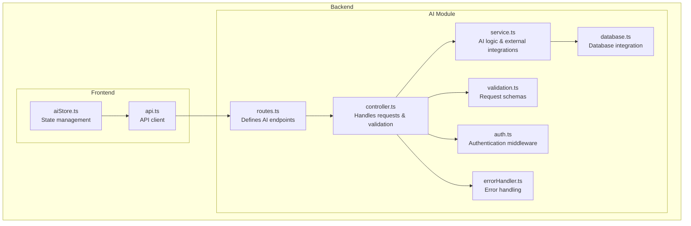
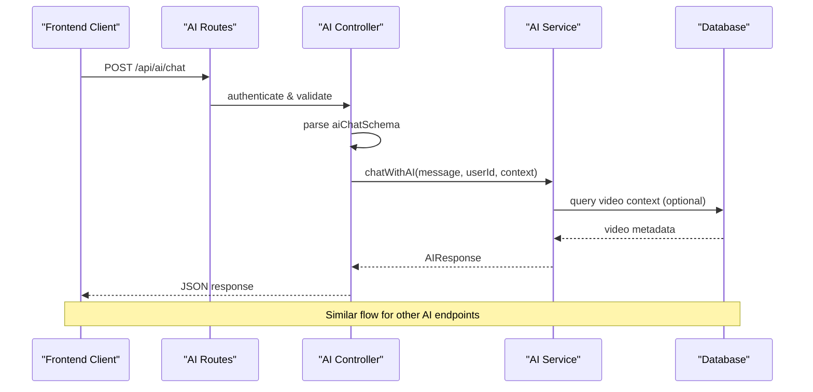
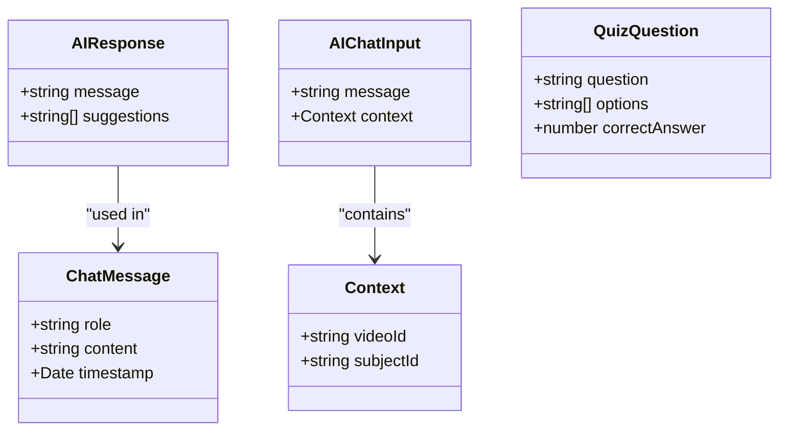
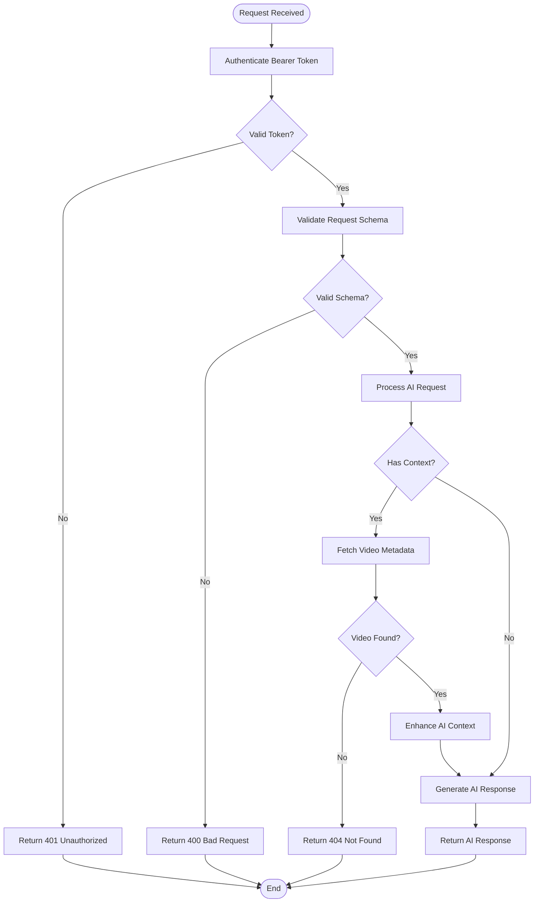
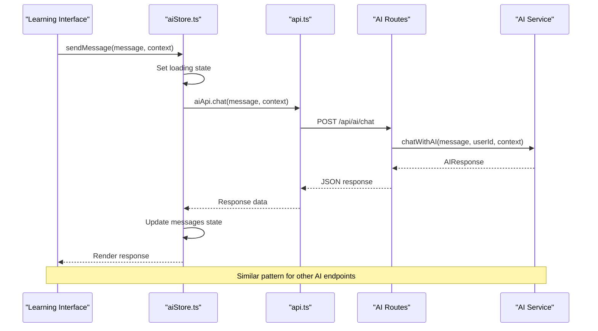
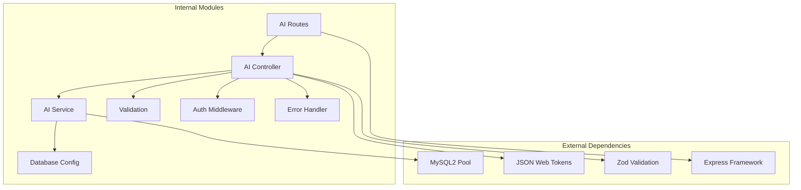
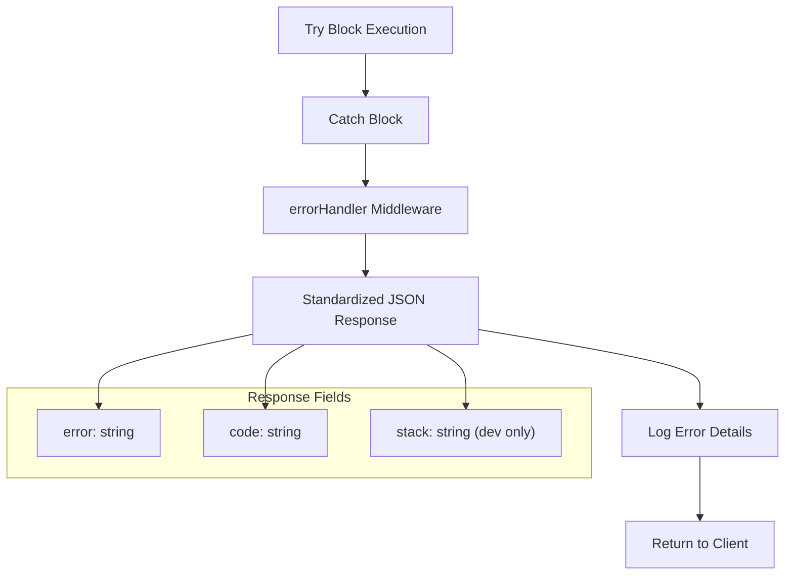

# AI Assistant API

<cite>
**Referenced Files in This Document**
- [routes.ts](file://backend/src/modules/ai/routes.ts)
- [controller.ts](file://backend/src/modules/ai/controller.ts)
- [service.ts](file://backend/src/modules/ai/service.ts)
- [validation.ts](file://backend/src/utils/validation.ts)
- [auth.ts](file://backend/src/middleware/auth.ts)
- [errorHandler.ts](file://backend/src/middleware/errorHandler.ts)
- [database.ts](file://backend/src/config/database.ts)
- [index.ts](file://backend/src/routes/index.ts)
- [jwt.ts](file://backend/src/utils/jwt.ts)
- [aiStore.ts](file://frontend/app/store/aiStore.ts)
- [api.ts](file://frontend/app/lib/api.ts)
- [package.json](file://backend/package.json)
</cite>

## Table of Contents
1. [Introduction](#introduction)
2. [Project Structure](#project-structure)
3. [Core Components](#core-components)
4. [Architecture Overview](#architecture-overview)
5. [Detailed Component Analysis](#detailed-component-analysis)
6. [Dependency Analysis](#dependency-analysis)
7. [Performance Considerations](#performance-considerations)
8. [Troubleshooting Guide](#troubleshooting-guide)
9. [Conclusion](#conclusion)
10. [Appendices](#appendices)

## Introduction
This document provides comprehensive API documentation for the AI Assistant module endpoints. It covers all AI-related endpoints, including POST /api/ai/chat for conversational queries, POST /api/ai/summarize for content summarization, POST /api/ai/quiz for quiz generation, and POST /api/ai/explain for concept explanation. The documentation includes endpoint schemas, response formats, content processing, OpenAI integration guidance, prompt engineering, content moderation, rate limiting, cost management, fallback strategies, and quality control guidelines.

## Project Structure
The AI Assistant module is organized under backend/src/modules/ai with clear separation of concerns:
- Routes define the HTTP endpoints and authentication middleware
- Controller handles request validation and orchestrates service calls
- Service encapsulates AI logic and integrates with external APIs
- Validation enforces request schemas using Zod
- Middleware manages authentication and error handling
- Database integration supports contextual video data retrieval

**Diagram sources**
- [routes.ts:1-13](file://backend/src/modules/ai/routes.ts#L1-L13)
- [controller.ts:1-73](file://backend/src/modules/ai/controller.ts#L1-L73)
- [service.ts:1-151](file://backend/src/modules/ai/service.ts#L1-L151)
- [validation.ts:1-31](file://backend/src/utils/validation.ts#L1-L31)
- [auth.ts:1-42](file://backend/src/middleware/auth.ts#L1-L42)
- [errorHandler.ts:1-38](file://backend/src/middleware/errorHandler.ts#L1-L38)
- [database.ts:1-53](file://backend/src/config/database.ts#L1-L53)
- [aiStore.ts:1-129](file://frontend/app/store/aiStore.ts#L1-L129)
- [api.ts:1-80](file://frontend/app/lib/api.ts#L1-L80)

**Section sources**
- [routes.ts:1-13](file://backend/src/modules/ai/routes.ts#L1-L13)
- [controller.ts:1-73](file://backend/src/modules/ai/controller.ts#L1-L73)
- [service.ts:1-151](file://backend/src/modules/ai/service.ts#L1-L151)
- [validation.ts:1-31](file://backend/src/utils/validation.ts#L1-L31)
- [auth.ts:1-42](file://backend/src/middleware/auth.ts#L1-L42)
- [errorHandler.ts:1-38](file://backend/src/middleware/errorHandler.ts#L1-L38)
- [database.ts:1-53](file://backend/src/config/database.ts#L1-L53)
- [aiStore.ts:1-129](file://frontend/app/store/aiStore.ts#L1-L129)
- [api.ts:1-80](file://frontend/app/lib/api.ts#L1-L80)

## Core Components
The AI Assistant module consists of four primary endpoints, each serving distinct learning functionalities:

### Authentication and Authorization
All AI endpoints require bearer token authentication. The middleware validates tokens and attaches user context to requests.

### Request Validation
Zod schemas enforce strict input validation for all endpoints, ensuring data integrity and preventing malformed requests.

### Database Integration
The service layer retrieves contextual video information to enhance AI responses with relevant course content.

**Section sources**
- [auth.ts:8-24](file://backend/src/middleware/auth.ts#L8-L24)
- [validation.ts:19-25](file://backend/src/utils/validation.ts#L19-L25)
- [database.ts:19-50](file://backend/src/config/database.ts#L19-L50)

## Architecture Overview
The AI Assistant follows a layered architecture with clear separation between presentation, business logic, and data access layers.

**Diagram sources**
- [routes.ts:7-10](file://backend/src/modules/ai/routes.ts#L7-L10)
- [controller.ts:7-21](file://backend/src/modules/ai/controller.ts#L7-L21)
- [service.ts:60-86](file://backend/src/modules/ai/service.ts#L60-L86)
- [database.ts:25-28](file://backend/src/config/database.ts#L25-L28)

## Detailed Component Analysis

### Endpoint Definitions

#### POST /api/ai/chat
Conversational AI chat with contextual awareness and suggestion generation.

**Request Schema**
- message: string (required) - User's conversational query
- context: object (optional) - Additional context for AI processing
  - videoId: string (optional) - Video identifier for contextual responses
  - subjectId: string (optional) - Subject identifier for broader context

**Response Format**
- message: string - AI-generated response text
- suggestions: string[] (optional) - Recommended follow-up prompts

**Authentication**: Required (Bearer token)
**Rate Limiting**: Built-in async handler protection
**Error Responses**: 
- 400: Invalid request schema
- 401: Authentication required
- 500: Internal server error

#### POST /api/ai/summarize
Generates comprehensive summaries for video content.

**Request Schema**
- videoId: string (required) - Identifier of target video

**Response Format**
- summary: string - Formatted summary text containing key points and takeaways

**Processing Logic**: Retrieves video metadata and generates structured summary content
**Error Responses**:
- 400: Missing videoId
- 404: Video not found
- 500: Processing error

#### POST /api/ai/quiz
Creates interactive quizzes based on video content.

**Request Schema**
- videoId: string (required) - Identifier of target video

**Response Format**
Array of question objects:
- question: string - Quiz question text
- options: string[] - Available answer choices
- correctAnswer: number - Index of correct option (0-based)

**Processing Logic**: Generates multiple-choice questions aligned with video content
**Error Responses**:
- 400: Missing videoId
- 404: Video not found
- 500: Generation error

#### POST /api/ai/explain
Provides simplified explanations of learning concepts.

**Request Schema**
- concept: string (required) - Term or concept to explain
- videoId: string (optional) - Contextual video reference

**Response Format**
- explanation: string - Structured explanation with examples and best practices

**Processing Logic**: Transforms complex concepts into digestible learning materials
**Error Responses**:
- 400: Missing concept
- 500: Processing error

**Section sources**
- [controller.ts:7-72](file://backend/src/modules/ai/controller.ts#L7-L72)
- [service.ts:3-150](file://backend/src/modules/ai/service.ts#L3-L150)
- [validation.ts:19-25](file://backend/src/utils/validation.ts#L19-L25)

### Data Models and Interfaces

**Diagram sources**
- [service.ts:3-12](file://backend/src/modules/ai/service.ts#L3-L12)
- [validation.ts:19-25](file://backend/src/utils/validation.ts#L19-L25)

### Request Processing Flow

**Diagram sources**
- [controller.ts:7-72](file://backend/src/modules/ai/controller.ts#L7-L72)
- [service.ts:60-86](file://backend/src/modules/ai/service.ts#L60-L86)
- [database.ts:25-28](file://backend/src/config/database.ts#L25-L28)

### Frontend Integration

**Diagram sources**
- [aiStore.ts:41-77](file://frontend/app/store/aiStore.ts#L41-L77)
- [api.ts:67-79](file://frontend/app/lib/api.ts#L67-L79)
- [routes.ts:7-10](file://backend/src/modules/ai/routes.ts#L7-L10)

**Section sources**
- [aiStore.ts:1-129](file://frontend/app/store/aiStore.ts#L1-L129)
- [api.ts:66-79](file://frontend/app/lib/api.ts#L66-L79)

## Dependency Analysis

**Diagram sources**
- [package.json:15-27](file://backend/package.json#L15-L27)
- [routes.ts:1-13](file://backend/src/modules/ai/routes.ts#L1-L13)
- [controller.ts:1-73](file://backend/src/modules/ai/controller.ts#L1-L73)
- [service.ts:1-151](file://backend/src/modules/ai/service.ts#L1-L151)
- [validation.ts:1-31](file://backend/src/utils/validation.ts#L1-L31)
- [auth.ts:1-42](file://backend/src/middleware/auth.ts#L1-L42)
- [errorHandler.ts:1-38](file://backend/src/middleware/errorHandler.ts#L1-L38)
- [database.ts:1-53](file://backend/src/config/database.ts#L1-L53)

**Section sources**
- [package.json:15-27](file://backend/package.json#L15-L27)
- [routes.ts:1-13](file://backend/src/modules/ai/routes.ts#L1-L13)
- [controller.ts:1-73](file://backend/src/modules/ai/controller.ts#L1-L73)
- [service.ts:1-151](file://backend/src/modules/ai/service.ts#L1-L151)

## Performance Considerations
The current implementation uses mock AI responses with simulated delays. Production deployments should consider:

### Rate Limiting Implementation
- Current async handler provides basic error handling
- Consider integrating express-rate-limit middleware for endpoint-specific limits
- Implement token bucket algorithm for burst control
- Monitor request patterns and adjust limits dynamically

### Cost Management Strategies
- Track token usage per request for OpenAI integration
- Implement caching for repeated queries
- Batch similar requests when possible
- Monitor API costs and set budget alerts

### Fallback Mechanisms
- Graceful degradation to cached responses
- Circuit breaker pattern for external API failures
- Local AI model fallback for critical functionality
- User notification for service interruptions

### Optimization Opportunities
- Database query optimization for video context retrieval
- Response compression for large content
- Connection pooling configuration tuning
- Memory management for concurrent requests

## Troubleshooting Guide

### Common Authentication Issues
- **401 Unauthorized**: Verify Bearer token format and expiration
- **Invalid Token**: Check JWT secret configuration and token validity
- **Missing Token**: Ensure Authorization header is properly formatted

### Request Validation Errors
- **Schema Validation Failures**: Check required fields and data types
- **Video Not Found**: Verify videoId exists in database
- **Concept Missing**: Ensure concept parameter is provided for explain endpoint

### Database Connectivity
- **Connection Pool Exhaustion**: Monitor pool configuration and query timeouts
- **Transaction Failures**: Check for proper rollback handling
- **Query Performance**: Optimize slow video context queries

### Error Handling Patterns
The system implements comprehensive error handling with standardized response formats:

**Diagram sources**
- [errorHandler.ts:8-24](file://backend/src/middleware/errorHandler.ts#L8-L24)

**Section sources**
- [errorHandler.ts:1-38](file://backend/src/middleware/errorHandler.ts#L1-L38)
- [auth.ts:8-24](file://backend/src/middleware/auth.ts#L8-L24)
- [validation.ts:19-25](file://backend/src/utils/validation.ts#L19-L25)

## Conclusion
The AI Assistant module provides a robust foundation for AI-powered learning experiences with clear separation of concerns, comprehensive validation, and extensible architecture. The current implementation demonstrates mock AI responses while maintaining the structure necessary for seamless integration with production AI services. The modular design enables easy replacement of the mock service with actual AI providers while preserving the existing API contracts and frontend integration patterns.

Key strengths include:
- Clean separation between presentation, business logic, and data access layers
- Comprehensive request validation and error handling
- Flexible context-aware AI processing
- Scalable architecture for production deployment
- Seamless frontend integration through well-defined APIs

Future enhancements should focus on implementing production AI integrations, adding comprehensive monitoring and analytics, and establishing robust fallback mechanisms for service reliability.

## Appendices

### OpenAI Integration Guidelines
To integrate with OpenAI or similar services, replace the mock AI service with actual API calls:

1. **Environment Configuration**
   - Set OPENAI_API_KEY environment variable
   - Configure model selection (e.g., gpt-4, gpt-3.5-turbo)
   - Implement API endpoint configuration

2. **Prompt Engineering Best Practices**
   - Use clear role definitions for the AI assistant
   - Provide structured context about learning objectives
   - Implement chain-of-thought prompting for complex queries
   - Include safety and content moderation prompts

3. **Content Moderation Implementation**
   - Integrate OpenAI content filtering
   - Implement custom content policy checks
   - Add user feedback mechanisms for content quality
   - Establish manual review workflows for flagged content

4. **Cost Management Features**
   - Implement token usage tracking
   - Set daily/monthly spending limits
   - Monitor request frequency and optimize prompts
   - Implement caching strategies for repeated queries

### Prompt Optimization Guidelines
Effective AI prompts for educational contexts should include:

- **Clear Learning Objectives**: Define specific learning goals and desired outcomes
- **Contextual Anchoring**: Reference specific course content and learning progress
- **Structured Formatting**: Use bullet points, numbered lists, and clear headings
- **Adaptive Complexity**: Adjust difficulty level based on user proficiency
- **Interactive Elements**: Include follow-up questions and self-assessment opportunities

### Quality Control Measures
- **Response Validation**: Verify AI responses align with learning objectives
- **Consistency Checks**: Ensure factual accuracy and pedagogical appropriateness
- **User Feedback Integration**: Implement rating systems and improvement suggestions
- **Content Freshness**: Regular updates to ensure curriculum alignment
- **Accessibility Compliance**: Ensure responses are accessible to diverse learners