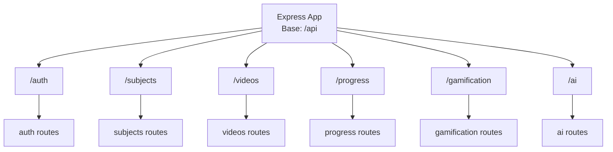
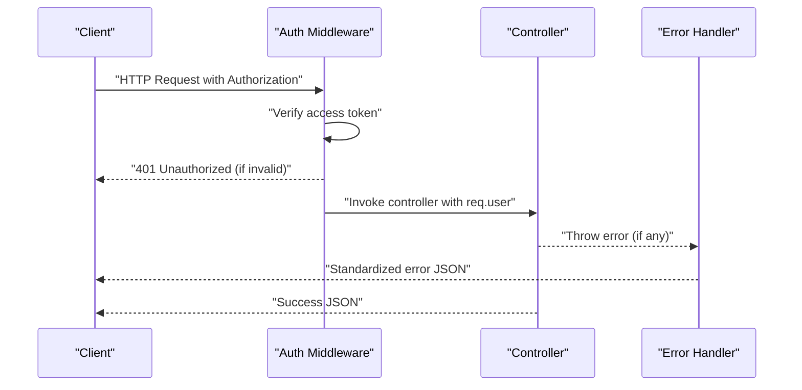
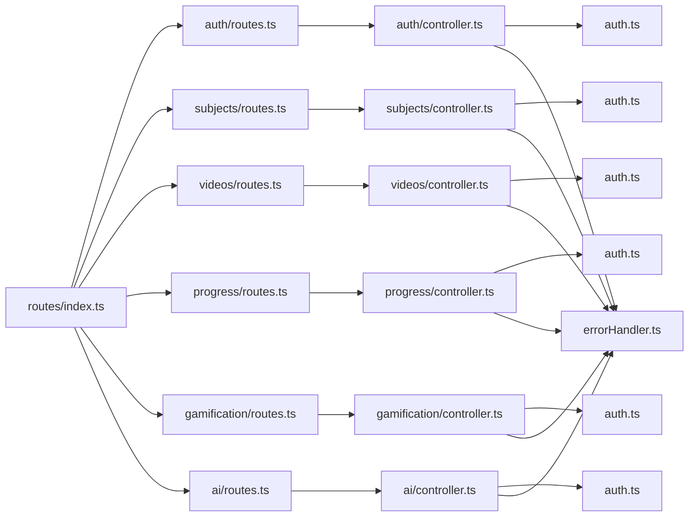

# API Documentation

<cite>
**Referenced Files in This Document**
- [routes/index.ts](file://backend/src/routes/index.ts)
- [auth/routes.ts](file://backend/src/modules/auth/routes.ts)
- [auth/controller.ts](file://backend/src/modules/auth/controller.ts)
- [subjects/routes.ts](file://backend/src/modules/subjects/routes.ts)
- [subjects/controller.ts](file://backend/src/modules/subjects/controller.ts)
- [videos/routes.ts](file://backend/src/modules/videos/routes.ts)
- [videos/controller.ts](file://backend/src/modules/videos/controller.ts)
- [progress/routes.ts](file://backend/src/modules/progress/routes.ts)
- [progress/controller.ts](file://backend/src/modules/progress/controller.ts)
- [gamification/routes.ts](file://backend/src/modules/gamification/routes.ts)
- [gamification/controller.ts](file://backend/src/modules/gamification/controller.ts)
- [ai/routes.ts](file://backend/src/modules/ai/routes.ts)
- [ai/controller.ts](file://backend/src/modules/ai/controller.ts)
- [auth.ts](file://backend/src/middleware/auth.ts)
- [errorHandler.ts](file://backend/src/middleware/errorHandler.ts)
- [validation.ts](file://backend/src/utils/validation.ts)
- [jwt.ts](file://backend/src/utils/jwt.ts)
</cite>

## Table of Contents
1. [Introduction](#introduction)
2. [Project Structure](#project-structure)
3. [Core Components](#core-components)
4. [Architecture Overview](#architecture-overview)
5. [Detailed Component Analysis](#detailed-component-analysis)
6. [Dependency Analysis](#dependency-analysis)
7. [Performance Considerations](#performance-considerations)
8. [Troubleshooting Guide](#troubleshooting-guide)
9. [Conclusion](#conclusion)
10. [Appendices](#appendices)

## Introduction
This document provides comprehensive API documentation for the Learning Management System’s RESTful endpoints. It covers HTTP methods, URL patterns, request/response schemas, authentication requirements, error handling, and security headers. Endpoints are grouped by domain: Authentication, Course Management, Video Content, Progress Tracking, Gamification, and AI Assistant.

## Project Structure
The backend exposes a single base route prefix for all API groups. Each group mounts its own router under a dedicated namespace.

**Diagram sources**
- [routes/index.ts:17-22](file://backend/src/routes/index.ts#L17-L22)

**Section sources**
- [routes/index.ts:1-25](file://backend/src/routes/index.ts#L1-L25)

## Core Components
- Authentication middleware enforces Bearer token authentication and optionally attaches user context.
- Error handling wraps async endpoints and standardizes error responses.
- Validation schemas define request body constraints for registration, login, progress updates, and AI chat requests.

Key behaviors:
- Authentication: Requires Authorization header with Bearer token; optionalAuth allows unauthenticated requests but still attaches user if present.
- Error handling: Catches exceptions and returns structured JSON with error code and message; development mode includes stack traces.
- Validation: Zod schemas enforce field presence and types for request bodies.

**Section sources**
- [auth.ts:8-41](file://backend/src/middleware/auth.ts#L8-L41)
- [errorHandler.ts:8-37](file://backend/src/middleware/errorHandler.ts#L8-L37)
- [validation.ts:3-30](file://backend/src/utils/validation.ts#L3-L30)

## Architecture Overview
High-level flow for authenticated requests:
- Client sends Authorization: Bearer <access-token>.
- Middleware verifies token and attaches user payload to request.
- Controller executes business logic and returns JSON response.
- Errors are normalized via the error handler.

**Diagram sources**
- [auth.ts:8-24](file://backend/src/middleware/auth.ts#L8-L24)
- [errorHandler.ts:8-24](file://backend/src/middleware/errorHandler.ts#L8-L24)

## Detailed Component Analysis

### Authentication (/api/auth/*)
- Base path: /api/auth
- Authentication: Required for protected endpoints; optional for public registration/login.

Endpoints
- POST /register
  - Description: Registers a new user.
  - Authentication: Not required.
  - Request body: Email, Password, Name.
  - Response: User object and success message.
  - Status codes: 201 Created, 400 Bad Request (validation), 409 Conflict (duplicate), 500 Internal Server Error.
  - Example request: See [auth/controller.ts:8-16](file://backend/src/modules/auth/controller.ts#L8-L16).
  - Example response: See [auth/controller.ts:12-15](file://backend/src/modules/auth/controller.ts#L12-L15).

- POST /login
  - Description: Logs in an existing user and returns access token and refresh token cookie.
  - Authentication: Not required.
  - Request body: Email, Password.
  - Response: User object, access token, and message.
  - Cookies: refreshToken (httpOnly, secure in production, sameSite strict, 7-day expiry).
  - Status codes: 200 OK, 400 Bad Request (validation), 401 Unauthorized (invalid credentials), 500 Internal Server Error.
  - Example request: See [auth/controller.ts:18-35](file://backend/src/modules/auth/controller.ts#L18-L35).

- POST /logout
  - Description: Revokes refresh token and clears cookie.
  - Authentication: Not required (reads refreshToken from cookie/body).
  - Request body: Optional refreshToken.
  - Response: Success message.
  - Cookies: Clears refreshToken.
  - Status codes: 200 OK, 400 Bad Request, 500 Internal Server Error.
  - Example response: See [auth/controller.ts:44](file://backend/src/modules/auth/controller.ts#L44).

- POST /refresh
  - Description: Issues new access token using valid refresh token.
  - Authentication: Not required (reads refreshToken from cookie/body).
  - Request body: Optional refreshToken.
  - Response: New access token; sets refreshed refreshToken cookie.
  - Cookies: Sets refreshToken (httpOnly, secure in production, sameSite strict, 7-day expiry).
  - Status codes: 200 OK, 400 Bad Request (missing token), 401 Unauthorized (invalid/expired token), 500 Internal Server Error.
  - Example response: See [auth/controller.ts:67-69](file://backend/src/modules/auth/controller.ts#L67-L69).

- GET /me
  - Description: Returns currently authenticated user.
  - Authentication: Required.
  - Response: User object.
  - Status codes: 200 OK, 401 Unauthorized, 404 Not Found (user missing), 500 Internal Server Error.
  - Example response: See [auth/controller.ts:85](file://backend/src/modules/auth/controller.ts#L85).

- POST /logout-all
  - Description: Logs out current user from all devices (revokes all refresh tokens).
  - Authentication: Required.
  - Response: Success message.
  - Cookies: Clears refreshToken.
  - Status codes: 200 OK, 401 Unauthorized, 500 Internal Server Error.
  - Example response: See [auth/controller.ts:97](file://backend/src/modules/auth/controller.ts#L97).

Security headers and considerations
- Access tokens are short-lived; refresh tokens are long-lived and stored hashed in the database.
- Refresh tokens are transmitted as httpOnly cookies to mitigate XSS risks.
- Production environments set secure flag on cookies.

Validation schemas
- Registration: Email, Password (min 8), Name (min 2).
- Login: Email, Password (required).

**Section sources**
- [auth/routes.ts:7-12](file://backend/src/modules/auth/routes.ts#L7-L12)
- [auth/controller.ts:8-99](file://backend/src/modules/auth/controller.ts#L8-L99)
- [validation.ts:3-12](file://backend/src/utils/validation.ts#L3-L12)
- [jwt.ts:20-41](file://backend/src/utils/jwt.ts#L20-L41)
- [jwt.ts:47-62](file://backend/src/utils/jwt.ts#L47-L62)

### Course Management (/api/subjects/*)
- Base path: /api/subjects
- Authentication: Optional for tree and listing; required for enrollment and enrolled list.

Endpoints
- GET /
  - Description: Lists all subjects.
  - Authentication: Not required.
  - Response: Array of subjects.
  - Status codes: 200 OK, 500 Internal Server Error.

- GET /enrolled
  - Description: Lists subjects the authenticated user is enrolled in.
  - Authentication: Required.
  - Response: Array of enrolled subjects.
  - Status codes: 200 OK, 401 Unauthorized, 500 Internal Server Error.

- GET /:slug
  - Description: Retrieves a subject by slug.
  - Authentication: Not required.
  - Response: Subject object.
  - Status codes: 200 OK, 404 Not Found, 500 Internal Server Error.

- GET /:id/tree
  - Description: Returns subject tree data; indicates enrollment if authenticated.
  - Authentication: Optional.
  - Response: Subject tree data and enrollment status.
  - Status codes: 200 OK, 404 Not Found, 500 Internal Server Error.

- POST /:id/enroll
  - Description: Enrolls authenticated user in a subject.
  - Authentication: Required.
  - Response: Success message.
  - Status codes: 201 Created, 401 Unauthorized, 404 Not Found, 500 Internal Server Error.

**Section sources**
- [subjects/routes.ts:13-17](file://backend/src/modules/subjects/routes.ts#L13-L17)
- [subjects/controller.ts:13-68](file://backend/src/modules/subjects/controller.ts#L13-L68)

### Video Content (/api/videos/*)
- Base path: /api/videos
- Authentication: Optional for video retrieval; required for lock status checks.

Endpoints
- GET /:id
  - Description: Retrieves video with context (next/previous videos) and lock status.
  - Authentication: Optional.
  - Response: Video, next/previous video metadata, and lock status.
  - Lock behavior: If unauthenticated, video is locked with a reason.
  - Status codes: 200 OK, 404 Not Found, 500 Internal Server Error.

- GET /:id/lock-status
  - Description: Checks lock status for authenticated user.
  - Authentication: Required.
  - Response: Lock status object.
  - Status codes: 200 OK, 401 Unauthorized, 404 Not Found, 500 Internal Server Error.

**Section sources**
- [videos/routes.ts:7-8](file://backend/src/modules/videos/routes.ts#L7-L8)
- [videos/controller.ts:6-41](file://backend/src/modules/videos/controller.ts#L6-L41)

### Progress Tracking (/api/progress/*)
- Base path: /api/progress
- Authentication: Required for all endpoints.

Endpoints
- GET /videos/:id
  - Description: Retrieves a user’s progress for a specific video.
  - Authentication: Required.
  - Response: Progress object.
  - Status codes: 200 OK, 401 Unauthorized, 500 Internal Server Error.

- POST /videos/:id
  - Description: Updates a user’s progress for a specific video.
  - Authentication: Required.
  - Request body: lastPositionSeconds (number, >=0), isCompleted (boolean).
  - Response: Updated progress object.
  - Status codes: 200 OK, 400 Bad Request (validation), 401 Unauthorized, 500 Internal Server Error.

- GET /subjects/:id
  - Description: Retrieves subject progress and last watched video for a subject.
  - Authentication: Required.
  - Response: Progress and last watched video.
  - Status codes: 200 OK, 401 Unauthorized, 500 Internal Server Error.

- GET /all
  - Description: Retrieves all subject progress for the user.
  - Authentication: Required.
  - Response: Progress collection.
  - Status codes: 200 OK, 401 Unauthorized, 500 Internal Server Error.

Validation schema
- Progress update: lastPositionSeconds (optional), isCompleted (optional).

**Section sources**
- [progress/routes.ts:12-15](file://backend/src/modules/progress/routes.ts#L12-L15)
- [progress/controller.ts:12-65](file://backend/src/modules/progress/controller.ts#L12-L65)
- [validation.ts:14-17](file://backend/src/utils/validation.ts#L14-L17)

### Gamification (/api/gamification/*)
- Base path: /api/gamification
- Authentication: Required for all endpoints.

Endpoints
- GET /profile
  - Description: Retrieves user gamification profile.
  - Authentication: Required.
  - Response: Profile object.
  - Status codes: 200 OK, 401 Unauthorized, 500 Internal Server Error.

- GET /achievements
  - Description: Retrieves user’s achievements.
  - Authentication: Required.
  - Response: Achievements array.
  - Status codes: 200 OK, 401 Unauthorized, 500 Internal Server Error.

- POST /xp/earn
  - Description: Manually awards XP to the user.
  - Authentication: Required.
  - Request body: amount (positive number), reason (optional).
  - Response: Updated XP record.
  - Status codes: 200 OK, 400 Bad Request (invalid amount), 401 Unauthorized, 500 Internal Server Error.

- POST /complete-video
  - Description: Awards XP for completing a video and returns updated profile.
  - Authentication: Required.
  - Response: Message and updated profile.
  - Status codes: 200 OK, 401 Unauthorized, 500 Internal Server Error.

**Section sources**
- [gamification/routes.ts:12-15](file://backend/src/modules/gamification/routes.ts#L12-L15)
- [gamification/controller.ts:11-61](file://backend/src/modules/gamification/controller.ts#L11-L61)

### AI Assistant (/api/ai/*)
- Base path: /api/ai
- Authentication: Required for all endpoints.

Endpoints
- POST /chat
  - Description: Sends a message to the AI assistant with optional context.
  - Authentication: Required.
  - Request body: message (required), context (videoId, subjectId optional).
  - Response: AI response object.
  - Status codes: 200 OK, 400 Bad Request (validation), 401 Unauthorized, 500 Internal Server Error.

- POST /summarize
  - Description: Generates a summary for a given video.
  - Authentication: Required.
  - Request body: videoId (required).
  - Response: summary object.
  - Status codes: 200 OK, 400 Bad Request (missing videoId), 401 Unauthorized, 500 Internal Server Error.

- POST /quiz
  - Description: Generates quiz questions for a given video.
  - Authentication: Required.
  - Request body: videoId (required).
  - Response: Questions array.
  - Status codes: 200 OK, 400 Bad Request (missing videoId), 401 Unauthorized, 500 Internal Server Error.

- POST /explain
  - Description: Requests an explanation for a concept within a video context.
  - Authentication: Required.
  - Request body: concept (required), videoId (optional).
  - Response: Explanation object.
  - Status codes: 200 OK, 400 Bad Request (missing concept), 401 Unauthorized, 500 Internal Server Error.

Validation schema
- AI chat: message (required), context (object with optional videoId/subjectId).

**Section sources**
- [ai/routes.ts:7-10](file://backend/src/modules/ai/routes.ts#L7-L10)
- [ai/controller.ts:7-72](file://backend/src/modules/ai/controller.ts#L7-L72)
- [validation.ts:19-25](file://backend/src/utils/validation.ts#L19-L25)

## Dependency Analysis
- Route composition: Central router mounts module-specific routers under /api/{group}.
- Authentication: Each protected endpoint depends on auth middleware to attach user context.
- Error handling: Controllers wrap logic with asyncHandler; global error handler normalizes errors.
- Validation: Controllers parse request bodies against Zod schemas before processing.

**Diagram sources**
- [routes/index.ts:2-7](file://backend/src/routes/index.ts#L2-L7)
- [auth/routes.ts:2-3](file://backend/src/modules/auth/routes.ts#L2-L3)
- [subjects/routes.ts:2-9](file://backend/src/modules/subjects/routes.ts#L2-L9)
- [videos/routes.ts:2-3](file://backend/src/modules/videos/routes.ts#L2-L3)
- [progress/routes.ts:2-8](file://backend/src/modules/progress/routes.ts#L2-L8)
- [gamification/routes.ts:2-8](file://backend/src/modules/gamification/routes.ts#L2-L8)
- [ai/routes.ts:2-3](file://backend/src/modules/ai/routes.ts#L2-L3)

**Section sources**
- [routes/index.ts:1-25](file://backend/src/routes/index.ts#L1-L25)
- [auth.ts:8-41](file://backend/src/middleware/auth.ts#L8-L41)
- [errorHandler.ts:33-37](file://backend/src/middleware/errorHandler.ts#L33-L37)

## Performance Considerations
- Token verification is lightweight; avoid excessive token refreshes to reduce DB queries.
- Prefer batched progress updates where possible to minimize round trips.
- Cache non-sensitive subject tree data when feasible to reduce compute load.
- Use pagination for large lists (e.g., enrolled subjects) to limit payload sizes.

## Troubleshooting Guide
Common issues and resolutions
- 401 Unauthorized
  - Cause: Missing or invalid Authorization header; expired or revoked tokens.
  - Resolution: Re-authenticate or refresh access token; ensure cookie is sent for refresh.
  - Reference: [auth.ts:12-23](file://backend/src/middleware/auth.ts#L12-L23), [jwt.ts:47-62](file://backend/src/utils/jwt.ts#L47-L62).

- 400 Bad Request
  - Cause: Invalid request body (e.g., missing fields, wrong types).
  - Resolution: Validate against provided schemas; see validation definitions.
  - Reference: [validation.ts:3-30](file://backend/src/utils/validation.ts#L3-L30).

- 404 Not Found
  - Cause: Resource does not exist (subject, video, user).
  - Resolution: Verify identifiers and permissions.
  - Reference: [subjects/controller.ts:22-25](file://backend/src/modules/subjects/controller.ts#L22-L25), [videos/controller.ts:10-13](file://backend/src/modules/videos/controller.ts#L10-L13).

- 5xx Internal Server Error
  - Cause: Unexpected server-side failure.
  - Resolution: Inspect logs and error handler output; development mode includes stack traces.
  - Reference: [errorHandler.ts:8-24](file://backend/src/middleware/errorHandler.ts#L8-L24).

Rate limiting
- Not implemented in the current codebase. Consider adding rate limiting per endpoint or per IP to protect sensitive endpoints like login and refresh.

Security headers
- Access tokens: Bearer scheme in Authorization header.
- Refresh tokens: httpOnly, secure (in production), sameSite strict cookies.
- CSRF protection: Consider adding CSRF tokens or SameSite=Lax for browser clients if applicable.

## Conclusion
The API follows a clean modular structure with consistent authentication, validation, and error handling. Clients should manage access tokens and refresh tokens securely, adhere to request schemas, and handle standardized error responses. Extending the system with rate limiting and additional security measures will further improve robustness.

## Appendices

### Endpoint Reference Summary
- Authentication
  - POST /api/auth/register
  - POST /api/auth/login
  - POST /api/auth/logout
  - POST /api/auth/refresh
  - GET /api/auth/me
  - POST /api/auth/logout-all

- Course Management
  - GET /api/subjects/
  - GET /api/subjects/enrolled
  - GET /api/subjects/:slug
  - GET /api/subjects/:id/tree
  - POST /api/subjects/:id/enroll

- Video Content
  - GET /api/videos/:id
  - GET /api/videos/:id/lock-status

- Progress Tracking
  - GET /api/progress/videos/:id
  - POST /api/progress/videos/:id
  - GET /api/progress/subjects/:id
  - GET /api/progress/all

- Gamification
  - GET /api/gamification/profile
  - GET /api/gamification/achievements
  - POST /api/gamification/xp/earn
  - POST /api/gamification/complete-video

- AI Assistant
  - POST /api/ai/chat
  - POST /api/ai/summarize
  - POST /api/ai/quiz
  - POST /api/ai/explain

### Client Implementation Guidelines
- Authentication
  - Send Authorization: Bearer <access-token> for protected endpoints.
  - Persist refresh token in httpOnly cookie; send it automatically with requests.
  - On 401, attempt refresh via POST /api/auth/refresh; retry original request.

- Request/Response Patterns
  - Use provided validation schemas to construct requests.
  - Expect JSON responses; handle standardized error objects with code and message.

- Security
  - Never expose access tokens in client logs or URLs.
  - Ensure HTTPS in production to protect cookies and tokens.

- Common Usage Patterns
  - After login, store both access token and refresh token; use access token for subsequent calls.
  - On enrollment, fetch subject tree to determine lock status and navigation.
  - Periodically sync progress updates to persist watch history.