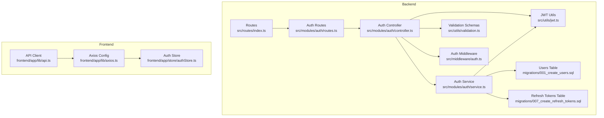
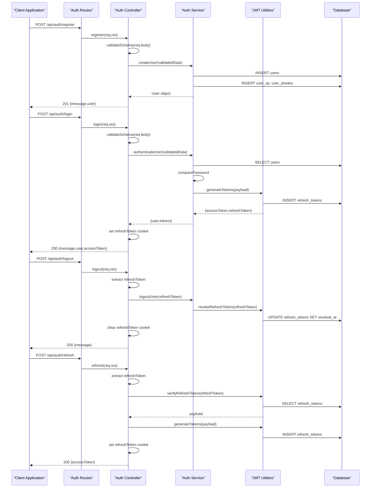
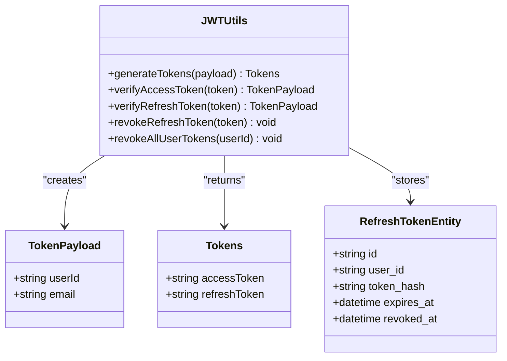
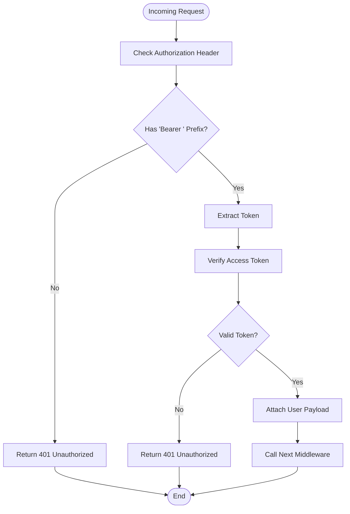
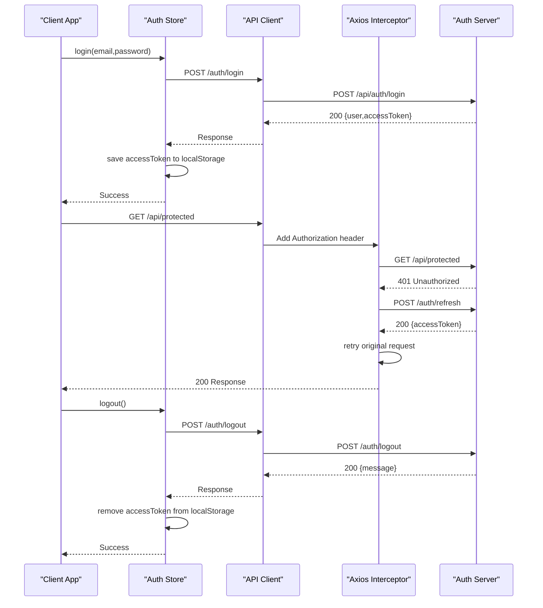
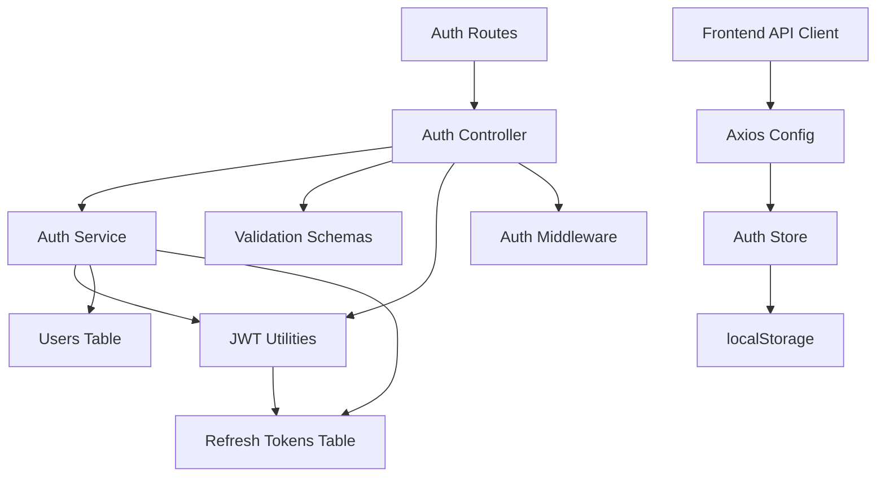

# Authentication API

<cite>
**Referenced Files in This Document**
- [routes/index.ts](file://backend/src/routes/index.ts)
- [auth/routes.ts](file://backend/src/modules/auth/routes.ts)
- [auth/controller.ts](file://backend/src/modules/auth/controller.ts)
- [auth/service.ts](file://backend/src/modules/auth/service.ts)
- [auth/middleware/auth.ts](file://backend/src/middleware/auth.ts)
- [auth/utils/jwt.ts](file://backend/src/utils/jwt.ts)
- [auth/utils/validation.ts](file://backend/src/utils/validation.ts)
- [auth/migrations/001_create_users.sql](file://backend/migrations/001_create_users.sql)
- [auth/migrations/007_create_refresh_tokens.sql](file://backend/migrations/007_create_refresh_tokens.sql)
- [frontend/app/lib/api.ts](file://frontend/app/lib/api.ts)
- [frontend/app/lib/axios.ts](file://frontend/app/lib/axios.ts)
- [frontend/app/store/authStore.ts](file://frontend/app/store/authStore.ts)
</cite>

## Table of Contents
1. [Introduction](#introduction)
2. [Project Structure](#project-structure)
3. [Core Components](#core-components)
4. [Architecture Overview](#architecture-overview)
5. [Detailed Component Analysis](#detailed-component-analysis)
6. [Dependency Analysis](#dependency-analysis)
7. [Performance Considerations](#performance-considerations)
8. [Troubleshooting Guide](#troubleshooting-guide)
9. [Conclusion](#conclusion)

## Introduction
This document provides comprehensive API documentation for the Authentication module endpoints. It covers user registration, login, logout, and JWT refresh token generation, including request/response schemas, validation rules, error responses, authentication requirements, JWT token structure, refresh token rotation mechanism, and security headers. It also includes client implementation examples showing proper token handling, error scenarios, and best practices for secure authentication workflows.

## Project Structure
The authentication system is organized into backend and frontend components:
- Backend: Express routes, controllers, services, middleware, JWT utilities, and validation schemas
- Frontend: API client, Axios configuration, and Zustand store for state management

**Diagram sources**
- [routes/index.ts:1-25](file://backend/src/routes/index.ts#L1-L25)
- [auth/routes.ts:1-15](file://backend/src/modules/auth/routes.ts#L1-L15)
- [auth/controller.ts:1-99](file://backend/src/modules/auth/controller.ts#L1-L99)
- [auth/service.ts:1-108](file://backend/src/modules/auth/service.ts#L1-L108)
- [auth/middleware/auth.ts:1-42](file://backend/src/middleware/auth.ts#L1-L42)
- [auth/utils/jwt.ts:1-78](file://backend/src/utils/jwt.ts#L1-L78)
- [auth/utils/validation.ts:1-31](file://backend/src/utils/validation.ts#L1-L31)
- [auth/migrations/001_create_users.sql:1-11](file://backend/migrations/001_create_users.sql#L1-L11)
- [auth/migrations/007_create_refresh_tokens.sql:1-13](file://backend/migrations/007_create_refresh_tokens.sql#L1-L13)
- [frontend/app/lib/api.ts:1-80](file://frontend/app/lib/api.ts#L1-L80)
- [frontend/app/lib/axios.ts:1-61](file://frontend/app/lib/axios.ts#L1-L61)
- [frontend/app/store/authStore.ts:1-98](file://frontend/app/store/authStore.ts#L1-L98)

**Section sources**
- [routes/index.ts:1-25](file://backend/src/routes/index.ts#L1-L25)
- [auth/routes.ts:1-15](file://backend/src/modules/auth/routes.ts#L1-L15)

## Core Components
This section documents the four primary authentication endpoints and their associated components.

### POST /api/auth/register
Registers a new user with validated credentials.

- **Purpose**: Create a new user account with email, password, and name
- **Request Body Schema**:
  - email: string (required, must be a valid email)
  - password: string (required, minimum 8 characters)
  - name: string (required, minimum 2 characters)
- **Response Body**:
  - message: string (success message)
  - user: object containing id, email, name, and optional avatar_url
- **Status Codes**:
  - 201 Created on successful registration
  - 400 Bad Request on validation errors
  - 409 Conflict if user already exists
- **Security Headers**: None required
- **Authentication**: Not required

### POST /api/auth/login
Authenticates an existing user and issues access/refresh tokens.

- **Purpose**: Authenticate user credentials and return tokens
- **Request Body Schema**:
  - email: string (required, must be a valid email)
  - password: string (required)
- **Response Body**:
  - message: string (success message)
  - user: object containing id, email, name, and optional avatar_url
  - accessToken: string (JWT access token)
- **Cookies**:
  - refreshToken: HTTP-only cookie with security attributes
- **Status Codes**:
  - 200 OK on successful login
  - 400 Bad Request on validation errors
  - 401 Unauthorized for invalid credentials
- **Security Headers**: Authorization: Bearer <access_token> for protected routes
- **Authentication**: Not required

### POST /api/auth/logout
Terminates the current session by revoking the refresh token.

- **Purpose**: Logout the current device/session
- **Request Body**:
  - refreshToken: string (optional, can be sent as body or cookie)
- **Response Body**:
  - message: string (success message)
- **Cookies**:
  - Clears refreshToken cookie
- **Status Codes**:
  - 200 OK on successful logout
  - 401 Unauthorized if no refresh token provided
- **Security Headers**: None required
- **Authentication**: Not required

### POST /api/auth/refresh-token
Generates a new access token using a valid refresh token.

- **Purpose**: Refresh access token using refresh token
- **Request Body**:
  - refreshToken: string (optional, can be sent as body or cookie)
- **Response Body**:
  - accessToken: string (new JWT access token)
- **Cookies**:
  - refreshToken: HTTP-only cookie with security attributes
- **Status Codes**:
  - 200 OK on successful refresh
  - 400 Bad Request if refresh token missing
  - 401 Unauthorized for invalid/expired refresh token
- **Security Headers**: None required
- **Authentication**: Not required

**Section sources**
- [auth/controller.ts:8-16](file://backend/src/modules/auth/controller.ts#L8-L16)
- [auth/controller.ts:18-35](file://backend/src/modules/auth/controller.ts#L18-L35)
- [auth/controller.ts:37-46](file://backend/src/modules/auth/controller.ts#L37-L46)
- [auth/controller.ts:48-70](file://backend/src/modules/auth/controller.ts#L48-L70)
- [auth/routes.ts:7-12](file://backend/src/modules/auth/routes.ts#L7-L12)
- [auth/utils/validation.ts:3-12](file://backend/src/utils/validation.ts#L3-L12)

## Architecture Overview
The authentication system follows a layered architecture with clear separation of concerns:

**Diagram sources**
- [auth/controller.ts:8-70](file://backend/src/modules/auth/controller.ts#L8-L70)
- [auth/service.ts:13-81](file://backend/src/modules/auth/service.ts#L13-L81)
- [auth/utils/jwt.ts:20-41](file://backend/src/utils/jwt.ts#L20-L41)
- [auth/utils/jwt.ts:47-62](file://backend/src/utils/jwt.ts#L47-L62)

## Detailed Component Analysis

### JWT Token Structure and Security
The system uses JSON Web Tokens with a refresh token rotation mechanism:

**Diagram sources**
- [auth/utils/jwt.ts:10-18](file://backend/src/utils/jwt.ts#L10-L18)
- [auth/utils/jwt.ts:20-41](file://backend/src/utils/jwt.ts#L20-L41)
- [auth/migrations/007_create_refresh_tokens.sql:1-13](file://backend/migrations/007_create_refresh_tokens.sql#L1-L13)

Key JWT characteristics:
- Access token expiration: configured via JWT_EXPIRES_IN environment variable (default: 15 minutes)
- Refresh token expiration: configured via JWT_REFRESH_EXPIRES_IN environment variable (default: 7 days)
- Refresh token rotation: each refresh generates a new refresh token with a new UUID
- Token storage: refresh tokens are stored as SHA-256 hashes in the database for verification and revocation

### Authentication Middleware
The authentication middleware validates bearer tokens for protected routes:

**Diagram sources**
- [auth/middleware/auth.ts:8-24](file://backend/src/middleware/auth.ts#L8-L24)

### Client-Side Implementation
The frontend implements robust token handling with automatic refresh:

**Diagram sources**
- [frontend/app/store/authStore.ts:34-72](file://frontend/app/store/authStore.ts#L34-L72)
- [frontend/app/lib/axios.ts:28-58](file://frontend/app/lib/axios.ts#L28-L58)
- [frontend/app/lib/api.ts:4-16](file://frontend/app/lib/api.ts#L4-L16)

**Section sources**
- [auth/utils/jwt.ts:20-78](file://backend/src/utils/jwt.ts#L20-L78)
- [auth/middleware/auth.ts:1-42](file://backend/src/middleware/auth.ts#L1-L42)
- [frontend/app/lib/axios.ts:13-58](file://frontend/app/lib/axios.ts#L13-L58)
- [frontend/app/store/authStore.ts:26-98](file://frontend/app/store/authStore.ts#L26-L98)

## Dependency Analysis
The authentication system has well-defined dependencies between components:

**Diagram sources**
- [auth/routes.ts:1-15](file://backend/src/modules/auth/routes.ts#L1-L15)
- [auth/controller.ts:1-7](file://backend/src/modules/auth/controller.ts#L1-L7)
- [auth/service.ts:1-4](file://backend/src/modules/auth/service.ts#L1-L4)
- [auth/utils/jwt.ts:1-4](file://backend/src/utils/jwt.ts#L1-L4)
- [frontend/app/lib/api.ts:1-16](file://frontend/app/lib/api.ts#L1-L16)
- [frontend/app/lib/axios.ts:1-11](file://frontend/app/lib/axios.ts#L1-L11)
- [frontend/app/store/authStore.ts:1-10](file://frontend/app/store/authStore.ts#L1-L10)

Key dependency relationships:
- Routes depend on Controllers
- Controllers depend on Services, Validation, and JWT utilities
- Services depend on JWT utilities and database
- Frontend depends on API client and Axios interceptors
- No circular dependencies detected

**Section sources**
- [auth/routes.ts:1-15](file://backend/src/modules/auth/routes.ts#L1-L15)
- [auth/controller.ts:1-7](file://backend/src/modules/auth/controller.ts#L1-L7)
- [auth/service.ts:1-4](file://backend/src/modules/auth/service.ts#L1-L4)
- [auth/utils/jwt.ts:1-4](file://backend/src/utils/jwt.ts#L1-L4)

## Performance Considerations
- Token verification is O(1) with database lookups for refresh token validation
- Password hashing uses bcrypt with cost factor managed by the password utility
- Refresh token rotation ensures efficient token lifecycle management
- Database indexes on email, token_hash, user_id, and expires_at optimize query performance
- Frontend caching of access tokens reduces unnecessary requests

## Troubleshooting Guide

### Common Error Scenarios
1. **Registration Failures**:
   - Invalid email format: Validation error with 400 status
   - Password too short: Validation error with 400 status
   - Duplicate email: 409 Conflict indicating user already exists

2. **Login Failures**:
   - Invalid credentials: 401 Unauthorized
   - Account not found: 401 Unauthorized

3. **Token Issues**:
   - Expired access token: 401 Unauthorized, trigger refresh flow
   - Invalid refresh token: 401 Unauthorized, requires re-login
   - Revoked refresh token: 401 Unauthorized, requires re-login

4. **Frontend Token Management**:
   - Missing access token: Automatic refresh attempt fails, redirects to login
   - Storage issues: Local storage corruption leads to authentication reset

### Debugging Steps
1. Verify environment variables for JWT secrets and expiration times
2. Check database connectivity and table existence
3. Validate token format and expiration timestamps
4. Monitor refresh token database entries for proper cleanup
5. Inspect browser cookies for HTTP-only refresh token persistence

**Section sources**
- [auth/service.ts:16-20](file://backend/src/modules/auth/service.ts#L16-L20)
- [auth/controller.ts:61-68](file://backend/src/modules/auth/controller.ts#L61-L68)
- [auth/utils/jwt.ts:57-62](file://backend/src/utils/jwt.ts#L57-L62)
- [frontend/app/lib/axios.ts:33-54](file://frontend/app/lib/axios.ts#L33-L54)

## Conclusion
The Authentication module provides a robust, secure, and well-structured authentication system with comprehensive token management, validation, and error handling. The implementation follows modern security practices including refresh token rotation, HTTP-only cookies, and proper error responses. The frontend integration demonstrates best practices for token storage, automatic refresh, and user experience during authentication flows.