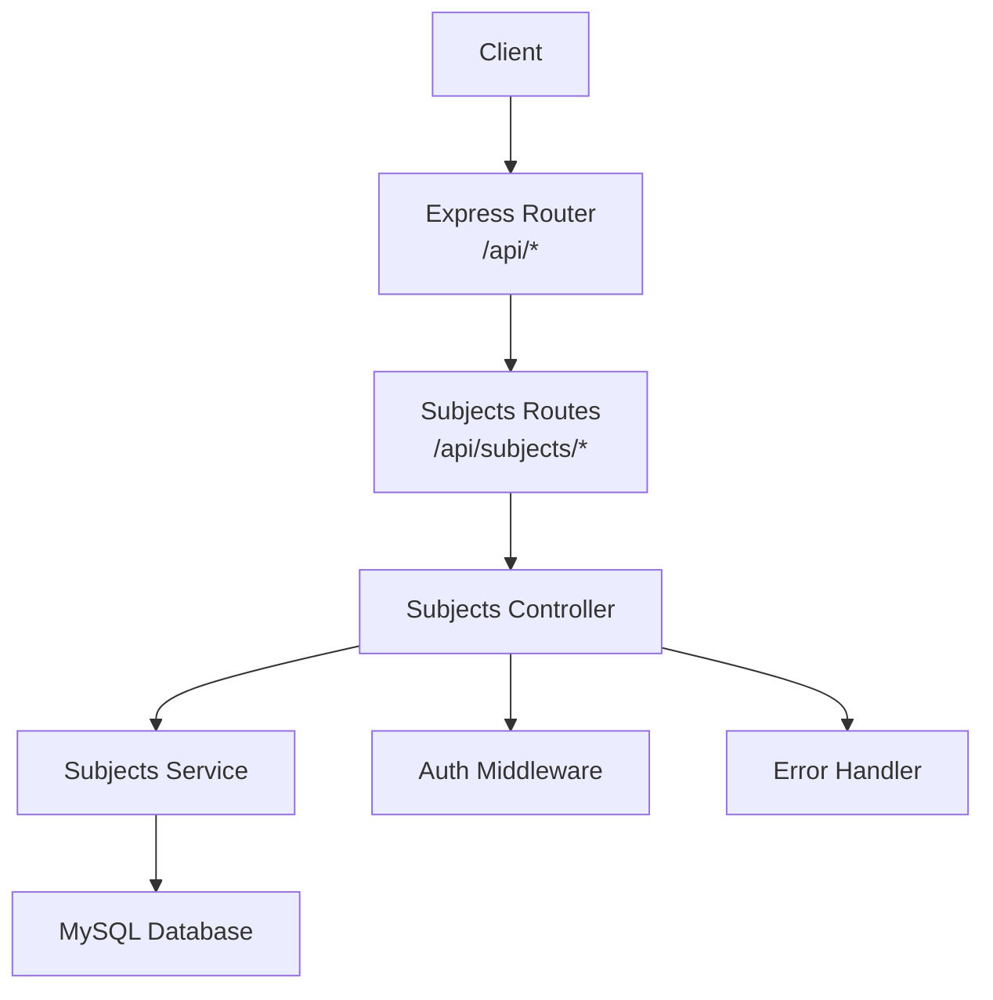
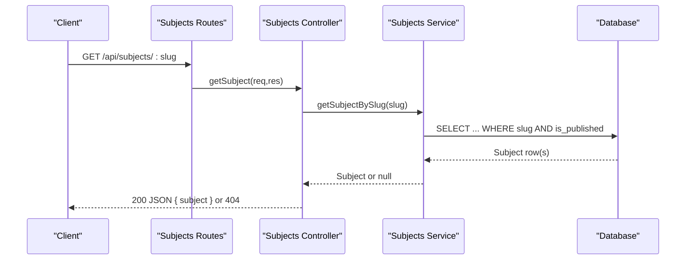
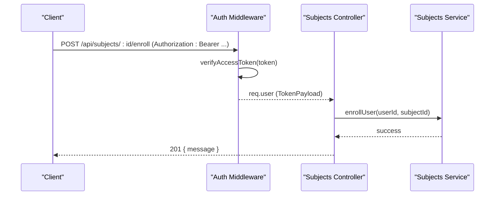
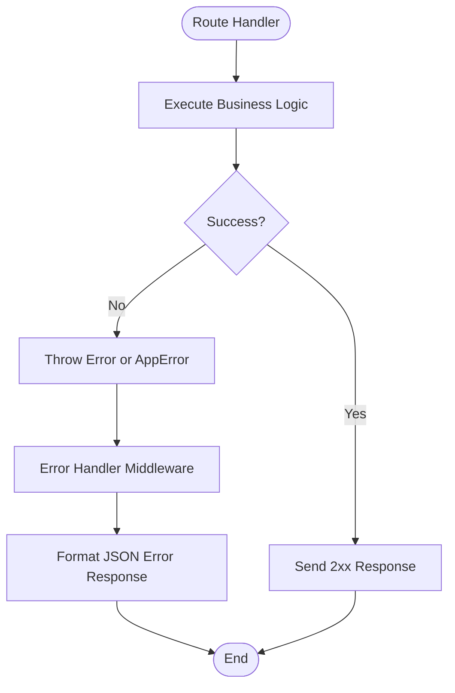
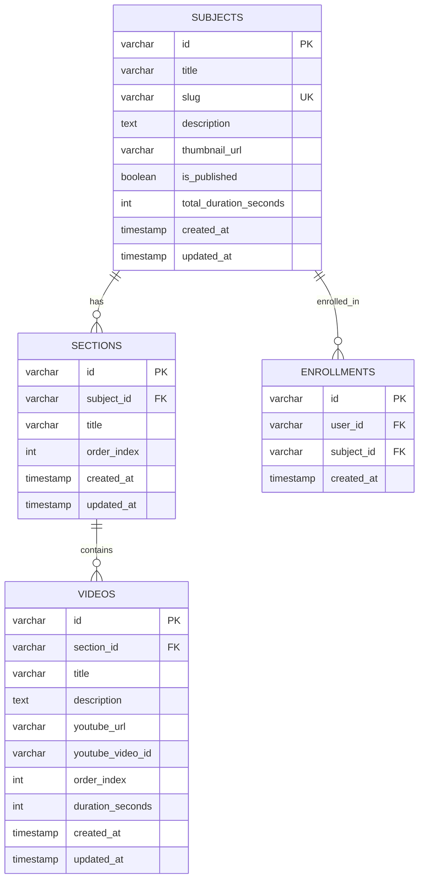
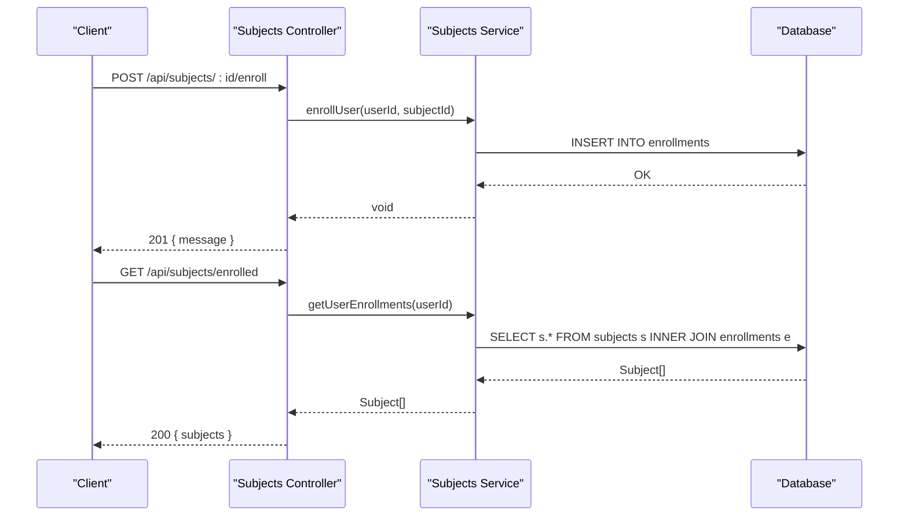
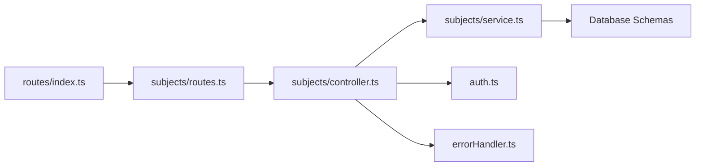

# Course Management API

<cite>
**Referenced Files in This Document**
- [routes/index.ts](file://backend/src/routes/index.ts)
- [subjects/routes.ts](file://backend/src/modules/subjects/routes.ts)
- [subjects/controller.ts](file://backend/src/modules/subjects/controller.ts)
- [subjects/service.ts](file://backend/src/modules/subjects/service.ts)
- [auth.ts](file://backend/src/middleware/auth.ts)
- [errorHandler.ts](file://backend/src/middleware/errorHandler.ts)
- [jwt.ts](file://backend/src/utils/jwt.ts)
- [002_create_subjects.sql](file://backend/migrations/002_create_subjects.sql)
- [003_create_sections.sql](file://backend/migrations/003_create_sections.sql)
- [004_create_videos.sql](file://backend/migrations/004_create_videos.sql)
- [005_create_enrollments.sql](file://backend/migrations/005_create_enrollments.sql)
- [api.ts](file://frontend/app/lib/api.ts)
</cite>

## Table of Contents
1. [Introduction](#introduction)
2. [Project Structure](#project-structure)
3. [Core Components](#core-components)
4. [Architecture Overview](#architecture-overview)
5. [Detailed Component Analysis](#detailed-component-analysis)
6. [Dependency Analysis](#dependency-analysis)
7. [Performance Considerations](#performance-considerations)
8. [Troubleshooting Guide](#troubleshooting-guide)
9. [Conclusion](#conclusion)

## Introduction
This document provides comprehensive API documentation for the Course Management module. It covers the course catalog retrieval, course details, enrollment workflows, and hierarchical content structure. The module exposes endpoints under the base path /api/subjects and integrates with authentication, error handling, and database schemas for subjects, sections, videos, and enrollments.

## Project Structure
The Course Management module is organized into routing, controller, service, and middleware layers. Routes are mounted under /api/subjects and handled by dedicated controller functions that delegate to service functions. Authentication middleware enforces access control, while error handling ensures consistent responses.

**Diagram sources**
- [routes/index.ts:16-22](file://backend/src/routes/index.ts#L16-L22)
- [subjects/routes.ts:1-20](file://backend/src/modules/subjects/routes.ts#L1-L20)
- [subjects/controller.ts:1-69](file://backend/src/modules/subjects/controller.ts#L1-L69)
- [subjects/service.ts:1-118](file://backend/src/modules/subjects/service.ts#L1-L118)
- [auth.ts:1-42](file://backend/src/middleware/auth.ts#L1-L42)
- [errorHandler.ts:1-38](file://backend/src/middleware/errorHandler.ts#L1-L38)

**Section sources**
- [routes/index.ts:16-22](file://backend/src/routes/index.ts#L16-L22)
- [subjects/routes.ts:1-20](file://backend/src/modules/subjects/routes.ts#L1-L20)

## Core Components
- Subjects Routes: Define endpoint contracts for listing, retrieving, tree data, enrollment, and enrolled courses.
- Subjects Controller: Implements request handling, authentication checks, and response formatting.
- Subjects Service: Encapsulates data access patterns for subjects, sections, videos, and enrollments.
- Authentication Middleware: Validates access tokens for protected endpoints.
- Error Handler: Centralizes error responses and async error wrapping.

Key responsibilities:
- Catalog retrieval: List published subjects ordered by creation date.
- Course details: Retrieve subject by slug with publication filter.
- Hierarchical content: Build subject tree with sections and videos.
- Enrollment: Enroll authenticated users and list enrolled subjects.
- Access control: Enforce authentication for enrollment and enrolled listing.

**Section sources**
- [subjects/routes.ts:13-17](file://backend/src/modules/subjects/routes.ts#L13-L17)
- [subjects/controller.ts:13-68](file://backend/src/modules/subjects/controller.ts#L13-L68)
- [subjects/service.ts:37-117](file://backend/src/modules/subjects/service.ts#L37-L117)
- [auth.ts:8-24](file://backend/src/middleware/auth.ts#L8-L24)
- [errorHandler.ts:33-37](file://backend/src/middleware/errorHandler.ts#L33-L37)

## Architecture Overview
The Course Management API follows a layered architecture:
- HTTP Layer: Express routes define endpoints.
- Controller Layer: Handles requests, validates context, and orchestrates service calls.
- Service Layer: Performs database queries and constructs hierarchical data.
- Persistence Layer: MySQL tables for subjects, sections, videos, and enrollments.
- Security Layer: JWT-based authentication and optional-auth for public access.

**Diagram sources**
- [subjects/routes.ts:15](file://backend/src/modules/subjects/routes.ts#L15)
- [subjects/controller.ts:18-28](file://backend/src/modules/subjects/controller.ts#L18-L28)
- [subjects/service.ts:51-53](file://backend/src/modules/subjects/service.ts#L51-L53)

## Detailed Component Analysis

### Endpoint Catalog
- Base Path: /api/subjects
- Authentication:
  - Required for enrollment and enrolled listing.
  - Optional for tree and course retrieval.
- Pagination, Filtering, Sorting:
  - No explicit pagination parameters are exposed.
  - Filtering by publication status is implicit for course retrieval.
  - Sorting is applied by creation date for catalogs.

Endpoints:
- GET /api/subjects
  - Purpose: Retrieve published course catalog.
  - Response: { subjects: Subject[] }
  - Notes: Returns only published subjects, ordered by created_at descending.

- GET /api/subjects/:slug
  - Purpose: Retrieve a single published course by slug.
  - Path Params: slug (string)
  - Response: { subject: Subject }
  - Errors: 404 if not found.

- GET /api/subjects/:id/tree
  - Purpose: Retrieve course hierarchy with sections and videos.
  - Path Params: id (string)
  - Query: Optional Authorization header for enrollment status.
  - Response: { subject: SubjectTree, isEnrolled: boolean }
  - Errors: 404 if not found.

- POST /api/subjects/:id/enroll
  - Purpose: Enroll authenticated user in a course.
  - Path Params: id (string)
  - Response: 201 Created { message: "Enrolled successfully" }
  - Errors: 401 Unauthorized, 409 Conflict if already enrolled.

- GET /api/subjects/enrolled
  - Purpose: List subjects enrolled by the authenticated user.
  - Response: { subjects: Subject[] }
  - Errors: 401 Unauthorized if not authenticated.

**Section sources**
- [subjects/routes.ts:13-17](file://backend/src/modules/subjects/routes.ts#L13-L17)
- [subjects/controller.ts:13-68](file://backend/src/modules/subjects/controller.ts#L13-L68)
- [auth.ts:8-24](file://backend/src/middleware/auth.ts#L8-L24)

### Request and Response Schemas

Subject
- id: string (UUID)
- title: string
- slug: string (unique)
- description: string | null
- thumbnail_url: string | null
- is_published: boolean
- total_duration_seconds: number
- created_at: Date

Section
- id: string (UUID)
- subject_id: string (UUID)
- title: string
- order_index: number
- videos: Video[]

Video
- id: string (UUID)
- section_id: string (UUID)
- title: string
- description: string | null
- youtube_url: string
- youtube_video_id: string
- order_index: number
- duration_seconds: number

SubjectTree
- Extends Subject
- sections: Section[] (with embedded videos)

Enrollment
- id: string (UUID)
- user_id: string (UUID)
- subject_id: string (UUID)
- created_at: Date

Notes:
- Course hierarchy is built by joining sections and videos via foreign keys.
- Enrollment status is computed per authenticated user for tree endpoint.

**Section sources**
- [subjects/service.ts:3-35](file://backend/src/modules/subjects/service.ts#L3-L35)
- [subjects/service.ts:55-88](file://backend/src/modules/subjects/service.ts#L55-L88)
- [002_create_subjects.sql:1-14](file://backend/migrations/002_create_subjects.sql#L1-L14)
- [003_create_sections.sql:1-11](file://backend/migrations/003_create_sections.sql#L1-L11)
- [004_create_videos.sql:1-15](file://backend/migrations/004_create_videos.sql#L1-L15)
- [005_create_enrollments.sql:1-12](file://backend/migrations/005_create_enrollments.sql#L1-L12)

### Access Control and Authentication
- Enroll endpoint requires a valid Bearer token.
- Tree endpoint accepts optional authentication to compute enrollment status.
- Token verification uses a shared secret and throws on invalid/expired tokens.
- Unauthenticated requests receive 401 responses for protected endpoints.

**Diagram sources**
- [auth.ts:8-24](file://backend/src/middleware/auth.ts#L8-L24)
- [subjects/controller.ts:48-58](file://backend/src/modules/subjects/controller.ts#L48-L58)
- [subjects/service.ts:98-108](file://backend/src/modules/subjects/service.ts#L98-L108)

**Section sources**
- [auth.ts:8-41](file://backend/src/middleware/auth.ts#L8-L41)
- [jwt.ts:43-44](file://backend/src/utils/jwt.ts#L43-L44)

### Error Handling Strategy
- Async wrapper catches errors thrown inside route handlers.
- Centralized error handler responds with structured JSON containing error message, code, and optional stack in development.
- Not found handler responds consistently for missing resources.
- Specific endpoints return appropriate HTTP codes (e.g., 404 for missing subject, 409 for duplicate enrollment).

**Diagram sources**
- [errorHandler.ts:8-31](file://backend/src/middleware/errorHandler.ts#L8-L31)
- [errorHandler.ts:33-37](file://backend/src/middleware/errorHandler.ts#L33-L37)

**Section sources**
- [errorHandler.ts:8-31](file://backend/src/middleware/errorHandler.ts#L8-L31)
- [subjects/controller.ts:22-25](file://backend/src/modules/subjects/controller.ts#L22-L25)
- [subjects/service.ts:100-102](file://backend/src/modules/subjects/service.ts#L100-L102)

### Data Model and Relationships
The Course Management module relies on four primary tables with defined relationships.

**Diagram sources**
- [002_create_subjects.sql:1-14](file://backend/migrations/002_create_subjects.sql#L1-L14)
- [003_create_sections.sql:1-11](file://backend/migrations/003_create_sections.sql#L1-L11)
- [004_create_videos.sql:1-15](file://backend/migrations/004_create_videos.sql#L1-L15)
- [005_create_enrollments.sql:1-12](file://backend/migrations/005_create_enrollments.sql#L1-L12)

### Enrollment Workflows
- Enrollment requires authentication and prevents duplicate enrollments.
- Enrolled listing filters subjects by publication status and orders by enrollment timestamp.
- Tree endpoint optionally computes enrollment status for authenticated users.

**Diagram sources**
- [subjects/controller.ts:48-68](file://backend/src/modules/subjects/controller.ts#L48-L68)
- [subjects/service.ts:98-117](file://backend/src/modules/subjects/service.ts#L98-L117)

**Section sources**
- [subjects/controller.ts:48-68](file://backend/src/modules/subjects/controller.ts#L48-L68)
- [subjects/service.ts:98-117](file://backend/src/modules/subjects/service.ts#L98-L117)

### Frontend Integration
The frontend consumes the Course Management API through a typed API surface:
- Fetch course catalog: GET /api/subjects
- Fetch course by slug: GET /api/subjects/:slug
- Fetch course tree: GET /api/subjects/:id/tree
- Enroll in course: POST /api/subjects/:id/enroll
- List enrolled courses: GET /api/subjects/enrolled

These calls are mapped to Zustand store actions that manage loading states, errors, and enrollment flags.

**Section sources**
- [api.ts:18-29](file://frontend/app/lib/api.ts#L18-L29)
- [courseStore.ts:58-117](file://frontend/app/store/courseStore.ts#L58-L117)

## Dependency Analysis
- Route registration mounts subjects routes under /api/subjects.
- Controller depends on service functions for data access.
- Service functions depend on database queries and enforce referential integrity via foreign keys.
- Authentication middleware decorates requests with user context for protected endpoints.
- Error handler wraps asynchronous controllers to centralize error responses.

**Diagram sources**
- [routes/index.ts:16-22](file://backend/src/routes/index.ts#L16-L22)
- [subjects/routes.ts:1-20](file://backend/src/modules/subjects/routes.ts#L1-L20)
- [subjects/controller.ts:1-11](file://backend/src/modules/subjects/controller.ts#L1-L11)
- [subjects/service.ts:1](file://backend/src/modules/subjects/service.ts#L1)
- [auth.ts:1-42](file://backend/src/middleware/auth.ts#L1-L42)
- [errorHandler.ts:1-38](file://backend/src/middleware/errorHandler.ts#L1-L38)

**Section sources**
- [routes/index.ts:16-22](file://backend/src/routes/index.ts#L16-L22)
- [subjects/controller.ts:1-11](file://backend/src/modules/subjects/controller.ts#L1-L11)
- [subjects/service.ts:1](file://backend/src/modules/subjects/service.ts#L1)

## Performance Considerations
- Indexes on slug and is_published for subjects enable fast lookup and filtering.
- Composite indexes on subject_id and order_index for sections and videos ensure efficient ordering.
- Tree building performs N+1 queries for videos per section; consider batching or preloading for large hierarchies.
- Pagination is not exposed; consider adding limit/offset or cursor-based pagination for large catalogs.

## Troubleshooting Guide
Common issues and resolutions:
- 401 Unauthorized on enrollment: Ensure a valid Bearer token is included in the Authorization header.
- 404 Not Found for course or tree: Verify the slug/id exists and the course is published.
- 409 Conflict on enrollment: User is already enrolled; avoid duplicate enrollments.
- 500 Internal Server Error: Inspect server logs for stack traces in development mode.

Operational tips:
- Use the health check endpoint to verify service availability.
- Validate JWT secrets and expiration settings for authentication.
- Monitor database query performance and add indexes if needed.

**Section sources**
- [errorHandler.ts:14-23](file://backend/src/middleware/errorHandler.ts#L14-L23)
- [auth.ts:12-23](file://backend/src/middleware/auth.ts#L12-L23)
- [subjects/service.ts:100-102](file://backend/src/modules/subjects/service.ts#L100-L102)

## Conclusion
The Course Management API provides a clear and extensible foundation for course catalogs, hierarchical content, and enrollment workflows. Its modular design, robust authentication, and centralized error handling support maintainable integrations. Future enhancements could include pagination, advanced filtering, and optimized tree loading for improved scalability.