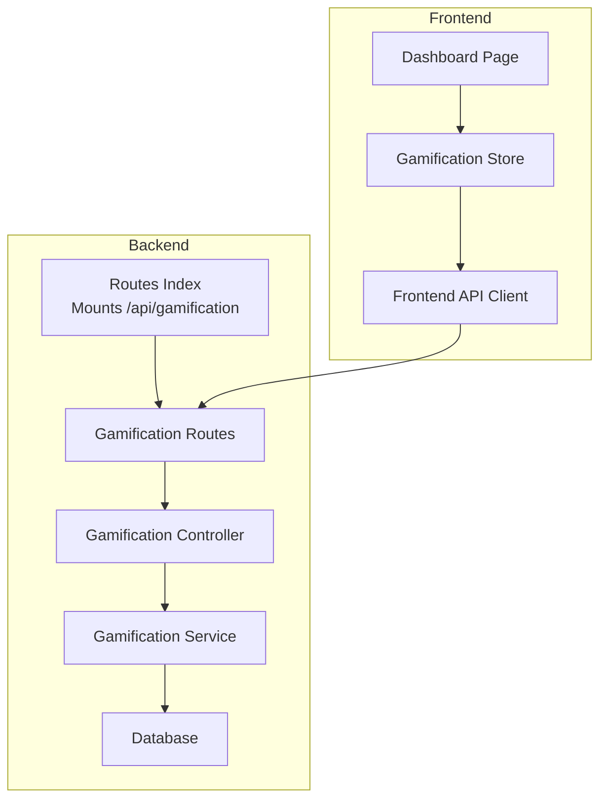
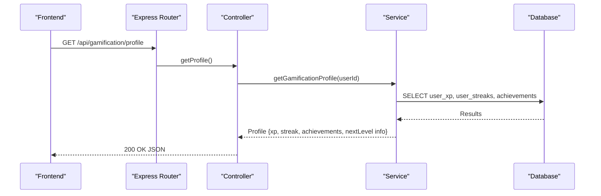
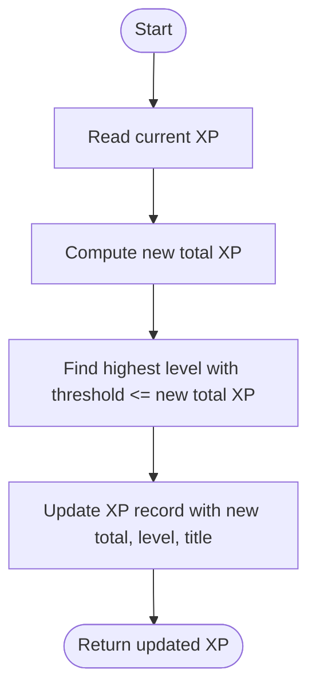
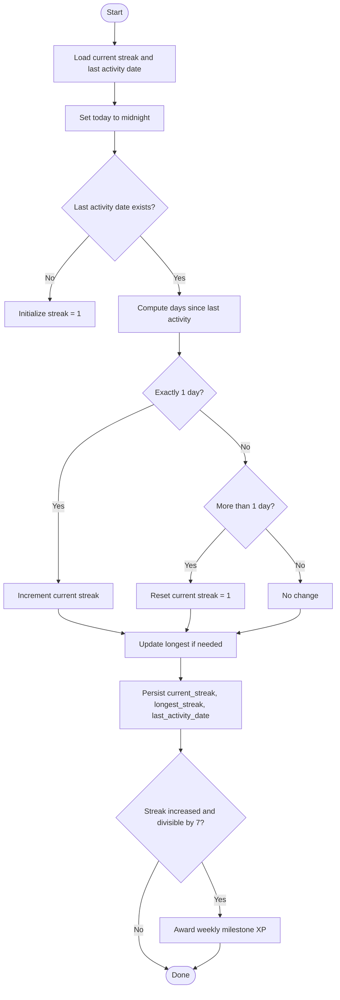
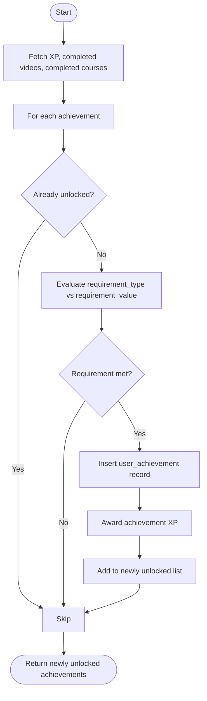
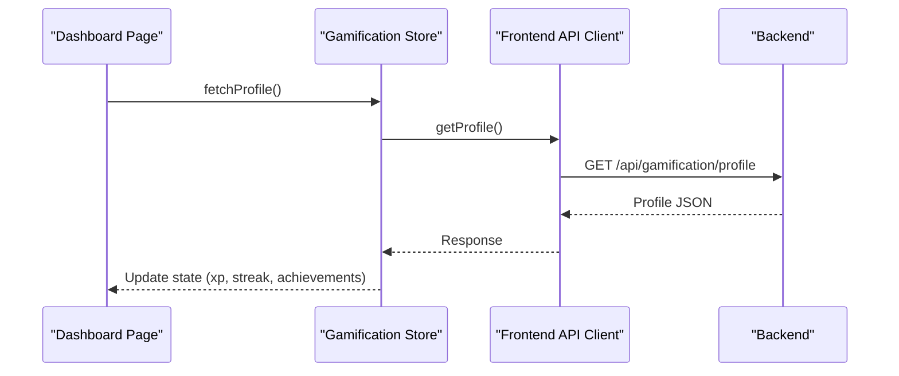
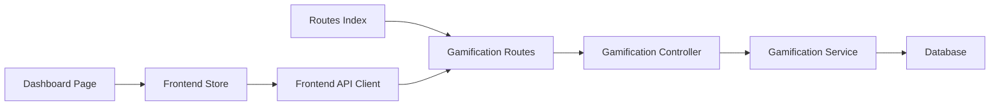

# Gamification API

<cite>
**Referenced Files in This Document**
- [routes/index.ts](file://backend/src/routes/index.ts)
- [gamification/routes.ts](file://backend/src/modules/gamification/routes.ts)
- [gamification/controller.ts](file://backend/src/modules/gamification/controller.ts)
- [gamification/service.ts](file://backend/src/modules/gamification/service.ts)
- [008_create_gamification.sql](file://backend/migrations/008_create_gamification.sql)
- [api.ts](file://frontend/app/lib/api.ts)
- [gamificationStore.ts](file://frontend/app/store/gamificationStore.ts)
- [dashboard/page.tsx](file://frontend/app/(app)/dashboard/page.tsx)
</cite>

## Table of Contents
1. [Introduction](#introduction)
2. [Project Structure](#project-structure)
3. [Core Components](#core-components)
4. [Architecture Overview](#architecture-overview)
5. [Detailed Component Analysis](#detailed-component-analysis)
6. [Dependency Analysis](#dependency-analysis)
7. [Performance Considerations](#performance-considerations)
8. [Troubleshooting Guide](#troubleshooting-guide)
9. [Conclusion](#conclusion)

## Introduction
This document provides comprehensive API documentation for the Gamification module endpoints. It covers the available endpoints for retrieving user XP and achievement status, awarding XP, recording video completions, and integrating with the frontend gamification store. It also documents the underlying gamification models, XP calculation algorithms, achievement criteria, streak tracking, and reward systems. Guidance on fairness and anti-gaming measures is included.

## Project Structure
The Gamification module is implemented as a dedicated Express route group under `/api/gamification`. The routes are mounted in the main router and handled by a controller that delegates to a service layer. The service layer encapsulates business logic and interacts with the database. Frontend integration is provided via a typed API client and a Zustand store.

**Diagram sources**
- [routes/index.ts:1-25](file://backend/src/routes/index.ts#L1-L25)
- [gamification/routes.ts:1-18](file://backend/src/modules/gamification/routes.ts#L1-L18)
- [gamification/controller.ts:1-62](file://backend/src/modules/gamification/controller.ts#L1-L62)
- [gamification/service.ts:1-246](file://backend/src/modules/gamification/service.ts#L1-L246)
- [api.ts:54-64](file://frontend/app/lib/api.ts#L54-L64)
- [gamificationStore.ts:40-85](file://frontend/app/store/gamificationStore.ts#L40-L85)
- [dashboard/page.tsx:11-19](file://frontend/app/(app)/dashboard/page.tsx#L11-L19)

**Section sources**
- [routes/index.ts:1-25](file://backend/src/routes/index.ts#L1-L25)
- [gamification/routes.ts:1-18](file://backend/src/modules/gamification/routes.ts#L1-L18)

## Core Components
- Authentication: All gamification endpoints require an authenticated user via the authentication middleware.
- Controller: Exposes endpoints for profile retrieval, achievements listing, XP earning, and video completion recording.
- Service: Implements XP calculations, streak updates, achievement checks, and profile composition.
- Database: Stores XP, streaks, achievements, and user-specific unlocks.

Key responsibilities:
- Profile aggregation: Combines XP, streak, and achievements into a single profile payload.
- XP management: Adds XP, recalculates level, and persists updates.
- Streak management: Updates current and longest streaks, awards milestone bonuses.
- Achievement management: Checks criteria and unlocks achievements, optionally awarding XP.

**Section sources**
- [gamification/controller.ts:11-61](file://backend/src/modules/gamification/controller.ts#L11-L61)
- [gamification/service.ts:47-243](file://backend/src/modules/gamification/service.ts#L47-L243)

## Architecture Overview
The gamification API follows a layered architecture:
- Route layer: Defines endpoint paths and applies authentication.
- Controller layer: Validates requests, extracts user context, and orchestrates responses.
- Service layer: Encapsulates gamification logic and database interactions.
- Data layer: Relational schema for XP, streaks, achievements, and user unlocks.

**Diagram sources**
- [routes/index.ts:21](file://backend/src/routes/index.ts#L21)
- [gamification/routes.ts:12](file://backend/src/modules/gamification/routes.ts#L12)
- [gamification/controller.ts:11-19](file://backend/src/modules/gamification/controller.ts#L11-L19)
- [gamification/service.ts:218-237](file://backend/src/modules/gamification/service.ts#L218-L237)

## Detailed Component Analysis

### Endpoint Definitions

- GET /api/gamification/profile
  - Purpose: Retrieve the authenticated user’s gamification profile including XP, streak, achievements, and next level information.
  - Authentication: Required.
  - Response: Profile object containing XP, streak, achievements, and computed next level metrics.
  - Implementation: Controller delegates to service to compose profile; service queries XP, streak, and achievements concurrently.

- GET /api/gamification/achievements
  - Purpose: List all available achievements for the user, indicating whether each is unlocked.
  - Authentication: Required.
  - Response: Array of achievements with optional unlock timestamps.
  - Implementation: Service performs a join between achievements and user unlocks.

- POST /api/gamification/xp/earn
  - Purpose: Manually award XP to the authenticated user.
  - Authentication: Required.
  - Request body: amount (number), reason (string).
  - Validation: amount must be present and positive.
  - Response: Updated XP profile.
  - Implementation: Controller validates input and calls service to add XP; service recalculates level and persists.

- POST /api/gamification/complete-video
  - Purpose: Record a video completion for the user and trigger XP award, streak update, and achievement checks.
  - Authentication: Required.
  - Response: Message and updated profile.
  - Implementation: Controller calls service to award XP for completion, update streak, and check achievements; then returns profile.

Notes:
- There is no dedicated leaderboard endpoint in the current implementation. Leaderboard functionality would require additional endpoints and database queries to rank users by XP or other metrics.

**Section sources**
- [gamification/routes.ts:12-15](file://backend/src/modules/gamification/routes.ts#L12-L15)
- [gamification/controller.ts:11-61](file://backend/src/modules/gamification/controller.ts#L11-L61)
- [api.ts:55-64](file://frontend/app/lib/api.ts#L55-L64)

### Data Models and Schemas

#### User XP
- Fields: total_xp, current_level, level_title.
- Behavior: On first access, a default XP record is initialized with zero XP and beginner level.

#### User Streak
- Fields: current_streak, longest_streak, last_activity_date.
- Behavior: On first access, a default streak record is initialized. Streak resets daily if activity is missed; consecutive days increment current streak; longest streak tracks the maximum.

#### Achievement
- Fields: id, name, description, icon_url, xp_reward, requirement_type, requirement_value, unlocked_at.
- Unlock criteria: Based on requirement_type and requirement_value (e.g., total XP threshold, videos completed, courses completed).

#### XP Rewards
- VIDEO_COMPLETED: Base reward for completing a video.
- SECTION_COMPLETED: Reward for completing a section.
- COURSE_COMPLETED: Reward for completing a course.
- DAILY_STREAK: Base reward per day in a streak; weekly milestones (every 7 days) receive bonus XP.

#### Level Thresholds
- Predefined levels with required XP thresholds to advance.

**Section sources**
- [gamification/service.ts:3-24](file://backend/src/modules/gamification/service.ts#L3-L24)
- [gamification/service.ts:38-45](file://backend/src/modules/gamification/service.ts#L38-L45)
- [gamification/service.ts:26-36](file://backend/src/modules/gamification/service.ts#L26-L36)
- [008_create_gamification.sql:2-12](file://backend/migrations/008_create_gamification.sql#L2-L12)
- [008_create_gamification.sql:14-25](file://backend/migrations/008_create_gamification.sql#L14-L25)
- [008_create_gamification.sql:27-49](file://backend/migrations/008_create_gamification.sql#L27-L49)

### XP Calculation Algorithm
- Input: Current XP and amount to add.
- Process:
  - Compute new total XP.
  - Iterate thresholds to determine new level and title.
  - Persist updated total XP, level, and title.
- Output: Updated XP profile.

**Diagram sources**
- [gamification/service.ts:61-87](file://backend/src/modules/gamification/service.ts#L61-L87)

**Section sources**
- [gamification/service.ts:61-87](file://backend/src/modules/gamification/service.ts#L61-L87)

### Streak Tracking Algorithm
- Input: User ID.
- Process:
  - Determine today’s date (midnight UTC boundary).
  - If last activity exists, compute difference in days.
    - If difference is 1 day: increment current streak.
    - If difference > 1 day: reset current streak to 1.
    - If difference is 0 days: no change.
  - Update longest streak if current exceeds it.
  - Persist current_streak, longest_streak, last_activity_date.
  - If current streak increases and is divisible by 7, award weekly milestone XP.
- Output: Updated streak profile.

**Diagram sources**
- [gamification/service.ts:103-148](file://backend/src/modules/gamification/service.ts#L103-L148)

**Section sources**
- [gamification/service.ts:103-148](file://backend/src/modules/gamification/service.ts#L103-L148)

### Achievement Criteria and Unlock Workflow
- Criteria types:
  - xp_total: Requires meeting or exceeding a total XP threshold.
  - videos_completed: Requires completing a specified number of videos.
  - courses_completed: Requires completing a specified number of courses.
- Workflow:
  - Fetch user stats (total XP, completed videos, completed courses).
  - Iterate all achievements and skip if already unlocked.
  - Evaluate requirement against stats; if met, insert unlock record and award XP.
- Output: List of newly unlocked achievements.

**Diagram sources**
- [gamification/service.ts:161-216](file://backend/src/modules/gamification/service.ts#L161-L216)

**Section sources**
- [gamification/service.ts:150-216](file://backend/src/modules/gamification/service.ts#L150-L216)

### Frontend Integration
- API client exposes typed methods for gamification endpoints.
- Zustand store manages gamification state and actions to fetch profile and record video completion.
- Dashboard page initializes profile fetching on load.

**Diagram sources**
- [dashboard/page.tsx:16-19](file://frontend/app/(app)/dashboard/page.tsx#L16-L19)
- [gamificationStore.ts:49-67](file://frontend/app/store/gamificationStore.ts#L49-L67)
- [api.ts:55-56](file://frontend/app/lib/api.ts#L55-L56)
- [gamification/routes.ts:12](file://backend/src/modules/gamification/routes.ts#L12)

**Section sources**
- [api.ts:54-64](file://frontend/app/lib/api.ts#L54-L64)
- [gamificationStore.ts:40-85](file://frontend/app/store/gamificationStore.ts#L40-L85)
- [dashboard/page.tsx:11-19](file://frontend/app/(app)/dashboard/page.tsx#L11-L19)

## Dependency Analysis
- Route mounting: The main router mounts the gamification routes under `/api/gamification`.
- Controller dependencies: Controller functions depend on service functions for profile, XP, streak, and achievements.
- Service dependencies: Service functions depend on the database connection and perform SQL queries.
- Frontend dependencies: API client depends on base URL and auth token injection; store depends on API client.

**Diagram sources**
- [routes/index.ts:6](file://backend/src/routes/index.ts#L6)
- [gamification/routes.ts:1-18](file://backend/src/modules/gamification/routes.ts#L1-L18)
- [gamification/controller.ts:1-9](file://backend/src/modules/gamification/controller.ts#L1-L9)
- [gamification/service.ts:1](file://backend/src/modules/gamification/service.ts#L1)
- [api.ts:3](file://frontend/app/lib/api.ts#L3)
- [gamificationStore.ts:1](file://frontend/app/store/gamificationStore.ts#L1)
- [dashboard/page.tsx:8](file://frontend/app/(app)/dashboard/page.tsx#L8)

**Section sources**
- [routes/index.ts:1-25](file://backend/src/routes/index.ts#L1-L25)
- [gamification/controller.ts:1-9](file://backend/src/modules/gamification/controller.ts#L1-L9)
- [gamification/service.ts:1](file://backend/src/modules/gamification/service.ts#L1)
- [api.ts:1-61](file://frontend/app/lib/api.ts#L1-L61)
- [gamificationStore.ts:1-86](file://frontend/app/store/gamificationStore.ts#L1-L86)

## Performance Considerations
- Concurrent reads: Profile aggregation uses concurrent queries for XP, streak, and achievements to reduce latency.
- Indexes: Database tables include indexes on user_id and date to optimize lookups.
- Idempotency: Streak updates consider same-day activity to avoid unnecessary writes.
- Recommendations:
  - Consider caching frequently accessed profile data for short TTLs.
  - Batch achievement checks if performance becomes a concern.
  - Monitor slow queries on joins between achievements and user_achievements.

[No sources needed since this section provides general guidance]

## Troubleshooting Guide
Common issues and resolutions:
- Authentication errors:
  - Symptom: 401 Unauthorized on gamification endpoints.
  - Cause: Missing or invalid auth token.
  - Resolution: Ensure frontend stores and attaches Authorization header; verify token refresh flow.
- Invalid XP amount:
  - Symptom: 400 Bad Request when calling XP earn endpoint.
  - Cause: Missing or non-positive amount.
  - Resolution: Provide a valid positive amount in the request body.
- Missing user context:
  - Symptom: 401 Unauthorized when accessing protected endpoints.
  - Cause: Controller requires authenticated user context.
  - Resolution: Ensure authentication middleware runs before gamification routes.
- Streak not updating:
  - Symptom: Streak remains unchanged after activity.
  - Cause: Activity on the same day or incorrect date boundary handling.
  - Resolution: Verify local time zone and midnight boundary logic; ensure last_activity_date is persisted.

**Section sources**
- [gamification/controller.ts:12-14](file://backend/src/modules/gamification/controller.ts#L12-L14)
- [gamification/controller.ts:39-42](file://backend/src/modules/gamification/controller.ts#L39-L42)
- [routes/index.ts:6](file://backend/src/routes/index.ts#L6)

## Conclusion
The Gamification module provides a robust foundation for XP, streaks, and achievements. The current endpoints support profile retrieval, manual XP awarding, and video completion recording. The service layer implements deterministic XP calculations, streak tracking with milestone rewards, and achievement unlocking based on configurable criteria. While a leaderboard endpoint is not present, the existing models and APIs can be extended to support leaderboards with additional endpoints and optimized queries. Fairness and anti-gaming considerations should focus on preventing abuse through rate limiting, anomaly detection, and transparent reward policies.