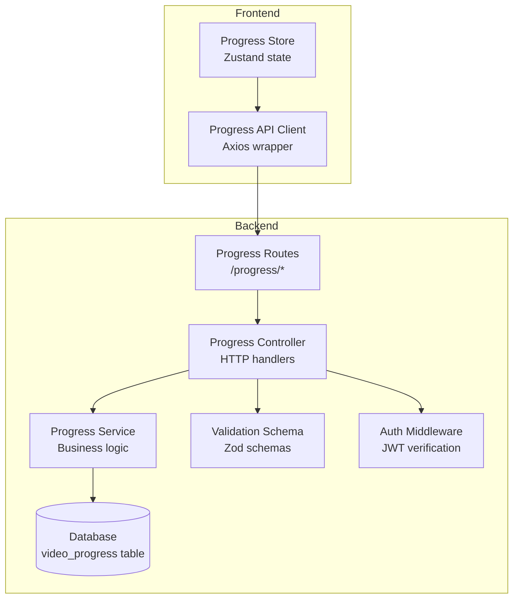
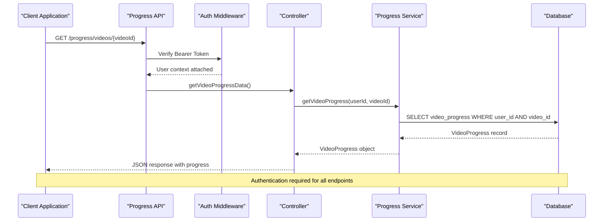
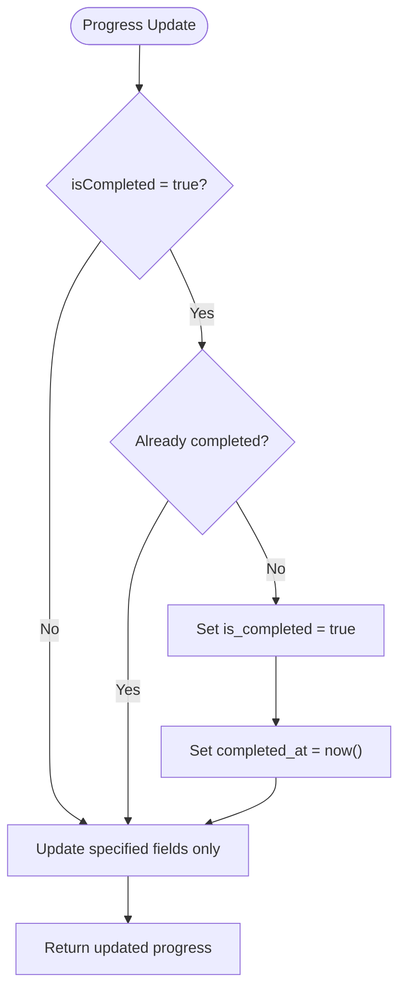
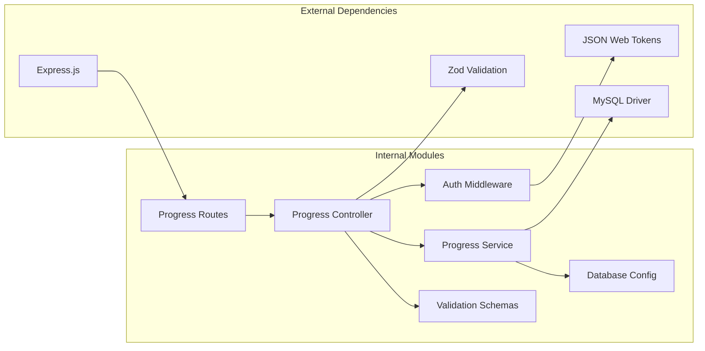

# Progress Tracking API

<cite>
**Referenced Files in This Document**
- [routes.ts](file://backend/src/routes/index.ts)
- [progress/routes.ts](file://backend/src/modules/progress/routes.ts)
- [progress/controller.ts](file://backend/src/modules/progress/controller.ts)
- [progress/service.ts](file://backend/src/modules/progress/service.ts)
- [validation.ts](file://backend/src/utils/validation.ts)
- [auth.ts](file://backend/src/middleware/auth.ts)
- [jwt.ts](file://backend/src/utils/jwt.ts)
- [006_create_video_progress.sql](file://backend/migrations/006_create_video_progress.sql)
- [progressStore.ts](file://frontend/app/store/progressStore.ts)
- [api.ts](file://frontend/app/lib/api.ts)
</cite>

## Table of Contents
1. [Introduction](#introduction)
2. [Project Structure](#project-structure)
3. [Core Components](#core-components)
4. [Architecture Overview](#architecture-overview)
5. [Detailed Component Analysis](#detailed-component-analysis)
6. [Dependency Analysis](#dependency-analysis)
7. [Performance Considerations](#performance-considerations)
8. [Troubleshooting Guide](#troubleshooting-guide)
9. [Conclusion](#conclusion)

## Introduction
This document provides comprehensive API documentation for the Progress Tracking module. It covers all progress-related endpoints, data schemas, calculation algorithms, and integration patterns. The module enables users to track video progress, mark completion, and retrieve subject-level analytics while maintaining strict authentication and data privacy standards.

## Project Structure
The Progress Tracking module follows a clean architecture pattern with clear separation of concerns:



**Diagram sources**
- [routes.ts:1-25](file://backend/src/routes/index.ts#L1-L25)
- [progress/routes.ts:1-18](file://backend/src/modules/progress/routes.ts#L1-L18)
- [progress/controller.ts:1-66](file://backend/src/modules/progress/controller.ts#L1-L66)
- [progress/service.ts:1-163](file://backend/src/modules/progress/service.ts#L1-L163)

**Section sources**
- [routes.ts:1-25](file://backend/src/routes/index.ts#L1-L25)
- [progress/routes.ts:1-18](file://backend/src/modules/progress/routes.ts#L1-L18)

## Core Components

### Authentication and Authorization
The Progress Tracking API requires bearer token authentication for all endpoints. The authentication middleware validates JWT tokens and attaches user context to requests.

Key authentication features:
- Bearer token format: `Authorization: Bearer <token>`
- Token verification using HS256 algorithm
- User context injection for authorization checks
- Automatic token expiration handling

**Section sources**
- [auth.ts:8-24](file://backend/src/middleware/auth.ts#L8-L24)
- [jwt.ts:43-45](file://backend/src/utils/jwt.ts#L43-L45)

### Data Models and Schemas

#### Video Progress Model
Represents individual video completion and playback state:

| Field | Type | Description | Constraints |
|-------|------|-------------|-------------|
| id | String | Unique identifier | UUID format |
| user_id | String | User identifier | Foreign key to users |
| video_id | String | Video identifier | Foreign key to videos |
| last_position_seconds | Number | Last watched position | Integer, >= 0 |
| is_completed | Boolean | Completion status | Default: false |
| completed_at | DateTime | Completion timestamp | Nullable |
| created_at | DateTime | Record creation time | Auto-generated |
| updated_at | DateTime | Last update time | Auto-updated |

#### Subject Progress Model
Aggregated statistics for course/subject completion:

| Field | Type | Description | Calculation Method |
|-------|------|-------------|-------------------|
| subjectId | String | Course/subject identifier | Input parameter |
| totalVideos | Number | Total videos in subject | COUNT(videos) |
| completedVideos | Number | Completed videos | COUNT(is_completed = true) |
| progressPercentage | Number | Completion percentage | ROUND(completed/total * 100) |
| totalTimeSpent | Number | Total seconds watched | SUM(last_position_seconds) |

**Section sources**
- [006_create_video_progress.sql:1-16](file://backend/migrations/006_create_video_progress.sql#L1-L16)
- [progress/service.ts:3-18](file://backend/src/modules/progress/service.ts#L3-L18)

## Architecture Overview



**Diagram sources**
- [progress/routes.ts:12-15](file://backend/src/modules/progress/routes.ts#L12-L15)
- [progress/controller.ts:12-22](file://backend/src/modules/progress/controller.ts#L12-L22)
- [progress/service.ts:20-28](file://backend/src/modules/progress/service.ts#L20-L28)

## Detailed Component Analysis

### Endpoint Definitions

#### GET /progress/videos/:videoId
Retrieves a user's progress for a specific video.

**Request:**
- Path Parameters: `videoId` (String, required)
- Headers: `Authorization: Bearer <token>`
- Query Parameters: None

**Response:**
- Status: 200 OK
- Body: `{ progress: VideoProgress }`

**Behavior:**
- Returns existing progress record if found
- Returns null values for non-existent records
- Requires authenticated user context

#### POST /progress/videos/:videoId
Updates video progress (mark completion, update position).

**Request:**
- Path Parameters: `videoId` (String, required)
- Headers: `Authorization: Bearer <token>`
- Body: Progress update object with optional fields

**Request Body Schema:**
```typescript
{
  lastPositionSeconds?: number; // Integer, >= 0
  isCompleted?: boolean;       // Boolean flag
}
```

**Response:**
- Status: 200 OK
- Body: `{ progress: VideoProgress }`

**Behavior:**
- Creates new record if not exists
- Updates existing record with provided fields
- Automatically sets completion timestamp when marked complete
- Validates input against Zod schema

#### GET /progress/subjects/:subjectId
Retrieves subject-level progress analytics.

**Request:**
- Path Parameters: `subjectId` (String, required)
- Headers: `Authorization: Bearer <token>`

**Response:**
- Status: 200 OK
- Body: `{ progress: SubjectProgress, lastWatched: LastWatchedVideo }`

**Behavior:**
- Calculates completion statistics across all videos in subject
- Returns aggregated progress metrics
- Includes last watched video information

#### GET /progress/all
Retrieves progress for all enrolled subjects.

**Request:**
- Headers: `Authorization: Bearer <token>`

**Response:**
- Status: 200 OK
- Body: `{ progress: SubjectProgress[] }`

**Behavior:**
- Aggregates progress across all user's enrolled subjects
- Returns array of subject progress objects

**Section sources**
- [progress/routes.ts:12-15](file://backend/src/modules/progress/routes.ts#L12-L15)
- [progress/controller.ts:12-65](file://backend/src/modules/progress/controller.ts#L12-L65)
- [validation.ts:14-17](file://backend/src/utils/validation.ts#L14-L17)

### Progress Calculation Algorithms

#### Completion Threshold Logic
The system implements a threshold-based completion model:



**Diagram sources**
- [progress/service.ts:30-85](file://backend/src/modules/progress/service.ts#L30-L85)

#### Subject Progress Calculation
Subject-level analytics computed through SQL aggregation:

1. **Total Videos**: Count all videos in subject via section join
2. **Completed Videos**: Count videos where `is_completed = true`
3. **Progress Percentage**: `(completedVideos / totalVideos) * 100`, rounded to nearest integer
4. **Total Time Spent**: Sum of `last_position_seconds` across all videos

**Section sources**
- [progress/service.ts:87-130](file://backend/src/modules/progress/service.ts#L87-L130)

### Data Privacy and Security Considerations

#### Authentication Requirements
- All endpoints require valid bearer token authentication
- Token verification performed before any data access
- User context ensures data isolation between users

#### Data Access Patterns
- Users can only access their own progress records
- Subject analytics are filtered by enrollment relationships
- No cross-user data leakage possible

#### Token Management
- JWT tokens with configurable expiration
- Refresh token storage with SHA-256 hashing
- Token revocation support for security events

**Section sources**
- [auth.ts:8-24](file://backend/src/middleware/auth.ts#L8-L24)
- [jwt.ts:20-41](file://backend/src/utils/jwt.ts#L20-L41)

## Dependency Analysis



**Diagram sources**
- [progress/routes.ts:1-18](file://backend/src/modules/progress/routes.ts#L1-L18)
- [progress/controller.ts:1-10](file://backend/src/modules/progress/controller.ts#L1-L10)
- [progress/service.ts:1](file://backend/src/modules/progress/service.ts#L1)

**Section sources**
- [progress/service.ts:1](file://backend/src/modules/progress/service.ts#L1)
- [auth.ts:1-42](file://backend/src/middleware/auth.ts#L1-L42)

## Performance Considerations

### Database Optimization
- Composite unique index on `(user_id, video_id)` prevents duplicates
- Separate indexes on `user_id` and `video_id` for efficient lookups
- Efficient aggregation queries using JOINs and COUNT/SUM operations

### Caching Strategy
- Frontend caching through Zustand store reduces API calls
- Progressive enhancement allows offline progress tracking
- Batch operations for multiple video updates

### Scalability Factors
- Horizontal scaling supported through stateless design
- Database connection pooling for concurrent requests
- Index optimization for frequent query patterns

## Troubleshooting Guide

### Common Authentication Issues
**Problem**: 401 Unauthorized responses
**Causes**: Missing or invalid bearer token
**Solutions**: 
- Verify token format: `Bearer <token>`
- Check token expiration
- Ensure proper header formatting

### Progress Update Failures
**Problem**: Progress updates not persisting
**Causes**: Validation errors or database constraints
**Solutions**:
- Validate input against schema requirements
- Check for unique constraint violations
- Verify video exists and belongs to enrolled subject

### Performance Issues
**Problem**: Slow progress calculations
**Solutions**:
- Monitor database query execution plans
- Consider adding additional indexes if needed
- Optimize frontend caching strategy

**Section sources**
- [auth.ts:12-23](file://backend/src/middleware/auth.ts#L12-L23)
- [validation.ts:14-17](file://backend/src/utils/validation.ts#L14-L17)

## Conclusion
The Progress Tracking API provides a robust foundation for educational platform progress monitoring. Its clean architecture, strong authentication, and comprehensive analytics capabilities enable effective learning analytics while maintaining data privacy and performance standards. The modular design supports future enhancements such as advanced completion thresholds, milestone tracking, and integration with gamification systems.