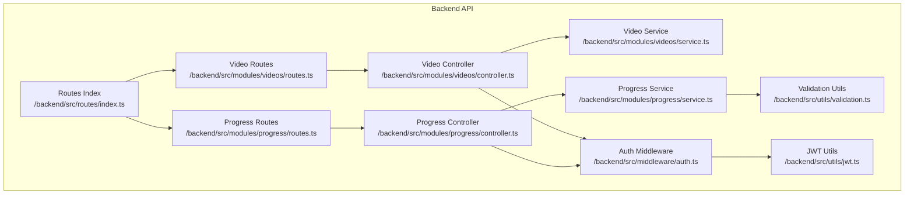
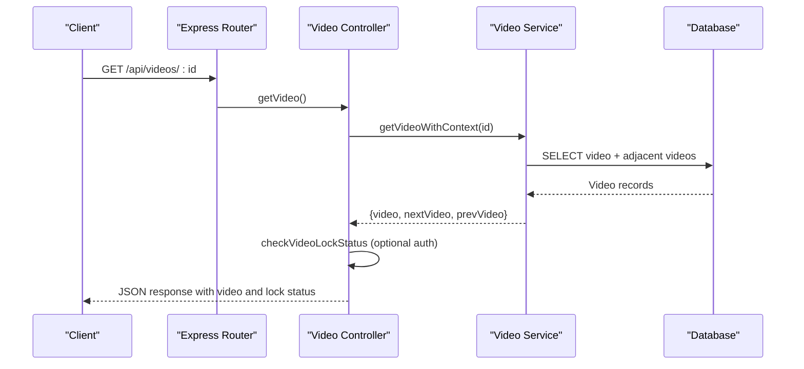
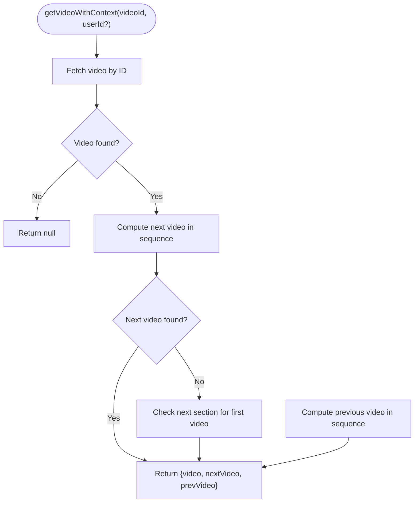
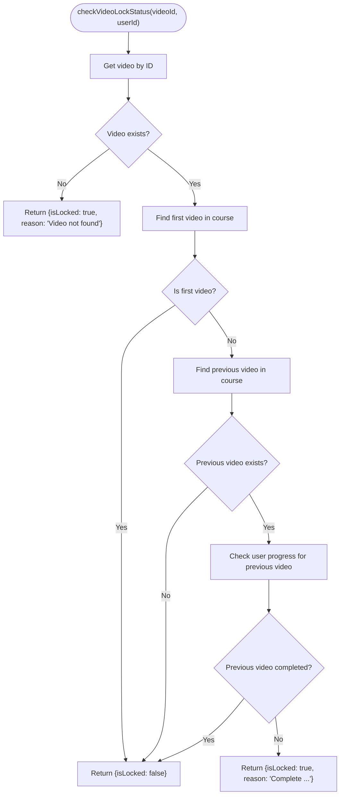
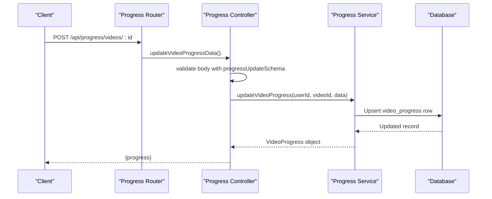
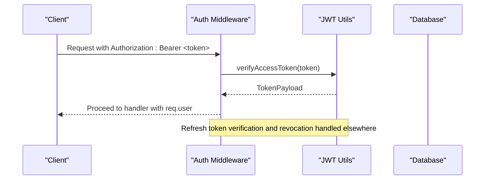
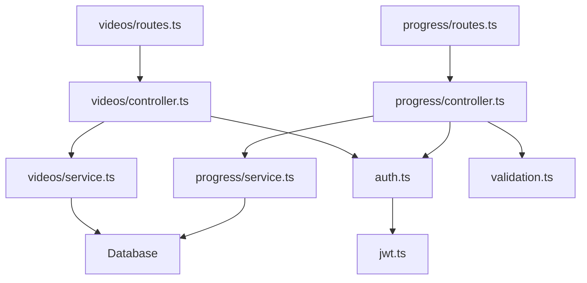

# Video Content API

<cite>
**Referenced Files in This Document**
- [routes/index.ts](file://backend/src/routes/index.ts)
- [videos/routes.ts](file://backend/src/modules/videos/routes.ts)
- [videos/controller.ts](file://backend/src/modules/videos/controller.ts)
- [videos/service.ts](file://backend/src/modules/videos/service.ts)
- [progress/routes.ts](file://backend/src/modules/progress/routes.ts)
- [progress/controller.ts](file://backend/src/modules/progress/controller.ts)
- [progress/service.ts](file://backend/src/modules/progress/service.ts)
- [auth.ts](file://backend/src/middleware/auth.ts)
- [jwt.ts](file://backend/src/utils/jwt.ts)
- [validation.ts](file://backend/src/utils/validation.ts)
- [004_create_videos.sql](file://backend/migrations/004_create_videos.sql)
- [006_create_video_progress.sql](file://backend/migrations/006_create_video_progress.sql)
</cite>

## Table of Contents
1. [Introduction](#introduction)
2. [Project Structure](#project-structure)
3. [Core Components](#core-components)
4. [Architecture Overview](#architecture-overview)
5. [Detailed Component Analysis](#detailed-component-analysis)
6. [Dependency Analysis](#dependency-analysis)
7. [Performance Considerations](#performance-considerations)
8. [Troubleshooting Guide](#troubleshooting-guide)
9. [Conclusion](#conclusion)

## Introduction
This document provides comprehensive API documentation for the Video Content module. It covers the available endpoints for retrieving video details, checking lock status, and integrating with progress tracking. The system supports YouTube-based video playback via embedded URLs and enforces course sequencing locks based on completion of prerequisite videos. Authentication is mandatory for progress updates and lock checks, while video retrieval is optionally protected.

## Project Structure
The Video Content module is organized under the backend/src/modules/videos directory with supporting components in routing, controllers, services, middleware, and database migrations. Progress tracking is handled separately in the progress module and integrates with the video module through shared entities.

**Diagram sources**
- [routes/index.ts:1-25](file://backend/src/routes/index.ts#L1-L25)
- [videos/routes.ts:1-11](file://backend/src/modules/videos/routes.ts#L1-L11)
- [progress/routes.ts:1-17](file://backend/src/modules/progress/routes.ts#L1-L17)
- [videos/controller.ts:1-42](file://backend/src/modules/videos/controller.ts#L1-L42)
- [progress/controller.ts:1-66](file://backend/src/modules/progress/controller.ts#L1-L66)
- [videos/service.ts:1-160](file://backend/src/modules/videos/service.ts#L1-L160)
- [progress/service.ts:1-163](file://backend/src/modules/progress/service.ts#L1-L163)
- [auth.ts:1-42](file://backend/src/middleware/auth.ts#L1-L42)
- [validation.ts:1-31](file://backend/src/utils/validation.ts#L1-L31)
- [jwt.ts:1-78](file://backend/src/utils/jwt.ts#L1-L78)

**Section sources**
- [routes/index.ts:1-25](file://backend/src/routes/index.ts#L1-L25)
- [videos/routes.ts:1-11](file://backend/src/modules/videos/routes.ts#L1-L11)
- [progress/routes.ts:1-17](file://backend/src/modules/progress/routes.ts#L1-L17)

## Core Components
- Video Retrieval Endpoint
  - Method: GET
  - Path: /api/videos/:id
  - Authentication: Optional
  - Description: Returns video details along with adjacent videos (previous and next) and lock status. If the user is authenticated, lock status reflects course sequencing rules; otherwise, videos may be considered locked.
  - Response Fields:
    - video: Video object with metadata
    - nextVideo: Adjacent next video or null
    - prevVideo: Adjacent previous video or null
    - lockStatus: Object indicating isLocked and optional reason

- Lock Status Endpoint
  - Method: GET
  - Path: /api/videos/:id/lock-status
  - Authentication: Required
  - Description: Checks whether a video is locked based on course progression rules. Requires a valid access token.
  - Response Fields:
    - isLocked: Boolean indicating lock state
    - reason: String explaining the lock reason if applicable

- Progress Tracking Endpoints (Integration)
  - Get Video Progress
    - Method: GET
    - Path: /api/progress/videos/:id
    - Authentication: Required
    - Description: Retrieves current progress for a specific video.
    - Response Fields:
      - progress: VideoProgress object containing last position and completion status

  - Update Video Progress
    - Method: POST
    - Path: /api/progress/videos/:id
    - Authentication: Required
    - Body Schema:
      - lastPositionSeconds: Number (optional)
      - isCompleted: Boolean (optional)
    - Description: Updates progress for a video. Accepts partial updates; marks completion and sets completion timestamp when transitioning to completed.

  - Subject Progress
    - Method: GET
    - Path: /api/progress/subjects/:id
    - Authentication: Required
    - Description: Returns aggregated progress for a subject including total videos, completed videos, percentage, and total time spent.

- Unsupported Endpoints in Current Implementation
  - GET /api/videos (video listings)
  - POST /api/videos (video uploads)
  - PUT /api/videos/:id (video updates)
  - DELETE /api/videos/:id (video removal)
  - These endpoints are not present in the current codebase.

**Section sources**
- [videos/controller.ts:6-29](file://backend/src/modules/videos/controller.ts#L6-L29)
- [videos/controller.ts:31-41](file://backend/src/modules/videos/controller.ts#L31-L41)
- [videos/routes.ts:7-8](file://backend/src/modules/videos/routes.ts#L7-L8)
- [progress/controller.ts:12-39](file://backend/src/modules/progress/controller.ts#L12-L39)
- [progress/controller.ts:41-55](file://backend/src/modules/progress/controller.ts#L41-L55)
- [progress/routes.ts:12-15](file://backend/src/modules/progress/routes.ts#L12-L15)
- [validation.ts:14-17](file://backend/src/utils/validation.ts#L14-L17)

## Architecture Overview
The Video Content API leverages Express routers and controllers, with services encapsulating database queries. Authentication middleware enforces bearer token validation, and JWT utilities manage tokens and refresh token storage. Progress tracking is integrated via separate routes and services.

**Diagram sources**
- [videos/routes.ts:7](file://backend/src/modules/videos/routes.ts#L7)
- [videos/controller.ts:6-29](file://backend/src/modules/videos/controller.ts#L6-L29)
- [videos/service.ts:24-95](file://backend/src/modules/videos/service.ts#L24-L95)

**Section sources**
- [routes/index.ts:19](file://backend/src/routes/index.ts#L19)
- [videos/routes.ts:1-11](file://backend/src/modules/videos/routes.ts#L1-L11)
- [videos/controller.ts:1-42](file://backend/src/modules/videos/controller.ts#L1-L42)
- [videos/service.ts:1-160](file://backend/src/modules/videos/service.ts#L1-L160)

## Detailed Component Analysis

### Video Service Layer
The service layer handles video retrieval with context (adjacent videos) and lock status evaluation. It computes next/previous videos across sections and validates prerequisites based on user progress.

**Diagram sources**
- [videos/service.ts:24-95](file://backend/src/modules/videos/service.ts#L24-L95)

**Section sources**
- [videos/service.ts:20-95](file://backend/src/modules/videos/service.ts#L20-L95)

### Lock Status Evaluation
Lock status is determined by:
- First video in the course is always unlocked.
- For subsequent videos, the immediately preceding video must be marked as completed by the user.
- If the previous video is missing or not completed, the current video remains locked with a reason.

**Diagram sources**
- [videos/service.ts:97-159](file://backend/src/modules/videos/service.ts#L97-L159)

**Section sources**
- [videos/service.ts:97-159](file://backend/src/modules/videos/service.ts#L97-L159)

### Progress Tracking Integration
Progress updates are validated against a schema and persisted to the video_progress table. The service supports partial updates and automatically manages completion timestamps.

**Diagram sources**
- [progress/routes.ts:13](file://backend/src/modules/progress/routes.ts#L13)
- [progress/controller.ts:24-39](file://backend/src/modules/progress/controller.ts#L24-L39)
- [progress/service.ts:30-85](file://backend/src/modules/progress/service.ts#L30-L85)
- [validation.ts:14-17](file://backend/src/utils/validation.ts#L14-L17)

**Section sources**
- [progress/controller.ts:24-39](file://backend/src/modules/progress/controller.ts#L24-L39)
- [progress/service.ts:30-85](file://backend/src/modules/progress/service.ts#L30-L85)
- [validation.ts:14-17](file://backend/src/utils/validation.ts#L14-L17)

### Authentication and Security
- Access tokens are required for progress endpoints and lock status checks.
- The optionalAuth middleware allows video retrieval without authentication but still enables lock evaluation when a token is present.
- JWT utilities manage token generation, verification, refresh token hashing, and revocation.

**Diagram sources**
- [auth.ts:8-24](file://backend/src/middleware/auth.ts#L8-L24)
- [jwt.ts:43-62](file://backend/src/utils/jwt.ts#L43-L62)

**Section sources**
- [auth.ts:1-42](file://backend/src/middleware/auth.ts#L1-L42)
- [jwt.ts:1-78](file://backend/src/utils/jwt.ts#L1-L78)

## Dependency Analysis
The following diagram shows key dependencies among modules and their roles in the Video Content API.

**Diagram sources**
- [videos/routes.ts:1-11](file://backend/src/modules/videos/routes.ts#L1-L11)
- [videos/controller.ts:1-42](file://backend/src/modules/videos/controller.ts#L1-L42)
- [videos/service.ts:1-160](file://backend/src/modules/videos/service.ts#L1-L160)
- [progress/routes.ts:1-17](file://backend/src/modules/progress/routes.ts#L1-L17)
- [progress/controller.ts:1-66](file://backend/src/modules/progress/controller.ts#L1-L66)
- [progress/service.ts:1-163](file://backend/src/modules/progress/service.ts#L1-L163)
- [auth.ts:1-42](file://backend/src/middleware/auth.ts#L1-L42)
- [jwt.ts:1-78](file://backend/src/utils/jwt.ts#L1-L78)
- [validation.ts:1-31](file://backend/src/utils/validation.ts#L1-L31)

**Section sources**
- [routes/index.ts:1-25](file://backend/src/routes/index.ts#L1-L25)

## Performance Considerations
- Database Indexes: Videos table includes an index on (section_id, order_index) to optimize adjacency queries. Progress table includes indexes on user_id and video_id for efficient lookups.
- Query Efficiency: Adjacency and lock status queries are scoped to minimal joins and single-row fetches where possible.
- Caching: Consider caching frequently accessed video metadata and lock status per user session to reduce database load.
- Pagination: Listing endpoints are not implemented; if introduced, apply cursor-based pagination to avoid deep offset scans.

**Section sources**
- [004_create_videos.sql:13](file://backend/migrations/004_create_videos.sql#L13)
- [006_create_video_progress.sql:12-14](file://backend/migrations/006_create_video_progress.sql#L12-L14)

## Troubleshooting Guide
- Authentication Errors
  - Missing or invalid Authorization header: Returns 401 with an appropriate error message.
  - Expired or malformed tokens: Returns 401 during token verification.
- Video Not Found
  - Requesting a non-existent video ID returns a 404 response.
- Lock Status Issues
  - If the previous video is not completed, the lock reason indicates the prerequisite title.
  - Ensure the user has completed the previous video to unlock the current one.
- Progress Update Validation
  - Body must match the progressUpdateSchema; otherwise, validation errors occur.
  - Partial updates are supported; only provided fields are applied.

**Section sources**
- [auth.ts:8-24](file://backend/src/middleware/auth.ts#L8-L24)
- [videos/controller.ts:10-13](file://backend/src/modules/videos/controller.ts#L10-L13)
- [videos/service.ts:151-156](file://backend/src/modules/videos/service.ts#L151-L156)
- [progress/controller.ts:31](file://backend/src/modules/progress/controller.ts#L31)
- [validation.ts:14-17](file://backend/src/utils/validation.ts#L14-L17)

## Conclusion
The Video Content API currently supports retrieving video details with contextual navigation and lock status evaluation, alongside robust progress tracking and authentication. While advanced content management endpoints (listing, uploading, updating, deleting) are not present, the modular architecture readily accommodates future enhancements. Security is enforced through bearer tokens and JWT utilities, and database indexing supports efficient video and progress queries.