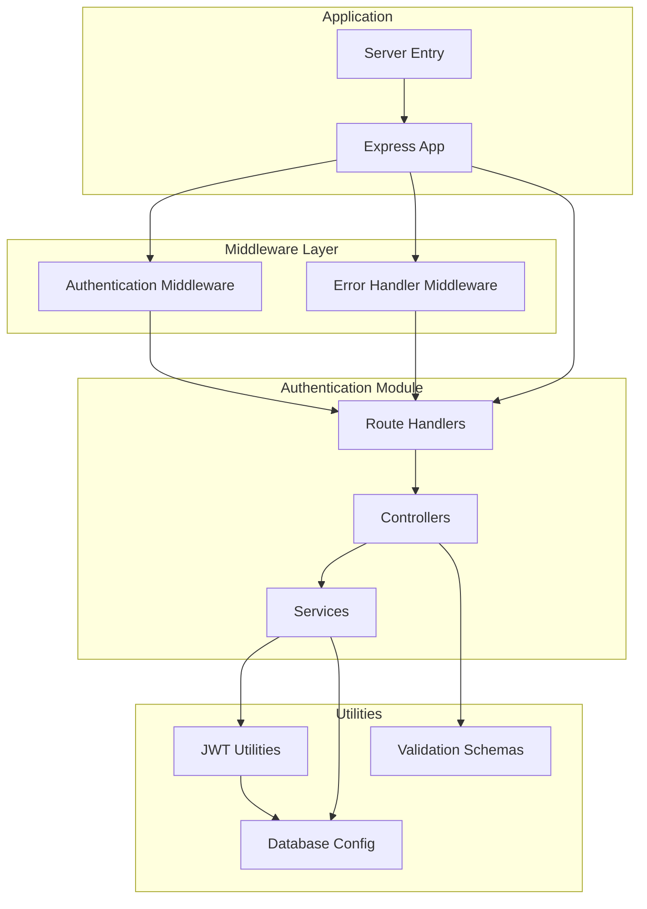
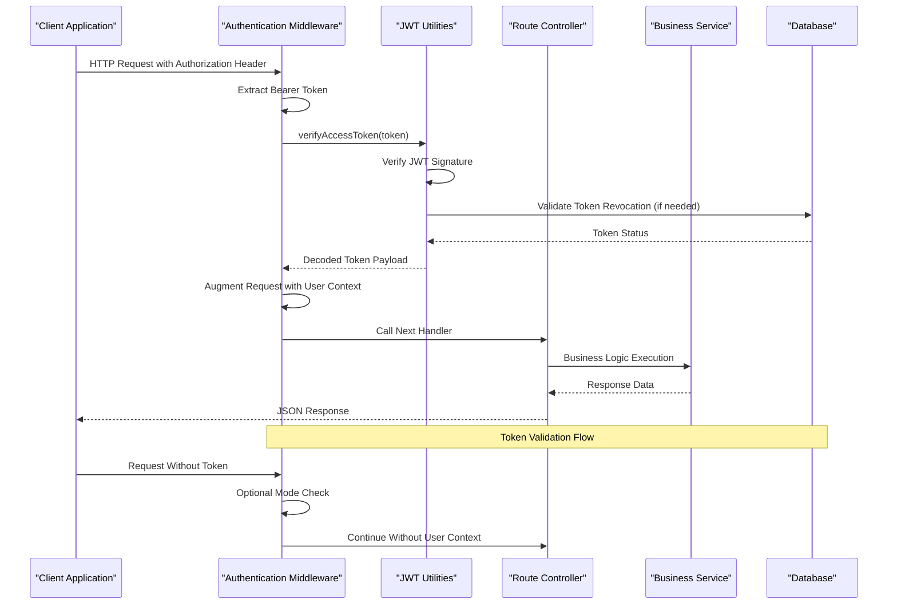
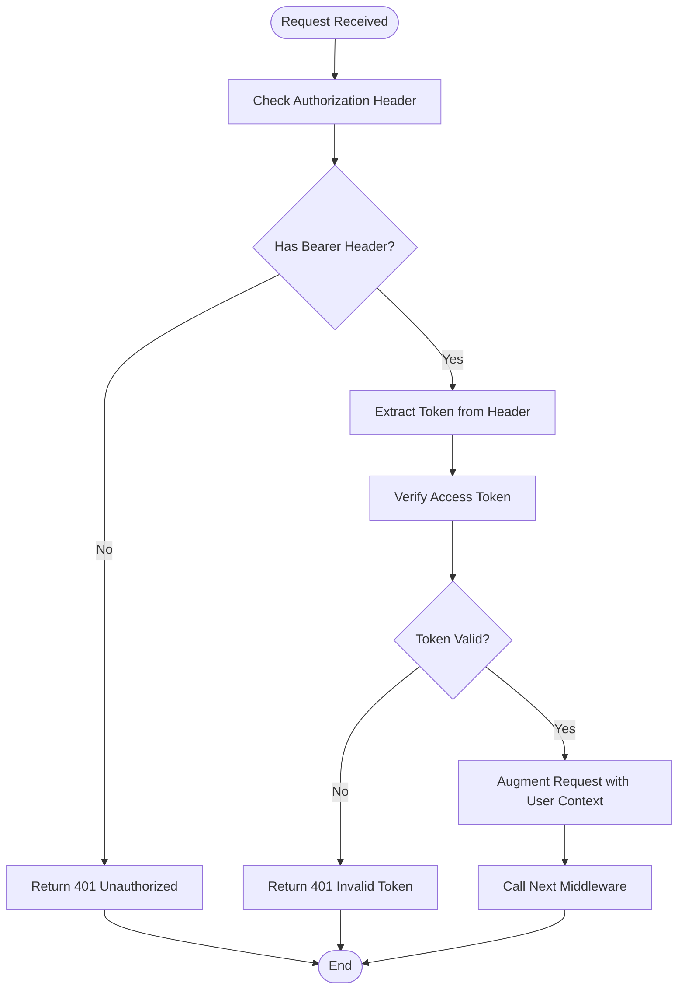
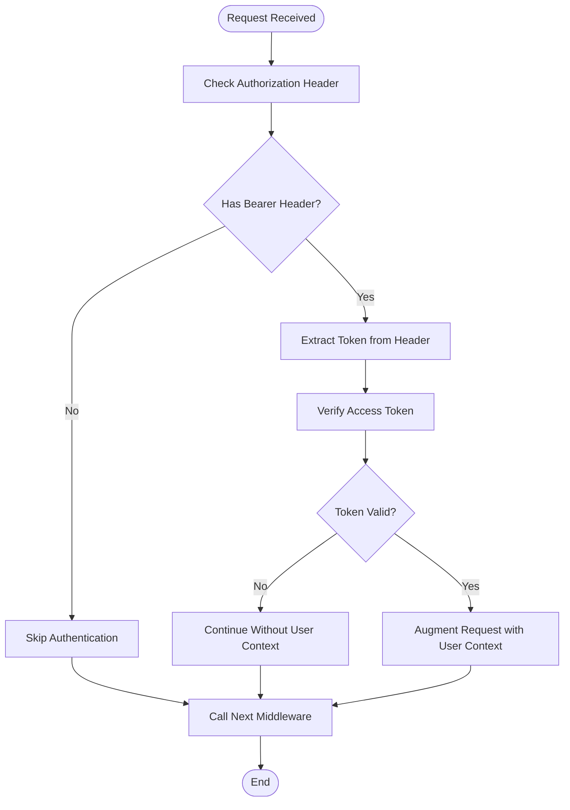
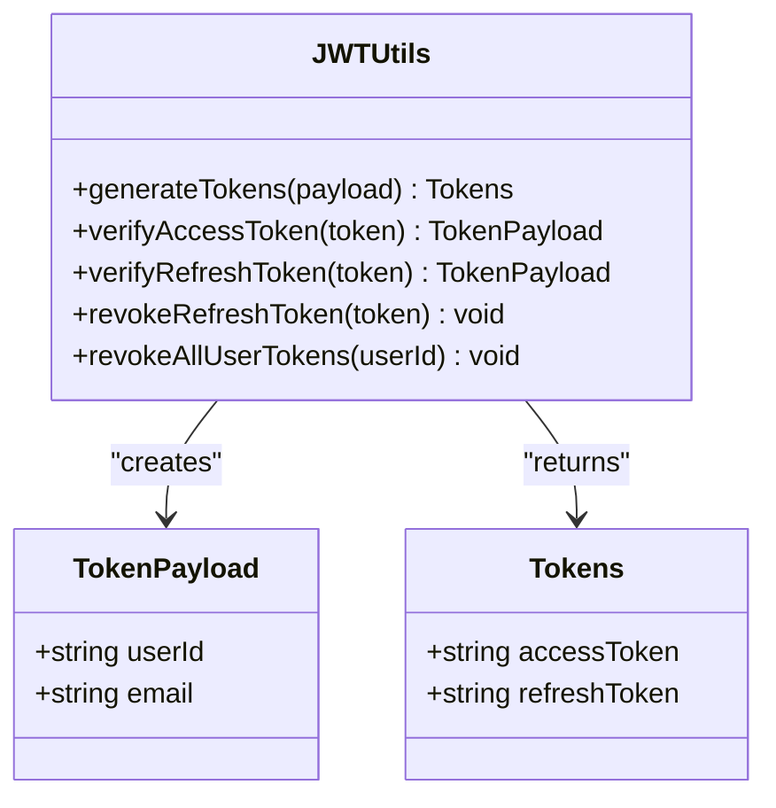
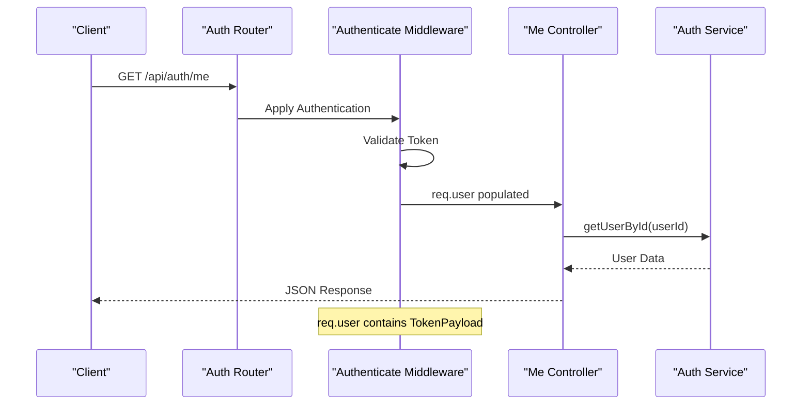
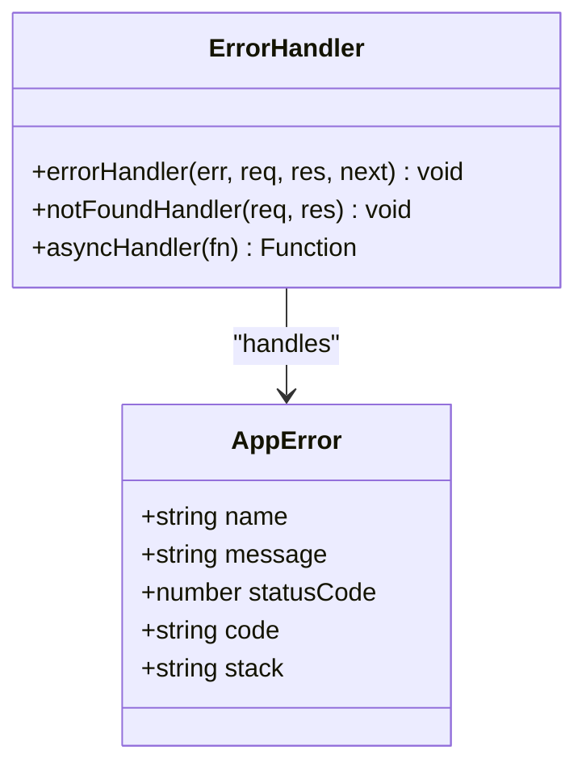
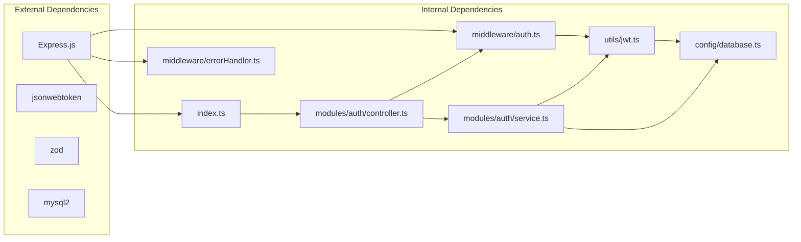
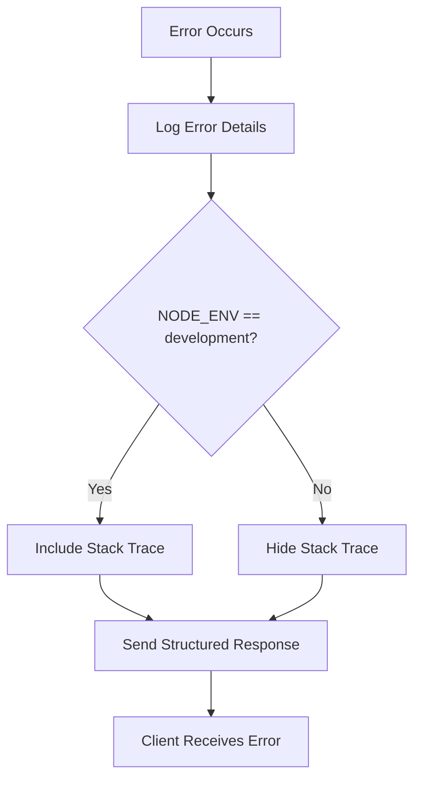

# Authentication Middleware

<cite>
**Referenced Files in This Document**
- [auth.ts](file://backend/src/middleware/auth.ts)
- [jwt.ts](file://backend/src/utils/jwt.ts)
- [errorHandler.ts](file://backend/src/middleware/errorHandler.ts)
- [controller.ts](file://backend/src/modules/auth/controller.ts)
- [service.ts](file://backend/src/modules/auth/service.ts)
- [routes.ts](file://backend/src/modules/auth/routes.ts)
- [app.ts](file://backend/src/app.ts)
- [server.ts](file://backend/src/server.ts)
- [index.ts](file://backend/src/routes/index.ts)
- [validation.ts](file://backend/src/utils/validation.ts)
- [database.ts](file://backend/src/config/database.ts)
- [007_create_refresh_tokens.sql](file://backend/migrations/007_create_refresh_tokens.sql)
</cite>

## Table of Contents
1. [Introduction](#introduction)
2. [Project Structure](#project-structure)
3. [Core Components](#core-components)
4. [Architecture Overview](#architecture-overview)
5. [Detailed Component Analysis](#detailed-component-analysis)
6. [Dependency Analysis](#dependency-analysis)
7. [Performance Considerations](#performance-considerations)
8. [Troubleshooting Guide](#troubleshooting-guide)
9. [Conclusion](#conclusion)

## Introduction
This document provides comprehensive documentation for the authentication middleware system in the learning management platform. The system implements JWT-based authentication with both mandatory and optional authentication modes, protected route enforcement, session management through refresh tokens, and robust error handling integration. The middleware chain validates access tokens from Authorization headers, augments requests with user context, and enforces access control across protected routes.

## Project Structure
The authentication system follows a modular architecture with clear separation of concerns:

**Diagram sources**
- [auth.ts:1-42](file://backend/src/middleware/auth.ts#L1-L42)
- [controller.ts:1-99](file://backend/src/modules/auth/controller.ts#L1-L99)
- [service.ts:1-108](file://backend/src/modules/auth/service.ts#L1-L108)
- [jwt.ts:1-78](file://backend/src/utils/jwt.ts#L1-L78)
- [app.ts:1-54](file://backend/src/app.ts#L1-L54)

**Section sources**
- [auth.ts:1-42](file://backend/src/middleware/auth.ts#L1-L42)
- [controller.ts:1-99](file://backend/src/modules/auth/controller.ts#L1-L99)
- [service.ts:1-108](file://backend/src/modules/auth/service.ts#L1-L108)
- [jwt.ts:1-78](file://backend/src/utils/jwt.ts#L1-L78)
- [app.ts:1-54](file://backend/src/app.ts#L1-L54)

## Core Components
The authentication system consists of several interconnected components that work together to provide secure access control:

### Authentication Middleware
The middleware provides two primary functions:
- **Mandatory Authentication**: Rejects requests without valid tokens
- **Optional Authentication**: Allows requests with or without tokens

### JWT Utilities
Handles token generation, verification, and refresh token management with database persistence.

### Route Controllers
Implement authentication-aware endpoints for registration, login, logout, token refresh, and user profile access.

### Error Handling Integration
Provides centralized error handling with structured response formatting and development-friendly debugging information.

**Section sources**
- [auth.ts:8-24](file://backend/src/middleware/auth.ts#L8-L24)
- [auth.ts:26-41](file://backend/src/middleware/auth.ts#L26-L41)
- [jwt.ts:20-41](file://backend/src/utils/jwt.ts#L20-L41)
- [jwt.ts:43-62](file://backend/src/utils/jwt.ts#L43-L62)

## Architecture Overview
The authentication architecture implements a layered middleware pattern with clear separation between token validation, request augmentation, and route protection:

**Diagram sources**
- [auth.ts:8-24](file://backend/src/middleware/auth.ts#L8-L24)
- [jwt.ts:43-45](file://backend/src/utils/jwt.ts#L43-L45)
- [controller.ts:72-86](file://backend/src/modules/auth/controller.ts#L72-L86)

The middleware chain operates as follows:
1. **Token Extraction**: Validates Authorization header format and extracts Bearer token
2. **Token Verification**: Uses JWT utilities to verify token signature and claims
3. **Request Augmentation**: Adds user context to the request object for downstream handlers
4. **Route Protection**: Enforces access control based on authentication requirements

**Section sources**
- [auth.ts:10-23](file://backend/src/middleware/auth.ts#L10-L23)
- [jwt.ts:43-45](file://backend/src/utils/jwt.ts#L43-L45)

## Detailed Component Analysis

### Authentication Middleware Implementation
The middleware provides two distinct authentication modes with different behaviors:

#### Mandatory Authentication (`authenticate`)

**Diagram sources**
- [auth.ts:8-24](file://backend/src/middleware/auth.ts#L8-L24)

#### Optional Authentication (`optionalAuth`)

**Diagram sources**
- [auth.ts:26-41](file://backend/src/middleware/auth.ts#L26-L41)

**Section sources**
- [auth.ts:4-6](file://backend/src/middleware/auth.ts#L4-L6)
- [auth.ts:8-24](file://backend/src/middleware/auth.ts#L8-L24)
- [auth.ts:26-41](file://backend/src/middleware/auth.ts#L26-L41)

### JWT Validation and Token Management
The JWT utilities handle comprehensive token lifecycle management:

#### Token Generation

**Diagram sources**
- [jwt.ts:10-18](file://backend/src/utils/jwt.ts#L10-L18)
- [jwt.ts:20-41](file://backend/src/utils/jwt.ts#L20-L41)
- [jwt.ts:43-62](file://backend/src/utils/jwt.ts#L43-L62)

#### Refresh Token Database Schema
The refresh token system uses a dedicated database table with proper indexing and foreign key constraints:

| Column | Type | Description |
|--------|------|-------------|
| id | VARCHAR(36) | Unique identifier for the refresh token |
| user_id | VARCHAR(36) | Foreign key to users table |
| token_hash | VARCHAR(255) | SHA-256 hash of the refresh token |
| expires_at | TIMESTAMP | Expiration timestamp |
| revoked_at | TIMESTAMP | Revocation timestamp (NULL if active) |
| created_at | TIMESTAMP | Creation timestamp |

**Section sources**
- [jwt.ts:20-41](file://backend/src/utils/jwt.ts#L20-L41)
- [jwt.ts:47-77](file://backend/src/utils/jwt.ts#L47-L77)
- [007_create_refresh_tokens.sql:1-12](file://backend/migrations/007_create_refresh_tokens.sql#L1-L12)

### Route Protection and Access Control
Authentication middleware integrates seamlessly with route handlers:

#### Protected Route Example

**Diagram sources**
- [routes.ts:11](file://backend/src/modules/auth/routes.ts#L11)
- [controller.ts:72-86](file://backend/src/modules/auth/controller.ts#L72-L86)

**Section sources**
- [routes.ts:11](file://backend/src/modules/auth/routes.ts#L11)
- [controller.ts:72-86](file://backend/src/modules/auth/controller.ts#L72-L86)

### Error Handling Integration
The system provides comprehensive error handling through middleware:

#### Error Response Structure

**Diagram sources**
- [errorHandler.ts:3-6](file://backend/src/middleware/errorHandler.ts#L3-L6)
- [errorHandler.ts:8-24](file://backend/src/middleware/errorHandler.ts#L8-L24)

**Section sources**
- [errorHandler.ts:8-24](file://backend/src/middleware/errorHandler.ts#L8-L24)
- [errorHandler.ts:26-31](file://backend/src/middleware/errorHandler.ts#L26-L31)
- [errorHandler.ts:33-37](file://backend/src/middleware/errorHandler.ts#L33-L37)

## Dependency Analysis
The authentication system exhibits clean dependency relationships with minimal coupling:

**Diagram sources**
- [auth.ts:1](file://backend/src/middleware/auth.ts#L1)
- [jwt.ts:1](file://backend/src/utils/jwt.ts#L1)
- [errorHandler.ts:1](file://backend/src/middleware/errorHandler.ts#L1)
- [controller.ts:1](file://backend/src/modules/auth/controller.ts#L1)
- [service.ts:1](file://backend/src/modules/auth/service.ts#L1)
- [database.ts:1](file://backend/src/config/database.ts#L1)
- [index.ts:1](file://backend/src/routes/index.ts#L1)

**Section sources**
- [auth.ts:1](file://backend/src/middleware/auth.ts#L1)
- [jwt.ts:1](file://backend/src/utils/jwt.ts#L1)
- [errorHandler.ts:1](file://backend/src/middleware/errorHandler.ts#L1)
- [controller.ts:1](file://backend/src/modules/auth/controller.ts#L1)
- [service.ts:1](file://backend/src/modules/auth/service.ts#L1)
- [database.ts:1](file://backend/src/config/database.ts#L1)
- [index.ts:1](file://backend/src/routes/index.ts#L1)

## Performance Considerations
The authentication system incorporates several performance optimizations:

### Token Verification Efficiency
- **Minimal Database Calls**: Access tokens are stateless JWTs verified locally
- **Refresh Token Caching**: Database queries for refresh token validation are indexed
- **Connection Pooling**: Database connections are pooled for efficient resource utilization

### Middleware Chain Optimization
- **Early Exit**: Authentication middleware exits early on invalid tokens
- **Optional Authentication**: Reduces overhead for public endpoints
- **Rate Limiting**: Built-in rate limiting prevents abuse attacks

### Memory Management
- **Request Context**: User data is attached to request objects, avoiding global state
- **Async Operations**: All database operations use async/await for non-blocking execution

## Troubleshooting Guide

### Common Authentication Issues

#### 1. Token Format Errors
**Symptoms**: 401 Unauthorized responses with "Access token required" message
**Causes**: Missing Authorization header or incorrect Bearer format
**Solutions**:
- Ensure Authorization header uses "Bearer " prefix followed by token
- Verify token is not expired or malformed
- Check JWT_SECRET environment variable configuration

#### 2. Token Validation Failures
**Symptoms**: 401 Unauthorized responses with "Invalid or expired token" message
**Causes**: 
- Expired access tokens
- Tampered or forged tokens
- Incorrect JWT secret configuration
- Database connectivity issues for refresh token validation

**Solutions**:
- Implement token refresh mechanism using refresh tokens
- Verify JWT_SECRET matches server configuration
- Check database connectivity and refresh token table integrity
- Monitor token expiration timestamps

#### 3. Session Management Issues
**Symptoms**: Users unable to maintain sessions across browser restarts
**Causes**:
- Missing or expired refresh tokens
- Browser cookie policy restrictions
- Cross-origin request issues

**Solutions**:
- Ensure refresh tokens are stored as HTTP-only cookies
- Configure CORS properly for cross-origin requests
- Implement proper cookie security settings (secure, sameSite)
- Handle token rotation and revocation correctly

### Debugging Approaches

#### Development Environment Debugging
The error handler provides detailed debugging information in development mode:

**Diagram sources**
- [errorHandler.ts:14-23](file://backend/src/middleware/errorHandler.ts#L14-L23)

#### Production Environment Monitoring
- **Error Logging**: Centralized error logging with timestamps
- **Status Codes**: Consistent HTTP status code usage
- **Security Headers**: Helmet middleware provides security enhancements
- **CORS Configuration**: Proper cross-origin resource sharing setup

**Section sources**
- [errorHandler.ts:14-23](file://backend/src/middleware/errorHandler.ts#L14-L23)
- [app.ts:11-20](file://backend/src/app.ts#L11-L20)

### Security Considerations

#### Token Security Best Practices
- **HTTP-only Cookies**: Refresh tokens stored securely in HTTP-only cookies
- **Secure Transport**: HTTPS enforcement in production environments
- **SameSite Policies**: CSRF protection through SameSite cookie settings
- **Token Expiration**: Short-lived access tokens with refresh token rotation

#### Database Security
- **Prepared Statements**: All database queries use prepared statements
- **Indexing**: Proper indexing on token_hash and user_id columns
- **Foreign Key Constraints**: Referential integrity for user relationships
- **Connection Pooling**: Secure connection management

**Section sources**
- [controller.ts:22-28](file://backend/src/modules/auth/controller.ts#L22-L28)
- [jwt.ts:30-38](file://backend/src/utils/jwt.ts#L30-L38)
- [007_create_refresh_tokens.sql:1-12](file://backend/migrations/007_create_refresh_tokens.sql#L1-L12)

## Conclusion
The authentication middleware system provides a robust, secure, and scalable foundation for user authentication and access control. The implementation demonstrates best practices in JWT-based authentication, proper middleware composition, and comprehensive error handling. Key strengths include:

- **Clean Architecture**: Well-separated concerns with clear dependency boundaries
- **Security Focus**: Comprehensive token management with proper storage and validation
- **Developer Experience**: Clear error messages and debugging capabilities
- **Performance Optimization**: Efficient middleware chain with minimal overhead
- **Extensibility**: Modular design allowing easy addition of new authentication features

The system successfully balances security requirements with developer usability, providing a solid foundation for building authenticated applications while maintaining flexibility for future enhancements.