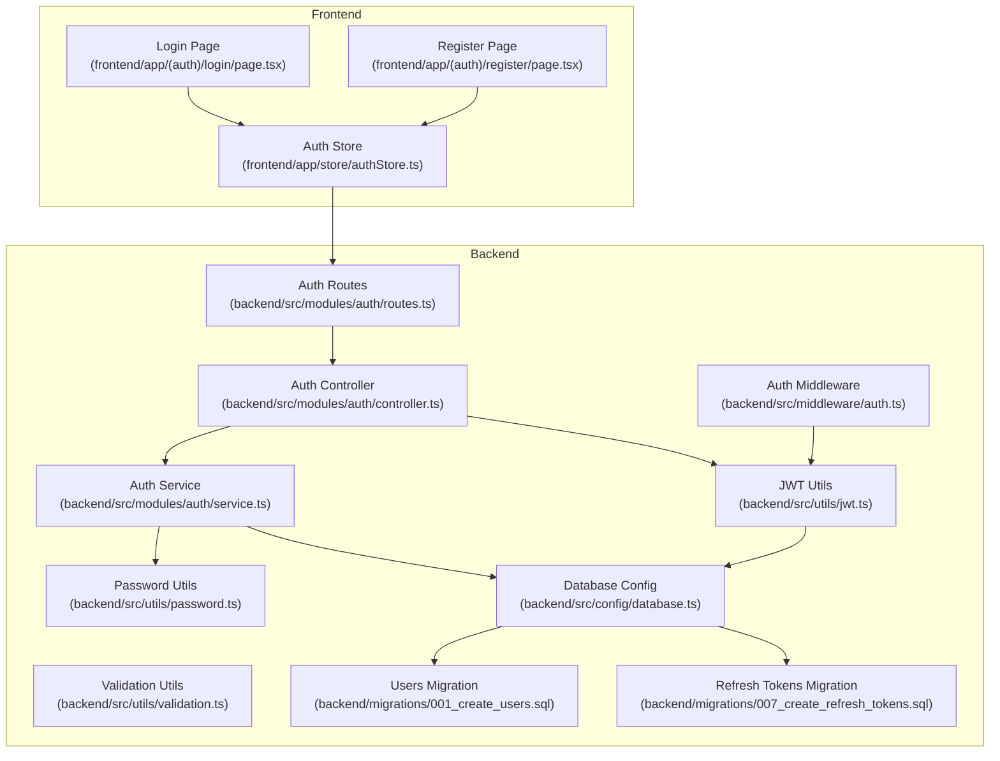
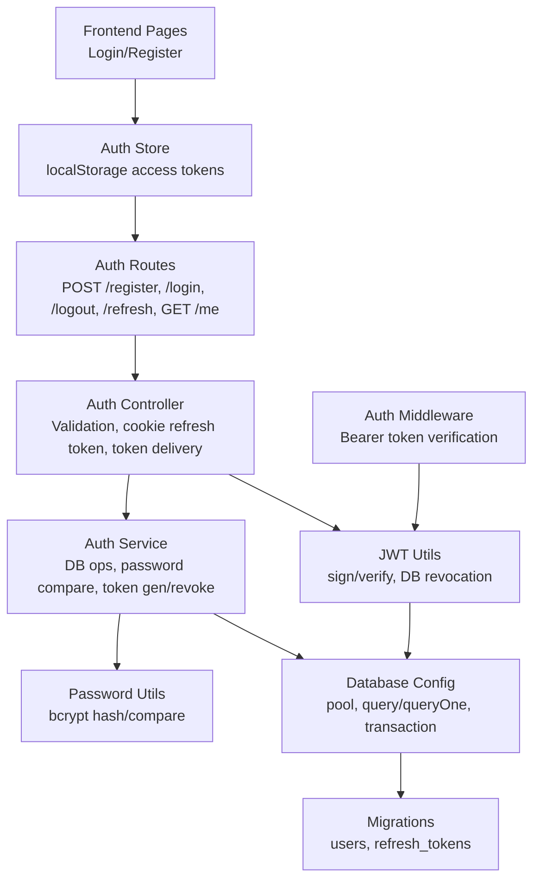
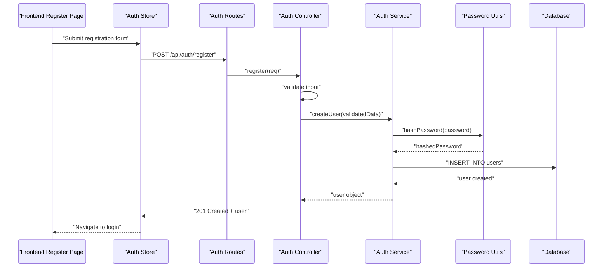
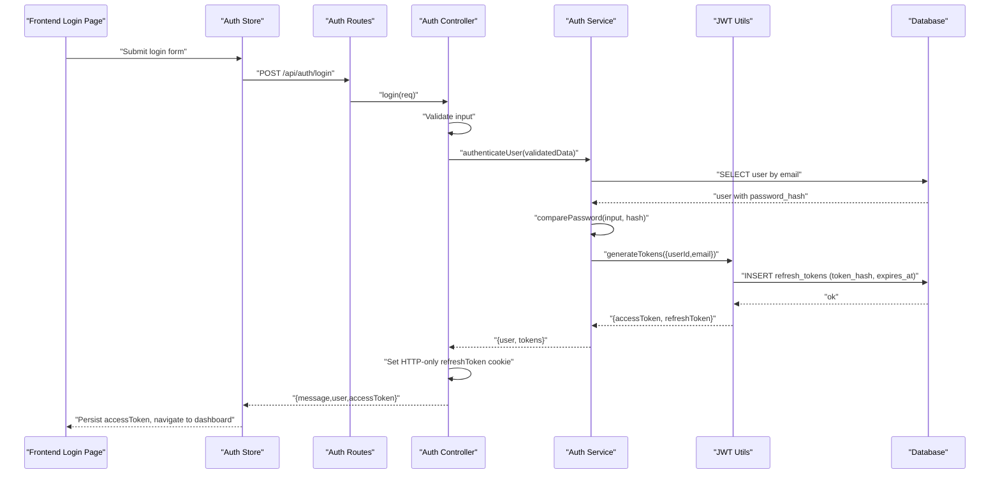
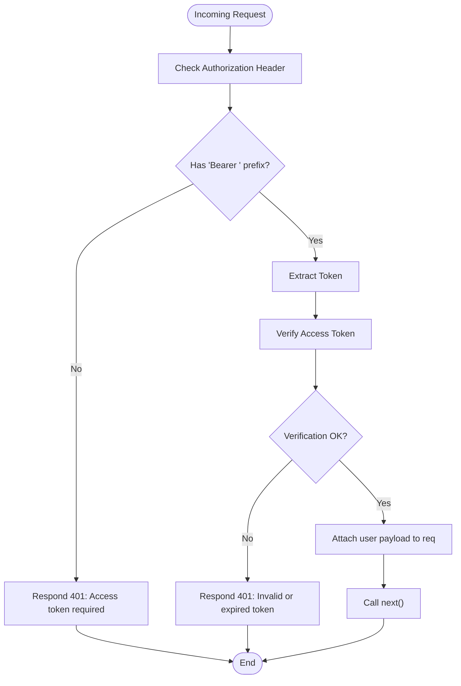
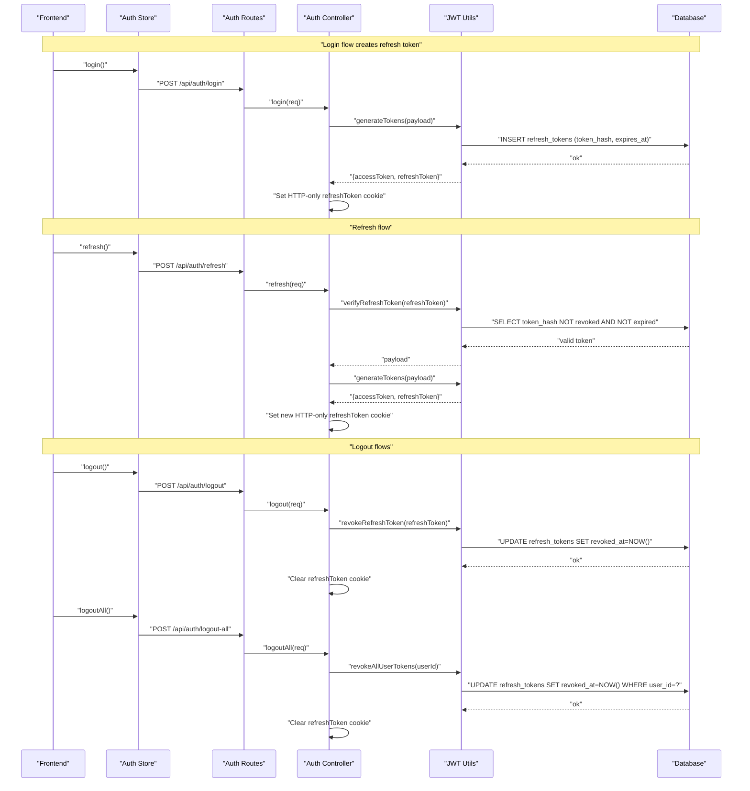
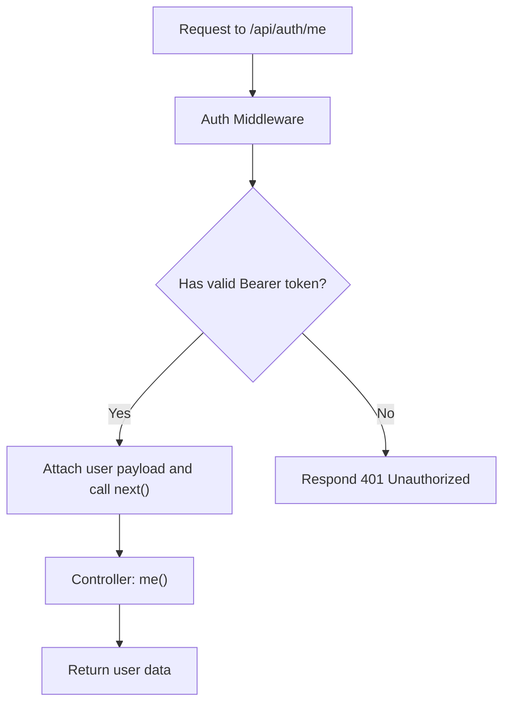
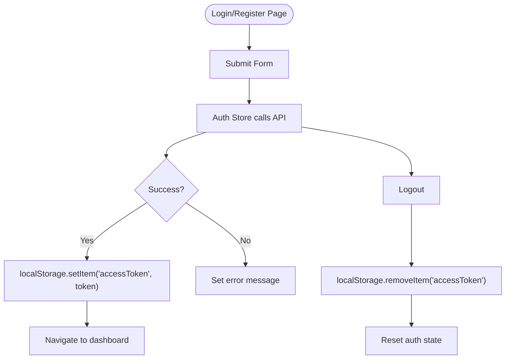
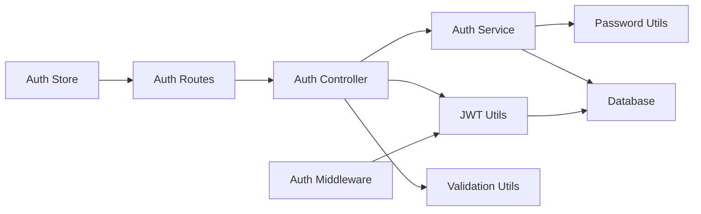
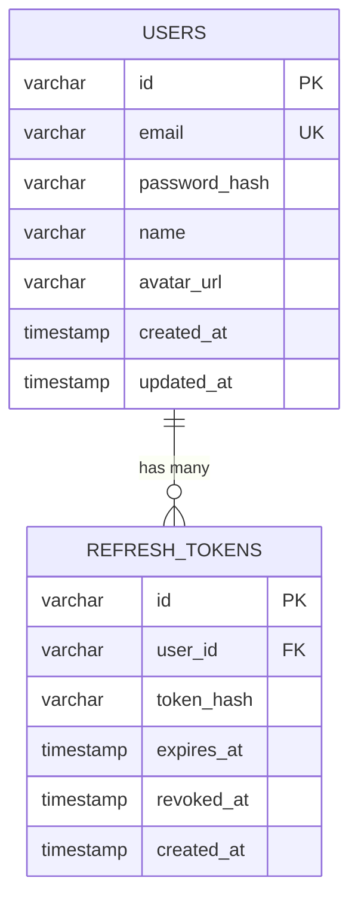

# Authentication System

<cite>
**Referenced Files in This Document**
- [backend/src/modules/auth/controller.ts](file://backend/src/modules/auth/controller.ts)
- [backend/src/modules/auth/service.ts](file://backend/src/modules/auth/service.ts)
- [backend/src/modules/auth/routes.ts](file://backend/src/modules/auth/routes.ts)
- [backend/src/middleware/auth.ts](file://backend/src/middleware/auth.ts)
- [backend/src/utils/jwt.ts](file://backend/src/utils/jwt.ts)
- [backend/src/utils/password.ts](file://backend/src/utils/password.ts)
- [backend/src/utils/validation.ts](file://backend/src/utils/validation.ts)
- [backend/src/config/database.ts](file://backend/src/config/database.ts)
- [backend/migrations/001_create_users.sql](file://backend/migrations/001_create_users.sql)
- [backend/migrations/007_create_refresh_tokens.sql](file://backend/migrations/007_create_refresh_tokens.sql)
- [backend/src/app.ts](file://backend/src/app.ts)
- [backend/src/server.ts](file://backend/src/server.ts)
- [frontend/app/(auth)/login/page.tsx](file://frontend/app/(auth)/login/page.tsx)
- [frontend/app/(auth)/register/page.tsx](file://frontend/app/(auth)/register/page.tsx)
- [frontend/app/store/authStore.ts](file://frontend/app/store/authStore.ts)
</cite>

## Table of Contents
1. [Introduction](#introduction)
2. [Project Structure](#project-structure)
3. [Core Components](#core-components)
4. [Architecture Overview](#architecture-overview)
5. [Detailed Component Analysis](#detailed-component-analysis)
6. [Dependency Analysis](#dependency-analysis)
7. [Performance Considerations](#performance-considerations)
8. [Troubleshooting Guide](#troubleshooting-guide)
9. [Conclusion](#conclusion)
10. [Appendices](#appendices)

## Introduction
This document provides comprehensive documentation for the Authentication System, covering user registration and login, password hashing and validation, JWT token management (generation, validation, refresh token rotation), session management via HTTP-only cookies, and integration with protected routes. It also outlines middleware implementation, token storage strategies, security considerations, and practical authentication flows with error handling and best practices.

## Project Structure
The authentication system spans backend modules and frontend stores:
- Backend:
  - Routes define endpoints for registration, login, logout, refresh, and protected profile retrieval.
  - Controller handles request validation, orchestrates service calls, and manages cookie-based refresh tokens.
  - Service performs database operations, password verification, and token generation/revoke actions.
  - Utilities implement JWT signing/verification, password hashing/compare, and Zod-based input validation.
  - Middleware enforces bearer token authentication for protected routes.
  - Database configuration and migrations define schema for users and refresh tokens.
- Frontend:
  - Login and Registration pages capture user input and delegate to the auth store.
  - Auth store coordinates API calls, persists access tokens, and manages authentication state.

**Diagram sources**
- [backend/src/modules/auth/routes.ts:1-15](file://backend/src/modules/auth/routes.ts#L1-L15)
- [backend/src/modules/auth/controller.ts:1-99](file://backend/src/modules/auth/controller.ts#L1-L99)
- [backend/src/modules/auth/service.ts:1-108](file://backend/src/modules/auth/service.ts#L1-L108)
- [backend/src/middleware/auth.ts:1-42](file://backend/src/middleware/auth.ts#L1-L42)
- [backend/src/utils/jwt.ts:1-78](file://backend/src/utils/jwt.ts#L1-L78)
- [backend/src/utils/password.ts:1-12](file://backend/src/utils/password.ts#L1-L12)
- [backend/src/utils/validation.ts:1-31](file://backend/src/utils/validation.ts#L1-L31)
- [backend/src/config/database.ts:1-53](file://backend/src/config/database.ts#L1-L53)
- [backend/migrations/001_create_users.sql:1-11](file://backend/migrations/001_create_users.sql#L1-L11)
- [backend/migrations/007_create_refresh_tokens.sql:1-13](file://backend/migrations/007_create_refresh_tokens.sql#L1-L13)
- [frontend/app/(auth)/login/page.tsx:1-140](file://frontend/app/(auth)/login/page.tsx#L1-L140)
- [frontend/app/(auth)/register/page.tsx:1-165](file://frontend/app/(auth)/register/page.tsx#L1-L165)
- [frontend/app/store/authStore.ts:1-98](file://frontend/app/store/authStore.ts#L1-L98)

**Section sources**
- [backend/src/app.ts:1-54](file://backend/src/app.ts#L1-L54)
- [backend/src/server.ts:1-32](file://backend/src/server.ts#L1-L32)

## Core Components
- Authentication Routes: Expose endpoints for registration, login, logout, refresh, and protected profile retrieval.
- Authentication Controller: Validates inputs, invokes service functions, sets HTTP-only refresh cookies, and returns access tokens.
- Authentication Service: Handles user creation, credential verification, token generation, and revocation.
- JWT Utilities: Manage access and refresh token lifecycle, including signing, verification, and database-backed revocation.
- Password Utilities: Hash and compare passwords using bcrypt.
- Validation Utilities: Enforce input constraints using Zod schemas.
- Database Layer: Provides query helpers and transaction support; migrations define users and refresh tokens tables.
- Authentication Middleware: Extracts Bearer token, verifies it, and attaches user payload to the request.
- Frontend Pages and Store: Capture credentials, call API endpoints, persist access tokens, and manage authentication state.

**Section sources**
- [backend/src/modules/auth/routes.ts:1-15](file://backend/src/modules/auth/routes.ts#L1-L15)
- [backend/src/modules/auth/controller.ts:1-99](file://backend/src/modules/auth/controller.ts#L1-L99)
- [backend/src/modules/auth/service.ts:1-108](file://backend/src/modules/auth/service.ts#L1-L108)
- [backend/src/utils/jwt.ts:1-78](file://backend/src/utils/jwt.ts#L1-L78)
- [backend/src/utils/password.ts:1-12](file://backend/src/utils/password.ts#L1-L12)
- [backend/src/utils/validation.ts:1-31](file://backend/src/utils/validation.ts#L1-L31)
- [backend/src/config/database.ts:1-53](file://backend/src/config/database.ts#L1-L53)
- [backend/src/middleware/auth.ts:1-42](file://backend/src/middleware/auth.ts#L1-L42)
- [frontend/app/(auth)/login/page.tsx:1-140](file://frontend/app/(auth)/login/page.tsx#L1-L140)
- [frontend/app/(auth)/register/page.tsx:1-165](file://frontend/app/(auth)/register/page.tsx#L1-L165)
- [frontend/app/store/authStore.ts:1-98](file://frontend/app/store/authStore.ts#L1-L98)

## Architecture Overview
The authentication system follows a layered architecture:
- Presentation Layer (Frontend): Renders forms and manages state.
- API Layer (Backend): Routes, controllers, and middleware handle requests.
- Domain Layer (Backend): Services encapsulate business logic.
- Infrastructure Layer (Backend): JWT utilities, password utilities, validation utilities, and database configuration.

**Diagram sources**
- [backend/src/modules/auth/routes.ts:1-15](file://backend/src/modules/auth/routes.ts#L1-L15)
- [backend/src/modules/auth/controller.ts:1-99](file://backend/src/modules/auth/controller.ts#L1-L99)
- [backend/src/modules/auth/service.ts:1-108](file://backend/src/modules/auth/service.ts#L1-L108)
- [backend/src/middleware/auth.ts:1-42](file://backend/src/middleware/auth.ts#L1-L42)
- [backend/src/utils/jwt.ts:1-78](file://backend/src/utils/jwt.ts#L1-L78)
- [backend/src/utils/password.ts:1-12](file://backend/src/utils/password.ts#L1-L12)
- [backend/src/config/database.ts:1-53](file://backend/src/config/database.ts#L1-L53)
- [backend/migrations/001_create_users.sql:1-11](file://backend/migrations/001_create_users.sql#L1-L11)
- [backend/migrations/007_create_refresh_tokens.sql:1-13](file://backend/migrations/007_create_refresh_tokens.sql#L1-L13)
- [frontend/app/store/authStore.ts:1-98](file://frontend/app/store/authStore.ts#L1-L98)

## Detailed Component Analysis

### User Registration Flow
- Input validation occurs before any server-side action.
- Password is hashed using bcrypt with a fixed number of salt rounds.
- A new user record is inserted, and related gamification data is initialized.
- On success, the client receives a 201 response with user details.

**Diagram sources**
- [frontend/app/(auth)/register/page.tsx:1-165](file://frontend/app/(auth)/register/page.tsx#L1-L165)
- [frontend/app/store/authStore.ts:1-98](file://frontend/app/store/authStore.ts#L1-L98)
- [backend/src/modules/auth/routes.ts:1-15](file://backend/src/modules/auth/routes.ts#L1-L15)
- [backend/src/modules/auth/controller.ts:1-99](file://backend/src/modules/auth/controller.ts#L1-L99)
- [backend/src/modules/auth/service.ts:1-108](file://backend/src/modules/auth/service.ts#L1-L108)
- [backend/src/utils/password.ts:1-12](file://backend/src/utils/password.ts#L1-L12)
- [backend/src/config/database.ts:1-53](file://backend/src/config/database.ts#L1-L53)

**Section sources**
- [backend/src/modules/auth/controller.ts:8-16](file://backend/src/modules/auth/controller.ts#L8-L16)
- [backend/src/modules/auth/service.ts:13-48](file://backend/src/modules/auth/service.ts#L13-L48)
- [backend/src/utils/validation.ts:3-7](file://backend/src/utils/validation.ts#L3-L7)
- [backend/src/utils/password.ts:5-7](file://backend/src/utils/password.ts#L5-L7)

### User Login Flow
- Input validation ensures presence of email and password.
- User lookup retrieves the user record and password hash.
- Password comparison validates credentials.
- Access and refresh tokens are generated and returned.
- Refresh token is stored as an HTTP-only cookie with security attributes.
- Access token is returned in the JSON body for immediate use by the frontend.

**Diagram sources**
- [frontend/app/(auth)/login/page.tsx:1-140](file://frontend/app/(auth)/login/page.tsx#L1-L140)
- [frontend/app/store/authStore.ts:1-98](file://frontend/app/store/authStore.ts#L1-L98)
- [backend/src/modules/auth/routes.ts:1-15](file://backend/src/modules/auth/routes.ts#L1-L15)
- [backend/src/modules/auth/controller.ts:18-35](file://backend/src/modules/auth/controller.ts#L18-L35)
- [backend/src/modules/auth/service.ts:50-81](file://backend/src/modules/auth/service.ts#L50-L81)
- [backend/src/utils/jwt.ts:20-41](file://backend/src/utils/jwt.ts#L20-L41)
- [backend/src/config/database.ts:1-53](file://backend/src/config/database.ts#L1-L53)

**Section sources**
- [backend/src/modules/auth/controller.ts:18-35](file://backend/src/modules/auth/controller.ts#L18-L35)
- [backend/src/modules/auth/service.ts:50-81](file://backend/src/modules/auth/service.ts#L50-L81)
- [backend/src/utils/validation.ts:9-12](file://backend/src/utils/validation.ts#L9-L12)
- [backend/src/utils/password.ts:9-11](file://backend/src/utils/password.ts#L9-L11)

### Access Token Validation Middleware
- Extracts Authorization header and verifies Bearer token.
- On success, attaches decoded user payload to the request object.
- On failure, responds with 401 Unauthorized.

**Diagram sources**
- [backend/src/middleware/auth.ts:8-24](file://backend/src/middleware/auth.ts#L8-L24)

**Section sources**
- [backend/src/middleware/auth.ts:8-24](file://backend/src/middleware/auth.ts#L8-L24)

### Refresh Token Rotation and Revocation
- Access tokens are short-lived; refresh tokens are long-lived and stored as hashes in the database.
- On login, a refresh token is generated and persisted with an expiration date.
- On refresh, the server verifies the refresh token against the stored hash, checks revocation and expiry, generates new tokens, and rotates the refresh cookie.
- Logout revokes the current refresh token; logout-all revokes all tokens for the user.

**Diagram sources**
- [backend/src/modules/auth/controller.ts:37-70](file://backend/src/modules/auth/controller.ts#L37-L70)
- [backend/src/utils/jwt.ts:47-77](file://backend/src/utils/jwt.ts#L47-L77)
- [backend/src/config/database.ts:1-53](file://backend/src/config/database.ts#L1-L53)

**Section sources**
- [backend/src/utils/jwt.ts:20-41](file://backend/src/utils/jwt.ts#L20-L41)
- [backend/src/utils/jwt.ts:47-77](file://backend/src/utils/jwt.ts#L47-L77)
- [backend/src/modules/auth/controller.ts:37-70](file://backend/src/modules/auth/controller.ts#L37-L70)

### Protected Route Access
- The authentication middleware protects routes by requiring a valid access token.
- Optional authentication middleware allows requests to proceed without a user when the token is absent or invalid.

**Diagram sources**
- [backend/src/modules/auth/routes.ts:11](file://backend/src/modules/auth/routes.ts#L11)
- [backend/src/middleware/auth.ts:8-24](file://backend/src/middleware/auth.ts#L8-L24)

**Section sources**
- [backend/src/modules/auth/routes.ts:11](file://backend/src/modules/auth/routes.ts#L11)
- [backend/src/middleware/auth.ts:26-41](file://backend/src/middleware/auth.ts#L26-L41)

### Frontend Integration and Token Storage
- The frontend store persists the access token in localStorage after successful login.
- It clears the access token on logout and handles token refresh errors by removing stale tokens.
- The store fetches the current user using the stored access token and handles token expiration by clearing state.

**Diagram sources**
- [frontend/app/store/authStore.ts:34-88](file://frontend/app/store/authStore.ts#L34-L88)
- [frontend/app/(auth)/login/page.tsx:24-34](file://frontend/app/(auth)/login/page.tsx#L24-L34)
- [frontend/app/(auth)/register/page.tsx:25-35](file://frontend/app/(auth)/register/page.tsx#L25-L35)

**Section sources**
- [frontend/app/store/authStore.ts:34-88](file://frontend/app/store/authStore.ts#L34-L88)
- [frontend/app/(auth)/login/page.tsx:24-34](file://frontend/app/(auth)/login/page.tsx#L24-L34)
- [frontend/app/(auth)/register/page.tsx:25-35](file://frontend/app/(auth)/register/page.tsx#L25-L35)

## Dependency Analysis
- Routes depend on Controller.
- Controller depends on Service, Validation, and JWT utilities.
- Service depends on Password utilities and Database.
- JWT utilities depend on Database and environment variables.
- Middleware depends on JWT utilities.
- Frontend store depends on API and localStorage.

**Diagram sources**
- [backend/src/modules/auth/routes.ts:1-15](file://backend/src/modules/auth/routes.ts#L1-L15)
- [backend/src/modules/auth/controller.ts:1-99](file://backend/src/modules/auth/controller.ts#L1-L99)
- [backend/src/modules/auth/service.ts:1-108](file://backend/src/modules/auth/service.ts#L1-L108)
- [backend/src/utils/jwt.ts:1-78](file://backend/src/utils/jwt.ts#L1-L78)
- [backend/src/utils/password.ts:1-12](file://backend/src/utils/password.ts#L1-L12)
- [backend/src/utils/validation.ts:1-31](file://backend/src/utils/validation.ts#L1-L31)
- [backend/src/config/database.ts:1-53](file://backend/src/config/database.ts#L1-L53)
- [backend/src/middleware/auth.ts:1-42](file://backend/src/middleware/auth.ts#L1-L42)
- [frontend/app/store/authStore.ts:1-98](file://frontend/app/store/authStore.ts#L1-L98)

**Section sources**
- [backend/src/modules/auth/controller.ts:1-99](file://backend/src/modules/auth/controller.ts#L1-L99)
- [backend/src/modules/auth/service.ts:1-108](file://backend/src/modules/auth/service.ts#L1-L108)
- [backend/src/utils/jwt.ts:1-78](file://backend/src/utils/jwt.ts#L1-L78)
- [backend/src/utils/password.ts:1-12](file://backend/src/utils/password.ts#L1-L12)
- [backend/src/utils/validation.ts:1-31](file://backend/src/utils/validation.ts#L1-L31)
- [backend/src/config/database.ts:1-53](file://backend/src/config/database.ts#L1-L53)
- [backend/src/middleware/auth.ts:1-42](file://backend/src/middleware/auth.ts#L1-L42)
- [frontend/app/store/authStore.ts:1-98](file://frontend/app/store/authStore.ts#L1-L98)

## Performance Considerations
- Rate limiting is applied to authentication endpoints to mitigate brute force attacks.
- Database queries leverage prepared statements and indexes on email and refresh token hash.
- Token generation and verification are lightweight; avoid excessive refresh cycles.
- Keep-alive connections and connection pooling reduce overhead.

[No sources needed since this section provides general guidance]

## Troubleshooting Guide
Common issues and resolutions:
- Invalid credentials during login:
  - Ensure email and password meet validation requirements.
  - Confirm the user exists and the password hash matches.
- Missing or invalid access token:
  - Verify the Authorization header format and token validity.
  - Clear browser cookies/localStorage and re-authenticate.
- Refresh token errors:
  - Confirm the refresh token is present and not revoked/expired.
  - Rotate tokens on successful refresh and ensure cookie settings match environment.
- Database connectivity:
  - Check environment variables and connection pool configuration.
- CORS and cookies:
  - Ensure credentials are enabled and origins match between frontend and backend.

**Section sources**
- [backend/src/modules/auth/service.ts:61-68](file://backend/src/modules/auth/service.ts#L61-L68)
- [backend/src/middleware/auth.ts:12-23](file://backend/src/middleware/auth.ts#L12-L23)
- [backend/src/utils/jwt.ts:57-62](file://backend/src/utils/jwt.ts#L57-L62)
- [backend/src/app.ts:15-20](file://backend/src/app.ts#L15-L20)

## Conclusion
The Authentication System integrates robust input validation, secure password handling, and a resilient JWT-based token strategy with refresh token rotation and revocation. HTTP-only cookies protect refresh tokens, while access tokens are managed client-side. Middleware secures protected routes, and frontend state management streamlines user sessions. Together, these components deliver a secure, maintainable, and scalable authentication solution.

[No sources needed since this section summarizes without analyzing specific files]

## Appendices

### Database Schema Overview
- Users table stores unique emails, password hashes, and metadata.
- Refresh tokens table stores hashed refresh tokens, user associations, expiration, and revocation timestamps.

**Diagram sources**
- [backend/migrations/001_create_users.sql:1-11](file://backend/migrations/001_create_users.sql#L1-L11)
- [backend/migrations/007_create_refresh_tokens.sql:1-13](file://backend/migrations/007_create_refresh_tokens.sql#L1-L13)

### Environment Variables
- JWT_SECRET: Secret key for signing tokens.
- JWT_EXPIRES_IN: Access token TTL.
- JWT_REFRESH_EXPIRES_IN: Refresh token TTL.
- NODE_ENV: Controls cookie security flags (secure).
- FRONTEND_URL: CORS origin for credentials.

**Section sources**
- [backend/src/utils/jwt.ts:6-8](file://backend/src/utils/jwt.ts#L6-L8)
- [backend/src/app.ts:15-20](file://backend/src/app.ts#L15-L20)
- [backend/src/modules/auth/controller.ts:22-28](file://backend/src/modules/auth/controller.ts#L22-L28)
- [backend/src/modules/auth/controller.ts:59-65](file://backend/src/modules/auth/controller.ts#L59-L65)