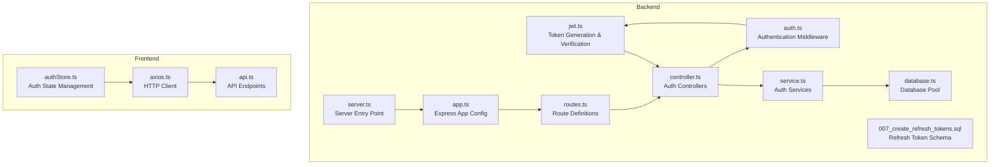
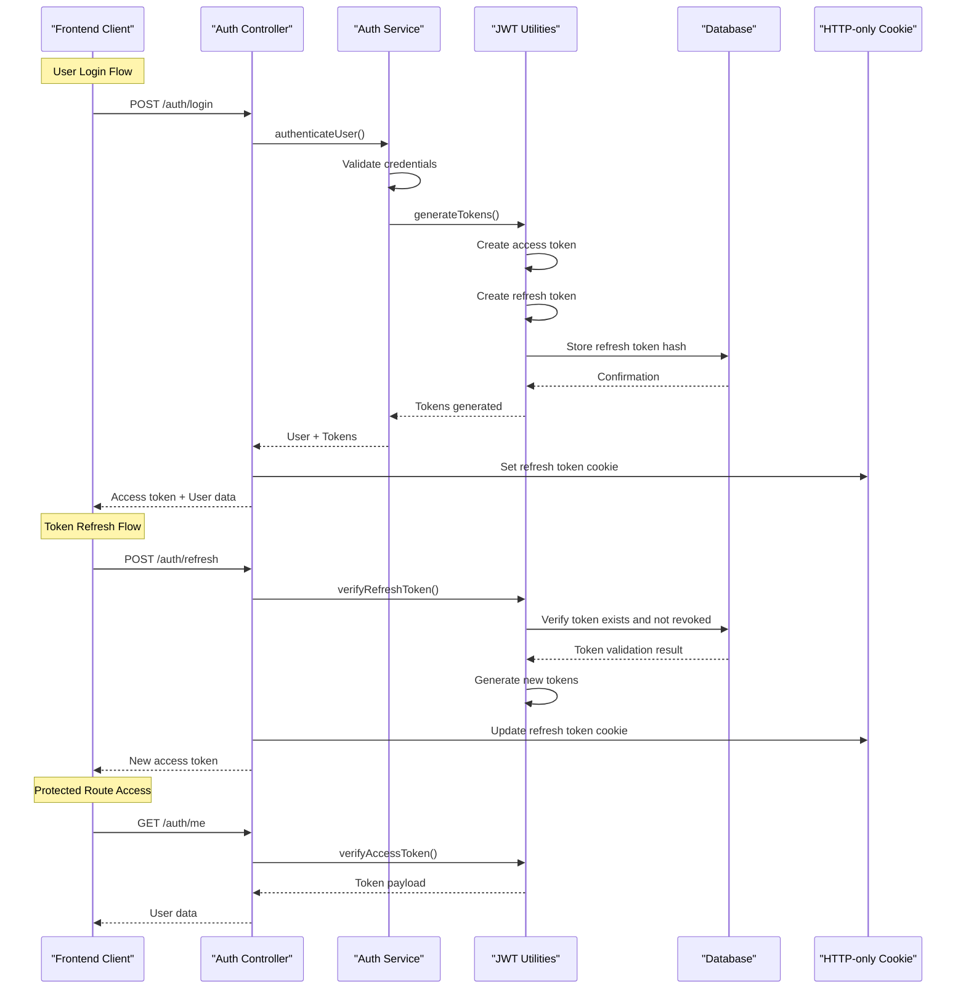
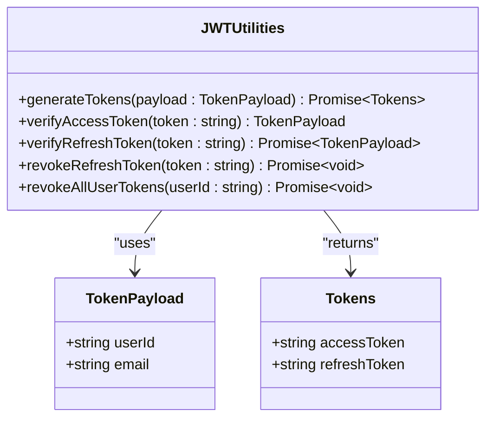
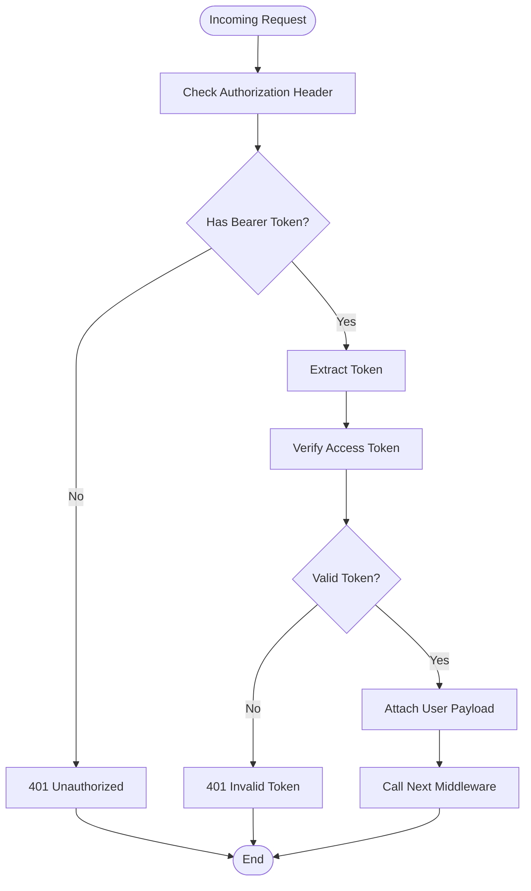
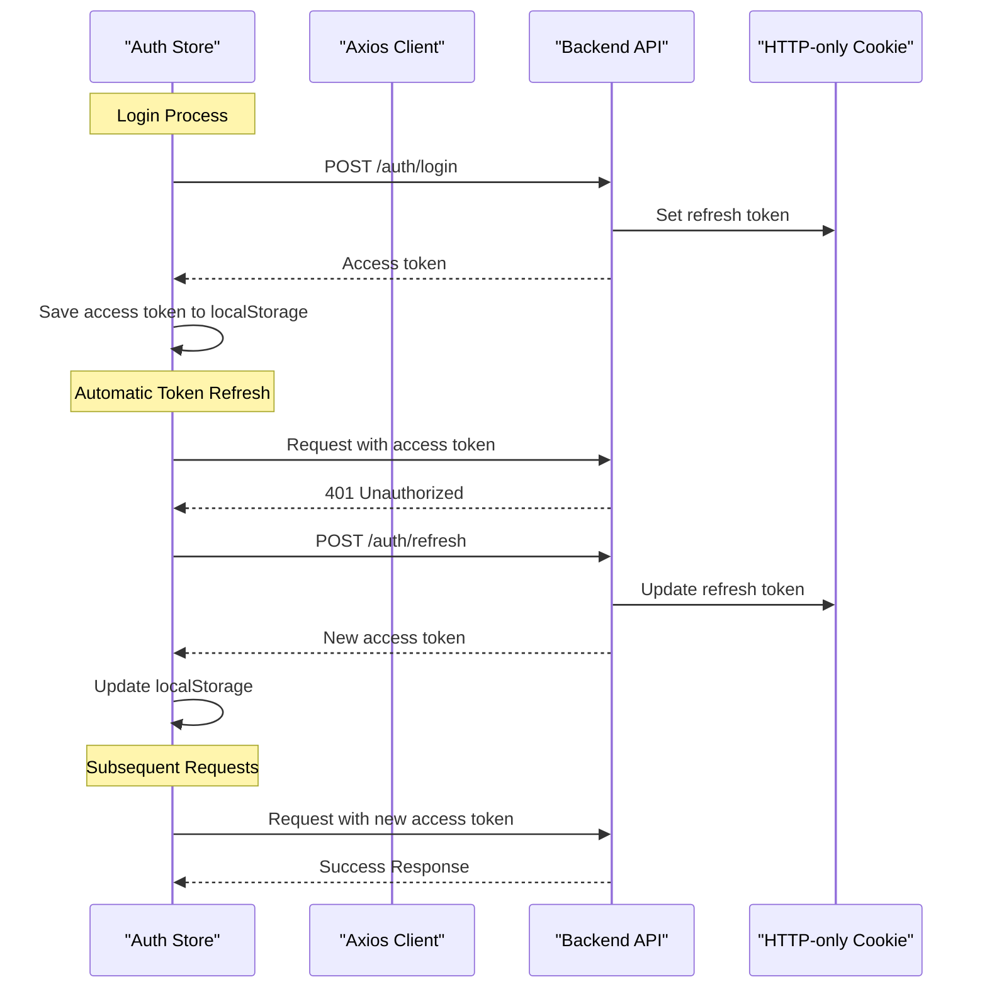
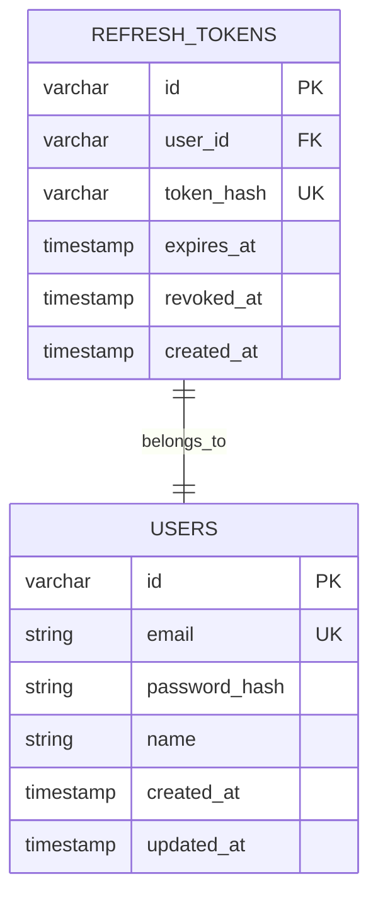
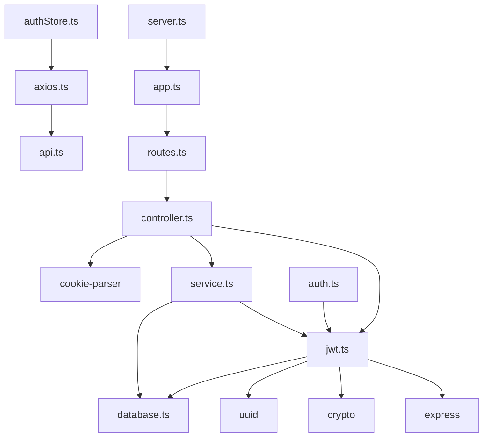
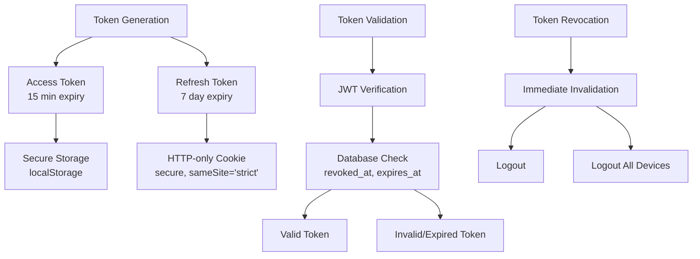

# JWT Token Management

<cite>
**Referenced Files in This Document**
- [jwt.ts](file://backend/src/utils/jwt.ts)
- [auth.ts](file://backend/src/middleware/auth.ts)
- [service.ts](file://backend/src/modules/auth/service.ts)
- [controller.ts](file://backend/src/modules/auth/controller.ts)
- [routes.ts](file://backend/src/modules/auth/routes.ts)
- [index.ts](file://backend/src/routes/index.ts)
- [app.ts](file://backend/src/app.ts)
- [server.ts](file://backend/src/server.ts)
- [database.ts](file://backend/src/config/database.ts)
- [007_create_refresh_tokens.sql](file://backend/migrations/007_create_refresh_tokens.sql)
- [axios.ts](file://frontend/app/lib/axios.ts)
- [authStore.ts](file://frontend/app/store/authStore.ts)
- [api.ts](file://frontend/app/lib/api.ts)
</cite>

## Table of Contents
1. [Introduction](#introduction)
2. [Project Structure](#project-structure)
3. [Core Components](#core-components)
4. [Architecture Overview](#architecture-overview)
5. [Detailed Component Analysis](#detailed-component-analysis)
6. [Dependency Analysis](#dependency-analysis)
7. [Performance Considerations](#performance-considerations)
8. [Security Considerations](#security-considerations)
9. [Practical Examples](#practical-examples)
10. [Troubleshooting Guide](#troubleshooting-guide)
11. [Conclusion](#conclusion)

## Introduction
This document provides comprehensive documentation for the JWT token management system implemented in the learning management system. The system implements a robust authentication mechanism using JSON Web Tokens (JWT) with refresh token rotation, HTTP-only cookies for secure storage, and comprehensive security measures including token revocation and rate limiting.

The system follows modern authentication best practices with separate access and refresh tokens, secure storage strategies, and automatic token refresh capabilities to provide seamless user experiences while maintaining strong security posture.

## Project Structure
The JWT token management system is distributed across several key components:

**Diagram sources**
- [jwt.ts:1-78](file://backend/src/utils/jwt.ts#L1-L78)
- [auth.ts:1-42](file://backend/src/middleware/auth.ts#L1-L42)
- [controller.ts:1-99](file://backend/src/modules/auth/controller.ts#L1-L99)
- [service.ts:1-108](file://backend/src/modules/auth/service.ts#L1-L108)
- [routes.ts:1-15](file://backend/src/modules/auth/routes.ts#L1-L15)
- [app.ts:1-54](file://backend/src/app.ts#L1-L54)
- [server.ts:1-32](file://backend/src/server.ts#L1-L32)
- [database.ts:1-53](file://backend/src/config/database.ts#L1-L53)
- [007_create_refresh_tokens.sql:1-13](file://backend/migrations/007_create_refresh_tokens.sql#L1-L13)
- [axios.ts:1-61](file://frontend/app/lib/axios.ts#L1-L61)
- [authStore.ts:1-98](file://frontend/app/store/authStore.ts#L1-L98)
- [api.ts:1-80](file://frontend/app/lib/api.ts#L1-L80)

**Section sources**
- [jwt.ts:1-78](file://backend/src/utils/jwt.ts#L1-L78)
- [auth.ts:1-42](file://backend/src/middleware/auth.ts#L1-L42)
- [controller.ts:1-99](file://backend/src/modules/auth/controller.ts#L1-L99)
- [service.ts:1-108](file://backend/src/modules/auth/service.ts#L1-L108)
- [routes.ts:1-15](file://backend/src/modules/auth/routes.ts#L1-L15)
- [app.ts:1-54](file://backend/src/app.ts#L1-L54)
- [server.ts:1-32](file://backend/src/server.ts#L1-L32)
- [database.ts:1-53](file://backend/src/config/database.ts#L1-L53)
- [007_create_refresh_tokens.sql:1-13](file://backend/migrations/007_create_refresh_tokens.sql#L1-L13)
- [axios.ts:1-61](file://frontend/app/lib/axios.ts#L1-L61)
- [authStore.ts:1-98](file://frontend/app/store/authStore.ts#L1-L98)
- [api.ts:1-80](file://frontend/app/lib/api.ts#L1-L80)

## Core Components
The JWT token management system consists of several interconnected components that work together to provide secure authentication:

### Token Generation and Management
The core JWT utilities handle token creation, verification, and refresh token lifecycle management. The system generates both access tokens (short-lived) and refresh tokens (longer-lived) with distinct expiration policies and security characteristics.

### Authentication Middleware
Custom middleware provides request authentication by extracting and validating JWT tokens from Authorization headers, enabling protected route access throughout the application.

### Frontend Token Storage
The frontend implements secure token storage using HTTP-only cookies for refresh tokens and localStorage for access tokens, with automatic token refresh capabilities through interceptors.

### Database Integration
Refresh tokens are securely stored in the database with hashed token values, expiration tracking, and revocation capabilities to prevent token replay attacks.

**Section sources**
- [jwt.ts:20-41](file://backend/src/utils/jwt.ts#L20-L41)
- [auth.ts:8-24](file://backend/src/middleware/auth.ts#L8-L24)
- [axios.ts:14-58](file://frontend/app/lib/axios.ts#L14-L58)
- [007_create_refresh_tokens.sql:1-13](file://backend/migrations/007_create_refresh_tokens.sql#L1-L13)

## Architecture Overview
The JWT token management system follows a layered architecture with clear separation of concerns:

**Diagram sources**
- [controller.ts:18-35](file://backend/src/modules/auth/controller.ts#L18-L35)
- [service.ts:50-81](file://backend/src/modules/auth/service.ts#L50-L81)
- [jwt.ts:20-41](file://backend/src/utils/jwt.ts#L20-L41)
- [jwt.ts:47-62](file://backend/src/utils/jwt.ts#L47-L62)
- [auth.ts:8-24](file://backend/src/middleware/auth.ts#L8-L24)

The architecture implements a client-server model with clear boundaries between authentication, authorization, and resource access layers. The system handles token lifecycle management automatically, including generation, validation, refresh, and revocation.

**Section sources**
- [controller.ts:18-70](file://backend/src/modules/auth/controller.ts#L18-L70)
- [service.ts:50-89](file://backend/src/modules/auth/service.ts#L50-L89)
- [jwt.ts:20-78](file://backend/src/utils/jwt.ts#L20-L78)
- [auth.ts:8-41](file://backend/src/middleware/auth.ts#L8-L41)

## Detailed Component Analysis

### JWT Utilities Implementation
The JWT utilities module provides the core token management functionality with comprehensive security features:

**Diagram sources**
- [jwt.ts:10-18](file://backend/src/utils/jwt.ts#L10-L18)
- [jwt.ts:20-41](file://backend/src/utils/jwt.ts#L20-L41)
- [jwt.ts:43-78](file://backend/src/utils/jwt.ts#L43-L78)

The implementation includes:
- **Access Token Generation**: Short-lived tokens (default 15 minutes) for API access
- **Refresh Token Generation**: Long-lived tokens (default 7 days) for token renewal
- **Token Hashing**: SHA-256 hashing of refresh tokens for secure storage
- **Database Storage**: Persistent refresh token records with expiration tracking
- **Token Revocation**: Immediate invalidation of compromised or logged-out tokens

**Section sources**
- [jwt.ts:20-78](file://backend/src/utils/jwt.ts#L20-L78)

### Authentication Middleware
The authentication middleware provides request-level security by validating JWT tokens:

**Diagram sources**
- [auth.ts:8-24](file://backend/src/middleware/auth.ts#L8-L24)

The middleware supports both required and optional authentication scenarios:
- **Required Authentication**: Blocks requests without valid tokens
- **Optional Authentication**: Allows requests without tokens but attaches user context when available

**Section sources**
- [auth.ts:8-41](file://backend/src/middleware/auth.ts#L8-L41)

### Frontend Token Management
The frontend implements sophisticated token management with automatic refresh capabilities:

**Diagram sources**
- [authStore.ts:34-49](file://frontend/app/store/authStore.ts#L34-L49)
- [axios.ts:28-58](file://frontend/app/lib/axios.ts#L28-L58)
- [controller.ts:48-70](file://backend/src/modules/auth/controller.ts#L48-L70)

The frontend implementation includes:
- **Automatic Token Refresh**: Interceptor-based refresh when encountering 401 errors
- **Secure Storage**: Access tokens in localStorage, refresh tokens in HTTP-only cookies
- **State Management**: Centralized auth state with persistence
- **Error Handling**: Graceful handling of token expiration and refresh failures

**Section sources**
- [authStore.ts:34-98](file://frontend/app/store/authStore.ts#L34-L98)
- [axios.ts:14-58](file://frontend/app/lib/axios.ts#L14-L58)

### Database Schema Design
The refresh token database schema implements security best practices:

**Diagram sources**
- [007_create_refresh_tokens.sql:1-13](file://backend/migrations/007_create_refresh_tokens.sql#L1-L13)
- [database.ts:19-50](file://backend/src/config/database.ts#L19-L50)

Key security features of the schema:
- **Token Hashing**: Only hashed tokens are stored, preventing plaintext token exposure
- **Revocation Tracking**: Separate field for token revocation timestamps
- **Index Optimization**: Multiple indexes for efficient token lookup and expiration cleanup
- **Foreign Key Constraints**: Cascading deletion ensures clean database cleanup

**Section sources**
- [007_create_refresh_tokens.sql:1-13](file://backend/migrations/007_create_refresh_tokens.sql#L1-L13)
- [database.ts:19-50](file://backend/src/config/database.ts#L19-L50)

## Dependency Analysis
The JWT token management system exhibits well-structured dependencies with clear separation of concerns:

**Diagram sources**
- [jwt.ts:1-8](file://backend/src/utils/jwt.ts#L1-L8)
- [controller.ts:1-6](file://backend/src/modules/auth/controller.ts#L1-L6)
- [service.ts:1-4](file://backend/src/modules/auth/service.ts#L1-L4)
- [auth.ts:1-3](file://backend/src/middleware/auth.ts#L1-L3)
- [axios.ts:1-2](file://frontend/app/lib/axios.ts#L1-L2)
- [authStore.ts:1-4](file://frontend/app/store/authStore.ts#L1-L4)
- [routes.ts:1-3](file://backend/src/modules/auth/routes.ts#L1-L3)
- [app.ts:1-8](file://backend/src/app.ts#L1-L8)
- [server.ts:1-4](file://backend/src/server.ts#L1-L4)

The dependency graph reveals:
- **Low Coupling**: JWT utilities are independent and reusable
- **Clear Layering**: Frontend and backend components maintain separation
- **External Dependencies**: Minimal third-party dependencies for core functionality
- **Database Abstraction**: Clean database interface abstraction

**Section sources**
- [jwt.ts:1-78](file://backend/src/utils/jwt.ts#L1-L78)
- [controller.ts:1-99](file://backend/src/modules/auth/controller.ts#L1-L99)
- [service.ts:1-108](file://backend/src/modules/auth/service.ts#L1-L108)
- [auth.ts:1-42](file://backend/src/middleware/auth.ts#L1-L42)
- [axios.ts:1-61](file://frontend/app/lib/axios.ts#L1-L61)
- [authStore.ts:1-98](file://frontend/app/store/authStore.ts#L1-L98)
- [routes.ts:1-15](file://backend/src/modules/auth/routes.ts#L1-L15)
- [app.ts:1-54](file://backend/src/app.ts#L1-L54)
- [server.ts:1-32](file://backend/src/server.ts#L1-L32)

## Performance Considerations
The JWT token management system incorporates several performance optimization strategies:

### Token Expiration Strategy
- **Access Tokens**: Short expiration (15 minutes) reduces token lifetime risk
- **Refresh Tokens**: Longer expiration (7 days) minimizes refresh frequency
- **Database Cleanup**: Efficient indexing enables fast token validation and cleanup

### Caching and Storage
- **Local Storage**: Access tokens cached locally to avoid repeated network requests
- **Cookie Storage**: Refresh tokens stored in HTTP-only cookies for security
- **State Persistence**: Auth state persisted across browser sessions

### Network Optimization
- **Automatic Refresh**: Interceptors handle token refresh transparently
- **Retry Logic**: Failed requests retry with refreshed tokens
- **Rate Limiting**: Built-in rate limiting prevents abuse and improves performance

### Database Performance
- **Indexed Lookups**: Multiple database indexes optimize token validation
- **Connection Pooling**: MySQL connection pooling manages database connections efficiently
- **Transaction Support**: Atomic operations ensure data consistency

## Security Considerations

### Token Security Implementation
The system implements comprehensive security measures:

**Diagram sources**
- [jwt.ts:20-41](file://backend/src/utils/jwt.ts#L20-L41)
- [jwt.ts:47-78](file://backend/src/utils/jwt.ts#L47-L78)
- [controller.ts:22-28](file://backend/src/modules/auth/controller.ts#L22-L28)
- [controller.ts:59-65](file://backend/src/modules/auth/controller.ts#L59-L65)

### Security Best Practices Implemented
- **Separate Token Types**: Different lifetimes for access and refresh tokens
- **HTTP-only Cookies**: Prevents XSS attacks on refresh tokens
- **Secure Flags**: HTTPS-only transmission for production environments
- **SameSite Protection**: CSRF protection against cross-site requests
- **Token Hashing**: Database stores only hashed refresh tokens
- **Revocation System**: Immediate token invalidation capability
- **Rate Limiting**: Protection against brute force attacks
- **CORS Configuration**: Strict cross-origin policy enforcement

### Attack Prevention Measures
- **CSRF Protection**: SameSite cookies and CORS restrictions
- **XSS Mitigation**: HTTP-only cookies for sensitive tokens
- **Brute Force Protection**: Rate limiting on authentication endpoints
- **Token Replay Prevention**: Database-backed token validation
- **Session Management**: Logout clears both tokens and cookies

**Section sources**
- [jwt.ts:20-78](file://backend/src/utils/jwt.ts#L20-L78)
- [controller.ts:22-28](file://backend/src/modules/auth/controller.ts#L22-L28)
- [controller.ts:59-65](file://backend/src/modules/auth/controller.ts#L59-L65)
- [app.ts:15-42](file://backend/src/app.ts#L15-L42)

## Practical Examples

### Token Generation Process
The system generates both access and refresh tokens during user authentication:

1. **User Authentication**: Credentials validated against database
2. **Token Creation**: Access token (15 minutes) and refresh token (7 days) generated
3. **Database Storage**: Refresh token hash stored with expiration date
4. **Response Delivery**: Access token returned in JSON, refresh token in HTTP-only cookie

### Token Validation Flow
Access token validation occurs on protected routes:

1. **Header Extraction**: Authorization header parsed for Bearer token
2. **Token Verification**: JWT signature and claims verified
3. **User Context**: Validated user payload attached to request
4. **Route Execution**: Protected route handler executes with user context

### Refresh Token Rotation
The refresh token lifecycle includes automatic rotation:

1. **Token Request**: Client sends refresh token in cookie or body
2. **Validation**: Database checks token existence, expiration, and revocation
3. **New Token Generation**: Fresh tokens generated with new refresh token
4. **Cookie Update**: Updated refresh token replaces previous cookie
5. **Access Token Return**: New access token returned for immediate use

### Logout and Session Termination
Multiple logout scenarios are supported:

- **Single Device Logout**: Current refresh token revoked, cookie cleared
- **All Devices Logout**: All user refresh tokens revoked, cookie cleared
- **Automatic Cleanup**: Expired tokens cleaned up by database maintenance

**Section sources**
- [service.ts:50-81](file://backend/src/modules/auth/service.ts#L50-L81)
- [controller.ts:18-35](file://backend/src/modules/auth/controller.ts#L18-L35)
- [controller.ts:37-46](file://backend/src/modules/auth/controller.ts#L37-L46)
- [controller.ts:88-98](file://backend/src/modules/auth/controller.ts#L88-L98)

## Troubleshooting Guide

### Common Authentication Issues

#### 401 Unauthorized Errors
**Symptoms**: Requests fail with 401 status despite valid credentials
**Causes**: 
- Expired access token requiring refresh
- Invalid or tampered JWT token
- Missing or malformed Authorization header

**Solutions**:
- Implement automatic token refresh using interceptors
- Verify token expiration and renewal timing
- Check JWT secret configuration consistency

#### Refresh Token Problems
**Symptoms**: Unable to refresh access token after expiration
**Causes**:
- Refresh token not found in database
- Token has been revoked or expired
- Cookie not properly transmitted with requests

**Solutions**:
- Verify refresh token storage in HTTP-only cookie
- Check database connectivity and refresh token records
- Ensure cookie domain and path configuration matches requests

#### CORS and Cookie Issues
**Symptoms**: Cross-origin requests failing or cookies not persisting
**Causes**:
- Incorrect CORS configuration
- Cookie domain/path mismatch
- Browser security restrictions

**Solutions**:
- Configure CORS with credentials support
- Verify cookie domain matches frontend origin
- Check SameSite and secure flag compatibility

### Database and Token Storage Issues

#### Token Validation Failures
**Symptoms**: Frequent token validation errors despite valid tokens
**Causes**:
- Database connection pool exhaustion
- Token hash mismatch or corruption
- Concurrent token access conflicts

**Solutions**:
- Monitor database connection pool usage
- Verify token hash generation and storage
- Implement proper database transaction handling

#### Performance Degradation
**Symptoms**: Slow authentication responses and token validation delays
**Causes**:
- Insufficient database indexing
- High token validation frequency
- Memory leaks in token management

**Solutions**:
- Optimize database indexes for token_hash and user_id
- Implement token caching strategies
- Monitor memory usage and garbage collection

### Frontend Integration Problems

#### Token Not Persisting
**Symptoms**: Users logged out after page refresh
**Causes**:
- Access token not stored in localStorage
- Cookie not properly configured for HTTP-only
- State management not persisting across sessions

**Solutions**:
- Verify localStorage availability and quota limits
- Check cookie configuration for domain and path
- Implement proper state persistence with fallbacks

#### Automatic Refresh Not Working
**Symptoms**: 401 errors instead of automatic token refresh
**Causes**:
- Axios interceptors not properly configured
- Refresh endpoint not returning new access token
- Cookie not included in refresh requests

**Solutions**:
- Verify axios interceptors are loaded before requests
- Check refresh endpoint response format
- Ensure withCredentials flag enabled for cross-origin requests

**Section sources**
- [axios.ts:28-58](file://frontend/app/lib/axios.ts#L28-L58)
- [authStore.ts:34-98](file://frontend/app/store/authStore.ts#L34-L98)
- [jwt.ts:47-78](file://backend/src/utils/jwt.ts#L47-L78)
- [app.ts:15-42](file://backend/src/app.ts#L15-L42)

## Conclusion
The JWT token management system provides a comprehensive, secure, and scalable authentication solution. The implementation demonstrates best practices in token security, including separate access and refresh tokens, HTTP-only cookie storage for sensitive tokens, database-backed token validation, and automatic refresh capabilities.

Key strengths of the implementation include:
- **Security Focus**: Multi-layered security with token hashing, revocation, and rate limiting
- **User Experience**: Seamless token refresh without user intervention
- **Scalability**: Database-backed token management supports concurrent users
- **Maintainability**: Clear separation of concerns with modular architecture
- **Reliability**: Comprehensive error handling and troubleshooting mechanisms

The system successfully balances security requirements with user experience, providing a robust foundation for the learning management platform's authentication needs. The modular design allows for easy extension and modification as requirements evolve.

Future enhancements could include token encryption, advanced threat detection, and integration with external identity providers, building upon the solid foundation established in this implementation.