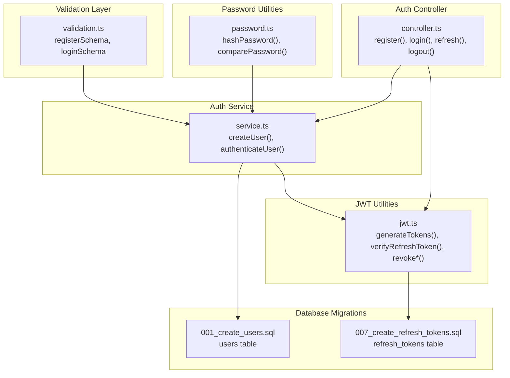
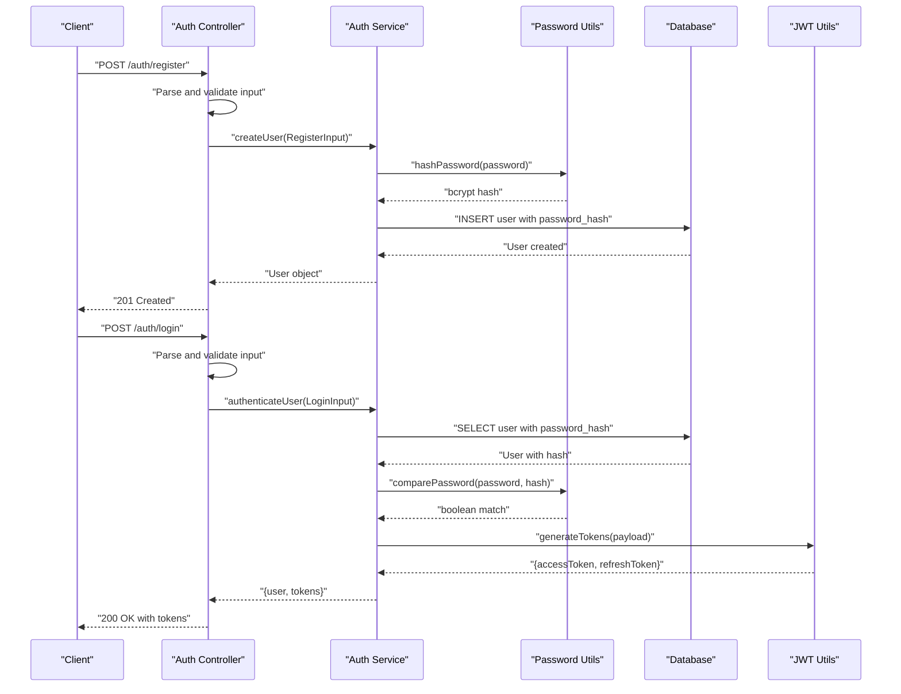
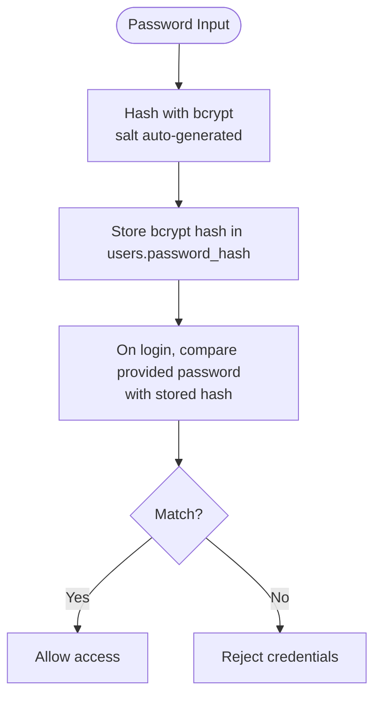
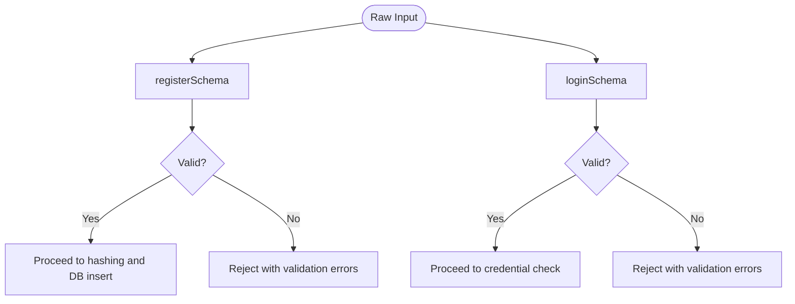
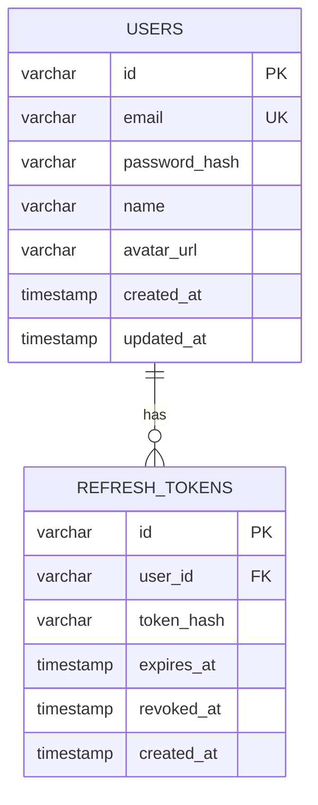
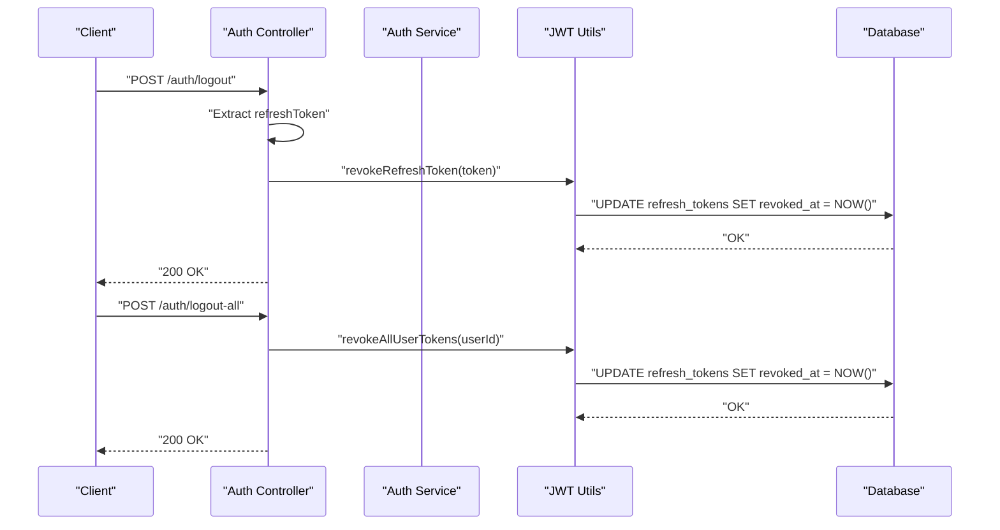
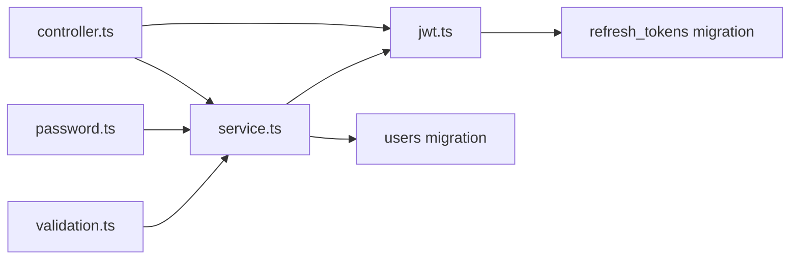

# Password Security

<cite>
**Referenced Files in This Document**
- [password.ts](file://backend/src/utils/password.ts)
- [validation.ts](file://backend/src/utils/validation.ts)
- [service.ts](file://backend/src/modules/auth/service.ts)
- [controller.ts](file://backend/src/modules/auth/controller.ts)
- [routes.ts](file://backend/src/modules/auth/routes.ts)
- [jwt.ts](file://backend/src/utils/jwt.ts)
- [001_create_users.sql](file://backend/migrations/001_create_users.sql)
- [007_create_refresh_tokens.sql](file://backend/migrations/007_create_refresh_tokens.sql)
</cite>

## Table of Contents
1. [Introduction](#introduction)
2. [Project Structure](#project-structure)
3. [Core Components](#core-components)
4. [Architecture Overview](#architecture-overview)
5. [Detailed Component Analysis](#detailed-component-analysis)
6. [Dependency Analysis](#dependency-analysis)
7. [Performance Considerations](#performance-considerations)
8. [Troubleshooting Guide](#troubleshooting-guide)
9. [Conclusion](#conclusion)
10. [Appendices](#appendices)

## Introduction
This document provides a comprehensive guide to password security in the system, focusing on hashing, salt generation, secure storage, input validation, and authentication flows. It explains how passwords are processed from registration through login, outlines current strengths and areas for improvement, and provides best practices and mitigation strategies aligned with the implemented codebase.

## Project Structure
Password-related logic spans several modules:
- Validation layer defines input schemas for registration and login.
- Password utilities implement bcrypt-based hashing and comparison.
- Authentication service orchestrates user creation, credential verification, and token generation.
- JWT utilities manage access and refresh tokens, including refresh token persistence and revocation.
- Database migrations define secure storage for users and refresh tokens.

**Diagram sources**
- [validation.ts:1-31](file://backend/src/utils/validation.ts#L1-L31)
- [password.ts:1-12](file://backend/src/utils/password.ts#L1-L12)
- [service.ts:1-108](file://backend/src/modules/auth/service.ts#L1-L108)
- [controller.ts:1-99](file://backend/src/modules/auth/controller.ts#L1-L99)
- [jwt.ts:1-78](file://backend/src/utils/jwt.ts#L1-L78)
- [001_create_users.sql:1-11](file://backend/migrations/001_create_users.sql#L1-L11)
- [007_create_refresh_tokens.sql:1-13](file://backend/migrations/007_create_refresh_tokens.sql#L1-L13)

**Section sources**
- [validation.ts:1-31](file://backend/src/utils/validation.ts#L1-L31)
- [password.ts:1-12](file://backend/src/utils/password.ts#L1-L12)
- [service.ts:1-108](file://backend/src/modules/auth/service.ts#L1-L108)
- [controller.ts:1-99](file://backend/src/modules/auth/controller.ts#L1-L99)
- [jwt.ts:1-78](file://backend/src/utils/jwt.ts#L1-L78)
- [001_create_users.sql:1-11](file://backend/migrations/001_create_users.sql#L1-L11)
- [007_create_refresh_tokens.sql:1-13](file://backend/migrations/007_create_refresh_tokens.sql#L1-L13)

## Core Components
- Password hashing and comparison:
  - bcrypt is used with a fixed number of rounds for hashing and comparison.
  - Salt is automatically generated by bcrypt during hashing.
- Input validation:
  - Registration requires email, minimum 8-character password, and minimum 2-character name.
  - Login requires a valid email and non-empty password.
- Secure storage:
  - Users table stores a bcrypt-generated password hash.
  - Refresh tokens are persisted as SHA-256 hashes with expiry and revocation tracking.
- Authentication flow:
  - Registration hashes the password and persists the hash.
  - Login retrieves the stored hash and compares the provided password using bcrypt.

**Section sources**
- [password.ts:1-12](file://backend/src/utils/password.ts#L1-L12)
- [validation.ts:3-12](file://backend/src/utils/validation.ts#L3-L12)
- [001_create_users.sql:1-11](file://backend/migrations/001_create_users.sql#L1-L11)
- [jwt.ts:30-41](file://backend/src/utils/jwt.ts#L30-L41)
- [007_create_refresh_tokens.sql:1-13](file://backend/migrations/007_create_refresh_tokens.sql#L1-L13)
- [service.ts:13-48](file://backend/src/modules/auth/service.ts#L13-L48)
- [service.ts:50-81](file://backend/src/modules/auth/service.ts#L50-L81)

## Architecture Overview
The password security architecture integrates validation, hashing, database storage, and token management:

**Diagram sources**
- [controller.ts:8-35](file://backend/src/modules/auth/controller.ts#L8-L35)
- [service.ts:13-81](file://backend/src/modules/auth/service.ts#L13-L81)
- [password.ts:5-11](file://backend/src/utils/password.ts#L5-L11)
- [jwt.ts:20-41](file://backend/src/utils/jwt.ts#L20-L41)
- [001_create_users.sql:1-11](file://backend/migrations/001_create_users.sql#L1-L11)

## Detailed Component Analysis

### Password Hashing and Comparison
- Implementation pattern:
  - Hashing uses bcrypt with a constant number of rounds.
  - Comparison uses bcrypt to securely compare plaintext against stored hash.
- Data structures:
  - Password hash stored as a single string value in the users table.
- Complexity:
  - bcrypt hashing and comparison are O(1) per operation but depend on configured cost; the chosen rounds balance security and performance.
- Security:
  - Automatic salt generation by bcrypt prevents rainbow table attacks.
  - One-way hashing ensures password material is not recoverable from storage.

**Diagram sources**
- [password.ts:5-11](file://backend/src/utils/password.ts#L5-L11)
- [001_create_users.sql:4-4](file://backend/migrations/001_create_users.sql#L4-L4)

**Section sources**
- [password.ts:1-12](file://backend/src/utils/password.ts#L1-L12)
- [001_create_users.sql:1-11](file://backend/migrations/001_create_users.sql#L1-L11)

### Input Validation and Strength Requirements
- Validation schemas:
  - Registration enforces email format, minimum 8-character password, and minimum 2-character name.
  - Login enforces email format and requires a non-empty password.
- Practical examples:
  - Registration input must satisfy the registration schema before hashing and insertion.
  - Login input must satisfy the login schema before credential verification.
- Notes:
  - Current schema does not enforce complexity rules (e.g., uppercase, lowercase, digits, special characters).
  - Consider extending schemas to include complexity requirements for stronger security.

**Diagram sources**
- [validation.ts:3-12](file://backend/src/utils/validation.ts#L3-L12)

**Section sources**
- [validation.ts:3-12](file://backend/src/utils/validation.ts#L3-L12)

### Secure Storage Mechanisms
- Users table:
  - Stores UUID primary key, unique email, bcrypt hash of password, optional avatar URL, and timestamps.
  - Index on email supports efficient lookups.
- Refresh tokens table:
  - Stores UUID, user foreign key, SHA-256 hash of the refresh token, expiry timestamp, optional revocation timestamp, and timestamps.
  - Indexes on token hash, user ID, and expiry support fast lookup and cleanup.
- Integrity:
  - Foreign key constraint ensures cascading deletion when a user is removed.
  - Revocation via timestamp prevents reuse of compromised tokens.

**Diagram sources**
- [001_create_users.sql:1-11](file://backend/migrations/001_create_users.sql#L1-L11)
- [007_create_refresh_tokens.sql:1-13](file://backend/migrations/007_create_refresh_tokens.sql#L1-L13)

**Section sources**
- [001_create_users.sql:1-11](file://backend/migrations/001_create_users.sql#L1-L11)
- [007_create_refresh_tokens.sql:1-13](file://backend/migrations/007_create_refresh_tokens.sql#L1-L13)

### Authentication Workflow
- Registration:
  - Validates input, checks for existing user, hashes password, inserts user record, initializes gamification data, and returns user info.
- Login:
  - Validates input, retrieves user by email, compares password using bcrypt, generates tokens, and returns user plus access/refresh tokens.
- Logout and logout-all:
  - Revokes the provided refresh token or all tokens for the user, clearing cookies accordingly.

**Diagram sources**
- [controller.ts:37-46](file://backend/src/modules/auth/controller.ts#L37-L46)
- [controller.ts:88-98](file://backend/src/modules/auth/controller.ts#L88-L98)
- [jwt.ts:64-77](file://backend/src/utils/jwt.ts#L64-L77)

**Section sources**
- [service.ts:13-48](file://backend/src/modules/auth/service.ts#L13-L48)
- [service.ts:50-81](file://backend/src/modules/auth/service.ts#L50-L81)
- [controller.ts:37-46](file://backend/src/modules/auth/controller.ts#L37-L46)
- [controller.ts:88-98](file://backend/src/modules/auth/controller.ts#L88-L98)
- [jwt.ts:64-77](file://backend/src/utils/jwt.ts#L64-L77)

### Password Reset Functionality and Recovery Procedures
- Current implementation:
  - No dedicated password reset endpoints or recovery flows are present in the backend codebase.
  - Authentication relies on email/password login and refresh tokens.
- Recommended recovery procedure (conceptual):
  - Implement a password reset endpoint that:
    - Accepts an email and validates it.
    - Generates a time-limited, single-use token (secure random string) and stores a hashed version.
    - Sends a secure reset link to the user’s email.
    - On reset, verifies the token, invalidates it, and updates the user’s password hash after re-validation.
- Security considerations for reset:
  - Use short expiry windows and single-use tokens.
  - Log and monitor reset attempts.
  - Rate-limit reset requests per email/IP.
  - Invalidate all existing refresh tokens upon password change.

[No sources needed since this section provides conceptual guidance not present in the codebase]

## Dependency Analysis
Password security depends on coordinated behavior across modules:

**Diagram sources**
- [validation.ts:1-31](file://backend/src/utils/validation.ts#L1-L31)
- [password.ts:1-12](file://backend/src/utils/password.ts#L1-L12)
- [service.ts:1-108](file://backend/src/modules/auth/service.ts#L1-L108)
- [controller.ts:1-99](file://backend/src/modules/auth/controller.ts#L1-L99)
- [jwt.ts:1-78](file://backend/src/utils/jwt.ts#L1-L78)
- [001_create_users.sql:1-11](file://backend/migrations/001_create_users.sql#L1-L11)
- [007_create_refresh_tokens.sql:1-13](file://backend/migrations/007_create_refresh_tokens.sql#L1-L13)

**Section sources**
- [routes.ts:1-15](file://backend/src/modules/auth/routes.ts#L1-L15)
- [controller.ts:1-99](file://backend/src/modules/auth/controller.ts#L1-L99)
- [service.ts:1-108](file://backend/src/modules/auth/service.ts#L1-L108)
- [jwt.ts:1-78](file://backend/src/utils/jwt.ts#L1-L78)

## Performance Considerations
- Hashing cost:
  - The fixed number of bcrypt rounds balances security and performance. Adjust based on hardware capabilities and latency targets.
- Database indexing:
  - Indexes on users(email) and refresh_tokens(token_hash, user_id, expires_at) improve lookup performance for authentication and token revocation.
- Token lifecycle:
  - Short-lived access tokens reduce exposure windows; refresh tokens are rotated and revoked on logout/all-devices actions.

[No sources needed since this section provides general guidance]

## Troubleshooting Guide
- Common issues and mitigations:
  - Invalid credentials on login:
    - Ensure the stored hash matches the bcrypt hash of the provided password.
    - Confirm user exists and the password field is populated.
  - Duplicate user registration:
    - The service throws a conflict error when a user with the same email already exists.
  - Refresh token errors:
    - Verify the refresh token signature and presence in the database with unrevoked and non-expired status.
    - On logout or logout-all, ensure revocation updates are applied and cookies are cleared.
  - Validation failures:
    - Confirm client-side and server-side schemas align; adjust client UI to reflect minimum length and format requirements.

**Section sources**
- [service.ts:16-20](file://backend/src/modules/auth/service.ts#L16-L20)
- [service.ts:61-68](file://backend/src/modules/auth/service.ts#L61-L68)
- [jwt.ts:47-62](file://backend/src/utils/jwt.ts#L47-L62)
- [controller.ts:37-46](file://backend/src/modules/auth/controller.ts#L37-L46)
- [controller.ts:88-98](file://backend/src/modules/auth/controller.ts#L88-L98)

## Conclusion
The system implements robust password handling using bcrypt with automatic salt generation and secure storage of hashed passwords. Input validation ensures basic hygiene, while JWT-based tokens with hashed refresh tokens provide secure session management. Areas for enhancement include strengthening password complexity requirements, implementing a secure password reset flow, and adding rate limiting and monitoring for sensitive operations.

## Appendices
- Best practices summary:
  - Enforce strong password policies (length, character variety).
  - Use adaptive hashing with configurable cost and periodic reviews.
  - Store only hashed secrets; never log raw passwords.
  - Implement secure token storage (HTTP-only cookies) and rotation.
  - Monitor and alert on suspicious activity (failed logins, rapid resets).
  - Regularly audit database indexes and token cleanup jobs.

[No sources needed since this section provides general guidance]