# User Authentication

<cite>
**Referenced Files in This Document**
- [controller.ts](file://backend/src/modules/auth/controller.ts)
- [service.ts](file://backend/src/modules/auth/service.ts)
- [routes.ts](file://backend/src/modules/auth/routes.ts)
- [validation.ts](file://backend/src/utils/validation.ts)
- [password.ts](file://backend/src/utils/password.ts)
- [jwt.ts](file://backend/src/utils/jwt.ts)
- [auth.ts](file://backend/src/middleware/auth.ts)
- [errorHandler.ts](file://backend/src/middleware/errorHandler.ts)
- [database.ts](file://backend/src/config/database.ts)
- [index.ts](file://backend/src/routes/index.ts)
- [app.ts](file://backend/src/app.ts)
- [server.ts](file://backend/src/server.ts)
- [001_create_users.sql](file://backend/migrations/001_create_users.sql)
- [007_create_refresh_tokens.sql](file://backend/migrations/007_create_refresh_tokens.sql)
</cite>

## Table of Contents
1. [Introduction](#introduction)
2. [Project Structure](#project-structure)
3. [Core Components](#core-components)
4. [Architecture Overview](#architecture-overview)
5. [Detailed Component Analysis](#detailed-component-analysis)
6. [Dependency Analysis](#dependency-analysis)
7. [Performance Considerations](#performance-considerations)
8. [Troubleshooting Guide](#troubleshooting-guide)
9. [Conclusion](#conclusion)

## Introduction
The User Authentication module provides a comprehensive authentication system with secure registration, login, logout, token refresh, and profile retrieval capabilities. Built with modern security practices, it implements token-based authentication using JSON Web Tokens (JWT) with refresh token rotation, password hashing with bcrypt, and strict input validation using Zod schemas.

The system follows a layered architecture pattern with clear separation between controllers, services, middleware, and utilities, ensuring maintainability and scalability while providing robust security measures against common authentication vulnerabilities.

## Project Structure
The authentication module is organized within the backend/src/modules/auth directory, following a clean architecture pattern with distinct layers:

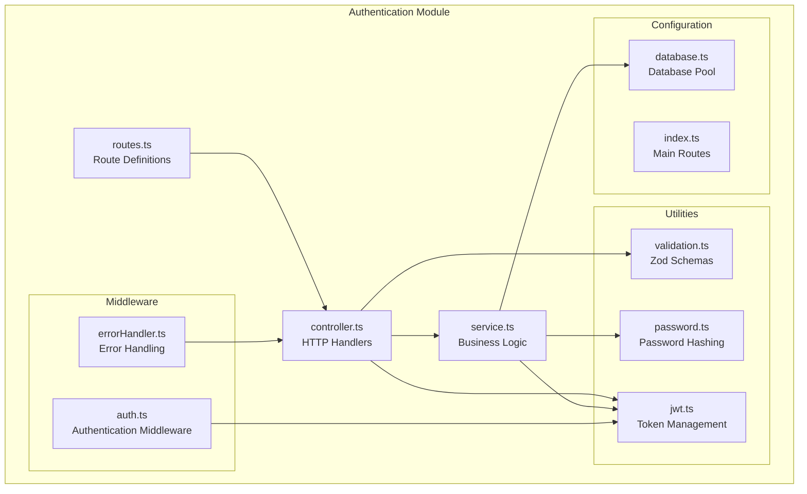

**Diagram sources**
- [routes.ts:1-15](file://backend/src/modules/auth/routes.ts#L1-L15)
- [controller.ts:1-99](file://backend/src/modules/auth/controller.ts#L1-L99)
- [service.ts:1-108](file://backend/src/modules/auth/service.ts#L1-L108)
- [validation.ts:1-31](file://backend/src/utils/validation.ts#L1-L31)
- [password.ts:1-12](file://backend/src/utils/password.ts#L1-L12)
- [jwt.ts:1-78](file://backend/src/utils/jwt.ts#L1-L78)
- [auth.ts:1-42](file://backend/src/middleware/auth.ts#L1-L42)
- [errorHandler.ts:1-38](file://backend/src/middleware/errorHandler.ts#L1-L38)
- [database.ts:1-53](file://backend/src/config/database.ts#L1-L53)
- [index.ts:1-25](file://backend/src/routes/index.ts#L1-L25)

**Section sources**
- [routes.ts:1-15](file://backend/src/modules/auth/routes.ts#L1-L15)
- [controller.ts:1-99](file://backend/src/modules/auth/controller.ts#L1-L99)
- [service.ts:1-108](file://backend/src/modules/auth/service.ts#L1-L108)

## Core Components

### Authentication Controllers
The authentication controllers handle HTTP requests and responses, implementing the complete authentication flow:

- **Registration Controller**: Validates input data, creates new user accounts, and returns user information
- **Login Controller**: Authenticates users, generates access tokens, and manages refresh tokens via cookies
- **Logout Controllers**: Handle single-device and multi-device logout scenarios
- **Token Refresh Controller**: Issues new access tokens using valid refresh tokens
- **Profile Controller**: Retrieves authenticated user profiles

### Authentication Service
The service layer implements core business logic with database operations and security validations:

- **User Creation**: Handles user registration with duplicate checking and password hashing
- **Authentication**: Verifies user credentials against hashed passwords
- **Token Management**: Generates, validates, and revokes JWT tokens
- **User Retrieval**: Fetches user profiles with proper error handling

### Validation Layer
Zod schemas provide comprehensive input validation:

- **Registration Schema**: Email validation, password strength requirements, and name validation
- **Login Schema**: Email and password validation
- **Additional Schemas**: Supporting schemas for other modules

### Security Utilities
Specialized utilities handle cryptographic operations and token management:

- **Password Hashing**: Secure password hashing with configurable salt rounds
- **JWT Operations**: Token generation, verification, and refresh token management
- **Database Integration**: Persistent token storage and revocation

**Section sources**
- [controller.ts:8-99](file://backend/src/modules/auth/controller.ts#L8-L99)
- [service.ts:13-108](file://backend/src/modules/auth/service.ts#L13-L108)
- [validation.ts:3-12](file://backend/src/utils/validation.ts#L3-L12)
- [password.ts:5-11](file://backend/src/utils/password.ts#L5-L11)
- [jwt.ts:20-78](file://backend/src/utils/jwt.ts#L20-L78)

## Architecture Overview

The authentication system follows a layered architecture with clear separation of concerns:

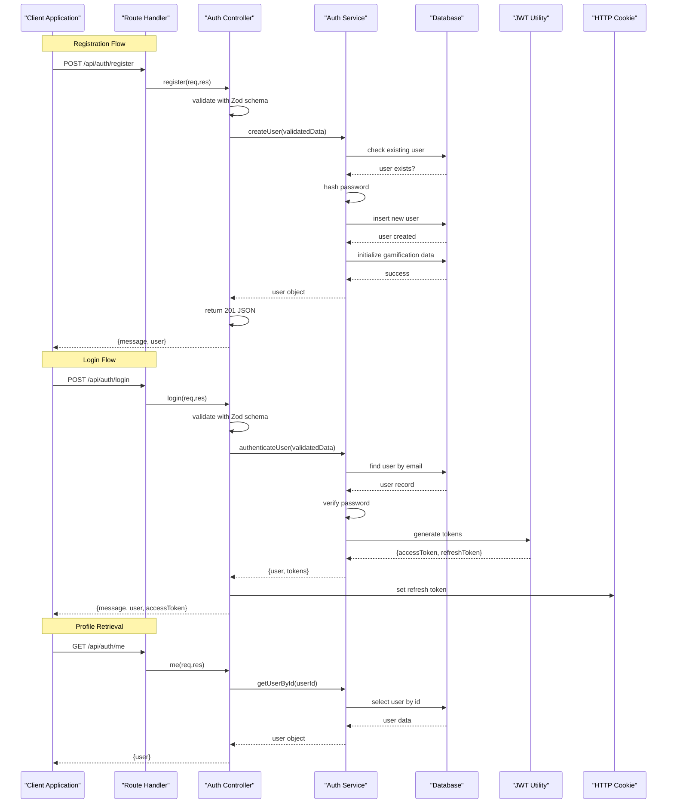

**Diagram sources**
- [controller.ts:8-35](file://backend/src/modules/auth/controller.ts#L8-L35)
- [service.ts:13-81](file://backend/src/modules/auth/service.ts#L13-L81)
- [jwt.ts:20-41](file://backend/src/utils/jwt.ts#L20-L41)
- [auth.ts:8-24](file://backend/src/middleware/auth.ts#L8-L24)

The architecture implements several security best practices:

- **Layered Validation**: Input validation at multiple layers (route, controller, service)
- **Separation of Concerns**: Clear boundaries between authentication, business logic, and persistence
- **Token-Based Security**: Stateless authentication with short-lived access tokens and long-lived refresh tokens
- **Database Abstraction**: Consistent database operations through a unified interface

**Section sources**
- [controller.ts:1-99](file://backend/src/modules/auth/controller.ts#L1-L99)
- [service.ts:1-108](file://backend/src/modules/auth/service.ts#L1-L108)
- [auth.ts:1-42](file://backend/src/middleware/auth.ts#L1-L42)

## Detailed Component Analysis

### Route Definitions
The authentication routes provide RESTful endpoints with proper HTTP methods and security middleware:

```mermaid
graph LR
subgraph "Authentication Routes"
Register[POST /api/auth/register<br/>Public]
Login[POST /api/auth/login<br/>Public]
Logout[POST /api/auth/logout<br/>Public]
Refresh[POST /api/auth/refresh<br/>Public]
Me[GET /api/auth/me<br/>Protected]
LogoutAll[POST /api/auth/logout-all<br/>Protected]
end
subgraph "Security Middleware"
Auth[authenticate()<br/>Bearer Token]
end
Register --> Controller["Auth Controller"]
Login --> Controller
Logout --> Controller
Refresh --> Controller
Me --> Auth
LogoutAll --> Auth
Auth --> Controller
```

**Diagram sources**
- [routes.ts:7-12](file://backend/src/modules/auth/routes.ts#L7-L12)
- [auth.ts:8-24](file://backend/src/middleware/auth.ts#L8-L24)

**Section sources**
- [routes.ts:1-15](file://backend/src/modules/auth/routes.ts#L1-L15)
- [index.ts:17](file://backend/src/routes/index.ts#L17)

### Controller Implementation
Each controller handles specific authentication operations with comprehensive error handling:

#### Registration Controller
Implements user registration with input validation and response formatting:

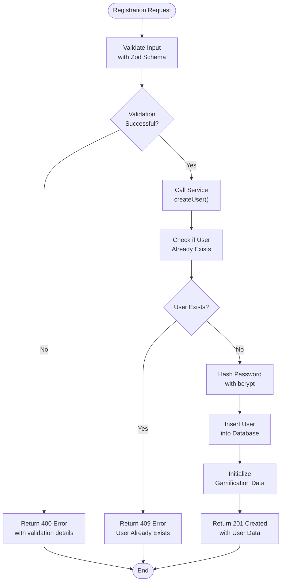

**Diagram sources**
- [controller.ts:8-16](file://backend/src/modules/auth/controller.ts#L8-L16)
- [service.ts:13-48](file://backend/src/modules/auth/service.ts#L13-L48)
- [validation.ts:3-7](file://backend/src/utils/validation.ts#L3-L7)

#### Login Controller
Handles user authentication with token generation and cookie management:

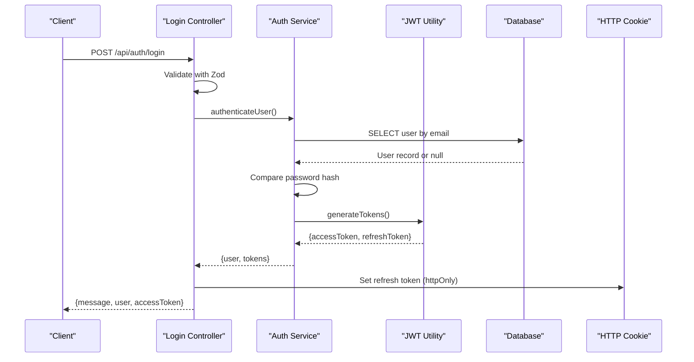

**Diagram sources**
- [controller.ts:18-35](file://backend/src/modules/auth/controller.ts#L18-L35)
- [service.ts:50-81](file://backend/src/modules/auth/service.ts#L50-L81)
- [jwt.ts:20-41](file://backend/src/utils/jwt.ts#L20-L41)

#### Logout Controllers
Provides flexible logout options with proper token revocation:

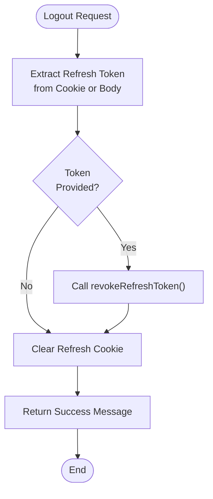

**Diagram sources**
- [controller.ts:37-46](file://backend/src/modules/auth/controller.ts#L37-L46)
- [jwt.ts:64-70](file://backend/src/utils/jwt.ts#L64-L70)

**Section sources**
- [controller.ts:8-99](file://backend/src/modules/auth/controller.ts#L8-L99)

### Service Layer Implementation
The service layer implements core business logic with proper error handling and database transactions:

#### User Creation Process
Handles user registration with comprehensive validation and initialization:

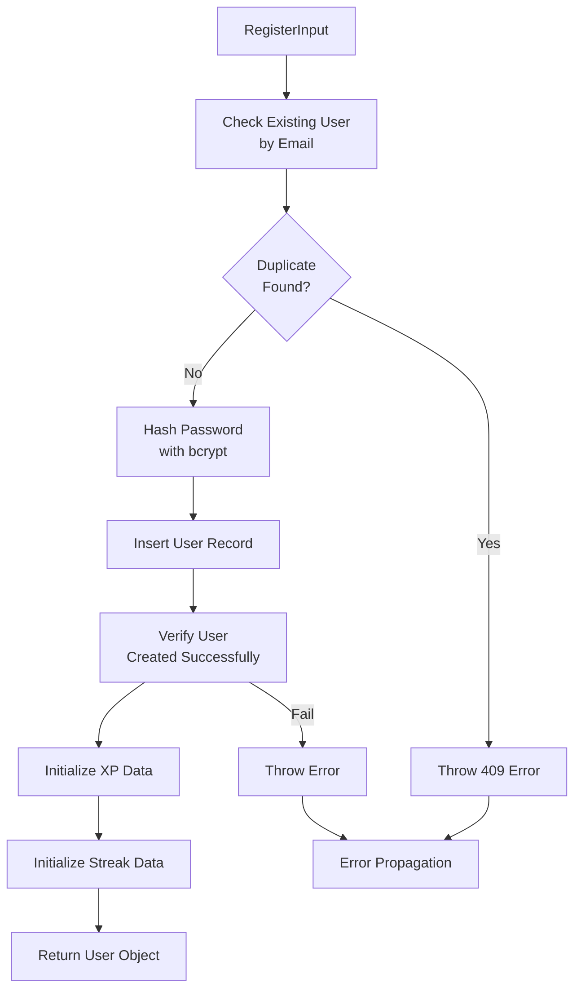

**Diagram sources**
- [service.ts:13-48](file://backend/src/modules/auth/service.ts#L13-L48)
- [password.ts:5-11](file://backend/src/utils/password.ts#L5-L11)

#### Authentication Process
Implements secure user authentication with password verification:

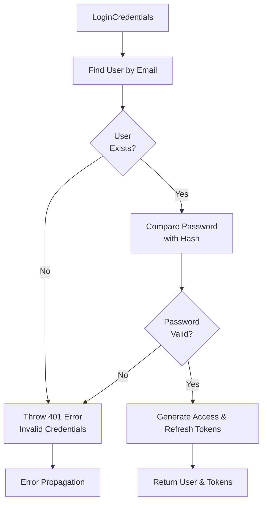

**Diagram sources**
- [service.ts:50-81](file://backend/src/modules/auth/service.ts#L50-L81)
- [password.ts:9-11](file://backend/src/utils/password.ts#L9-L11)
- [jwt.ts:20-41](file://backend/src/utils/jwt.ts#L20-L41)

**Section sources**
- [service.ts:13-108](file://backend/src/modules/auth/service.ts#L13-L108)

### Validation Schema Implementation
Zod schemas provide comprehensive input validation with specific error messages:

#### Registration Schema
Validates user registration inputs with specific constraints:

| Field | Type | Validation | Minimum/Maximum | Error Message |
|-------|------|------------|-----------------|---------------|
| email | string | email format | - | Invalid email address |
| password | string | min length 8 | 8 characters | Password must be at least 8 characters |
| name | string | min length 2 | 2 characters | Name must be at least 2 characters |

#### Login Schema
Validates authentication inputs with essential requirements:

| Field | Type | Validation | Minimum/Maximum | Error Message |
|-------|------|------------|-----------------|---------------|
| email | string | email format | - | Invalid email address |
| password | string | required | 1 character | Password is required |

**Section sources**
- [validation.ts:3-12](file://backend/src/utils/validation.ts#L3-L12)

### JWT Token Management
The JWT utility provides secure token generation, verification, and management:

#### Token Generation Process
Creates both access and refresh tokens with database persistence:

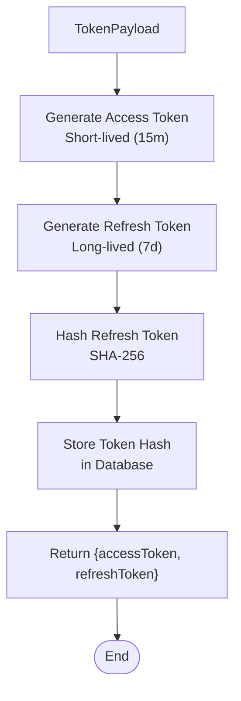

**Diagram sources**
- [jwt.ts:20-41](file://backend/src/utils/jwt.ts#L20-L41)

#### Token Verification and Revocation
Implements secure token validation with database checks:

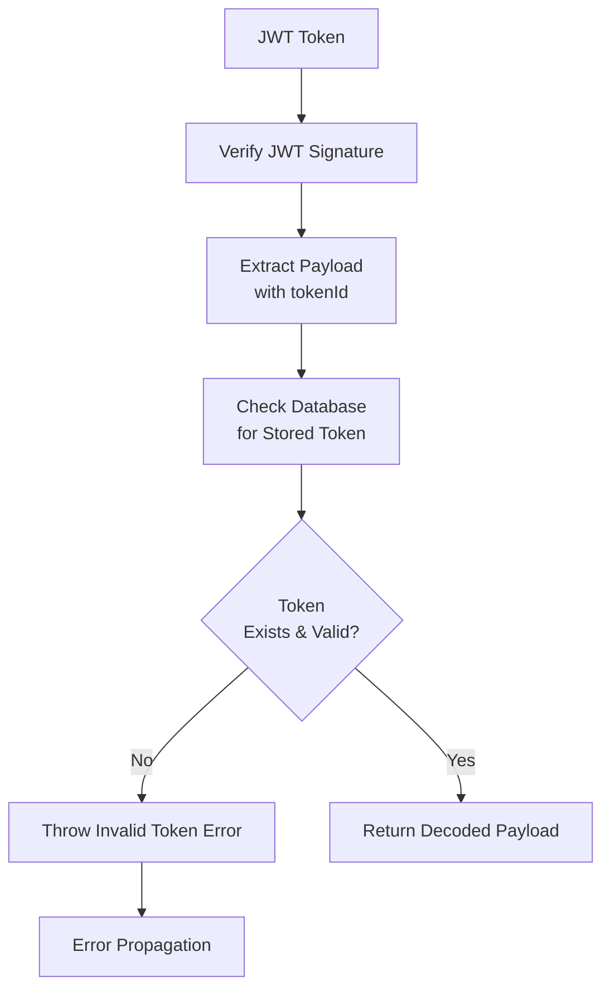

**Diagram sources**
- [jwt.ts:47-62](file://backend/src/utils/jwt.ts#L47-L62)

**Section sources**
- [jwt.ts:1-78](file://backend/src/utils/jwt.ts#L1-L78)

### Database Schema Design
The authentication system uses carefully designed database schemas for optimal performance and security:

#### Users Table Structure
```sql
CREATE TABLE users (
    id VARCHAR(36) PRIMARY KEY DEFAULT (UUID()),
    email VARCHAR(255) NOT NULL UNIQUE,
    password_hash VARCHAR(255) NOT NULL,
    name VARCHAR(255) NOT NULL,
    avatar_url VARCHAR(500),
    created_at TIMESTAMP DEFAULT CURRENT_TIMESTAMP,
    updated_at TIMESTAMP DEFAULT CURRENT_TIMESTAMP ON UPDATE CURRENT_TIMESTAMP,
    INDEX idx_email (email)
) ENGINE=InnoDB DEFAULT CHARSET=utf8mb4 COLLATE=utf8mb4_unicode_ci;
```

#### Refresh Tokens Table Structure
```sql
CREATE TABLE refresh_tokens (
    id VARCHAR(36) PRIMARY KEY DEFAULT (UUID()),
    user_id VARCHAR(36) NOT NULL,
    token_hash VARCHAR(255) NOT NULL,
    expires_at TIMESTAMP NOT NULL,
    revoked_at TIMESTAMP NULL,
    created_at TIMESTAMP DEFAULT CURRENT_TIMESTAMP,
    FOREIGN KEY (user_id) REFERENCES users(id) ON DELETE CASCADE,
    INDEX idx_token (token_hash),
    INDEX idx_user (user_id),
    INDEX idx_expires (expires_at)
) ENGINE=InnoDB DEFAULT CHARSET=utf8mb4 COLLATE=utf8mb4_unicode_ci;
```

**Section sources**
- [001_create_users.sql:1-11](file://backend/migrations/001_create_users.sql#L1-L11)
- [007_create_refresh_tokens.sql:1-13](file://backend/migrations/007_create_refresh_tokens.sql#L1-L13)

## Dependency Analysis

The authentication module has well-defined dependencies that support maintainability and testability:

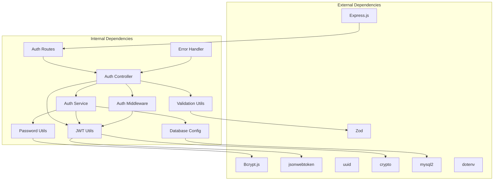

**Diagram sources**
- [controller.ts:1-7](file://backend/src/modules/auth/controller.ts#L1-L7)
- [service.ts:1-4](file://backend/src/modules/auth/service.ts#L1-L4)
- [jwt.ts:1-4](file://backend/src/utils/jwt.ts#L1-L4)
- [password.ts:1](file://backend/src/utils/password.ts#L1)

### Component Coupling Analysis
The authentication module demonstrates good separation of concerns with minimal coupling:

- **Controllers** depend only on services and utilities
- **Services** depend on database utilities and security utilities
- **Utilities** are self-contained and reusable
- **Middleware** depends only on JWT utilities

### Error Handling Strategy
The system implements comprehensive error handling at multiple levels:

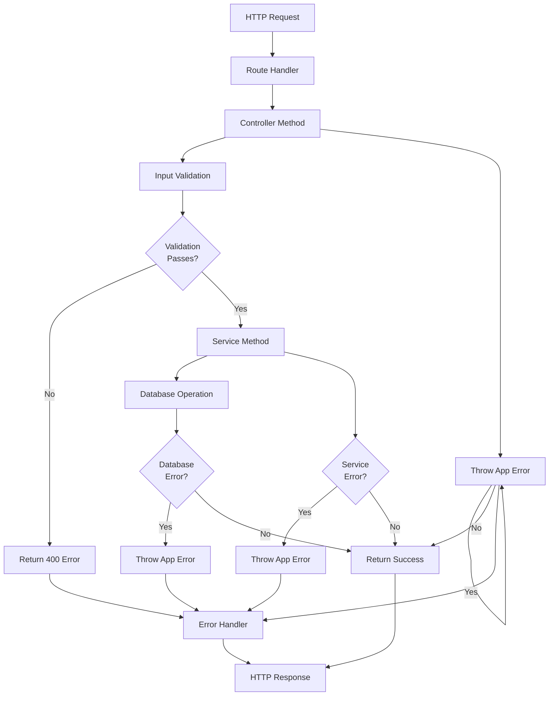

**Diagram sources**
- [errorHandler.ts:8-24](file://backend/src/middleware/errorHandler.ts#L8-L24)
- [asyncHandler.ts:33-37](file://backend/src/middleware/errorHandler.ts#L33-L37)

**Section sources**
- [errorHandler.ts:1-38](file://backend/src/middleware/errorHandler.ts#L1-L38)

## Performance Considerations

The authentication system incorporates several performance optimizations:

### Database Optimization
- **Indexing**: Email field is indexed for efficient user lookup
- **Connection Pooling**: MySQL connection pooling with configurable limits
- **Transaction Support**: Database transaction support for atomic operations
- **Efficient Queries**: Single-query operations for user retrieval

### Caching Strategy
- **Token Storage**: Refresh tokens stored with expiration and revocation tracking
- **Rate Limiting**: Separate rate limiting for authentication endpoints
- **Memory Efficiency**: No in-memory user sessions, relying on JWT tokens

### Security Performance
- **Password Hashing**: Configurable salt rounds (12) for balanced security/performance
- **Token Expiration**: Short-lived access tokens reduce validation overhead
- **Cookie Management**: HTTP-only refresh tokens prevent XSS attacks

## Troubleshooting Guide

### Common Authentication Issues

#### Registration Failures
**Issue**: User registration returns 409 Conflict
**Cause**: User with same email already exists
**Solution**: Verify email uniqueness before registration

**Issue**: Registration returns 400 Bad Request
**Cause**: Invalid input data (email format, password length, name length)
**Solution**: Validate input against Zod schemas before submission

#### Login Failures
**Issue**: Login returns 401 Unauthorized
**Cause**: Invalid email/password combination
**Solution**: Verify credentials and check account status

**Issue**: Login fails with token errors
**Cause**: Expired or invalid refresh token
**Solution**: Implement token refresh mechanism

#### Token Management Issues
**Issue**: Access token validation fails
**Cause**: Missing or malformed Authorization header
**Solution**: Ensure proper Bearer token format

**Issue**: Logout doesn't work
**Cause**: Missing refresh token or expired token
**Solution**: Verify token presence and validity

### Debugging Strategies

#### Enable Development Logging
Set environment variables for detailed error information:
- `NODE_ENV=development` for stack traces
- Monitor console output for error details

#### Database Connection Issues
**Issue**: Database connection failures
**Cause**: Incorrect database configuration
**Solution**: Verify environment variables and connection pool settings

#### Token Storage Problems
**Issue**: Refresh token not found
**Cause**: Token hash mismatch or database connectivity
**Solution**: Check token storage and database integrity

### Error Response Format
All authentication errors follow a consistent response format:

```json
{
  "error": "Error message",
  "code": "ERROR_CODE",
  "stack": "Development only"
}
```

**Section sources**
- [errorHandler.ts:14-23](file://backend/src/middleware/errorHandler.ts#L14-L23)
- [auth.ts:12-23](file://backend/src/middleware/auth.ts#L12-L23)

## Conclusion

The User Authentication module provides a robust, secure, and scalable authentication system that follows modern security best practices. The implementation demonstrates excellent architectural decisions with clear separation of concerns, comprehensive input validation, secure token management, and proper error handling.

Key strengths of the implementation include:

- **Security Focus**: JWT-based authentication with refresh token rotation, bcrypt password hashing, and comprehensive input validation
- **Architectural Excellence**: Clean separation between controllers, services, and utilities with proper dependency management
- **Error Handling**: Comprehensive error handling with consistent response formats and proper HTTP status codes
- **Performance Optimization**: Database indexing, connection pooling, and efficient query patterns
- **Maintainability**: Well-structured code with clear interfaces and modular design

The system is production-ready with proper security measures, comprehensive error handling, and extensible architecture that can accommodate future enhancements while maintaining backward compatibility.