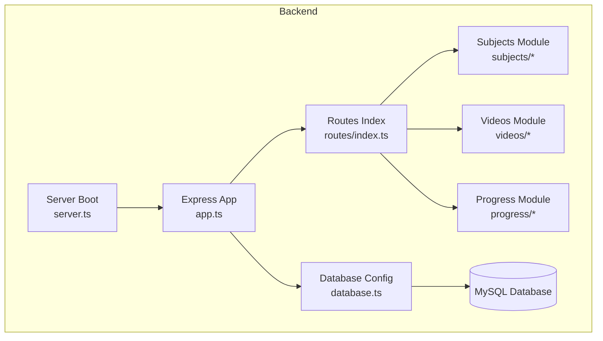
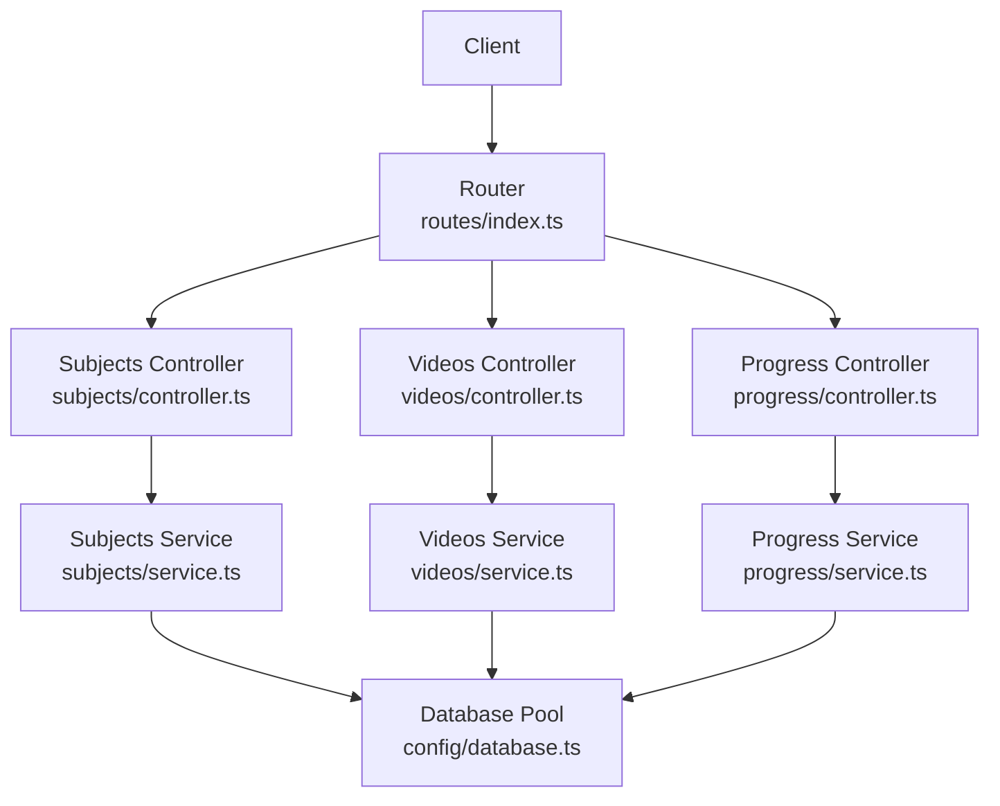
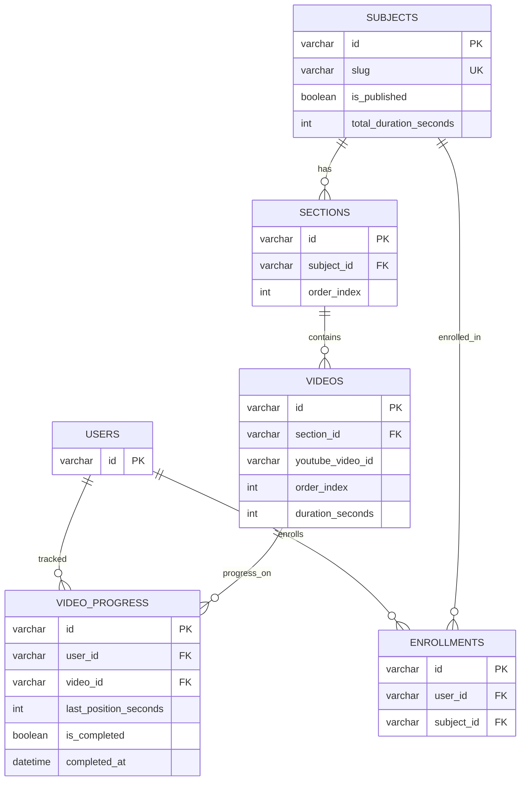
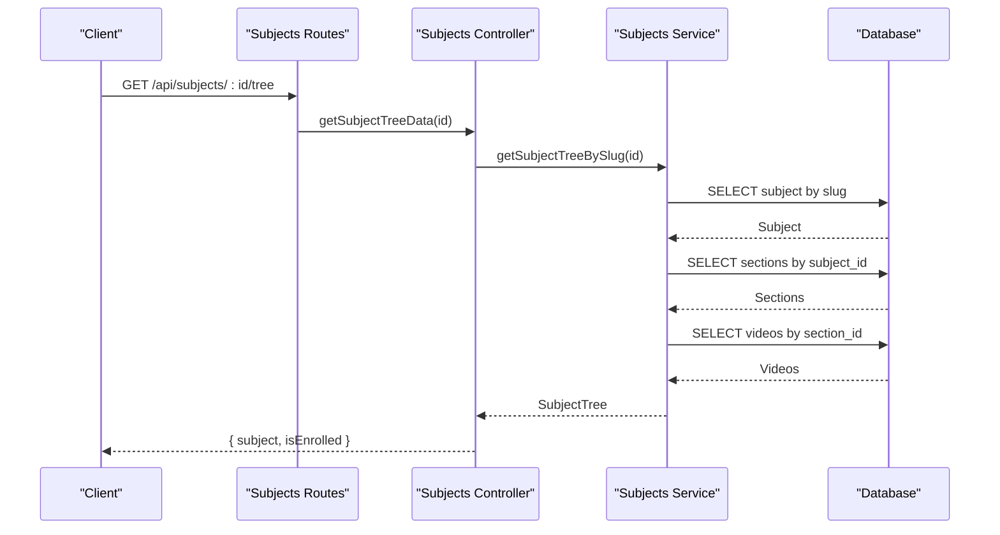
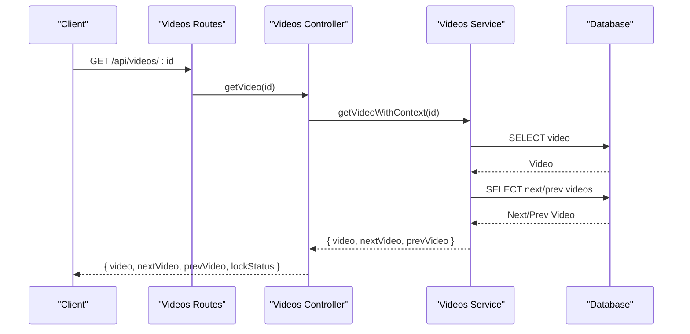
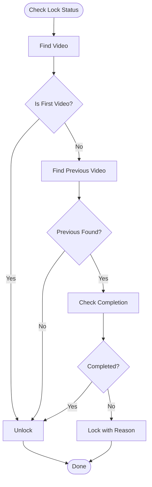
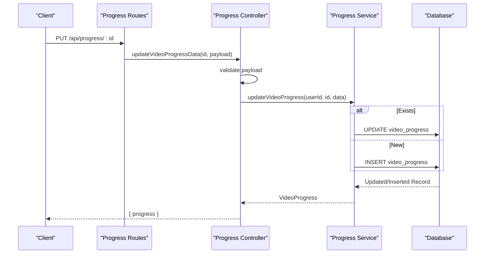
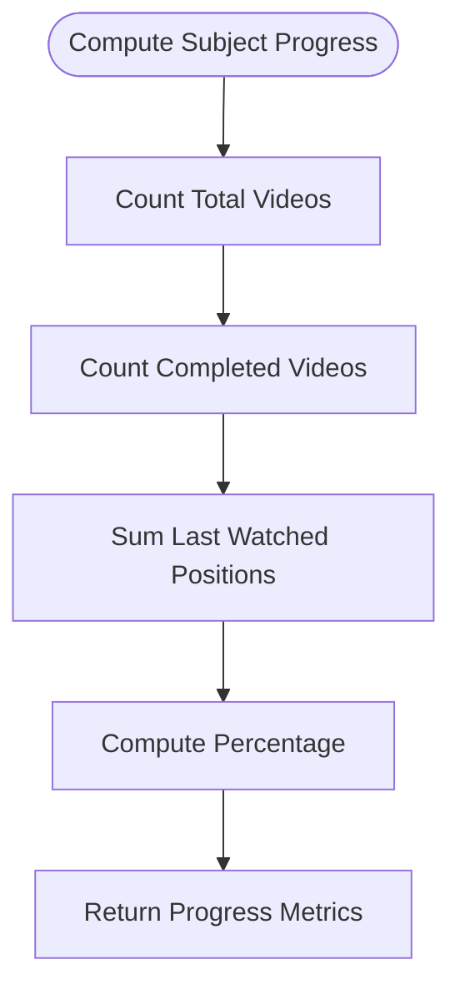
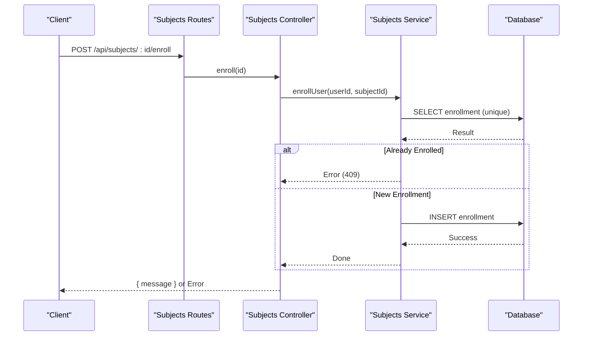
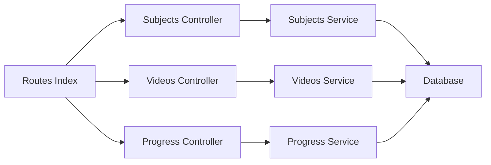

# Course Management System

<cite>
**Referenced Files in This Document**
- [app.ts](file://backend/src/app.ts)
- [server.ts](file://backend/src/server.ts)
- [database.ts](file://backend/src/config/database.ts)
- [index.ts](file://backend/src/routes/index.ts)
- [002_create_subjects.sql](file://backend/migrations/002_create_subjects.sql)
- [004_create_videos.sql](file://backend/migrations/004_create_videos.sql)
- [005_create_enrollments.sql](file://backend/migrations/005_create_enrollments.sql)
- [006_create_video_progress.sql](file://backend/migrations/006_create_video_progress.sql)
- [subjects.controller.ts](file://backend/src/modules/subjects/controller.ts)
- [subjects.service.ts](file://backend/src/modules/subjects/service.ts)
- [subjects.routes.ts](file://backend/src/modules/subjects/routes.ts)
- [videos.controller.ts](file://backend/src/modules/videos/controller.ts)
- [videos.service.ts](file://backend/src/modules/videos/service.ts)
- [videos.routes.ts](file://backend/src/modules/videos/routes.ts)
- [progress.controller.ts](file://backend/src/modules/progress/controller.ts)
- [progress.service.ts](file://backend/src/modules/progress/service.ts)
- [validation.ts](file://backend/src/utils/validation.ts)
</cite>

## Table of Contents
1. [Introduction](#introduction)
2. [Project Structure](#project-structure)
3. [Core Components](#core-components)
4. [Architecture Overview](#architecture-overview)
5. [Detailed Component Analysis](#detailed-component-analysis)
6. [Dependency Analysis](#dependency-analysis)
7. [Performance Considerations](#performance-considerations)
8. [Troubleshooting Guide](#troubleshooting-guide)
9. [Conclusion](#conclusion)
10. [Appendices](#appendices)

## Introduction
This document describes the Course Management System with a focus on subject and video content management, course enrollment, learning progress tracking, and user-course relationships. It covers CRUD-like operations for subjects and videos, enrollment workflows, progress monitoring, and completion metrics. It also documents the database schema relationships, API endpoints for course management, and integration patterns with the learning progress system. Examples of course creation, enrollment processes, and progress reporting are included to guide implementation and usage.

## Project Structure
The backend is organized using a modular Express architecture with TypeScript. Modules encapsulate domain-specific concerns (subjects, videos, progress, auth, gamification, AI). Routes are mounted under a central router and served under the /api base path. Database access is centralized via a MySQL connection pool abstraction. Migrations define the canonical schema for subjects, sections, videos, enrollments, and progress tracking.

**Diagram sources**
- [app.ts:1-54](file://backend/src/app.ts#L1-L54)
- [server.ts:1-32](file://backend/src/server.ts#L1-L32)
- [database.ts:1-53](file://backend/src/config/database.ts#L1-L53)
- [index.ts:1-25](file://backend/src/routes/index.ts#L1-L25)

**Section sources**
- [app.ts:1-54](file://backend/src/app.ts#L1-L54)
- [server.ts:1-32](file://backend/src/server.ts#L1-L32)
- [database.ts:1-53](file://backend/src/config/database.ts#L1-L53)
- [index.ts:1-25](file://backend/src/routes/index.ts#L1-L25)

## Core Components
- Database abstraction with connection pooling and transaction support
- Centralized routing with module-based route composition
- Subjects module for listing, retrieving, tree-building, enrollment, and enrollment listing
- Videos module for fetching video context and lock status
- Progress module for per-video and per-subject progress, completion metrics, and last-watched tracking
- Validation utilities for progress updates

Key responsibilities:
- Enforce authentication and optional authentication for public vs private endpoints
- Maintain referential integrity through foreign keys and unique constraints
- Provide structured progress reporting with completion percentages and time metrics

**Section sources**
- [database.ts:1-53](file://backend/src/config/database.ts#L1-L53)
- [index.ts:1-25](file://backend/src/routes/index.ts#L1-L25)
- [subjects.controller.ts:1-69](file://backend/src/modules/subjects/controller.ts#L1-L69)
- [subjects.service.ts:1-118](file://backend/src/modules/subjects/service.ts#L1-L118)
- [videos.controller.ts:1-42](file://backend/src/modules/videos/controller.ts#L1-L42)
- [videos.service.ts:1-160](file://backend/src/modules/videos/service.ts#L1-L160)
- [progress.controller.ts:1-66](file://backend/src/modules/progress/controller.ts#L1-L66)
- [progress.service.ts:1-163](file://backend/src/modules/progress/service.ts#L1-L163)

## Architecture Overview
The system follows a layered architecture:
- Presentation: Express routes and controllers
- Domain: Services implementing business logic
- Persistence: MySQL via a shared database client

**Diagram sources**
- [index.ts:1-25](file://backend/src/routes/index.ts#L1-L25)
- [subjects.controller.ts:1-69](file://backend/src/modules/subjects/controller.ts#L1-L69)
- [videos.controller.ts:1-42](file://backend/src/modules/videos/controller.ts#L1-L42)
- [progress.controller.ts:1-66](file://backend/src/modules/progress/controller.ts#L1-L66)
- [subjects.service.ts:1-118](file://backend/src/modules/subjects/service.ts#L1-L118)
- [videos.service.ts:1-160](file://backend/src/modules/videos/service.ts#L1-L160)
- [progress.service.ts:1-163](file://backend/src/modules/progress/service.ts#L1-L163)
- [database.ts:1-53](file://backend/src/config/database.ts#L1-L53)

## Detailed Component Analysis

### Database Schema and Relationships
The schema supports hierarchical content organization and progress tracking:
- subjects: course metadata and publication state
- sections: ordered chapters within a subject
- videos: lessons with YouTube integration and ordering
- enrollments: user-course memberships
- video_progress: per-user progress per video

**Diagram sources**
- [002_create_subjects.sql:1-14](file://backend/migrations/002_create_subjects.sql#L1-L14)
- [004_create_videos.sql:1-15](file://backend/migrations/004_create_videos.sql#L1-L15)
- [005_create_enrollments.sql:1-12](file://backend/migrations/005_create_enrollments.sql#L1-L12)
- [006_create_video_progress.sql:1-16](file://backend/migrations/006_create_video_progress.sql#L1-L16)

**Section sources**
- [002_create_subjects.sql:1-14](file://backend/migrations/002_create_subjects.sql#L1-L14)
- [004_create_videos.sql:1-15](file://backend/migrations/004_create_videos.sql#L1-L15)
- [005_create_enrollments.sql:1-12](file://backend/migrations/005_create_enrollments.sql#L1-L12)
- [006_create_video_progress.sql:1-16](file://backend/migrations/006_create_video_progress.sql#L1-L16)

### Subjects Management
Subjects represent courses. The module provides:
- Listing published subjects
- Retrieving a subject by slug
- Building a subject tree (sections and videos)
- Enrollment actions and enrollment listing for authenticated users

**Diagram sources**
- [subjects.routes.ts:1-20](file://backend/src/modules/subjects/routes.ts#L1-L20)
- [subjects.controller.ts:30-46](file://backend/src/modules/subjects/controller.ts#L30-L46)
- [subjects.service.ts:84-88](file://backend/src/modules/subjects/service.ts#L84-L88)
- [subjects.service.ts:55-82](file://backend/src/modules/subjects/service.ts#L55-L82)

Operational highlights:
- Tree building aggregates sections and videos with ordered indexing
- Enrollment checks are optional for non-authenticated users
- Enrollment prevents duplicates via a unique constraint

**Section sources**
- [subjects.controller.ts:13-69](file://backend/src/modules/subjects/controller.ts#L13-L69)
- [subjects.service.ts:37-88](file://backend/src/modules/subjects/service.ts#L37-L88)
- [subjects.service.ts:90-118](file://backend/src/modules/subjects/service.ts#L90-L118)
- [005_create_enrollments.sql:8](file://backend/migrations/005_create_enrollments.sql#L8)

### Videos Management and Locking
Videos expose contextual navigation and lock status:
- Fetch video with next/previous video context
- Check lock status based on prerequisite completion

**Diagram sources**
- [videos.routes.ts:1-11](file://backend/src/modules/videos/routes.ts#L1-L11)
- [videos.controller.ts:6-29](file://backend/src/modules/videos/controller.ts#L6-L29)
- [videos.service.ts:24-95](file://backend/src/modules/videos/service.ts#L24-L95)

Locking logic:
- First video in a course is always unlocked
- Subsequent videos require the previous video in course order to be completed
- Lock status includes a reason message for UI guidance

**Diagram sources**
- [videos.service.ts:97-159](file://backend/src/modules/videos/service.ts#L97-L159)

**Section sources**
- [videos.controller.ts:1-42](file://backend/src/modules/videos/controller.ts#L1-L42)
- [videos.service.ts:1-160](file://backend/src/modules/videos/service.ts#L1-L160)

### Learning Progress Tracking
Progress tracking supports:
- Per-video progress retrieval and updates
- Per-subject progress computation (counts, percentage, total time)
- Last watched video identification
- Aggregated progress across all enrolled subjects

**Diagram sources**
- [progress.controller.ts:24-39](file://backend/src/modules/progress/controller.ts#L24-L39)
- [progress.service.ts:30-85](file://backend/src/modules/progress/service.ts#L30-L85)

Per-subject progress computation:
- Count total videos in a subject
- Count completed videos for a user
- Compute completion percentage
- Sum last watched positions for total time spent

**Diagram sources**
- [progress.service.ts:87-130](file://backend/src/modules/progress/service.ts#L87-L130)

**Section sources**
- [progress.controller.ts:1-66](file://backend/src/modules/progress/controller.ts#L1-L66)
- [progress.service.ts:1-163](file://backend/src/modules/progress/service.ts#L1-L163)
- [validation.ts](file://backend/src/utils/validation.ts)

### Enrollment System
Enrollment ties users to subjects:
- Prevents duplicate enrollments via unique constraint
- Supports listing enrolled subjects for a user
- Exposes enrollment endpoint guarded by authentication middleware

**Diagram sources**
- [subjects.routes.ts:17](file://backend/src/modules/subjects/routes.ts#L17)
- [subjects.controller.ts:48-58](file://backend/src/modules/subjects/controller.ts#L48-L58)
- [subjects.service.ts:98-108](file://backend/src/modules/subjects/service.ts#L98-L108)
- [005_create_enrollments.sql:8](file://backend/migrations/005_create_enrollments.sql#L8)

**Section sources**
- [subjects.controller.ts:48-69](file://backend/src/modules/subjects/controller.ts#L48-L69)
- [subjects.service.ts:90-118](file://backend/src/modules/subjects/service.ts#L90-L118)
- [005_create_enrollments.sql:1-12](file://backend/migrations/005_create_enrollments.sql#L1-L12)

## Dependency Analysis
Module dependencies and external integrations:
- Controllers depend on Services for business logic
- Services depend on Database for persistence
- Routes depend on Authentication middleware
- Validation is applied in controllers before invoking services

**Diagram sources**
- [index.ts:1-25](file://backend/src/routes/index.ts#L1-L25)
- [subjects.controller.ts:1-12](file://backend/src/modules/subjects/controller.ts#L1-L12)
- [videos.controller.ts:1-5](file://backend/src/modules/videos/controller.ts#L1-L5)
- [progress.controller.ts:1-11](file://backend/src/modules/progress/controller.ts#L1-L11)
- [subjects.service.ts:1](file://backend/src/modules/subjects/service.ts#L1)
- [videos.service.ts:1](file://backend/src/modules/videos/service.ts#L1)
- [progress.service.ts:1](file://backend/src/modules/progress/service.ts#L1)
- [database.ts:1-53](file://backend/src/config/database.ts#L1-L53)

**Section sources**
- [index.ts:1-25](file://backend/src/routes/index.ts#L1-L25)
- [subjects.controller.ts:1-12](file://backend/src/modules/subjects/controller.ts#L1-L12)
- [videos.controller.ts:1-5](file://backend/src/modules/videos/controller.ts#L1-L5)
- [progress.controller.ts:1-11](file://backend/src/modules/progress/controller.ts#L1-L11)
- [subjects.service.ts:1](file://backend/src/modules/subjects/service.ts#L1)
- [videos.service.ts:1](file://backend/src/modules/videos/service.ts#L1)
- [progress.service.ts:1](file://backend/src/modules/progress/service.ts#L1)
- [database.ts:1-53](file://backend/src/config/database.ts#L1-L53)

## Performance Considerations
- Connection pooling: The database client uses a configurable pool with keep-alive enabled to reduce connection overhead.
- Transaction boundaries: Use transactions for multi-statement operations to maintain consistency.
- Indexes: Strategic indexes on slug, published flag, foreign keys, and unique combinations improve query performance.
- Pagination and limits: For large datasets, consider adding pagination to list endpoints.
- Caching: Consider caching frequently accessed metadata (e.g., subject trees) to reduce repeated joins.

[No sources needed since this section provides general guidance]

## Troubleshooting Guide
Common issues and resolutions:
- Authentication errors: Ensure requests include valid credentials for protected endpoints.
- Duplicate enrollment: Attempting to enroll twice yields a conflict; handle gracefully in clients.
- Video lock status: If locked, prompt users to complete prerequisites; verify previous video completion.
- Progress updates: Validate payload against the progress update schema before sending requests.
- Database connectivity: Verify environment variables for host, port, user, password, and database name.

**Section sources**
- [subjects.controller.ts:48-58](file://backend/src/modules/subjects/controller.ts#L48-L58)
- [videos.controller.ts:31-41](file://backend/src/modules/videos/controller.ts#L31-L41)
- [progress.controller.ts:30-39](file://backend/src/modules/progress/controller.ts#L30-L39)
- [validation.ts](file://backend/src/utils/validation.ts)

## Conclusion
The Course Management System provides a robust foundation for managing subjects, sections, and videos, enabling secure enrollment and comprehensive progress tracking. Its modular design, explicit database schema, and clear API boundaries facilitate maintainability and extensibility. Integrations with the progress system ensure accurate completion metrics and contextual navigation locks, enhancing the learning experience.

[No sources needed since this section summarizes without analyzing specific files]

## Appendices

### API Endpoints Summary
- Subjects
  - GET /api/subjects/ - List published subjects
  - GET /api/subjects/enrolled - List enrolled subjects for the authenticated user
  - GET /api/subjects/:slug - Get subject by slug
  - GET /api/subjects/:id/tree - Get subject tree (sections and videos); optional auth
  - POST /api/subjects/:id/enroll - Enroll in a subject (authenticated)
- Videos
  - GET /api/videos/:id - Get video with context; optional auth
  - GET /api/videos/:id/lock-status - Check lock status (authenticated)
- Progress
  - GET /api/progress/:id - Get per-video progress (authenticated)
  - PUT /api/progress/:id - Update per-video progress (authenticated)
  - GET /api/progress/subject/:id - Get per-subject progress and last watched (authenticated)
  - GET /api/progress/ - Get all enrolled subjects’ progress (authenticated)

**Section sources**
- [subjects.routes.ts:13-17](file://backend/src/modules/subjects/routes.ts#L13-L17)
- [videos.routes.ts:7-8](file://backend/src/modules/videos/routes.ts#L7-L8)
- [progress.controller.ts:12-65](file://backend/src/modules/progress/controller.ts#L12-L65)

### Example Workflows

- Course creation and enrollment
  - Create subject and sections via administrative flows (outside the scope of this document)
  - Publish subject so it appears in listings
  - User enrolls using the enrollment endpoint; system prevents duplicates
  - User accesses subject tree to view sections and videos

- Progress reporting
  - User plays a video and periodically updates progress
  - System computes per-subject progress including completion percentage and total time spent
  - UI can display last watched video and resume playback

[No sources needed since this section provides general guidance]