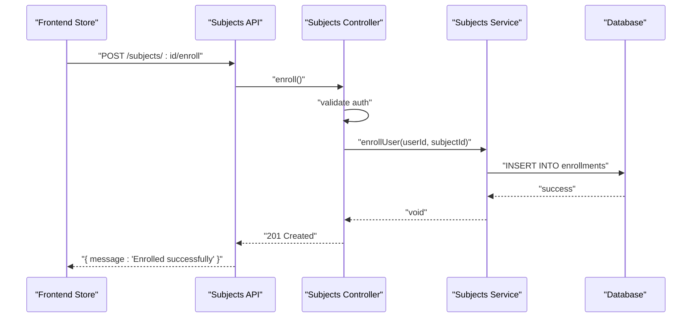
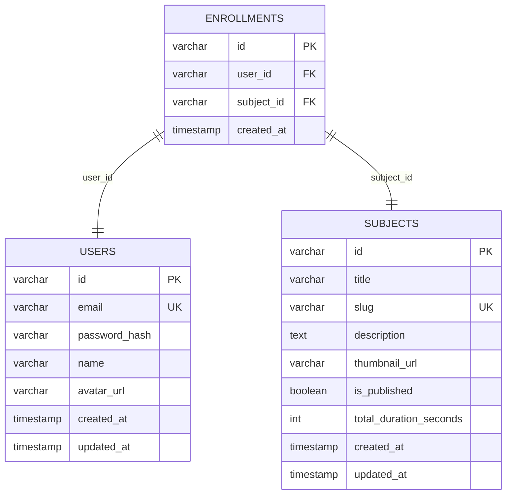
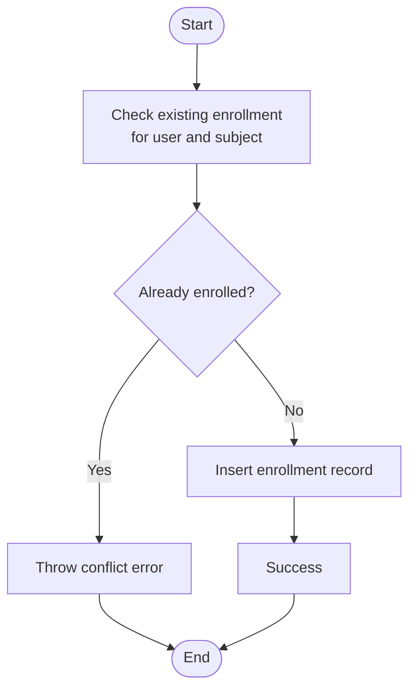
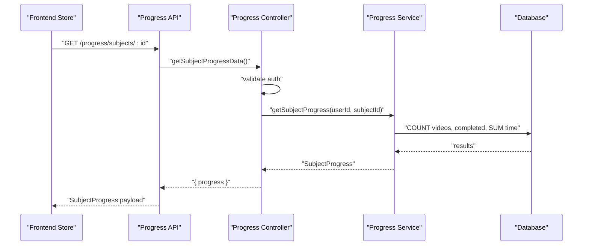
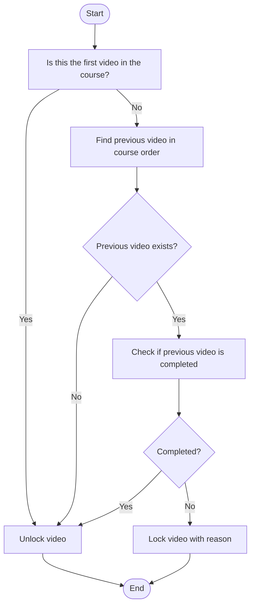
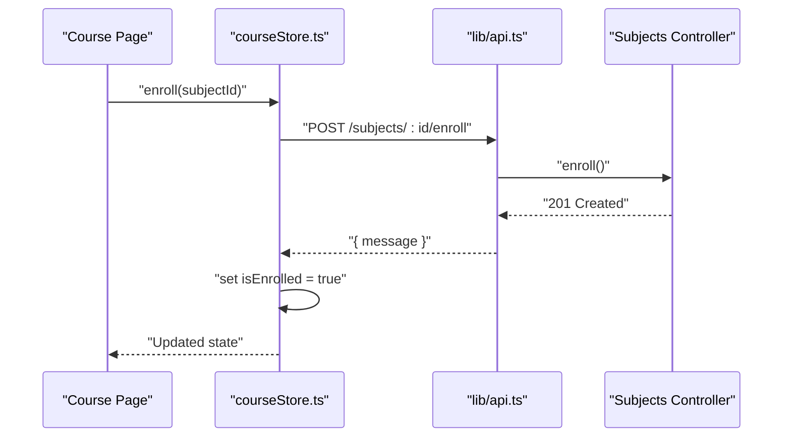
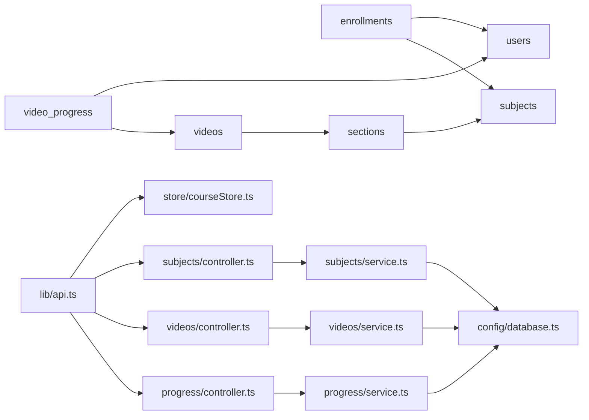

# Enrollment System

<cite>
**Referenced Files in This Document**
- [005_create_enrollments.sql](file://backend/migrations/005_create_enrollments.sql)
- [006_create_video_progress.sql](file://backend/migrations/006_create_video_progress.sql)
- [001_create_users.sql](file://backend/migrations/001_create_users.sql)
- [002_create_subjects.sql](file://backend/migrations/002_create_subjects.sql)
- [003_create_sections.sql](file://backend/migrations/003_create_sections.sql)
- [004_create_videos.sql](file://backend/migrations/004_create_videos.sql)
- [database.ts](file://backend/src/config/database.ts)
- [service.ts](file://backend/src/modules/subjects/service.ts)
- [controller.ts](file://backend/src/modules/subjects/controller.ts)
- [service.ts](file://backend/src/modules/progress/service.ts)
- [controller.ts](file://backend/src/modules/progress/controller.ts)
- [service.ts](file://backend/src/modules/videos/service.ts)
- [controller.ts](file://backend/src/modules/videos/controller.ts)
- [api.ts](file://frontend/app/lib/api.ts)
- [courseStore.ts](file://frontend/app/store/courseStore.ts)
</cite>

## Table of Contents
1. [Introduction](#introduction)
2. [Project Structure](#project-structure)
3. [Core Components](#core-components)
4. [Architecture Overview](#architecture-overview)
5. [Detailed Component Analysis](#detailed-component-analysis)
6. [Dependency Analysis](#dependency-analysis)
7. [Performance Considerations](#performance-considerations)
8. [Troubleshooting Guide](#troubleshooting-guide)
9. [Conclusion](#conclusion)
10. [Appendices](#appendices)

## Introduction
This document describes the Enrollment System within the Learning Management Platform. It covers user-course enrollment workflows, validation, history tracking, and the enrollment database schema with foreign key relationships. It also explains how enrollments integrate with the progress tracking system and influence course access permissions.

## Project Structure
The Enrollment System spans backend modules and frontend stores:
- Backend database schema includes users, subjects, sections, videos, enrollments, and video progress tables.
- Backend modules implement enrollment creation, validation, and retrieval via dedicated services and controllers.
- Frontend integrates with the backend APIs to support enrollment actions and course navigation.

```mermaid
graph TB
subgraph "Database Schema"
U["users"]
S["subjects"]
Sec["sections"]
V["videos"]
Enr["enrollments"]
VP["video_progress"]
end
subgraph "Backend Modules"
SubSvc["subjects/service.ts"]
SubCtrl["subjects/controller.ts"]
ProgSvc["progress/service.ts"]
ProgCtrl["progress/controller.ts"]
VidSvc["videos/service.ts"]
VidCtrl["videos/controller.ts"]
DB["config/database.ts"]
end
subgraph "Frontend"
FE_API["lib/api.ts"]
FE_Store["store/courseStore.ts"]
end
U <- --> Enr
S <- --> Enr
S <- --> Sec
Sec <- --> V
U <- --> VP
V <- --> VP
FE_API --> SubCtrl
FE_API --> VidCtrl
FE_API --> ProgCtrl
FE_Store --> FE_API
SubCtrl --> SubSvc
VidCtrl --> VidSvc
ProgCtrl --> ProgSvc
SubSvc --> DB
VidSvc --> DB
ProgSvc --> DB
```

**Diagram sources**
- [005_create_enrollments.sql:1-12](file://backend/migrations/005_create_enrollments.sql#L1-L12)
- [006_create_video_progress.sql:1-16](file://backend/migrations/006_create_video_progress.sql#L1-L16)
- [001_create_users.sql:1-11](file://backend/migrations/001_create_users.sql#L1-L11)
- [002_create_subjects.sql:1-14](file://backend/migrations/002_create_subjects.sql#L1-L14)
- [003_create_sections.sql:1-11](file://backend/migrations/003_create_sections.sql#L1-L11)
- [004_create_videos.sql:1-15](file://backend/migrations/004_create_videos.sql#L1-L15)
- [database.ts:1-53](file://backend/src/config/database.ts#L1-L53)
- [service.ts:1-118](file://backend/src/modules/subjects/service.ts#L1-L118)
- [controller.ts:1-69](file://backend/src/modules/subjects/controller.ts#L1-L69)
- [service.ts:1-163](file://backend/src/modules/progress/service.ts#L1-L163)
- [controller.ts:1-66](file://backend/src/modules/progress/controller.ts#L1-L66)
- [service.ts:1-160](file://backend/src/modules/videos/service.ts#L1-L160)
- [controller.ts:1-42](file://backend/src/modules/videos/controller.ts#L1-L42)
- [api.ts:1-80](file://frontend/app/lib/api.ts#L1-L80)
- [courseStore.ts:1-121](file://frontend/app/store/courseStore.ts#L1-L121)

**Section sources**
- [005_create_enrollments.sql:1-12](file://backend/migrations/005_create_enrollments.sql#L1-L12)
- [006_create_video_progress.sql:1-16](file://backend/migrations/006_create_video_progress.sql#L1-L16)
- [001_create_users.sql:1-11](file://backend/migrations/001_create_users.sql#L1-L11)
- [002_create_subjects.sql:1-14](file://backend/migrations/002_create_subjects.sql#L1-L14)
- [003_create_sections.sql:1-11](file://backend/migrations/003_create_sections.sql#L1-L11)
- [004_create_videos.sql:1-15](file://backend/migrations/004_create_videos.sql#L1-L15)
- [database.ts:1-53](file://backend/src/config/database.ts#L1-L53)
- [service.ts:1-118](file://backend/src/modules/subjects/service.ts#L1-L118)
- [controller.ts:1-69](file://backend/src/modules/subjects/controller.ts#L1-L69)
- [service.ts:1-163](file://backend/src/modules/progress/service.ts#L1-L163)
- [controller.ts:1-66](file://backend/src/modules/progress/controller.ts#L1-L66)
- [service.ts:1-160](file://backend/src/modules/videos/service.ts#L1-L160)
- [controller.ts:1-42](file://backend/src/modules/videos/controller.ts#L1-L42)
- [api.ts:1-80](file://frontend/app/lib/api.ts#L1-L80)
- [courseStore.ts:1-121](file://frontend/app/store/courseStore.ts#L1-L121)

## Core Components
- Enrollment database table with foreign keys to users and subjects, unique constraint on user-subject pair, and indexes for efficient lookups.
- Subjects module: enrollment creation, validation, and retrieval of user enrollments.
- Progress module: per-video progress storage and subject-level progress computation.
- Videos module: lock/unlock logic based on completion of prerequisite videos.
- Frontend integration: API bindings and store actions for enrollment and course navigation.

**Section sources**
- [005_create_enrollments.sql:1-12](file://backend/migrations/005_create_enrollments.sql#L1-L12)
- [service.ts:90-118](file://backend/src/modules/subjects/service.ts#L90-L118)
- [service.ts:20-163](file://backend/src/modules/progress/service.ts#L20-L163)
- [service.ts:97-160](file://backend/src/modules/videos/service.ts#L97-L160)
- [api.ts:18-36](file://frontend/app/lib/api.ts#L18-L36)
- [courseStore.ts:106-117](file://frontend/app/store/courseStore.ts#L106-L117)

## Architecture Overview
The Enrollment System orchestrates user access to course content through three primary flows:
- Enrollment creation: authenticated users enroll in published subjects.
- Access control: videos are locked until prerequisites are completed; lock status depends on prior video completion.
- Progress tracking: per-video progress updates inform lock status and contribute to subject-level analytics.



**Diagram sources**
- [controller.ts:48-58](file://backend/src/modules/subjects/controller.ts#L48-L58)
- [service.ts:98-108](file://backend/src/modules/subjects/service.ts#L98-L108)
- [005_create_enrollments.sql:1-12](file://backend/migrations/005_create_enrollments.sql#L1-L12)
- [api.ts](file://frontend/app/lib/api.ts#L26)
- [courseStore.ts:106-117](file://frontend/app/store/courseStore.ts#L106-L117)

## Detailed Component Analysis

### Enrollment Database Schema
The enrollments table defines:
- Primary key id with UUID default.
- user_id and subject_id as NOT NULL.
- Foreign keys to users and subjects with ON DELETE CASCADE.
- Unique constraint on (user_id, subject_id) to prevent duplicate enrollments.
- Indexes on user_id and subject_id for fast lookups.
- created_at timestamp for enrollment history.



**Diagram sources**
- [005_create_enrollments.sql:1-12](file://backend/migrations/005_create_enrollments.sql#L1-L12)
- [001_create_users.sql:1-11](file://backend/migrations/001_create_users.sql#L1-L11)
- [002_create_subjects.sql:1-14](file://backend/migrations/002_create_subjects.sql#L1-L14)

**Section sources**
- [005_create_enrollments.sql:1-12](file://backend/migrations/005_create_enrollments.sql#L1-L12)
- [001_create_users.sql:1-11](file://backend/migrations/001_create_users.sql#L1-L11)
- [002_create_subjects.sql:1-14](file://backend/migrations/002_create_subjects.sql#L1-L14)

### Enrollment Validation and Creation
- Validation: The service checks for existing enrollment before inserting a new record and throws a conflict error if already enrolled.
- Creation: Inserts a new enrollment row linking a user to a subject.
- Retrieval: Provides enrolled subjects for a user and checks enrollment status for a given subject.



**Diagram sources**
- [service.ts:98-108](file://backend/src/modules/subjects/service.ts#L98-L108)

**Section sources**
- [service.ts:90-118](file://backend/src/modules/subjects/service.ts#L90-L118)

### Enrollment History Tracking
- The enrollments table includes created_at timestamps, enabling ordering and history queries.
- The subjects service retrieves enrolled subjects ordered by enrollment date.

**Section sources**
- [005_create_enrollments.sql](file://backend/migrations/005_create_enrollments.sql#L5)
- [service.ts:110-117](file://backend/src/modules/subjects/service.ts#L110-L117)

### Integration with Progress Tracking
- Progress records are stored per user and video.
- Subject-level progress aggregates total videos, completed videos, and total time spent for enrolled subjects.
- All enrolled subjects’ progress can be fetched for a user.



**Diagram sources**
- [controller.ts:41-55](file://backend/src/modules/progress/controller.ts#L41-L55)
- [service.ts:87-130](file://backend/src/modules/progress/service.ts#L87-L130)
- [api.ts:48-52](file://frontend/app/lib/api.ts#L48-L52)

**Section sources**
- [006_create_video_progress.sql:1-16](file://backend/migrations/006_create_video_progress.sql#L1-L16)
- [service.ts:87-130](file://backend/src/modules/progress/service.ts#L87-L130)
- [controller.ts:41-55](file://backend/src/modules/progress/controller.ts#L41-L55)

### Course Access Permissions and Lock Status
- Videos are locked unless prerequisites are met.
- First video in a course is always unlocked.
- A video is locked if the immediately preceding video in course order is not completed by the user.
- Lock status is computed using video_progress entries and section/video ordering.



**Diagram sources**
- [service.ts:97-160](file://backend/src/modules/videos/service.ts#L97-L160)

**Section sources**
- [service.ts:97-160](file://backend/src/modules/videos/service.ts#L97-L160)

### Frontend Integration
- Frontend exposes API bindings for enrollment and course navigation.
- The course store coordinates fetching subjects, course trees, videos, and performing enroll actions.
- On successful enrollment, the store marks the user as enrolled and updates UI state.



**Diagram sources**
- [api.ts](file://frontend/app/lib/api.ts#L26)
- [controller.ts:48-58](file://backend/src/modules/subjects/controller.ts#L48-L58)
- [courseStore.ts:106-117](file://frontend/app/store/courseStore.ts#L106-L117)

**Section sources**
- [api.ts:18-36](file://frontend/app/lib/api.ts#L18-L36)
- [courseStore.ts:106-117](file://frontend/app/store/courseStore.ts#L106-L117)

## Dependency Analysis
- Database dependencies:
  - enrollments depends on users and subjects via foreign keys.
  - video_progress depends on users and videos via foreign keys.
  - sections and videos depend on subjects via foreign keys.
- Module dependencies:
  - Subjects controller depends on Subjects service.
  - Videos controller depends on Videos service.
  - Progress controller depends on Progress service.
  - Services depend on database abstraction for SQL operations.
- Frontend dependencies:
  - courseStore uses subjectsApi and videosApi to interact with backend endpoints.



**Diagram sources**
- [005_create_enrollments.sql:1-12](file://backend/migrations/005_create_enrollments.sql#L1-L12)
- [006_create_video_progress.sql:1-16](file://backend/migrations/006_create_video_progress.sql#L1-L16)
- [003_create_sections.sql:1-11](file://backend/migrations/003_create_sections.sql#L1-L11)
- [004_create_videos.sql:1-15](file://backend/migrations/004_create_videos.sql#L1-L15)
- [database.ts:1-53](file://backend/src/config/database.ts#L1-L53)
- [service.ts:1-118](file://backend/src/modules/subjects/service.ts#L1-L118)
- [service.ts:1-160](file://backend/src/modules/videos/service.ts#L1-L160)
- [service.ts:1-163](file://backend/src/modules/progress/service.ts#L1-L163)
- [api.ts:1-80](file://frontend/app/lib/api.ts#L1-L80)
- [courseStore.ts:1-121](file://frontend/app/store/courseStore.ts#L1-L121)

**Section sources**
- [005_create_enrollments.sql:1-12](file://backend/migrations/005_create_enrollments.sql#L1-L12)
- [006_create_video_progress.sql:1-16](file://backend/migrations/006_create_video_progress.sql#L1-L16)
- [003_create_sections.sql:1-11](file://backend/migrations/003_create_sections.sql#L1-L11)
- [004_create_videos.sql:1-15](file://backend/migrations/004_create_videos.sql#L1-L15)
- [database.ts:1-53](file://backend/src/config/database.ts#L1-L53)
- [service.ts:1-118](file://backend/src/modules/subjects/service.ts#L1-L118)
- [service.ts:1-160](file://backend/src/modules/videos/service.ts#L1-L160)
- [service.ts:1-163](file://backend/src/modules/progress/service.ts#L1-L163)
- [api.ts:1-80](file://frontend/app/lib/api.ts#L1-L80)
- [courseStore.ts:1-121](file://frontend/app/store/courseStore.ts#L1-L121)

## Performance Considerations
- Indexes on enrollments (user_id, subject_id) and video_progress (user_id, video_id) support frequent lookups during enrollment checks and progress computations.
- Unique constraints prevent redundant rows and simplify existence checks.
- Aggregation queries for subject progress join sections and videos; ensure appropriate indexing on section and video order fields to minimize cost.
- Transaction boundaries can be used for enrollment insertions if stronger atomicity is required.

[No sources needed since this section provides general guidance]

## Troubleshooting Guide
- Enrollment conflicts: Attempting to enroll twice in the same subject triggers a conflict error. Verify user-subject uniqueness before enrolling.
- Authentication errors: Enrollment and progress endpoints require authenticated requests; ensure tokens are included.
- Lock status issues: If a video remains locked, confirm that the prerequisite video is marked as completed in video_progress.
- Missing data: If subject or video is not found, lock status defaults to locked with a reason; verify IDs and relationships.

**Section sources**
- [service.ts:98-108](file://backend/src/modules/subjects/service.ts#L98-L108)
- [controller.ts:12-22](file://backend/src/modules/progress/controller.ts#L12-L22)
- [service.ts:97-160](file://backend/src/modules/videos/service.ts#L97-L160)

## Conclusion
The Enrollment System provides robust mechanisms for user-course enrollment, validation, and history tracking. It integrates tightly with progress tracking to compute subject-level metrics and enforces course access permissions through a lock-status mechanism based on prerequisite completion. The frontend store and API bindings streamline user actions, while the database schema ensures referential integrity and efficient lookups.

[No sources needed since this section summarizes without analyzing specific files]

## Appendices

### API Examples and Workflows
- Enroll in a course:
  - Endpoint: POST /subjects/:id/enroll
  - Frontend action: courseStore.enroll(subjectId)
  - Behavior: Creates an enrollment record if none exists; otherwise returns a conflict error.
- Retrieve enrolled subjects:
  - Endpoint: GET /subjects/enrolled
  - Behavior: Returns published subjects the user is enrolled in, ordered by enrollment date.
- Check video lock status:
  - Endpoint: GET /videos/:id/lock-status
  - Behavior: Returns whether a video is locked and the reason; unlocks if the previous video is completed.
- Get subject progress:
  - Endpoint: GET /progress/subjects/:id
  - Behavior: Computes total videos, completed videos, progress percentage, and total time spent for enrolled subjects.

**Section sources**
- [controller.ts:48-68](file://backend/src/modules/subjects/controller.ts#L48-L68)
- [service.ts:110-118](file://backend/src/modules/subjects/service.ts#L110-L118)
- [controller.ts:31-41](file://backend/src/modules/videos/controller.ts#L31-L41)
- [service.ts:97-160](file://backend/src/modules/videos/service.ts#L97-L160)
- [controller.ts:41-55](file://backend/src/modules/progress/controller.ts#L41-L55)
- [service.ts:87-130](file://backend/src/modules/progress/service.ts#L87-L130)
- [api.ts](file://frontend/app/lib/api.ts#L26)
- [api.ts](file://frontend/app/lib/api.ts#L35)
- [api.ts:48-52](file://frontend/app/lib/api.ts#L48-L52)
- [courseStore.ts:106-117](file://frontend/app/store/courseStore.ts#L106-L117)