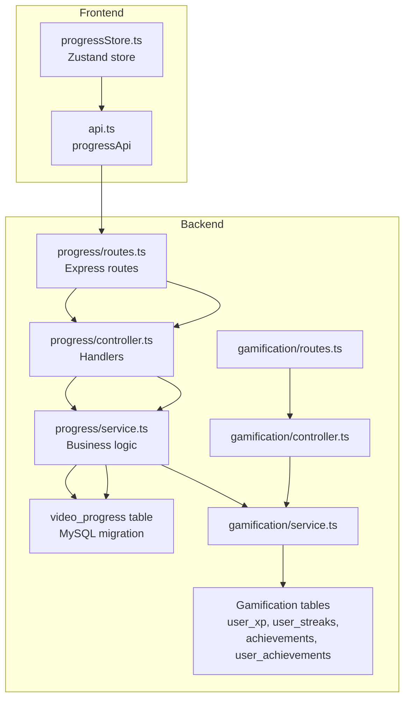
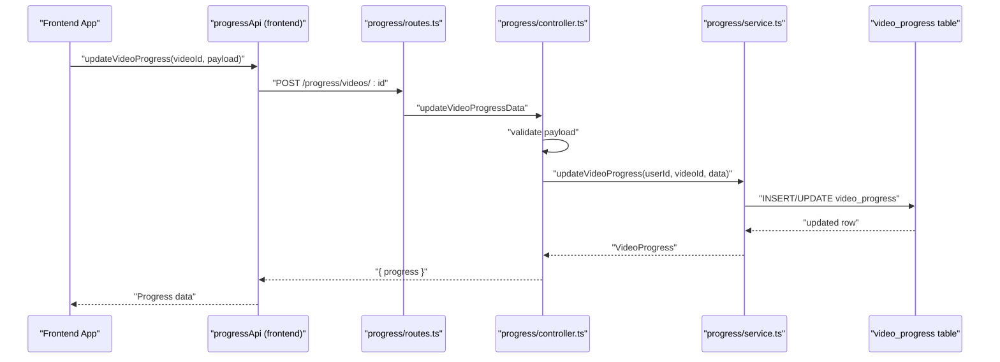
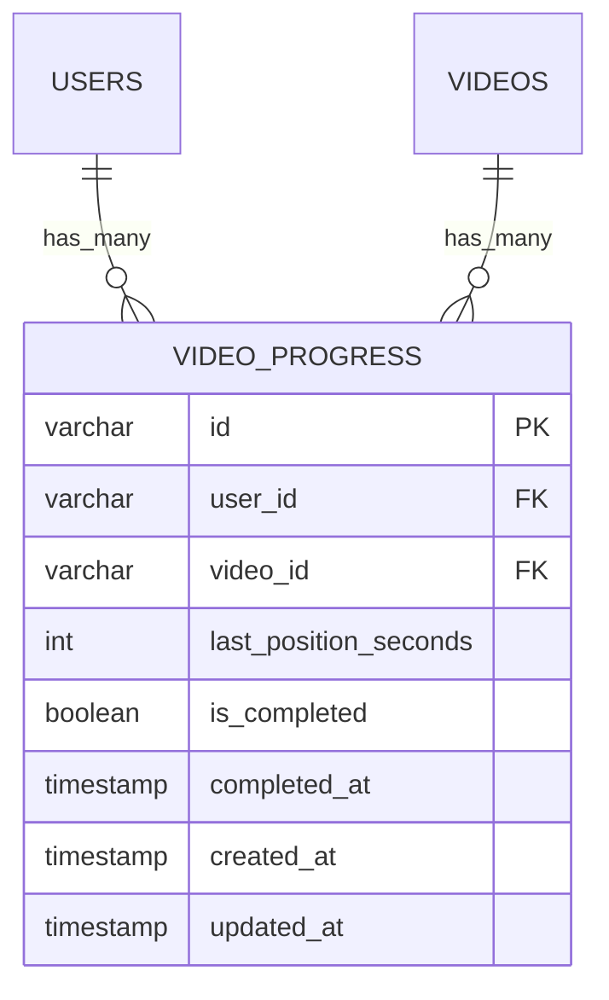
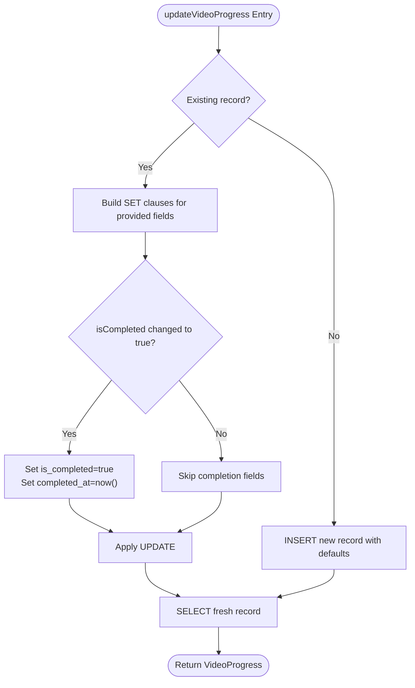
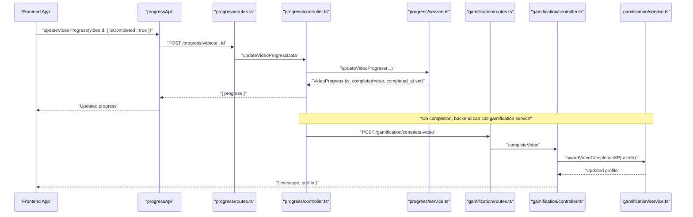
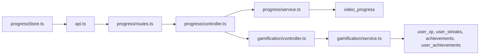

# Progress Tracking

<cite>
**Referenced Files in This Document**
- [controller.ts](file://backend/src/modules/progress/controller.ts)
- [service.ts](file://backend/src/modules/progress/service.ts)
- [routes.ts](file://backend/src/modules/progress/routes.ts)
- [validation.ts](file://backend/src/utils/validation.ts)
- [006_create_video_progress.sql](file://backend/migrations/006_create_video_progress.sql)
- [progressStore.ts](file://frontend/app/store/progressStore.ts)
- [api.ts](file://frontend/app/lib/api.ts)
- [service.ts](file://backend/src/modules/gamification/service.ts)
- [controller.ts](file://backend/src/modules/gamification/controller.ts)
- [routes.ts](file://backend/src/modules/gamification/routes.ts)
- [008_create_gamification.sql](file://backend/migrations/008_create_gamification.sql)
</cite>

## Table of Contents
1. [Introduction](#introduction)
2. [Project Structure](#project-structure)
3. [Core Components](#core-components)
4. [Architecture Overview](#architecture-overview)
5. [Detailed Component Analysis](#detailed-component-analysis)
6. [Dependency Analysis](#dependency-analysis)
7. [Performance Considerations](#performance-considerations)
8. [Troubleshooting Guide](#troubleshooting-guide)
9. [Conclusion](#conclusion)

## Introduction
This document explains the Progress Tracking system in the Learning Management System. It covers how video completion is tracked, how progress metrics are calculated, and how learning analytics are derived. It also documents the progress database schema, completion timestamp recording, progress percentage calculations, and the integration with the gamification system for XP point accumulation. Finally, it describes how progress data feeds into the learning journey visualization via the frontend store and API.

## Project Structure
The Progress Tracking system spans backend modules for progress CRUD and analytics, frontend state management for progress, and gamification integration for XP rewards. The backend exposes REST endpoints under the progress module, validates incoming data, and persists progress to the database. The frontend consumes these endpoints to maintain local state and drive UI components.

**Diagram sources**
- [routes.ts:1-18](file://backend/src/modules/progress/routes.ts#L1-L18)
- [controller.ts:1-66](file://backend/src/modules/progress/controller.ts#L1-L66)
- [service.ts:1-163](file://backend/src/modules/progress/service.ts#L1-L163)
- [006_create_video_progress.sql:1-16](file://backend/migrations/006_create_video_progress.sql#L1-L16)
- [api.ts:38-52](file://frontend/app/lib/api.ts#L38-L52)
- [progressStore.ts:1-87](file://frontend/app/store/progressStore.ts#L1-L87)
- [routes.ts:1-18](file://backend/src/modules/gamification/routes.ts#L1-L18)
- [controller.ts:1-62](file://backend/src/modules/gamification/controller.ts#L1-L62)
- [service.ts:1-246](file://backend/src/modules/gamification/service.ts#L1-L246)
- [008_create_gamification.sql:1-64](file://backend/migrations/008_create_gamification.sql#L1-L64)

**Section sources**
- [routes.ts:1-18](file://backend/src/modules/progress/routes.ts#L1-L18)
- [controller.ts:1-66](file://backend/src/modules/progress/controller.ts#L1-L66)
- [service.ts:1-163](file://backend/src/modules/progress/service.ts#L1-L163)
- [006_create_video_progress.sql:1-16](file://backend/migrations/006_create_video_progress.sql#L1-L16)
- [api.ts:38-52](file://frontend/app/lib/api.ts#L38-L52)
- [progressStore.ts:1-87](file://frontend/app/store/progressStore.ts#L1-L87)
- [routes.ts:1-18](file://backend/src/modules/gamification/routes.ts#L1-L18)
- [controller.ts:1-62](file://backend/src/modules/gamification/controller.ts#L1-L62)
- [service.ts:1-246](file://backend/src/modules/gamification/service.ts#L1-L246)
- [008_create_gamification.sql:1-64](file://backend/migrations/008_create_gamification.sql#L1-L64)

## Core Components
- Progress Controller: Exposes endpoints to fetch and update per-video progress, compute subject progress, and retrieve last watched video.
- Progress Service: Implements database queries to read/write progress, calculate subject-level metrics, and aggregate time spent.
- Validation: Zod schema ensures only valid progress update payloads are accepted.
- Frontend Store: Maintains client-side progress state and syncs with backend via API.
- Gamification Integration: On video completion, XP is awarded, streaks updated, and achievements rechecked.

Key responsibilities:
- Track last watched position and completion flag per user-video pair.
- Compute subject progress percentage and total time spent.
- Record completion timestamps when a video transitions to completed.
- Trigger XP accumulation and achievement checks upon completion.

**Section sources**
- [controller.ts:12-55](file://backend/src/modules/progress/controller.ts#L12-L55)
- [service.ts:20-130](file://backend/src/modules/progress/service.ts#L20-L130)
- [validation.ts:14-17](file://backend/src/utils/validation.ts#L14-L17)
- [progressStore.ts:36-86](file://frontend/app/store/progressStore.ts#L36-L86)
- [service.ts:239-243](file://backend/src/modules/gamification/service.ts#L239-L243)

## Architecture Overview
The system follows a layered architecture:
- Presentation Layer: Express routes define endpoint contracts.
- Application Layer: Controllers handle authentication, validation, and orchestrate service calls.
- Domain Layer: Services encapsulate business logic for progress retrieval/updates and subject analytics.
- Persistence Layer: MySQL tables store user progress, gamification data, and relationships.

**Diagram sources**
- [api.ts:39-46](file://frontend/app/lib/api.ts#L39-L46)
- [routes.ts:12-15](file://backend/src/modules/progress/routes.ts#L12-L15)
- [controller.ts:24-39](file://backend/src/modules/progress/controller.ts#L24-L39)
- [service.ts:30-85](file://backend/src/modules/progress/service.ts#L30-L85)
- [006_create_video_progress.sql:1-16](file://backend/migrations/006_create_video_progress.sql#L1-L16)

## Detailed Component Analysis

### Database Schema: video_progress
The progress table stores per-user, per-video state and metadata.

- Unique constraint ensures one progress record per user-video pair.
- Indexes on user_id and video_id optimize lookups and joins.
- completed_at is populated when a video transitions to completed.

**Diagram sources**
- [006_create_video_progress.sql:1-16](file://backend/migrations/006_create_video_progress.sql#L1-L16)

**Section sources**
- [006_create_video_progress.sql:1-16](file://backend/migrations/006_create_video_progress.sql#L1-L16)

### Progress Controller
Endpoints:
- GET /progress/videos/:id → returns current progress for a video.
- POST /progress/videos/:id → updates last position and/or completion flag.
- GET /progress/subjects/:id → returns subject progress and last watched video.
- GET /progress/all → returns aggregated progress across enrolled subjects.

Authentication: All endpoints require a valid session token.

Validation: Payload is validated against a Zod schema ensuring numeric lastPositionSeconds and boolean isCompleted are optional.

**Section sources**
- [controller.ts:12-55](file://backend/src/modules/progress/controller.ts#L12-L55)
- [routes.ts:12-15](file://backend/src/modules/progress/routes.ts#L12-L15)
- [validation.ts:14-17](file://backend/src/utils/validation.ts#L14-L17)

### Progress Service
Core functions:
- getVideoProgress(userId, videoId): Fetches existing progress.
- updateVideoProgress(userId, videoId, data):
  - If exists, updates only provided fields.
  - If transitioning to completed, sets completed_at to current timestamp.
  - If not exists, inserts a new record with defaults.
  - Returns the updated record.
- getSubjectProgress(userId, subjectId):
  - Counts total videos in the subject via sections.
  - Counts completed videos for the user.
  - Sums last_position_seconds across videos for time spent.
  - Computes progressPercentage as completed/total (rounded).
- getLastWatchedVideo(userId, subjectId): Returns the most recently updated video’s ID and last position.
- getAllSubjectProgress(userId): Aggregates subject progress for all enrolled subjects.

**Diagram sources**
- [service.ts:30-85](file://backend/src/modules/progress/service.ts#L30-L85)

**Section sources**
- [service.ts:20-130](file://backend/src/modules/progress/service.ts#L20-L130)

### Frontend Integration
- progressStore.ts maintains:
  - videoProgress: Map keyed by videoId.
  - subjectProgress: Map keyed by subjectId.
  - Actions: fetchVideoProgress, updateVideoProgress, fetchSubjectProgress, getProgress, clearError.
- progressApi.ts defines:
  - getVideoProgress(videoId)
  - updateVideoProgress(videoId, payload)
  - getSubjectProgress(subjectId)
  - getAllProgress()

Usage pattern:
- On video playback, periodically call updateVideoProgress with lastPositionSeconds.
- On video end, call with isCompleted: true to mark completion and record completed_at.
- On course pages, call getSubjectProgress to render progress bars and time summaries.

**Section sources**
- [progressStore.ts:36-86](file://frontend/app/store/progressStore.ts#L36-L86)
- [api.ts:39-52](file://frontend/app/lib/api.ts#L39-L52)

### Learning Analytics and Metrics
- Per-video:
  - last_position_seconds: Tracks resume position.
  - is_completed: Boolean completion flag.
  - completed_at: Timestamp when completion occurred.
- Per-subject:
  - totalVideos: Count of videos in the subject.
  - completedVideos: Count of videos marked completed by the user.
  - progressPercentage: completedVideos / totalVideos (rounded).
  - totalTimeSpent: Sum of last_position_seconds across videos.

These metrics are computed server-side and returned to the frontend for rendering dashboards and course views.

**Section sources**
- [service.ts:87-130](file://backend/src/modules/progress/service.ts#L87-L130)

### Completion Detection and Timestamp Recording
- Completion detection occurs when updateVideoProgress receives isCompleted: true and the existing record is not already completed.
- On transition to completed, the service sets is_completed and writes completed_at to the current timestamp.
- Subsequent reads reflect the completion timestamp, enabling analytics like “videos completed today” or “completion trends.”

**Section sources**
- [service.ts:50-55](file://backend/src/modules/progress/service.ts#L50-L55)
- [006_create_video_progress.sql:6-7](file://backend/migrations/006_create_video_progress.sql#L6-L7)

### Progress Reporting APIs
- GET /progress/videos/:id
  - Purpose: Load current progress for a video.
  - Response: progress object containing last_position_seconds, is_completed, completed_at.
- POST /progress/videos/:id
  - Purpose: Update progress (position and/or completion).
  - Request body: Optional lastPositionSeconds and/or isCompleted.
  - Response: Updated progress object.
- GET /progress/subjects/:id
  - Purpose: Retrieve subject-level analytics and last watched video.
  - Response: progress (SubjectProgress) and lastWatched (videoId, position).
- GET /progress/all
  - Purpose: Retrieve aggregated progress across enrolled subjects.
  - Response: Array of SubjectProgress items.

**Section sources**
- [routes.ts:12-15](file://backend/src/modules/progress/routes.ts#L12-L15)
- [controller.ts:12-55](file://backend/src/modules/progress/controller.ts#L12-L55)

### Integration with Gamification: XP Point Accumulation
When a video is marked completed:
- The backend triggers awardVideoCompletionXP(userId), which:
  - Adds XP reward for video completion.
  - Updates daily streaks.
  - Rechecks unlockable achievements and awards XP accordingly.

Frontend can trigger this via a dedicated endpoint or rely on the backend to automatically award XP when updateVideoProgress marks a video as completed.

**Diagram sources**
- [api.ts:39-46](file://frontend/app/lib/api.ts#L39-L46)
- [routes.ts:12-15](file://backend/src/modules/progress/routes.ts#L12-L15)
- [controller.ts:24-39](file://backend/src/modules/progress/controller.ts#L24-L39)
- [service.ts:30-85](file://backend/src/modules/progress/service.ts#L30-L85)
- [routes.ts:14-15](file://backend/src/modules/gamification/routes.ts#L14-L15)
- [controller.ts:48-61](file://backend/src/modules/gamification/controller.ts#L48-L61)
- [service.ts:239-243](file://backend/src/modules/gamification/service.ts#L239-L243)

**Section sources**
- [service.ts:239-243](file://backend/src/modules/gamification/service.ts#L239-L243)
- [controller.ts:48-61](file://backend/src/modules/gamification/controller.ts#L48-L61)
- [routes.ts:14-15](file://backend/src/modules/gamification/routes.ts#L14-L15)

### Learning Journey Visualization
- The frontend store aggregates per-subject progress (totalVideos, completedVideos, progressPercentage, totalTimeSpent).
- Course pages and dashboards can render progress bars, time summaries, and streak indicators by querying subject progress endpoints.
- The store’s fetchSubjectProgress action updates subjectProgress state, enabling components to visualize the learner’s journey.

**Section sources**
- [progressStore.ts:68-79](file://frontend/app/store/progressStore.ts#L68-L79)
- [controller.ts:41-54](file://backend/src/modules/progress/controller.ts#L41-L54)

## Dependency Analysis
- Backend progress module depends on:
  - Database for persistence (video_progress).
  - Authentication middleware for route protection.
  - Validation schema for request payloads.
- Frontend depends on:
  - progressApi for network calls.
  - progressStore for state management.
- Gamification module depends on:
  - user_xp, user_streaks, achievements, user_achievements tables.
  - Progress service to detect completions and trigger XP awards.

**Diagram sources**
- [api.ts:38-52](file://frontend/app/lib/api.ts#L38-L52)
- [routes.ts:1-18](file://backend/src/modules/progress/routes.ts#L1-L18)
- [controller.ts:1-66](file://backend/src/modules/progress/controller.ts#L1-L66)
- [service.ts:1-163](file://backend/src/modules/progress/service.ts#L1-L163)
- [006_create_video_progress.sql:1-16](file://backend/migrations/006_create_video_progress.sql#L1-L16)
- [controller.ts:1-62](file://backend/src/modules/gamification/controller.ts#L1-L62)
- [service.ts:1-246](file://backend/src/modules/gamification/service.ts#L1-L246)
- [008_create_gamification.sql:1-64](file://backend/migrations/008_create_gamification.sql#L1-L64)
- [progressStore.ts:1-87](file://frontend/app/store/progressStore.ts#L1-L87)

**Section sources**
- [routes.ts:1-18](file://backend/src/modules/progress/routes.ts#L1-L18)
- [controller.ts:1-66](file://backend/src/modules/progress/controller.ts#L1-L66)
- [service.ts:1-163](file://backend/src/modules/progress/service.ts#L1-L163)
- [006_create_video_progress.sql:1-16](file://backend/migrations/006_create_video_progress.sql#L1-L16)
- [controller.ts:1-62](file://backend/src/modules/gamification/controller.ts#L1-L62)
- [service.ts:1-246](file://backend/src/modules/gamification/service.ts#L1-L246)
- [008_create_gamification.sql:1-64](file://backend/migrations/008_create_gamification.sql#L1-L64)
- [api.ts:38-52](file://frontend/app/lib/api.ts#L38-L52)
- [progressStore.ts:1-87](file://frontend/app/store/progressStore.ts#L1-L87)

## Performance Considerations
- Database indexes on user_id and video_id in video_progress reduce lookup costs for per-user and per-video queries.
- Using COALESCE and SUM in subject progress aggregation prevents null handling overhead and simplifies calculations.
- Batch operations: getAllSubjectProgress computes metrics concurrently for enrolled subjects, minimizing latency.
- Frontend caching: progressStore caches per-video and per-subject progress to avoid redundant requests during a session.

[No sources needed since this section provides general guidance]

## Troubleshooting Guide
Common issues and resolutions:
- Authentication errors:
  - Symptom: 401 Unauthorized on progress endpoints.
  - Cause: Missing or invalid auth token.
  - Fix: Ensure the client attaches credentials and refresh tokens as needed.
- Invalid payload:
  - Symptom: 400 Bad Request on progress updates.
  - Cause: lastPositionSeconds negative or missing required fields.
  - Fix: Validate payload against the schema before sending.
- No progress record found after update:
  - Symptom: Unexpected failure after updateVideoProgress.
  - Cause: Race condition or database error.
  - Fix: Retry with exponential backoff and log errors; verify unique user-video constraint.
- Completion not reflected:
  - Symptom: isCompleted remains false despite POST with isCompleted: true.
  - Cause: Existing record already completed; service only sets completed_at on transition.
  - Fix: Clear previous completion or send a new update with updated_at timestamp semantics.
- Streak or XP not updating:
  - Symptom: No XP gain or streak increment after completion.
  - Cause: Gamification endpoint not invoked or service not called.
  - Fix: Ensure backend invokes awardVideoCompletionXP on completion or frontend calls the gamification endpoint.

**Section sources**
- [controller.ts:13-28](file://backend/src/modules/progress/controller.ts#L13-L28)
- [validation.ts:14-17](file://backend/src/utils/validation.ts#L14-L17)
- [service.ts:80-84](file://backend/src/modules/progress/service.ts#L80-L84)
- [service.ts:239-243](file://backend/src/modules/gamification/service.ts#L239-L243)

## Conclusion
The Progress Tracking system provides robust per-video and per-subject analytics, accurate completion timestamps, and seamless integration with gamification. The backend enforces validation, calculates meaningful metrics, and persists state efficiently. The frontend leverages a centralized store and API to deliver responsive learning journey visualizations. Together, these components enable learners to track progress, stay motivated through XP and achievements, and visualize their educational advancement.