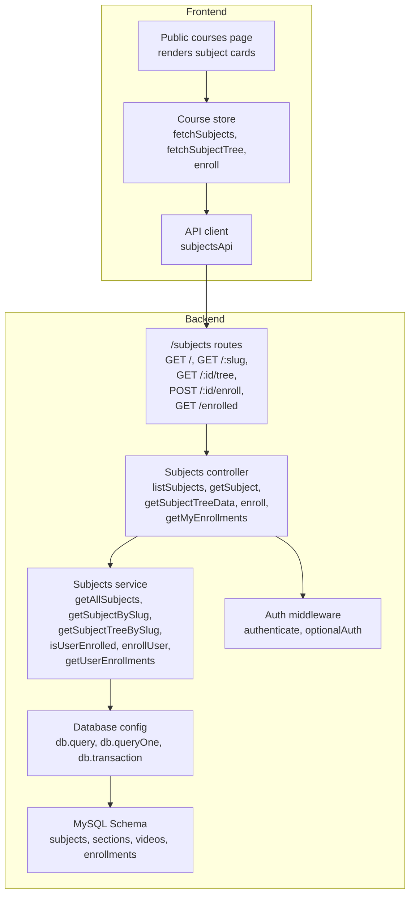
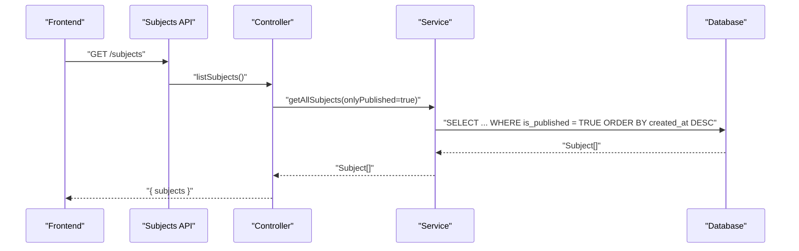
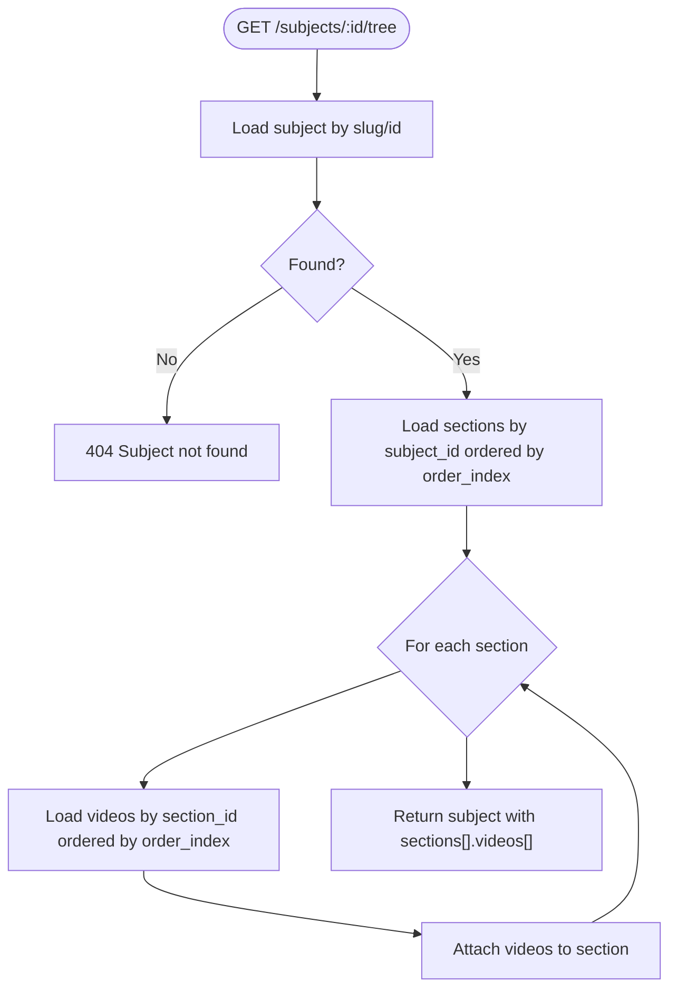
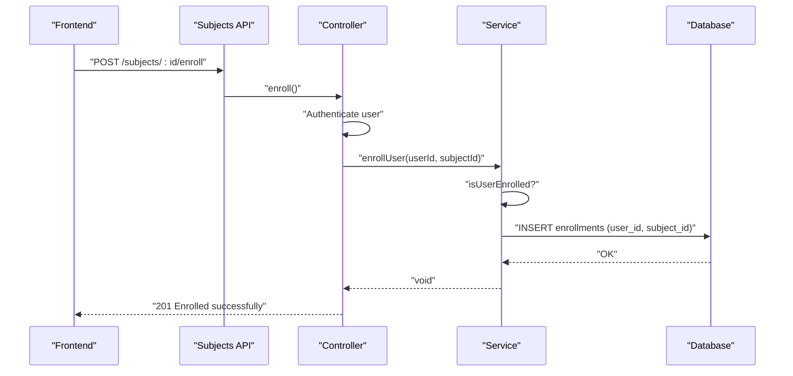
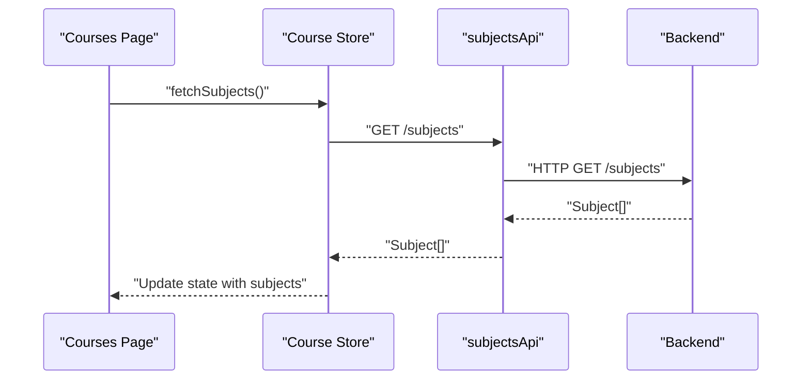
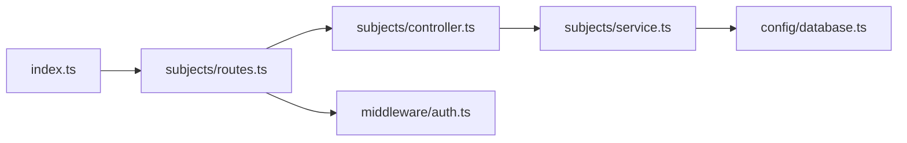
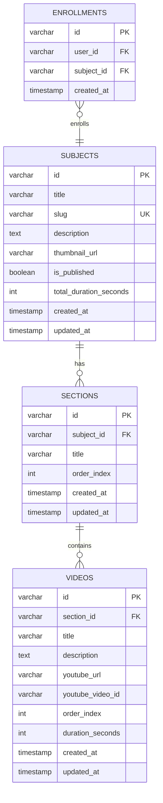

# Subject Management

<cite>
**Referenced Files in This Document**
- [controller.ts](file://backend/src/modules/subjects/controller.ts)
- [service.ts](file://backend/src/modules/subjects/service.ts)
- [routes.ts](file://backend/src/modules/subjects/routes.ts)
- [database.ts](file://backend/src/config/database.ts)
- [auth.ts](file://backend/src/middleware/auth.ts)
- [index.ts](file://backend/src/routes/index.ts)
- [002_create_subjects.sql](file://backend/migrations/002_create_subjects.sql)
- [003_create_sections.sql](file://backend/migrations/003_create_sections.sql)
- [004_create_videos.sql](file://backend/migrations/004_create_videos.sql)
- [005_create_enrollments.sql](file://backend/migrations/005_create_enrollments.sql)
- [api.ts](file://frontend/app/lib/api.ts)
- [courseStore.ts](file://frontend/app/store/courseStore.ts)
- [page.tsx](file://frontend/app/(public)/courses/page.tsx)
</cite>

## Table of Contents
1. [Introduction](#introduction)
2. [Project Structure](#project-structure)
3. [Core Components](#core-components)
4. [Architecture Overview](#architecture-overview)
5. [Detailed Component Analysis](#detailed-component-analysis)
6. [Dependency Analysis](#dependency-analysis)
7. [Performance Considerations](#performance-considerations)
8. [Troubleshooting Guide](#troubleshooting-guide)
9. [Conclusion](#conclusion)
10. [Appendices](#appendices)

## Introduction
This document describes the Subject Management system, covering subject CRUD operations, hierarchical subject tree retrieval, and enrollment workflows. It explains the backend implementation (controllers, services, routes, middleware, and database schema) and how the frontend integrates with the backend APIs to present subjects, show course trees, and manage enrollments.

## Project Structure
The Subject Management system spans backend modules and frontend integrations:
- Backend modules:
  - Routes define endpoints under /subjects
  - Controller handles HTTP requests and delegates to service
  - Service encapsulates business logic and database queries
  - Middleware authenticates requests and optionally accepts anonymous access
  - Database schema defines subjects, sections, videos, and enrollments
- Frontend:
  - API client exposes typed calls to backend endpoints
  - Store orchestrates fetching subjects, course trees, and enrollment actions
  - Public page renders a grid of published subjects

**Diagram sources**
- [routes.ts:1-20](file://backend/src/modules/subjects/routes.ts#L1-L20)
- [controller.ts:1-69](file://backend/src/modules/subjects/controller.ts#L1-L69)
- [service.ts:1-118](file://backend/src/modules/subjects/service.ts#L1-L118)
- [auth.ts:1-42](file://backend/src/middleware/auth.ts#L1-L42)
- [database.ts:1-53](file://backend/src/config/database.ts#L1-L53)
- [002_create_subjects.sql:1-14](file://backend/migrations/002_create_subjects.sql#L1-L14)
- [003_create_sections.sql:1-11](file://backend/migrations/003_create_sections.sql#L1-L11)
- [004_create_videos.sql:1-15](file://backend/migrations/004_create_videos.sql#L1-L15)
- [005_create_enrollments.sql:1-12](file://backend/migrations/005_create_enrollments.sql#L1-L12)
- [api.ts:18-29](file://frontend/app/lib/api.ts#L18-L29)
- [courseStore.ts:48-121](file://frontend/app/store/courseStore.ts#L48-L121)
- [page.tsx:9-97](file://frontend/app/(public)/courses/page.tsx#L9-L97)

**Section sources**
- [routes.ts:1-20](file://backend/src/modules/subjects/routes.ts#L1-L20)
- [controller.ts:1-69](file://backend/src/modules/subjects/controller.ts#L1-L69)
- [service.ts:1-118](file://backend/src/modules/subjects/service.ts#L1-L118)
- [auth.ts:1-42](file://backend/src/middleware/auth.ts#L1-L42)
- [database.ts:1-53](file://backend/src/config/database.ts#L1-L53)
- [002_create_subjects.sql:1-14](file://backend/migrations/002_create_subjects.sql#L1-L14)
- [003_create_sections.sql:1-11](file://backend/migrations/003_create_sections.sql#L1-L11)
- [004_create_videos.sql:1-15](file://backend/migrations/004_create_videos.sql#L1-L15)
- [005_create_enrollments.sql:1-12](file://backend/migrations/005_create_enrollments.sql#L1-L12)
- [api.ts:18-29](file://frontend/app/lib/api.ts#L18-L29)
- [courseStore.ts:48-121](file://frontend/app/store/courseStore.ts#L48-L121)
- [page.tsx:9-97](file://frontend/app/(public)/courses/page.tsx#L9-L97)

## Core Components
- Subject CRUD
  - List published subjects: GET /subjects
  - Retrieve subject by slug: GET /subjects/:slug
- Hierarchical subject tree
  - Get subject tree by ID/slug with sections and videos: GET /subjects/:id/tree
- Enrollment
  - Enroll in a subject: POST /subjects/:id/enroll
  - List enrolled subjects: GET /subjects/enrolled
  - Check enrollment status per subject: computed in GET /subjects/:id/tree

Key implementation references:
- Endpoints and routing: [routes.ts:1-20](file://backend/src/modules/subjects/routes.ts#L1-L20)
- Controllers: [controller.ts:13-68](file://backend/src/modules/subjects/controller.ts#L13-L68)
- Services: [service.ts:37-117](file://backend/src/modules/subjects/service.ts#L37-L117)
- Authentication middleware: [auth.ts:8-41](file://backend/src/middleware/auth.ts#L8-L41)

**Section sources**
- [routes.ts:1-20](file://backend/src/modules/subjects/routes.ts#L1-L20)
- [controller.ts:13-68](file://backend/src/modules/subjects/controller.ts#L13-L68)
- [service.ts:37-117](file://backend/src/modules/subjects/service.ts#L37-L117)
- [auth.ts:8-41](file://backend/src/middleware/auth.ts#L8-L41)

## Architecture Overview
The system follows a layered architecture:
- HTTP layer: Express routes
- Controller layer: Request handling and delegation
- Service layer: Business logic and data access
- Persistence layer: MySQL via a shared database client

**Diagram sources**
- [controller.ts:13-16](file://backend/src/modules/subjects/controller.ts#L13-L16)
- [service.ts:37-45](file://backend/src/modules/subjects/service.ts#L37-L45)
- [database.ts:20-29](file://backend/src/config/database.ts#L20-L29)

**Section sources**
- [controller.ts:13-16](file://backend/src/modules/subjects/controller.ts#L13-L16)
- [service.ts:37-45](file://backend/src/modules/subjects/service.ts#L37-L45)
- [database.ts:20-29](file://backend/src/config/database.ts#L20-L29)

## Detailed Component Analysis

### Subject CRUD Operations
- List subjects
  - Endpoint: GET /subjects
  - Behavior: Returns published subjects ordered by creation date descending
  - Implementation: [controller.ts:13-16](file://backend/src/modules/subjects/controller.ts#L13-L16), [service.ts:37-45](file://backend/src/modules/subjects/service.ts#L37-L45)
- Retrieve subject by slug
  - Endpoint: GET /subjects/:slug
  - Behavior: Returns a single published subject by slug; 404 if not found
  - Implementation: [controller.ts:18-28](file://backend/src/modules/subjects/controller.ts#L18-L28), [service.ts:51-53](file://backend/src/modules/subjects/service.ts#L51-L53)
- Create subject
  - Not exposed by current routes; to add, extend routes, controller, and service accordingly
  - Reference existing patterns: [routes.ts:13-17](file://backend/src/modules/subjects/routes.ts#L13-L17), [controller.ts:13-16](file://backend/src/modules/subjects/controller.ts#L13-L16), [service.ts:37-45](file://backend/src/modules/subjects/service.ts#L37-L45)

Practical example (conceptual):
- To create a subject, call a POST endpoint (not currently defined) with fields like title, slug, description, thumbnail_url, is_published, and total_duration_seconds. The backend would insert into subjects and return the created record.

**Section sources**
- [controller.ts:13-28](file://backend/src/modules/subjects/controller.ts#L13-L28)
- [service.ts:37-53](file://backend/src/modules/subjects/service.ts#L37-L53)
- [routes.ts:13-17](file://backend/src/modules/subjects/routes.ts#L13-L17)

### Hierarchical Subject Tree Structure
- Purpose: Return a subject with nested sections and videos in order_index sequence
- Endpoints:
  - GET /subjects/:id/tree (optional auth) — returns subject + sections + videos + enrollment status flag
- Implementation:
  - Fetch subject by slug or id: [service.ts:51-53](file://backend/src/modules/subjects/service.ts#L51-L53), [service.ts:84-88](file://backend/src/modules/subjects/service.ts#L84-L88)
  - Build tree: [service.ts:55-82](file://backend/src/modules/subjects/service.ts#L55-L82)
  - Enrollment check: [controller.ts:40-43](file://backend/src/modules/subjects/controller.ts#L40-L43)

**Diagram sources**
- [service.ts:55-82](file://backend/src/modules/subjects/service.ts#L55-L82)
- [controller.ts:30-46](file://backend/src/modules/subjects/controller.ts#L30-L46)

**Section sources**
- [service.ts:55-88](file://backend/src/modules/subjects/service.ts#L55-L88)
- [controller.ts:30-46](file://backend/src/modules/subjects/controller.ts#L30-L46)

### Enrollment Workflow
- Check enrollment status
  - Optional endpoint GET /subjects/:id/tree returns isEnrolled flag computed from current user session
  - Logic: [controller.ts:40-43](file://backend/src/modules/subjects/controller.ts#L40-L43), [service.ts:90-96](file://backend/src/modules/subjects/service.ts#L90-L96)
- Enroll user
  - Requires authentication: POST /subjects/:id/enroll
  - Prevents duplicate enrollments via unique constraint on (user_id, subject_id)
  - Implementation: [controller.ts:48-58](file://backend/src/modules/subjects/controller.ts#L48-L58), [service.ts:98-108](file://backend/src/modules/subjects/service.ts#L98-L108), [005_create_enrollments.sql:8](file://backend/migrations/005_create_enrollments.sql#L8)
- List enrolled subjects
  - GET /subjects/enrolled returns published subjects the user is enrolled in, ordered by enrollment creation time
  - Implementation: [controller.ts:60-68](file://backend/src/modules/subjects/controller.ts#L60-L68), [service.ts:110-117](file://backend/src/modules/subjects/service.ts#L110-L117)

**Diagram sources**
- [controller.ts:48-58](file://backend/src/modules/subjects/controller.ts#L48-L58)
- [service.ts:98-108](file://backend/src/modules/subjects/service.ts#L98-L108)
- [005_create_enrollments.sql:8](file://backend/migrations/005_create_enrollments.sql#L8)

**Section sources**
- [controller.ts:40-68](file://backend/src/modules/subjects/controller.ts#L40-L68)
- [service.ts:90-117](file://backend/src/modules/subjects/service.ts#L90-L117)
- [005_create_enrollments.sql:1-12](file://backend/migrations/005_create_enrollments.sql#L1-L12)

### Frontend Integration
- API client exposes:
  - getAll, getBySlug, getTree, enroll, getEnrolled
  - References: [api.ts:18-29](file://frontend/app/lib/api.ts#L18-L29)
- Store actions:
  - fetchSubjects, fetchSubjectTree, enroll
  - References: [courseStore.ts:58-86](file://frontend/app/store/courseStore.ts#L58-L86), [courseStore.ts:106-117](file://frontend/app/store/courseStore.ts#L106-L117)
- Public courses page:
  - Renders subject cards and links to subject detail pages
  - References: [page.tsx:9-97](file://frontend/app/(public)/courses/page.tsx#L9-L97)

**Diagram sources**
- [page.tsx:10-14](file://frontend/app/(public)/courses/page.tsx#L10-L14)
- [courseStore.ts:58-69](file://frontend/app/store/courseStore.ts#L58-L69)
- [api.ts:20](file://frontend/app/lib/api.ts#L20)
- [controller.ts:13-16](file://backend/src/modules/subjects/controller.ts#L13-L16)

**Section sources**
- [api.ts:18-29](file://frontend/app/lib/api.ts#L18-L29)
- [courseStore.ts:58-117](file://frontend/app/store/courseStore.ts#L58-L117)
- [page.tsx:9-97](file://frontend/app/(public)/courses/page.tsx#L9-L97)

## Dependency Analysis
- Route registration wires /subjects to the subjects router
  - [index.ts:18](file://backend/src/routes/index.ts#L18), [routes.ts:1-20](file://backend/src/modules/subjects/routes.ts#L1-L20)
- Controller depends on service functions
  - [controller.ts:2-9](file://backend/src/modules/subjects/controller.ts#L2-L9)
- Service depends on database client
  - [service.ts:1](file://backend/src/modules/subjects/service.ts#L1), [database.ts:20-29](file://backend/src/config/database.ts#L20-L29)
- Middleware enforces auth for protected endpoints
  - [routes.ts:9](file://backend/src/modules/subjects/routes.ts#L9), [auth.ts:8-24](file://backend/src/middleware/auth.ts#L8-L24)

**Diagram sources**
- [index.ts:17-22](file://backend/src/routes/index.ts#L17-L22)
- [routes.ts:1-20](file://backend/src/modules/subjects/routes.ts#L1-L20)
- [controller.ts:1-11](file://backend/src/modules/subjects/controller.ts#L1-L11)
- [service.ts:1](file://backend/src/modules/subjects/service.ts#L1)
- [database.ts:19-50](file://backend/src/config/database.ts#L19-L50)
- [auth.ts:8-24](file://backend/src/middleware/auth.ts#L8-L24)

**Section sources**
- [index.ts:17-22](file://backend/src/routes/index.ts#L17-L22)
- [routes.ts:1-20](file://backend/src/modules/subjects/routes.ts#L1-L20)
- [controller.ts:1-11](file://backend/src/modules/subjects/controller.ts#L1-L11)
- [service.ts:1](file://backend/src/modules/subjects/service.ts#L1)
- [database.ts:19-50](file://backend/src/config/database.ts#L19-L50)
- [auth.ts:8-24](file://backend/src/middleware/auth.ts#L8-L24)

## Performance Considerations
- Indexes
  - subjects: slug, is_published
    - [002_create_subjects.sql:11-12](file://backend/migrations/002_create_subjects.sql#L11-L12)
  - sections: (subject_id, order_index)
    - [003_create_sections.sql:9](file://backend/migrations/003_create_sections.sql#L9)
  - videos: (section_id, order_index)
    - [004_create_videos.sql:13](file://backend/migrations/004_create_videos.sql#L13)
  - enrollments: unique(user_id, subject_id), indexes on user_id and subject_id
    - [005_create_enrollments.sql:8-10](file://backend/migrations/005_create_enrollments.sql#L8-L10)
- Queries
  - Published subject listing uses is_published index
    - [service.ts:37-45](file://backend/src/modules/subjects/service.ts#L37-L45)
  - Tree building performs N+1 queries for videos; consider batching or joins for large trees
    - [service.ts:59-76](file://backend/src/modules/subjects/service.ts#L59-L76)

[No sources needed since this section provides general guidance]

## Troubleshooting Guide
- Authentication errors
  - 401 Access token required or invalid/expired token
  - Verify Authorization header and token validity
  - References: [auth.ts:12-23](file://backend/src/middleware/auth.ts#L12-L23)
- Enrollment conflicts
  - 409 Already enrolled in this course
  - Ensure deduplication before enrolling
  - References: [service.ts:98-108](file://backend/src/modules/subjects/service.ts#L98-L108)
- Resource not found
  - 404 Subject not found for slug/id
  - Confirm slug/id correctness and publication status
  - References: [controller.ts:22-25](file://backend/src/modules/subjects/controller.ts#L22-L25), [controller.ts:34-37](file://backend/src/modules/subjects/controller.ts#L34-L37)

**Section sources**
- [auth.ts:12-23](file://backend/src/middleware/auth.ts#L12-L23)
- [service.ts:98-108](file://backend/src/modules/subjects/service.ts#L98-L108)
- [controller.ts:22-25](file://backend/src/modules/subjects/controller.ts#L22-L25)
- [controller.ts:34-37](file://backend/src/modules/subjects/controller.ts#L34-L37)

## Conclusion
The Subject Management system provides a clean separation of concerns with explicit endpoints for listing, retrieving, and enrolling in subjects, and a robust hierarchical tree structure for course content. The frontend integrates seamlessly via typed API clients and stores, enabling users to browse published courses, view detailed trees, and manage enrollments. Future enhancements could include subject creation endpoints, optimized tree queries, and richer enrollment analytics.

## Appendices

### Database Schema Overview
- subjects
  - Fields: id, title, slug, description, thumbnail_url, is_published, total_duration_seconds, timestamps
  - Indexes: slug, is_published
  - References: [002_create_subjects.sql:1-14](file://backend/migrations/002_create_subjects.sql#L1-L14)
- sections
  - Fields: id, subject_id, title, order_index, timestamps
  - Foreign key: subject_id -> subjects(id) ON DELETE CASCADE
  - Indexes: (subject_id, order_index)
  - References: [003_create_sections.sql:1-11](file://backend/migrations/003_create_sections.sql#L1-L11)
- videos
  - Fields: id, section_id, title, description, youtube_url, youtube_video_id, order_index, duration_seconds, timestamps
  - Foreign key: section_id -> sections(id) ON DELETE CASCADE
  - Indexes: (section_id, order_index)
  - References: [004_create_videos.sql:1-15](file://backend/migrations/004_create_videos.sql#L1-L15)
- enrollments
  - Fields: id, user_id, subject_id, created_at
  - Foreign keys: user_id -> users(id), subject_id -> subjects(id)
  - Unique: (user_id, subject_id)
  - Indexes: user_id, subject_id
  - References: [005_create_enrollments.sql:1-12](file://backend/migrations/005_create_enrollments.sql#L1-L12)

**Diagram sources**
- [002_create_subjects.sql:1-14](file://backend/migrations/002_create_subjects.sql#L1-L14)
- [003_create_sections.sql:1-11](file://backend/migrations/003_create_sections.sql#L1-L11)
- [004_create_videos.sql:1-15](file://backend/migrations/004_create_videos.sql#L1-L15)
- [005_create_enrollments.sql:1-12](file://backend/migrations/005_create_enrollments.sql#L1-L12)

### API Endpoint Definitions
- GET /subjects
  - Description: List published subjects
  - Auth: None
  - Response: { subjects: Subject[] }
  - References: [controller.ts:13-16](file://backend/src/modules/subjects/controller.ts#L13-L16), [service.ts:37-45](file://backend/src/modules/subjects/service.ts#L37-L45)
- GET /subjects/:slug
  - Description: Get a published subject by slug
  - Auth: None
  - Response: { subject: Subject }
  - References: [controller.ts:18-28](file://backend/src/modules/subjects/controller.ts#L18-L28), [service.ts:51-53](file://backend/src/modules/subjects/service.ts#L51-L53)
- GET /subjects/:id/tree
  - Description: Get subject tree with sections and videos; optional auth for enrollment flag
  - Auth: Optional
  - Response: { subject: SubjectTree, isEnrolled: boolean }
  - References: [controller.ts:30-46](file://backend/src/modules/subjects/controller.ts#L30-L46), [service.ts:84-88](file://backend/src/modules/subjects/service.ts#L84-L88)
- POST /subjects/:id/enroll
  - Description: Enroll authenticated user in a subject
  - Auth: Required
  - Response: { message: string }
  - References: [controller.ts:48-58](file://backend/src/modules/subjects/controller.ts#L48-L58), [service.ts:98-108](file://backend/src/modules/subjects/service.ts#L98-L108)
- GET /subjects/enrolled
  - Description: List subjects user is enrolled in (published only)
  - Auth: Required
  - Response: { subjects: Subject[] }
  - References: [controller.ts:60-68](file://backend/src/modules/subjects/controller.ts#L60-L68), [service.ts:110-117](file://backend/src/modules/subjects/service.ts#L110-L117)

**Section sources**
- [controller.ts:13-68](file://backend/src/modules/subjects/controller.ts#L13-L68)
- [service.ts:37-117](file://backend/src/modules/subjects/service.ts#L37-L117)