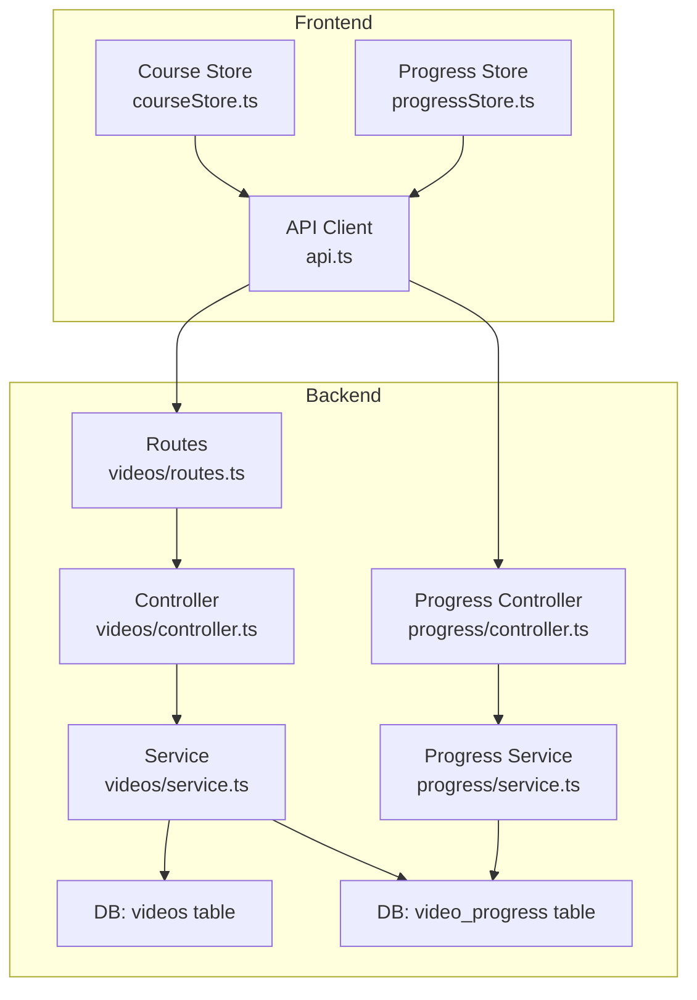
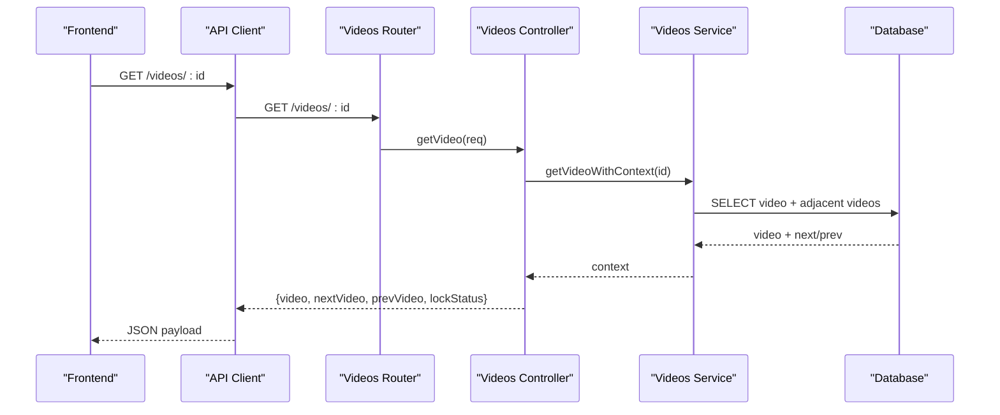
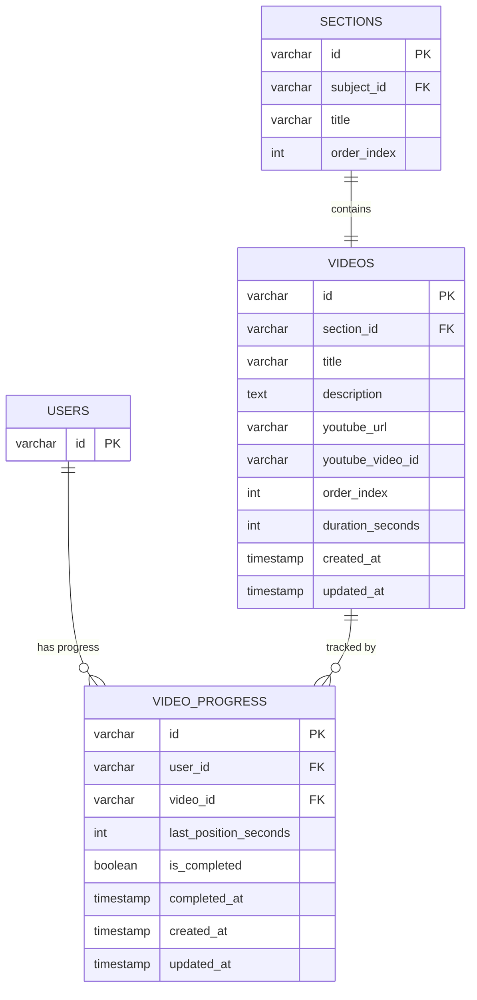
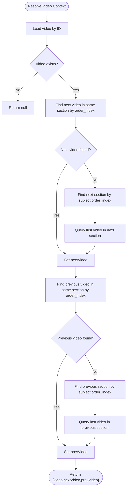
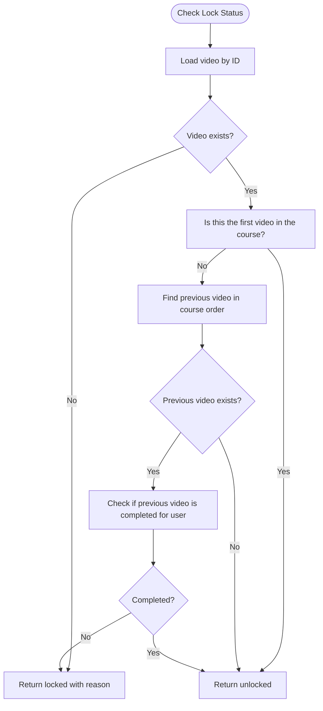
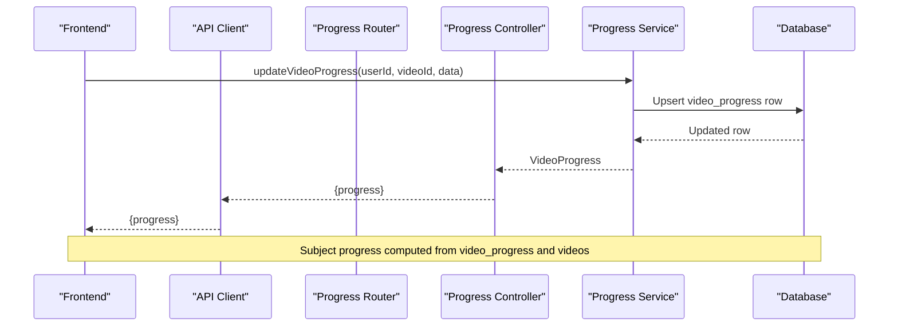
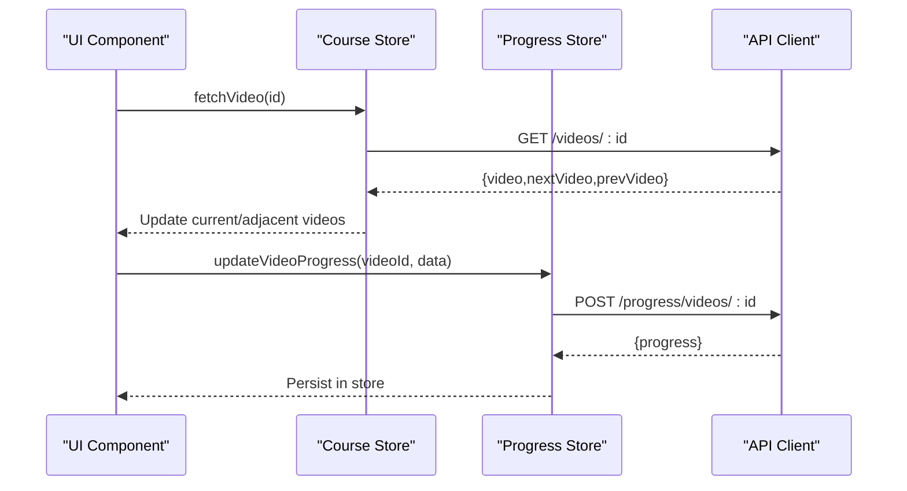
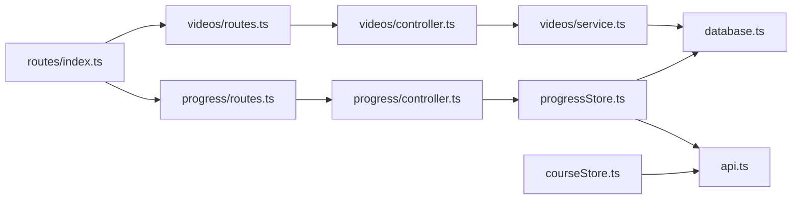

# Video Management

<cite>
**Referenced Files in This Document**
- [controller.ts](file://backend/src/modules/videos/controller.ts)
- [routes.ts](file://backend/src/modules/videos/routes.ts)
- [service.ts](file://backend/src/modules/videos/service.ts)
- [004_create_videos.sql](file://backend/migrations/004_create_videos.sql)
- [006_create_video_progress.sql](file://backend/migrations/006_create_video_progress.sql)
- [index.ts](file://backend/src/routes/index.ts)
- [progress.controller.ts](file://backend/src/modules/progress/controller.ts)
- [progress.service.ts](file://backend/src/modules/progress/service.ts)
- [validation.ts](file://backend/src/utils/validation.ts)
- [courseStore.ts](file://frontend/app/store/courseStore.ts)
- [progressStore.ts](file://frontend/app/store/progressStore.ts)
- [api.ts](file://frontend/app/lib/api.ts)
</cite>

## Table of Contents
1. [Introduction](#introduction)
2. [Project Structure](#project-structure)
3. [Core Components](#core-components)
4. [Architecture Overview](#architecture-overview)
5. [Detailed Component Analysis](#detailed-component-analysis)
6. [Dependency Analysis](#dependency-analysis)
7. [Performance Considerations](#performance-considerations)
8. [Troubleshooting Guide](#troubleshooting-guide)
9. [Conclusion](#conclusion)

## Introduction
This document describes the Video Management system, focusing on how videos are organized under subjects and sections, how playback and progress integrate with the learning system, and how the backend enforces sequencing locks. It also outlines the frontend integration for fetching videos, checking lock status, and synchronizing progress.

## Project Structure
The Video Management system spans backend modules and frontend stores:
- Backend
  - Routes expose GET /videos/:id and GET /videos/:id/lock-status
  - Controller handles requests and delegates to service
  - Service queries videos, adjacent videos, and lock status based on completion
  - Migrations define the videos and video_progress tables
  - Progress module integrates with the learning progress system
- Frontend
  - Store manages current subject, current video, and navigation (next/previous)
  - API client exposes video and progress endpoints
  - Progress store persists and updates per-video progress

**Diagram sources**
- [routes.ts:1-11](file://backend/src/modules/videos/routes.ts#L1-L11)
- [controller.ts:1-42](file://backend/src/modules/videos/controller.ts#L1-L42)
- [service.ts:1-160](file://backend/src/modules/videos/service.ts#L1-L160)
- [progress.controller.ts:1-66](file://backend/src/modules/progress/controller.ts#L1-L66)
- [progress.service.ts:1-163](file://backend/src/modules/progress/service.ts#L1-L163)
- [004_create_videos.sql:1-15](file://backend/migrations/004_create_videos.sql#L1-L15)
- [006_create_video_progress.sql:1-16](file://backend/migrations/006_create_video_progress.sql#L1-L16)
- [courseStore.ts:1-121](file://frontend/app/store/courseStore.ts#L1-L121)
- [progressStore.ts:1-87](file://frontend/app/store/progressStore.ts#L1-L87)
- [api.ts:1-80](file://frontend/app/lib/api.ts#L1-L80)

**Section sources**
- [routes.ts:1-11](file://backend/src/modules/videos/routes.ts#L1-L11)
- [index.ts:1-25](file://backend/src/routes/index.ts#L1-L25)

## Core Components
- Video entity and relationships
  - Videos belong to sections and are ordered within sections
  - Videos reference YouTube via URL and video ID
  - Duration is stored in seconds
- Locking mechanism
  - First video in a course is always unlocked
  - Subsequent videos are locked until the previous video in the course sequence is marked complete
- Progress tracking
  - Per-user, per-video progress tracks last watched position and completion flag
  - Subject-level progress aggregates counts and time spent

**Section sources**
- [004_create_videos.sql:1-15](file://backend/migrations/004_create_videos.sql#L1-L15)
- [service.ts:3-18](file://backend/src/modules/videos/service.ts#L3-L18)
- [service.ts:97-159](file://backend/src/modules/videos/service.ts#L97-L159)
- [006_create_video_progress.sql:1-16](file://backend/migrations/006_create_video_progress.sql#L1-L16)
- [progress.service.ts:3-18](file://backend/src/modules/progress/service.ts#L3-L18)
- [progress.service.ts:20-85](file://backend/src/modules/progress/service.ts#L20-L85)

## Architecture Overview
The system separates concerns across modules:
- Routing mounts video and progress endpoints
- Video controller responds to video retrieval and lock checks
- Video service resolves context (current, next, previous videos) and lock status
- Progress service manages per-video and subject-level progress
- Frontend stores orchestrate data fetching and UI updates

**Diagram sources**
- [routes.ts:7-8](file://backend/src/modules/videos/routes.ts#L7-L8)
- [controller.ts:6-29](file://backend/src/modules/videos/controller.ts#L6-L29)
- [service.ts:24-95](file://backend/src/modules/videos/service.ts#L24-L95)
- [004_create_videos.sql:1-15](file://backend/migrations/004_create_videos.sql#L1-L15)

## Detailed Component Analysis

### Video Entity and Schema
- Fields include identifiers, foreign keys, titles, descriptions, YouTube URL and video ID, ordering index, and duration in seconds
- Indexes optimize lookups by section and order

**Diagram sources**
- [004_create_videos.sql:1-15](file://backend/migrations/004_create_videos.sql#L1-L15)
- [006_create_video_progress.sql:1-16](file://backend/migrations/006_create_video_progress.sql#L1-L16)

**Section sources**
- [004_create_videos.sql:1-15](file://backend/migrations/004_create_videos.sql#L1-L15)
- [006_create_video_progress.sql:1-16](file://backend/migrations/006_create_video_progress.sql#L1-L16)

### Video Context Resolution and Navigation
- Given a video ID, the service returns the current video plus the next and previous videos in the course sequence
- Next/previous resolution spans section boundaries and subject boundaries
- Adjacent queries leverage section and order_index to maintain logical progression

**Diagram sources**
- [service.ts:24-95](file://backend/src/modules/videos/service.ts#L24-L95)

**Section sources**
- [service.ts:24-95](file://backend/src/modules/videos/service.ts#L24-L95)

### Lock Status and Sequencing Logic
- First video in a course is always unlocked
- For subsequent videos, the system determines the immediately preceding video in course order
- If the previous video is missing or not completed, the current video remains locked with a reason message

**Diagram sources**
- [service.ts:97-159](file://backend/src/modules/videos/service.ts#L97-L159)

**Section sources**
- [service.ts:97-159](file://backend/src/modules/videos/service.ts#L97-L159)

### Progress Tracking Integration
- Per-video progress supports incremental updates (last position) and completion flags
- Completion triggers timestamps and cascades into subject-level progress calculations
- Frontend stores persist and update progress locally and synchronize with the backend

**Diagram sources**
- [progress.controller.ts:24-39](file://backend/src/modules/progress/controller.ts#L24-L39)
- [progress.service.ts:30-85](file://backend/src/modules/progress/service.ts#L30-L85)
- [006_create_video_progress.sql:1-16](file://backend/migrations/006_create_video_progress.sql#L1-L16)

**Section sources**
- [progress.controller.ts:1-66](file://backend/src/modules/progress/controller.ts#L1-L66)
- [progress.service.ts:1-163](file://backend/src/modules/progress/service.ts#L1-L163)
- [validation.ts:14-17](file://backend/src/utils/validation.ts#L14-L17)

### Frontend Integration
- Course store fetches subject trees and current video context
- Progress store fetches and updates per-video progress
- API client encapsulates endpoints for videos and progress

**Diagram sources**
- [courseStore.ts:88-104](file://frontend/app/store/courseStore.ts#L88-L104)
- [progressStore.ts:55-66](file://frontend/app/store/progressStore.ts#L55-L66)
- [api.ts:31-52](file://frontend/app/lib/api.ts#L31-L52)

**Section sources**
- [courseStore.ts:1-121](file://frontend/app/store/courseStore.ts#L1-L121)
- [progressStore.ts:1-87](file://frontend/app/store/progressStore.ts#L1-L87)
- [api.ts:1-80](file://frontend/app/lib/api.ts#L1-L80)

## Dependency Analysis
- Routing
  - Videos and progress routes are mounted under /videos and /progress respectively
- Controllers depend on Services for business logic
- Services depend on the database abstraction for SQL operations
- Frontend depends on API client and stores for data flow

**Diagram sources**
- [index.ts:1-25](file://backend/src/routes/index.ts#L1-L25)
- [routes.ts:1-11](file://backend/src/modules/videos/routes.ts#L1-L11)
- [progress.controller.ts:1-66](file://backend/src/modules/progress/controller.ts#L1-L66)
- [service.ts:1-160](file://backend/src/modules/videos/service.ts#L1-L160)
- [progress.service.ts:1-163](file://backend/src/modules/progress/service.ts#L1-L163)
- [courseStore.ts:1-121](file://frontend/app/store/courseStore.ts#L1-L121)
- [progressStore.ts:1-87](file://frontend/app/store/progressStore.ts#L1-L87)
- [api.ts:1-80](file://frontend/app/lib/api.ts#L1-L80)

**Section sources**
- [index.ts:1-25](file://backend/src/routes/index.ts#L1-L25)
- [routes.ts:1-11](file://backend/src/modules/videos/routes.ts#L1-L11)
- [progress.controller.ts:1-66](file://backend/src/modules/progress/controller.ts#L1-L66)

## Performance Considerations
- Indexes on videos (section_id, order_index) and video_progress (user_id, video_id) support efficient lookups
- Queries resolve next/previous videos with single-row limits, minimizing overhead
- Consider caching frequently accessed subject trees and video contexts at the application level if traffic warrants

[No sources needed since this section provides general guidance]

## Troubleshooting Guide
- Video not found
  - Symptom: 404 response when fetching a video
  - Cause: Invalid or deleted video ID
  - Action: Verify video ID and existence in videos table
- Authentication required
  - Symptom: 401 response when checking lock status
  - Cause: Endpoint requires authenticated user
  - Action: Ensure user session is active
- Locked video
  - Symptom: lockStatus indicates locked with a reason
  - Cause: Previous video in course sequence not completed
  - Action: Complete prerequisite video and retry lock check
- Progress update failures
  - Symptom: Validation errors or failure to update progress
  - Cause: Invalid payload or missing authentication
  - Action: Validate input against progressUpdateSchema and ensure authentication

**Section sources**
- [controller.ts:10-21](file://backend/src/modules/videos/controller.ts#L10-L21)
- [controller.ts:32-41](file://backend/src/modules/videos/controller.ts#L32-L41)
- [service.ts:100-159](file://backend/src/modules/videos/service.ts#L100-L159)
- [validation.ts:14-17](file://backend/src/utils/validation.ts#L14-L17)
- [progress.controller.ts:24-39](file://backend/src/modules/progress/controller.ts#L24-L39)

## Conclusion
The Video Management system cleanly separates concerns between video context resolution, sequencing locks, and progress tracking. The backend enforces logical progression and integrates with the learning progress system, while the frontend stores and API client provide a responsive user experience. Together, they support robust video playback, navigation, and completion tracking aligned with course structure.