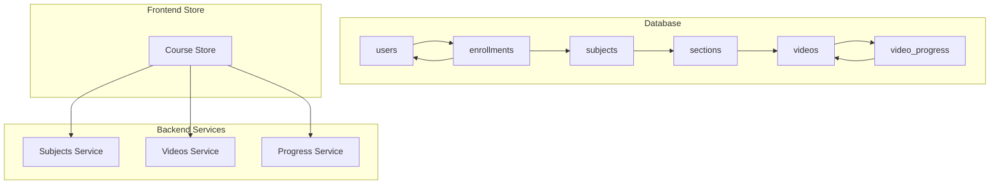
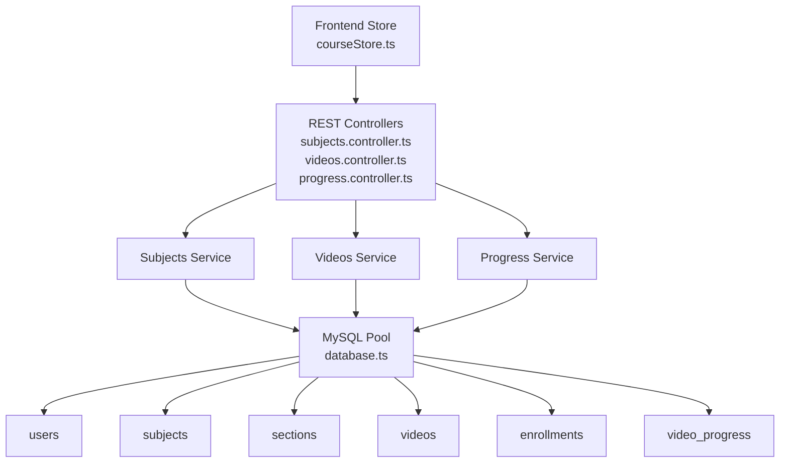
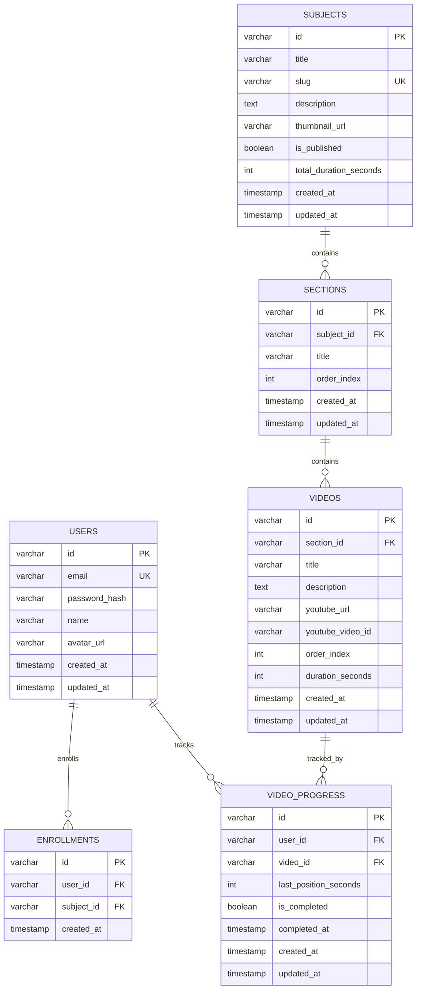
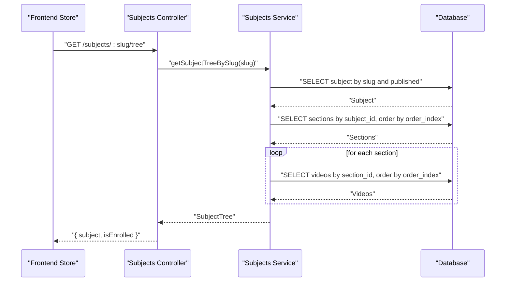
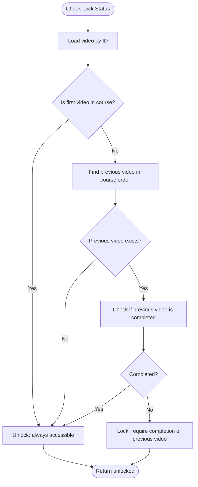
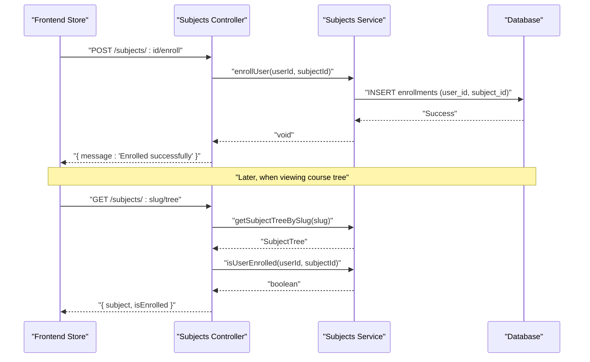
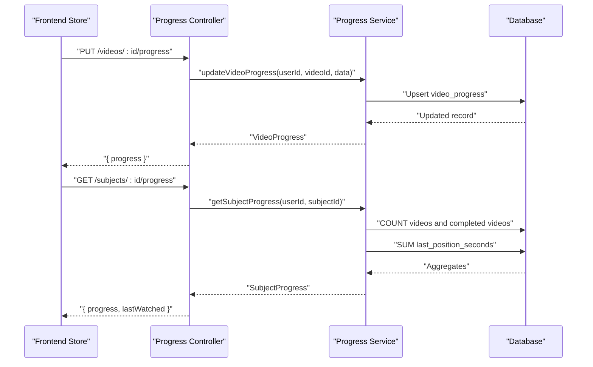
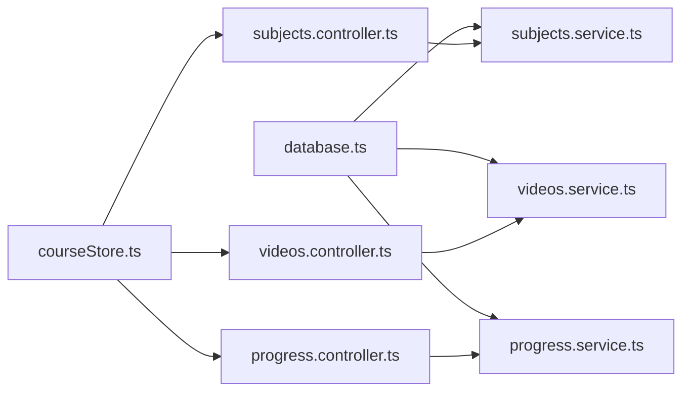

# Course Content Schema

<cite>
**Referenced Files in This Document**
- [001_create_users.sql](file://backend/migrations/001_create_users.sql)
- [002_create_subjects.sql](file://backend/migrations/002_create_subjects.sql)
- [003_create_sections.sql](file://backend/migrations/003_create_sections.sql)
- [004_create_videos.sql](file://backend/migrations/004_create_videos.sql)
- [005_create_enrollments.sql](file://backend/migrations/005_create_enrollments.sql)
- [006_create_video_progress.sql](file://backend/migrations/006_create_video_progress.sql)
- [database.ts](file://backend/src/config/database.ts)
- [service.ts (subjects)](file://backend/src/modules/subjects/service.ts)
- [controller.ts (subjects)](file://backend/src/modules/subjects/controller.ts)
- [service.ts (videos)](file://backend/src/modules/videos/service.ts)
- [service.ts (progress)](file://backend/src/modules/progress/service.ts)
- [controller.ts (progress)](file://backend/src/modules/progress/controller.ts)
- [validation.ts](file://backend/src/utils/validation.ts)
- [courseStore.ts](file://frontend/app/store/courseStore.ts)
- [seed.ts](file://backend/src/scripts/seed.ts)
</cite>

## Table of Contents
1. [Introduction](#introduction)
2. [Project Structure](#project-structure)
3. [Core Components](#core-components)
4. [Architecture Overview](#architecture-overview)
5. [Detailed Component Analysis](#detailed-component-analysis)
6. [Dependency Analysis](#dependency-analysis)
7. [Performance Considerations](#performance-considerations)
8. [Troubleshooting Guide](#troubleshooting-guide)
9. [Conclusion](#conclusion)

## Introduction
This document describes the Course Content schema and its data model for organizing educational material. It covers the hierarchical relationships among subjects, sections, and videos, along with supporting tables for enrollment and progress tracking. It explains table structures, foreign keys, cascading constraints, indexing strategies, and query patterns used to retrieve and manage content. It also outlines content management workflows, enrollment prerequisites, and media file handling via YouTube URLs.

## Project Structure
The schema is defined by SQL migration files and consumed by backend services and frontend stores. The backend uses a MySQL connection pool abstraction and exposes REST endpoints for subjects, videos, and progress. The frontend store orchestrates fetching and caching of course data.

**Diagram sources**
- [001_create_users.sql:1-11](file://backend/migrations/001_create_users.sql#L1-L11)
- [002_create_subjects.sql:1-14](file://backend/migrations/002_create_subjects.sql#L1-L14)
- [003_create_sections.sql:1-11](file://backend/migrations/003_create_sections.sql#L1-L11)
- [004_create_videos.sql:1-15](file://backend/migrations/004_create_videos.sql#L1-L15)
- [005_create_enrollments.sql:1-12](file://backend/migrations/005_create_enrollments.sql#L1-L12)
- [006_create_video_progress.sql:1-16](file://backend/migrations/006_create_video_progress.sql#L1-L16)
- [service.ts (subjects):1-118](file://backend/src/modules/subjects/service.ts#L1-L118)
- [service.ts (videos):1-160](file://backend/src/modules/videos/service.ts#L1-L160)
- [service.ts (progress):1-163](file://backend/src/modules/progress/service.ts#L1-L163)
- [courseStore.ts:1-121](file://frontend/app/store/courseStore.ts#L1-L121)

**Section sources**
- [001_create_users.sql:1-11](file://backend/migrations/001_create_users.sql#L1-L11)
- [002_create_subjects.sql:1-14](file://backend/migrations/002_create_subjects.sql#L1-L14)
- [003_create_sections.sql:1-11](file://backend/migrations/003_create_sections.sql#L1-L11)
- [004_create_videos.sql:1-15](file://backend/migrations/004_create_videos.sql#L1-L15)
- [005_create_enrollments.sql:1-12](file://backend/migrations/005_create_enrollments.sql#L1-L12)
- [006_create_video_progress.sql:1-16](file://backend/migrations/006_create_video_progress.sql#L1-L16)
- [database.ts:1-53](file://backend/src/config/database.ts#L1-L53)
- [service.ts (subjects):1-118](file://backend/src/modules/subjects/service.ts#L1-L118)
- [service.ts (videos):1-160](file://backend/src/modules/videos/service.ts#L1-L160)
- [service.ts (progress):1-163](file://backend/src/modules/progress/service.ts#L1-L163)
- [courseStore.ts:1-121](file://frontend/app/store/courseStore.ts#L1-L121)

## Core Components
- Users: Stores user identities and authentication-related attributes.
- Subjects: Represents courses with publication state, slug-based lookup, and aggregate duration.
- Sections: Logical groupings within a subject, ordered by index.
- Videos: Individual lessons with YouTube metadata and ordering within sections.
- Enrollments: Tracks which users are enrolled in which subjects.
- Video Progress: Tracks per-user progress, completion, and last watched position.

Key relationships:
- subjects.id → sections.subject_id (CASCADE DELETE)
- sections.id → videos.section_id (CASCADE DELETE)
- users.id → enrollments.user_id (CASCADE DELETE)
- subjects.id → enrollments.subject_id (CASCADE DELETE)
- users.id → video_progress.user_id (CASCADE DELETE)
- videos.id → video_progress.video_id (CASCADE DELETE)

Indexing highlights:
- subjects.slug, subjects.is_published
- sections.subject_id, sections.order_index
- videos.section_id, videos.order_index
- enrollments.user_id, enrollments.subject_id
- video_progress.user_id, video_progress.video_id

**Section sources**
- [001_create_users.sql:1-11](file://backend/migrations/001_create_users.sql#L1-L11)
- [002_create_subjects.sql:1-14](file://backend/migrations/002_create_subjects.sql#L1-L14)
- [003_create_sections.sql:1-11](file://backend/migrations/003_create_sections.sql#L1-L11)
- [004_create_videos.sql:1-15](file://backend/migrations/004_create_videos.sql#L1-L15)
- [005_create_enrollments.sql:1-12](file://backend/migrations/005_create_enrollments.sql#L1-L12)
- [006_create_video_progress.sql:1-16](file://backend/migrations/006_create_video_progress.sql#L1-L16)

## Architecture Overview
The system follows a layered architecture:
- Data Access Layer: MySQL via a connection pool abstraction.
- Business Logic Layer: Modules for subjects, videos, and progress.
- Presentation Layer: Frontend store orchestrating data fetching and UI state.

**Diagram sources**
- [database.ts:1-53](file://backend/src/config/database.ts#L1-L53)
- [controller.ts (subjects):1-69](file://backend/src/modules/subjects/controller.ts#L1-L69)
- [service.ts (subjects):1-118](file://backend/src/modules/subjects/service.ts#L1-L118)
- [service.ts (videos):1-160](file://backend/src/modules/videos/service.ts#L1-L160)
- [service.ts (progress):1-163](file://backend/src/modules/progress/service.ts#L1-L163)
- [courseStore.ts:1-121](file://frontend/app/store/courseStore.ts#L1-L121)

## Detailed Component Analysis

### Entity Relationship Diagram
This ER diagram shows primary tables and their relationships, including foreign keys and cascade behavior.

**Diagram sources**
- [001_create_users.sql:1-11](file://backend/migrations/001_create_users.sql#L1-L11)
- [002_create_subjects.sql:1-14](file://backend/migrations/002_create_subjects.sql#L1-L14)
- [003_create_sections.sql:1-11](file://backend/migrations/003_create_sections.sql#L1-L11)
- [004_create_videos.sql:1-15](file://backend/migrations/004_create_videos.sql#L1-L15)
- [005_create_enrollments.sql:1-12](file://backend/migrations/005_create_enrollments.sql#L1-L12)
- [006_create_video_progress.sql:1-16](file://backend/migrations/006_create_video_progress.sql#L1-L16)

### Subjects, Sections, Videos Hierarchical Retrieval
The subjects service constructs a subject tree by loading sections and videos in order, enabling client-side rendering of nested content.

**Diagram sources**
- [controller.ts (subjects):30-46](file://backend/src/modules/subjects/controller.ts#L30-L46)
- [service.ts (subjects):55-88](file://backend/src/modules/subjects/service.ts#L55-L88)
- [courseStore.ts:71-86](file://frontend/app/store/courseStore.ts#L71-L86)

**Section sources**
- [service.ts (subjects):37-88](file://backend/src/modules/subjects/service.ts#L37-L88)
- [controller.ts (subjects):18-46](file://backend/src/modules/subjects/controller.ts#L18-L46)
- [courseStore.ts:71-86](file://frontend/app/store/courseStore.ts#L71-L86)

### Video Navigation and Locking Logic
The videos service computes next/previous videos within a section and across sections, and enforces prerequisite completion locks.

**Diagram sources**
- [service.ts (videos):97-159](file://backend/src/modules/videos/service.ts#L97-L159)

**Section sources**
- [service.ts (videos):24-95](file://backend/src/modules/videos/service.ts#L24-L95)
- [service.ts (videos):97-159](file://backend/src/modules/videos/service.ts#L97-L159)

### Enrollment Prerequisites and Content Access
Access to course content is gated by enrollment. The subjects controller checks enrollment status for authenticated users and the subjects service provides enrollment APIs.

**Diagram sources**
- [controller.ts (subjects):48-58](file://backend/src/modules/subjects/controller.ts#L48-L58)
- [service.ts (subjects):90-108](file://backend/src/modules/subjects/service.ts#L90-L108)
- [service.ts (subjects):84-88](file://backend/src/modules/subjects/service.ts#L84-L88)

**Section sources**
- [controller.ts (subjects):48-69](file://backend/src/modules/subjects/controller.ts#L48-L69)
- [service.ts (subjects):90-118](file://backend/src/modules/subjects/service.ts#L90-L118)

### Progress Tracking and Aggregation
Progress is tracked per user and per video. The progress service supports updating progress, computing subject-level statistics, and retrieving last watched items.

**Diagram sources**
- [controller.ts (progress):24-55](file://backend/src/modules/progress/controller.ts#L24-L55)
- [service.ts (progress):30-85](file://backend/src/modules/progress/service.ts#L30-L85)
- [service.ts (progress):87-130](file://backend/src/modules/progress/service.ts#L87-L130)

**Section sources**
- [controller.ts (progress):12-66](file://backend/src/modules/progress/controller.ts#L12-L66)
- [service.ts (progress):20-163](file://backend/src/modules/progress/service.ts#L20-L163)
- [validation.ts:14-17](file://backend/src/utils/validation.ts#L14-L17)

### Media File Handling
Videos are represented by YouTube URLs and YouTube video identifiers. The schema does not store local media files; playback is delegated to YouTube.

- videos.youtube_url: Full YouTube watch URL.
- videos.youtube_video_id: Extracted YouTube video identifier for embedding and analytics.

**Section sources**
- [004_create_videos.sql:1-15](file://backend/migrations/004_create_videos.sql#L1-L15)
- [service.ts (videos):3-12](file://backend/src/modules/videos/service.ts#L3-L12)

## Dependency Analysis
- Cohesion: Each module encapsulates domain logic (subjects, videos, progress).
- Coupling: Services depend on the shared database abstraction; controllers depend on services; frontend store depends on API endpoints.
- External Dependencies: MySQL via mysql2/promise; Zod for validation; Zustand for state management.

**Diagram sources**
- [database.ts:1-53](file://backend/src/config/database.ts#L1-L53)
- [controller.ts (subjects):1-69](file://backend/src/modules/subjects/controller.ts#L1-L69)
- [service.ts (subjects):1-118](file://backend/src/modules/subjects/service.ts#L1-L118)
- [service.ts (videos):1-160](file://backend/src/modules/videos/service.ts#L1-L160)
- [service.ts (progress):1-163](file://backend/src/modules/progress/service.ts#L1-L163)
- [courseStore.ts:1-121](file://frontend/app/store/courseStore.ts#L1-L121)

**Section sources**
- [database.ts:1-53](file://backend/src/config/database.ts#L1-L53)
- [controller.ts (subjects):1-69](file://backend/src/modules/subjects/controller.ts#L1-L69)
- [service.ts (subjects):1-118](file://backend/src/modules/subjects/service.ts#L1-L118)
- [service.ts (videos):1-160](file://backend/src/modules/videos/service.ts#L1-L160)
- [service.ts (progress):1-163](file://backend/src/modules/progress/service.ts#L1-L163)
- [courseStore.ts:1-121](file://frontend/app/store/courseStore.ts#L1-L121)

## Performance Considerations
- Indexes for fast lookups:
  - subjects.slug and subjects.is_published support course discovery and filtering.
  - sections(subject_id, order_index) supports ordered traversal within a subject.
  - videos(section_id, order_index) supports ordered traversal within a section.
  - enrollments(user_id, subject_id) supports user enrollment queries.
  - video_progress(user_id, video_id) supports per-user progress operations.
- Query patterns:
  - Tree retrieval uses three queries: subject, sections, and videos; consider batching or caching for large courses.
  - Navigation queries traverse sections and videos by order_index; maintain consistent ordering.
  - Progress aggregation joins videos, sections, and progress; ensure indexes are leveraged.
- Cascading deletes:
  - Deleting a subject removes sections and videos; deleting a user removes enrollments and progress. Plan maintenance accordingly.

[No sources needed since this section provides general guidance]

## Troubleshooting Guide
- Enrollment conflicts:
  - Attempting to enroll twice for the same user and subject raises a conflict; verify uniqueness constraints and handle gracefully in the frontend.
- Video lock errors:
  - If a prerequisite video is not completed, the system returns a lock reason; surface this to the user and prevent playback until prerequisites are met.
- Missing data:
  - Queries for subject tree, video context, and progress rely on consistent foreign keys; verify referential integrity after manual inserts.
- Validation failures:
  - Progress updates are validated; ensure lastPositionSeconds is non-negative and isCompleted is boolean.

**Section sources**
- [service.ts (subjects):98-108](file://backend/src/modules/subjects/service.ts#L98-L108)
- [service.ts (videos):100-159](file://backend/src/modules/videos/service.ts#L100-L159)
- [validation.ts:14-17](file://backend/src/utils/validation.ts#L14-L17)

## Conclusion
The Course Content schema organizes learning materials in a strict hierarchy: subjects contain sections, which contain videos. Strong foreign keys and cascading deletes ensure referential integrity. Indexes optimize common queries for discovery, ordering, and progress tracking. Enrollment gates access, while progress tracking enables personalized experiences. The frontend store integrates these services to deliver a responsive course browsing and playback experience.