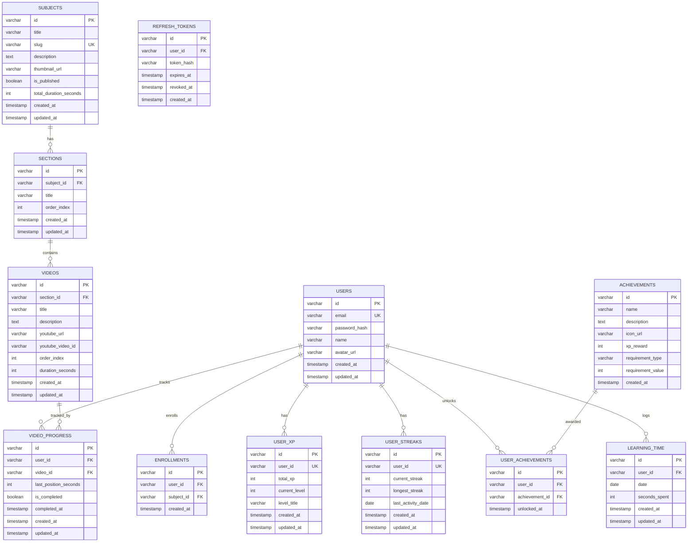
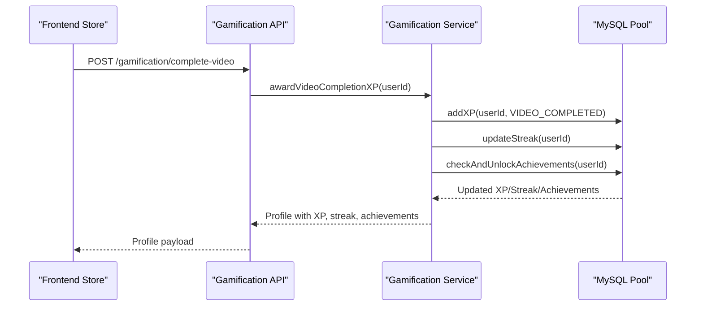
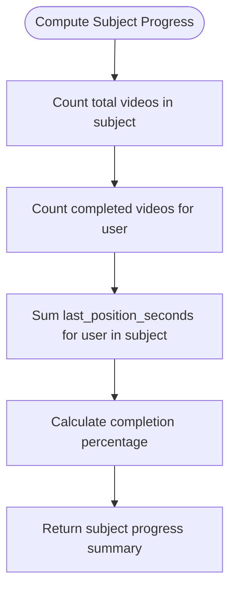
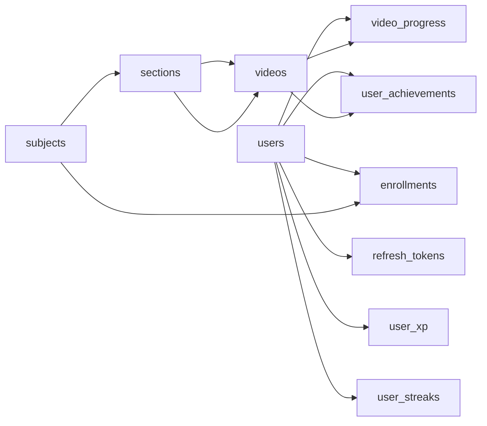

# Database Schema

<cite>
**Referenced Files in This Document**
- [001_create_users.sql](file://backend/migrations/001_create_users.sql)
- [002_create_subjects.sql](file://backend/migrations/002_create_subjects.sql)
- [003_create_sections.sql](file://backend/migrations/003_create_sections.sql)
- [004_create_videos.sql](file://backend/migrations/004_create_videos.sql)
- [005_create_enrollments.sql](file://backend/migrations/005_create_enrollments.sql)
- [006_create_video_progress.sql](file://backend/migrations/006_create_video_progress.sql)
- [007_create_refresh_tokens.sql](file://backend/migrations/007_create_refresh_tokens.sql)
- [008_create_gamification.sql](file://backend/migrations/008_create_gamification.sql)
- [database.ts](file://backend/src/config/database.ts)
- [migrate.ts](file://backend/src/scripts/migrate.ts)
- [seed.ts](file://backend/src/scripts/seed.ts)
- [progress.service.ts](file://backend/src/modules/progress/service.ts)
- [gamification.service.ts](file://backend/src/modules/gamification/service.ts)
- [validation.ts](file://backend/src/utils/validation.ts)
- [api.ts](file://frontend/app/lib/api.ts)
- [progressStore.ts](file://frontend/app/store/progressStore.ts)
- [gamificationStore.ts](file://frontend/app/store/gamificationStore.ts)
</cite>

## Table of Contents
1. [Introduction](#introduction)
2. [Project Structure](#project-structure)
3. [Core Components](#core-components)
4. [Architecture Overview](#architecture-overview)
5. [Detailed Component Analysis](#detailed-component-analysis)
6. [Dependency Analysis](#dependency-analysis)
7. [Performance Considerations](#performance-considerations)
8. [Troubleshooting Guide](#troubleshooting-guide)
9. [Conclusion](#conclusion)
10. [Appendices](#appendices)

## Introduction
This document provides comprehensive data model documentation for the Learning Management System (LMS). It details the relational schema, entity relationships among users, subjects, sections, videos, enrollments, progress tracking, and gamification data. It explains table structures, primary and foreign keys, indexes, constraints, validation rules, referential integrity, and data lifecycle management via migrations and seeding. It also covers performance considerations, query optimization strategies, and typical data access patterns used by the backend services and frontend stores.

## Project Structure
The LMS database schema is defined by a series of SQL migration files executed by a Node.js script against a MySQL-compatible database. The backend uses a MySQL pool abstraction for queries and transactions. Frontend stores consume REST endpoints exposed by backend modules to manage progress and gamification.

```mermaid
graph TB
subgraph "Backend"
CFG["database.ts<br/>MySQL Pool"]
MIG["migrate.ts<br/>Run Migrations"]
SEED["seed.ts<br/>Seed Demo Data"]
PROG["progress.service.ts<br/>Progress Queries"]
GAME["gamification.service.ts<br/>XP/Streak/Achievements"]
end
subgraph "Database"
U["users"]
S["subjects"]
SEC["sections"]
V["videos"]
E["enrollments"]
VP["video_progress"]
RT["refresh_tokens"]
UX["user_xp"]
US["user_streaks"]
ACH["achievements"]
UA["user_achievements"]
LT["learning_time"]
end
subgraph "Frontend"
FE_API["api.ts<br/>REST Calls"]
FE_PROG["progressStore.ts"]
FE_GAME["gamificationStore.ts"]
end
MIG --> U
MIG --> S
MIG --> SEC
MIG --> V
MIG --> E
MIG --> VP
MIG --> RT
MIG --> UX
MIG --> US
MIG --> ACH
MIG --> UA
MIG --> LT
SEED --> U
SEED --> S
SEED --> SEC
SEED --> V
SEED --> ACH
CFG --> PROG
CFG --> GAME
FE_API --> PROG
FE_API --> GAME
FE_PROG --> PROG
FE_GAME --> GAME
```

**Diagram sources**
- [database.ts:19-50](file://backend/src/config/database.ts#L19-L50)
- [migrate.ts:5-37](file://backend/src/scripts/migrate.ts#L5-L37)
- [seed.ts:4-107](file://backend/src/scripts/seed.ts#L4-L107)
- [progress.service.ts:20-162](file://backend/src/modules/progress/service.ts#L20-L162)
- [gamification.service.ts:47-245](file://backend/src/modules/gamification/service.ts#L47-L245)
- [api.ts:4-79](file://frontend/app/lib/api.ts#L4-L79)
- [progressStore.ts:36-86](file://frontend/app/store/progressStore.ts#L36-L86)
- [gamificationStore.ts:40-85](file://frontend/app/store/gamificationStore.ts#L40-L85)

**Section sources**
- [database.ts:19-50](file://backend/src/config/database.ts#L19-L50)
- [migrate.ts:5-37](file://backend/src/scripts/migrate.ts#L5-L37)
- [seed.ts:4-107](file://backend/src/scripts/seed.ts#L4-L107)

## Core Components
This section documents each table in the schema, including primary keys, foreign keys, indexes, constraints, and default values. Business rules and referential integrity are enforced at the database level via foreign keys and unique constraints.

- Users
  - Purpose: Stores learner profiles and authentication credentials.
  - Primary key: id (VARCHAR(36) UUID)
  - Unique constraints: email
  - Indexes: idx_email
  - Defaults: created_at, updated_at timestamps
  - Constraints: NOT NULL for email, password_hash, name

- Subjects
  - Purpose: Course catalog with metadata and publication status.
  - Primary key: id (VARCHAR(36) UUID)
  - Unique constraints: slug
  - Indexes: idx_slug, idx_published
  - Defaults: is_published FALSE, total_duration_seconds 0, created_at, updated_at timestamps
  - Constraints: NOT NULL for title, slug

- Sections
  - Purpose: Logical grouping within a subject.
  - Primary key: id (VARCHAR(36) UUID)
  - Foreign key: subject_id -> subjects(id) ON DELETE CASCADE
  - Indexes: idx_subject_order (subject_id, order_index)
  - Defaults: order_index 0, created_at, updated_at timestamps
  - Constraints: NOT NULL for title, subject_id

- Videos
  - Purpose: Individual learning assets linked to sections.
  - Primary key: id (VARCHAR(36) UUID)
  - Foreign key: section_id -> sections(id) ON DELETE CASCADE
  - Indexes: idx_section_order (section_id, order_index)
  - Defaults: order_index 0, duration_seconds 0, created_at, updated_at timestamps
  - Constraints: NOT NULL for title, youtube_url, youtube_video_id, section_id

- Enrollments
  - Purpose: Tracks which users are enrolled in which subjects.
  - Primary key: id (VARCHAR(36) UUID)
  - Foreign keys: user_id -> users(id), subject_id -> subjects(id) ON DELETE CASCADE
  - Unique constraint: unique_enrollment (user_id, subject_id)
  - Indexes: idx_user, idx_subject
  - Defaults: created_at timestamp

- Video Progress
  - Purpose: Tracks per-user progress on individual videos.
  - Primary key: id (VARCHAR(36) UUID)
  - Foreign keys: user_id -> users(id), video_id -> videos(id) ON DELETE CASCADE
  - Unique constraint: unique_progress (user_id, video_id)
  - Indexes: idx_user, idx_video
  - Defaults: last_position_seconds 0, is_completed FALSE, created_at, updated_at timestamps

- Refresh Tokens
  - Purpose: Secure session refresh tokens bound to users.
  - Primary key: id (VARCHAR(36) UUID)
  - Foreign key: user_id -> users(id) ON DELETE CASCADE
  - Indexes: idx_token, idx_user, idx_expires
  - Defaults: created_at timestamp

- Gamification: User XP
  - Purpose: Per-user XP and level tracking.
  - Primary key: id (VARCHAR(36) UUID)
  - Foreign key: user_id -> users(id) ON DELETE CASCADE
  - Unique constraint: user_id
  - Indexes: idx_user
  - Defaults: total_xp 0, current_level 1, created_at, updated_at timestamps

- Gamification: User Streaks
  - Purpose: Daily activity streaks and records.
  - Primary key: id (VARCHAR(36) UUID)
  - Foreign key: user_id -> users(id) ON DELETE CASCADE
  - Unique constraint: user_id
  - Indexes: idx_user
  - Defaults: current_streak 0, longest_streak 0, created_at, updated_at timestamps

- Achievements
  - Purpose: Define unlockable badges with requirements and XP rewards.
  - Primary key: id (VARCHAR(36) UUID)
  - Defaults: created_at timestamp

- User Achievements
  - Purpose: Records which achievements each user has unlocked.
  - Primary key: id (VARCHAR(36) UUID)
  - Foreign keys: user_id -> users(id), achievement_id -> achievements(id) ON DELETE CASCADE
  - Unique constraint: unique_user_achievement (user_id, achievement_id)
  - Indexes: idx_user
  - Defaults: unlocked_at timestamp

- Learning Time
  - Purpose: Aggregate daily learning time per user.
  - Primary key: id (VARCHAR(36) UUID)
  - Foreign key: user_id -> users(id) ON DELETE CASCADE
  - Unique constraint: unique_user_date (user_id, date)
  - Indexes: idx_user, idx_date
  - Defaults: seconds_spent 0, created_at, updated_at timestamps

**Section sources**
- [001_create_users.sql:1-11](file://backend/migrations/001_create_users.sql#L1-L11)
- [002_create_subjects.sql:1-14](file://backend/migrations/002_create_subjects.sql#L1-L14)
- [003_create_sections.sql:1-11](file://backend/migrations/003_create_sections.sql#L1-L11)
- [004_create_videos.sql:1-15](file://backend/migrations/004_create_videos.sql#L1-L15)
- [005_create_enrollments.sql:1-12](file://backend/migrations/005_create_enrollments.sql#L1-L12)
- [006_create_video_progress.sql:1-16](file://backend/migrations/006_create_video_progress.sql#L1-L16)
- [007_create_refresh_tokens.sql:1-13](file://backend/migrations/007_create_refresh_tokens.sql#L1-L13)
- [008_create_gamification.sql:1-64](file://backend/migrations/008_create_gamification.sql#L1-L64)

## Architecture Overview
The LMS schema follows a normalized relational design with clear parent-child relationships:
- Users can enroll in many Subjects (many-to-many via Enrollments).
- Subjects are composed of Sections (one-to-many).
- Sections contain Videos (one-to-many).
- Progress is tracked per User per Video (many-to-one from both sides).
- Gamification data is denormalized per user for fast retrieval of XP, streaks, and achievements.

**Diagram sources**
- [001_create_users.sql:1-11](file://backend/migrations/001_create_users.sql#L1-L11)
- [002_create_subjects.sql:1-14](file://backend/migrations/002_create_subjects.sql#L1-L14)
- [003_create_sections.sql:1-11](file://backend/migrations/003_create_sections.sql#L1-L11)
- [004_create_videos.sql:1-15](file://backend/migrations/004_create_videos.sql#L1-L15)
- [005_create_enrollments.sql:1-12](file://backend/migrations/005_create_enrollments.sql#L1-L12)
- [006_create_video_progress.sql:1-16](file://backend/migrations/006_create_video_progress.sql#L1-L16)
- [007_create_refresh_tokens.sql:1-13](file://backend/migrations/007_create_refresh_tokens.sql#L1-L13)
- [008_create_gamification.sql:1-64](file://backend/migrations/008_create_gamification.sql#L1-L64)

## Detailed Component Analysis

### Users and Authentication
- Identity and credentials are stored with a unique email and hashed passwords.
- Avatar URLs support optional profile images.
- Timestamps track creation and updates.
- Index on email supports efficient lookup during login and user discovery.

**Section sources**
- [001_create_users.sql:1-11](file://backend/migrations/001_create_users.sql#L1-L11)

### Subjects and Sections
- Subjects define courses with slugs for SEO-friendly URLs and publication flags.
- Sections organize content within a subject and maintain ordering.
- Composite indexes on (subject_id, order_index) optimize fetching ordered content.

**Section sources**
- [002_create_subjects.sql:1-14](file://backend/migrations/002_create_subjects.sql#L1-L14)
- [003_create_sections.sql:1-11](file://backend/migrations/003_create_sections.sql#L1-L11)

### Videos
- Videos are linked to sections and indexed by section and order for fast navigation.
- YouTube identifiers and durations support external media integration and UX features.

**Section sources**
- [004_create_videos.sql:1-15](file://backend/migrations/004_create_videos.sql#L1-L15)

### Enrollments
- Many-to-many relationship between users and subjects via enrollments.
- Unique constraint prevents duplicate enrollments.
- Indexes on user_id and subject_id support enrollment queries and cascade deletes maintain referential integrity.

**Section sources**
- [005_create_enrollments.sql:1-12](file://backend/migrations/005_create_enrollments.sql#L1-L12)

### Video Progress
- Per-user progress per video with last watched position and completion flag.
- Unique constraint ensures one progress record per user-video pair.
- Indexes on user_id and video_id optimize frequent reads/writes.

**Section sources**
- [006_create_video_progress.sql:1-16](file://backend/migrations/006_create_video_progress.sql#L1-L16)

### Refresh Tokens
- Secure token storage with expiration and revocation tracking.
- Indexes on token_hash, user_id, and expires_at support token validation and cleanup.

**Section sources**
- [007_create_refresh_tokens.sql:1-13](file://backend/migrations/007_create_refresh_tokens.sql#L1-L13)

### Gamification Data
- User XP: total XP, current level, and level title with a unique index on user_id.
- User Streaks: current and longest streaks, last activity date.
- Achievements: immutable definitions with requirement types and XP rewards.
- User Achievements: linking users to unlocked achievements with uniqueness per user-achievement pair.
- Learning Time: daily time logs aggregated per user and date.

**Diagram sources**
- [gamification.service.ts:239-243](file://backend/src/modules/gamification/service.ts#L239-L243)
- [api.ts:54-64](file://frontend/app/lib/api.ts#L54-L64)
- [gamificationStore.ts:69-82](file://frontend/app/store/gamificationStore.ts#L69-L82)

**Section sources**
- [008_create_gamification.sql:1-64](file://backend/migrations/008_create_gamification.sql#L1-L64)
- [gamification.service.ts:47-245](file://backend/src/modules/gamification/service.ts#L47-L245)

### Progress Tracking
- Backend services compute subject progress, last watched video, and aggregate time spent.
- Queries join videos, sections, and enrollments to ensure only enrolled content contributes to progress.

**Diagram sources**
- [progress.service.ts:87-130](file://backend/src/modules/progress/service.ts#L87-L130)

**Section sources**
- [progress.service.ts:20-162](file://backend/src/modules/progress/service.ts#L20-L162)

### Data Validation Rules
- Registration requires a valid email, minimum 8-character password, and minimum 2-character name.
- Login requires a valid email and non-empty password.
- Progress updates accept optional numeric lastPositionSeconds and boolean isCompleted.
- AI chat messages require a non-empty message and optional context videoId/subjectId.

**Section sources**
- [validation.ts:3-31](file://backend/src/utils/validation.ts#L3-L31)

### Data Access Patterns
- Frontend stores encapsulate CRUD-like actions for progress and gamification, delegating to REST APIs.
- Progress store fetches and updates per-video progress and computes subject-level summaries.
- Gamification store retrieves XP/streak/achievements and triggers video completion XP award.

**Section sources**
- [api.ts:38-79](file://frontend/app/lib/api.ts#L38-L79)
- [progressStore.ts:36-86](file://frontend/app/store/progressStore.ts#L36-L86)
- [gamificationStore.ts:40-85](file://frontend/app/store/gamificationStore.ts#L40-L85)

## Dependency Analysis
- Foreign keys enforce referential integrity across users, subjects, sections, videos, enrollments, and progress.
- Unique constraints prevent duplicate enrollments, progress entries, and user gamification records.
- Indexes on frequently queried columns (email, slug, user_id, video_id, subject_id, dates) improve query performance.
- Cascading deletes ensure child records are removed when parents are deleted (e.g., deleting a user removes their progress and tokens).

**Diagram sources**
- [001_create_users.sql:1-11](file://backend/migrations/001_create_users.sql#L1-L11)
- [002_create_subjects.sql:1-14](file://backend/migrations/002_create_subjects.sql#L1-L14)
- [003_create_sections.sql:1-11](file://backend/migrations/003_create_sections.sql#L1-L11)
- [004_create_videos.sql:1-15](file://backend/migrations/004_create_videos.sql#L1-L15)
- [005_create_enrollments.sql:1-12](file://backend/migrations/005_create_enrollments.sql#L1-L12)
- [006_create_video_progress.sql:1-16](file://backend/migrations/006_create_video_progress.sql#L1-L16)
- [007_create_refresh_tokens.sql:1-13](file://backend/migrations/007_create_refresh_tokens.sql#L1-L13)
- [008_create_gamification.sql:1-64](file://backend/migrations/008_create_gamification.sql#L1-L64)

**Section sources**
- [001_create_users.sql:1-11](file://backend/migrations/001_create_users.sql#L1-L11)
- [002_create_subjects.sql:1-14](file://backend/migrations/002_create_subjects.sql#L1-L14)
- [003_create_sections.sql:1-11](file://backend/migrations/003_create_sections.sql#L1-L11)
- [004_create_videos.sql:1-15](file://backend/migrations/004_create_videos.sql#L1-L15)
- [005_create_enrollments.sql:1-12](file://backend/migrations/005_create_enrollments.sql#L1-L12)
- [006_create_video_progress.sql:1-16](file://backend/migrations/006_create_video_progress.sql#L1-L16)
- [007_create_refresh_tokens.sql:1-13](file://backend/migrations/007_create_refresh_tokens.sql#L1-L13)
- [008_create_gamification.sql:1-64](file://backend/migrations/008_create_gamification.sql#L1-L64)

## Performance Considerations
- Indexes
  - Users: idx_email for login and user lookups.
  - Subjects: idx_slug and idx_published for filtering published courses by slug.
  - Sections: idx_subject_order to efficiently fetch ordered sections.
  - Videos: idx_section_order to fetch videos in order within a section.
  - Enrollments: idx_user and idx_subject for enrollment queries.
  - Video Progress: idx_user and idx_video for per-user and per-video progress.
  - Refresh Tokens: idx_token, idx_user, idx_expires for token validation and cleanup.
  - Gamification: idx_user on user_xp, user_streaks, user_achievements; idx_date on learning_time.
- Query Patterns
  - Use joins to restrict progress and achievements to enrolled content.
  - Prefer covering indexes for frequent aggregates (e.g., subject progress).
  - Batch operations for seeding and migrations reduce round-trips.
- Transactions
  - Wrap multi-step gamification updates (XP, streak, achievements) in a single transaction to maintain consistency.

[No sources needed since this section provides general guidance]

## Troubleshooting Guide
- Migration Failures
  - Ensure migrations are executed in order and split by semicolon to handle multiple statements.
  - Verify database connectivity and credentials via the pool configuration.
- Seeding Issues
  - Seed uses INSERT IGNORE; ensure demo user and sample subject/sections/videos are inserted idempotently.
  - Confirm prerequisite entities exist before inserting dependent records.
- Progress and Gamification Errors
  - Validate input schemas for progress updates and ensure numeric bounds.
  - Check for unique constraint violations on enrollments, progress, user gamification records, and daily learning time.
- Frontend Integration
  - Confirm API endpoints match frontend calls and handle errors gracefully in stores.

**Section sources**
- [migrate.ts:5-37](file://backend/src/scripts/migrate.ts#L5-L37)
- [seed.ts:4-107](file://backend/src/scripts/seed.ts#L4-L107)
- [validation.ts:14-17](file://backend/src/utils/validation.ts#L14-L17)
- [progressStore.ts:50-82](file://frontend/app/store/progressStore.ts#L50-L82)
- [gamificationStore.ts:49-82](file://frontend/app/store/gamificationStore.ts#L49-L82)

## Conclusion
The LMS database schema is designed around clear entity relationships and robust referential integrity. It supports scalable progress tracking and gamification features while maintaining performance through strategic indexing and efficient query patterns. Migrations and seeding scripts provide a repeatable deployment and onboarding experience, and the frontend integrates seamlessly with backend services to deliver responsive learning insights.

[No sources needed since this section summarizes without analyzing specific files]

## Appendices

### Migration Strategy
- Run migrations sequentially to create tables and indexes.
- Seed initial data for demonstration and testing.
- Use transactions for atomic updates during gamification events.

**Section sources**
- [migrate.ts:5-37](file://backend/src/scripts/migrate.ts#L5-L37)
- [seed.ts:4-107](file://backend/src/scripts/seed.ts#L4-L107)
- [database.ts:31-45](file://backend/src/config/database.ts#L31-L45)

### Sample Data Examples
- Demo user with hashed password.
- Sample subject “Web Development Fundamentals” with three sections.
- Videos under each section with YouTube identifiers and durations.
- Predefined achievements with XP rewards and unlocking criteria.

**Section sources**
- [seed.ts:8-98](file://backend/src/scripts/seed.ts#L8-L98)