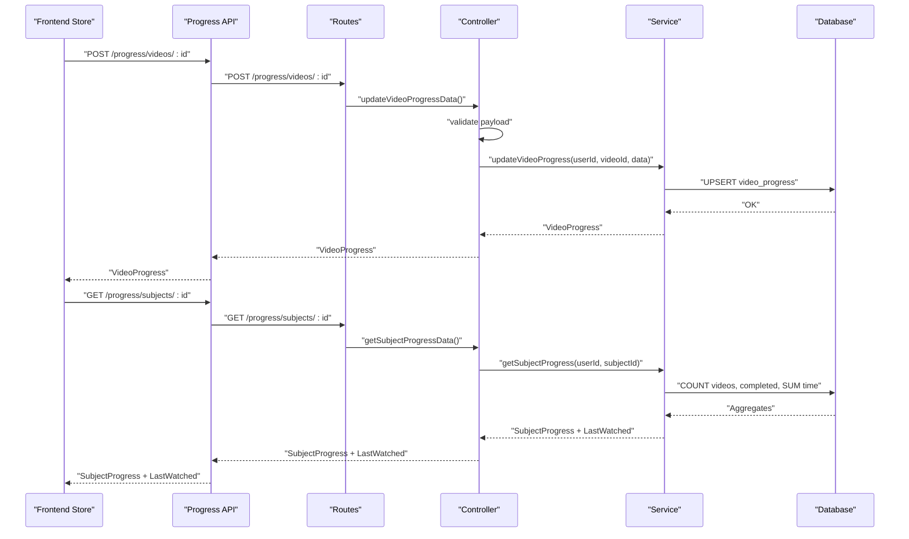
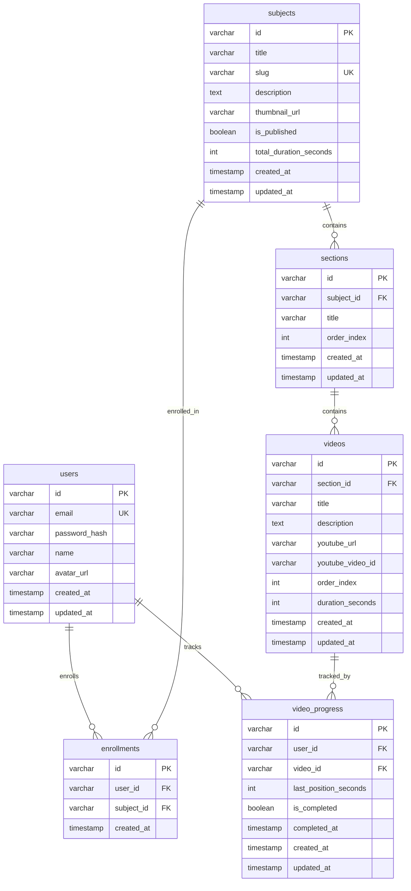
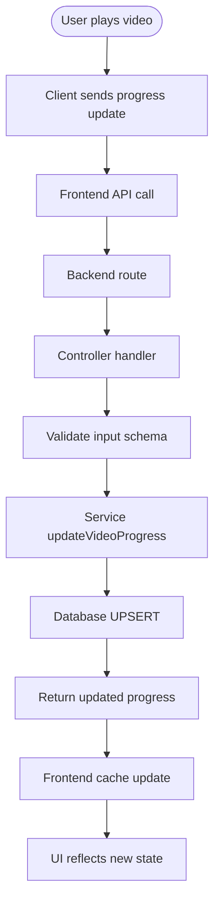

# Enrollment and Progress Schema

<cite>
**Referenced Files in This Document**
- [005_create_enrollments.sql](file://backend/migrations/005_create_enrollments.sql)
- [006_create_video_progress.sql](file://backend/migrations/006_create_video_progress.sql)
- [001_create_users.sql](file://backend/migrations/001_create_users.sql)
- [002_create_subjects.sql](file://backend/migrations/002_create_subjects.sql)
- [003_create_sections.sql](file://backend/migrations/003_create_sections.sql)
- [004_create_videos.sql](file://backend/migrations/004_create_videos.sql)
- [service.ts](file://backend/src/modules/progress/service.ts)
- [controller.ts](file://backend/src/modules/progress/controller.ts)
- [routes.ts](file://backend/src/modules/progress/routes.ts)
- [validation.ts](file://backend/src/utils/validation.ts)
- [database.ts](file://backend/src/config/database.ts)
- [progressStore.ts](file://frontend/app/store/progressStore.ts)
- [api.ts](file://frontend/app/lib/api.ts)
</cite>

## Table of Contents
1. [Introduction](#introduction)
2. [Project Structure](#project-structure)
3. [Core Components](#core-components)
4. [Architecture Overview](#architecture-overview)
5. [Detailed Component Analysis](#detailed-component-analysis)
6. [Dependency Analysis](#dependency-analysis)
7. [Performance Considerations](#performance-considerations)
8. [Troubleshooting Guide](#troubleshooting-guide)
9. [Conclusion](#conclusion)

## Introduction
This document provides comprehensive data model documentation for the Enrollment and Progress tracking system. It focuses on:
- The enrollments table linking users to courses (subjects)
- The video_progress table tracking individual learning activities
- Many-to-many relationships via the enrollments bridge
- Progress completion criteria and timestamp management
- Enrollment validation rules and progress calculation algorithms
- Completion milestone tracking
- Data flow patterns for progress updates
- Query optimization strategies for large datasets
- Analytics data collection patterns
- Concurrent access handling, progress synchronization, and data consistency guarantees

## Project Structure
The system spans database migrations, backend modules, and frontend stores:
- Database schema is defined via migrations for users, subjects, sections, videos, enrollments, and video_progress
- Backend progress module exposes CRUD and aggregation endpoints
- Frontend progress store manages client-side caching and optimistic updates

```mermaid
graph TB
subgraph "Database"
U["users"]
S["subjects"]
Sec["sections"]
V["videos"]
Enr["enrollments"]
VP["video_progress"]
end
subgraph "Backend"
R["progress routes"]
C["progress controller"]
SV["progress service"]
DB["database config"]
end
subgraph "Frontend"
FS["progress store"]
FA["progress API"]
end
U <- --> Enr
S <- --> Sec
Sec <- --> V
V <- --> VP
Enr <- --> VP
FS --> FA
FA --> R
R --> C
C --> SV
SV --> DB
```

**Diagram sources**
- [001_create_users.sql:1-11](file://backend/migrations/001_create_users.sql#L1-L11)
- [002_create_subjects.sql:1-14](file://backend/migrations/002_create_subjects.sql#L1-L14)
- [003_create_sections.sql:1-11](file://backend/migrations/003_create_sections.sql#L1-L11)
- [004_create_videos.sql:1-15](file://backend/migrations/004_create_videos.sql#L1-L15)
- [005_create_enrollments.sql:1-12](file://backend/migrations/005_create_enrollments.sql#L1-L12)
- [006_create_video_progress.sql:1-16](file://backend/migrations/006_create_video_progress.sql#L1-L16)
- [routes.ts:1-18](file://backend/src/modules/progress/routes.ts#L1-L18)
- [controller.ts:1-66](file://backend/src/modules/progress/controller.ts#L1-L66)
- [service.ts:1-163](file://backend/src/modules/progress/service.ts#L1-L163)
- [database.ts:1-53](file://backend/src/config/database.ts#L1-L53)
- [progressStore.ts:1-87](file://frontend/app/store/progressStore.ts#L1-L87)
- [api.ts:1-80](file://frontend/app/lib/api.ts#L1-L80)

**Section sources**
- [001_create_users.sql:1-11](file://backend/migrations/001_create_users.sql#L1-L11)
- [002_create_subjects.sql:1-14](file://backend/migrations/002_create_subjects.sql#L1-L14)
- [003_create_sections.sql:1-11](file://backend/migrations/003_create_sections.sql#L1-L11)
- [004_create_videos.sql:1-15](file://backend/migrations/004_create_videos.sql#L1-L15)
- [005_create_enrollments.sql:1-12](file://backend/migrations/005_create_enrollments.sql#L1-L12)
- [006_create_video_progress.sql:1-16](file://backend/migrations/006_create_video_progress.sql#L1-L16)
- [routes.ts:1-18](file://backend/src/modules/progress/routes.ts#L1-L18)
- [controller.ts:1-66](file://backend/src/modules/progress/controller.ts#L1-L66)
- [service.ts:1-163](file://backend/src/modules/progress/service.ts#L1-L163)
- [database.ts:1-53](file://backend/src/config/database.ts#L1-L53)
- [progressStore.ts:1-87](file://frontend/app/store/progressStore.ts#L1-L87)
- [api.ts:1-80](file://frontend/app/lib/api.ts#L1-L80)

## Core Components
- Users: Core entity with unique email and timestamps
- Subjects: Courses with publication flag and metadata
- Sections: Hierarchical grouping under subjects
- Videos: Learning assets linked to sections with ordering and duration
- Enrollments: Bridge table linking users to subjects (many-to-many via join)
- Video Progress: Per-user per-video tracking with completion state and timestamps

Key constraints and indexes:
- Enrollments: Unique constraint on (user_id, subject_id), indexes on user_id and subject_id
- Video Progress: Unique constraint on (user_id, video_id), indexes on user_id and video_id, foreign keys to users and videos

**Section sources**
- [001_create_users.sql:1-11](file://backend/migrations/001_create_users.sql#L1-L11)
- [002_create_subjects.sql:1-14](file://backend/migrations/002_create_subjects.sql#L1-L14)
- [003_create_sections.sql:1-11](file://backend/migrations/003_create_sections.sql#L1-L11)
- [004_create_videos.sql:1-15](file://backend/migrations/004_create_videos.sql#L1-L15)
- [005_create_enrollments.sql:1-12](file://backend/migrations/005_create_enrollments.sql#L1-L12)
- [006_create_video_progress.sql:1-16](file://backend/migrations/006_create_video_progress.sql#L1-L16)

## Architecture Overview
End-to-end flow for progress updates and queries:
- Frontend triggers progress updates via API
- Routes authenticate and delegate to controller
- Controller validates payload and calls service
- Service performs upsert/update and computes derived metrics
- Database enforces referential integrity and uniqueness
- Frontend caches and displays results



**Diagram sources**
- [routes.ts:1-18](file://backend/src/modules/progress/routes.ts#L1-L18)
- [controller.ts:1-66](file://backend/src/modules/progress/controller.ts#L1-L66)
- [service.ts:1-163](file://backend/src/modules/progress/service.ts#L1-L163)
- [database.ts:1-53](file://backend/src/config/database.ts#L1-L53)
- [api.ts:1-80](file://frontend/app/lib/api.ts#L1-L80)
- [progressStore.ts:1-87](file://frontend/app/store/progressStore.ts#L1-L87)

## Detailed Component Analysis

### Data Model: Enrollments and Video Progress
- Enrollments table defines the many-to-many relationship between users and subjects. Uniqueness prevents duplicate enrollments. Indexes support efficient lookups by user and subject.
- Video Progress table tracks per-user progress on per-video items, including last watched position, completion flag, and timestamps. Uniqueness ensures one record per user-video pair.



**Diagram sources**
- [001_create_users.sql:1-11](file://backend/migrations/001_create_users.sql#L1-L11)
- [002_create_subjects.sql:1-14](file://backend/migrations/002_create_subjects.sql#L1-L14)
- [003_create_sections.sql:1-11](file://backend/migrations/003_create_sections.sql#L1-L11)
- [004_create_videos.sql:1-15](file://backend/migrations/004_create_videos.sql#L1-L15)
- [005_create_enrollments.sql:1-12](file://backend/migrations/005_create_enrollments.sql#L1-L12)
- [006_create_video_progress.sql:1-16](file://backend/migrations/006_create_video_progress.sql#L1-L16)

**Section sources**
- [005_create_enrollments.sql:1-12](file://backend/migrations/005_create_enrollments.sql#L1-L12)
- [006_create_video_progress.sql:1-16](file://backend/migrations/006_create_video_progress.sql#L1-L16)

### Enrollment Validation Rules
- Enrollments enforce referential integrity via foreign keys to users and subjects
- Unique constraint on (user_id, subject_id) prevents duplicate enrollments
- Indexes on user_id and subject_id optimize joins and lookups
- On delete cascade ensures cleanup when users or subjects are removed

Practical implications:
- Enrollment creation must validate that the user exists and the subject exists
- Duplicate enrollment attempts are rejected by the unique constraint
- Queries filtering by user or subject benefit from dedicated indexes

**Section sources**
- [005_create_enrollments.sql:1-12](file://backend/migrations/005_create_enrollments.sql#L1-L12)
- [001_create_users.sql:1-11](file://backend/migrations/001_create_users.sql#L1-L11)
- [002_create_subjects.sql:1-14](file://backend/migrations/002_create_subjects.sql#L1-L14)

### Progress Completion Criteria and Timestamp Management
- Completion flag is set to true when the client indicates completion and the existing record is not already completed
- completed_at timestamp is set upon first completion
- updated_at timestamp is refreshed on any update
- created_at timestamp captures initial record creation

Validation and safety:
- The service checks existing state before updating completion to avoid unnecessary writes
- If no record exists, a new one is inserted with defaults and optional completion timestamp

**Section sources**
- [006_create_video_progress.sql:1-16](file://backend/migrations/006_create_video_progress.sql#L1-L16)
- [service.ts:30-85](file://backend/src/modules/progress/service.ts#L30-L85)

### Progress Calculation Algorithms
- Subject progress aggregates:
  - Total videos: count of videos in a subject via inner join with sections
  - Completed videos: count of video_progress records with is_completed = true for the user and subject
  - Progress percentage: rounded completion ratio
  - Total time spent: sum of last_position_seconds for the user and subject
- Last watched video: most recently updated video_progress record for the user and subject

Concurrency and correctness:
- Aggregations rely on consistent reads; completion flag and timestamps are managed atomically by the service
- Subject progress computation is performed per subject and can be batched for all enrolled subjects

**Section sources**
- [service.ts:87-162](file://backend/src/modules/progress/service.ts#L87-L162)

### Data Flow Patterns for Progress Updates
- Frontend store actions trigger API calls to fetch or update progress
- API layer maps to backend routes, which call controller handlers
- Controllers validate inputs using Zod schemas and delegate to service
- Service encapsulates SQL logic and returns typed results
- Frontend caches results in memory for fast UI updates



**Diagram sources**
- [progressStore.ts:1-87](file://frontend/app/store/progressStore.ts#L1-L87)
- [api.ts:1-80](file://frontend/app/lib/api.ts#L1-L80)
- [routes.ts:1-18](file://backend/src/modules/progress/routes.ts#L1-L18)
- [controller.ts:1-66](file://backend/src/modules/progress/controller.ts#L1-L66)
- [validation.ts:14-17](file://backend/src/utils/validation.ts#L14-L17)
- [service.ts:30-85](file://backend/src/modules/progress/service.ts#L30-L85)

**Section sources**
- [progressStore.ts:1-87](file://frontend/app/store/progressStore.ts#L1-L87)
- [api.ts:1-80](file://frontend/app/lib/api.ts#L1-L80)
- [routes.ts:1-18](file://backend/src/modules/progress/routes.ts#L1-L18)
- [controller.ts:1-66](file://backend/src/modules/progress/controller.ts#L1-L66)
- [validation.ts:14-17](file://backend/src/utils/validation.ts#L14-L17)
- [service.ts:30-85](file://backend/src/modules/progress/service.ts#L30-L85)

### Query Optimization for Large Datasets
- Use indexes on foreign keys and frequently filtered columns:
  - enrollments: user_id, subject_id
  - video_progress: user_id, video_id
- Prefer selective filters with joins to limit scanned rows
- Batch aggregations per subject to reduce round trips
- Consider partitioning or materialized summaries for very large workloads (not present in current schema)

**Section sources**
- [005_create_enrollments.sql:9-11](file://backend/migrations/005_create_enrollments.sql#L9-L11)
- [006_create_video_progress.sql:12-15](file://backend/migrations/006_create_video_progress.sql#L12-L15)
- [service.ts:87-162](file://backend/src/modules/progress/service.ts#L87-L162)

### Analytics Data Collection
- Time spent aggregation: sum of last_position_seconds per subject per user
- Completion tracking: counts of completed videos per subject per user
- Recent activity: last watched video by most recent updated_at
- These metrics are computed on demand and cached in the frontend store

**Section sources**
- [service.ts:112-152](file://backend/src/modules/progress/service.ts#L112-L152)
- [progressStore.ts:1-87](file://frontend/app/store/progressStore.ts#L1-L87)

### Concurrent Access Handling and Data Consistency
- Database-level safeguards:
  - Unique constraints prevent duplicate enrollments and per-user per-video records
  - Foreign keys maintain referential integrity
- Application-level safeguards:
  - Service checks existing state before updating completion to avoid race conditions
  - Atomic updates via single SQL statements minimize window for inconsistencies
- Transaction support:
  - Database wrapper supports transactions for multi-statement consistency if needed

**Section sources**
- [005_create_enrollments.sql:8-11](file://backend/migrations/005_create_enrollments.sql#L8-L11)
- [006_create_video_progress.sql:12-15](file://backend/migrations/006_create_video_progress.sql#L12-L15)
- [service.ts:30-85](file://backend/src/modules/progress/service.ts#L30-L85)
- [database.ts:31-45](file://backend/src/config/database.ts#L31-L45)

## Dependency Analysis
- Backend routes depend on controller handlers
- Controllers depend on service functions and validation schemas
- Services depend on database configuration and perform SQL queries
- Frontend store depends on API layer; API layer depends on backend routes


**Diagram sources**
- [routes.ts:1-18](file://backend/src/modules/progress/routes.ts#L1-L18)
- [controller.ts:1-66](file://backend/src/modules/progress/controller.ts#L1-L66)
- [service.ts:1-163](file://backend/src/modules/progress/service.ts#L1-L163)
- [database.ts:1-53](file://backend/src/config/database.ts#L1-L53)
- [progressStore.ts:1-87](file://frontend/app/store/progressStore.ts#L1-L87)
- [api.ts:1-80](file://frontend/app/lib/api.ts#L1-L80)

**Section sources**
- [routes.ts:1-18](file://backend/src/modules/progress/routes.ts#L1-L18)
- [controller.ts:1-66](file://backend/src/modules/progress/controller.ts#L1-L66)
- [service.ts:1-163](file://backend/src/modules/progress/service.ts#L1-L163)
- [database.ts:1-53](file://backend/src/config/database.ts#L1-L53)
- [progressStore.ts:1-87](file://frontend/app/store/progressStore.ts#L1-L87)
- [api.ts:1-80](file://frontend/app/lib/api.ts#L1-L80)

## Performance Considerations
- Index utilization: leverage existing indexes on user_id and subject_id for enrollments, and user_id and video_id for video_progress
- Aggregation efficiency: compute subject progress in batches and cache results in the frontend store
- Connection pooling: configured pool with connection limits and keep-alive to handle concurrent requests
- Optional improvements: consider summary tables or periodic materialized views for heavy analytics workloads

[No sources needed since this section provides general guidance]

## Troubleshooting Guide
- Authentication failures: ensure requests include proper authentication middleware and user context
- Validation errors: verify payload conforms to progressUpdateSchema before sending to backend
- Missing data: confirm user is enrolled in the subject and the video belongs to the subject’s sections
- Concurrency anomalies: rely on database constraints and service-level checks to prevent inconsistent states

**Section sources**
- [controller.ts:12-65](file://backend/src/modules/progress/controller.ts#L12-L65)
- [validation.ts:14-17](file://backend/src/utils/validation.ts#L14-L17)
- [service.ts:30-85](file://backend/src/modules/progress/service.ts#L30-L85)

## Conclusion
The Enrollment and Progress schema establishes robust many-to-many relationships between users and subjects via enrollments, and precise per-user per-video progress tracking through video_progress. The backend service enforces safe updates, computes meaningful analytics, and integrates cleanly with the frontend store. With appropriate indexing and connection pooling, the system scales to moderate workloads while maintaining data consistency and user experience.