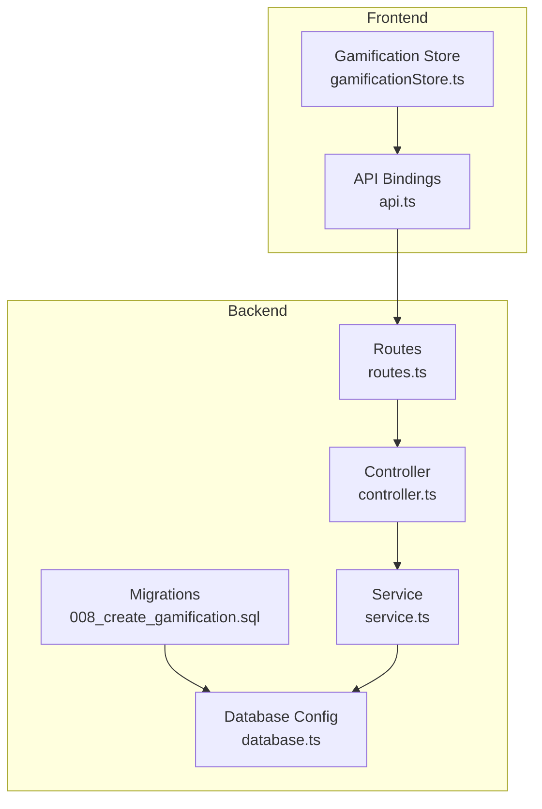
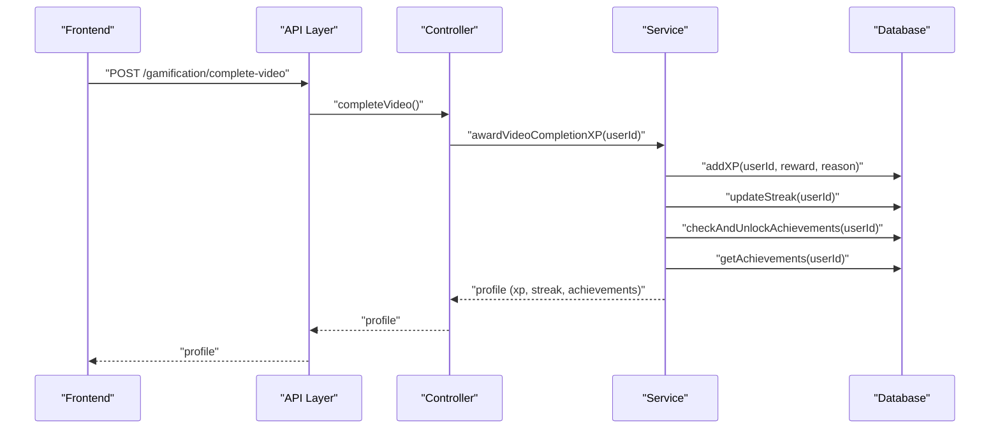
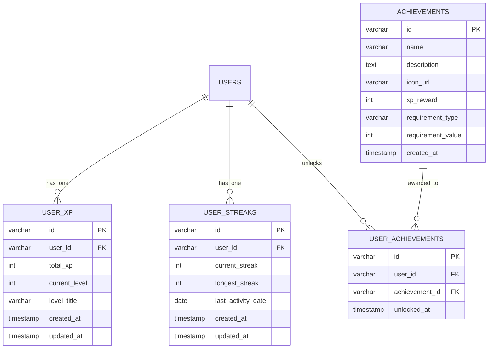
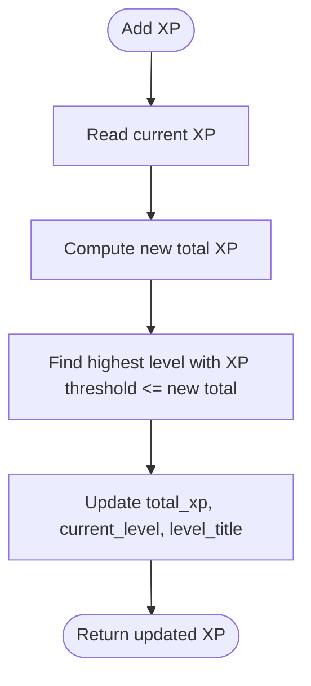
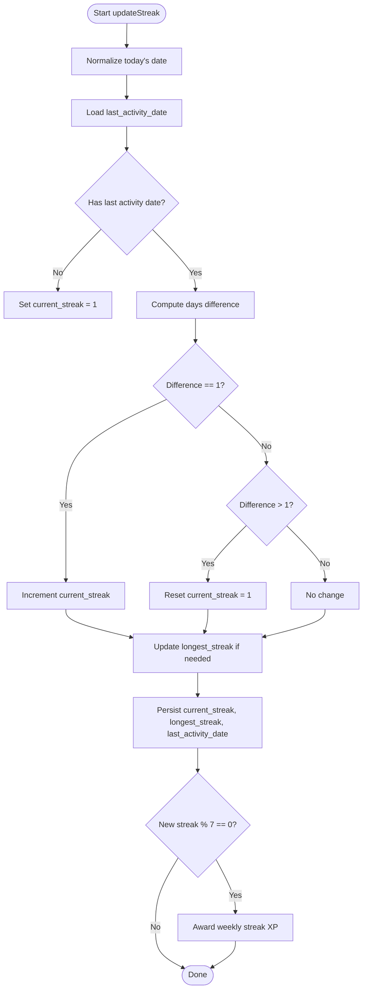
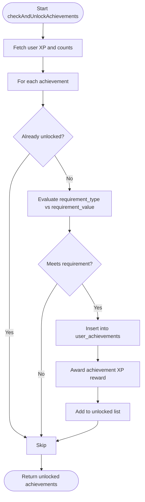
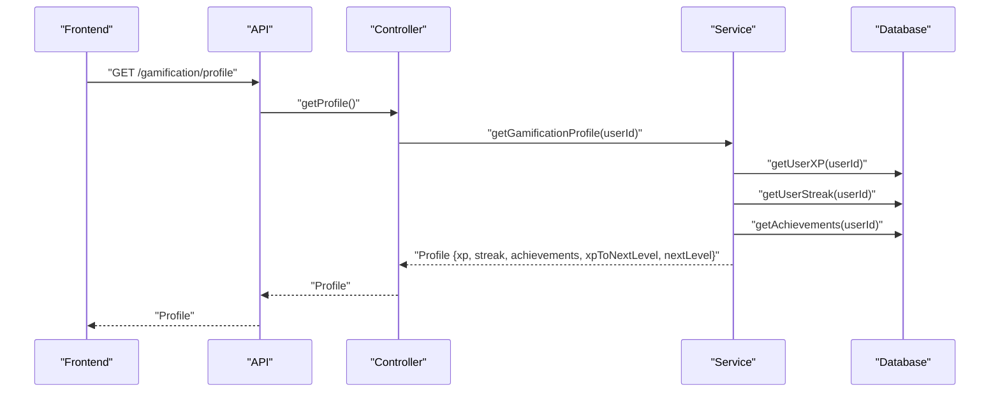
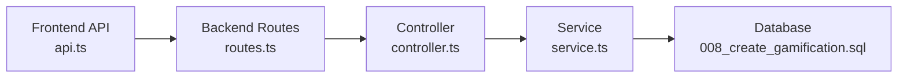
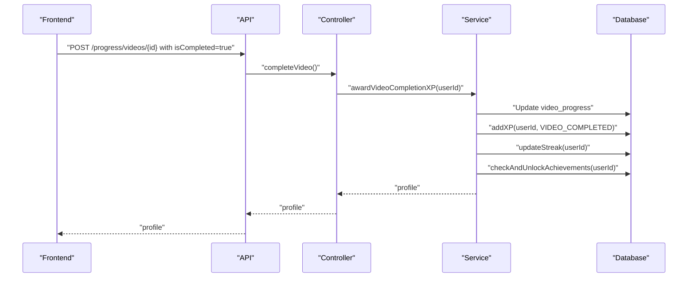
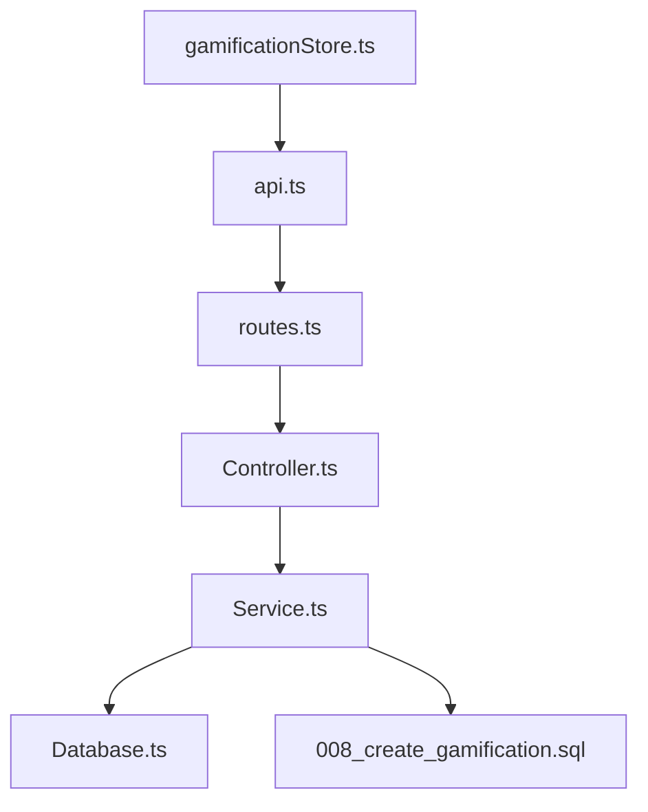

# Gamification Schema

<cite>
**Referenced Files in This Document**
- [008_create_gamification.sql](file://backend/migrations/008_create_gamification.sql)
- [controller.ts](file://backend/src/modules/gamification/controller.ts)
- [service.ts](file://backend/src/modules/gamification/service.ts)
- [routes.ts](file://backend/src/modules/gamification/routes.ts)
- [gamificationStore.ts](file://frontend/app/store/gamificationStore.ts)
- [api.ts](file://frontend/app/lib/api.ts)
- [progress.service.ts](file://backend/src/modules/progress/service.ts)
- [videos.service.ts](file://backend/src/modules/videos/service.ts)
- [database.ts](file://backend/src/config/database.ts)
</cite>

## Table of Contents
1. [Introduction](#introduction)
2. [Project Structure](#project-structure)
3. [Core Components](#core-components)
4. [Architecture Overview](#architecture-overview)
5. [Detailed Component Analysis](#detailed-component-analysis)
6. [Dependency Analysis](#dependency-analysis)
7. [Performance Considerations](#performance-considerations)
8. [Troubleshooting Guide](#troubleshooting-guide)
9. [Conclusion](#conclusion)
10. [Appendices](#appendices)

## Introduction
This document provides comprehensive data model documentation for the Gamification system. It covers the schema for tracking XP points, achievements, streaks, and user milestones; describes point accumulation algorithms, achievement unlock conditions, and streak calculation logic; explains gamification mechanics, reward systems, and progress visualization data; and documents data models for badges, leaderboards, and performance metrics. It also addresses scoring algorithms, fairness considerations, anti-gaming measures, and integration with learning progress data and user engagement analytics.

## Project Structure
The gamification system spans backend database migrations, service logic, controllers, and frontend state management and API bindings. The backend exposes REST endpoints for gamification data retrieval and actions, while the frontend integrates these APIs into a Zustand store for reactive UI updates.

**Diagram sources**
- [008_create_gamification.sql:1-64](file://backend/migrations/008_create_gamification.sql#L1-L64)
- [controller.ts:1-62](file://backend/src/modules/gamification/controller.ts#L1-L62)
- [service.ts:1-246](file://backend/src/modules/gamification/service.ts#L1-L246)
- [routes.ts:1-18](file://backend/src/modules/gamification/routes.ts#L1-L18)
- [database.ts:1-53](file://backend/src/config/database.ts#L1-L53)
- [gamificationStore.ts:1-86](file://frontend/app/store/gamificationStore.ts#L1-L86)
- [api.ts:54-64](file://frontend/app/lib/api.ts#L54-L64)

**Section sources**
- [008_create_gamification.sql:1-64](file://backend/migrations/008_create_gamification.sql#L1-L64)
- [controller.ts:1-62](file://backend/src/modules/gamification/controller.ts#L1-L62)
- [service.ts:1-246](file://backend/src/modules/gamification/service.ts#L1-L246)
- [routes.ts:1-18](file://backend/src/modules/gamification/routes.ts#L1-L18)
- [gamificationStore.ts:1-86](file://frontend/app/store/gamificationStore.ts#L1-L86)
- [api.ts:54-64](file://frontend/app/lib/api.ts#L54-L64)

## Core Components
- Gamification data model: user XP, daily streaks, achievements, and learning time tracking.
- Backend service layer: XP accumulation, streak calculation, achievement checks, and profile composition.
- Frontend integration: API bindings and state management for gamification data.

Key backend data models and their relationships:
- user_xp: Tracks total XP, current level, and level title per user.
- user_streaks: Tracks current and longest streaks and last activity date per user.
- achievements: Defines badge criteria (type and value) and XP rewards.
- user_achievements: Records unlocked achievements per user.
- learning_time: Tracks daily seconds spent learning per user.

**Section sources**
- [008_create_gamification.sql:1-64](file://backend/migrations/008_create_gamification.sql#L1-L64)
- [service.ts:3-24](file://backend/src/modules/gamification/service.ts#L3-L24)

## Architecture Overview
The gamification workflow integrates learning progress with XP and streak calculations, achievement unlocking, and profile aggregation.

**Diagram sources**
- [routes.ts:12-15](file://backend/src/modules/gamification/routes.ts#L12-L15)
- [controller.ts:48-61](file://backend/src/modules/gamification/controller.ts#L48-L61)
- [service.ts:239-243](file://backend/src/modules/gamification/service.ts#L239-L243)
- [008_create_gamification.sql:1-64](file://backend/migrations/008_create_gamification.sql#L1-L64)

## Detailed Component Analysis

### Data Model: Gamification Tables
- user_xp
  - Fields: id, user_id (FK), total_xp, current_level, level_title, timestamps.
  - Purpose: Per-user XP and level state.
- user_streaks
  - Fields: id, user_id (FK), current_streak, longest_streak, last_activity_date, timestamps.
  - Purpose: Daily streak tracking and history.
- achievements
  - Fields: id, name, description, icon_url, xp_reward, requirement_type, requirement_value, timestamps.
  - Purpose: Define unlockable badges and criteria.
- user_achievements
  - Fields: id, user_id (FK), achievement_id (FK), unlocked_at.
  - Purpose: Track which achievements each user has unlocked.
- learning_time
  - Fields: id, user_id (FK), date, seconds_spent, timestamps.
  - Purpose: Daily learning time for analytics and streaks.

**Diagram sources**
- [008_create_gamification.sql:2-63](file://backend/migrations/008_create_gamification.sql#L2-L63)

**Section sources**
- [008_create_gamification.sql:1-64](file://backend/migrations/008_create_gamification.sql#L1-L64)

### XP Accumulation and Leveling
- XP rewards are defined centrally and applied via service methods.
- Level thresholds are stored as a ranked list with titles and XP requirements.
- On XP addition, the service recalculates the user’s level and title, persisting the new state.

**Diagram sources**
- [service.ts:61-87](file://backend/src/modules/gamification/service.ts#L61-L87)
- [service.ts:26-36](file://backend/src/modules/gamification/service.ts#L26-L36)

**Section sources**
- [service.ts:38-45](file://backend/src/modules/gamification/service.ts#L38-L45)
- [service.ts:47-87](file://backend/src/modules/gamification/service.ts#L47-L87)
- [service.ts:26-36](file://backend/src/modules/gamification/service.ts#L26-L36)

### Streak Calculation Logic
- Daily streaks are computed based on the last activity date.
- Consecutive-day increments, non-consecutive resets to 1, same-day no-op.
- Longest streak is updated when current streak exceeds it.
- Weekly milestone streaks trigger bonus XP awards.

**Diagram sources**
- [service.ts:103-148](file://backend/src/modules/gamification/service.ts#L103-L148)

**Section sources**
- [service.ts:103-148](file://backend/src/modules/gamification/service.ts#L103-L148)

### Achievement Unlock Conditions
- Achievements are evaluated against three criteria:
  - Total XP threshold.
  - Number of completed videos.
  - Number of completed courses.
- Unlocks are persisted in user_achievements with associated XP rewards.

**Diagram sources**
- [service.ts:161-216](file://backend/src/modules/gamification/service.ts#L161-L216)

**Section sources**
- [service.ts:150-216](file://backend/src/modules/gamification/service.ts#L150-L216)

### Profile Composition and Progress Visualization
- The profile endpoint aggregates XP, streaks, achievements, and computes XP to next level and next level metadata.
- Frontend store consumes this aggregated profile to render progress visualization.

**Diagram sources**
- [routes.ts](file://backend/src/modules/gamification/routes.ts#L12)
- [controller.ts:11-19](file://backend/src/modules/gamification/controller.ts#L11-L19)
- [service.ts:218-237](file://backend/src/modules/gamification/service.ts#L218-L237)
- [gamificationStore.ts:49-67](file://frontend/app/store/gamificationStore.ts#L49-L67)

**Section sources**
- [service.ts:218-237](file://backend/src/modules/gamification/service.ts#L218-L237)
- [controller.ts:11-19](file://backend/src/modules/gamification/controller.ts#L11-L19)
- [gamificationStore.ts:49-67](file://frontend/app/store/gamificationStore.ts#L49-L67)

### API Endpoints and Frontend Integration
- Backend routes expose:
  - GET /gamification/profile
  - GET /gamification/achievements
  - POST /gamification/xp/earn
  - POST /gamification/complete-video
- Frontend API bindings and store actions mirror these endpoints to manage state reactively.

**Diagram sources**
- [api.ts:54-64](file://frontend/app/lib/api.ts#L54-L64)
- [routes.ts:12-15](file://backend/src/modules/gamification/routes.ts#L12-L15)
- [controller.ts:11-61](file://backend/src/modules/gamification/controller.ts#L11-L61)
- [service.ts:1-246](file://backend/src/modules/gamification/service.ts#L1-L246)
- [008_create_gamification.sql:1-64](file://backend/migrations/008_create_gamification.sql#L1-L64)

**Section sources**
- [routes.ts:1-18](file://backend/src/modules/gamification/routes.ts#L1-L18)
- [controller.ts:1-62](file://backend/src/modules/gamification/controller.ts#L1-L62)
- [api.ts:54-64](file://frontend/app/lib/api.ts#L54-L64)
- [gamificationStore.ts:1-86](file://frontend/app/store/gamificationStore.ts#L1-L86)

### Integration with Learning Progress Data
- Video completion triggers XP award and streak update.
- Course completion is inferred from video progress totals per subject.
- Learning time tracking supports daily analytics and streak continuity.

**Diagram sources**
- [progress.service.ts:30-85](file://backend/src/modules/progress/service.ts#L30-L85)
- [service.ts:239-243](file://backend/src/modules/gamification/service.ts#L239-L243)
- [videos.service.ts:97-159](file://backend/src/modules/videos/service.ts#L97-L159)

**Section sources**
- [progress.service.ts:30-85](file://backend/src/modules/progress/service.ts#L30-L85)
- [service.ts:239-243](file://backend/src/modules/gamification/service.ts#L239-L243)
- [videos.service.ts:97-159](file://backend/src/modules/videos/service.ts#L97-L159)

## Dependency Analysis
- Controllers depend on service methods for gamification logic.
- Services depend on database queries and shared constants (XP rewards, levels).
- Frontend store depends on API bindings to drive UI updates.
- Database schema defines foreign keys and indexes supporting referential integrity and query performance.

**Diagram sources**
- [controller.ts:1-62](file://backend/src/modules/gamification/controller.ts#L1-L62)
- [service.ts:1-246](file://backend/src/modules/gamification/service.ts#L1-L246)
- [database.ts:1-53](file://backend/src/config/database.ts#L1-L53)
- [008_create_gamification.sql:1-64](file://backend/migrations/008_create_gamification.sql#L1-L64)
- [gamificationStore.ts:1-86](file://frontend/app/store/gamificationStore.ts#L1-L86)
- [api.ts:54-64](file://frontend/app/lib/api.ts#L54-L64)
- [routes.ts:1-18](file://backend/src/modules/gamification/routes.ts#L1-L18)

**Section sources**
- [controller.ts:1-62](file://backend/src/modules/gamification/controller.ts#L1-L62)
- [service.ts:1-246](file://backend/src/modules/gamification/service.ts#L1-L246)
- [database.ts:1-53](file://backend/src/config/database.ts#L1-L53)
- [008_create_gamification.sql:1-64](file://backend/migrations/008_create_gamification.sql#L1-L64)
- [gamificationStore.ts:1-86](file://frontend/app/store/gamificationStore.ts#L1-L86)
- [api.ts:54-64](file://frontend/app/lib/api.ts#L54-L64)
- [routes.ts:1-18](file://backend/src/modules/gamification/routes.ts#L1-L18)

## Performance Considerations
- Indexes on user_id and date improve lookup performance for streaks and daily time tracking.
- Aggregated profile retrieval uses concurrent queries to minimize latency.
- Achievement checks iterate all achievements; consider caching or pre-filtering if the number grows large.
- Streak computation normalizes dates to avoid time-of-day drift.

[No sources needed since this section provides general guidance]

## Troubleshooting Guide
- Authentication failures: Controllers return unauthorized when req.user is missing.
- Invalid XP amounts: Earning XP requires a positive amount.
- Achievement unlock errors: Ensure requirement_type matches supported values and requirement_value is met.
- Streak anomalies: Verify last_activity_date normalization and timezone handling.

**Section sources**
- [controller.ts:11-19](file://backend/src/modules/gamification/controller.ts#L11-L19)
- [controller.ts:31-46](file://backend/src/modules/gamification/controller.ts#L31-L46)
- [service.ts:103-148](file://backend/src/modules/gamification/service.ts#L103-L148)

## Conclusion
The gamification system integrates XP, streaks, and achievements with learning progress to create a cohesive reward loop. Its modular design separates concerns across controllers, services, and stores, enabling maintainability and scalability. The schema and algorithms emphasize simplicity, transparency, and extensibility for future enhancements like leaderboards and advanced analytics.

[No sources needed since this section summarizes without analyzing specific files]

## Appendices

### Scoring Algorithms and Fairness
- Scoring is deterministic and based on explicit XP rewards and thresholds.
- Fairness is ensured by:
  - Clear requirement types for achievements.
  - Idempotent streak updates (same-day no-op).
  - Centralized XP reward constants for consistency.

**Section sources**
- [service.ts:38-45](file://backend/src/modules/gamification/service.ts#L38-L45)
- [service.ts:26-36](file://backend/src/modules/gamification/service.ts#L26-L36)

### Anti-Gaming Measures
- Streak resets on non-consecutive days prevent artificial inflation.
- Achievement unlocks require meeting explicit thresholds.
- Manual XP awards are validated for positive amounts.

**Section sources**
- [service.ts:115-127](file://backend/src/modules/gamification/service.ts#L115-L127)
- [controller.ts:37-42](file://backend/src/modules/gamification/controller.ts#L37-L42)

### Leaderboards and Performance Metrics
- Current schema supports per-user XP and streaks.
- Leaderboards can be derived by ordering user_xp entries; implement at query-time with pagination and optional filters.
- Performance metrics can leverage learning_time and video_progress for insights like average daily study time and completion rates.

**Section sources**
- [008_create_gamification.sql:51-63](file://backend/migrations/008_create_gamification.sql#L51-L63)
- [progress.service.ts:87-130](file://backend/src/modules/progress/service.ts#L87-L130)