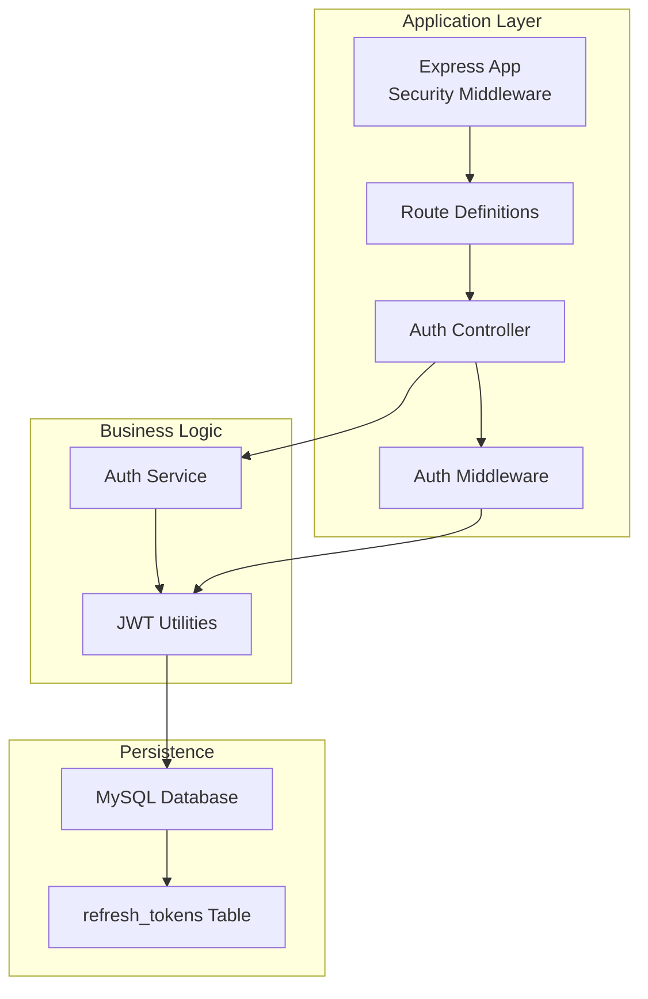
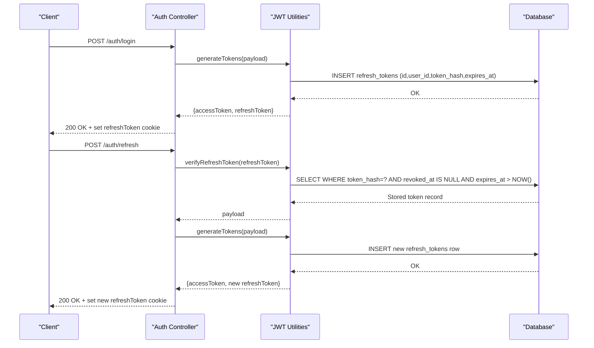
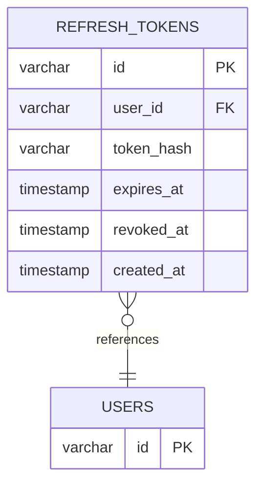
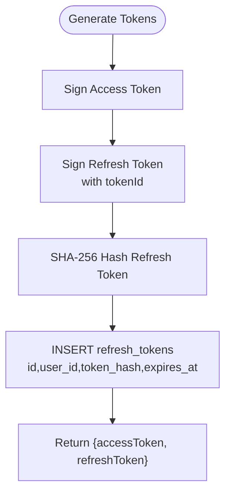
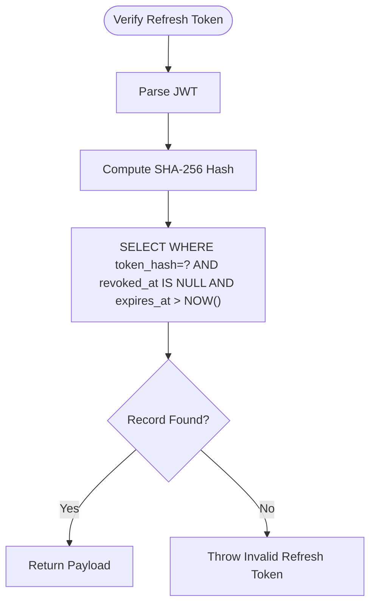
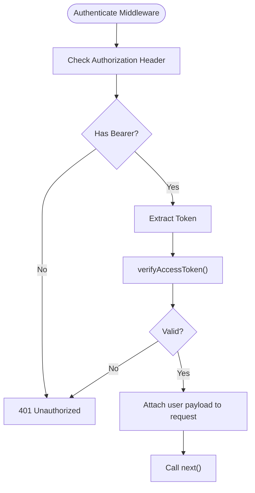
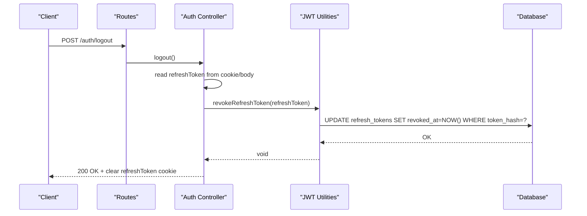
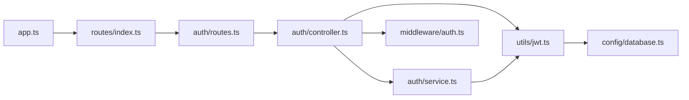

# System Security Schema

<cite>
**Referenced Files in This Document**
- [007_create_refresh_tokens.sql](file://backend/migrations/007_create_refresh_tokens.sql)
- [jwt.ts](file://backend/src/utils/jwt.ts)
- [auth.ts](file://backend/src/middleware/auth.ts)
- [controller.ts](file://backend/src/modules/auth/controller.ts)
- [service.ts](file://backend/src/modules/auth/service.ts)
- [app.ts](file://backend/src/app.ts)
- [routes.ts](file://backend/src/modules/auth/routes.ts)
- [database.ts](file://backend/src/config/database.ts)
- [password.ts](file://backend/src/utils/password.ts)
- [validation.ts](file://backend/src/utils/validation.ts)
- [index.ts](file://backend/src/routes/index.ts)
</cite>

## Table of Contents
1. [Introduction](#introduction)
2. [Project Structure](#project-structure)
3. [Core Components](#core-components)
4. [Architecture Overview](#architecture-overview)
5. [Detailed Component Analysis](#detailed-component-analysis)
6. [Dependency Analysis](#dependency-analysis)
7. [Performance Considerations](#performance-considerations)
8. [Troubleshooting Guide](#troubleshooting-guide)
9. [Conclusion](#conclusion)
10. [Appendices](#appendices)

## Introduction
This document provides comprehensive data model documentation for the System Security and Authentication subsystem. It focuses on the refresh_tokens table structure and its role in secure token management, including token rotation, expiration handling, and revocation mechanisms. It also documents security best practices for token storage, encryption requirements, and audit logging, along with lifecycle management, session invalidation procedures, breach detection, validation workflows, rate limiting, and protection against token theft. Compliance and data retention considerations are addressed alongside secure deletion procedures.

## Project Structure
The authentication and security logic is organized around:
- Database migration defining the refresh_tokens table
- Utility functions for JWT generation, verification, and revocation
- Middleware for access token validation
- Controller and service layers implementing registration, login, refresh, logout, and profile retrieval
- Application-level security middleware including rate limiting and CORS/HSTS
- Route definitions binding endpoints to controller actions

**Diagram sources**
- [app.ts:11-53](file://backend/src/app.ts#L11-L53)
- [routes.ts:1-15](file://backend/src/modules/auth/routes.ts#L1-L15)
- [controller.ts:1-99](file://backend/src/modules/auth/controller.ts#L1-L99)
- [service.ts:1-108](file://backend/src/modules/auth/service.ts#L1-L108)
- [jwt.ts:1-78](file://backend/src/utils/jwt.ts#L1-L78)
- [007_create_refresh_tokens.sql:1-13](file://backend/migrations/007_create_refresh_tokens.sql#L1-L13)

**Section sources**
- [app.ts:1-54](file://backend/src/app.ts#L1-L54)
- [routes.ts:1-25](file://backend/src/routes/index.ts#L1-L25)
- [controller.ts:1-99](file://backend/src/modules/auth/controller.ts#L1-L99)
- [service.ts:1-108](file://backend/src/modules/auth/service.ts#L1-L108)
- [jwt.ts:1-78](file://backend/src/utils/jwt.ts#L1-L78)
- [007_create_refresh_tokens.sql:1-13](file://backend/migrations/007_create_refresh_tokens.sql#L1-L13)

## Core Components
- refresh_tokens table: Stores hashed refresh tokens with user associations, expiration, revocation timestamps, and creation metadata.
- JWT utilities: Generate access and refresh tokens, persist refresh token hashes, verify tokens, and revoke tokens.
- Auth controller: Implements registration, login, refresh, logout, and logout-all flows with cookie-based refresh token handling.
- Auth middleware: Validates access tokens from Authorization headers.
- Rate limiting: Enforces global and authentication-specific limits to mitigate brute force and abuse.
- Validation and password utilities: Enforce input validation and secure password hashing.

**Section sources**
- [007_create_refresh_tokens.sql:1-13](file://backend/migrations/007_create_refresh_tokens.sql#L1-L13)
- [jwt.ts:15-78](file://backend/src/utils/jwt.ts#L15-L78)
- [controller.ts:18-70](file://backend/src/modules/auth/controller.ts#L18-L70)
- [auth.ts:8-24](file://backend/src/middleware/auth.ts#L8-L24)
- [app.ts:22-37](file://backend/src/app.ts#L22-L37)
- [validation.ts:3-12](file://backend/src/utils/validation.ts#L3-L12)
- [password.ts:1-12](file://backend/src/utils/password.ts#L1-L12)

## Architecture Overview
The authentication architecture integrates HTTP-only cookies for refresh tokens, short-lived access tokens, and database-backed revocation checks. Access tokens are validated via middleware, while refresh tokens are verified against hashed entries in the database with expiration and revocation constraints.

**Diagram sources**
- [controller.ts:18-70](file://backend/src/modules/auth/controller.ts#L18-L70)
- [jwt.ts:20-62](file://backend/src/utils/jwt.ts#L20-L62)
- [007_create_refresh_tokens.sql:1-13](file://backend/migrations/007_create_refresh_tokens.sql#L1-L13)

## Detailed Component Analysis

### Refresh Tokens Data Model
The refresh_tokens table enforces secure token management through:
- Primary key id: Unique identifier for each refresh token row
- user_id: Foreign key linking to users with cascade delete
- token_hash: SHA-256 hash of the refresh token value for secure lookup
- expires_at: Timestamp marking token expiration
- revoked_at: Timestamp marking revocation; NULL indicates unrevoked
- created_at: Audit timestamp for record creation

Indexing strategy:
- Index on token_hash for fast revocation and verification checks
- Index on user_id for efficient per-user token queries
- Index on expires_at for cleanup and expiration scans

**Diagram sources**
- [007_create_refresh_tokens.sql:1-13](file://backend/migrations/007_create_refresh_tokens.sql#L1-L13)

**Section sources**
- [007_create_refresh_tokens.sql:1-13](file://backend/migrations/007_create_refresh_tokens.sql#L1-L13)

### Token Generation and Storage Workflow
- Access tokens are short-lived and validated by middleware.
- Refresh tokens are long-lived but stored as SHA-256 hashes in the database.
- On issuance, a new refresh_tokens row is inserted with an expiration date.
- Subsequent refresh requests verify the hashed token, ensure it is unrevoked and not expired, then issue a new pair.

**Diagram sources**
- [jwt.ts:20-41](file://backend/src/utils/jwt.ts#L20-L41)
- [007_create_refresh_tokens.sql:1-13](file://backend/migrations/007_create_refresh_tokens.sql#L1-L13)

**Section sources**
- [jwt.ts:20-41](file://backend/src/utils/jwt.ts#L20-L41)
- [jwt.ts:35-38](file://backend/src/utils/jwt.ts#L35-L38)

### Token Verification and Revocation
Verification logic:
- Verify JWT signature
- Compute SHA-256 hash of the provided refresh token
- Query refresh_tokens where token_hash matches, revoked_at is NULL, and expires_at is in the future
- On success, return the token payload; otherwise, reject the request

Revocation mechanisms:
- Single-token revocation updates revoked_at for a given token hash
- All-tokens-for-user revocation updates revoked_at for all unrevoked tokens of a user

**Diagram sources**
- [jwt.ts:47-62](file://backend/src/utils/jwt.ts#L47-L62)
- [jwt.ts:64-77](file://backend/src/utils/jwt.ts#L64-L77)

**Section sources**
- [jwt.ts:47-62](file://backend/src/utils/jwt.ts#L47-L62)
- [jwt.ts:64-77](file://backend/src/utils/jwt.ts#L64-L77)

### Access Token Validation Middleware
- Extracts Authorization header, validates Bearer scheme
- Verifies access token signature
- Attaches decoded payload to request for downstream handlers

**Diagram sources**
- [auth.ts:8-24](file://backend/src/middleware/auth.ts#L8-L24)

**Section sources**
- [auth.ts:8-24](file://backend/src/middleware/auth.ts#L8-L24)

### Authentication Endpoints and Cookie Handling
Endpoints:
- POST /auth/register: Validates input and creates user
- POST /auth/login: Authenticates user, generates tokens, sets HTTP-only refresh cookie
- POST /auth/logout: Revokes current refresh token and clears cookie
- POST /auth/refresh: Accepts refresh token, verifies, issues new tokens, updates cookie
- GET /auth/me: Protected by access token middleware
- POST /auth/logout-all: Revokes all tokens for the authenticated user

**Diagram sources**
- [routes.ts:7-12](file://backend/src/modules/auth/routes.ts#L7-L12)
- [controller.ts:37-46](file://backend/src/modules/auth/controller.ts#L37-L46)
- [jwt.ts:64-70](file://backend/src/utils/jwt.ts#L64-L70)

**Section sources**
- [controller.ts:18-70](file://backend/src/modules/auth/controller.ts#L18-L70)
- [routes.ts:7-12](file://backend/src/modules/auth/routes.ts#L7-L12)

### Security Best Practices for Token Storage and Encryption
- Store only hashed refresh tokens in the database to prevent plaintext exposure during queries.
- Use HTTP-only, SameSite strict, and secure cookies for refresh tokens to mitigate XSS and CSRF risks.
- Enforce short-lived access tokens and long-lived refresh tokens with robust revocation controls.
- Rotate refresh tokens on each refresh to limit reuse windows.
- Apply cryptographic randomness for token identifiers and secure secret management for signing keys.

[No sources needed since this section provides general guidance]

### Audit Logging and Breach Detection
Recommended audit logging entries:
- Token issuance events with user_id, token_hash fingerprint, and timestamps
- Token verification attempts with outcomes and timestamps
- Revocation events with user_id, token_hash, and timestamps
- Logout and logout-all actions with timestamps

Breach detection signals:
- Multiple failed verification attempts for the same token_hash
- Concurrent sessions for the same user_id with conflicting token hashes
- Expired tokens being presented after expiry_date
- Rapid successive refresh cycles indicating potential theft

[No sources needed since this section provides general guidance]

### Token Lifecycle Management
- Issuance: Generate access and refresh tokens; persist refresh token hash with expiration
- Rotation: On refresh, invalidate previous refresh token hash and insert a new one
- Expiration: Enforce expiration checks during verification; prune expired rows periodically
- Revocation: Immediate revocation via database updates; logout clears cookies
- Cleanup: Periodic cleanup of expired and revoked refresh tokens

[No sources needed since this section provides general guidance]

### Session Invalidation Procedures
- Single-device logout: Revoke current refresh token and clear cookie
- Multi-device logout: Revoke all unrevoked refresh tokens for the user
- Forced logout: Admin-triggered revocation of user’s tokens

[No sources needed since this section provides general guidance]

### Protection Against Token Theft Scenarios
- Short-lived access tokens minimize impact if stolen
- Refresh token rotation reduces lifetime exposure
- Revocable refresh tokens enable immediate action upon compromise
- Rate limiting on authentication endpoints prevents brute-force attacks
- Secure cookie attributes reduce interception risk

[No sources needed since this section provides general guidance]

### Compliance Requirements and Data Retention
- Data minimization: Only store token_hash and necessary metadata
- Retention policy: Define and enforce automatic deletion of expired/revoked refresh tokens after a retention period
- Right to erasure: Provide mechanisms to purge user tokens upon account deletion
- Audit trails: Maintain logs for security reviews and compliance audits

[No sources needed since this section provides general guidance]

### Secure Deletion Procedures
- Soft deletion: Mark revoked_at timestamps for auditability
- Hard deletion: Periodic cleanup jobs remove old records meeting retention criteria
- Cascade deletion: User deletion triggers refresh token cascade deletion

[No sources needed since this section provides general guidance]

## Dependency Analysis
Key dependencies and their roles:
- Express app applies Helmet, CORS, rate limiting, and cookie parsing
- Auth routes depend on controller actions
- Controllers depend on service layer and JWT utilities
- JWT utilities depend on database for refresh token persistence and verification
- Database configuration provides connection pooling and transaction support

**Diagram sources**
- [app.ts:1-54](file://backend/src/app.ts#L1-L54)
- [routes.ts:1-25](file://backend/src/routes/index.ts#L1-L25)
- [controller.ts:1-99](file://backend/src/modules/auth/controller.ts#L1-L99)
- [service.ts:1-108](file://backend/src/modules/auth/service.ts#L1-L108)
- [jwt.ts:1-78](file://backend/src/utils/jwt.ts#L1-L78)
- [database.ts:1-53](file://backend/src/config/database.ts#L1-L53)
- [auth.ts:1-42](file://backend/src/middleware/auth.ts#L1-L42)

**Section sources**
- [app.ts:1-54](file://backend/src/app.ts#L1-L54)
- [routes.ts:1-25](file://backend/src/routes/index.ts#L1-L25)
- [controller.ts:1-99](file://backend/src/modules/auth/controller.ts#L1-L99)
- [service.ts:1-108](file://backend/src/modules/auth/service.ts#L1-L108)
- [jwt.ts:1-78](file://backend/src/utils/jwt.ts#L1-L78)
- [database.ts:1-53](file://backend/src/config/database.ts#L1-L53)
- [auth.ts:1-42](file://backend/src/middleware/auth.ts#L1-L42)

## Performance Considerations
- Database indexing on token_hash, user_id, and expires_at ensures efficient verification and cleanup
- Connection pooling and transactions improve throughput under load
- Rate limiting prevents resource exhaustion during attacks
- Short-lived access tokens reduce verification overhead

[No sources needed since this section provides general guidance]

## Troubleshooting Guide
Common issues and resolutions:
- Invalid refresh token errors: Occur when token_hash does not match, revoked_at is set, or expires_at is in the past
- Missing Authorization header: Access token middleware returns 401
- Rate limit exceeded: Authentication endpoints block further attempts temporarily
- Cookie not set: Ensure secure, sameSite, and httpOnly flags are configured appropriately for environment

**Section sources**
- [jwt.ts:47-62](file://backend/src/utils/jwt.ts#L47-L62)
- [auth.ts:8-24](file://backend/src/middleware/auth.ts#L8-L24)
- [app.ts:22-37](file://backend/src/app.ts#L22-L37)
- [controller.ts:22-28](file://backend/src/modules/auth/controller.ts#L22-L28)

## Conclusion
The System Security and Authentication subsystem employs a robust refresh token strategy centered on hashed token storage, strict revocation semantics, and layered protections including rate limiting, secure cookies, and access token validation. The refresh_tokens table schema and associated utilities provide a solid foundation for secure token lifecycle management, while middleware and route definitions enforce proper usage patterns. Adhering to the recommended best practices and operational procedures ensures strong security posture and compliance readiness.

## Appendices

### Endpoint Reference
- POST /auth/register: Validates input and registers a new user
- POST /auth/login: Authenticates user and issues tokens with HTTP-only refresh cookie
- POST /auth/logout: Revokes current refresh token and clears cookie
- POST /auth/refresh: Accepts refresh token, verifies, and issues new tokens
- GET /auth/me: Returns authenticated user profile
- POST /auth/logout-all: Revokes all tokens for the authenticated user

**Section sources**
- [controller.ts:8-98](file://backend/src/modules/auth/controller.ts#L8-L98)
- [routes.ts:7-12](file://backend/src/modules/auth/routes.ts#L7-L12)