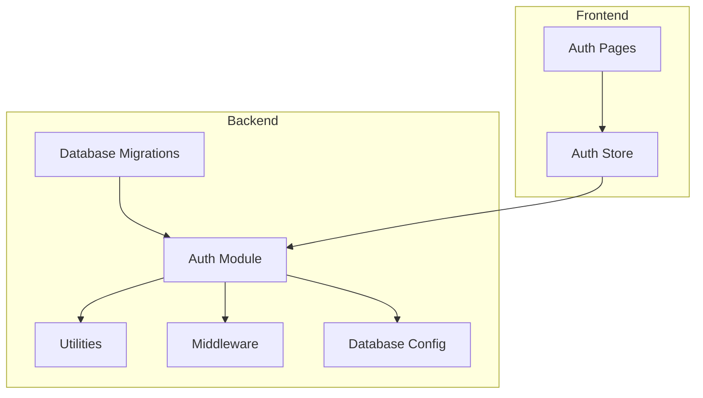
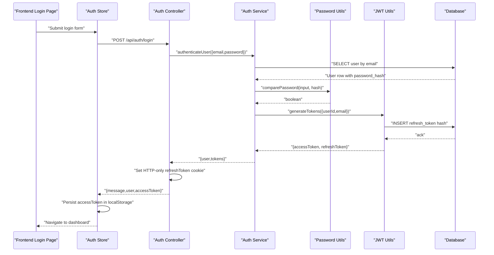
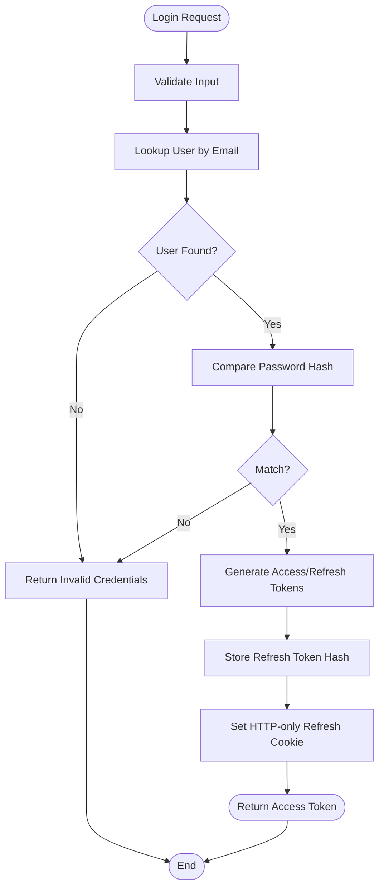
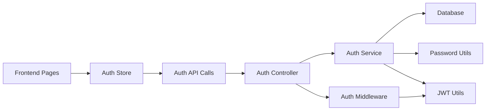

# User Management Schema

<cite>
**Referenced Files in This Document**
- [001_create_users.sql](file://backend/migrations/001_create_users.sql)
- [007_create_refresh_tokens.sql](file://backend/migrations/007_create_refresh_tokens.sql)
- [008_create_gamification.sql](file://backend/migrations/008_create_gamification.sql)
- [controller.ts](file://backend/src/modules/auth/controller.ts)
- [service.ts](file://backend/src/modules/auth/service.ts)
- [password.ts](file://backend/src/utils/password.ts)
- [jwt.ts](file://backend/src/utils/jwt.ts)
- [auth.ts](file://backend/src/middleware/auth.ts)
- [database.ts](file://backend/src/config/database.ts)
- [validation.ts](file://backend/src/utils/validation.ts)
- [authStore.ts](file://frontend/app/store/authStore.ts)
- [login page.tsx](file://frontend/app/(auth)/login/page.tsx)
- [register page.tsx](file://frontend/app/(auth)/register/page.tsx)
- [package.json](file://backend/package.json)
</cite>

## Table of Contents
1. [Introduction](#introduction)
2. [Project Structure](#project-structure)
3. [Core Components](#core-components)
4. [Architecture Overview](#architecture-overview)
5. [Detailed Component Analysis](#detailed-component-analysis)
6. [Dependency Analysis](#dependency-analysis)
7. [Performance Considerations](#performance-considerations)
8. [Troubleshooting Guide](#troubleshooting-guide)
9. [Conclusion](#conclusion)
10. [Appendices](#appendices)

## Introduction
This document provides comprehensive data model documentation for the User Management system. It covers the users table structure, field definitions, data types, constraints, and indexes. It also explains user authentication flow, password hashing mechanisms, session/token management, and security considerations for credential storage. Sample user data, common queries, and lifecycle management topics such as account verification and data privacy compliance are included.

## Project Structure
The User Management system spans backend database migrations, authentication services, middleware, utilities, and frontend authentication pages/stores.

**Diagram sources**
- [001_create_users.sql:1-11](file://backend/migrations/001_create_users.sql#L1-L11)
- [controller.ts:1-99](file://backend/src/modules/auth/controller.ts#L1-L99)
- [jwt.ts:1-78](file://backend/src/utils/jwt.ts#L1-L78)
- [auth.ts:1-42](file://backend/src/middleware/auth.ts#L1-L42)
- [database.ts:1-53](file://backend/src/config/database.ts#L1-L53)
- [login page.tsx](file://frontend/app/(auth)/login/page.tsx#L1-L140)
- [register page.tsx](file://frontend/app/(auth)/register/page.tsx#L1-L165)
- [authStore.ts:1-98](file://frontend/app/store/authStore.ts#L1-L98)

**Section sources**
- [001_create_users.sql:1-11](file://backend/migrations/001_create_users.sql#L1-L11)
- [007_create_refresh_tokens.sql:1-13](file://backend/migrations/007_create_refresh_tokens.sql#L1-L13)
- [008_create_gamification.sql:1-64](file://backend/migrations/008_create_gamification.sql#L1-L64)
- [controller.ts:1-99](file://backend/src/modules/auth/controller.ts#L1-L99)
- [service.ts:1-108](file://backend/src/modules/auth/service.ts#L1-L108)
- [password.ts:1-12](file://backend/src/utils/password.ts#L1-L12)
- [jwt.ts:1-78](file://backend/src/utils/jwt.ts#L1-L78)
- [auth.ts:1-42](file://backend/src/middleware/auth.ts#L1-L42)
- [database.ts:1-53](file://backend/src/config/database.ts#L1-L53)
- [validation.ts:1-31](file://backend/src/utils/validation.ts#L1-L31)
- [authStore.ts:1-98](file://frontend/app/store/authStore.ts#L1-L98)
- [login page.tsx](file://frontend/app/(auth)/login/page.tsx#L1-L140)
- [register page.tsx](file://frontend/app/(auth)/register/page.tsx#L1-L165)

## Core Components
- Users table: Stores user identity, credentials, and profile metadata.
- Refresh tokens table: Stores hashed refresh tokens with revocation and expiration tracking.
- Authentication module: Handles registration, login, logout, token refresh, and protected route access.
- Utilities: Password hashing/verification and JWT generation/verification with refresh token persistence.
- Middleware: Validates access tokens for protected endpoints.
- Frontend authentication: Login/register pages and Zustand store for token/session management.

**Section sources**
- [001_create_users.sql:1-11](file://backend/migrations/001_create_users.sql#L1-L11)
- [007_create_refresh_tokens.sql:1-13](file://backend/migrations/007_create_refresh_tokens.sql#L1-L13)
- [controller.ts:1-99](file://backend/src/modules/auth/controller.ts#L1-L99)
- [service.ts:1-108](file://backend/src/modules/auth/service.ts#L1-L108)
- [password.ts:1-12](file://backend/src/utils/password.ts#L1-L12)
- [jwt.ts:1-78](file://backend/src/utils/jwt.ts#L1-L78)
- [auth.ts:1-42](file://backend/src/middleware/auth.ts#L1-L42)
- [authStore.ts:1-98](file://frontend/app/store/authStore.ts#L1-L98)

## Architecture Overview
The authentication flow integrates frontend pages, the auth store, backend controllers/services, JWT utilities, refresh token persistence, and database access.

**Diagram sources**
- [login page.tsx](file://frontend/app/(auth)/login/page.tsx#L24-L34)
- [authStore.ts:34-49](file://frontend/app/store/authStore.ts#L34-L49)
- [controller.ts:18-35](file://backend/src/modules/auth/controller.ts#L18-L35)
- [service.ts:50-81](file://backend/src/modules/auth/service.ts#L50-L81)
- [password.ts:9-11](file://backend/src/utils/password.ts#L9-L11)
- [jwt.ts:20-41](file://backend/src/utils/jwt.ts#L20-L41)
- [database.ts:19-29](file://backend/src/config/database.ts#L19-L29)

## Detailed Component Analysis

### Users Table Model
The users table defines the core identity and credential storage for users.

- Fields and constraints:
  - id: VARCHAR(36) PRIMARY KEY, default generated UUID
  - email: VARCHAR(255) NOT NULL, UNIQUE
  - password_hash: VARCHAR(255) NOT NULL
  - name: VARCHAR(255) NOT NULL
  - avatar_url: VARCHAR(500) nullable
  - created_at: TIMESTAMP DEFAULT CURRENT_TIMESTAMP
  - updated_at: TIMESTAMP DEFAULT CURRENT_TIMESTAMP ON UPDATE CURRENT_TIMESTAMP
  - Index: idx_email(email)

- Notes:
  - UUID primary key ensures globally unique identifiers.
  - Unique email constraint prevents duplicate accounts.
  - Passwords are stored as hashes; plaintext passwords are never stored.
  - Profile fields include name and optional avatar_url.

**Section sources**
- [001_create_users.sql:1-11](file://backend/migrations/001_create_users.sql#L1-L11)

### Refresh Tokens Table Model
The refresh_tokens table persists hashed refresh tokens with revocation and expiration controls.

- Fields and constraints:
  - id: VARCHAR(36) PRIMARY KEY, default generated UUID
  - user_id: VARCHAR(36) NOT NULL, FK to users(id) with ON DELETE CASCADE
  - token_hash: VARCHAR(255) NOT NULL
  - expires_at: TIMESTAMP NOT NULL
  - revoked_at: TIMESTAMP NULL
  - created_at: TIMESTAMP DEFAULT CURRENT_TIMESTAMP
  - Indexes: idx_token(token_hash), idx_user(user_id), idx_expires(expires_at)

- Notes:
  - token_hash is SHA-256 of the original refresh token.
  - Revocation is supported via revoked_at timestamp.
  - Expiration is enforced by expires_at.

**Section sources**
- [007_create_refresh_tokens.sql:1-13](file://backend/migrations/007_create_refresh_tokens.sql#L1-L13)

### Authentication Flow and Token Management
- Registration:
  - Input validation via Zod schemas.
  - Duplicate email check.
  - Password hashed with bcrypt at 12 rounds.
  - New user record inserted with email, password_hash, and name.
  - Initialization of gamification records (user_xp, user_streaks).

- Login:
  - Input validation.
  - Lookup user by email.
  - Compare password against stored hash.
  - Generate access and refresh tokens.
  - Persist refresh token hash in refresh_tokens table.
  - Set HTTP-only refresh cookie with secure/sameSite flags.

- Logout:
  - Revoke refresh token by marking revoked_at.
  - Clear refresh cookie.
  - Optional: logout from all devices by revoking all tokens for the user.

- Token Refresh:
  - Extract refresh token from cookie or body.
  - Verify JWT and check token hash existence and validity.
  - Generate new access and refresh tokens.
  - Update refresh token hash in database.
  - Set new HTTP-only refresh cookie.

- Protected Routes:
  - Access tokens verified via middleware.
  - Optional auth middleware allows requests without mandatory auth.

**Diagram sources**
- [service.ts:50-81](file://backend/src/modules/auth/service.ts#L50-L81)
- [jwt.ts:20-41](file://backend/src/utils/jwt.ts#L20-L41)
- [controller.ts:18-35](file://backend/src/modules/auth/controller.ts#L18-L35)

**Section sources**
- [controller.ts:1-99](file://backend/src/modules/auth/controller.ts#L1-L99)
- [service.ts:1-108](file://backend/src/modules/auth/service.ts#L1-L108)
- [password.ts:1-12](file://backend/src/utils/password.ts#L1-L12)
- [jwt.ts:1-78](file://backend/src/utils/jwt.ts#L1-L78)
- [auth.ts:1-42](file://backend/src/middleware/auth.ts#L1-L42)
- [validation.ts:1-31](file://backend/src/utils/validation.ts#L1-L31)

### Password Hashing Mechanisms
- bcryptjs is used with 12 rounds for hashing and comparison.
- No plaintext passwords are stored; only password_hash is persisted.

**Section sources**
- [password.ts:1-12](file://backend/src/utils/password.ts#L1-L12)
- [service.ts:22-22](file://backend/src/modules/auth/service.ts#L22-L22)

### Session and Token Management
- Access tokens are short-lived and validated on protected routes.
- Refresh tokens are long-lived, stored as HTTP-only cookies, and persisted in the database as SHA-256 hashes.
- Revocation supports logout and logout-all scenarios.
- Frontend stores access tokens in localStorage and relies on backend cookies for refresh tokens.

**Section sources**
- [controller.ts:22-28](file://backend/src/modules/auth/controller.ts#L22-L28)
- [controller.ts:48-70](file://backend/src/modules/auth/controller.ts#L48-L70)
- [jwt.ts:47-77](file://backend/src/utils/jwt.ts#L47-L77)
- [authStore.ts:34-49](file://frontend/app/store/authStore.ts#L34-L49)

### Data Privacy and Security Considerations
- Credential storage:
  - Passwords are hashed with bcrypt; never stored in plaintext.
  - Refresh tokens are stored as hashes with revocation support.
- Transport security:
  - Secure flag enabled for refresh cookies in production.
  - SameSite strict for CSRF protection.
  - Access tokens are bearer tokens validated server-side.
- Input validation:
  - Zod schemas enforce minimum lengths and formats for registration and login.
- Database constraints:
  - Unique email index prevents duplicates.
  - Foreign keys maintain referential integrity for gamification tables.

**Section sources**
- [password.ts:1-12](file://backend/src/utils/password.ts#L1-L12)
- [jwt.ts:30-38](file://backend/src/utils/jwt.ts#L30-L38)
- [controller.ts:22-28](file://backend/src/modules/auth/controller.ts#L22-L28)
- [validation.ts:3-12](file://backend/src/utils/validation.ts#L3-L12)
- [001_create_users.sql:3-3](file://backend/migrations/001_create_users.sql#L3-L3)

### User Lifecycle Management and Gamification
- On registration, gamification records are initialized for XP and streaks.
- User profile includes id, email, name, and optional avatar_url.
- Additional gamification data (XP, streaks, achievements) is managed separately but linked to users.

**Section sources**
- [service.ts:38-47](file://backend/src/modules/auth/service.ts#L38-L47)
- [008_create_gamification.sql:1-64](file://backend/migrations/008_create_gamification.sql#L1-L64)

### Sample User Data
- Example user record fields:
  - id: "a1b2c3d4-e5f6-7890-abcd-ef1234567890"
  - email: "alice@example.com"
  - password_hash: "$2a$12$..." (bcrypt hash)
  - name: "Alice Doe"
  - avatar_url: "https://example.com/avatar.jpg" or null
  - created_at: "2025-01-01 10:00:00"
  - updated_at: "2025-01-01 10:00:00"

**Section sources**
- [001_create_users.sql:1-11](file://backend/migrations/001_create_users.sql#L1-L11)

### Common Queries for User Operations
- Insert a new user:
  - INSERT INTO users (email, password_hash, name) VALUES (?, ?, ?)
- Retrieve user by email:
  - SELECT id, email, name, password_hash, avatar_url FROM users WHERE email = ?
- Retrieve user by id:
  - SELECT id, email, name, avatar_url FROM users WHERE id = ?
- Update profile (name, avatar_url):
  - UPDATE users SET name = ?, avatar_url = ? WHERE id = ?
- Delete user (cascade handled by foreign keys in gamification tables):
  - DELETE FROM users WHERE id = ?

**Section sources**
- [service.ts:13-47](file://backend/src/modules/auth/service.ts#L13-L47)
- [service.ts:91-107](file://backend/src/modules/auth/service.ts#L91-L107)
- [008_create_gamification.sql:2-25](file://backend/migrations/008_create_gamification.sql#L2-L25)

### Account Verification and Data Privacy Compliance
- Account verification: Not implemented in the current schema or controllers. Consider adding an email_verification_tokens table and verification endpoints if required.
- Data minimization: Only collect necessary fields (email, password, name).
- Consent and retention: Define policies for data deletion and retention aligned with privacy regulations.

[No sources needed since this section provides general guidance]

## Dependency Analysis
The authentication module depends on utilities for password hashing and JWT management, database access for persistence, and middleware for protecting routes. Frontend interacts with backend APIs through the auth store.

**Diagram sources**
- [authStore.ts:34-49](file://frontend/app/store/authStore.ts#L34-L49)
- [controller.ts:1-99](file://backend/src/modules/auth/controller.ts#L1-L99)
- [service.ts:1-108](file://backend/src/modules/auth/service.ts#L1-L108)
- [password.ts:1-12](file://backend/src/utils/password.ts#L1-L12)
- [jwt.ts:1-78](file://backend/src/utils/jwt.ts#L1-L78)
- [auth.ts:1-42](file://backend/src/middleware/auth.ts#L1-L42)
- [database.ts:1-53](file://backend/src/config/database.ts#L1-L53)

**Section sources**
- [controller.ts:1-99](file://backend/src/modules/auth/controller.ts#L1-L99)
- [service.ts:1-108](file://backend/src/modules/auth/service.ts#L1-L108)
- [password.ts:1-12](file://backend/src/utils/password.ts#L1-L12)
- [jwt.ts:1-78](file://backend/src/utils/jwt.ts#L1-L78)
- [auth.ts:1-42](file://backend/src/middleware/auth.ts#L1-L42)
- [database.ts:1-53](file://backend/src/config/database.ts#L1-L53)
- [authStore.ts:1-98](file://frontend/app/store/authStore.ts#L1-L98)

## Performance Considerations
- Indexing:
  - Ensure idx_email on users.email for fast lookups during login.
  - Indexes on refresh_tokens (token_hash, user_id, expires_at) optimize token verification and cleanup.
- Hashing cost:
  - bcrypt 12 rounds balances security and performance; adjust based on hardware capacity.
- Token storage:
  - Storing hashed refresh tokens avoids exposing secrets while enabling revocation.
- Database pooling:
  - Connection pooling reduces overhead for concurrent authentication requests.

[No sources needed since this section provides general guidance]

## Troubleshooting Guide
- Invalid credentials:
  - Occurs when email not found or password hash mismatch.
  - Check input validation and ensure bcrypt rounds match hashing.
- Refresh token errors:
  - Invalid refresh token indicates missing, revoked, or expired token.
  - Verify token hash lookup and revoked_at/expires_at conditions.
- Access token failures:
  - Unauthorized responses indicate missing or invalid Bearer token.
  - Confirm middleware is applied to protected routes.
- Duplicate email:
  - Registration fails if email already exists.
  - Ensure unique constraint is enforced and handled gracefully.

**Section sources**
- [service.ts:16-20](file://backend/src/modules/auth/service.ts#L16-L20)
- [service.ts:61-68](file://backend/src/modules/auth/service.ts#L61-L68)
- [jwt.ts:47-62](file://backend/src/utils/jwt.ts#L47-L62)
- [auth.ts:8-24](file://backend/src/middleware/auth.ts#L8-L24)

## Conclusion
The User Management system employs robust security practices: bcrypt-based password hashing, JWT access tokens, and hashed refresh tokens with revocation. The schema enforces unique identities and supports scalable profile storage. Integrating frontend authentication with backend controllers and middleware completes a secure and maintainable authentication pipeline. Extending the system with account verification and privacy-compliant data handling will further strengthen user trust and regulatory adherence.

## Appendices

### Appendix A: Backend Dependencies
- bcryptjs: Password hashing and verification.
- jsonwebtoken: JWT signing and verification.
- uuid: Refresh token ID generation.
- mysql2: Database connectivity and pooling.
- zod: Input validation schemas.

**Section sources**
- [package.json:15-27](file://backend/package.json#L15-L27)