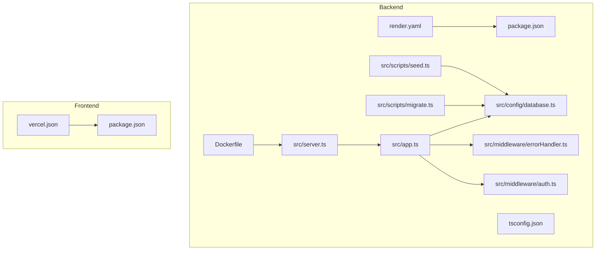
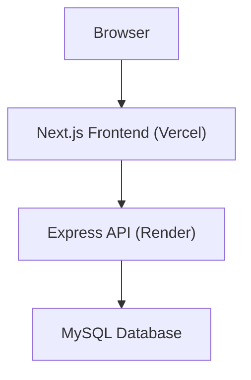
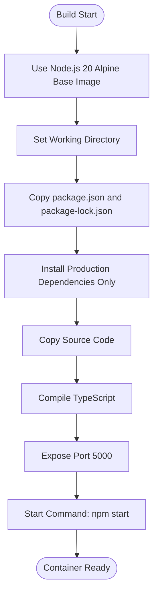
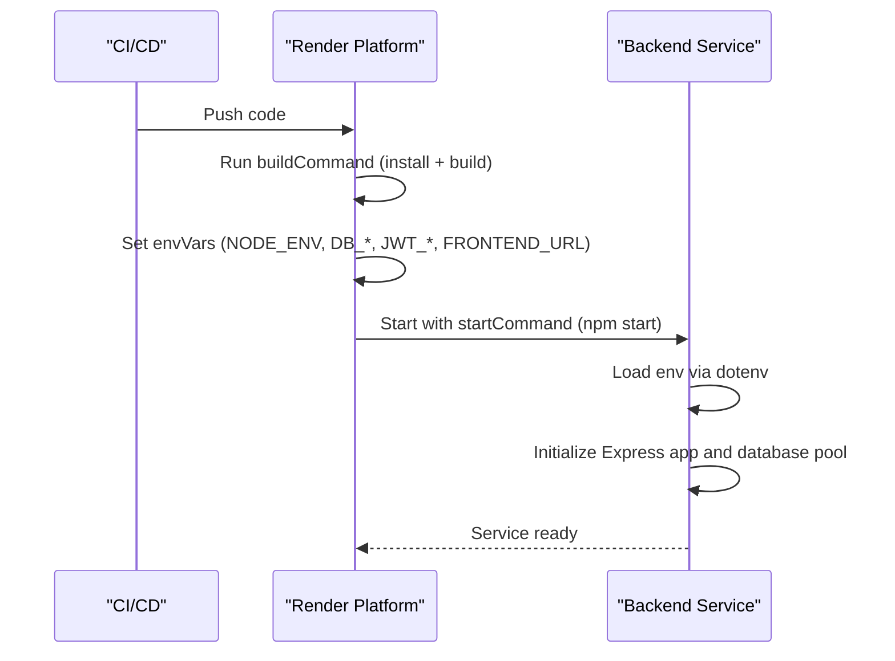
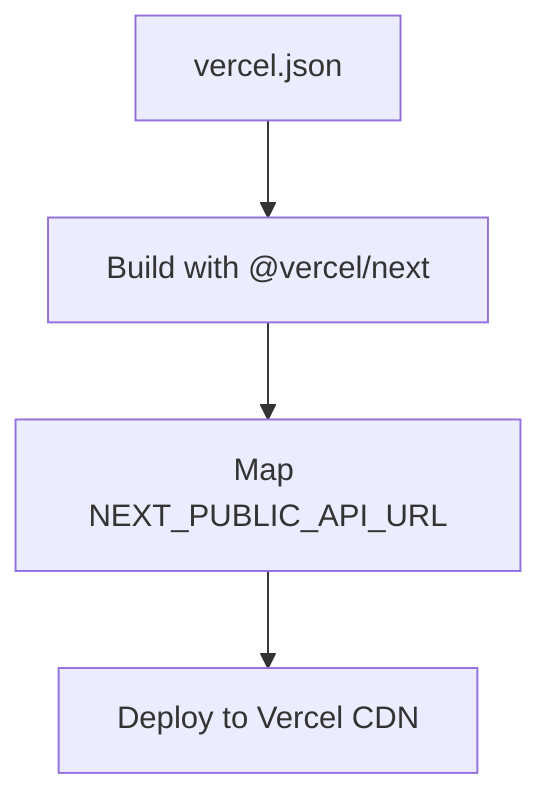
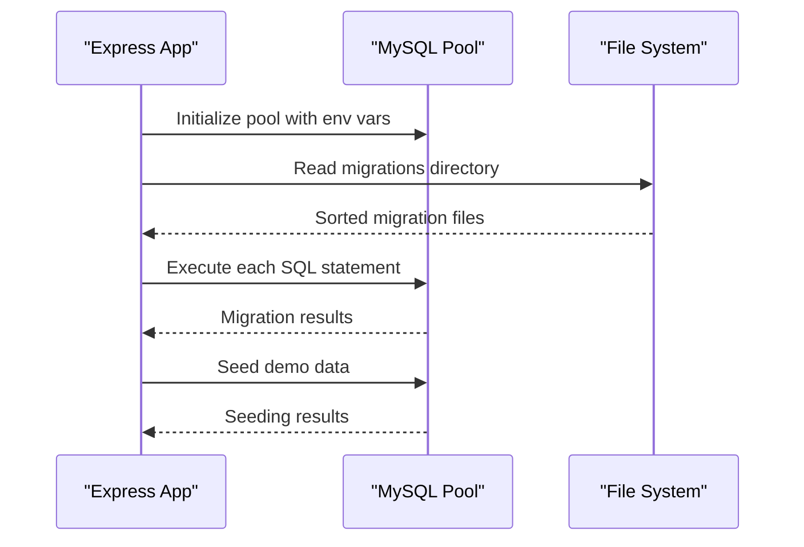
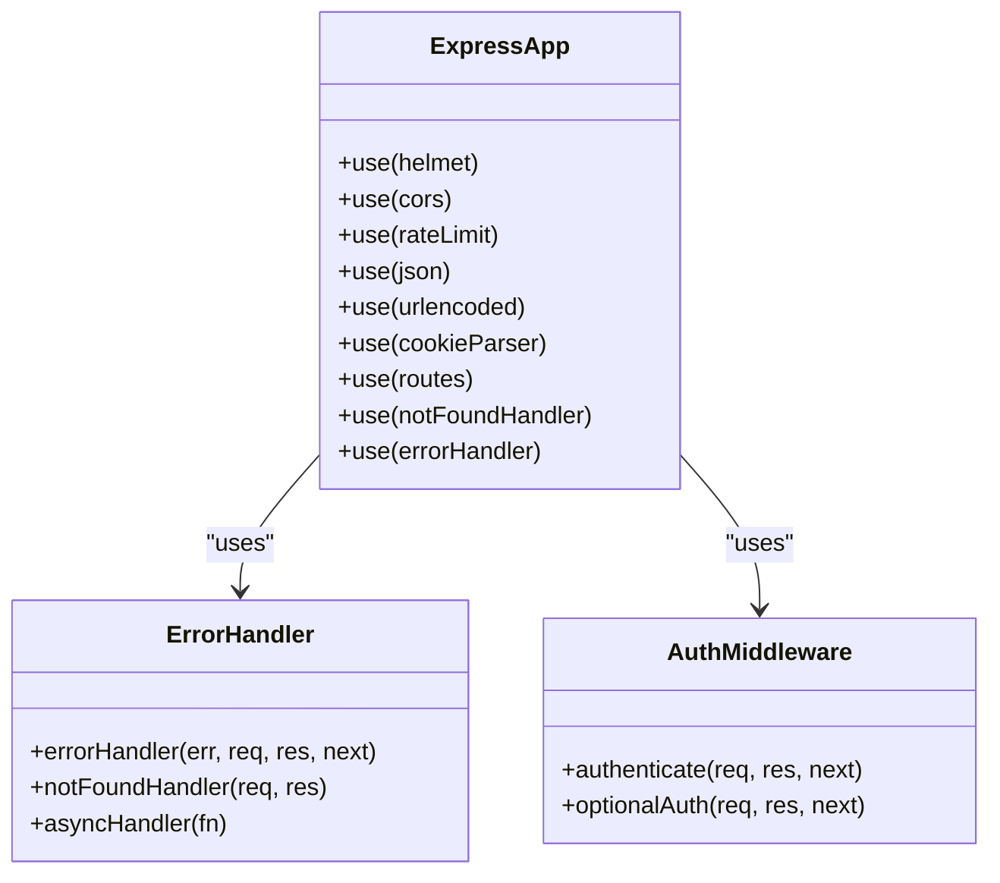
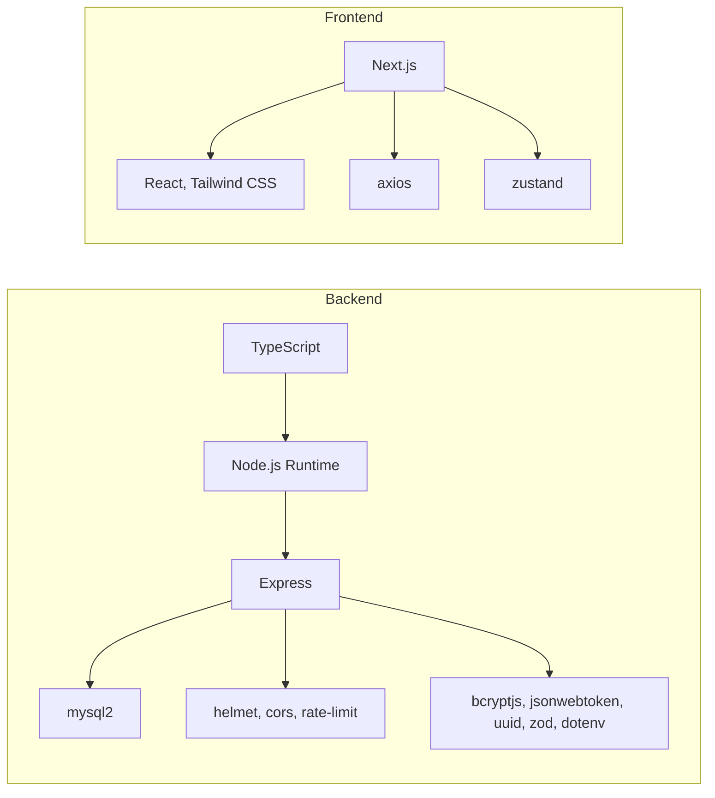

# Deployment and DevOps

<cite>
**Referenced Files in This Document**
- [backend/Dockerfile](file://backend/Dockerfile)
- [backend/render.yaml](file://backend/render.yaml)
- [backend/package.json](file://backend/package.json)
- [backend/src/server.ts](file://backend/src/server.ts)
- [backend/src/app.ts](file://backend/src/app.ts)
- [backend/src/config/database.ts](file://backend/src/config/database.ts)
- [backend/src/scripts/migrate.ts](file://backend/src/scripts/migrate.ts)
- [backend/src/scripts/seed.ts](file://backend/src/scripts/seed.ts)
- [backend/src/middleware/errorHandler.ts](file://backend/src/middleware/errorHandler.ts)
- [backend/src/middleware/auth.ts](file://backend/src/middleware/auth.ts)
- [backend/tsconfig.json](file://backend/tsconfig.json)
- [frontend/vercel.json](file://frontend/vercel.json)
- [frontend/package.json](file://frontend/package.json)
</cite>

## Table of Contents
1. [Introduction](#introduction)
2. [Project Structure](#project-structure)
3. [Core Components](#core-components)
4. [Architecture Overview](#architecture-overview)
5. [Detailed Component Analysis](#detailed-component-analysis)
6. [Dependency Analysis](#dependency-analysis)
7. [Performance Considerations](#performance-considerations)
8. [Troubleshooting Guide](#troubleshooting-guide)
9. [Production Deployment Checklist](#production-deployment-checklist)
10. [Monitoring and Observability](#monitoring-and-observability)
11. [Logging Configuration](#logging-configuration)
12. [Security Considerations](#security-considerations)
13. [Backup and Disaster Recovery](#backup-and-disaster-recovery)
14. [CI/CD Pipeline Recommendations](#cicd-pipeline-recommendations)
15. [Scaling Strategies](#scaling-strategies)
16. [Maintenance Procedures](#maintenance-procedures)
17. [Conclusion](#conclusion)

## Introduction
This document provides comprehensive deployment and DevOps guidance for the Learning Management System (LMS). It covers containerization with Docker, multi-stage build strategies, environment variable management, cloud deployment on Render, frontend hosting on Vercel, CI/CD pipeline recommendations, production readiness, monitoring, logging, security, backups, disaster recovery, and operational maintenance. The goal is to enable reliable, scalable, and secure deployments for both development and production environments.

## Project Structure
The LMS follows a full-stack architecture with a Node.js/Express backend and a Next.js frontend. The backend is configured for containerized deployment and cloud hosting via Render, while the frontend is optimized for static generation and hosted on Vercel. Environment variables are managed through dotenv and platform-specific configuration files.

**Diagram sources**
- [backend/Dockerfile:1-22](file://backend/Dockerfile#L1-L22)
- [backend/render.yaml:1-30](file://backend/render.yaml#L1-L30)
- [backend/package.json:1-44](file://backend/package.json#L1-L44)
- [backend/src/server.ts:1-32](file://backend/src/server.ts#L1-L32)
- [backend/src/app.ts:1-54](file://backend/src/app.ts#L1-L54)
- [backend/src/config/database.ts:1-53](file://backend/src/config/database.ts#L1-L53)
- [backend/src/scripts/migrate.ts:1-40](file://backend/src/scripts/migrate.ts#L1-L40)
- [backend/src/scripts/seed.ts:1-110](file://backend/src/scripts/seed.ts#L1-L110)
- [backend/src/middleware/errorHandler.ts:1-38](file://backend/src/middleware/errorHandler.ts#L1-L38)
- [backend/src/middleware/auth.ts:1-42](file://backend/src/middleware/auth.ts#L1-L42)
- [backend/tsconfig.json:1-33](file://backend/tsconfig.json#L1-L33)
- [frontend/vercel.json:1-13](file://frontend/vercel.json#L1-L13)
- [frontend/package.json:1-37](file://frontend/package.json#L1-L37)

**Section sources**
- [backend/Dockerfile:1-22](file://backend/Dockerfile#L1-L22)
- [backend/render.yaml:1-30](file://backend/render.yaml#L1-L30)
- [backend/package.json:1-44](file://backend/package.json#L1-L44)
- [backend/src/server.ts:1-32](file://backend/src/server.ts#L1-L32)
- [backend/src/app.ts:1-54](file://backend/src/app.ts#L1-L54)
- [backend/src/config/database.ts:1-53](file://backend/src/config/database.ts#L1-L53)
- [backend/src/scripts/migrate.ts:1-40](file://backend/src/scripts/migrate.ts#L1-L40)
- [backend/src/scripts/seed.ts:1-110](file://backend/src/scripts/seed.ts#L1-L110)
- [backend/src/middleware/errorHandler.ts:1-38](file://backend/src/middleware/errorHandler.ts#L1-L38)
- [backend/src/middleware/auth.ts:1-42](file://backend/src/middleware/auth.ts#L1-L42)
- [backend/tsconfig.json:1-33](file://backend/tsconfig.json#L1-L33)
- [frontend/vercel.json:1-13](file://frontend/vercel.json#L1-L13)
- [frontend/package.json:1-37](file://frontend/package.json#L1-L37)

## Core Components
- Backend containerization: Alpine-based Node.js image, production dependency installation, TypeScript build, port exposure, and start command.
- Cloud deployment: Render web service configuration with Node runtime, build/start commands, environment variables, and secrets management.
- Frontend hosting: Vercel configuration for static build and environment variable mapping.
- Database connectivity: MySQL pool configuration with dotenv support and connection pooling.
- Application bootstrap: Express app with security middleware, CORS, rate limiting, body parsing, routes, and error handling.
- Migration and seeding: Automated SQL migration runner and demo data seeder.
- Environment management: dotenv loading in server and database modules; Render-managed secrets; Vercel public environment variables.

**Section sources**
- [backend/Dockerfile:1-22](file://backend/Dockerfile#L1-L22)
- [backend/render.yaml:1-30](file://backend/render.yaml#L1-L30)
- [frontend/vercel.json:1-13](file://frontend/vercel.json#L1-L13)
- [backend/src/config/database.ts:1-53](file://backend/src/config/database.ts#L1-L53)
- [backend/src/server.ts:1-32](file://backend/src/server.ts#L1-L32)
- [backend/src/app.ts:1-54](file://backend/src/app.ts#L1-L54)
- [backend/src/scripts/migrate.ts:1-40](file://backend/src/scripts/migrate.ts#L1-L40)
- [backend/src/scripts/seed.ts:1-110](file://backend/src/scripts/seed.ts#L1-L110)

## Architecture Overview
The system comprises two primary services:
- Backend API: Node.js/Express with MySQL database, deployed on Render as a web service.
- Frontend: Next.js application built and served by Vercel, communicating with the backend API.

**Diagram sources**
- [backend/render.yaml:1-30](file://backend/render.yaml#L1-L30)
- [frontend/vercel.json:1-13](file://frontend/vercel.json#L1-L13)
- [backend/src/config/database.ts:1-53](file://backend/src/config/database.ts#L1-L53)

## Detailed Component Analysis

### Backend Containerization and Multi-Stage Builds
- Base image: Node.js Alpine Linux for minimal footprint.
- Dependency installation: Production-only install to reduce attack surface and image size.
- Build process: TypeScript compilation to ES2020 target with source maps and declarations.
- Runtime: Single container serving the compiled Node.js application.
- Port exposure and startup: Standardized port and start command for cloud platforms.

**Diagram sources**
- [backend/Dockerfile:1-22](file://backend/Dockerfile#L1-L22)
- [backend/package.json:1-44](file://backend/package.json#L1-L44)
- [backend/tsconfig.json:1-33](file://backend/tsconfig.json#L1-L33)

**Section sources**
- [backend/Dockerfile:1-22](file://backend/Dockerfile#L1-L22)
- [backend/package.json:1-44](file://backend/package.json#L1-L44)
- [backend/tsconfig.json:1-33](file://backend/tsconfig.json#L1-L33)

### Cloud Deployment on Render
- Runtime: Node.js web service.
- Build and start commands: npm install, build, start.
- Environment variables:
  - NODE_ENV set to production.
  - PORT configured to 5000.
  - Database credentials and connection parameters (host, port, user, password, name).
  - JWT configuration (secret generation and expiry).
  - FRONTEND_URL for CORS origins.
- Secrets management: Sensitive values marked as non-sync or auto-generated.

**Diagram sources**
- [backend/render.yaml:1-30](file://backend/render.yaml#L1-L30)
- [backend/src/server.ts:1-32](file://backend/src/server.ts#L1-L32)
- [backend/src/app.ts:1-54](file://backend/src/app.ts#L1-L54)
- [backend/src/config/database.ts:1-53](file://backend/src/config/database.ts#L1-L53)

**Section sources**
- [backend/render.yaml:1-30](file://backend/render.yaml#L1-L30)
- [backend/src/server.ts:1-32](file://backend/src/server.ts#L1-L32)
- [backend/src/app.ts:1-54](file://backend/src/app.ts#L1-L54)
- [backend/src/config/database.ts:1-53](file://backend/src/config/database.ts#L1-L53)

### Frontend Hosting on Vercel
- Build configuration: Uses @vercel/next with package.json as the build source.
- Environment variables: NEXT_PUBLIC_API_URL mapped from an environment variable placeholder.

**Diagram sources**
- [frontend/vercel.json:1-13](file://frontend/vercel.json#L1-L13)

**Section sources**
- [frontend/vercel.json:1-13](file://frontend/vercel.json#L1-L13)
- [frontend/package.json:1-37](file://frontend/package.json#L1-L37)

### Database Connectivity and Migration
- Connection pool: Host, port, user, password, database configurable via environment variables with sensible defaults.
- Pool settings: Connection limits, keep-alive, and transaction support.
- Migrations: Sequential SQL execution from the migrations directory with multi-statement handling.
- Seeding: Demo user, subjects, sections, videos, and achievements inserted with safe upsert patterns.

**Diagram sources**
- [backend/src/config/database.ts:1-53](file://backend/src/config/database.ts#L1-L53)
- [backend/src/scripts/migrate.ts:1-40](file://backend/src/scripts/migrate.ts#L1-L40)
- [backend/src/scripts/seed.ts:1-110](file://backend/src/scripts/seed.ts#L1-L110)

**Section sources**
- [backend/src/config/database.ts:1-53](file://backend/src/config/database.ts#L1-L53)
- [backend/src/scripts/migrate.ts:1-40](file://backend/src/scripts/migrate.ts#L1-L40)
- [backend/src/scripts/seed.ts:1-110](file://backend/src/scripts/seed.ts#L1-L110)

### Application Bootstrap and Middleware
- Security: Helmet for HTTP headers, CORS configured via FRONTEND_URL, rate limiting for general and auth endpoints.
- Body parsing: JSON and URL-encoded bodies with size limits; cookie parsing.
- Routes: Central route registration under /api.
- Error handling: Unified error response with optional stack traces in development.
- Authentication: Bearer token verification middleware with optional auth support.

**Diagram sources**
- [backend/src/app.ts:1-54](file://backend/src/app.ts#L1-L54)
- [backend/src/middleware/errorHandler.ts:1-38](file://backend/src/middleware/errorHandler.ts#L1-L38)
- [backend/src/middleware/auth.ts:1-42](file://backend/src/middleware/auth.ts#L1-L42)

**Section sources**
- [backend/src/app.ts:1-54](file://backend/src/app.ts#L1-L54)
- [backend/src/middleware/errorHandler.ts:1-38](file://backend/src/middleware/errorHandler.ts#L1-L38)
- [backend/src/middleware/auth.ts:1-42](file://backend/src/middleware/auth.ts#L1-L42)

## Dependency Analysis
- Backend dependencies include Express, MySQL2, helmet, cors, express-rate-limit, cookie-parser, bcryptjs, jsonwebtoken, uuid, zod, and dotenv.
- Frontend dependencies include Next.js, React, axios, framer-motion, lucide-react, zustand, and Tailwind CSS.
- Build-time dependencies: TypeScript compiler, ESLint, ts-node, ts-node-dev for development and type checking.

**Diagram sources**
- [backend/package.json:1-44](file://backend/package.json#L1-L44)
- [frontend/package.json:1-37](file://frontend/package.json#L1-L37)

**Section sources**
- [backend/package.json:1-44](file://backend/package.json#L1-L44)
- [frontend/package.json:1-37](file://frontend/package.json#L1-L37)

## Performance Considerations
- Container size: Alpine base reduces image size; production-only dependency installation minimizes footprint.
- Database pool: Configurable connection limits and keep-alive improve concurrency and resource utilization.
- Rate limiting: Built-in rate limiting protects endpoints from abuse and ensures fair usage.
- Build optimization: TypeScript target and module resolution tuned for Node.js runtime.
- Frontend optimization: Static generation and CDN delivery via Vercel.

[No sources needed since this section provides general guidance]

## Troubleshooting Guide
- Server startup failures: Check environment variables and database connectivity; review uncaught exception and unhandled rejection handlers.
- CORS errors: Verify FRONTEND_URL matches the deployed frontend origin.
- Database connection issues: Confirm DB_HOST, DB_PORT, DB_USER, DB_PASSWORD, and DB_NAME; ensure the database is reachable from the platform.
- Migration failures: Inspect migration logs and SQL statements; ensure proper permissions and schema compatibility.
- Seeding failures: Validate demo data insertions and safe upsert patterns; confirm prerequisite records exist.

**Section sources**
- [backend/src/server.ts:1-32](file://backend/src/server.ts#L1-L32)
- [backend/src/app.ts:1-54](file://backend/src/app.ts#L1-L54)
- [backend/src/config/database.ts:1-53](file://backend/src/config/database.ts#L1-L53)
- [backend/src/scripts/migrate.ts:1-40](file://backend/src/scripts/migrate.ts#L1-L40)
- [backend/src/scripts/seed.ts:1-110](file://backend/src/scripts/seed.ts#L1-L110)

## Production Deployment Checklist
- Environment variables:
  - NODE_ENV set to production.
  - PORT configured to 5000.
  - DB_HOST, DB_PORT, DB_USER, DB_PASSWORD, DB_NAME configured securely.
  - JWT_SECRET generated and rotated periodically; JWT_EXPIRES_IN and JWT_REFRESH_EXPIRES_IN set appropriately.
  - FRONTEND_URL points to the production frontend domain.
- Database preparation:
  - Provision MySQL instance and network access.
  - Run migrations and seed initial data if required.
- Health checks:
  - Configure platform health checks against a lightweight endpoint.
- Secrets management:
  - Store sensitive values as platform secrets; avoid committing to version control.
- Networking:
  - Configure firewall rules and allowlist platform IPs if applicable.
- Monitoring:
  - Enable platform-native logging and metrics.
- Backup:
  - Schedule regular database backups and test restore procedures.

[No sources needed since this section provides general guidance]

## Monitoring and Observability
- Logging: Application logs include startup messages, environment info, and error outputs. Use platform-native logging to capture structured logs.
- Metrics: Track API latency, error rates, database connection pool usage, and container resource consumption.
- Alerting: Set alerts for high error rates, slow response times, and database connection exhaustion.
- Tracing: Integrate distributed tracing for cross-service visibility if scaling to microservices.

[No sources needed since this section provides general guidance]

## Logging Configuration
- Console logging: Standard output and error streams capture application lifecycle events and errors.
- Error reporting: Unified error handler formats responses and logs errors with optional stack traces in development mode.
- Database operations: Migration and seeding scripts log progress and failures.

**Section sources**
- [backend/src/server.ts:1-32](file://backend/src/server.ts#L1-L32)
- [backend/src/middleware/errorHandler.ts:1-38](file://backend/src/middleware/errorHandler.ts#L1-L38)
- [backend/src/scripts/migrate.ts:1-40](file://backend/src/scripts/migrate.ts#L1-L40)
- [backend/src/scripts/seed.ts:1-110](file://backend/src/scripts/seed.ts#L1-L110)

## Security Considerations
- Transport security: Helmet sets secure headers; enforce HTTPS in production.
- Authentication: JWT-based access tokens with expiration; refresh token strategy recommended.
- Authorization: Middleware enforces bearer tokens; optional auth allows guest access where appropriate.
- CORS: Restrict origins to trusted frontend domains; enable credentials for authenticated requests.
- Rate limiting: Default and auth-specific rate limits prevent abuse.
- Secrets: Store database credentials and JWT secret as platform secrets; rotate regularly.
- Input validation: Zod schemas and validation utilities help sanitize inputs.

**Section sources**
- [backend/src/app.ts:1-54](file://backend/src/app.ts#L1-L54)
- [backend/src/middleware/auth.ts:1-42](file://backend/src/middleware/auth.ts#L1-L42)
- [backend/src/middleware/errorHandler.ts:1-38](file://backend/src/middleware/errorHandler.ts#L1-L38)

## Backup and Disaster Recovery
- Database backups: Schedule automated backups of the MySQL instance; retain multiple retention cycles.
- Point-in-time recovery: Enable binary logs and test PITR procedures.
- Artifact storage: Back up container images and deployment artifacts.
- Recovery drills: Periodically test restoration procedures to ensure data integrity and RTO/RPO targets.

[No sources needed since this section provides general guidance]

## CI/CD Pipeline Recommendations
- Build stages:
  - Lint and typecheck for both backend and frontend.
  - Backend: Install dependencies, build TypeScript, run migrations, and build container image.
  - Frontend: Install dependencies, build Next.js application.
- Test stages:
  - Unit and integration tests for backend.
  - E2E tests for frontend.
- Release stages:
  - Deploy backend to Render with environment-specific configurations.
  - Deploy frontend to Vercel with environment variable mapping.
- Rollback strategy:
  - Maintain multiple image tags and artifact versions for quick rollback.
- Security scanning:
  - Scan container images and dependencies for vulnerabilities.

[No sources needed since this section provides general guidance]

## Scaling Strategies
- Horizontal scaling: Deploy multiple backend instances behind a load balancer; ensure stateless design.
- Database scaling: Use read replicas for read-heavy workloads; optimize queries and indexes.
- Caching: Introduce Redis for session storage and caching frequently accessed data.
- CDN: Serve frontend assets via Vercel’s global CDN for improved latency.
- Auto-scaling: Configure platform auto-scaling policies based on CPU, memory, and request metrics.

[No sources needed since this section provides general guidance]

## Maintenance Procedures
- Patching:
  - Regularly update Node.js runtime and dependencies.
  - Monitor security advisories and apply patches promptly.
- Database maintenance:
  - Vacuum/analyze tables, monitor slow queries, and tune indexes.
- Logs rotation:
  - Configure log retention and archival policies.
- Health monitoring:
  - Review uptime, error rates, and performance trends weekly.

[No sources needed since this section provides general guidance]

## Conclusion
The Learning Management System is designed for containerized deployment with Render and Vercel, emphasizing security, scalability, and operability. By following the deployment and DevOps practices outlined—secure environment management, robust CI/CD, comprehensive monitoring, and resilient backup and recovery—you can maintain a reliable and high-performing LMS in production.