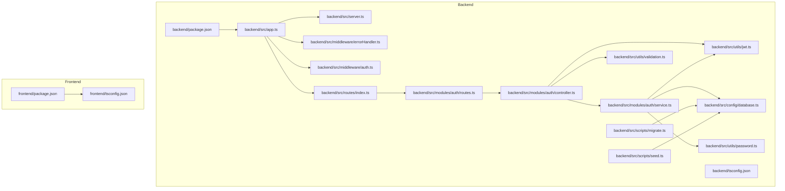
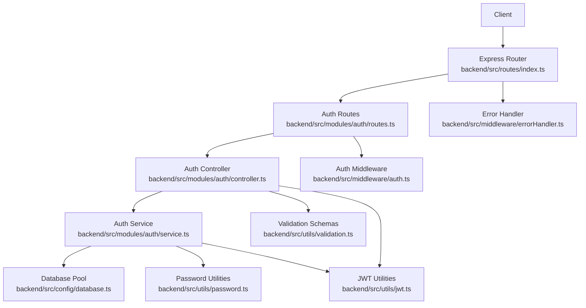
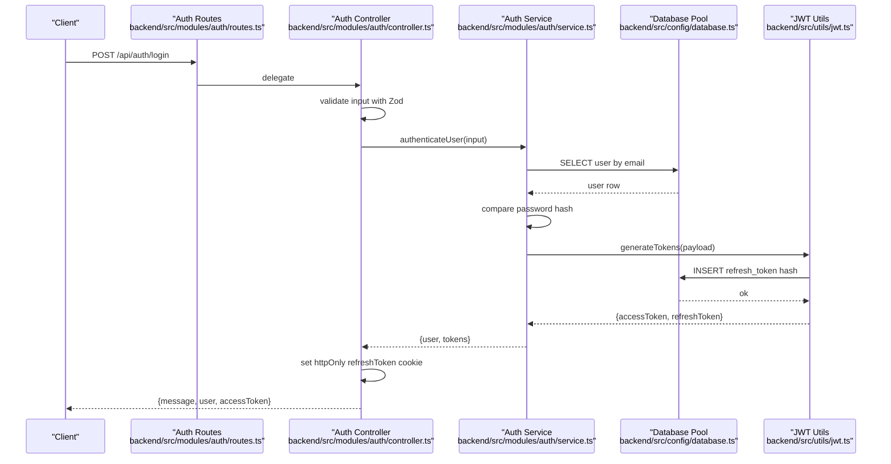
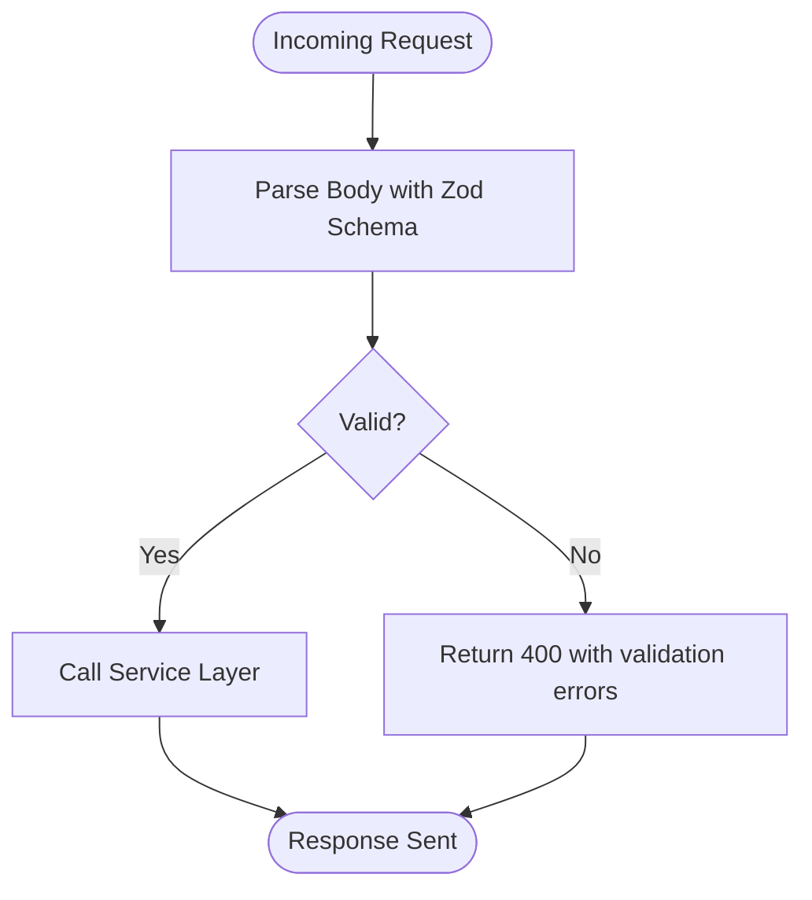
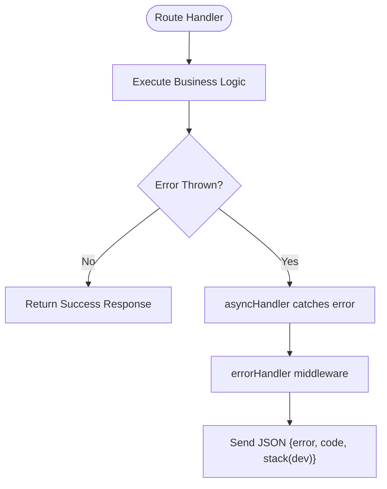
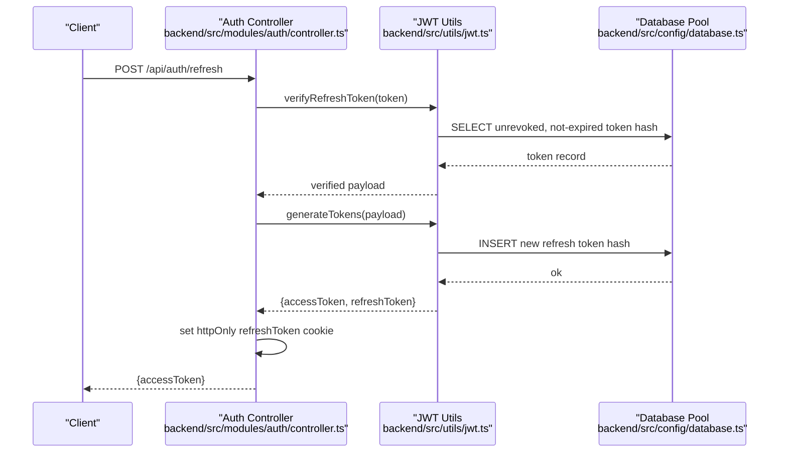
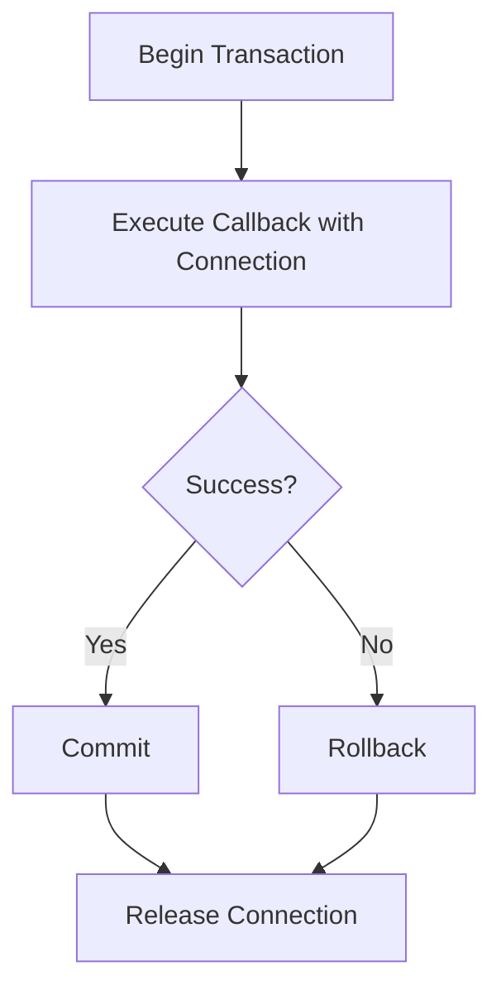
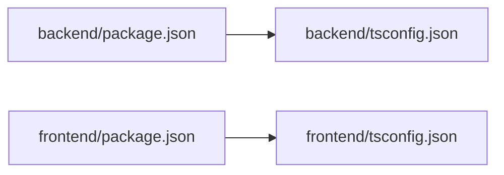

# Development Guide

<cite>
**Referenced Files in This Document**
- [backend/package.json](file://backend/package.json)
- [backend/tsconfig.json](file://backend/tsconfig.json)
- [backend/src/app.ts](file://backend/src/app.ts)
- [backend/src/server.ts](file://backend/src/server.ts)
- [backend/src/middleware/errorHandler.ts](file://backend/src/middleware/errorHandler.ts)
- [backend/src/middleware/auth.ts](file://backend/src/middleware/auth.ts)
- [backend/src/config/database.ts](file://backend/src/config/database.ts)
- [backend/src/utils/validation.ts](file://backend/src/utils/validation.ts)
- [backend/src/utils/password.ts](file://backend/src/utils/password.ts)
- [backend/src/utils/jwt.ts](file://backend/src/utils/jwt.ts)
- [backend/src/modules/auth/controller.ts](file://backend/src/modules/auth/controller.ts)
- [backend/src/modules/auth/service.ts](file://backend/src/modules/auth/service.ts)
- [backend/src/modules/auth/routes.ts](file://backend/src/modules/auth/routes.ts)
- [backend/src/routes/index.ts](file://backend/src/routes/index.ts)
- [backend/src/scripts/migrate.ts](file://backend/src/scripts/migrate.ts)
- [backend/src/scripts/seed.ts](file://backend/src/scripts/seed.ts)
- [frontend/package.json](file://frontend/package.json)
- [frontend/tsconfig.json](file://frontend/tsconfig.json)
</cite>

## Table of Contents
1. [Introduction](#introduction)
2. [Project Structure](#project-structure)
3. [Core Components](#core-components)
4. [Architecture Overview](#architecture-overview)
5. [Detailed Component Analysis](#detailed-component-analysis)
6. [Dependency Analysis](#dependency-analysis)
7. [Performance Considerations](#performance-considerations)
8. [Troubleshooting Guide](#troubleshooting-guide)
9. [Conclusion](#conclusion)
10. [Appendices](#appendices)

## Introduction
This development guide provides a comprehensive overview of the Learning Management System’s backend and frontend for contributors. It covers code standards, TypeScript configuration, ESLint setup, development workflow, utility functions, validation patterns, error handling strategies, and common development patterns. It also includes guidelines for adding new features, extending existing modules, maintaining code quality, and integrating with existing systems.

## Project Structure
The project is split into two primary packages:
- Backend: Express-based API with TypeScript, Zod validation, JWT-based authentication, and MySQL via mysql2.
- Frontend: Next.js application with TypeScript, Tailwind CSS, Zustand stores, and React components.

Key characteristics:
- Backend uses path aliases for modular imports (@/*, @config/*, @modules/*, @middleware/*, @utils/*).
- Frontend uses path aliases for components, stores, and libraries (@/*, @components/*, @store/*, @lib/*).
- Scripts for migrations and seeding are provided under backend/src/scripts.

**Diagram sources**
- [backend/src/app.ts:1-54](file://backend/src/app.ts#L1-L54)
- [backend/src/server.ts:1-32](file://backend/src/server.ts#L1-L32)
- [backend/src/middleware/errorHandler.ts:1-38](file://backend/src/middleware/errorHandler.ts#L1-L38)
- [backend/src/middleware/auth.ts:1-42](file://backend/src/middleware/auth.ts#L1-L42)
- [backend/src/config/database.ts:1-53](file://backend/src/config/database.ts#L1-L53)
- [backend/src/utils/validation.ts:1-31](file://backend/src/utils/validation.ts#L1-L31)
- [backend/src/utils/password.ts:1-12](file://backend/src/utils/password.ts#L1-L12)
- [backend/src/utils/jwt.ts:1-78](file://backend/src/utils/jwt.ts#L1-L78)
- [backend/src/modules/auth/controller.ts:1-99](file://backend/src/modules/auth/controller.ts#L1-L99)
- [backend/src/modules/auth/service.ts:1-108](file://backend/src/modules/auth/service.ts#L1-L108)
- [backend/src/modules/auth/routes.ts:1-15](file://backend/src/modules/auth/routes.ts#L1-L15)
- [backend/src/routes/index.ts:1-25](file://backend/src/routes/index.ts#L1-L25)
- [backend/src/scripts/migrate.ts:1-40](file://backend/src/scripts/migrate.ts#L1-L40)
- [backend/src/scripts/seed.ts:1-110](file://backend/src/scripts/seed.ts#L1-L110)
- [frontend/package.json:1-37](file://frontend/package.json#L1-L37)
- [frontend/tsconfig.json:1-30](file://frontend/tsconfig.json#L1-L30)

**Section sources**
- [backend/package.json:1-44](file://backend/package.json#L1-L44)
- [backend/tsconfig.json:1-33](file://backend/tsconfig.json#L1-L33)
- [frontend/package.json:1-37](file://frontend/package.json#L1-L37)
- [frontend/tsconfig.json:1-30](file://frontend/tsconfig.json#L1-L30)

## Core Components
This section documents the foundational building blocks used across the system.

- Application bootstrap and middleware pipeline
  - Security headers, CORS, rate limiting, body parsing, cookies, and route registration are configured centrally.
  - Error handling and not-found handlers are applied globally.
  - Reference: [backend/src/app.ts:1-54](file://backend/src/app.ts#L1-L54)

- Server startup and process error handling
  - Environment variables are loaded, the server listens on a configurable port, and uncaught exceptions/rejections are handled gracefully.
  - Reference: [backend/src/server.ts:1-32](file://backend/src/server.ts#L1-L32)

- Error handling utilities
  - Standardized error response shape, not-found handler, and an async wrapper to safely wrap route handlers.
  - Reference: [backend/src/middleware/errorHandler.ts:1-38](file://backend/src/middleware/errorHandler.ts#L1-L38)

- Authentication middleware
  - Enforces bearer token validation and supports optional authentication flows.
  - Reference: [backend/src/middleware/auth.ts:1-42](file://backend/src/middleware/auth.ts#L1-L42)

- Database abstraction
  - Connection pooling, query helpers, transaction support, and pool lifecycle management.
  - Reference: [backend/src/config/database.ts:1-53](file://backend/src/config/database.ts#L1-L53)

- Validation layer
  - Zod schemas for registration, login, progress updates, and AI chat inputs with generated TypeScript types.
  - Reference: [backend/src/utils/validation.ts:1-31](file://backend/src/utils/validation.ts#L1-L31)

- Password utilities
  - Secure hashing and comparison with bcrypt.
  - Reference: [backend/src/utils/password.ts:1-12](file://backend/src/utils/password.ts#L1-L12)

- JWT utilities
  - Access and refresh token generation, verification, refresh token storage, revocation, and bulk revocation by user.
  - Reference: [backend/src/utils/jwt.ts:1-78](file://backend/src/utils/jwt.ts#L1-L78)

- Route composition
  - Centralized route registry exposing health checks and module-specific routes.
  - Reference: [backend/src/routes/index.ts:1-25](file://backend/src/routes/index.ts#L1-L25)

- Module scaffolding (example: auth)
  - Routes -> Controller -> Service pattern with typed inputs, async error handling, and JWT cookie management.
  - References:
    - [backend/src/modules/auth/routes.ts:1-15](file://backend/src/modules/auth/routes.ts#L1-L15)
    - [backend/src/modules/auth/controller.ts:1-99](file://backend/src/modules/auth/controller.ts#L1-L99)
    - [backend/src/modules/auth/service.ts:1-108](file://backend/src/modules/auth/service.ts#L1-L108)

**Section sources**
- [backend/src/app.ts:1-54](file://backend/src/app.ts#L1-L54)
- [backend/src/server.ts:1-32](file://backend/src/server.ts#L1-L32)
- [backend/src/middleware/errorHandler.ts:1-38](file://backend/src/middleware/errorHandler.ts#L1-L38)
- [backend/src/middleware/auth.ts:1-42](file://backend/src/middleware/auth.ts#L1-L42)
- [backend/src/config/database.ts:1-53](file://backend/src/config/database.ts#L1-L53)
- [backend/src/utils/validation.ts:1-31](file://backend/src/utils/validation.ts#L1-L31)
- [backend/src/utils/password.ts:1-12](file://backend/src/utils/password.ts#L1-L12)
- [backend/src/utils/jwt.ts:1-78](file://backend/src/utils/jwt.ts#L1-L78)
- [backend/src/routes/index.ts:1-25](file://backend/src/routes/index.ts#L1-L25)
- [backend/src/modules/auth/routes.ts:1-15](file://backend/src/modules/auth/routes.ts#L1-L15)
- [backend/src/modules/auth/controller.ts:1-99](file://backend/src/modules/auth/controller.ts#L1-L99)
- [backend/src/modules/auth/service.ts:1-108](file://backend/src/modules/auth/service.ts#L1-L108)

## Architecture Overview
The system follows a layered architecture:
- Presentation layer: Express routes and controllers.
- Domain layer: Services encapsulate business logic.
- Persistence layer: Database utilities and transactions.
- Shared utilities: Validation, JWT, and password helpers.
- Middleware: Security, CORS, rate limiting, authentication, error handling.

**Diagram sources**
- [backend/src/routes/index.ts:1-25](file://backend/src/routes/index.ts#L1-L25)
- [backend/src/modules/auth/routes.ts:1-15](file://backend/src/modules/auth/routes.ts#L1-L15)
- [backend/src/modules/auth/controller.ts:1-99](file://backend/src/modules/auth/controller.ts#L1-L99)
- [backend/src/modules/auth/service.ts:1-108](file://backend/src/modules/auth/service.ts#L1-L108)
- [backend/src/config/database.ts:1-53](file://backend/src/config/database.ts#L1-L53)
- [backend/src/utils/jwt.ts:1-78](file://backend/src/utils/jwt.ts#L1-L78)
- [backend/src/utils/password.ts:1-12](file://backend/src/utils/password.ts#L1-L12)
- [backend/src/utils/validation.ts:1-31](file://backend/src/utils/validation.ts#L1-L31)
- [backend/src/middleware/errorHandler.ts:1-38](file://backend/src/middleware/errorHandler.ts#L1-L38)
- [backend/src/middleware/auth.ts:1-42](file://backend/src/middleware/auth.ts#L1-L42)

## Detailed Component Analysis

### Authentication Flow
This sequence illustrates the login flow, including validation, user lookup, token generation, and secure cookie handling.

**Diagram sources**
- [backend/src/modules/auth/routes.ts:1-15](file://backend/src/modules/auth/routes.ts#L1-L15)
- [backend/src/modules/auth/controller.ts:1-99](file://backend/src/modules/auth/controller.ts#L1-L99)
- [backend/src/modules/auth/service.ts:1-108](file://backend/src/modules/auth/service.ts#L1-L108)
- [backend/src/config/database.ts:1-53](file://backend/src/config/database.ts#L1-L53)
- [backend/src/utils/jwt.ts:1-78](file://backend/src/utils/jwt.ts#L1-L78)

**Section sources**
- [backend/src/modules/auth/controller.ts:1-99](file://backend/src/modules/auth/controller.ts#L1-L99)
- [backend/src/modules/auth/service.ts:1-108](file://backend/src/modules/auth/service.ts#L1-L108)
- [backend/src/utils/validation.ts:1-31](file://backend/src/utils/validation.ts#L1-L31)
- [backend/src/utils/jwt.ts:1-78](file://backend/src/utils/jwt.ts#L1-L78)

### Validation Patterns
- Zod schemas define strict input contracts with helpful messages.
- Controllers parse and validate incoming data before delegating to services.
- Generated TypeScript types ensure type-safe handling downstream.

**Diagram sources**
- [backend/src/utils/validation.ts:1-31](file://backend/src/utils/validation.ts#L1-L31)
- [backend/src/modules/auth/controller.ts:1-99](file://backend/src/modules/auth/controller.ts#L1-L99)

**Section sources**
- [backend/src/utils/validation.ts:1-31](file://backend/src/utils/validation.ts#L1-L31)
- [backend/src/modules/auth/controller.ts:1-99](file://backend/src/modules/auth/controller.ts#L1-L99)

### Error Handling Strategy
- Centralized error handler responds with structured JSON and optionally includes stack traces in development.
- Not-found handler ensures consistent 404 responses.
- Async wrapper transforms thrown errors into Express error-handling flow.

**Diagram sources**
- [backend/src/middleware/errorHandler.ts:1-38](file://backend/src/middleware/errorHandler.ts#L1-L38)
- [backend/src/app.ts:1-54](file://backend/src/app.ts#L1-L54)

**Section sources**
- [backend/src/middleware/errorHandler.ts:1-38](file://backend/src/middleware/errorHandler.ts#L1-L38)
- [backend/src/app.ts:1-54](file://backend/src/app.ts#L1-L54)

### JWT and Refresh Token Lifecycle
- Access tokens carry minimal claims; refresh tokens are stored as hashed values in the database.
- Revocation is supported per-token and per-user.
- Refresh endpoint rotates tokens and updates cookies securely.

**Diagram sources**
- [backend/src/modules/auth/controller.ts:1-99](file://backend/src/modules/auth/controller.ts#L1-L99)
- [backend/src/utils/jwt.ts:1-78](file://backend/src/utils/jwt.ts#L1-L78)
- [backend/src/config/database.ts:1-53](file://backend/src/config/database.ts#L1-L53)

**Section sources**
- [backend/src/utils/jwt.ts:1-78](file://backend/src/utils/jwt.ts#L1-L78)
- [backend/src/modules/auth/controller.ts:1-99](file://backend/src/modules/auth/controller.ts#L1-L99)

### Database Transactions and Helpers
- Query helpers support single-row and multi-row results.
- Transaction helper manages begin/commit/rollback with connection release.
- Migration and seeding scripts demonstrate safe execution and cleanup.

**Diagram sources**
- [backend/src/config/database.ts:1-53](file://backend/src/config/database.ts#L1-L53)
- [backend/src/scripts/migrate.ts:1-40](file://backend/src/scripts/migrate.ts#L1-L40)
- [backend/src/scripts/seed.ts:1-110](file://backend/src/scripts/seed.ts#L1-L110)

**Section sources**
- [backend/src/config/database.ts:1-53](file://backend/src/config/database.ts#L1-L53)
- [backend/src/scripts/migrate.ts:1-40](file://backend/src/scripts/migrate.ts#L1-L40)
- [backend/src/scripts/seed.ts:1-110](file://backend/src/scripts/seed.ts#L1-L110)

## Dependency Analysis
- Backend dependencies include Express, helmet, cors, rate limiting, JWT, bcrypt, mysql2, uuid, and Zod.
- Dev dependencies include TypeScript, ts-node, ts-node-dev, ESLint, and TypeScript ESLint plugin.
- Frontend depends on Next.js, React, Tailwind CSS, Zustand, and related type packages.
- Path aliases simplify imports and improve maintainability.

**Diagram sources**
- [backend/package.json:1-44](file://backend/package.json#L1-L44)
- [frontend/package.json:1-37](file://frontend/package.json#L1-L37)
- [backend/tsconfig.json:1-33](file://backend/tsconfig.json#L1-L33)
- [frontend/tsconfig.json:1-30](file://frontend/tsconfig.json#L1-L30)

**Section sources**
- [backend/package.json:1-44](file://backend/package.json#L1-L44)
- [frontend/package.json:1-37](file://frontend/package.json#L1-L37)
- [backend/tsconfig.json:1-33](file://backend/tsconfig.json#L1-L33)
- [frontend/tsconfig.json:1-30](file://frontend/tsconfig.json#L1-L30)

## Performance Considerations
- Use the provided database helpers to avoid raw queries and ensure consistent resource management.
- Prefer transactions for multi-step writes to maintain consistency.
- Keep validation close to route boundaries to fail fast and reduce unnecessary work.
- Leverage rate limiting to protect endpoints from abuse.
- Use async error handling to prevent unhandled rejections and improve stability.

## Troubleshooting Guide
- Server fails to start
  - Verify environment variables and port availability. Check uncaught exception logs.
  - Reference: [backend/src/server.ts:1-32](file://backend/src/server.ts#L1-L32)

- CORS or cookie issues
  - Confirm FRONTEND_URL and cookie attributes (httpOnly, secure, sameSite).
  - Reference: [backend/src/app.ts:1-54](file://backend/src/app.ts#L1-L54)

- Authentication failures
  - Ensure Authorization header format and token validity. Check refresh token revocation and expiration.
  - References:
    - [backend/src/middleware/auth.ts:1-42](file://backend/src/middleware/auth.ts#L1-L42)
    - [backend/src/utils/jwt.ts:1-78](file://backend/src/utils/jwt.ts#L1-L78)

- Validation errors
  - Review Zod schema messages and ensure client sends correct payload shapes.
  - Reference: [backend/src/utils/validation.ts:1-31](file://backend/src/utils/validation.ts#L1-L31)

- Database connectivity
  - Confirm DB_HOST, DB_PORT, DB_USER, DB_PASSWORD, DB_NAME. Use provided helpers and transactions.
  - Reference: [backend/src/config/database.ts:1-53](file://backend/src/config/database.ts#L1-L53)

**Section sources**
- [backend/src/server.ts:1-32](file://backend/src/server.ts#L1-L32)
- [backend/src/app.ts:1-54](file://backend/src/app.ts#L1-L54)
- [backend/src/middleware/auth.ts:1-42](file://backend/src/middleware/auth.ts#L1-L42)
- [backend/src/utils/jwt.ts:1-78](file://backend/src/utils/jwt.ts#L1-L78)
- [backend/src/utils/validation.ts:1-31](file://backend/src/utils/validation.ts#L1-L31)
- [backend/src/config/database.ts:1-53](file://backend/src/config/database.ts#L1-L53)

## Conclusion
This guide outlined the Learning Management System’s architecture, development workflow, and best practices. By following the established patterns—validation-first controllers, robust error handling, JWT-based authentication, and modular services—you can confidently extend the system while maintaining code quality and consistency.

## Appendices

### Code Standards and Linting
- Backend
  - TypeScript strict mode enabled; ESLint configured for TypeScript.
  - Run lint and typecheck via npm scripts.
  - References:
    - [backend/package.json:6-14](file://backend/package.json#L6-L14)
    - [backend/tsconfig.json:8-20](file://backend/tsconfig.json#L8-L20)

- Frontend
  - Next.js ESLint configuration and TypeScript strict mode.
  - References:
    - [frontend/package.json:5-11](file://frontend/package.json#L5-L11)
    - [frontend/tsconfig.json:6-14](file://frontend/tsconfig.json#L6-L14)

### Development Workflow
- Backend
  - Start dev server, build, start production, run migrations, seed database, lint, and typecheck.
  - References:
    - [backend/package.json:6-14](file://backend/package.json#L6-L14)

- Frontend
  - Start dev server, build, start, lint, and typecheck.
  - References:
    - [frontend/package.json:5-11](file://frontend/package.json#L5-L11)

### Adding a New Feature (Step-by-Step)
1. Define Zod schema and types in the shared validation utilities.
   - Reference: [backend/src/utils/validation.ts:1-31](file://backend/src/utils/validation.ts#L1-L31)
2. Add routes under a new or existing module.
   - Reference: [backend/src/routes/index.ts:1-25](file://backend/src/routes/index.ts#L1-L25)
3. Implement controller with async error handling and validation.
   - Reference: [backend/src/modules/auth/controller.ts:1-99](file://backend/src/modules/auth/controller.ts#L1-L99)
4. Implement service with database operations and transactions where needed.
   - Reference: [backend/src/modules/auth/service.ts:1-108](file://backend/src/modules/auth/service.ts#L1-L108)
5. Integrate with middleware (authentication, rate limiting) as required.
   - References:
     - [backend/src/middleware/auth.ts:1-42](file://backend/src/middleware/auth.ts#L1-L42)
     - [backend/src/app.ts:22-38](file://backend/src/app.ts#L22-L38)
6. Test locally using migration and seed scripts.
   - References:
     - [backend/src/scripts/migrate.ts:1-40](file://backend/src/scripts/migrate.ts#L1-L40)
     - [backend/src/scripts/seed.ts:1-110](file://backend/src/scripts/seed.ts#L1-L110)

### Extending Existing Modules
- Follow the Routes -> Controller -> Service pattern.
- Keep business logic in services; keep controllers thin and focused on request/response.
- Use shared utilities for validation, JWT, and password operations.
- Apply centralized error handling and authentication middleware.

### Maintaining Code Quality
- Enforce validation at route boundaries.
- Use transactions for multi-step writes.
- Centralize error responses and logging.
- Keep path aliases consistent and documented.
- Run lint and typecheck before committing.