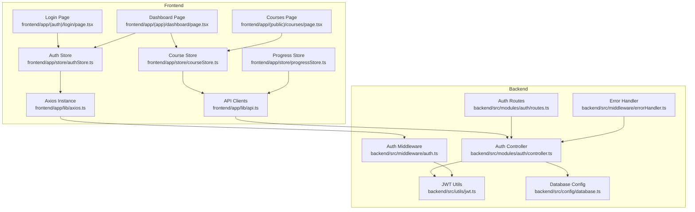
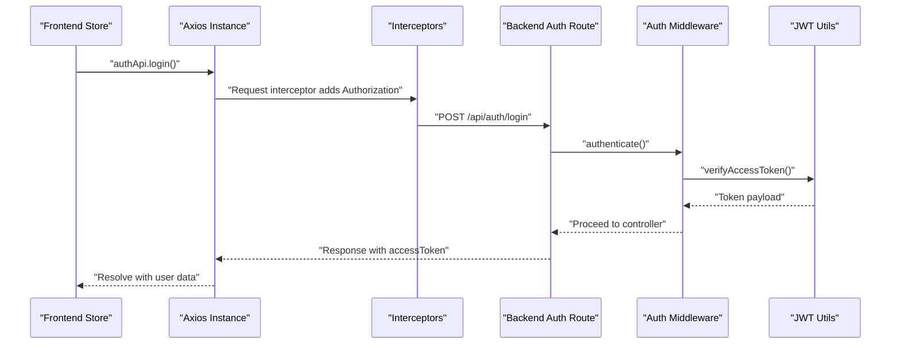
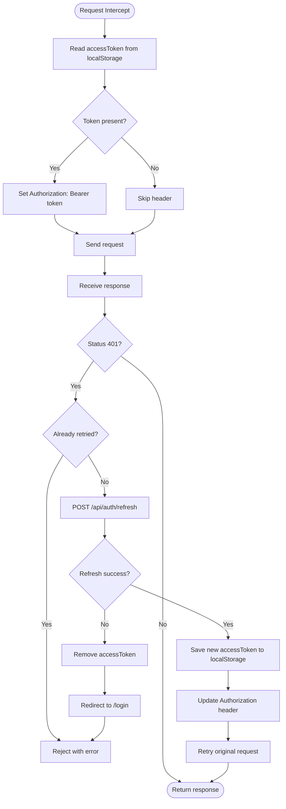
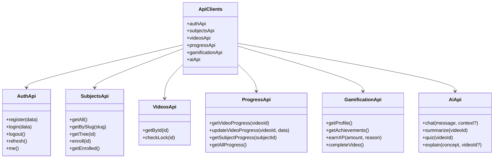
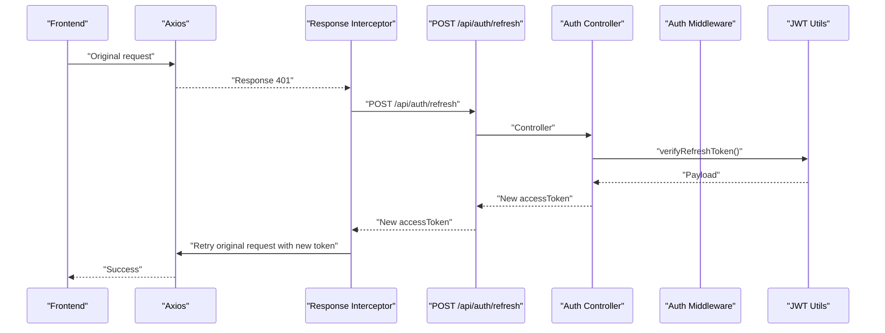
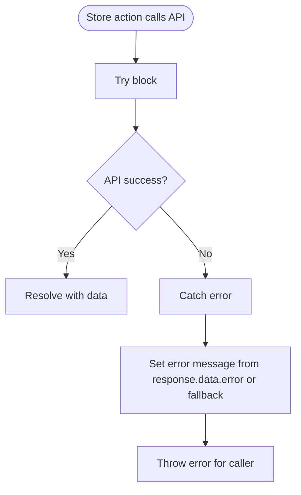
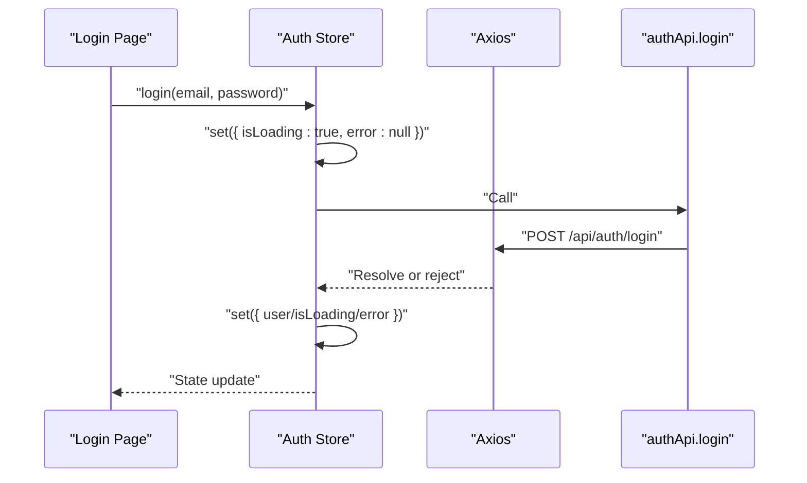
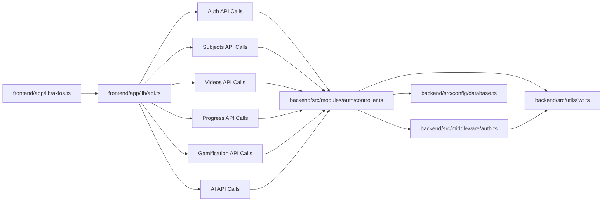

# API Integration Layer

<cite>
**Referenced Files in This Document**
- [axios.ts](file://frontend/app/lib/axios.ts)
- [api.ts](file://frontend/app/lib/api.ts)
- [authStore.ts](file://frontend/app/store/authStore.ts)
- [courseStore.ts](file://frontend/app/store/courseStore.ts)
- [progressStore.ts](file://frontend/app/store/progressStore.ts)
- [page.tsx](file://frontend/app/(auth)/login/page.tsx)
- [page.tsx](file://frontend/app/(app)/dashboard/page.tsx)
- [page.tsx](file://frontend/app/(public)/courses/page.tsx)
- [auth.ts](file://backend/src/middleware/auth.ts)
- [jwt.ts](file://backend/src/utils/jwt.ts)
- [controller.ts](file://backend/src/modules/auth/controller.ts)
- [routes.ts](file://backend/src/modules/auth/routes.ts)
- [errorHandler.ts](file://backend/src/middleware/errorHandler.ts)
- [database.ts](file://backend/src/config/database.ts)
</cite>

## Table of Contents
1. [Introduction](#introduction)
2. [Project Structure](#project-structure)
3. [Core Components](#core-components)
4. [Architecture Overview](#architecture-overview)
5. [Detailed Component Analysis](#detailed-component-analysis)
6. [Dependency Analysis](#dependency-analysis)
7. [Performance Considerations](#performance-considerations)
8. [Troubleshooting Guide](#troubleshooting-guide)
9. [Conclusion](#conclusion)

## Introduction
This document describes the API Integration Layer for the Learning Management System. It covers the Axios configuration, request and response interceptors, authentication token injection, automatic token refresh, error handling patterns, API endpoint mapping, and usage examples from frontend components. It also outlines loading state management and error handling patterns used across stores, and explains the authentication flow from the frontend to the backend.

## Project Structure
The API Integration Layer spans two primary areas:
- Frontend integration: Axios instance creation, interceptors, and typed API clients
- Backend authentication: middleware, token generation/verification, and protected routes

**Diagram sources**
- [axios.ts:1-61](file://frontend/app/lib/axios.ts#L1-L61)
- [api.ts:1-80](file://frontend/app/lib/api.ts#L1-L80)
- [authStore.ts:1-98](file://frontend/app/store/authStore.ts#L1-L98)
- [courseStore.ts:1-121](file://frontend/app/store/courseStore.ts#L1-L121)
- [progressStore.ts:1-87](file://frontend/app/store/progressStore.ts#L1-L87)
- [page.tsx](file://frontend/app/(auth)/login/page.tsx#L1-L140)
- [page.tsx](file://frontend/app/(app)/dashboard/page.tsx#L1-L171)
- [page.tsx](file://frontend/app/(public)/courses/page.tsx#L1-L97)
- [auth.ts:1-42](file://backend/src/middleware/auth.ts#L1-L42)
- [jwt.ts:1-78](file://backend/src/utils/jwt.ts#L1-L78)
- [controller.ts:1-99](file://backend/src/modules/auth/controller.ts#L1-L99)
- [routes.ts:1-15](file://backend/src/modules/auth/routes.ts#L1-L15)
- [errorHandler.ts:1-37](file://backend/src/middleware/errorHandler.ts#L1-L37)
- [database.ts:1-52](file://backend/src/config/database.ts#L1-L52)

**Section sources**
- [axios.ts:1-61](file://frontend/app/lib/axios.ts#L1-L61)
- [api.ts:1-80](file://frontend/app/lib/api.ts#L1-L80)
- [authStore.ts:1-98](file://frontend/app/store/authStore.ts#L1-L98)
- [courseStore.ts:1-121](file://frontend/app/store/courseStore.ts#L1-L121)
- [progressStore.ts:1-87](file://frontend/app/store/progressStore.ts#L1-L87)
- [auth.ts:1-42](file://backend/src/middleware/auth.ts#L1-L42)
- [jwt.ts:1-78](file://backend/src/utils/jwt.ts#L1-L78)
- [controller.ts:1-99](file://backend/src/modules/auth/controller.ts#L1-L99)
- [routes.ts:1-15](file://backend/src/modules/auth/routes.ts#L1-L15)
- [errorHandler.ts:1-37](file://backend/src/middleware/errorHandler.ts#L1-L37)
- [database.ts:1-52](file://backend/src/config/database.ts#L1-L52)

## Core Components
- Axios instance with base configuration and credentials support
- Request interceptor injecting Authorization header from localStorage
- Response interceptor implementing automatic token refresh on 401 errors
- Typed API clients grouped by domain (Auth, Subjects, Videos, Progress, Gamification, AI)
- Frontend stores managing loading states, errors, and data transformations
- Backend authentication middleware and token utilities
- Protected routes and error handling middleware

**Section sources**
- [axios.ts:1-61](file://frontend/app/lib/axios.ts#L1-L61)
- [api.ts:1-80](file://frontend/app/lib/api.ts#L1-L80)
- [authStore.ts:1-98](file://frontend/app/store/authStore.ts#L1-L98)
- [courseStore.ts:1-121](file://frontend/app/store/courseStore.ts#L1-L121)
- [progressStore.ts:1-87](file://frontend/app/store/progressStore.ts#L1-L87)
- [auth.ts:1-42](file://backend/src/middleware/auth.ts#L1-L42)
- [jwt.ts:1-78](file://backend/src/utils/jwt.ts#L1-L78)
- [controller.ts:1-99](file://backend/src/modules/auth/controller.ts#L1-L99)
- [routes.ts:1-15](file://backend/src/modules/auth/routes.ts#L1-L15)
- [errorHandler.ts:1-37](file://backend/src/middleware/errorHandler.ts#L1-L37)

## Architecture Overview
The frontend uses a single Axios instance configured with:
- Base URL pointing to the backend API
- JSON content type and credentials enabled
- Request interceptor adding Authorization: Bearer token from localStorage
- Response interceptor handling 401 Unauthorized by refreshing the token via a dedicated endpoint and retrying the original request

The backend enforces authentication via middleware that validates bearer tokens and exposes protected routes for authentication, profile retrieval, and logout.

**Diagram sources**
- [axios.ts:13-25](file://frontend/app/lib/axios.ts#L13-L25)
- [axios.ts:27-58](file://frontend/app/lib/axios.ts#L27-L58)
- [api.ts:4-16](file://frontend/app/lib/api.ts#L4-L16)
- [auth.ts:8-24](file://backend/src/middleware/auth.ts#L8-L24)
- [jwt.ts:43-45](file://backend/src/utils/jwt.ts#L43-L45)
- [controller.ts:18-35](file://backend/src/modules/auth/controller.ts#L18-L35)
- [routes.ts:7-12](file://backend/src/modules/auth/routes.ts#L7-L12)

## Detailed Component Analysis

### Axios Configuration and Interceptors
- Base configuration sets baseURL to /api, Content-Type to application/json, and enables credentials for cross-site cookies.
- Request interceptor reads the access token from localStorage and injects it into the Authorization header.
- Response interceptor handles 401 Unauthorized by attempting a token refresh via POST /api/auth/refresh, storing the new token, updating the Authorization header, and retrying the original request. On failure, it clears the invalid token and redirects to the login page.

**Diagram sources**
- [axios.ts:13-25](file://frontend/app/lib/axios.ts#L13-L25)
- [axios.ts:27-58](file://frontend/app/lib/axios.ts#L27-L58)

**Section sources**
- [axios.ts:1-61](file://frontend/app/lib/axios.ts#L1-L61)

### API Client Setup and Endpoint Mapping
The API client module exports typed functions for each domain:
- Auth: register, login, logout, refresh, me
- Subjects: getAll, getBySlug, getTree, enroll, getEnrolled
- Videos: getById, checkLock
- Progress: getVideoProgress, updateVideoProgress, getSubjectProgress, getAllProgress
- Gamification: getProfile, getAchievements, earnXP, completeVideo
- AI: chat, summarize, quiz, explain

These functions wrap the shared Axios instance and map to backend routes under /api/{endpoint}.

**Diagram sources**
- [api.ts:1-80](file://frontend/app/lib/api.ts#L1-L80)

**Section sources**
- [api.ts:1-80](file://frontend/app/lib/api.ts#L1-L80)

### Authentication Token Injection and Refresh Flow
- Frontend: Access token is injected into the Authorization header for every request.
- Backend: Middleware verifies the token and attaches user info to the request object.
- Token refresh: On 401, the frontend refreshes the token and retries the original request. The backend validates the refresh token against stored hashes and issues a new access token.

**Diagram sources**
- [axios.ts:27-58](file://frontend/app/lib/axios.ts#L27-L58)
- [controller.ts:48-70](file://backend/src/modules/auth/controller.ts#L48-L70)
- [jwt.ts:47-62](file://backend/src/utils/jwt.ts#L47-L62)
- [auth.ts:8-24](file://backend/src/middleware/auth.ts#L8-L24)

**Section sources**
- [axios.ts:13-58](file://frontend/app/lib/axios.ts#L13-L58)
- [auth.ts:1-42](file://backend/src/middleware/auth.ts#L1-L42)
- [jwt.ts:1-78](file://backend/src/utils/jwt.ts#L1-L78)
- [controller.ts:1-99](file://backend/src/modules/auth/controller.ts#L1-L99)

### Error Handling Mechanisms
- Frontend stores set loading states and capture error messages from response data, falling back to generic messages if unavailable.
- Backend error handler standardizes error responses with status codes and error codes, and wraps async handlers to avoid unhandled promise rejections.

**Diagram sources**
- [authStore.ts:34-62](file://frontend/app/store/authStore.ts#L34-L62)
- [courseStore.ts:58-85](file://frontend/app/store/courseStore.ts#L58-L85)
- [progressStore.ts:42-78](file://frontend/app/store/progressStore.ts#L42-L78)
- [errorHandler.ts:8-24](file://backend/src/middleware/errorHandler.ts#L8-L24)

**Section sources**
- [authStore.ts:1-98](file://frontend/app/store/authStore.ts#L1-L98)
- [courseStore.ts:1-121](file://frontend/app/store/courseStore.ts#L1-L121)
- [progressStore.ts:1-87](file://frontend/app/store/progressStore.ts#L1-L87)
- [errorHandler.ts:1-37](file://backend/src/middleware/errorHandler.ts#L1-L37)

### Loading State Management and Usage Examples
- Auth store manages isLoading during login/register and displays a spinner in the login page while requests are pending.
- Course and progress stores manage isLoading during data fetching and show skeleton loaders or empty states accordingly.
- Components trigger store actions on mount or form submission, and render based on isLoading, error, and loaded data.

**Diagram sources**
- [page.tsx](file://frontend/app/(auth)/login/page.tsx#L10-L34)
- [authStore.ts:34-49](file://frontend/app/store/authStore.ts#L34-L49)
- [api.ts:4-16](file://frontend/app/lib/api.ts#L4-L16)

**Section sources**
- [page.tsx](file://frontend/app/(auth)/login/page.tsx#L1-L140)
- [page.tsx](file://frontend/app/(app)/dashboard/page.tsx#L1-L171)
- [page.tsx](file://frontend/app/(public)/courses/page.tsx#L1-L97)
- [authStore.ts:1-98](file://frontend/app/store/authStore.ts#L1-L98)
- [courseStore.ts:1-121](file://frontend/app/store/courseStore.ts#L1-L121)
- [progressStore.ts:1-87](file://frontend/app/store/progressStore.ts#L1-L87)

### Data Transformation Utilities and Caching Strategies
- Frontend stores transform raw API responses into normalized state structures (e.g., maps for progress, arrays for subjects).
- No explicit client-side caching is implemented in the stores; data is fetched per action and stored in-memory.
- Backend uses a MySQL connection pool for efficient database operations and transactions.

**Section sources**
- [progressStore.ts:36-86](file://frontend/app/store/progressStore.ts#L36-L86)
- [courseStore.ts:48-120](file://frontend/app/store/courseStore.ts#L48-L120)
- [database.ts:1-52](file://backend/src/config/database.ts#L1-L52)

### Offline Handling Capabilities
- The current implementation does not include explicit offline handling or retry mechanisms beyond the token refresh interceptor. Requests fail as network errors when offline, and there is no local storage synchronization layer.

**Section sources**
- [axios.ts:1-61](file://frontend/app/lib/axios.ts#L1-L61)

## Dependency Analysis
The frontend depends on the Axios instance and typed API clients, which in turn depend on backend routes. The backend enforces authentication via middleware and uses JWT utilities for token lifecycle management.

**Diagram sources**
- [axios.ts:1-61](file://frontend/app/lib/axios.ts#L1-L61)
- [api.ts:1-80](file://frontend/app/lib/api.ts#L1-L80)
- [controller.ts:1-99](file://backend/src/modules/auth/controller.ts#L1-L99)
- [auth.ts:1-42](file://backend/src/middleware/auth.ts#L1-L42)
- [jwt.ts:1-78](file://backend/src/utils/jwt.ts#L1-L78)
- [database.ts:1-52](file://backend/src/config/database.ts#L1-L52)

**Section sources**
- [axios.ts:1-61](file://frontend/app/lib/axios.ts#L1-L61)
- [api.ts:1-80](file://frontend/app/lib/api.ts#L1-L80)
- [controller.ts:1-99](file://backend/src/modules/auth/controller.ts#L1-L99)
- [auth.ts:1-42](file://backend/src/middleware/auth.ts#L1-L42)
- [jwt.ts:1-78](file://backend/src/utils/jwt.ts#L1-L78)
- [database.ts:1-52](file://backend/src/config/database.ts#L1-L52)

## Performance Considerations
- Centralized Axios instance reduces overhead and ensures consistent configuration.
- Token refresh occurs only on 401 responses to minimize unnecessary refresh calls.
- Frontend stores avoid redundant re-fetches by relying on component lifecycle hooks and memoization patterns; consider adding optimistic updates and selective re-fetching for improved UX.
- Backend uses a connection pool to handle concurrent requests efficiently.

[No sources needed since this section provides general guidance]

## Troubleshooting Guide
Common issues and resolutions:
- 401 Unauthorized after token expiration: The response interceptor automatically attempts a refresh; if refresh fails, the token is cleared and the user is redirected to login.
- Login failures: Verify credentials and ensure the backend responds with an error message; the store captures and displays the error.
- Network errors: Confirm the NEXT_PUBLIC_API_URL environment variable and CORS/credentials configuration; ensure withCredentials is enabled.
- Backend token verification errors: Check JWT_SECRET and token expiry settings; ensure refresh tokens are not revoked or expired.

**Section sources**
- [axios.ts:27-58](file://frontend/app/lib/axios.ts#L27-L58)
- [authStore.ts:34-62](file://frontend/app/store/authStore.ts#L34-L62)
- [errorHandler.ts:8-24](file://backend/src/middleware/errorHandler.ts#L8-L24)
- [jwt.ts:47-62](file://backend/src/utils/jwt.ts#L47-L62)

## Conclusion
The API Integration Layer provides a robust, centralized Axios configuration with automatic token injection and refresh, typed API clients for each domain, and consistent error handling across frontend stores. The backend enforces authentication via middleware and JWT utilities, ensuring secure access to protected resources. While the current implementation focuses on reliability and simplicity, future enhancements could include client-side caching, retry policies, and offline support to further improve resilience and user experience.