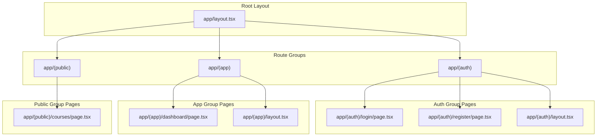
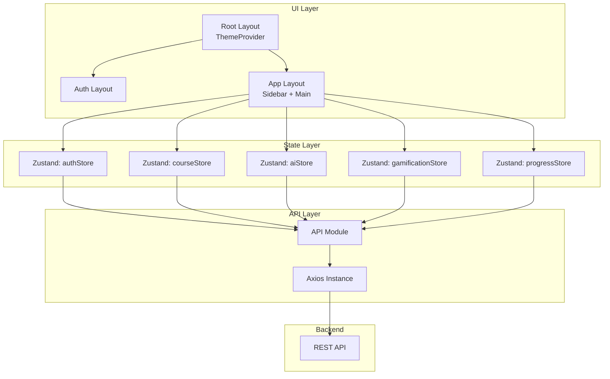
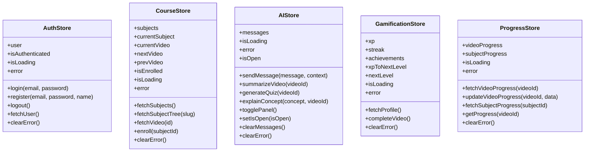
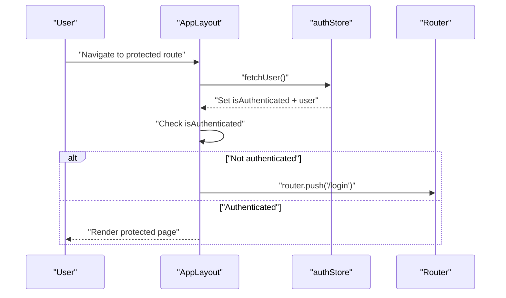
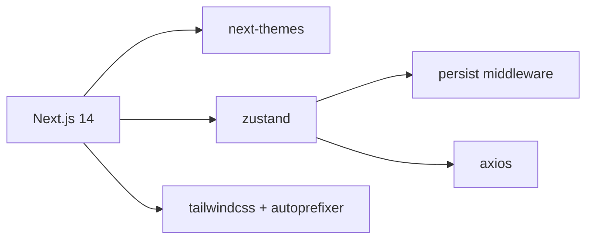

# Frontend Architecture

<cite>
**Referenced Files in This Document**
- [layout.tsx](file://frontend/app/layout.tsx)
- [layout.tsx](file://frontend/app/(auth)/layout.tsx)
- [layout.tsx](file://frontend/app/(app)/layout.tsx)
- [page.tsx](file://frontend/app/(auth)/login/page.tsx)
- [page.tsx](file://frontend/app/(auth)/register/page.tsx)
- [page.tsx](file://frontend/app/(app)/dashboard/page.tsx)
- [page.tsx](file://frontend/app/(public)/courses/page.tsx)
- [next.config.js](file://frontend/next.config.js)
- [package.json](file://frontend/package.json)
- [api.ts](file://frontend/app/lib/api.ts)
- [axios.ts](file://frontend/app/lib/axios.ts)
- [authStore.ts](file://frontend/app/store/authStore.ts)
- [courseStore.ts](file://frontend/app/store/courseStore.ts)
- [aiStore.ts](file://frontend/app/store/aiStore.ts)
- [gamificationStore.ts](file://frontend/app/store/gamificationStore.ts)
- [progressStore.ts](file://frontend/app/store/progressStore.ts)
- [tailwind.config.ts](file://frontend/tailwind.config.ts)
- [postcss.config.js](file://frontend/postcss.config.js)
</cite>

## Table of Contents
1. [Introduction](#introduction)
2. [Project Structure](#project-structure)
3. [Core Components](#core-components)
4. [Architecture Overview](#architecture-overview)
5. [Detailed Component Analysis](#detailed-component-analysis)
6. [Dependency Analysis](#dependency-analysis)
7. [Performance Considerations](#performance-considerations)
8. [Troubleshooting Guide](#troubleshooting-guide)
9. [Conclusion](#conclusion)

## Introduction
This document describes the frontend architecture of the Learning Management System built with Next.js App Router. It covers route groups and layouts, theme provider setup, component organization, state management with Zustand stores, and the integration with backend APIs. The application is structured into three primary route groups:
- Authentication group: handles login and registration flows
- Application group: protected area for authenticated users
- Public group: public-facing pages such as courses listing

The frontend leverages a theme provider for light/dark mode support, Tailwind CSS for styling, and Zustand for global state management. API communication is centralized via a dedicated module that wraps Axios.

## Project Structure
The frontend follows Next.js App Router conventions with route groups denoted by parentheses in the app directory. Each group encapsulates related pages and shared layouts.

**Diagram sources**
- [layout.tsx:13-27](file://frontend/app/layout.tsx#L13-L27)
- [layout.tsx](file://frontend/app/(auth)/layout.tsx#L1-L12)
- [layout.tsx](file://frontend/app/(app)/layout.tsx#L10-L116)
- [page.tsx](file://frontend/app/(auth)/login/page.tsx)
- [page.tsx](file://frontend/app/(auth)/register/page.tsx)
- [page.tsx](file://frontend/app/(app)/dashboard/page.tsx)
- [page.tsx](file://frontend/app/(public)/courses/page.tsx)

**Section sources**
- [layout.tsx:1-28](file://frontend/app/layout.tsx#L1-L28)
- [layout.tsx](file://frontend/app/(auth)/layout.tsx#L1-L12)
- [layout.tsx](file://frontend/app/(app)/layout.tsx#L1-L117)

## Core Components
- Root layout: Provides global metadata, font loading, and theme provider wrapping all pages.
- Auth layout: Minimal wrapper for authentication pages.
- App layout: Client-side layout with sidebar navigation, theme toggle, user profile, logout, and protected routing logic.
- Stores: Centralized state management for authentication, courses, AI assistant, gamification, and progress.
- API module: Unified interface to backend endpoints for auth, subjects, videos, progress, gamification, and AI.

Key implementation patterns:
- Route groups isolate authentication and application logic from public pages.
- Layout inheritance ensures consistent UI and behavior across pages within each group.
- Theme provider enables system-aware light/dark switching.
- Zustand stores encapsulate CRUD actions and side effects per domain.

**Section sources**
- [layout.tsx:1-28](file://frontend/app/layout.tsx#L1-L28)
- [layout.tsx](file://frontend/app/(auth)/layout.tsx#L1-L12)
- [layout.tsx](file://frontend/app/(app)/layout.tsx#L1-L117)
- [authStore.ts:1-98](file://frontend/app/store/authStore.ts#L1-L98)
- [courseStore.ts:1-121](file://frontend/app/store/courseStore.ts#L1-L121)
- [aiStore.ts:1-129](file://frontend/app/store/aiStore.ts#L1-L129)
- [gamificationStore.ts:1-86](file://frontend/app/store/gamificationStore.ts#L1-L86)
- [progressStore.ts:1-87](file://frontend/app/store/progressStore.ts#L1-L87)
- [api.ts:1-80](file://frontend/app/lib/api.ts#L1-L80)

## Architecture Overview
The frontend architecture centers around Next.js App Router with route groups and client-side layouts. The App layout enforces authentication checks and renders a persistent sidebar and main content area. State is managed globally via Zustand stores, while API calls are routed through a single module that abstracts HTTP requests.

**Diagram sources**
- [layout.tsx:13-27](file://frontend/app/layout.tsx#L13-L27)
- [layout.tsx](file://frontend/app/(auth)/layout.tsx#L1-L12)
- [layout.tsx](file://frontend/app/(app)/layout.tsx#L1-L117)
- [authStore.ts:1-98](file://frontend/app/store/authStore.ts#L1-L98)
- [courseStore.ts:1-121](file://frontend/app/store/courseStore.ts#L1-L121)
- [aiStore.ts:1-129](file://frontend/app/store/aiStore.ts#L1-L129)
- [gamificationStore.ts:1-86](file://frontend/app/store/gamificationStore.ts#L1-L86)
- [progressStore.ts:1-87](file://frontend/app/store/progressStore.ts#L1-L87)
- [api.ts:1-80](file://frontend/app/lib/api.ts#L1-L80)
- [axios.ts](file://frontend/app/lib/axios.ts)

## Detailed Component Analysis

### Theme Provider Setup
The root layout initializes the theme provider and font stack, enabling system-aware theme selection and consistent typography across the application.

Implementation highlights:
- Theme provider configured with class attribute and system default.
- Inter font loaded for optimal typography.
- Hydration suppression prevents mismatch between server and client rendering.

**Section sources**
- [layout.tsx:1-28](file://frontend/app/layout.tsx#L1-L28)
- [tailwind.config.ts:1-101](file://frontend/tailwind.config.ts#L1-L101)

### Route Groups and Layout Inheritance
- Authentication group: Wraps login and register pages with a minimal layout that does not enforce authentication.
- Application group: Wraps protected pages with a client-side layout that manages user session, navigation, and theme switching.
- Public group: Encapsulates public pages like courses listing.

Layout inheritance:
- Each group’s layout composes its child pages, ensuring consistent structure and behavior.
- The App layout performs authentication checks and redirects unauthenticated users to the login page.

**Section sources**
- [layout.tsx](file://frontend/app/(auth)/layout.tsx#L1-L12)
- [layout.tsx](file://frontend/app/(app)/layout.tsx#L1-L117)
- [page.tsx](file://frontend/app/(auth)/login/page.tsx)
- [page.tsx](file://frontend/app/(auth)/register/page.tsx)
- [page.tsx](file://frontend/app/(app)/dashboard/page.tsx)
- [page.tsx](file://frontend/app/(public)/courses/page.tsx)

### State Management with Zustand
The application uses multiple Zustand stores to manage domain-specific state and side effects. Stores are organized by feature:
- Authentication store: user profile, auth status, login/logout actions, and persisted storage.
- Course store: subjects tree, current subject/video, enrollment state, and navigation helpers.
- AI store: chat messages, panel visibility, and AI-powered actions (chat, summarize, quiz, explain).
- Gamification store: XP/streak/achievements and level progression data.
- Progress store: video and subject progress tracking with maps for efficient lookups.

Common patterns:
- Asynchronous actions encapsulate API calls and update state accordingly.
- Error handling sets error state and exposes a clear error message.
- Persisted stores maintain state across sessions where appropriate.

**Diagram sources**
- [authStore.ts:1-98](file://frontend/app/store/authStore.ts#L1-L98)
- [courseStore.ts:1-121](file://frontend/app/store/courseStore.ts#L1-L121)
- [aiStore.ts:1-129](file://frontend/app/store/aiStore.ts#L1-L129)
- [gamificationStore.ts:1-86](file://frontend/app/store/gamificationStore.ts#L1-L86)
- [progressStore.ts:1-87](file://frontend/app/store/progressStore.ts#L1-L87)

**Section sources**
- [authStore.ts:1-98](file://frontend/app/store/authStore.ts#L1-L98)
- [courseStore.ts:1-121](file://frontend/app/store/courseStore.ts#L1-L121)
- [aiStore.ts:1-129](file://frontend/app/store/aiStore.ts#L1-L129)
- [gamificationStore.ts:1-86](file://frontend/app/store/gamificationStore.ts#L1-L86)
- [progressStore.ts:1-87](file://frontend/app/store/progressStore.ts#L1-L87)

### API Integration and Rewrites
The API module centralizes HTTP calls to backend endpoints for auth, subjects, videos, progress, gamification, and AI. The Next.js configuration defines a rewrite rule to proxy API requests to the backend server, supporting development and deployment scenarios.

Key points:
- API module exports typed functions for each endpoint category.
- Next.js rewrites forward /api/* requests to the backend URL.
- Images domains are whitelisted for external assets.

**Section sources**
- [api.ts:1-80](file://frontend/app/lib/api.ts#L1-L80)
- [next.config.js:1-20](file://frontend/next.config.js#L1-L20)

### Routing Implementation and Protected Areas
Protected routing is enforced in the App layout:
- On mount, the layout fetches the current user profile.
- If the user is not authenticated and navigates away from login/register, they are redirected to the login page.
- Navigation items are rendered in the sidebar, with active state highlighting.

**Diagram sources**
- [layout.tsx](file://frontend/app/(app)/layout.tsx#L20-L28)
- [authStore.ts:74-88](file://frontend/app/store/authStore.ts#L74-L88)

**Section sources**
- [layout.tsx](file://frontend/app/(app)/layout.tsx#L1-L117)
- [authStore.ts:1-98](file://frontend/app/store/authStore.ts#L1-L98)

### Component Composition Patterns
- Layout-first composition: Root layout wraps all pages; group layouts wrap group pages; App layout composes protected pages.
- Client-side composition: App layout uses client directives to enable navigation hooks and theme switching.
- UI primitives: Tailwind CSS provides a consistent design system with custom colors, animations, and shadows.

Styling and theming:
- Tailwind content scanning includes app, components, and pages directories.
- Dark mode controlled via class attribute.
- Custom color palette and animations defined for consistent UX.

**Section sources**
- [layout.tsx:1-28](file://frontend/app/layout.tsx#L1-L28)
- [layout.tsx](file://frontend/app/(app)/layout.tsx#L1-L117)
- [tailwind.config.ts:1-101](file://frontend/tailwind.config.ts#L1-L101)
- [postcss.config.js:1-7](file://frontend/postcss.config.js#L1-L7)

## Dependency Analysis
External dependencies and integrations:
- Next.js 14 with App Router and experimental appDir enabled.
- next-themes for theme provider and system-aware theme switching.
- Zustand for lightweight state management with optional persistence.
- Axios for HTTP client abstraction.
- Tailwind CSS with PostCSS and autoprefixer for styling.

**Diagram sources**
- [package.json:12-35](file://frontend/package.json#L12-L35)
- [next.config.js:1-20](file://frontend/next.config.js#L1-L20)
- [tailwind.config.ts:1-101](file://frontend/tailwind.config.ts#L1-L101)
- [postcss.config.js:1-7](file://frontend/postcss.config.js#L1-L7)

**Section sources**
- [package.json:1-37](file://frontend/package.json#L1-L37)
- [next.config.js:1-20](file://frontend/next.config.js#L1-L20)

## Performance Considerations
- Client-side layouts: Keep client directives scoped to components requiring navigation or theme switching to minimize client bundle size.
- Zustand stores: Prefer selective state updates and avoid unnecessary re-renders by keeping state granular.
- API caching: Introduce caching strategies at the store level for repeated reads of static data (e.g., subjects list).
- Image optimization: Leverage Next.js image optimization and whitelist domains for external images.
- CSS scanning: Ensure Tailwind content globs match actual usage to reduce CSS bundle size.

## Troubleshooting Guide
Common issues and resolutions:
- Authentication redirect loop: Verify that the auth store correctly persists tokens and that fetchUser resolves without errors.
- Theme not switching: Confirm that the theme provider attribute is set to class and that dark mode is enabled in Tailwind configuration.
- API rewrites: Ensure NEXT_PUBLIC_API_URL is set appropriately in the environment; otherwise, requests fall back to localhost.
- Missing UI components: Tailwind content globs must include the directories where components live; adjust content patterns if custom UI components are placed outside default locations.

**Section sources**
- [layout.tsx](file://frontend/app/(app)/layout.tsx#L20-L28)
- [authStore.ts:74-88](file://frontend/app/store/authStore.ts#L74-L88)
- [tailwind.config.ts:4-9](file://frontend/tailwind.config.ts#L4-L9)
- [next.config.js:9-16](file://frontend/next.config.js#L9-L16)

## Conclusion
The frontend architecture employs Next.js App Router with route groups to cleanly separate authentication, application, and public concerns. The theme provider and Tailwind-based design system deliver a responsive and accessible UI. Zustand stores encapsulate domain logic and side effects, while a unified API module simplifies backend integration. The App layout enforces authentication and provides a consistent navigation experience for authenticated users.