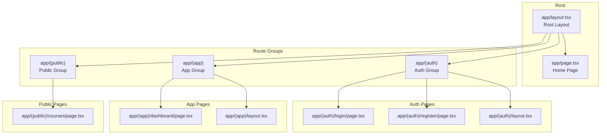
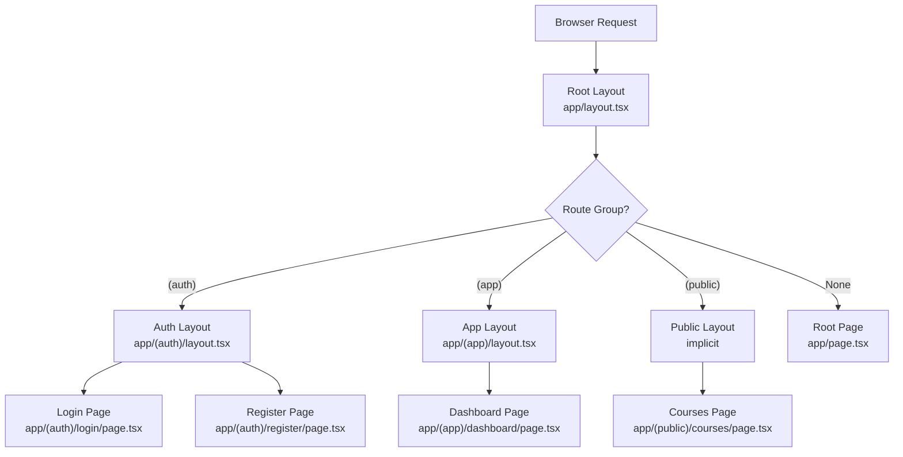
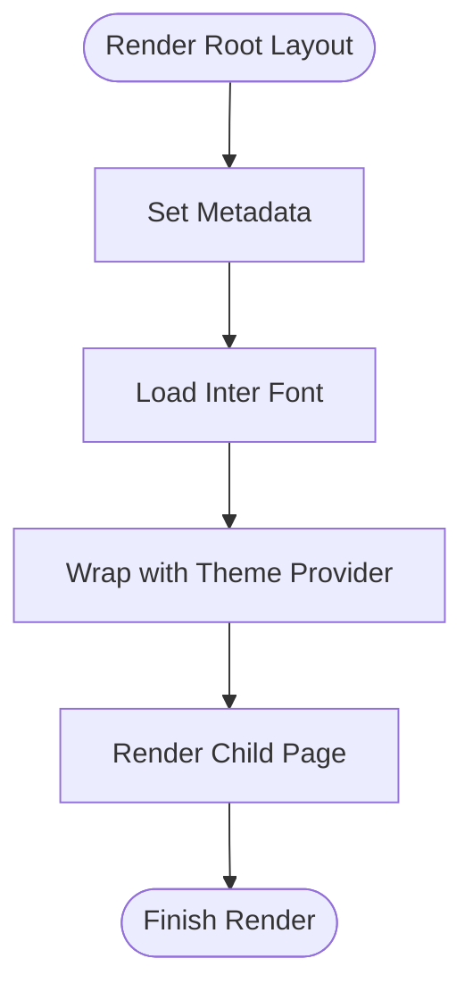
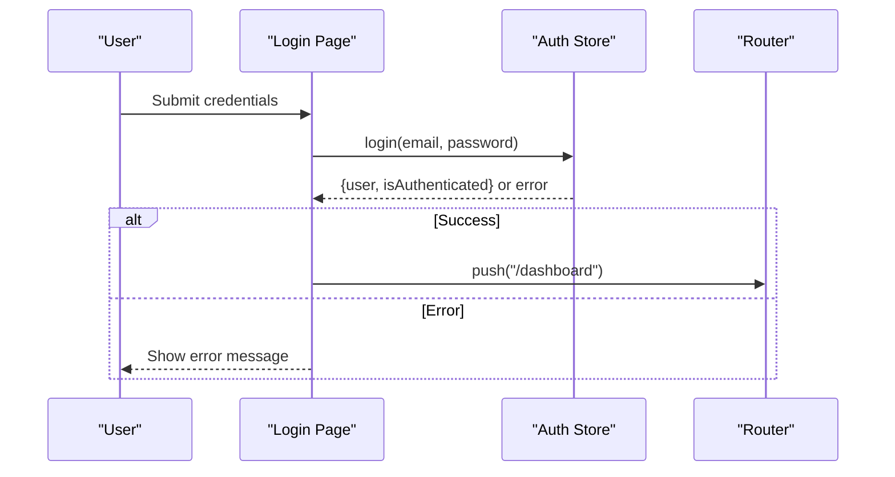
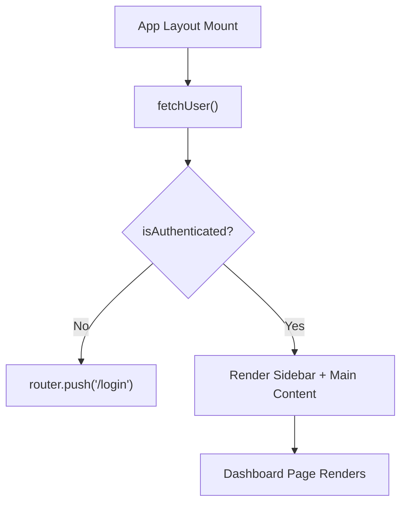
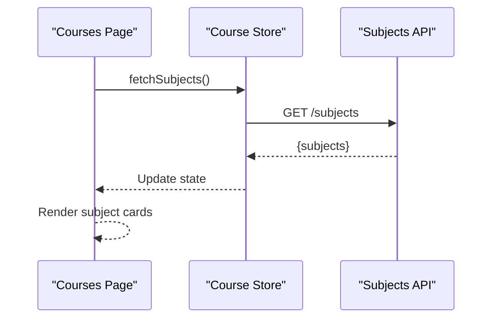
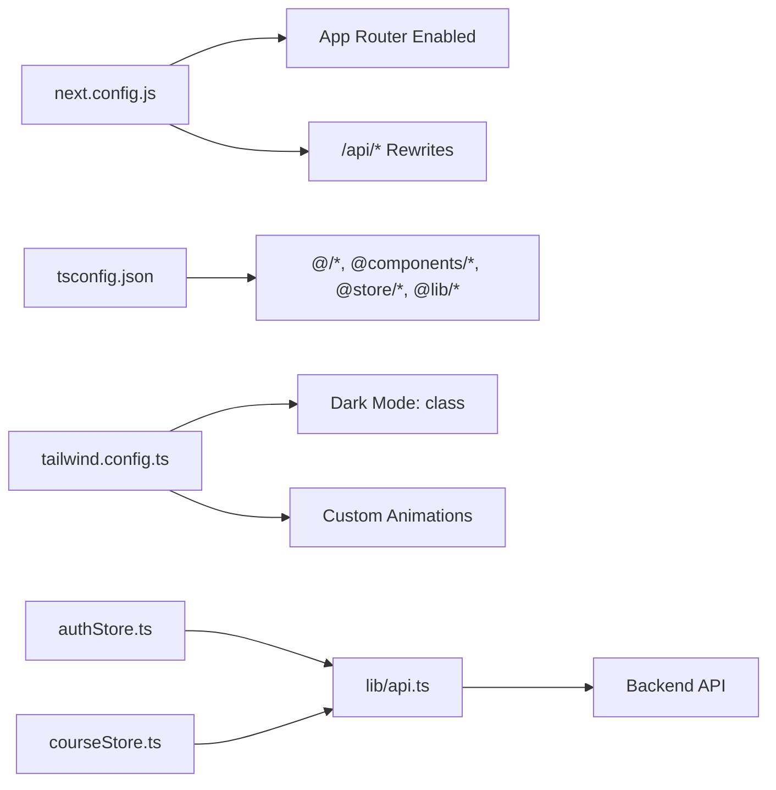

# Next.js Application Structure

<cite>
**Referenced Files in This Document**
- [frontend/app/layout.tsx](file://frontend/app/layout.tsx)
- [frontend/app/(auth)/layout.tsx](file://frontend/app/(auth)/layout.tsx)
- [frontend/app/(app)/layout.tsx](file://frontend/app/(app)/layout.tsx)
- [frontend/app/(auth)/login/page.tsx](file://frontend/app/(auth)/login/page.tsx)
- [frontend/app/(auth)/register/page.tsx](file://frontend/app/(auth)/register/page.tsx)
- [frontend/app/(app)/dashboard/page.tsx](file://frontend/app/(app)/dashboard/page.tsx)
- [frontend/app/(public)/courses/page.tsx](file://frontend/app/(public)/courses/page.tsx)
- [frontend/app/page.tsx](file://frontend/app/page.tsx)
- [frontend/app/store/authStore.ts](file://frontend/app/store/authStore.ts)
- [frontend/app/store/courseStore.ts](file://frontend/app/store/courseStore.ts)
- [frontend/app/lib/api.ts](file://frontend/app/lib/api.ts)
- [frontend/next.config.js](file://frontend/next.config.js)
- [frontend/tsconfig.json](file://frontend/tsconfig.json)
- [frontend/tailwind.config.ts](file://frontend/tailwind.config.ts)
- [frontend/postcss.config.js](file://frontend/postcss.config.js)
- [frontend/package.json](file://frontend/package.json)
</cite>

## Table of Contents
1. [Introduction](#introduction)
2. [Project Structure](#project-structure)
3. [Core Components](#core-components)
4. [Architecture Overview](#architecture-overview)
5. [Detailed Component Analysis](#detailed-component-analysis)
6. [Dependency Analysis](#dependency-analysis)
7. [Performance Considerations](#performance-considerations)
8. [Troubleshooting Guide](#troubleshooting-guide)
9. [Conclusion](#conclusion)
10. [Appendices](#appendices)

## Introduction
This document explains the Next.js application structure for the learning platform, focusing on the App Router configuration, route groups, and layout hierarchy. It covers how the application organizes pages under route groups such as (app), (auth), and (public), how layouts inherit and compose, and how navigation and authentication flow work. It also documents Next.js configuration, TypeScript setup, and Tailwind CSS integration.

## Project Structure
The frontend follows Next.js App Router conventions with a conventional app directory. Route groups are used to organize related pages without affecting URLs:
- (app): Protected area for authenticated users (dashboard, internal navigation)
- (auth): Authentication pages (login, register)
- (public): Publicly accessible pages (courses listing)
- Root-level pages (home page, global layout)

**Diagram sources**
- [frontend/app/layout.tsx](file://frontend/app/layout.tsx)
- [frontend/app/page.tsx](file://frontend/app/page.tsx)
- [frontend/app/(auth)/layout.tsx](file://frontend/app/(auth)/layout.tsx)
- [frontend/app/(auth)/login/page.tsx](file://frontend/app/(auth)/login/page.tsx)
- [frontend/app/(auth)/register/page.tsx](file://frontend/app/(auth)/register/page.tsx)
- [frontend/app/(app)/layout.tsx](file://frontend/app/(app)/layout.tsx)
- [frontend/app/(app)/dashboard/page.tsx](file://frontend/app/(app)/dashboard/page.tsx)
- [frontend/app/(public)/courses/page.tsx](file://frontend/app/(public)/courses/page.tsx)

**Section sources**
- [frontend/app/layout.tsx](file://frontend/app/layout.tsx)
- [frontend/app/page.tsx](file://frontend/app/page.tsx)
- [frontend/app/(auth)/layout.tsx](file://frontend/app/(auth)/layout.tsx)
- [frontend/app/(auth)/login/page.tsx](file://frontend/app/(auth)/login/page.tsx)
- [frontend/app/(auth)/register/page.tsx](file://frontend/app/(auth)/register/page.tsx)
- [frontend/app/(app)/layout.tsx](file://frontend/app/(app)/layout.tsx)
- [frontend/app/(app)/dashboard/page.tsx](file://frontend/app/(app)/dashboard/page.tsx)
- [frontend/app/(public)/courses/page.tsx](file://frontend/app/(public)/courses/page.tsx)

## Core Components
- Root layout: Provides global metadata, theme provider, and typography setup.
- Auth layout: Wraps authentication pages with a minimal container.
- App layout: Manages sidebar navigation, theme switching, user profile, and guards unauthenticated access.
- Store modules: Centralized state for authentication and course data.
- API module: Unified client for backend endpoints.

Key responsibilities:
- Layout inheritance: Root layout wraps all pages; route groups add their own wrappers.
- Navigation: Links within layouts and pages navigate using Next.js Link and router.
- Authentication: Guards protected routes and redirects unauthenticated users to login.

**Section sources**
- [frontend/app/layout.tsx](file://frontend/app/layout.tsx)
- [frontend/app/(auth)/layout.tsx](file://frontend/app/(auth)/layout.tsx)
- [frontend/app/(app)/layout.tsx](file://frontend/app/(app)/layout.tsx)
- [frontend/app/store/authStore.ts](file://frontend/app/store/authStore.ts)
- [frontend/app/store/courseStore.ts](file://frontend/app/store/courseStore.ts)
- [frontend/app/lib/api.ts](file://frontend/app/lib/api.ts)

## Architecture Overview
The application uses Next.js App Router with route groups to segment concerns. The root layout defines global providers and metadata. Route groups encapsulate related pages and optional shared layouts. Protected areas rely on client-side guards and stores to enforce access control.

**Diagram sources**
- [frontend/app/layout.tsx](file://frontend/app/layout.tsx)
- [frontend/app/(auth)/layout.tsx](file://frontend/app/(auth)/layout.tsx)
- [frontend/app/(auth)/login/page.tsx](file://frontend/app/(auth)/login/page.tsx)
- [frontend/app/(auth)/register/page.tsx](file://frontend/app/(auth)/register/page.tsx)
- [frontend/app/(app)/layout.tsx](file://frontend/app/(app)/layout.tsx)
- [frontend/app/(app)/dashboard/page.tsx](file://frontend/app/(app)/dashboard/page.tsx)
- [frontend/app/(public)/courses/page.tsx](file://frontend/app/(public)/courses/page.tsx)
- [frontend/app/page.tsx](file://frontend/app/page.tsx)

## Detailed Component Analysis

### Root Layout and Global Providers
- Defines site metadata and font loading.
- Wraps children with a theme provider for light/dark mode support.
- Applies global CSS and sets HTML attributes.

**Diagram sources**
- [frontend/app/layout.tsx](file://frontend/app/layout.tsx)

**Section sources**
- [frontend/app/layout.tsx](file://frontend/app/layout.tsx)

### Auth Route Group and Pages
- Auth layout provides a minimal wrapper for login and register.
- Login page handles form submission, redirects on success, and displays errors from the store.
- Register page manages registration flow and redirects to login on success.

**Diagram sources**
- [frontend/app/(auth)/login/page.tsx](file://frontend/app/(auth)/login/page.tsx)
- [frontend/app/store/authStore.ts](file://frontend/app/store/authStore.ts)

**Section sources**
- [frontend/app/(auth)/layout.tsx](file://frontend/app/(auth)/layout.tsx)
- [frontend/app/(auth)/login/page.tsx](file://frontend/app/(auth)/login/page.tsx)
- [frontend/app/(auth)/register/page.tsx](file://frontend/app/(auth)/register/page.tsx)
- [frontend/app/store/authStore.ts](file://frontend/app/store/authStore.ts)

### App Route Group and Dashboard
- App layout enforces authentication via guards and redirects to login when unauthenticated.
- Provides a sidebar with navigation links and a theme toggle.
- Dashboard page consumes course and gamification stores to render user stats and course previews.

**Diagram sources**
- [frontend/app/(app)/layout.tsx](file://frontend/app/(app)/layout.tsx)
- [frontend/app/(app)/dashboard/page.tsx](file://frontend/app/(app)/dashboard/page.tsx)
- [frontend/app/store/authStore.ts](file://frontend/app/store/authStore.ts)

**Section sources**
- [frontend/app/(app)/layout.tsx](file://frontend/app/(app)/layout.tsx)
- [frontend/app/(app)/dashboard/page.tsx](file://frontend/app/(app)/dashboard/page.tsx)
- [frontend/app/store/authStore.ts](file://frontend/app/store/authStore.ts)
- [frontend/app/store/courseStore.ts](file://frontend/app/store/courseStore.ts)

### Public Route Group and Courses Listing
- Courses page lists subjects, shows loading skeletons, and navigates to course details.
- Uses course store to fetch and display subject data.

**Diagram sources**
- [frontend/app/(public)/courses/page.tsx](file://frontend/app/(public)/courses/page.tsx)
- [frontend/app/store/courseStore.ts](file://frontend/app/store/courseStore.ts)
- [frontend/app/lib/api.ts](file://frontend/app/lib/api.ts)

**Section sources**
- [frontend/app/(public)/courses/page.tsx](file://frontend/app/(public)/courses/page.tsx)
- [frontend/app/store/courseStore.ts](file://frontend/app/store/courseStore.ts)
- [frontend/app/lib/api.ts](file://frontend/app/lib/api.ts)

### Home Page Composition
- Home page showcases hero, features, and call-to-action sections.
- Uses motion animations and Tailwind utilities for responsive design.

**Section sources**
- [frontend/app/page.tsx](file://frontend/app/page.tsx)

## Dependency Analysis
- Next.js configuration enables App Router and API rewrites to backend.
- TypeScript configuration uses bundler module resolution and path aliases.
- Tailwind CSS scans app components and supports dark mode and custom animations.
- Stores depend on the API client for HTTP requests.

**Diagram sources**
- [frontend/next.config.js](file://frontend/next.config.js)
- [frontend/tsconfig.json](file://frontend/tsconfig.json)
- [frontend/tailwind.config.ts](file://frontend/tailwind.config.ts)
- [frontend/app/store/authStore.ts](file://frontend/app/store/authStore.ts)
- [frontend/app/store/courseStore.ts](file://frontend/app/store/courseStore.ts)
- [frontend/app/lib/api.ts](file://frontend/app/lib/api.ts)

**Section sources**
- [frontend/next.config.js](file://frontend/next.config.js)
- [frontend/tsconfig.json](file://frontend/tsconfig.json)
- [frontend/tailwind.config.ts](file://frontend/tailwind.config.ts)
- [frontend/postcss.config.js](file://frontend/postcss.config.js)
- [frontend/package.json](file://frontend/package.json)

## Performance Considerations
- App Router: Enablement improves static generation and route handling.
- Image optimization: Configure allowed domains for external images.
- Rewrites: Proxy /api/* to backend to avoid CORS and simplify client code.
- CSS scanning: Tailwind scans app directory to purge unused styles.
- Client-side caching: Zustand persistence for auth reduces redundant requests.

[No sources needed since this section provides general guidance]

## Troubleshooting Guide
Common issues and resolutions:
- Authentication redirect loop: Verify token presence and store hydration; ensure guards run after initial hydration.
- API rewrites failing: Confirm NEXT_PUBLIC_API_URL is set and rewrite target matches backend.
- Tailwind utilities missing: Ensure content globs include app directory and rebuild.
- TypeScript path aliases: Confirm tsconfig paths match imports and Next.js recognizes them.

**Section sources**
- [frontend/app/(app)/layout.tsx](file://frontend/app/(app)/layout.tsx)
- [frontend/next.config.js](file://frontend/next.config.js)
- [frontend/tailwind.config.ts](file://frontend/tailwind.config.ts)
- [frontend/tsconfig.json](file://frontend/tsconfig.json)

## Conclusion
The application leverages Next.js App Router with route groups to cleanly separate authentication, protected application views, and public content. Layouts inherit from the root layout and optionally wrap route groups. State management via stores integrates with a unified API client, while configuration files define routing, TypeScript, and styling. This structure supports scalable navigation, robust authentication flows, and maintainable component composition.

[No sources needed since this section summarizes without analyzing specific files]

## Appendices

### Route Group Usage Examples
- (auth): Wrap login and register pages with a minimal layout and apply client-side guards.
- (app): Protect dashboard and internal pages with an authenticated layout and navigation.
- (public): Expose courses listing without authentication.

**Section sources**
- [frontend/app/(auth)/layout.tsx](file://frontend/app/(auth)/layout.tsx)
- [frontend/app/(auth)/login/page.tsx](file://frontend/app/(auth)/login/page.tsx)
- [frontend/app/(auth)/register/page.tsx](file://frontend/app/(auth)/register/page.tsx)
- [frontend/app/(app)/layout.tsx](file://frontend/app/(app)/layout.tsx)
- [frontend/app/(app)/dashboard/page.tsx](file://frontend/app/(app)/dashboard/page.tsx)
- [frontend/app/(public)/courses/page.tsx](file://frontend/app/(public)/courses/page.tsx)

### Layout Composition Patterns
- Root layout provides global providers and metadata.
- Route group layouts wrap pages within the same group.
- Nested layouts combine to form a hierarchy: Root -> Group -> Page.

**Section sources**
- [frontend/app/layout.tsx](file://frontend/app/layout.tsx)
- [frontend/app/(auth)/layout.tsx](file://frontend/app/(auth)/layout.tsx)
- [frontend/app/(app)/layout.tsx](file://frontend/app/(app)/layout.tsx)

### Navigation Patterns
- Use Next.js Link for client-side navigation within the app.
- Use router hooks to programmatically navigate after authentication actions.
- Maintain consistent sidebar navigation in the app layout.

**Section sources**
- [frontend/app/(app)/layout.tsx](file://frontend/app/(app)/layout.tsx)
- [frontend/app/(auth)/login/page.tsx](file://frontend/app/(auth)/login/page.tsx)
- [frontend/app/(auth)/register/page.tsx](file://frontend/app/(auth)/register/page.tsx)
- [frontend/app/(public)/courses/page.tsx](file://frontend/app/(public)/courses/page.tsx)

### Next.js Configuration Options
- App Router enabled for modern routing and static generation.
- Image domains whitelisted for optimized images.
- API rewrites proxy requests to backend.

**Section sources**
- [frontend/next.config.js](file://frontend/next.config.js)

### TypeScript Setup
- Strict mode enabled with bundler module resolution.
- Path aliases for components, stores, and libraries.
- Plugins configured for Next.js TypeScript integration.

**Section sources**
- [frontend/tsconfig.json](file://frontend/tsconfig.json)

### Build Optimization Settings
- Tailwind CSS configured with content scanning and dark mode support.
- PostCSS pipeline includes Tailwind and Autoprefixer.
- Package scripts for development, production, linting, and type checking.

**Section sources**
- [frontend/tailwind.config.ts](file://frontend/tailwind.config.ts)
- [frontend/postcss.config.js](file://frontend/postcss.config.js)
- [frontend/package.json](file://frontend/package.json)