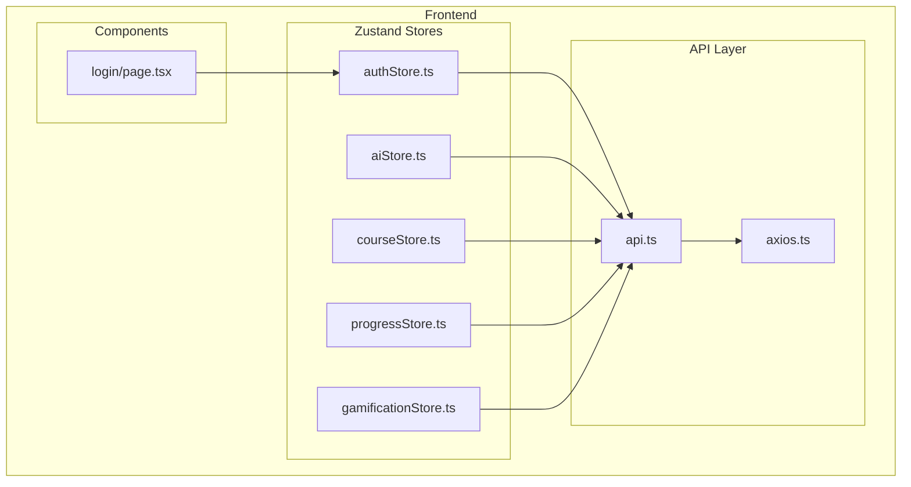
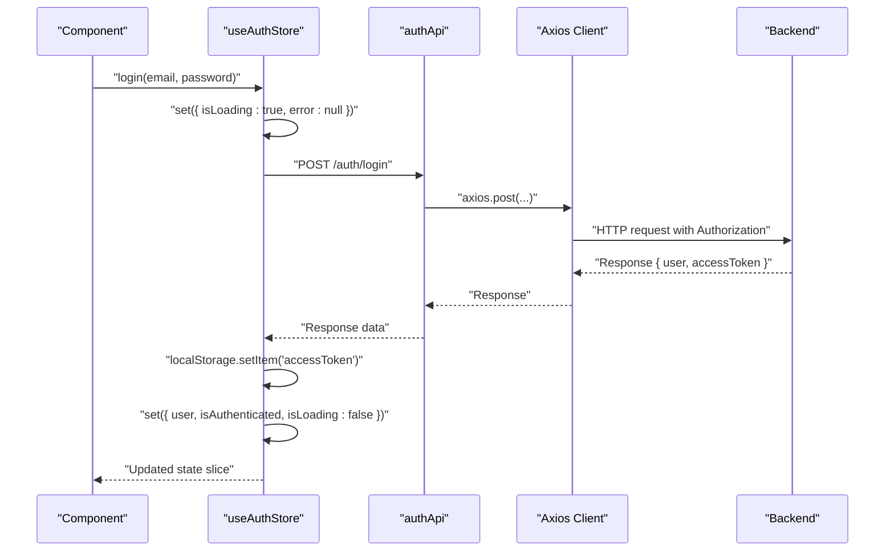
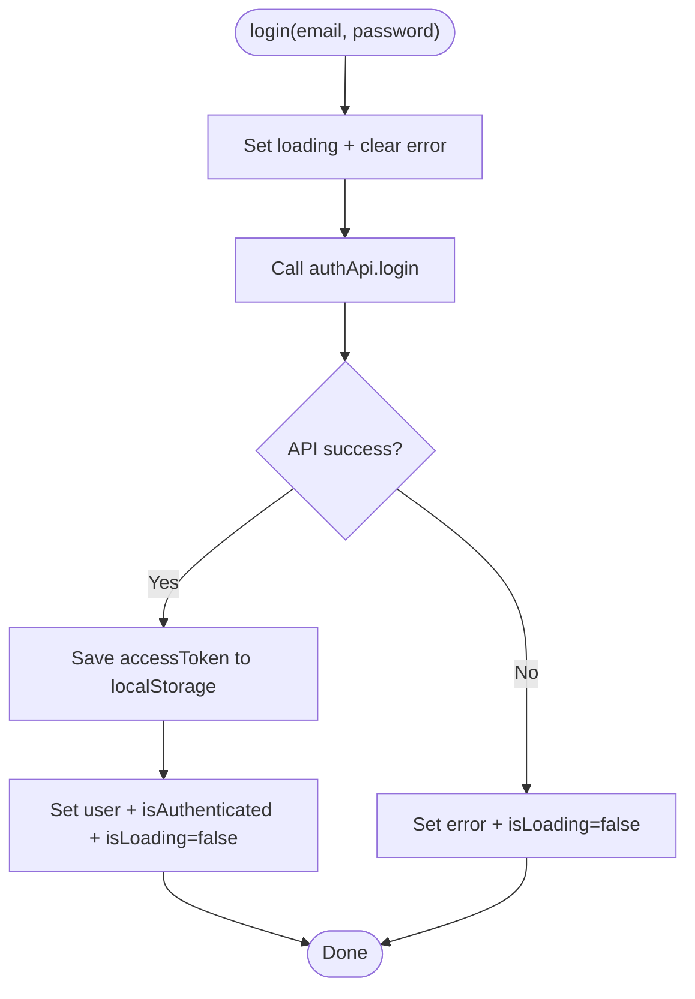
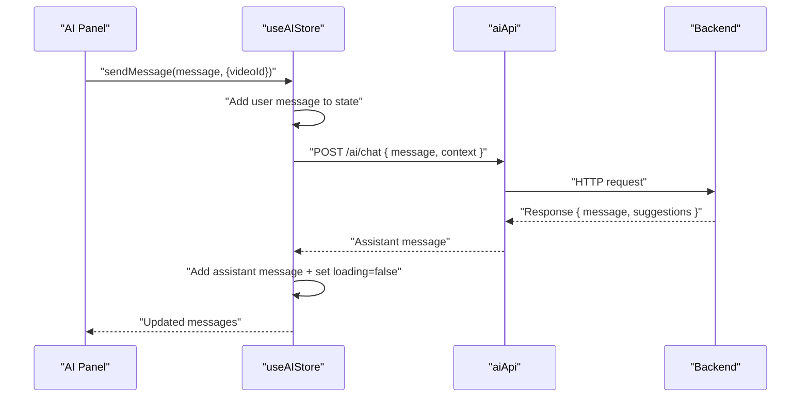
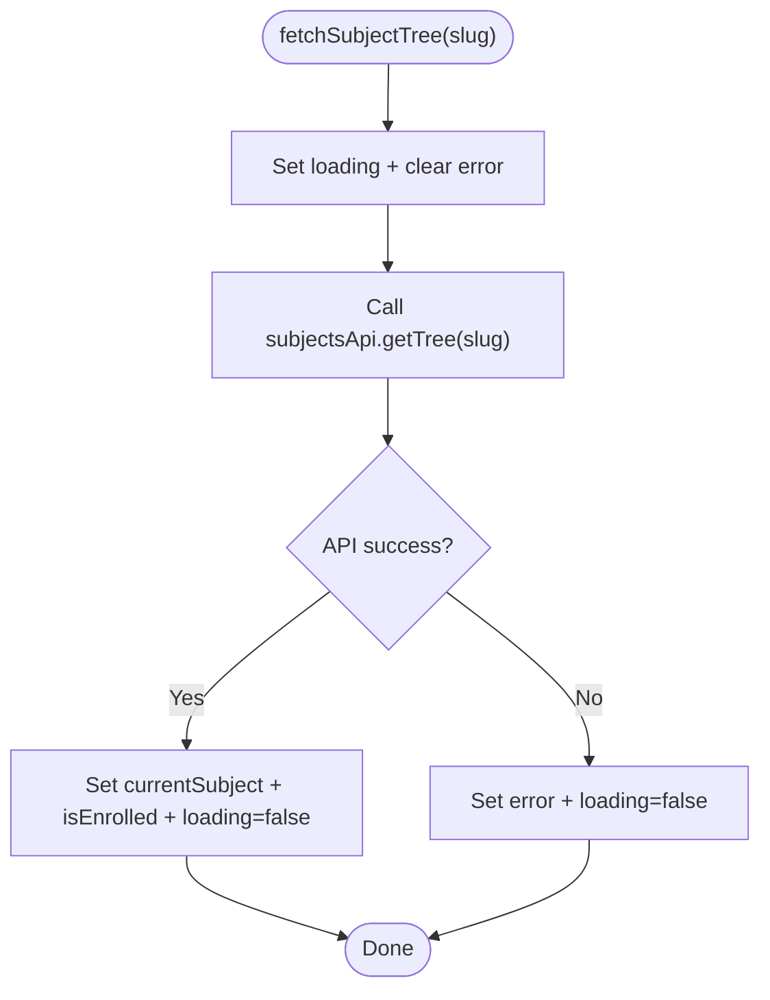
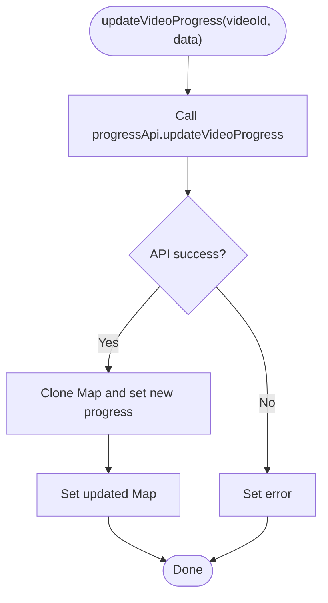
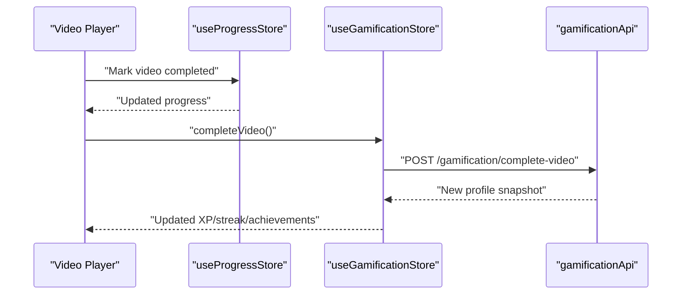
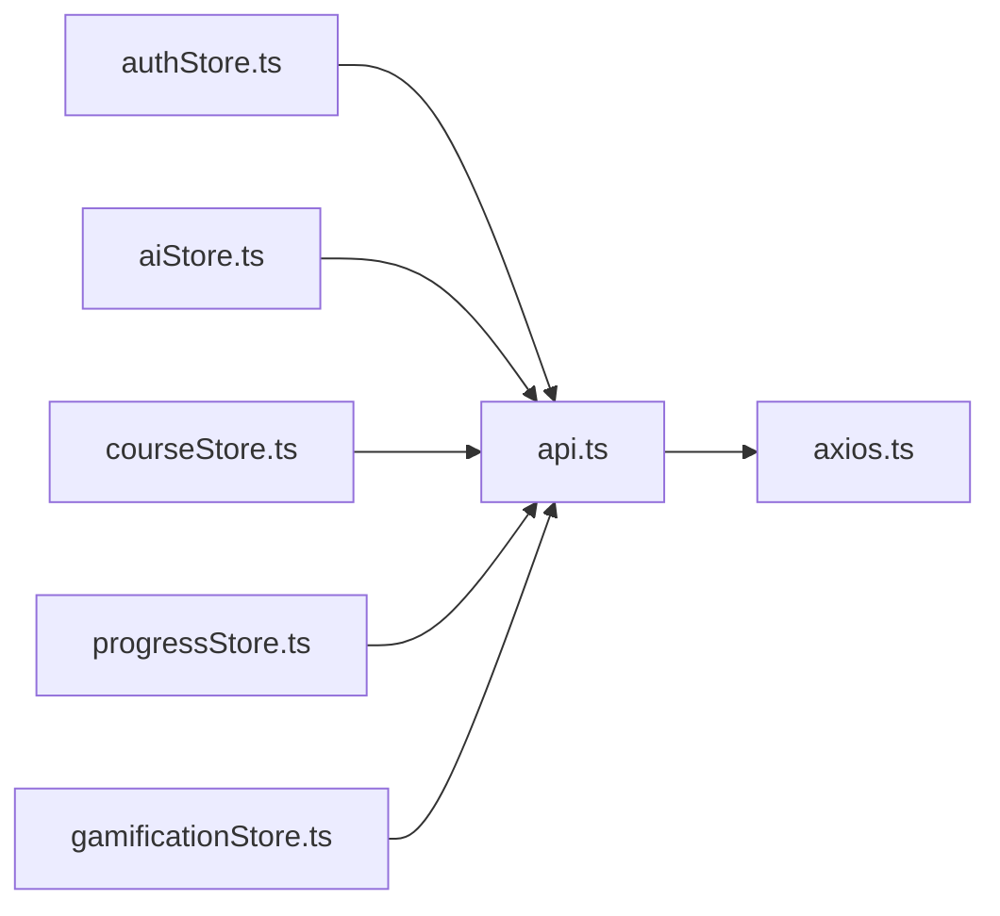

# State Management System

<cite>
**Referenced Files in This Document**
- [authStore.ts](file://frontend/app/store/authStore.ts)
- [aiStore.ts](file://frontend/app/store/aiStore.ts)
- [courseStore.ts](file://frontend/app/store/courseStore.ts)
- [progressStore.ts](file://frontend/app/store/progressStore.ts)
- [gamificationStore.ts](file://frontend/app/store/gamificationStore.ts)
- [api.ts](file://frontend/app/lib/api.ts)
- [axios.ts](file://frontend/app/lib/axios.ts)
- [page.tsx](file://frontend/app/(auth)/login/page.tsx)
</cite>

## Table of Contents
1. [Introduction](#introduction)
2. [Project Structure](#project-structure)
3. [Core Components](#core-components)
4. [Architecture Overview](#architecture-overview)
5. [Detailed Component Analysis](#detailed-component-analysis)
6. [Dependency Analysis](#dependency-analysis)
7. [Performance Considerations](#performance-considerations)
8. [Troubleshooting Guide](#troubleshooting-guide)
9. [Conclusion](#conclusion)
10. [Appendices](#appendices)

## Introduction
This document explains the State Management System built with Zustand in the frontend application. It covers the five primary stores: authStore for authentication, aiStore for AI assistant interactions, courseStore for course catalog and navigation, progressStore for learning progress tracking, and gamificationStore for XP and achievements. It documents store composition patterns, state selectors, action implementations, usage examples in components, persistence strategies, inter-store communication, best practices, performance optimization, and debugging techniques.

## Project Structure
The state management is implemented in the frontend under the app/store directory. Each store is a standalone Zustand store module exporting a named hook (useXStore) that encapsulates state, actions, and persistence where applicable. Stores communicate with backend APIs via a shared API abstraction layer, which delegates to an Axios client configured with request/response interceptors for authentication and token refresh.

**Diagram sources**
- [authStore.ts:1-98](file://frontend/app/store/authStore.ts#L1-L98)
- [aiStore.ts:1-129](file://frontend/app/store/aiStore.ts#L1-L129)
- [courseStore.ts:1-121](file://frontend/app/store/courseStore.ts#L1-L121)
- [progressStore.ts:1-87](file://frontend/app/store/progressStore.ts#L1-L87)
- [gamificationStore.ts:1-86](file://frontend/app/store/gamificationStore.ts#L1-L86)
- [api.ts:1-80](file://frontend/app/lib/api.ts#L1-L80)
- [axios.ts:1-61](file://frontend/app/lib/axios.ts#L1-L61)
- [page.tsx:1-140](file://frontend/app/(auth)/login/page.tsx#L1-L140)

**Section sources**
- [authStore.ts:1-98](file://frontend/app/store/authStore.ts#L1-L98)
- [aiStore.ts:1-129](file://frontend/app/store/aiStore.ts#L1-L129)
- [courseStore.ts:1-121](file://frontend/app/store/courseStore.ts#L1-L121)
- [progressStore.ts:1-87](file://frontend/app/store/progressStore.ts#L1-L87)
- [gamificationStore.ts:1-86](file://frontend/app/store/gamificationStore.ts#L1-L86)
- [api.ts:1-80](file://frontend/app/lib/api.ts#L1-L80)
- [axios.ts:1-61](file://frontend/app/lib/axios.ts#L1-L61)
- [page.tsx:1-140](file://frontend/app/(auth)/login/page.tsx#L1-L140)

## Core Components
- authStore: Manages user authentication state, login/logout, registration, and session restoration. Uses persistence to keep user and authentication status across sessions.
- aiStore: Handles AI chat messages, video summarization, quiz generation, concept explanations, and panel visibility. No persistence is applied.
- courseStore: Loads subjects, builds subject trees, fetches individual videos, and enrollment state. No persistence is applied.
- progressStore: Tracks per-video and per-subject progress using Maps for efficient lookups. No persistence is applied.
- gamificationStore: Fetches and updates XP, streaks, achievements, and level progression. No persistence is applied.

Key patterns:
- Each store defines a TypeScript interface for state and actions, then creates a Zustand store with create and optionally persist.
- Actions commonly set loading/error states, perform API calls via api.ts, and update state immutably.
- Selectors are used in components to subscribe to specific slices of state (e.g., isAuthenticated, messages).

**Section sources**
- [authStore.ts:12-24](file://frontend/app/store/authStore.ts#L12-L24)
- [aiStore.ts:18-33](file://frontend/app/store/aiStore.ts#L18-L33)
- [courseStore.ts:30-46](file://frontend/app/store/courseStore.ts#L30-L46)
- [progressStore.ts:19-34](file://frontend/app/store/progressStore.ts#L19-L34)
- [gamificationStore.ts:25-38](file://frontend/app/store/gamificationStore.ts#L25-L38)

## Architecture Overview
The stores are decoupled and communicate with the backend through a unified API layer. The Axios client adds Authorization headers automatically and handles token refresh on 401 responses. Components consume stores via the exported hooks and trigger actions to update state.

**Diagram sources**
- [page.tsx:10-34](file://frontend/app/(auth)/login/page.tsx#L10-L34)
- [authStore.ts:34-49](file://frontend/app/store/authStore.ts#L34-L49)
- [api.ts:4-16](file://frontend/app/lib/api.ts#L4-L16)
- [axios.ts:14-25](file://frontend/app/lib/axios.ts#L14-L25)

## Detailed Component Analysis

### Authentication Store (authStore)
Responsibilities:
- Manage user profile, authentication status, and loading/error states.
- Provide login, register, logout, and fetchUser actions.
- Persist minimal user data to localStorage for session continuity.

Composition pattern:
- Uses persist middleware with a partialize function to store only user and isAuthenticated.
- Integrates with authApi for network requests.
- Uses localStorage for storing accessToken.

Selectors and usage:
- Components select isAuthenticated, isLoading, error, and user.
- Example usage: LoginForm subscribes to login, isAuthenticated, and error.

Persistence strategy:
- Partial persistence of user and authentication status to reduce storage footprint.

Inter-store communication:
- None required for this store.

**Diagram sources**
- [authStore.ts:34-49](file://frontend/app/store/authStore.ts#L34-L49)

**Section sources**
- [authStore.ts:26-97](file://frontend/app/store/authStore.ts#L26-L97)
- [page.tsx:10-34](file://frontend/app/(auth)/login/page.tsx#L10-L34)

### AI Assistant Store (aiStore)
Responsibilities:
- Maintain chat history, loading states, and errors.
- Provide sendMessage, summarizeVideo, generateQuiz, explainConcept, and UI controls.

Composition pattern:
- Stateless actions that mutate messages array immutably.
- Uses aiApi for all AI-related endpoints.

Selectors and usage:
- Components subscribe to messages, isLoading, error, isOpen.

Persistence strategy:
- Not persisted; chat is session-bound.

Inter-store communication:
- Can be used alongside progressStore to attach context (e.g., videoId) to AI requests.

**Diagram sources**
- [aiStore.ts:41-77](file://frontend/app/store/aiStore.ts#L41-L77)
- [api.ts:67-79](file://frontend/app/lib/api.ts#L67-L79)

**Section sources**
- [aiStore.ts:35-128](file://frontend/app/store/aiStore.ts#L35-L128)

### Course Store (courseStore)
Responsibilities:
- Load subjects, fetch subject trees, load videos, and manage enrollment state.
- Track current subject, current video, and adjacent videos (next/previous).

Composition pattern:
- Uses subjectsApi and videosApi for data fetching.
- Maintains arrays and computed navigation pointers.

Selectors and usage:
- Components subscribe to subjects, currentSubject, currentVideo, nextVideo, prevVideo, isEnrolled.

Persistence strategy:
- Not persisted; course data is refetched as needed.

Inter-store communication:
- Integrates with progressStore to compute next/previous videos based on completion.

**Diagram sources**
- [courseStore.ts:71-86](file://frontend/app/store/courseStore.ts#L71-L86)
- [api.ts:19-29](file://frontend/app/lib/api.ts#L19-L29)

**Section sources**
- [courseStore.ts:48-120](file://frontend/app/store/courseStore.ts#L48-L120)

### Progress Store (progressStore)
Responsibilities:
- Track per-video progress and per-subject progress using Maps for O(1) lookups.
- Provide actions to fetch and update progress, and a selector to retrieve a specific video’s progress.

Composition pattern:
- Uses progressApi for progress endpoints.
- Immutable updates by cloning Maps before mutating.

Selectors and usage:
- Components subscribe to isLoading, error, and use getProgress(videoId) selector.

Persistence strategy:
- Not persisted; progress is fetched on demand.

Inter-store communication:
- Used by video players and course navigation to decide next/previous videos and completion status.

**Diagram sources**
- [progressStore.ts:55-66](file://frontend/app/store/progressStore.ts#L55-L66)
- [api.ts:39-52](file://frontend/app/lib/api.ts#L39-L52)

**Section sources**
- [progressStore.ts:36-86](file://frontend/app/store/progressStore.ts#L36-L86)

### Gamification Store (gamificationStore)
Responsibilities:
- Fetch and update XP, streaks, achievements, and level progression.
- Provide a method to record video completion.

Composition pattern:
- Uses gamificationApi for profile and completion endpoints.
- Updates derived metrics like xpToNextLevel and nextLevel.

Selectors and usage:
- Components subscribe to xp, streak, achievements, isLoading, error.

Persistence strategy:
- Not persisted; gamification data is refreshed as needed.

Inter-store communication:
- Called after progressStore marks a video as completed to award XP and achievements.

**Diagram sources**
- [progressStore.ts:81-83](file://frontend/app/store/progressStore.ts#L81-L83)
- [gamificationStore.ts:69-82](file://frontend/app/store/gamificationStore.ts#L69-L82)
- [api.ts:55-64](file://frontend/app/lib/api.ts#L55-L64)

**Section sources**
- [gamificationStore.ts:40-85](file://frontend/app/store/gamificationStore.ts#L40-L85)

## Dependency Analysis
Stores depend on the shared API layer, which depends on the Axios client. The Axios client injects Authorization headers and handles token refresh on 401 responses. Components depend on specific store hooks.

**Diagram sources**
- [api.ts:1-80](file://frontend/app/lib/api.ts#L1-L80)
- [axios.ts:1-61](file://frontend/app/lib/axios.ts#L1-L61)
- [authStore.ts:1-3](file://frontend/app/store/authStore.ts#L1-L3)
- [aiStore.ts:1-2](file://frontend/app/store/aiStore.ts#L1-L2)
- [courseStore.ts:1-2](file://frontend/app/store/courseStore.ts#L1-L2)
- [progressStore.ts:1-2](file://frontend/app/store/progressStore.ts#L1-L2)
- [gamificationStore.ts:1-2](file://frontend/app/store/gamificationStore.ts#L1-L2)

**Section sources**
- [api.ts:1-80](file://frontend/app/lib/api.ts#L1-L80)
- [axios.ts:1-61](file://frontend/app/lib/axios.ts#L1-L61)

## Performance Considerations
- Prefer narrow selectors in components to minimize re-renders. For example, select only the fields needed from a store rather than the entire state object.
- Use immutable updates (as seen in progressStore with Map cloning) to avoid unnecessary re-renders caused by object identity changes.
- Debounce or throttle frequent actions (e.g., progress updates) to reduce API churn.
- Keep persisted stores minimal (as in authStore) to reduce storage overhead and improve hydration performance.
- Avoid deep nesting in state objects; prefer flat structures or indexed Maps for fast lookups (as in progressStore).
- Batch related updates when possible to reduce intermediate renders.

## Troubleshooting Guide
Common issues and resolutions:
- Authentication failures: Check axios interceptors for Authorization header injection and token refresh logic. Verify that the login action saves the accessToken and that fetchUser clears stale tokens on failure.
- Network errors: Inspect store actions for proper error handling and ensure error state is cleared before retrying.
- UI not updating: Confirm components are subscribing to the correct selectors and that actions are updating state immutably.
- Token expiration: Rely on the Axios response interceptor to refresh tokens; ensure the interceptor retries the original request and updates headers.

Debugging tips:
- Temporarily log store state transitions in development to trace unexpected updates.
- Use React DevTools to inspect component subscriptions and re-render triggers.
- Verify API responses match expected shapes to prevent runtime errors in store actions.

**Section sources**
- [axios.ts:27-58](file://frontend/app/lib/axios.ts#L27-L58)
- [authStore.ts:34-88](file://frontend/app/store/authStore.ts#L34-L88)
- [page.tsx:18-34](file://frontend/app/(auth)/login/page.tsx#L18-L34)

## Conclusion
The Zustand-based state management system cleanly separates concerns across five focused stores. Persistence is selectively applied where appropriate (authentication), while others remain ephemeral and reactive. The shared API layer and Axios interceptors provide robust networking with automatic authentication and token refresh. Following the recommended patterns and best practices ensures maintainable, performant, and debuggable state management.

## Appendices

### Store Composition Patterns
- Action-driven updates: Each action sets loading/error states, performs API calls, and updates state immutably.
- Minimal persistence: Only authStore persists a small subset of state to localStorage.
- Selector-first consumption: Components subscribe to narrow slices of state to optimize rendering.

### API Layer Overview
- Centralized endpoints for auth, subjects, videos, progress, gamification, and AI.
- Axios client configured with base URL, credentials, and interceptors for token management.

**Section sources**
- [api.ts:1-80](file://frontend/app/lib/api.ts#L1-L80)
- [axios.ts:3-11](file://frontend/app/lib/axios.ts#L3-L11)