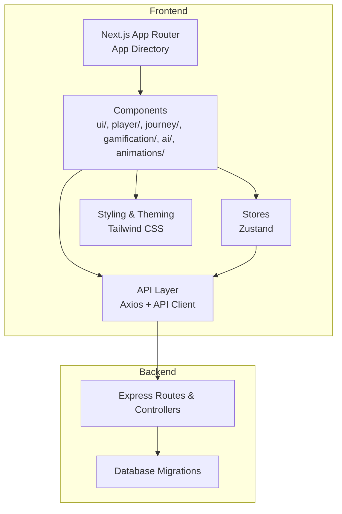
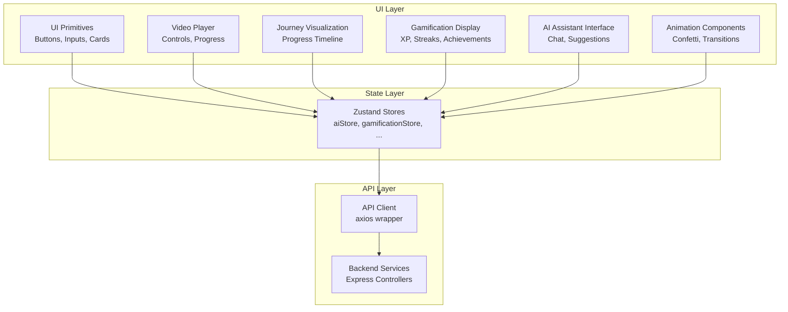
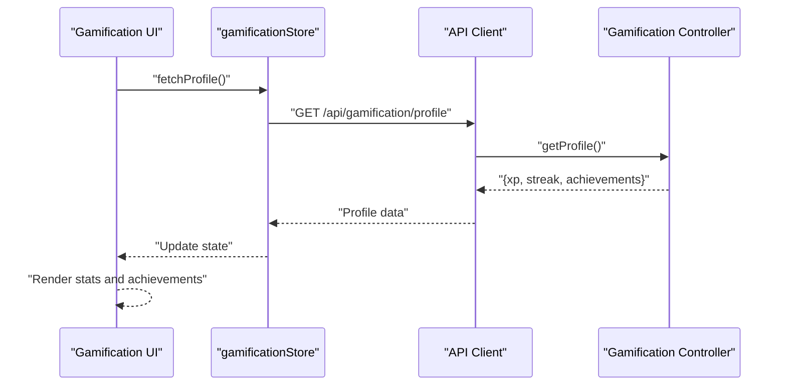
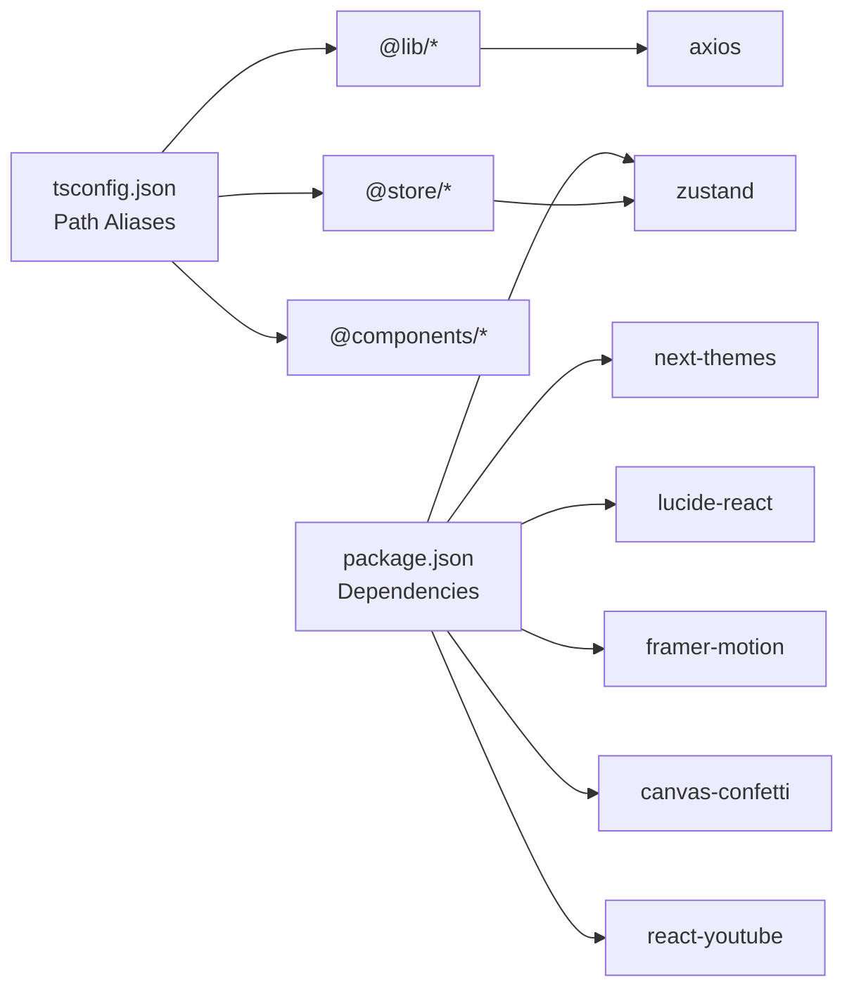

# UI Components Library

<cite>
**Referenced Files in This Document**
- [package.json](file://frontend/package.json)
- [tsconfig.json](file://frontend/tsconfig.json)
- [next.config.js](file://frontend/next.config.js)
- [tailwind.config.ts](file://frontend/tailwind.config.ts)
- [layout.tsx](file://frontend/app/layout.tsx)
- [globals.css](file://frontend/app/globals.css)
- [page.tsx](file://frontend/app/page.tsx)
- [aiStore.ts](file://frontend/app/store/aiStore.ts)
- [authStore.ts](file://frontend/app/store/authStore.ts)
- [courseStore.ts](file://frontend/app/store/courseStore.ts)
- [gamificationStore.ts](file://frontend/app/store/gamificationStore.ts)
- [progressStore.ts](file://frontend/app/store/progressStore.ts)
- [api.ts](file://frontend/app/lib/api.ts)
- [axios.ts](file://frontend/app/lib/axios.ts)
- [controller.ts](file://backend/src/modules/gamification/controller.ts)
</cite>

## Table of Contents
1. [Introduction](#introduction)
2. [Project Structure](#project-structure)
3. [Core Components](#core-components)
4. [Architecture Overview](#architecture-overview)
5. [Detailed Component Analysis](#detailed-component-analysis)
6. [Dependency Analysis](#dependency-analysis)
7. [Performance Considerations](#performance-considerations)
8. [Troubleshooting Guide](#troubleshooting-guide)
9. [Conclusion](#conclusion)
10. [Appendices](#appendices)

## Introduction
This document describes the UI Components Library for the Learning Management System. It focuses on reusable UI primitives, specialized components for video player, learning journey visualization, gamification displays, AI assistant interface, and animation components. The documentation explains component composition patterns, prop interfaces, styling approaches, accessibility features, responsive design, and integration patterns with the backend APIs.

## Project Structure
The frontend is a Next.js application configured with App Router, TypeScript, Tailwind CSS, and Zustand for state management. The UI components are organized under the app/components directory, grouped by domain (ai, animations, gamification, journey, player, ui). Shared styling and theming are centralized in globals.css and tailwind.config.ts. Stores under app/store manage cross-component state for AI, authentication, courses, gamification, and progress.

**Section sources**
- [package.json:12-23](file://frontend/package.json#L12-L23)
- [tsconfig.json:20-25](file://frontend/tsconfig.json#L20-L25)
- [next.config.js:3-16](file://frontend/next.config.js#L3-L16)
- [tailwind.config.ts:3-98](file://frontend/tailwind.config.ts#L3-L98)
- [layout.tsx:13-27](file://frontend/app/layout.tsx#L13-L27)
- [globals.css:1-70](file://frontend/app/globals.css#L1-L70)

## Core Components
Reusable UI primitives and specialized components are built with:
- Composition-first design using small, focused components
- Tailwind utility classes for styling and responsive breakpoints
- Framer Motion for micro-interactions and page transitions
- Lucide icons for consistent iconography
- next-themes for light/dark mode support

Key patterns:
- Props-driven rendering: components accept props for data and behavior
- Conditional rendering: visibility toggles, loading states, and error states
- Accessibility: focus management, semantic HTML, ARIA attributes where needed
- Responsive design: mobile-first with grid and flex utilities, viewport-aware animations

Integration points:
- Stores provide reactive state for AI, gamification, and progress
- API client abstracts backend communication
- Theme provider enables dynamic theming

**Section sources**
- [page.tsx:1-165](file://frontend/app/page.tsx#L1-L165)
- [globals.css:17-41](file://frontend/app/globals.css#L17-L41)
- [tailwind.config.ts:10-96](file://frontend/tailwind.config.ts#L10-L96)

## Architecture Overview
The UI layer communicates with backend services through an API client. Stores encapsulate domain-specific state and actions. Components consume stores and props to render views and orchestrate user interactions.

**Diagram sources**
- [aiStore.ts](file://frontend/app/store/aiStore.ts)
- [gamificationStore.ts](file://frontend/app/store/gamificationStore.ts)
- [api.ts](file://frontend/app/lib/api.ts)
- [controller.ts](file://backend/src/modules/gamification/controller.ts)

## Detailed Component Analysis

### UI Primitives
- Purpose: Base building blocks for forms, buttons, cards, and layout containers
- Composition pattern: Accept children, className, and optional variants (size, color, disabled)
- Styling approach: Tailwind utilities with theme tokens; responsive variants
- Accessibility: Proper focus styles, ARIA roles when extended
- Example usage patterns:
  - Button: variant toggles (primary, secondary, ghost), sizes (sm, md, lg), disabled state
  - Card: header/body/footer slots, shadow and rounded variants
  - Input: label, placeholder, error state, icon slot

Customization options:
- Color scales from theme tokens (primary, success, warning, error)
- Typography utilities for headings and body text
- Spacing utilities for padding/margin alignment

Integration patterns:
- Controlled/uncontrolled patterns for form inputs
- Event handlers passed via props (onChange, onClick)

**Section sources**
- [globals.css:34-41](file://frontend/app/globals.css#L34-L41)
- [tailwind.config.ts:12-62](file://frontend/tailwind.config.ts#L12-L62)

### Video Player Components
- Purpose: Media playback with controls, progress tracking, and responsive sizing
- Composition pattern: Player container, control bar, progress scrubber, play/pause/timer
- Styling approach: Aspect-ratio utilities, overlay controls, responsive breakpoints
- Accessibility: Keyboard navigation, ARIA live regions for status, focus traps
- Example usage patterns:
  - Initialize with YouTube embed (react-youtube) or HTML5 video
  - Track currentTime and duration for progress visualization
  - Toggle playback state and handle end-of-video events

Customization options:
- Control visibility toggles (volume, captions, fullscreen)
- Progress bar customization (colors, height)
- Control button icons and tooltips

Integration patterns:
- Connect to progress store for resume-on-load
- Emit completion events to gamification store

**Section sources**
- [package.json:21](file://frontend/package.json#L21)

### Learning Journey Visualization
- Purpose: Visualize user progress across courses and sections
- Composition pattern: Timeline nodes, milestones, progress indicators, tooltips
- Styling approach: Grid layouts, connecting lines, badges, and status dots
- Accessibility: Descriptive labels for each milestone, skip links
- Example usage patterns:
  - Render completed, current, and upcoming steps
  - Highlight streaks and achievements along the path
  - Provide tooltips with timestamps and details

Customization options:
- Timeline orientation (horizontal/vertical)
- Node shapes and colors per status
- Tooltip content and positioning

Integration patterns:
- Consume course and progress stores
- Link to course pages and lesson content

**Section sources**
- [courseStore.ts](file://frontend/app/store/courseStore.ts)
- [progressStore.ts](file://frontend/app/store/progressStore.ts)

### Gamification Displays
- Purpose: Display XP, streaks, and achievements with animated feedback
- Composition pattern: Stats cards, progress bars, achievement grids, confetti effects
- Styling approach: Soft shadows, glass morphism utilities, pulse/bounce animations
- Accessibility: Announcements for unlocked achievements, contrast-compliant colors
- Example usage patterns:
  - Show current XP and XP to next level
  - Display current and longest streaks
  - Render unlocked achievements with icons and descriptions

Customization options:
- Animation triggers (on load, on completion)
- Color themes aligned with XP/level progression
- Achievement grid layouts (responsive grid)

Integration patterns:
- Connect to gamification store for real-time updates
- Trigger confetti on level-ups or milestone completions

**Diagram sources**
- [gamificationStore.ts:49-67](file://frontend/app/store/gamificationStore.ts#L49-L67)
- [controller.ts:11-19](file://backend/src/modules/gamification/controller.ts#L11-L19)

**Section sources**
- [gamificationStore.ts:1-85](file://frontend/app/store/gamificationStore.ts#L1-L85)
- [controller.ts:11-29](file://backend/src/modules/gamification/controller.ts#L11-L29)
- [globals.css:34-41](file://frontend/app/globals.css#L34-L41)
- [tailwind.config.ts:66-90](file://frontend/tailwind.config.ts#L66-L90)

### AI Assistant Interface
- Purpose: Provide conversational UI for AI tutoring and suggestions
- Composition pattern: Message list, input area, send button, typing indicators
- Styling approach: Chat bubbles, soft shadows, animated typing dots
- Accessibility: Live regions for new messages, keyboard shortcuts, focus management
- Example usage patterns:
  - Append user and assistant messages
  - Show loading states during model inference
  - Suggest follow-up questions or related topics

Customization options:
- Bubble colors per speaker
- Typing animation variants
- Suggestion chips for quick replies

Integration patterns:
- Connect to AI store for message history and suggestions
- Call AI API endpoint via API client

**Section sources**
- [aiStore.ts](file://frontend/app/store/aiStore.ts)
- [api.ts](file://frontend/app/lib/api.ts)

### Animation Components
- Purpose: Add delightful micro-interactions and celebratory effects
- Composition pattern: Trigger props, animation variants, timing controls
- Styling approach: Framer Motion wrappers, Tailwind animation utilities
- Accessibility: Prefer reduced motion settings, avoid seizure triggers
- Example usage patterns:
  - Fade-in on mount for hero sections
  - Slide-up for alerts and modals
  - Confetti burst on achievements or completions

Customization options:
- Animation duration and easing
- Direction and axis for slide animations
- Particle count and colors for confetti

Integration patterns:
- Trigger animations from UI events or store updates
- Coordinate with gamification and AI components

**Section sources**
- [page.tsx:16-70](file://frontend/app/page.tsx#L16-L70)
- [tailwind.config.ts:66-90](file://frontend/tailwind.config.ts#L66-L90)
- [package.json:14-15](file://frontend/package.json#L14-L15)

## Dependency Analysis
External libraries and their roles:
- next-themes: Theme switching and persistence
- lucide-react: Iconography across components
- framer-motion: Page transitions and micro-interactions
- canvas-confetti: Animated celebrations
- react-youtube: YouTube embeds in player components
- zustand: Lightweight state management

Internal dependencies:
- Path aliases (@components, @store, @lib) simplify imports
- API client wraps axios for consistent request/response handling
- Stores encapsulate domain logic and side effects

**Diagram sources**
- [package.json:12-23](file://frontend/package.json#L12-L23)
- [tsconfig.json:20-25](file://frontend/tsconfig.json#L20-L25)
- [axios.ts](file://frontend/app/lib/axios.ts)
- [api.ts](file://frontend/app/lib/api.ts)

**Section sources**
- [package.json:12-23](file://frontend/package.json#L12-L23)
- [tsconfig.json:20-25](file://frontend/tsconfig.json#L20-L25)

## Performance Considerations
- Bundle size: Keep component bundles small; lazy-load heavy animations and third-party players
- Rendering: Use memoization for expensive computations; virtualize long lists (e.g., achievements)
- Animations: Prefer hardware-accelerated properties (transform/opacity); disable for reduced motion
- Images and videos: Lazy-load thumbnails; use aspect-ratio utilities to prevent layout shift
- API calls: Debounce user input; cache responses where appropriate; batch updates for progress

## Troubleshooting Guide
Common issues and resolutions:
- Theme not applying: Verify next-themes provider is wrapping the app root layout
- Missing icons: Ensure lucide-react is installed and icons are imported correctly
- Animation not playing: Confirm Framer Motion is initialized and animations are not disabled for reduced motion
- API errors: Check API client configuration and network tab; validate backend routes and authentication headers
- Store state not updating: Verify store actions are dispatched and awaited; check for error handling in store thunks

Accessibility checks:
- Keyboard navigation: Ensure all interactive elements are reachable via Tab
- Focus styles: Confirm outline styles are visible and meaningful
- Screen reader: Use aria-live regions for dynamic content updates

**Section sources**
- [layout.tsx:19-23](file://frontend/app/layout.tsx#L19-L23)
- [globals.css:67-69](file://frontend/app/globals.css#L67-L69)

## Conclusion
The UI Components Library emphasizes composability, consistency, and responsiveness. By leveraging Tailwind utilities, Framer Motion, and Zustand, components remain flexible and maintainable. Integration with backend services is streamlined through a dedicated API client and typed stores. Following the documented patterns ensures predictable behavior, strong accessibility, and scalable development.

## Appendices
- Theming tokens: Primary, success, warning, error palettes with light/dark variants
- Animation tokens: Fade-in, slide-up, slide-in-right, bounce-soft, pulse-slow
- Utility classes: Glass, glass-strong, text-balance, custom scrollbar styles

**Section sources**
- [tailwind.config.ts:12-96](file://frontend/tailwind.config.ts#L12-L96)
- [globals.css:34-41](file://frontend/app/globals.css#L34-L41)