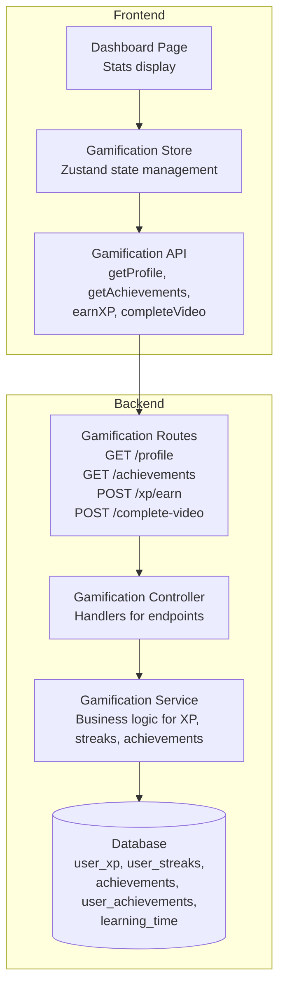
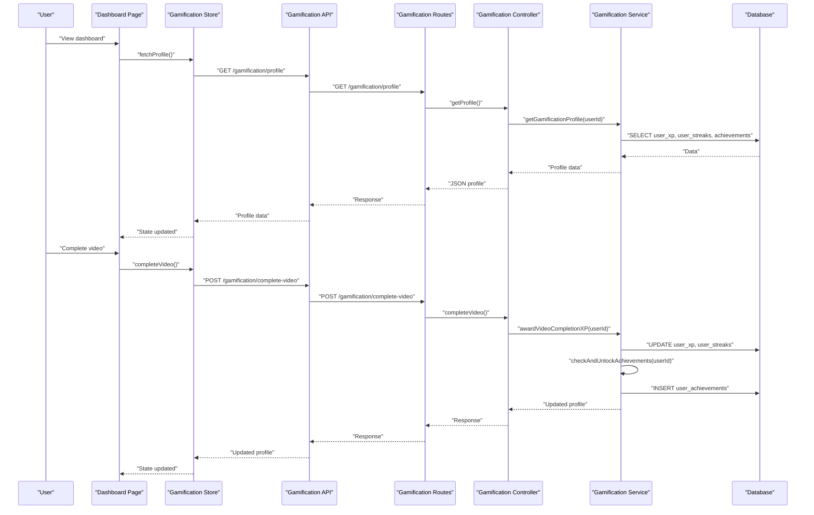
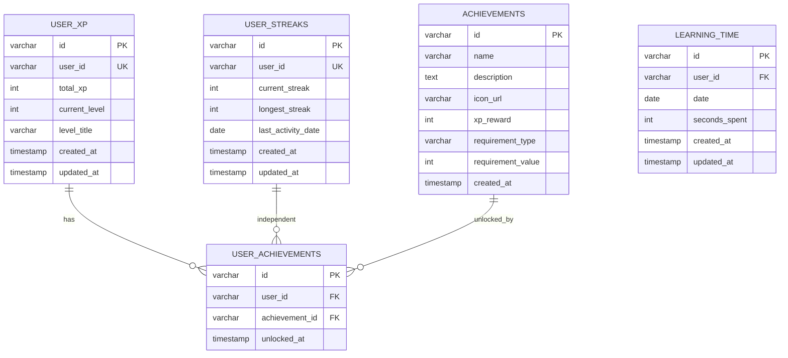
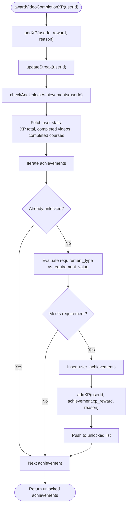
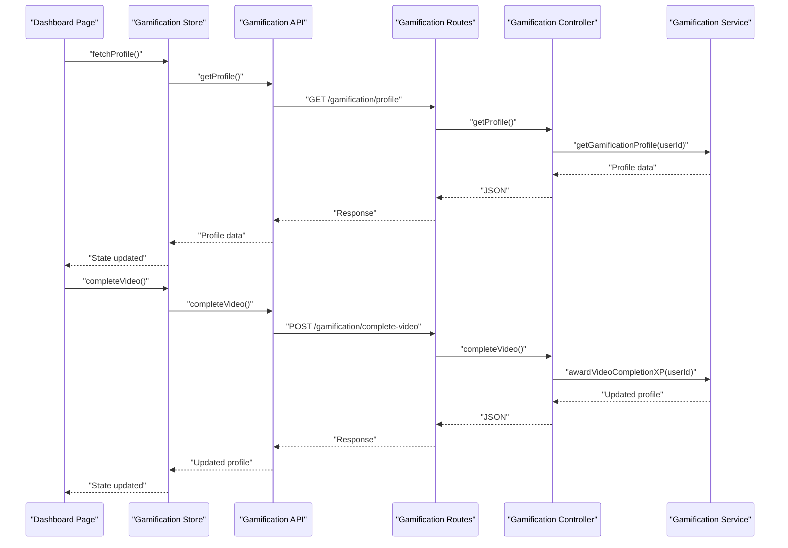
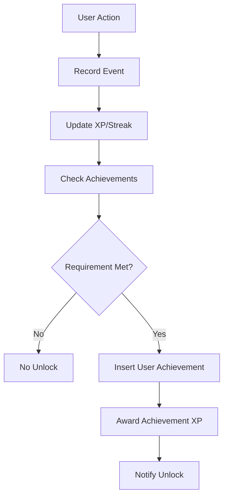
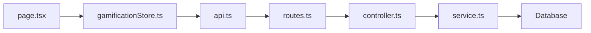

# Achievement System

<cite>
**Referenced Files in This Document**
- [008_create_gamification.sql](file://backend/migrations/008_create_gamification.sql)
- [controller.ts](file://backend/src/modules/gamification/controller.ts)
- [routes.ts](file://backend/src/modules/gamification/routes.ts)
- [service.ts](file://backend/src/modules/gamification/service.ts)
- [api.ts](file://frontend/app/lib/api.ts)
- [gamificationStore.ts](file://frontend/app/store/gamificationStore.ts)
- [page.tsx](file://frontend/app/(app)/dashboard/page.tsx)
</cite>

## Table of Contents
1. [Introduction](#introduction)
2. [Project Structure](#project-structure)
3. [Core Components](#core-components)
4. [Architecture Overview](#architecture-overview)
5. [Detailed Component Analysis](#detailed-component-analysis)
6. [Achievement Definition and Categories](#achievement-definition-and-categories)
7. [Unlock Conditions and Triggers](#unlock-conditions-and-triggers)
8. [Tracking and Persistence](#tracking-and-persistence)
9. [Achievement Service Logic](#achievement-service-logic)
10. [Integration with User Progress](#integration-with-user-progress)
11. [Frontend Display Components](#frontend-display-components)
12. [Dependency Analysis](#dependency-analysis)
13. [Performance Considerations](#performance-considerations)
14. [Troubleshooting Guide](#troubleshooting-guide)
15. [Conclusion](#conclusion)

## Introduction
This document provides comprehensive documentation for the Achievement System within the Learning Management Platform. The system gamifies the learning experience by awarding experience points (XP), tracking learning streaks, and unlocking achievements based on user progress and activities. It consists of backend services that manage gamification data, persistence mechanisms, and frontend components that display user profiles, streaks, XP levels, and achievements.

## Project Structure
The Achievement System spans both backend and frontend layers:

- Backend gamification module: Provides REST endpoints, business logic, and database interactions for XP, streaks, and achievements.
- Database schema: Defines tables for user XP, streaks, achievements, user achievements, and learning time tracking.
- Frontend integration: Uses a Zustand store to fetch and manage gamification data, integrates with API endpoints, and renders dashboard statistics.

**Diagram sources**
- [routes.ts:1-18](file://backend/src/modules/gamification/routes.ts#L1-L18)
- [controller.ts:1-62](file://backend/src/modules/gamification/controller.ts#L1-L62)
- [service.ts:1-246](file://backend/src/modules/gamification/service.ts#L1-L246)
- [api.ts:54-64](file://frontend/app/lib/api.ts#L54-L64)
- [gamificationStore.ts:1-86](file://frontend/app/store/gamificationStore.ts#L1-L86)
- [page.tsx](file://frontend/app/(app)/dashboard/page.tsx#L1-L171)

**Section sources**
- [routes.ts:1-18](file://backend/src/modules/gamification/routes.ts#L1-L18)
- [controller.ts:1-62](file://backend/src/modules/gamification/controller.ts#L1-L62)
- [service.ts:1-246](file://backend/src/modules/gamification/service.ts#L1-L246)
- [api.ts:54-64](file://frontend/app/lib/api.ts#L54-L64)
- [gamificationStore.ts:1-86](file://frontend/app/store/gamificationStore.ts#L1-L86)
- [page.tsx](file://frontend/app/(app)/dashboard/page.tsx#L1-L171)

## Core Components
- Database Schema: Defines tables for user XP, streaks, achievements, user achievements, and learning time tracking.
- Backend Service: Implements XP calculations, streak updates, achievement checks, and profile aggregation.
- API Endpoints: Exposes endpoints for fetching profile data, retrieving achievements, awarding XP manually, and recording video completions.
- Frontend Store: Manages gamification state, fetches profile data, and records video completions.
- Dashboard Display: Renders XP level, total XP, current streak, and learning time metrics.

**Section sources**
- [008_create_gamification.sql:1-64](file://backend/migrations/008_create_gamification.sql#L1-L64)
- [service.ts:1-246](file://backend/src/modules/gamification/service.ts#L1-L246)
- [routes.ts:1-18](file://backend/src/modules/gamification/routes.ts#L1-L18)
- [api.ts:54-64](file://frontend/app/lib/api.ts#L54-L64)
- [gamificationStore.ts:1-86](file://frontend/app/store/gamificationStore.ts#L1-L86)
- [page.tsx](file://frontend/app/(app)/dashboard/page.tsx#L1-L171)

## Architecture Overview
The system follows a layered architecture:
- Presentation Layer: Dashboard page and gamification store handle user interactions and state.
- API Layer: Express routes expose gamification endpoints.
- Business Logic Layer: Controller delegates to service functions for gamification operations.
- Data Access Layer: Service queries and updates the database.

**Diagram sources**
- [routes.ts:1-18](file://backend/src/modules/gamification/routes.ts#L1-L18)
- [controller.ts:1-62](file://backend/src/modules/gamification/controller.ts#L1-L62)
- [service.ts:1-246](file://backend/src/modules/gamification/service.ts#L1-L246)
- [api.ts:54-64](file://frontend/app/lib/api.ts#L54-L64)
- [gamificationStore.ts:1-86](file://frontend/app/store/gamificationStore.ts#L1-L86)
- [page.tsx](file://frontend/app/(app)/dashboard/page.tsx#L1-L171)

## Detailed Component Analysis

### Database Schema
The gamification schema defines five core tables:
- user_xp: Tracks total XP, current level, and level title per user.
- user_streaks: Maintains current and longest streaks along with last activity date.
- achievements: Defines achievement metadata including name, description, icon URL, XP reward, requirement type, and requirement value.
- user_achievements: Links users to unlocked achievements with timestamps.
- learning_time: Records daily learning time per user.

**Diagram sources**
- [008_create_gamification.sql:1-64](file://backend/migrations/008_create_gamification.sql#L1-L64)

**Section sources**
- [008_create_gamification.sql:1-64](file://backend/migrations/008_create_gamification.sql#L1-L64)

### Backend Service Implementation
The service layer encapsulates gamification logic:
- XP Management: Calculates levels based on XP thresholds and updates user XP accordingly.
- Streak Management: Updates current and longest streaks considering consecutive days and resets on gaps.
- Achievement Management: Checks eligibility against XP totals, completed videos, and completed courses; unlocks achievements and awards XP.
- Profile Aggregation: Returns consolidated profile data including XP, streaks, achievements, XP to next level, and next level details.

**Diagram sources**
- [service.ts:194-216](file://backend/src/modules/gamification/service.ts#L194-L216)

**Section sources**
- [service.ts:1-246](file://backend/src/modules/gamification/service.ts#L1-L246)

### API Endpoints and Controllers
The gamification module exposes four primary endpoints:
- GET /gamification/profile: Returns user gamification profile including XP, streaks, achievements, XP to next level, and next level.
- GET /gamification/achievements: Returns all achievements with user-specific unlock status.
- POST /gamification/xp/earn: Manually awards XP to a user with validation.
- POST /gamification/complete-video: Records video completion, awards XP, updates streak, and checks for new achievements.

Controllers enforce authentication and delegate to service functions, returning structured JSON responses.

**Section sources**
- [routes.ts:1-18](file://backend/src/modules/gamification/routes.ts#L1-L18)
- [controller.ts:1-62](file://backend/src/modules/gamification/controller.ts#L1-L62)

### Frontend Integration
The frontend integrates gamification data through:
- API Module: Defines typed functions for gamification endpoints.
- Zustand Store: Manages state for XP, streaks, achievements, XP to next level, next level, loading, and errors. Provides actions to fetch profile and record video completion.
- Dashboard Page: Displays XP level, total XP, current streak, and learning time metrics using icons and animations.

**Diagram sources**
- [api.ts:54-64](file://frontend/app/lib/api.ts#L54-L64)
- [gamificationStore.ts:1-86](file://frontend/app/store/gamificationStore.ts#L1-L86)
- [page.tsx](file://frontend/app/(app)/dashboard/page.tsx#L1-L171)
- [routes.ts:1-18](file://backend/src/modules/gamification/routes.ts#L1-L18)
- [controller.ts:1-62](file://backend/src/modules/gamification/controller.ts#L1-L62)
- [service.ts:1-246](file://backend/src/modules/gamification/service.ts#L1-L246)

**Section sources**
- [api.ts:54-64](file://frontend/app/lib/api.ts#L54-L64)
- [gamificationStore.ts:1-86](file://frontend/app/store/gamificationStore.ts#L1-L86)
- [page.tsx](file://frontend/app/(app)/dashboard/page.tsx#L1-L171)

## Achievement Definition and Categories
Achievements are defined in the database with the following attributes:
- Identifier: Unique achievement ID
- Name: Display name
- Description: Achievement description
- Icon URL: Optional icon for visual representation
- XP Reward: XP awarded upon unlock
- Requirement Type: Type of requirement (e.g., XP total, videos completed, courses completed)
- Requirement Value: Threshold value for the requirement

Categories and Types:
- XP-Based: Unlocks based on accumulated total XP
- Activity-Based: Unlocks based on number of completed videos
- Course-Based: Unlocks based on number of completed courses

Rarity and Visual Representation:
- Rarity is not explicitly modeled in the schema; however, XP reward can serve as a proxy for perceived rarity.
- Visual representation relies on icon URLs stored in the achievements table.

**Section sources**
- [008_create_gamification.sql:27-37](file://backend/migrations/008_create_gamification.sql#L27-L37)
- [service.ts:15-24](file://backend/src/modules/gamification/service.ts#L15-L24)

## Unlock Conditions and Triggers
Unlock Conditions:
- XP Total: Achievement unlocks when user's total XP meets or exceeds the requirement value.
- Videos Completed: Achievement unlocks when the number of completed videos meets or exceeds the requirement value.
- Courses Completed: Achievement unlocks when the number of distinct subjects with all videos completed meets or exceeds the requirement value.

Triggers:
- Video Completion: Recording a video completion triggers XP award, streak update, and achievement checks.
- Manual XP Award: Manual XP awards trigger profile updates but do not inherently re-check achievements unless followed by a subsequent action that triggers achievement evaluation.

Unlock Flow:

**Diagram sources**
- [service.ts:161-216](file://backend/src/modules/gamification/service.ts#L161-L216)

**Section sources**
- [service.ts:161-216](file://backend/src/modules/gamification/service.ts#L161-L216)

## Tracking and Persistence
Tracking Mechanisms:
- XP Tracking: Stored in user_xp table with automatic level calculation based on XP thresholds.
- Streak Tracking: Maintained in user_streaks with daily updates and longest streak tracking.
- Achievement Tracking: User achievements are persisted in user_achievements with timestamps.

Persistence Details:
- User XP: Updated atomically with new XP and recalculated level.
- Streaks: Updated based on last activity date; resets on gaps; weekly milestone bonus for streaks divisible by seven.
- Achievements: Inserted into user_achievements only if not previously unlocked; XP awarded upon unlock.

**Section sources**
- [008_create_gamification.sql:1-64](file://backend/migrations/008_create_gamification.sql#L1-L64)
- [service.ts:47-87](file://backend/src/modules/gamification/service.ts#L47-L87)
- [service.ts:103-148](file://backend/src/modules/gamification/service.ts#L103-L148)
- [service.ts:150-216](file://backend/src/modules/gamification/service.ts#L150-L216)

## Achievement Service Logic
Key Functions:
- getUserXP(userId): Retrieves user XP or initializes default XP for new users.
- addXP(userId, amount, reason): Adds XP, recalculates level, and persists changes.
- getUserStreak(userId): Retrieves user streak or initializes default streak for new users.
- updateStreak(userId): Updates current and longest streaks, handles consecutive days, resets on gaps, and awards XP for weekly milestones.
- getAchievements(userId): Fetches all achievements with user-specific unlock status.
- checkAndUnlockAchievements(userId): Evaluates requirements and unlocks eligible achievements.
- getGamificationProfile(userId): Aggregates XP, streaks, achievements, and calculates XP to next level and next level details.
- awardVideoCompletionXP(userId): Orchestrates video completion processing.

Notification and Progress Monitoring:
- Unlock Notifications: Achievements are inserted into user_achievements upon unlock; clients receive updated profile data reflecting new unlocks.
- Progress Monitoring: Achievement checks occur after XP/streak updates, ensuring real-time progression visibility.

**Section sources**
- [service.ts:1-246](file://backend/src/modules/gamification/service.ts#L1-L246)

## Integration with User Progress
Progress Integration Points:
- Video Completion: Completing a video awards XP, updates streak, and triggers achievement checks.
- Course Completion: Courses are considered complete when all videos in a subject are finished; this affects course-based achievements.
- Subject Progress: Course completion logic considers distinct subjects and requires all videos within a subject to be completed.

Frontend Integration:
- Dashboard displays XP level, total XP, current streak, and learning time metrics.
- Store fetches profile data and updates state after video completion events.

**Section sources**
- [service.ts:161-216](file://backend/src/modules/gamification/service.ts#L161-L216)
- [page.tsx](file://frontend/app/(app)/dashboard/page.tsx#L1-L171)
- [gamificationStore.ts:1-86](file://frontend/app/store/gamificationStore.ts#L1-L86)

## Frontend Display Components
Dashboard Components:
- Stats Grid: Displays level, total XP, current streak, and learning time using icons and formatted values.
- Animations: Uses Framer Motion for smooth entrance animations.
- Responsive Layout: Adapts grid layout for different screen sizes.

State Management:
- Store manages loading states, errors, and profile data.
- Actions fetch profile data and record video completions, updating state accordingly.

**Section sources**
- [page.tsx](file://frontend/app/(app)/dashboard/page.tsx#L1-L171)
- [gamificationStore.ts:1-86](file://frontend/app/store/gamificationStore.ts#L1-L86)

## Dependency Analysis
Internal Dependencies:
- Routes depend on Controller functions.
- Controller functions depend on Service functions.
- Service functions depend on database queries and constants.

External Dependencies:
- Frontend depends on API module for network requests.
- Store depends on API module and React components for rendering.

Potential Circular Dependencies:
- None observed between routes, controller, and service.

**Diagram sources**
- [routes.ts:1-18](file://backend/src/modules/gamification/routes.ts#L1-L18)
- [controller.ts:1-62](file://backend/src/modules/gamification/controller.ts#L1-L62)
- [service.ts:1-246](file://backend/src/modules/gamification/service.ts#L1-L246)
- [api.ts:54-64](file://frontend/app/lib/api.ts#L54-L64)
- [gamificationStore.ts:1-86](file://frontend/app/store/gamificationStore.ts#L1-L86)
- [page.tsx](file://frontend/app/(app)/dashboard/page.tsx#L1-L171)

**Section sources**
- [routes.ts:1-18](file://backend/src/modules/gamification/routes.ts#L1-L18)
- [controller.ts:1-62](file://backend/src/modules/gamification/controller.ts#L1-L62)
- [service.ts:1-246](file://backend/src/modules/gamification/service.ts#L1-L246)
- [api.ts:54-64](file://frontend/app/lib/api.ts#L54-L64)
- [gamificationStore.ts:1-86](file://frontend/app/store/gamificationStore.ts#L1-L86)
- [page.tsx](file://frontend/app/(app)/dashboard/page.tsx#L1-L171)

## Performance Considerations
- Database Queries: Achievement checks iterate through all achievements per user; consider indexing and limiting checks to relevant subsets if performance becomes a concern.
- Parallel Operations: Profile aggregation uses Promise.all for concurrent reads of XP, streaks, and achievements.
- Streak Updates: Streak calculations involve date arithmetic; ensure efficient date comparisons and avoid redundant updates.
- Frontend Rendering: Dashboard components should leverage memoization and virtualization for large lists if achievement counts grow significantly.

## Troubleshooting Guide
Common Issues:
- Authentication Required: All gamification endpoints require authentication; ensure user context is present.
- Invalid XP Amount: Manual XP award endpoint validates positive amounts; ensure payload contains valid data.
- Achievement Not Unlocking: Verify requirement_type and requirement_value match expected values and that user statistics meet thresholds.
- Streak Reset: Streak resets when activity gaps exceed one day; ensure daily activity to maintain streaks.

Debugging Steps:
- Check API responses for error messages returned by endpoints.
- Inspect store state for loading and error flags.
- Verify database entries in user_xp, user_streaks, achievements, and user_achievements tables.

**Section sources**
- [controller.ts:11-61](file://backend/src/modules/gamification/controller.ts#L11-L61)
- [service.ts:161-216](file://backend/src/modules/gamification/service.ts#L161-L216)
- [gamificationStore.ts:49-85](file://frontend/app/store/gamificationStore.ts#L49-L85)

## Conclusion
The Achievement System provides a robust foundation for gamifying the learning experience through XP, streaks, and achievements. The backend service encapsulates business logic for XP calculations, streak management, and achievement evaluation, while the frontend integrates seamlessly through a Zustand store and dashboard components. The system is extensible, allowing for new achievement types, categories, and visual representations as the platform evolves.