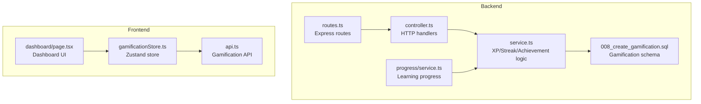
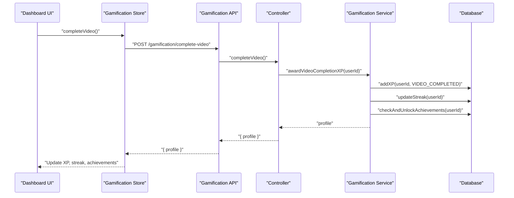
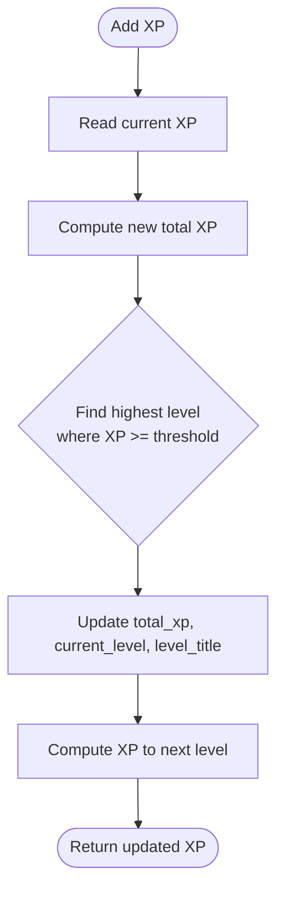
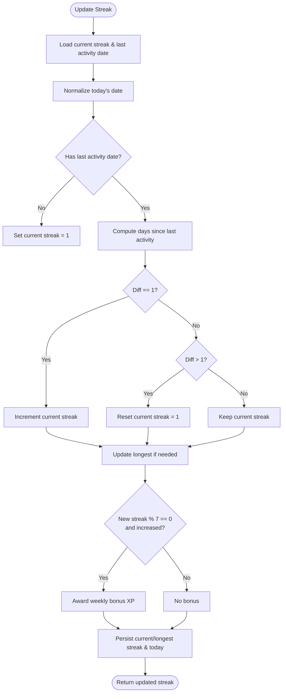
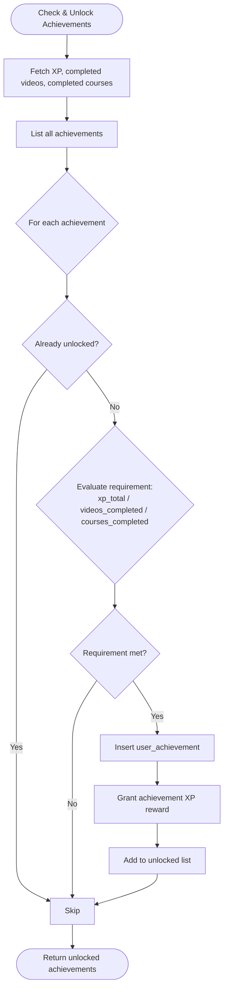
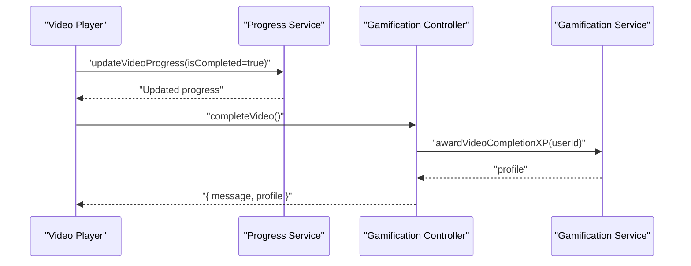
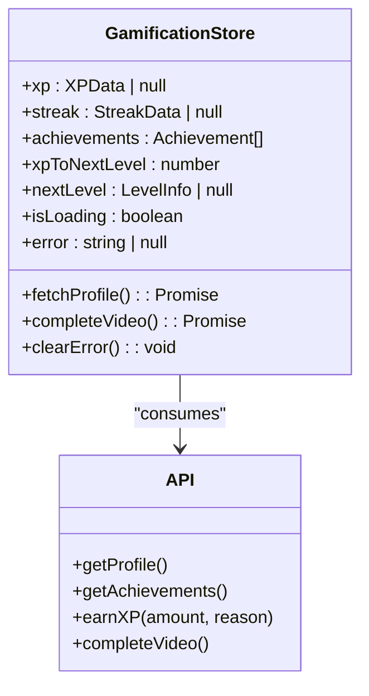
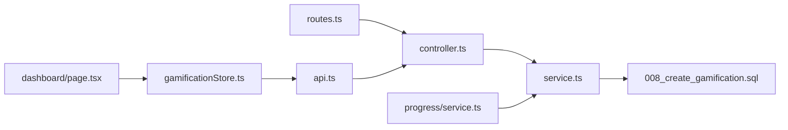
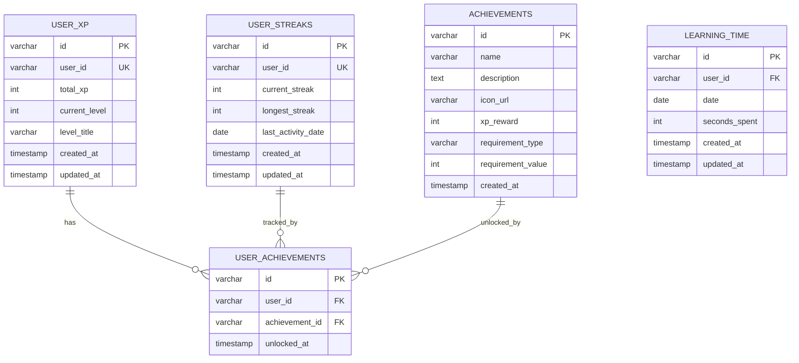

# Gamification System

<cite>
**Referenced Files in This Document**
- [controller.ts](file://backend/src/modules/gamification/controller.ts)
- [service.ts](file://backend/src/modules/gamification/service.ts)
- [routes.ts](file://backend/src/modules/gamification/routes.ts)
- [008_create_gamification.sql](file://backend/migrations/008_create_gamification.sql)
- [api.ts](file://frontend/app/lib/api.ts)
- [gamificationStore.ts](file://frontend/app/store/gamificationStore.ts)
- [dashboard/page.tsx](file://frontend/app/(app)/dashboard/page.tsx)
- [progress/service.ts](file://backend/src/modules/progress/service.ts)
</cite>

## Table of Contents
1. [Introduction](#introduction)
2. [Project Structure](#project-structure)
3. [Core Components](#core-components)
4. [Architecture Overview](#architecture-overview)
5. [Detailed Component Analysis](#detailed-component-analysis)
6. [Dependency Analysis](#dependency-analysis)
7. [Performance Considerations](#performance-considerations)
8. [Troubleshooting Guide](#troubleshooting-guide)
9. [Conclusion](#conclusion)
10. [Appendices](#appendices)

## Introduction
This document describes the Gamification System that powers XP accumulation, level progression, streak tracking, achievements, and integration with learning activities. It explains the backend gamification service logic, XP calculation algorithms, achievement unlock mechanisms, streak tracking implementation, and the frontend integration for real-time progress updates. It also documents the gamification database schema and provides examples of XP calculations and achievement triggers.

## Project Structure
The gamification system spans backend controllers, services, and database migrations, and integrates with the frontend via a dedicated API and Zustand store. Learning progress is tracked separately and feeds into gamification events.

**Diagram sources**
- [controller.ts:1-62](file://backend/src/modules/gamification/controller.ts#L1-L62)
- [service.ts:1-246](file://backend/src/modules/gamification/service.ts#L1-L246)
- [routes.ts:1-18](file://backend/src/modules/gamification/routes.ts#L1-L18)
- [008_create_gamification.sql:1-64](file://backend/migrations/008_create_gamification.sql#L1-L64)
- [progress/service.ts:1-163](file://backend/src/modules/progress/service.ts#L1-L163)
- [api.ts:54-64](file://frontend/app/lib/api.ts#L54-L64)
- [gamificationStore.ts:40-85](file://frontend/app/store/gamificationStore.ts#L40-L85)
- [dashboard/page.tsx:11-171](file://frontend/app/(app)/dashboard/page.tsx#L11-L171)

**Section sources**
- [controller.ts:1-62](file://backend/src/modules/gamification/controller.ts#L1-L62)
- [service.ts:1-246](file://backend/src/modules/gamification/service.ts#L1-L246)
- [routes.ts:1-18](file://backend/src/modules/gamification/routes.ts#L1-L18)
- [008_create_gamification.sql:1-64](file://backend/migrations/008_create_gamification.sql#L1-L64)
- [api.ts:54-64](file://frontend/app/lib/api.ts#L54-L64)
- [gamificationStore.ts:40-85](file://frontend/app/store/gamificationStore.ts#L40-L85)
- [dashboard/page.tsx:11-171](file://frontend/app/(app)/dashboard/page.tsx#L11-L171)
- [progress/service.ts:1-163](file://backend/src/modules/progress/service.ts#L1-L163)

## Core Components
- Backend gamification controller exposes endpoints for retrieving profiles, achievements, awarding XP manually, and recording video completions.
- Backend gamification service encapsulates XP calculation, level thresholds, streak computation, achievement checks, and XP awarding.
- Frontend gamification API mirrors backend endpoints and is consumed by a Zustand store.
- The store manages XP, streak, achievements, and next-level metrics, updating the UI reactively.
- Learning progress service tracks watched videos and completion states, which trigger gamification events.

**Section sources**
- [controller.ts:11-61](file://backend/src/modules/gamification/controller.ts#L11-L61)
- [service.ts:47-87](file://backend/src/modules/gamification/service.ts#L47-L87)
- [service.ts:103-148](file://backend/src/modules/gamification/service.ts#L103-L148)
- [service.ts:161-216](file://backend/src/modules/gamification/service.ts#L161-L216)
- [service.ts:218-243](file://backend/src/modules/gamification/service.ts#L218-L243)
- [api.ts:54-64](file://frontend/app/lib/api.ts#L54-L64)
- [gamificationStore.ts:40-85](file://frontend/app/store/gamificationStore.ts#L40-L85)
- [progress/service.ts:30-85](file://backend/src/modules/progress/service.ts#L30-L85)

## Architecture Overview
The gamification flow connects frontend actions to backend services and databases, with learning progress feeding into XP and achievement triggers.

**Diagram sources**
- [dashboard/page.tsx:69-82](file://frontend/app/(app)/dashboard/page.tsx#L69-L82)
- [gamificationStore.ts:69-82](file://frontend/app/store/gamificationStore.ts#L69-L82)
- [api.ts:63](file://frontend/app/lib/api.ts#L63)
- [controller.ts:48-61](file://backend/src/modules/gamification/controller.ts#L48-L61)
- [service.ts:239-243](file://backend/src/modules/gamification/service.ts#L239-L243)
- [service.ts:61-87](file://backend/src/modules/gamification/service.ts#L61-L87)
- [service.ts:103-148](file://backend/src/modules/gamification/service.ts#L103-L148)
- [service.ts:161-216](file://backend/src/modules/gamification/service.ts#L161-L216)

## Detailed Component Analysis

### XP Point Calculation and Leveling
- XP is accumulated atomically and level is recalculated by scanning level thresholds in descending order to find the highest applicable level for the new total.
- Next-level XP is computed as the difference between current XP and the XP required for the next level.

**Diagram sources**
- [service.ts:61-87](file://backend/src/modules/gamification/service.ts#L61-L87)
- [service.ts:225-228](file://backend/src/modules/gamification/service.ts#L225-L228)

**Section sources**
- [service.ts:26-36](file://backend/src/modules/gamification/service.ts#L26-L36)
- [service.ts:61-87](file://backend/src/modules/gamification/service.ts#L61-L87)
- [service.ts:225-228](file://backend/src/modules/gamification/service.ts#L225-L228)

### Streak Tracking Implementation
- Streaks are daily and reset if activity is missed for more than one day; consecutive days increment the current streak.
- Longest streak is updated when current streak exceeds it.
- Weekly milestones (multiples of seven days) grant bonus XP.

**Diagram sources**
- [service.ts:103-148](file://backend/src/modules/gamification/service.ts#L103-L148)

**Section sources**
- [service.ts:103-148](file://backend/src/modules/gamification/service.ts#L103-L148)

### Achievement Unlock Mechanisms
- Achievements are checked against user stats: total XP, completed videos, and completed courses.
- Unlocks are persisted with a unique constraint per user/achievement pair and grant XP with a descriptive reason.

**Diagram sources**
- [service.ts:161-216](file://backend/src/modules/gamification/service.ts#L161-L216)

**Section sources**
- [service.ts:150-159](file://backend/src/modules/gamification/service.ts#L150-L159)
- [service.ts:161-216](file://backend/src/modules/gamification/service.ts#L161-L216)

### Leaderboard Functionality
- No leaderboard endpoint or table is present in the repository. The gamification schema includes learning time tracking, but leaderboards are not implemented here.

**Section sources**
- [008_create_gamification.sql:51-63](file://backend/migrations/008_create_gamification.sql#L51-L63)

### Reward Systems and XP Awards
- Fixed XP rewards for learning actions are defined centrally and applied consistently across services.
- Examples include video completion, section completion, course completion, daily streak milestones, and perfect quiz.

**Section sources**
- [service.ts:38-45](file://backend/src/modules/gamification/service.ts#L38-L45)
- [service.ts:239-243](file://backend/src/modules/gamification/service.ts#L239-L243)

### Integration with Learning Activities
- Video completion triggers XP award, streak update, and achievement checks.
- Learning progress service records watched time and completion states; these inform achievement criteria and streak continuity.

**Diagram sources**
- [progress/service.ts:30-85](file://backend/src/modules/progress/service.ts#L30-L85)
- [controller.ts:48-61](file://backend/src/modules/gamification/controller.ts#L48-L61)
- [service.ts:239-243](file://backend/src/modules/gamification/service.ts#L239-L243)

**Section sources**
- [progress/service.ts:30-85](file://backend/src/modules/progress/service.ts#L30-L85)
- [controller.ts:48-61](file://backend/src/modules/gamification/controller.ts#L48-L61)
- [service.ts:239-243](file://backend/src/modules/gamification/service.ts#L239-L243)

### Frontend Components and Real-time Updates
- The dashboard displays XP, level, streak, and learning time.
- The gamification store fetches profile data and updates state after video completion.
- The store surfaces loading and error states for robust UX.

**Diagram sources**
- [gamificationStore.ts:25-38](file://frontend/app/store/gamificationStore.ts#L25-L38)
- [api.ts:54-64](file://frontend/app/lib/api.ts#L54-L64)

**Section sources**
- [dashboard/page.tsx:11-171](file://frontend/app/(app)/dashboard/page.tsx#L11-L171)
- [gamificationStore.ts:40-85](file://frontend/app/store/gamificationStore.ts#L40-L85)
- [api.ts:54-64](file://frontend/app/lib/api.ts#L54-L64)

## Dependency Analysis
- Routes depend on the controller; controller depends on the service; service depends on the database layer and performs cross-table computations.
- Frontend depends on the API module and the gamification store for state management.
- Learning progress service is independent but informs gamification triggers.

**Diagram sources**
- [routes.ts:1-18](file://backend/src/modules/gamification/routes.ts#L1-L18)
- [controller.ts:1-10](file://backend/src/modules/gamification/controller.ts#L1-L10)
- [service.ts:1-1](file://backend/src/modules/gamification/service.ts#L1-L1)
- [008_create_gamification.sql:1-64](file://backend/migrations/008_create_gamification.sql#L1-L64)
- [progress/service.ts:1-1](file://backend/src/modules/progress/service.ts#L1-L1)
- [api.ts:54-64](file://frontend/app/lib/api.ts#L54-L64)
- [gamificationStore.ts:1-2](file://frontend/app/store/gamificationStore.ts#L1-L2)
- [dashboard/page.tsx:1-10](file://frontend/app/(app)/dashboard/page.tsx#L1-L10)

**Section sources**
- [routes.ts:1-18](file://backend/src/modules/gamification/routes.ts#L1-L18)
- [controller.ts:1-10](file://backend/src/modules/gamification/controller.ts#L1-L10)
- [service.ts:1-1](file://backend/src/modules/gamification/service.ts#L1-L1)
- [008_create_gamification.sql:1-64](file://backend/migrations/008_create_gamification.sql#L1-L64)
- [progress/service.ts:1-1](file://backend/src/modules/progress/service.ts#L1-L1)
- [api.ts:54-64](file://frontend/app/lib/api.ts#L54-L64)
- [gamificationStore.ts:1-2](file://frontend/app/store/gamificationStore.ts#L1-L2)
- [dashboard/page.tsx:1-10](file://frontend/app/(app)/dashboard/page.tsx#L1-L10)

## Performance Considerations
- Level lookup scans thresholds in descending order; with a small fixed array, this is efficient.
- Achievement checks query all achievements and compute counts; caching or precomputing stats could reduce load for large datasets.
- Streak updates normalize dates and compute differences; ensure indexes on date and user fields are leveraged.
- Frontend updates are optimistic; consider debouncing frequent updates to avoid redundant network calls.

## Troubleshooting Guide
- Authentication errors: Controllers return unauthorized when user context is missing; ensure auth middleware is applied to gamification routes.
- Invalid XP amounts: Manual XP award requires a positive amount; verify payload validation.
- Achievement unlocking: If an achievement does not unlock, confirm requirement_type and requirement_value match computed stats.
- Streak anomalies: Verify last activity date normalization and timezone handling; ensure daily resets occur at UTC boundary.

**Section sources**
- [controller.ts:12-15](file://backend/src/modules/gamification/controller.ts#L12-L15)
- [controller.ts:39-42](file://backend/src/modules/gamification/controller.ts#L39-L42)
- [service.ts:161-216](file://backend/src/modules/gamification/service.ts#L161-L216)
- [service.ts:103-148](file://backend/src/modules/gamification/service.ts#L103-L148)

## Conclusion
The gamification system provides a cohesive foundation for XP, leveling, streaks, and achievements, tightly integrated with learning progress. The backend service encapsulates deterministic algorithms, while the frontend store ensures responsive UI updates. Leaderboards are not implemented in this repository; future enhancements can leverage the learning time table for aggregated insights.

## Appendices

### Database Schema for Gamification Data

**Diagram sources**
- [008_create_gamification.sql:2-12](file://backend/migrations/008_create_gamification.sql#L2-L12)
- [008_create_gamification.sql:14-25](file://backend/migrations/008_create_gamification.sql#L14-L25)
- [008_create_gamification.sql:27-37](file://backend/migrations/008_create_gamification.sql#L27-L37)
- [008_create_gamification.sql:39-49](file://backend/migrations/008_create_gamification.sql#L39-L49)
- [008_create_gamification.sql:51-63](file://backend/migrations/008_create_gamification.sql#L51-L63)

### Example Scenarios
- Video completion: On completion, XP increases by the fixed reward, streak increments or resets based on continuity, and achievements are rechecked.
- Weekly streak milestone: Every seventh day of a streak grants bonus XP.
- Achievement triggers:
  - Total XP threshold met.
  - Number of completed videos reached.
  - Number of fully completed courses reached.

**Section sources**
- [service.ts:38-45](file://backend/src/modules/gamification/service.ts#L38-L45)
- [service.ts:103-148](file://backend/src/modules/gamification/service.ts#L103-L148)
- [service.ts:161-216](file://backend/src/modules/gamification/service.ts#L161-L216)
- [service.ts:239-243](file://backend/src/modules/gamification/service.ts#L239-L243)