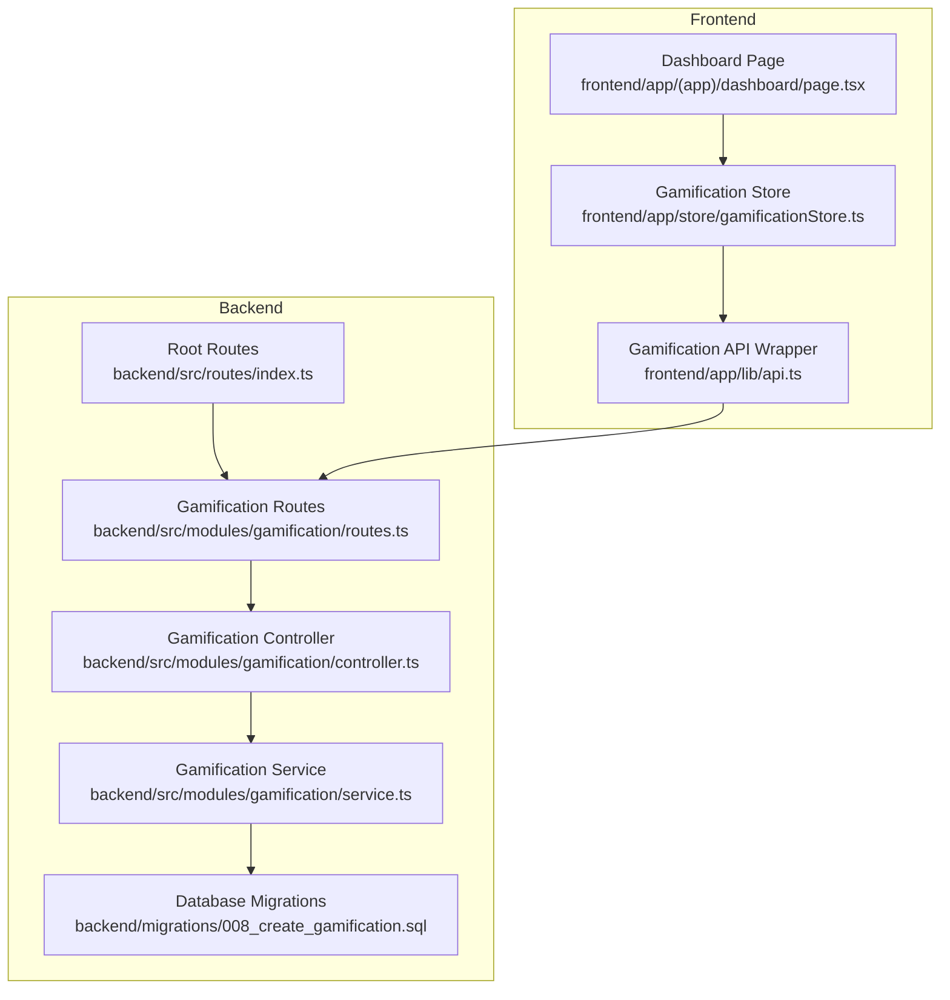
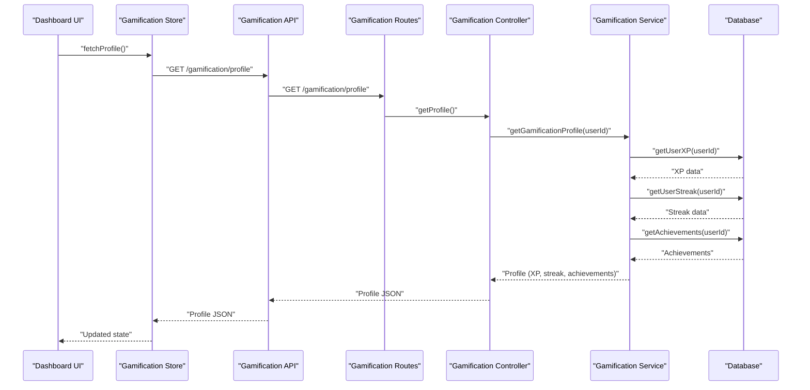
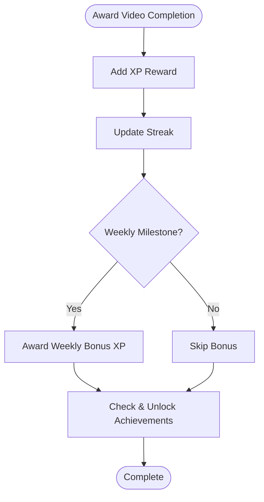
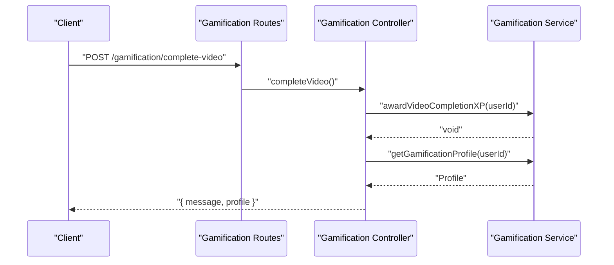
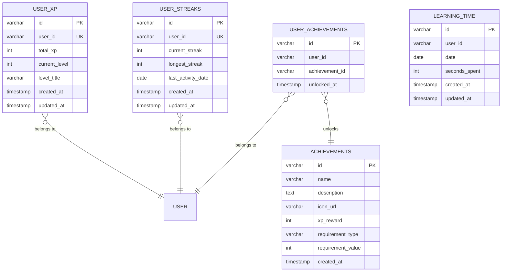
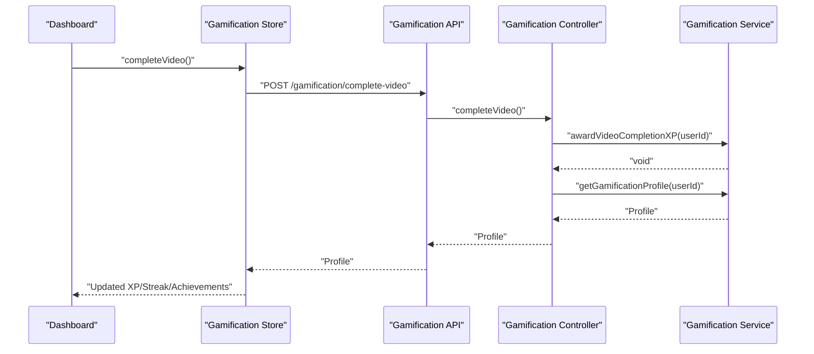
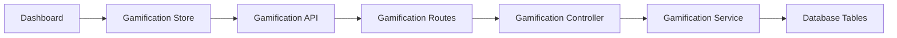

# Leaderboard Functionality

<cite>
**Referenced Files in This Document**
- [service.ts](file://backend/src/modules/gamification/service.ts)
- [controller.ts](file://backend/src/modules/gamification/controller.ts)
- [routes.ts](file://backend/src/modules/gamification/routes.ts)
- [008_create_gamification.sql](file://backend/migrations/008_create_gamification.sql)
- [api.ts](file://frontend/app/lib/api.ts)
- [gamificationStore.ts](file://frontend/app/store/gamificationStore.ts)
- [page.tsx](file://frontend/app/(app)/dashboard/page.tsx)
- [index.ts](file://backend/src/routes/index.ts)
</cite>

## Table of Contents
1. [Introduction](#introduction)
2. [Project Structure](#project-structure)
3. [Core Components](#core-components)
4. [Architecture Overview](#architecture-overview)
5. [Detailed Component Analysis](#detailed-component-analysis)
6. [Dependency Analysis](#dependency-analysis)
7. [Performance Considerations](#performance-considerations)
8. [Troubleshooting Guide](#troubleshooting-guide)
9. [Conclusion](#conclusion)

## Introduction
This document provides comprehensive documentation for the leaderboard functionality within the learning system. The current implementation focuses on XP-based leaderboards and related gamification features. It covers the leaderboard calculation algorithms, ranking systems, score aggregation methods, real-time updates, and integration with XP and achievement systems. The documentation also explains the leaderboard service logic, including user ranking, score comparison, and leaderboard positioning, along with examples of leaderboard queries, ranking algorithms, leaderboard display components, and social comparison features.

## Project Structure
The leaderboard functionality is primarily implemented in the backend gamification module and consumed by the frontend through dedicated APIs and stores. The relevant files include the gamification service, controller, routes, database migrations, frontend API wrappers, and state management.

**Diagram sources**
- [routes.ts:1-18](file://backend/src/modules/gamification/routes.ts#L1-L18)
- [controller.ts:1-62](file://backend/src/modules/gamification/controller.ts#L1-L62)
- [service.ts:1-246](file://backend/src/modules/gamification/service.ts#L1-L246)
- [008_create_gamification.sql:1-64](file://backend/migrations/008_create_gamification.sql#L1-L64)
- [index.ts:1-25](file://backend/src/routes/index.ts#L1-L25)
- [api.ts:54-64](file://frontend/app/lib/api.ts#L54-L64)
- [gamificationStore.ts:1-85](file://frontend/app/store/gamificationStore.ts#L1-L85)
- [page.tsx](file://frontend/app/(app)/dashboard/page.tsx#L1-L94)

**Section sources**
- [routes.ts:1-18](file://backend/src/modules/gamification/routes.ts#L1-L18)
- [controller.ts:1-62](file://backend/src/modules/gamification/controller.ts#L1-L62)
- [service.ts:1-246](file://backend/src/modules/gamification/service.ts#L1-L246)
- [008_create_gamification.sql:1-64](file://backend/migrations/008_create_gamification.sql#L1-L64)
- [index.ts:1-25](file://backend/src/routes/index.ts#L1-L25)
- [api.ts:54-64](file://frontend/app/lib/api.ts#L54-L64)
- [gamificationStore.ts:1-85](file://frontend/app/store/gamificationStore.ts#L1-L85)
- [page.tsx](file://frontend/app/(app)/dashboard/page.tsx#L1-L94)

## Core Components
This section outlines the core components involved in the leaderboard functionality:

- Backend Gamification Module
  - Service: Implements XP calculations, streak updates, achievement checks, and profile composition.
  - Controller: Exposes endpoints for profile retrieval, achievements, XP earning, and video completion.
  - Routes: Defines endpoint paths under `/gamification`.

- Frontend Integration
  - API Wrapper: Provides typed methods for gamification endpoints.
  - Store: Manages gamification state, loading, and errors.
  - Dashboard: Displays XP and streak metrics, reflecting real-time updates.

Key data structures and algorithms:
- XP aggregation and level progression using predefined thresholds.
- Streak computation based on daily activity dates.
- Achievement unlocking based on XP totals, video completions, and course completions.
- Profile composition combining XP, streak, and achievements with next-level calculations.

**Section sources**
- [service.ts:1-246](file://backend/src/modules/gamification/service.ts#L1-L246)
- [controller.ts:1-62](file://backend/src/modules/gamification/controller.ts#L1-L62)
- [routes.ts:1-18](file://backend/src/modules/gamification/routes.ts#L1-L18)
- [api.ts:54-64](file://frontend/app/lib/api.ts#L54-L64)
- [gamificationStore.ts:1-85](file://frontend/app/store/gamificationStore.ts#L1-L85)
- [page.tsx](file://frontend/app/(app)/dashboard/page.tsx#L1-L94)

## Architecture Overview
The leaderboard functionality follows a layered architecture:
- Presentation Layer: Dashboard displays XP and streak metrics.
- State Management: Store fetches and updates gamification data.
- API Layer: Frontend API wrapper calls backend endpoints.
- Application Layer: Controller handles requests and delegates to the service.
- Domain Layer: Service encapsulates business logic for XP, streaks, and achievements.
- Data Access: Database tables store XP, streaks, achievements, and learning time.

**Diagram sources**
- [page.tsx](file://frontend/app/(app)/dashboard/page.tsx#L16-L19)
- [gamificationStore.ts:49-67](file://frontend/app/store/gamificationStore.ts#L49-L67)
- [api.ts:55-56](file://frontend/app/lib/api.ts#L55-L56)
- [routes.ts:12-12](file://backend/src/modules/gamification/routes.ts#L12-L12)
- [controller.ts:11-18](file://backend/src/modules/gamification/controller.ts#L11-L18)
- [service.ts:218-237](file://backend/src/modules/gamification/service.ts#L218-L237)
- [008_create_gamification.sql:1-64](file://backend/migrations/008_create_gamification.sql#L1-L64)

## Detailed Component Analysis

### Backend Gamification Service
The service layer implements the core leaderboard and XP mechanics:
- XP Management
  - Retrieves user XP and inserts defaults if missing.
  - Adds XP and recalculates level and title based on thresholds.
- Streak Management
  - Computes current and longest streaks based on last activity date.
  - Awards bonus XP for weekly streak milestones.
- Achievement System
  - Checks eligibility against XP totals, video completions, and course completions.
  - Unlocks achievements and awards associated XP.
- Profile Composition
  - Returns XP, streak, achievements, and next-level XP delta.

**Diagram sources**
- [service.ts:239-243](file://backend/src/modules/gamification/service.ts#L239-L243)
- [service.ts:103-148](file://backend/src/modules/gamification/service.ts#L103-L148)
- [service.ts:161-216](file://backend/src/modules/gamification/service.ts#L161-L216)

**Section sources**
- [service.ts:47-87](file://backend/src/modules/gamification/service.ts#L47-L87)
- [service.ts:89-148](file://backend/src/modules/gamification/service.ts#L89-L148)
- [service.ts:150-216](file://backend/src/modules/gamification/service.ts#L150-L216)
- [service.ts:218-243](file://backend/src/modules/gamification/service.ts#L218-L243)

### Backend Gamification Controller
The controller exposes endpoints for leaderboard-related operations:
- GET `/gamification/profile`: Returns the user's gamification profile.
- GET `/gamification/achievements`: Lists user achievements.
- POST `/gamification/xp/earn`: Awards XP manually.
- POST `/gamification/complete-video`: Records video completion and triggers XP/streak/achievement updates.

**Diagram sources**
- [routes.ts:14-15](file://backend/src/modules/gamification/routes.ts#L14-L15)
- [controller.ts:48-61](file://backend/src/modules/gamification/controller.ts#L48-L61)
- [service.ts:239-243](file://backend/src/modules/gamification/service.ts#L239-L243)

**Section sources**
- [controller.ts:11-61](file://backend/src/modules/gamification/controller.ts#L11-L61)
- [routes.ts:12-15](file://backend/src/modules/gamification/routes.ts#L12-L15)

### Database Schema for Leaderboard Data
The leaderboard relies on several tables:
- user_xp: Stores total XP, current level, and level title per user.
- user_streaks: Tracks current and longest streaks plus last activity date.
- achievements: Defines achievement criteria and XP rewards.
- user_achievements: Links users to unlocked achievements.
- learning_time: Tracks seconds spent per user per day (supports time-based analytics).

**Diagram sources**
- [008_create_gamification.sql:1-64](file://backend/migrations/008_create_gamification.sql#L1-L64)

**Section sources**
- [008_create_gamification.sql:1-64](file://backend/migrations/008_create_gamification.sql#L1-L64)

### Frontend Integration and Real-Time Updates
The frontend integrates with the leaderboard via:
- API Wrapper: Provides typed methods for gamification endpoints.
- Store: Fetches profile data and updates state after actions like completing a video.
- Dashboard: Displays XP and streak metrics, reflecting real-time updates.

**Diagram sources**
- [page.tsx](file://frontend/app/(app)/dashboard/page.tsx#L16-L19)
- [gamificationStore.ts:69-82](file://frontend/app/store/gamificationStore.ts#L69-L82)
- [api.ts:63-63](file://frontend/app/lib/api.ts#L63-L63)
- [controller.ts:48-61](file://backend/src/modules/gamification/controller.ts#L48-L61)
- [service.ts:239-243](file://backend/src/modules/gamification/service.ts#L239-L243)

**Section sources**
- [api.ts:54-64](file://frontend/app/lib/api.ts#L54-L64)
- [gamificationStore.ts:49-82](file://frontend/app/store/gamificationStore.ts#L49-L82)
- [page.tsx](file://frontend/app/(app)/dashboard/page.tsx#L1-L94)

## Dependency Analysis
The leaderboard functionality exhibits clear separation of concerns:
- Routes depend on Controller.
- Controller depends on Service.
- Service depends on Database for XP, streaks, achievements, and learning time.
- Frontend depends on Routes via API wrapper and Store.

**Diagram sources**
- [routes.ts:1-18](file://backend/src/modules/gamification/routes.ts#L1-L18)
- [controller.ts:1-62](file://backend/src/modules/gamification/controller.ts#L1-L62)
- [service.ts:1-246](file://backend/src/modules/gamification/service.ts#L1-L246)
- [api.ts:54-64](file://frontend/app/lib/api.ts#L54-L64)
- [gamificationStore.ts:1-85](file://frontend/app/store/gamificationStore.ts#L1-L85)
- [page.tsx](file://frontend/app/(app)/dashboard/page.tsx#L1-L94)

**Section sources**
- [index.ts:16-22](file://backend/src/routes/index.ts#L16-L22)
- [routes.ts:1-18](file://backend/src/modules/gamification/routes.ts#L1-L18)
- [controller.ts:1-62](file://backend/src/modules/gamification/controller.ts#L1-L62)
- [service.ts:1-246](file://backend/src/modules/gamification/service.ts#L1-L246)
- [api.ts:54-64](file://frontend/app/lib/api.ts#L54-L64)
- [gamificationStore.ts:1-85](file://frontend/app/store/gamificationStore.ts#L1-L85)
- [page.tsx](file://frontend/app/(app)/dashboard/page.tsx#L1-L94)

## Performance Considerations
- Database Indexes: Ensure optimal query performance for user-based lookups and date-based aggregations.
- Asynchronous Operations: Use concurrent queries for profile composition to minimize latency.
- Caching: Consider caching frequently accessed XP and streak data to reduce database load.
- Pagination: If leaderboard scales beyond single-page displays, implement pagination and sorting by XP.
- Batch Updates: For bulk operations (e.g., daily XP resets), batch database writes to reduce overhead.

## Troubleshooting Guide
Common issues and resolutions:
- Authentication Required: Ensure user is authenticated before accessing gamification endpoints.
- Invalid XP Amount: Validate XP amounts to prevent negative or zero additions.
- Missing User Data: Default insertion ensures XP and streak records exist for new users.
- Achievement Unlocking: Verify achievement requirements and uniqueness constraints.

**Section sources**
- [controller.ts:12-15](file://backend/src/modules/gamification/controller.ts#L12-L15)
- [controller.ts:39-42](file://backend/src/modules/gamification/controller.ts#L39-L42)
- [service.ts:47-59](file://backend/src/modules/gamification/service.ts#L47-L59)
- [service.ts:184-187](file://backend/src/modules/gamification/service.ts#L184-L187)

## Conclusion
The leaderboard functionality centers around XP accumulation, streak tracking, and achievement unlocking. The backend service encapsulates ranking logic through XP thresholds and streak computations, while the frontend provides real-time updates via a dedicated store and API wrapper. The current implementation supports XP-based leaderboards and integrates seamlessly with the broader gamification system. Future enhancements could include category-based leaderboards, time-based rankings, and social comparison features built upon the existing XP and streak foundations.