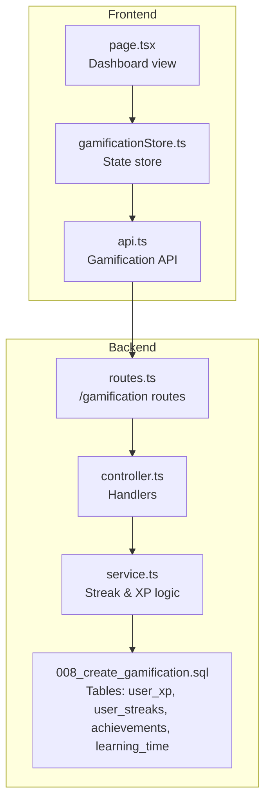
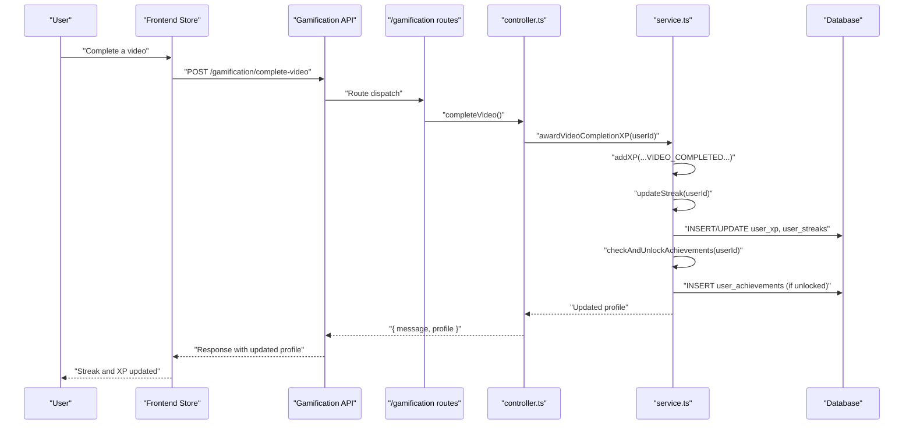
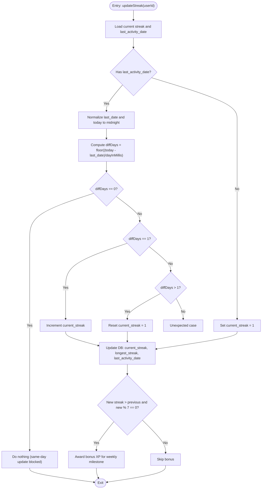
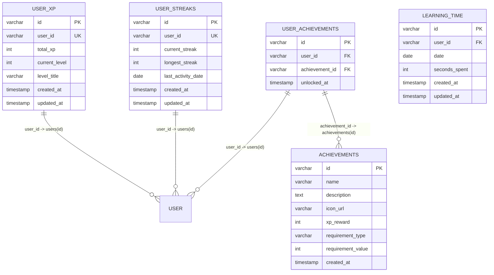
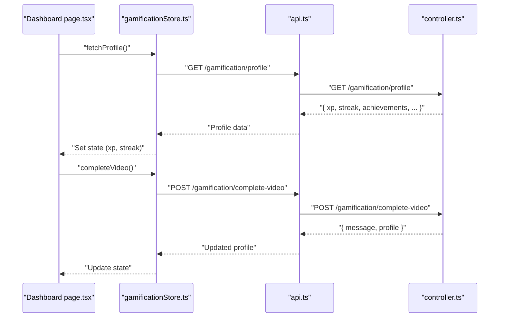
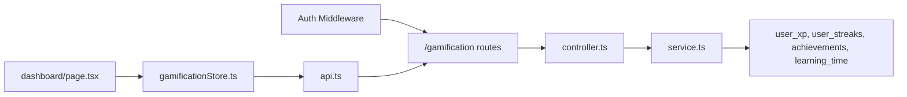

# Streak Tracking

<cite>
**Referenced Files in This Document**
- [service.ts](file://backend/src/modules/gamification/service.ts)
- [controller.ts](file://backend/src/modules/gamification/controller.ts)
- [routes.ts](file://backend/src/modules/gamification/routes.ts)
- [index.ts](file://backend/src/routes/index.ts)
- [008_create_gamification.sql](file://backend/migrations/008_create_gamification.sql)
- [api.ts](file://frontend/app/lib/api.ts)
- [gamificationStore.ts](file://frontend/app/store/gamificationStore.ts)
- [page.tsx](file://frontend/app/(app)/dashboard/page.tsx)
</cite>

## Table of Contents
1. [Introduction](#introduction)
2. [Project Structure](#project-structure)
3. [Core Components](#core-components)
4. [Architecture Overview](#architecture-overview)
5. [Detailed Component Analysis](#detailed-component-analysis)
6. [Dependency Analysis](#dependency-analysis)
7. [Performance Considerations](#performance-considerations)
8. [Troubleshooting Guide](#troubleshooting-guide)
9. [Conclusion](#conclusion)

## Introduction
This document explains the Streak Tracking System in the learning platform. It covers how streaks are calculated, validated, persisted, and visualized. It also documents streak reset conditions, milestone bonuses, and how streaks integrate with user activity patterns such as video completion. The goal is to help both technical and non-technical readers understand how daily learning streaks work end-to-end.

## Project Structure
The streak tracking system spans backend gamification services and frontend presentation:
- Backend gamification module exposes endpoints to fetch profile data, manage XP, and record video completions that trigger streak updates.
- Frontend stores gamification state and renders the streak value on the dashboard.
- Database tables persist user XP, streaks, achievements, and learning time.

**Diagram sources**
- [routes.ts:1-18](file://backend/src/modules/gamification/routes.ts#L1-L18)
- [controller.ts:1-62](file://backend/src/modules/gamification/controller.ts#L1-L62)
- [service.ts:1-246](file://backend/src/modules/gamification/service.ts#L1-L246)
- [008_create_gamification.sql:1-64](file://backend/migrations/008_create_gamification.sql#L1-L64)
- [api.ts:54-64](file://frontend/app/lib/api.ts#L54-L64)
- [gamificationStore.ts:40-85](file://frontend/app/store/gamificationStore.ts#L40-L85)
- [page.tsx:11-19](file://frontend/app/(app)/dashboard/page.tsx#L11-L19)

**Section sources**
- [routes.ts:1-18](file://backend/src/modules/gamification/routes.ts#L1-L18)
- [controller.ts:1-62](file://backend/src/modules/gamification/controller.ts#L1-L62)
- [service.ts:1-246](file://backend/src/modules/gamification/service.ts#L1-L246)
- [008_create_gamification.sql:1-64](file://backend/migrations/008_create_gamification.sql#L1-L64)
- [api.ts:54-64](file://frontend/app/lib/api.ts#L54-L64)
- [gamificationStore.ts:40-85](file://frontend/app/store/gamificationStore.ts#L40-L85)
- [page.tsx:11-19](file://frontend/app/(app)/dashboard/page.tsx#L11-L19)

## Core Components
- Streak model and persistence: The backend tracks current and longest streaks per user and the last activity date. On first access, a user row is initialized with zeros.
- Streak calculation: The algorithm compares the last activity date with “today” (normalized to midnight UTC) to decide whether to increment, reset, or leave streak unchanged.
- Streak reset conditions: A streak resets to 1 day when the user misses a day (last activity was more than one day ago).
- Streak milestones and bonuses: Every multiple of seven days grants bonus XP.
- Integration with user activity: Video completion awards base XP and triggers a streak update, which may unlock achievements and grant bonus XP.

Key implementation references:
- Streak retrieval and initialization: [getUserStreak:89-101](file://backend/src/modules/gamification/service.ts#L89-L101)
- Streak update logic: [updateStreak:103-148](file://backend/src/modules/gamification/service.ts#L103-L148)
- Milestone bonus XP: [updateStreak:138-141](file://backend/src/modules/gamification/service.ts#L138-L141)
- Video completion flow: [awardVideoCompletionXP:239-243](file://backend/src/modules/gamification/service.ts#L239-L243)
- Frontend integration: [completeVideo action:69-82](file://frontend/app/store/gamificationStore.ts#L69-L82), [dashboard rendering](file://frontend/app/(app)/dashboard/page.tsx#L93-L99)

**Section sources**
- [service.ts:89-148](file://backend/src/modules/gamification/service.ts#L89-L148)
- [service.ts:239-243](file://backend/src/modules/gamification/service.ts#L239-L243)
- [gamificationStore.ts:69-82](file://frontend/app/store/gamificationStore.ts#L69-L82)
- [page.tsx:93-99](file://frontend/app/(app)/dashboard/page.tsx#L93-L99)

## Architecture Overview
The streak lifecycle integrates frontend actions, backend endpoints, and database persistence.

**Diagram sources**
- [controller.ts:48-61](file://backend/src/modules/gamification/controller.ts#L48-L61)
- [service.ts:239-243](file://backend/src/modules/gamification/service.ts#L239-L243)
- [service.ts:103-148](file://backend/src/modules/gamification/service.ts#L103-L148)
- [service.ts:161-216](file://backend/src/modules/gamification/service.ts#L161-L216)
- [api.ts:54-64](file://frontend/app/lib/api.ts#L54-L64)
- [gamificationStore.ts:69-82](file://frontend/app/store/gamificationStore.ts#L69-L82)

## Detailed Component Analysis

### Streak Calculation Algorithm
The backend calculates streaks by normalizing dates to midnight and comparing the difference in days between today and the last activity date.

**Diagram sources**
- [service.ts:103-148](file://backend/src/modules/gamification/service.ts#L103-L148)

**Section sources**
- [service.ts:103-148](file://backend/src/modules/gamification/service.ts#L103-L148)

### Streak Persistence Model
The backend persists streaks and related XP in dedicated tables. The model supports:
- Current streak length
- Longest streak ever achieved
- Last activity date (used for streak continuity checks)
- XP and level tracking for gamification profile

**Diagram sources**
- [008_create_gamification.sql:1-64](file://backend/migrations/008_create_gamification.sql#L1-L64)

**Section sources**
- [008_create_gamification.sql:1-64](file://backend/migrations/008_create_gamification.sql#L1-L64)

### Streak Reset Conditions
- If the last activity was more than one day ago, the streak resets to 1.
- If the last activity was exactly one day ago, the streak increments by 1.
- If the last activity was today, the streak remains unchanged (same-day deduplication).

These conditions are enforced during the daily update routine.

**Section sources**
- [service.ts:111-127](file://backend/src/modules/gamification/service.ts#L111-L127)

### Streak Visualization and Display
- Frontend dashboard displays the current streak value prominently.
- The store fetches the profile on load and updates state after video completion.
- The API endpoints support fetching the profile and recording video completion.

**Diagram sources**
- [page.tsx:11-19](file://frontend/app/(app)/dashboard/page.tsx#L11-L19)
- [gamificationStore.ts:49-82](file://frontend/app/store/gamificationStore.ts#L49-L82)
- [api.ts:54-64](file://frontend/app/lib/api.ts#L54-L64)
- [controller.ts:11-19](file://backend/src/modules/gamification/controller.ts#L11-L19)
- [controller.ts:48-61](file://backend/src/modules/gamification/controller.ts#L48-L61)

**Section sources**
- [page.tsx:93-99](file://frontend/app/(app)/dashboard/page.tsx#L93-L99)
- [gamificationStore.ts:49-82](file://frontend/app/store/gamificationStore.ts#L49-L82)
- [api.ts:54-64](file://frontend/app/lib/api.ts#L54-L64)
- [controller.ts:11-19](file://backend/src/modules/gamification/controller.ts#L11-L19)
- [controller.ts:48-61](file://backend/src/modules/gamification/controller.ts#L48-L61)

### Streak Maintenance Strategies
- Trigger streak updates on meaningful user actions (e.g., completing a video).
- Deduplicate same-day updates to avoid inflating streaks.
- Persist the last activity date to maintain continuity across sessions.
- Periodic profile refresh ensures the UI reflects the latest streak and XP.

Integration points:
- Video completion endpoint: [completeVideo route](file://backend/src/modules/gamification/routes.ts#L15)
- Controller handler: [completeVideo handler:48-61](file://backend/src/modules/gamification/controller.ts#L48-L61)
- Service orchestration: [awardVideoCompletionXP:239-243](file://backend/src/modules/gamification/service.ts#L239-L243)

**Section sources**
- [routes.ts:15](file://backend/src/modules/gamification/routes.ts#L15)
- [controller.ts:48-61](file://backend/src/modules/gamification/controller.ts#L48-L61)
- [service.ts:239-243](file://backend/src/modules/gamification/service.ts#L239-L243)

### Streak Milestones and Bonuses
- Weekly milestones: When the streak crosses a multiple of seven days, bonus XP is awarded.
- Achievement unlocking: Completing a video also triggers achievement checks, which can award XP and unlock achievements.

References:
- Bonus XP logic: [updateStreak milestone:138-141](file://backend/src/modules/gamification/service.ts#L138-L141)
- Achievement checks: [checkAndUnlockAchievements:161-216](file://backend/src/modules/gamification/service.ts#L161-L216)

**Section sources**
- [service.ts:138-141](file://backend/src/modules/gamification/service.ts#L138-L141)
- [service.ts:161-216](file://backend/src/modules/gamification/service.ts#L161-L216)

## Dependency Analysis
The gamification module depends on:
- Authentication middleware to ensure requests are made by authenticated users.
- Database tables for XP, streaks, achievements, and learning time.
- Frontend API and store to present and update streak data.

**Diagram sources**
- [index.ts:6](file://backend/src/routes/index.ts#L6)
- [routes.ts:8](file://backend/src/modules/gamification/routes.ts#L8)
- [controller.ts:8](file://backend/src/modules/gamification/controller.ts#L8)
- [service.ts:1](file://backend/src/modules/gamification/service.ts#L1)
- [008_create_gamification.sql:1-64](file://backend/migrations/008_create_gamification.sql#L1-L64)
- [api.ts:54-64](file://frontend/app/lib/api.ts#L54-L64)
- [gamificationStore.ts:1-3](file://frontend/app/store/gamificationStore.ts#L1-L3)
- [page.tsx:11-13](file://frontend/app/(app)/dashboard/page.tsx#L11-L13)

**Section sources**
- [index.ts:6](file://backend/src/routes/index.ts#L6)
- [routes.ts:8](file://backend/src/modules/gamification/routes.ts#L8)
- [controller.ts:8](file://backend/src/modules/gamification/controller.ts#L8)
- [service.ts:1](file://backend/src/modules/gamification/service.ts#L1)
- [008_create_gamification.sql:1-64](file://backend/migrations/008_create_gamification.sql#L1-L64)
- [api.ts:54-64](file://frontend/app/lib/api.ts#L54-L64)
- [gamificationStore.ts:1-3](file://frontend/app/store/gamificationStore.ts#L1-L3)
- [page.tsx:11-13](file://frontend/app/(app)/dashboard/page.tsx#L11-L13)

## Performance Considerations
- Date normalization: Comparing normalized midnight timestamps avoids timezone and time-of-day inconsistencies.
- Single-table queries: Retrieving streaks and XP is O(1) via indexed user IDs.
- Batched profile fetch: The profile endpoint aggregates XP, streak, and achievements efficiently.
- Frontend caching: The store caches profile data and updates only on explicit actions to reduce network calls.

[No sources needed since this section provides general guidance]

## Troubleshooting Guide
Common issues and resolutions:
- Streak not updating after video completion:
  - Verify the video completion endpoint is called and returns success.
  - Confirm the user is authenticated and the request reaches the handler.
  - References: [completeVideo route](file://backend/src/modules/gamification/routes.ts#L15), [handler:48-61](file://backend/src/modules/gamification/controller.ts#L48-L61), [store action:69-82](file://frontend/app/store/gamificationStore.ts#L69-L82)
- Streak resets unexpectedly:
  - Ensure the last activity date is being persisted and normalized to midnight.
  - Confirm that same-day updates are intentionally skipped.
  - References: [updateStreak:111-127](file://backend/src/modules/gamification/service.ts#L111-L127)
- Streak milestone bonus not awarded:
  - Check that the new streak exceeds the previous streak and is divisible by seven.
  - References: [milestone check:138-141](file://backend/src/modules/gamification/service.ts#L138-L141)
- Streak not visible in UI:
  - Ensure the store fetches the profile on dashboard load and updates state after video completion.
  - References: [dashboard fetch](file://frontend/app/(app)/dashboard/page.tsx#L16-L19), [store fetchProfile:49-67](file://frontend/app/store/gamificationStore.ts#L49-L67)

**Section sources**
- [routes.ts:15](file://backend/src/modules/gamification/routes.ts#L15)
- [controller.ts:48-61](file://backend/src/modules/gamification/controller.ts#L48-L61)
- [gamificationStore.ts:49-82](file://frontend/app/store/gamificationStore.ts#L49-L82)
- [service.ts:111-127](file://backend/src/modules/gamification/service.ts#L111-L127)
- [service.ts:138-141](file://backend/src/modules/gamification/service.ts#L138-L141)
- [page.tsx:16-19](file://frontend/app/(app)/dashboard/page.tsx#L16-L19)

## Conclusion
The Streak Tracking System is a focused, robust mechanism that ties user activity to streak persistence and gamification rewards. By normalizing dates, enforcing same-day deduplication, and rewarding weekly milestones, it encourages consistent daily engagement. The frontend integrates seamlessly with backend endpoints to present real-time streak data and reflect XP gains from video completions and achievements.