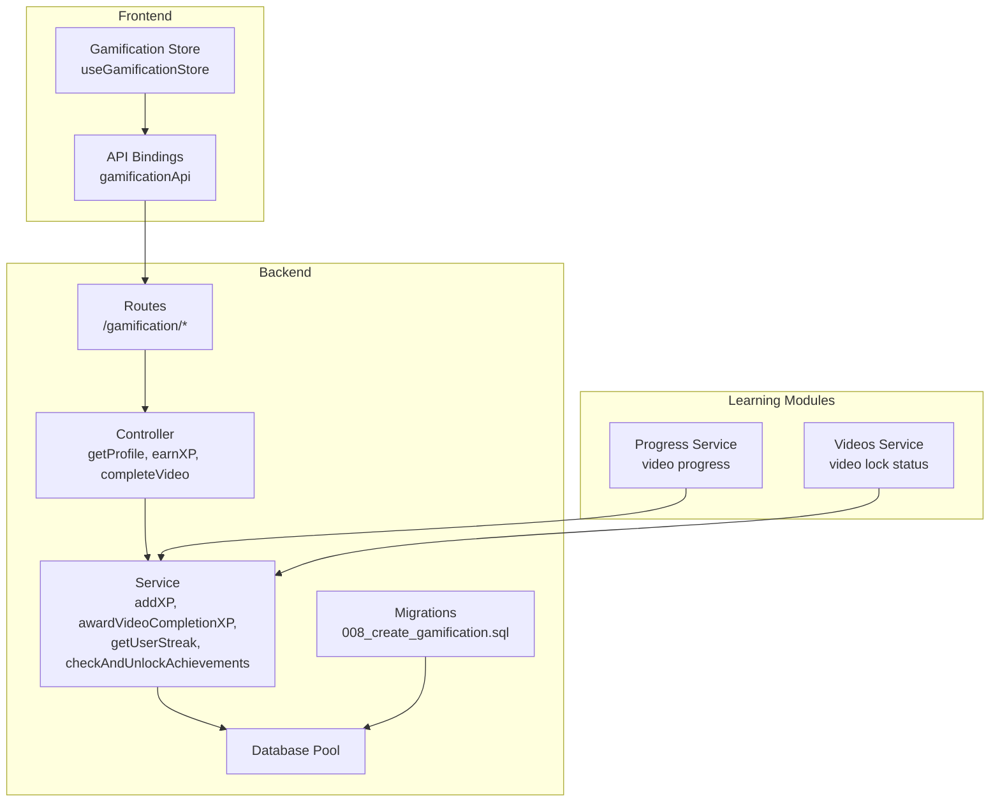
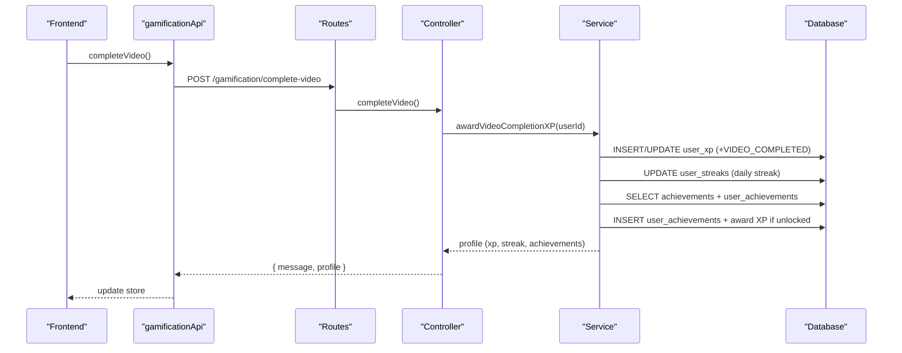
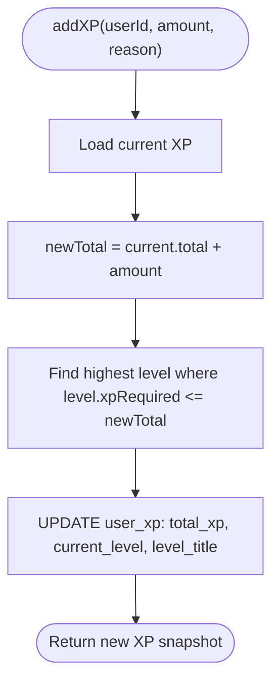
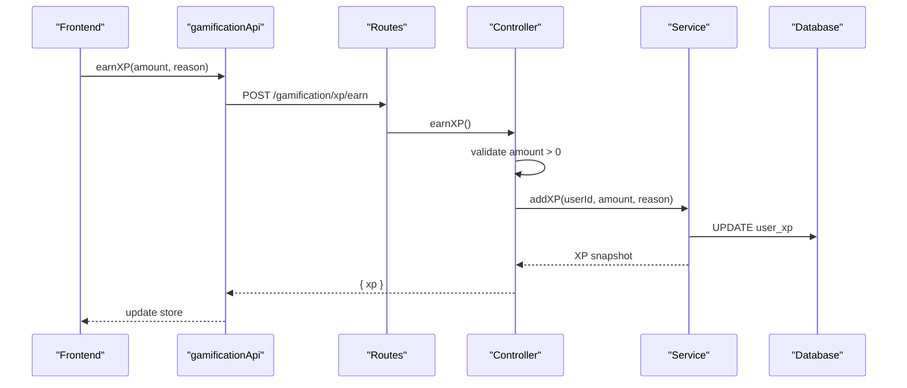
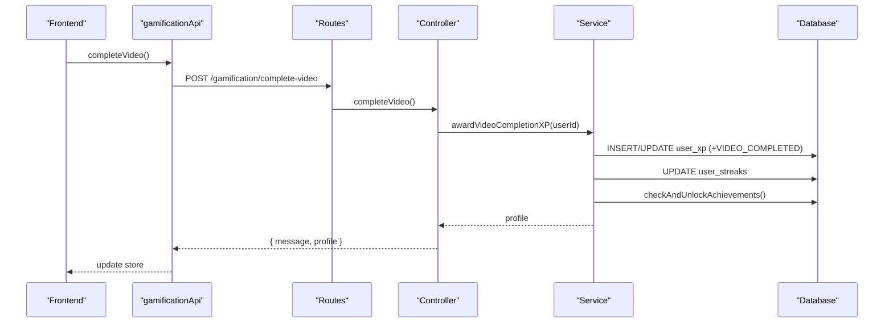
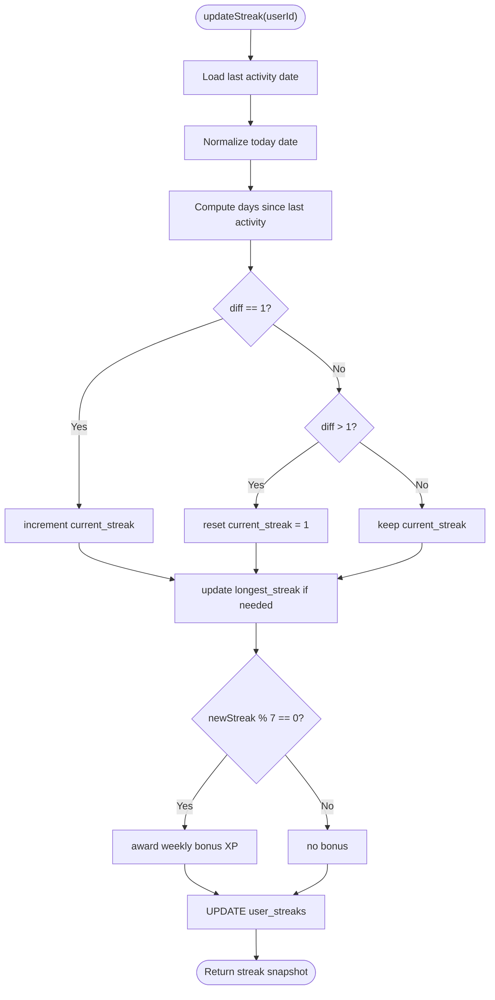
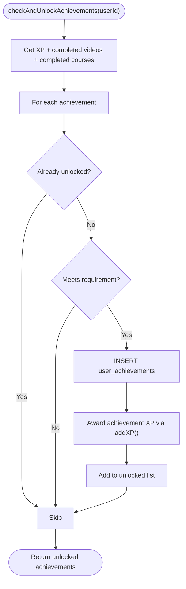
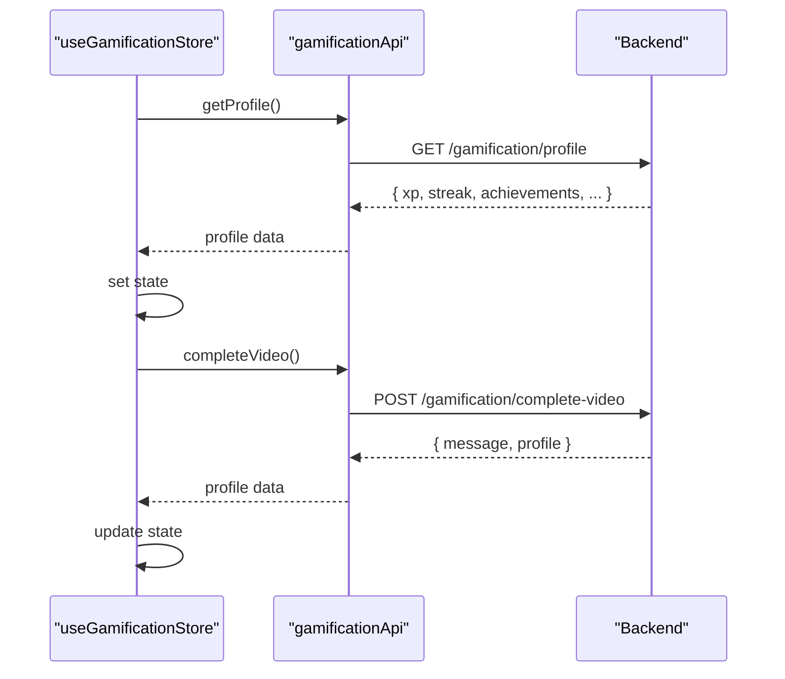
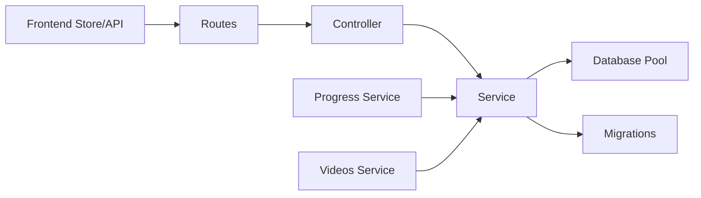
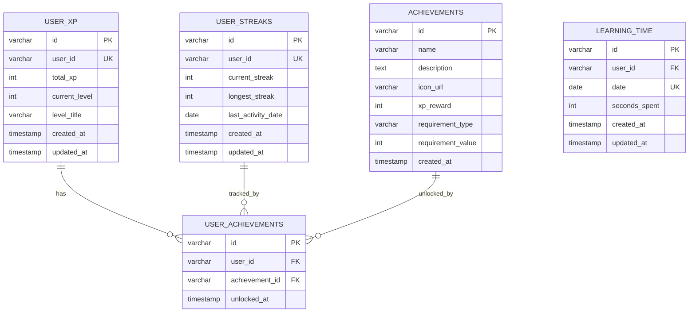

# XP Point System

<cite>
**Referenced Files in This Document**
- [service.ts](file://backend/src/modules/gamification/service.ts)
- [controller.ts](file://backend/src/modules/gamification/controller.ts)
- [routes.ts](file://backend/src/modules/gamification/routes.ts)
- [008_create_gamification.sql](file://backend/migrations/008_create_gamification.sql)
- [database.ts](file://backend/src/config/database.ts)
- [index.ts](file://backend/src/routes/index.ts)
- [progress.service.ts](file://backend/src/modules/progress/service.ts)
- [videos.service.ts](file://backend/src/modules/videos/service.ts)
- [gamificationStore.ts](file://frontend/app/store/gamificationStore.ts)
- [api.ts](file://frontend/app/lib/api.ts)
- [seed.ts](file://backend/src/scripts/seed.ts)
</cite>

## Table of Contents
1. [Introduction](#introduction)
2. [Project Structure](#project-structure)
3. [Core Components](#core-components)
4. [Architecture Overview](#architecture-overview)
5. [Detailed Component Analysis](#detailed-component-analysis)
6. [Dependency Analysis](#dependency-analysis)
7. [Performance Considerations](#performance-considerations)
8. [Troubleshooting Guide](#troubleshooting-guide)
9. [Conclusion](#conclusion)
10. [Appendices](#appendices)

## Introduction
This document describes the XP Point System that powers gamification in the learning platform. It covers XP calculation algorithms, point award mechanisms, manual XP awarding, and video completion rewards. It also explains the XP service logic, including point validation, reason tracking, and database operations. Examples of XP calculations, award triggers, point accumulation patterns, and integration with learning activities are included. Finally, the XP schema design, point limits, and reward tiers are documented.

## Project Structure
The XP system spans backend services, database migrations, and frontend integration:
- Backend gamification module: service, controller, and routes
- Database schema for XP, streaks, achievements, and learning time
- Frontend store and API bindings for gamification data
- Integration with progress and videos modules for triggers

**Diagram sources**
- [routes.ts:1-18](file://backend/src/modules/gamification/routes.ts#L1-L18)
- [controller.ts:1-62](file://backend/src/modules/gamification/controller.ts#L1-L62)
- [service.ts:1-246](file://backend/src/modules/gamification/service.ts#L1-L246)
- [008_create_gamification.sql:1-64](file://backend/migrations/008_create_gamification.sql#L1-L64)
- [database.ts:1-53](file://backend/src/config/database.ts#L1-L53)
- [gamificationStore.ts:1-86](file://frontend/app/store/gamificationStore.ts#L1-L86)
- [api.ts:54-64](file://frontend/app/lib/api.ts#L54-L64)
- [progress.service.ts:1-163](file://backend/src/modules/progress/service.ts#L1-L163)
- [videos.service.ts:1-160](file://backend/src/modules/videos/service.ts#L1-L160)

**Section sources**
- [routes.ts:1-18](file://backend/src/modules/gamification/routes.ts#L1-L18)
- [index.ts:1-25](file://backend/src/routes/index.ts#L1-L25)

## Core Components
- XP Service: Central logic for XP balance, level calculation, streak tracking, achievement checks, and video completion rewards.
- Controller: Exposes REST endpoints for profile retrieval, manual XP awarding, and video completion recording.
- Routes: Mounts gamification endpoints under /gamification.
- Database Schema: Defines tables for user XP, streaks, achievements, and user achievements.
- Frontend Store/API: Fetches and updates gamification data, and records video completions.

Key responsibilities:
- Validate XP amounts for manual awards
- Track reasons for XP changes
- Compute levels based on cumulative XP thresholds
- Manage daily streaks and weekly milestone bonuses
- Unlock achievements based on XP totals, completed videos, and completed courses
- Integrate with learning progress to trigger XP rewards

**Section sources**
- [service.ts:1-246](file://backend/src/modules/gamification/service.ts#L1-L246)
- [controller.ts:1-62](file://backend/src/modules/gamification/controller.ts#L1-L62)
- [routes.ts:1-18](file://backend/src/modules/gamification/routes.ts#L1-L18)
- [008_create_gamification.sql:1-64](file://backend/migrations/008_create_gamification.sql#L1-L64)
- [gamificationStore.ts:1-86](file://frontend/app/store/gamificationStore.ts#L1-L86)
- [api.ts:54-64](file://frontend/app/lib/api.ts#L54-L64)

## Architecture Overview
The XP system follows a layered architecture:
- Presentation: Frontend store and API bindings
- Application: Controller and Service
- Persistence: MySQL via a shared database pool

**Diagram sources**
- [api.ts:63](file://frontend/app/lib/api.ts#L63)
- [routes.ts:14-15](file://backend/src/modules/gamification/routes.ts#L14-L15)
- [controller.ts:48-61](file://backend/src/modules/gamification/controller.ts#L48-L61)
- [service.ts:239-243](file://backend/src/modules/gamification/service.ts#L239-L243)
- [008_create_gamification.sql:14-49](file://backend/migrations/008_create_gamification.sql#L14-L49)

## Detailed Component Analysis

### XP Calculation and Leveling
- Level thresholds define XP required per level.
- On XP addition, the system recalculates the highest applicable level based on total XP.
- The level title is updated accordingly.

**Diagram sources**
- [service.ts:61-87](file://backend/src/modules/gamification/service.ts#L61-L87)
- [service.ts:27-36](file://backend/src/modules/gamification/service.ts#L27-L36)

**Section sources**
- [service.ts:61-87](file://backend/src/modules/gamification/service.ts#L61-L87)
- [service.ts:27-36](file://backend/src/modules/gamification/service.ts#L27-L36)

### Manual XP Awarding
- Endpoint validates that amount is positive.
- Stores reason for the XP change.
- Returns updated XP snapshot.

**Diagram sources**
- [controller.ts:31-46](file://backend/src/modules/gamification/controller.ts#L31-L46)
- [service.ts:61-87](file://backend/src/modules/gamification/service.ts#L61-L87)

**Section sources**
- [controller.ts:31-46](file://backend/src/modules/gamification/controller.ts#L31-L46)

### Video Completion Rewards
- On completion, the system awards fixed XP for video completion.
- Updates daily streaks.
- Checks and unlocks achievements.

**Diagram sources**
- [controller.ts:48-61](file://backend/src/modules/gamification/controller.ts#L48-L61)
- [service.ts:239-243](file://backend/src/modules/gamification/service.ts#L239-L243)

**Section sources**
- [service.ts:239-243](file://backend/src/modules/gamification/service.ts#L239-L243)

### Streak Management
- Tracks current and longest streaks.
- Resets or increments streak based on last activity date.
- Awards bonus XP for weekly milestones (multiples of 7 days).

**Diagram sources**
- [service.ts:103-148](file://backend/src/modules/gamification/service.ts#L103-L148)

**Section sources**
- [service.ts:103-148](file://backend/src/modules/gamification/service.ts#L103-L148)

### Achievement System
- Retrieves all achievements and user unlocks.
- Checks three categories: total XP, completed videos, completed courses.
- Unlocks matching achievements, awards XP, and updates the profile.

**Diagram sources**
- [service.ts:161-216](file://backend/src/modules/gamification/service.ts#L161-L216)

**Section sources**
- [service.ts:150-216](file://backend/src/modules/gamification/service.ts#L150-L216)

### Frontend Integration
- The frontend store fetches the gamification profile and updates local state.
- The store calls the API to record video completion, which triggers backend XP and streak updates.

**Diagram sources**
- [gamificationStore.ts:49-82](file://frontend/app/store/gamificationStore.ts#L49-L82)
- [api.ts:55-64](file://frontend/app/lib/api.ts#L55-L64)

**Section sources**
- [gamificationStore.ts:1-86](file://frontend/app/store/gamificationStore.ts#L1-L86)
- [api.ts:54-64](file://frontend/app/lib/api.ts#L54-L64)

## Dependency Analysis
- Routes depend on the controller.
- Controller depends on the service.
- Service depends on the database pool and performs SQL queries.
- Frontend store depends on API bindings, which call backend routes.
- Progress and videos services indirectly influence XP via completion triggers.

**Diagram sources**
- [routes.ts:1-18](file://backend/src/modules/gamification/routes.ts#L1-L18)
- [controller.ts:1-62](file://backend/src/modules/gamification/controller.ts#L1-L62)
- [service.ts:1-246](file://backend/src/modules/gamification/service.ts#L1-L246)
- [database.ts:19-50](file://backend/src/config/database.ts#L19-L50)
- [008_create_gamification.sql:1-64](file://backend/migrations/008_create_gamification.sql#L1-L64)
- [progress.service.ts:1-163](file://backend/src/modules/progress/service.ts#L1-L163)
- [videos.service.ts:1-160](file://backend/src/modules/videos/service.ts#L1-L160)

**Section sources**
- [index.ts:1-25](file://backend/src/routes/index.ts#L1-L25)

## Performance Considerations
- Database queries are straightforward and indexed:
  - user_xp.user_id and user_streaks.user_id are indexed.
  - Unique constraints prevent duplicate entries for user_achievements and learning_time.
- The service uses single-row lookups and targeted updates, minimizing overhead.
- Achievement unlocking iterates through achievements; ensure the number remains reasonable for performance.
- Consider batching or caching for high-frequency completion events if needed.

[No sources needed since this section provides general guidance]

## Troubleshooting Guide
Common issues and resolutions:
- Authentication errors: Ensure requests include a valid session/token; endpoints require authentication.
- Invalid XP amount: Manual XP award endpoint rejects zero or negative amounts.
- Missing XP record: The service auto-initializes user XP on first access.
- Streak not updating: Verify last activity date normalization and daily boundary logic.
- Achievement not unlocking: Confirm requirement thresholds and that the achievement is not already unlocked.

**Section sources**
- [controller.ts:11-19](file://backend/src/modules/gamification/controller.ts#L11-L19)
- [controller.ts:31-46](file://backend/src/modules/gamification/controller.ts#L31-L46)
- [service.ts:47-59](file://backend/src/modules/gamification/service.ts#L47-L59)
- [service.ts:103-148](file://backend/src/modules/gamification/service.ts#L103-L148)
- [service.ts:161-216](file://backend/src/modules/gamification/service.ts#L161-L216)

## Conclusion
The XP Point System provides a robust foundation for gamified learning:
- Clear XP calculation and leveling
- Practical reward tiers for completion and streaks
- Flexible manual XP awarding with reason tracking
- Automated achievement unlocking aligned with learning progress
- Clean separation of concerns across routes, controller, service, and persistence layers

[No sources needed since this section summarizes without analyzing specific files]

## Appendices

### XP Schema Design
Tables and relationships:
- user_xp: stores total XP, current level, and level title per user
- user_streaks: tracks current and longest streaks plus last activity date
- achievements: defines unlockable achievements with requirements and XP rewards
- user_achievements: records which achievements a user has unlocked
- learning_time: optional time tracking per day

**Diagram sources**
- [008_create_gamification.sql:1-64](file://backend/migrations/008_create_gamification.sql#L1-L64)

**Section sources**
- [008_create_gamification.sql:1-64](file://backend/migrations/008_create_gamification.sql#L1-L64)

### XP Rewards and Limits
- Video completed: base reward applied on completion
- Section completed: base reward for completing a section
- Course completed: base reward for finishing a course
- Daily streak: base reward per day; weekly milestones apply extra bonus
- Perfect quiz: base reward for quiz mastery

Reward tiers and thresholds:
- Level thresholds define progression bands with titles
- Achievement requirements include XP totals, completed videos, and completed courses

Note: The system does not enforce global point caps; XP accumulates indefinitely.

**Section sources**
- [service.ts:38-45](file://backend/src/modules/gamification/service.ts#L38-L45)
- [service.ts:27-36](file://backend/src/modules/gamification/service.ts#L27-L36)
- [seed.ts:93-98](file://backend/src/scripts/seed.ts#L93-L98)

### Example Scenarios
- Manual XP award: A manager grants 100 XP with a reason; the service validates amount and updates the user’s XP and level.
- Video completion: Completing a video awards base XP, updates streak, and rechecks achievements.
- Weekly streak bonus: After 7 consecutive days, the user receives an increased streak bonus.
- Achievement unlock: Completing 5 videos unlocks a predefined achievement and awards its XP reward.

**Section sources**
- [controller.ts:31-46](file://backend/src/modules/gamification/controller.ts#L31-L46)
- [service.ts:239-243](file://backend/src/modules/gamification/service.ts#L239-L243)
- [service.ts:138-141](file://backend/src/modules/gamification/service.ts#L138-L141)
- [service.ts:161-216](file://backend/src/modules/gamification/service.ts#L161-L216)