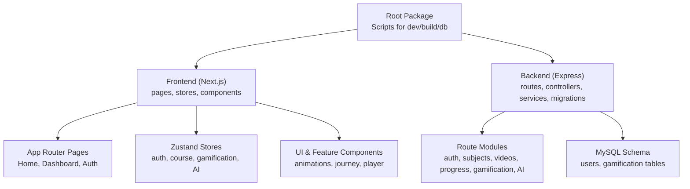
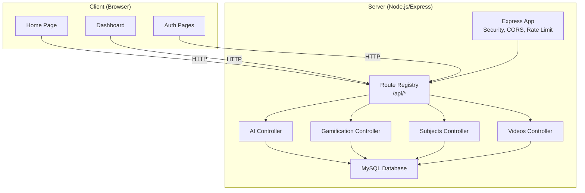
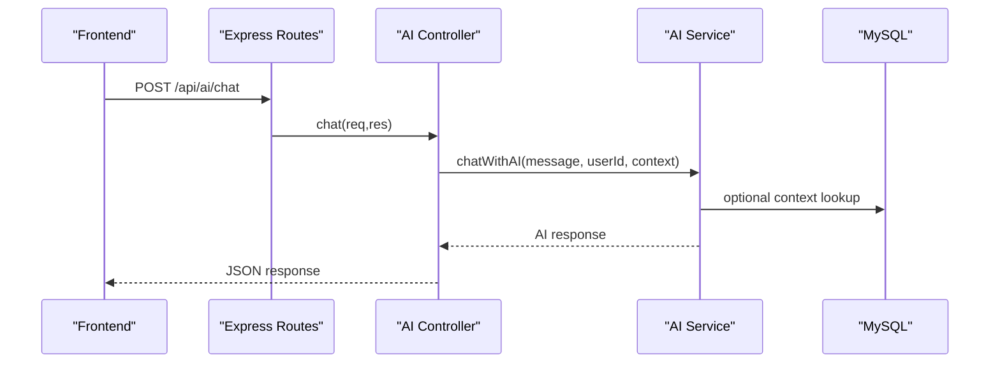
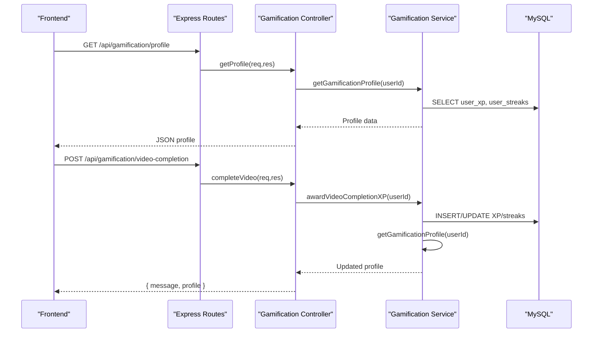
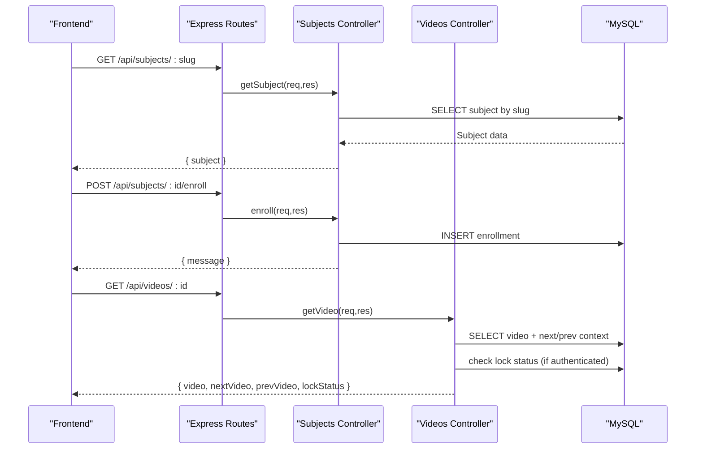
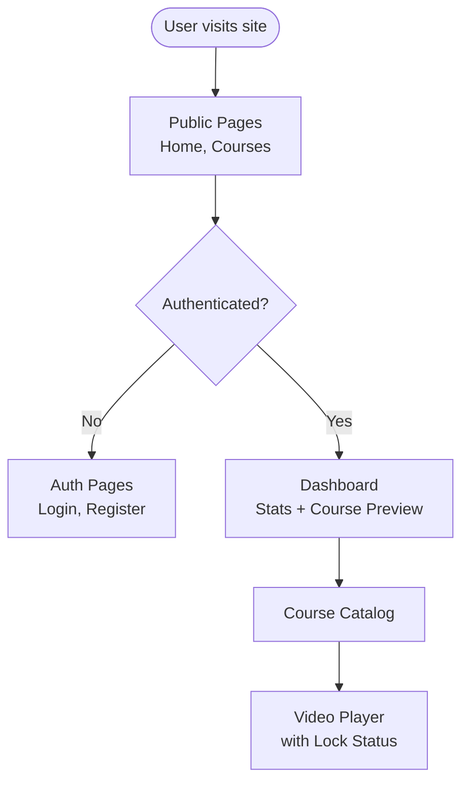
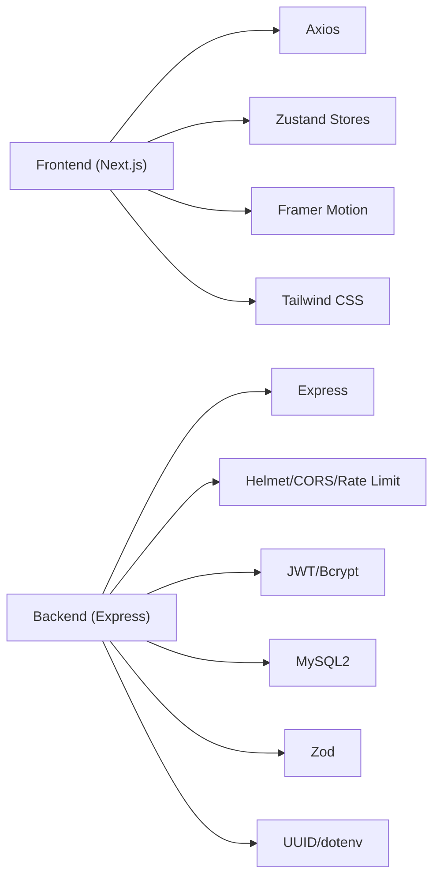

# Project Overview

<cite>
**Referenced Files in This Document**
- [package.json](file://package.json)
- [backend/package.json](file://backend/package.json)
- [frontend/package.json](file://frontend/package.json)
- [backend/src/app.ts](file://backend/src/app.ts)
- [backend/src/server.ts](file://backend/src/server.ts)
- [backend/src/routes/index.ts](file://backend/src/routes/index.ts)
- [backend/src/modules/ai/controller.ts](file://backend/src/modules/ai/controller.ts)
- [backend/src/modules/gamification/controller.ts](file://backend/src/modules/gamification/controller.ts)
- [backend/src/modules/subjects/controller.ts](file://backend/src/modules/subjects/controller.ts)
- [backend/src/modules/videos/controller.ts](file://backend/src/modules/videos/controller.ts)
- [backend/migrations/001_create_users.sql](file://backend/migrations/001_create_users.sql)
- [backend/migrations/008_create_gamification.sql](file://backend/migrations/008_create_gamification.sql)
- [frontend/app/layout.tsx](file://frontend/app/layout.tsx)
- [frontend/app/page.tsx](file://frontend/app/page.tsx)
- [frontend/app/(app)/dashboard/page.tsx](file://frontend/app/(app)/dashboard/page.tsx)
</cite>

## Table of Contents
1. [Introduction](#introduction)
2. [Project Structure](#project-structure)
3. [Core Components](#core-components)
4. [Architecture Overview](#architecture-overview)
5. [Detailed Component Analysis](#detailed-component-analysis)
6. [Dependency Analysis](#dependency-analysis)
7. [Performance Considerations](#performance-considerations)
8. [Troubleshooting Guide](#troubleshooting-guide)
9. [Conclusion](#conclusion)
10. [Appendices](#appendices)

## Introduction
Learning System is a premium Learning Management System (LMS) designed to deliver an immersive, personalized, and engaging educational experience. Its core value proposition centers on three pillars:
- AI-powered learning assistance: Instant chat support, concept explanations, video summaries, and adaptive quizzes.
- Gamification: XP, levels, streaks, achievements, and learning-time tracking to motivate and visualize progress.
- Visual learning journey: Structured courses, progress-aware navigation, and interactive dashboards.

The platform targets modern learners who want flexible, structured, and rewarding education pathways, supported by robust technology choices and a clean separation between frontend and backend.

## Project Structure
The repository follows a monorepo-like structure with a frontend built on Next.js and a backend powered by Express. Scripts at the root orchestrate development, building, and database operations across both layers.

**Diagram sources**
- [package.json:6-14](file://package.json#L6-L14)
- [frontend/app/layout.tsx:13-26](file://frontend/app/layout.tsx#L13-L26)
- [backend/src/routes/index.ts:1-25](file://backend/src/routes/index.ts#L1-L25)
- [backend/migrations/001_create_users.sql:1-11](file://backend/migrations/001_create_users.sql#L1-L11)
- [backend/migrations/008_create_gamification.sql:1-64](file://backend/migrations/008_create_gamification.sql#L1-L64)

**Section sources**
- [package.json:6-14](file://package.json#L6-L14)
- [frontend/app/layout.tsx:13-26](file://frontend/app/layout.tsx#L13-L26)
- [backend/src/routes/index.ts:1-25](file://backend/src/routes/index.ts#L1-L25)

## Core Components
- Frontend (Next.js):
  - App Router pages for public and authenticated areas (home, courses, dashboard, auth).
  - Zustand stores for state management (authentication, courses, gamification, AI).
  - UI primitives and feature-specific components (animations, journey, player).
- Backend (Express):
  - Centralized app initialization with security, CORS, rate limiting, body parsing, and route registration.
  - Modular route groups for authentication, subjects, videos, progress, gamification, and AI.
  - Database schema supporting users and gamification mechanics.

Key differentiators visible in the codebase:
- AI assistant endpoints for chat, summaries, quizzes, and concept explanations.
- Gamification endpoints for XP, streaks, achievements, and completion-based rewards.
- Course enrollment and locked/unlocked video access control with contextual navigation.

**Section sources**
- [frontend/app/page.tsx:1-165](file://frontend/app/page.tsx#L1-L165)
- [frontend/app/(app)/dashboard/page.tsx:1-171](file://frontend/app/(app)/dashboard/page.tsx#L1-L171)
- [backend/src/app.ts:1-54](file://backend/src/app.ts#L1-L54)
- [backend/src/routes/index.ts:1-25](file://backend/src/routes/index.ts#L1-L25)
- [backend/src/modules/ai/controller.ts:1-73](file://backend/src/modules/ai/controller.ts#L1-L73)
- [backend/src/modules/gamification/controller.ts:1-62](file://backend/src/modules/gamification/controller.ts#L1-L62)
- [backend/src/modules/subjects/controller.ts:1-69](file://backend/src/modules/subjects/controller.ts#L1-L69)
- [backend/src/modules/videos/controller.ts:1-42](file://backend/src/modules/videos/controller.ts#L1-L42)

## Architecture Overview
The system uses a client-server architecture:
- Frontend (Next.js): Renders marketing pages, user dashboards, and course experiences with client-side state.
- Backend (Express): Serves RESTful APIs, enforces authentication and authorization, and manages data through MySQL.

**Diagram sources**
- [backend/src/app.ts:1-54](file://backend/src/app.ts#L1-L54)
- [backend/src/routes/index.ts:1-25](file://backend/src/routes/index.ts#L1-L25)
- [backend/src/modules/ai/controller.ts:1-73](file://backend/src/modules/ai/controller.ts#L1-L73)
- [backend/src/modules/gamification/controller.ts:1-62](file://backend/src/modules/gamification/controller.ts#L1-L62)
- [backend/src/modules/subjects/controller.ts:1-69](file://backend/src/modules/subjects/controller.ts#L1-L69)
- [backend/src/modules/videos/controller.ts:1-42](file://backend/src/modules/videos/controller.ts#L1-L42)

## Detailed Component Analysis

### AI Assistant Module
The AI module exposes endpoints for:
- Chat with context
- Video summary generation
- Quiz generation from video content
- Concept explanation tied to a video

**Diagram sources**
- [backend/src/routes/index.ts:7](file://backend/src/routes/index.ts#L7)
- [backend/src/modules/ai/controller.ts:7-21](file://backend/src/modules/ai/controller.ts#L7-L21)

**Section sources**
- [backend/src/modules/ai/controller.ts:1-73](file://backend/src/modules/ai/controller.ts#L1-L73)

### Gamification Module
The gamification module supports:
- Retrieving user profiles (XP, level, streaks)
- Listing achievements
- Awarding XP manually or for video completion
- Returning updated profile after actions

**Diagram sources**
- [backend/src/routes/index.ts:21](file://backend/src/routes/index.ts#L21)
- [backend/src/modules/gamification/controller.ts:11-61](file://backend/src/modules/gamification/controller.ts#L11-L61)
- [backend/migrations/008_create_gamification.sql:1-64](file://backend/migrations/008_create_gamification.sql#L1-L64)

**Section sources**
- [backend/src/modules/gamification/controller.ts:1-62](file://backend/src/modules/gamification/controller.ts#L1-L62)
- [backend/migrations/008_create_gamification.sql:1-64](file://backend/migrations/008_create_gamification.sql#L1-L64)

### Subjects and Videos Module
The subjects and videos module handles:
- Listing subjects and retrieving subject trees by slug
- Enrollment management and user enrollment listing
- Video retrieval with contextual navigation and lock status checks

**Diagram sources**
- [backend/src/routes/index.ts:17-22](file://backend/src/routes/index.ts#L17-L22)
- [backend/src/modules/subjects/controller.ts:18-69](file://backend/src/modules/subjects/controller.ts#L18-L69)
- [backend/src/modules/videos/controller.ts:6-42](file://backend/src/modules/videos/controller.ts#L6-L42)

**Section sources**
- [backend/src/modules/subjects/controller.ts:1-69](file://backend/src/modules/subjects/controller.ts#L1-L69)
- [backend/src/modules/videos/controller.ts:1-42](file://backend/src/modules/videos/controller.ts#L1-L42)

### Frontend Dashboards and Marketing Pages
- Home page highlights platform features with animations and calls-to-action.
- Dashboard aggregates user stats (level, XP, streak) and previews available courses.
- Theming and metadata are configured globally for consistent branding.

**Diagram sources**
- [frontend/app/page.tsx:1-165](file://frontend/app/page.tsx#L1-L165)
- [frontend/app/(app)/dashboard/page.tsx:1-171](file://frontend/app/(app)/dashboard/page.tsx#L1-L171)
- [frontend/app/layout.tsx:8-11](file://frontend/app/layout.tsx#L8-L11)

**Section sources**
- [frontend/app/page.tsx:1-165](file://frontend/app/page.tsx#L1-L165)
- [frontend/app/(app)/dashboard/page.tsx:1-171](file://frontend/app/(app)/dashboard/page.tsx#L1-L171)
- [frontend/app/layout.tsx:13-26](file://frontend/app/layout.tsx#L13-L26)

## Dependency Analysis
Technology stack choices and their roles:
- Frontend: Next.js (App Router), React, Tailwind CSS, Framer Motion, Zustand, Axios.
- Backend: Express, TypeScript, Helmet (security), CORS, express-rate-limit, bcrypt, JWT, mysql2, UUID, Zod (validation), dotenv.
- Database: MySQL with migrations for users and gamification entities.

**Diagram sources**
- [frontend/package.json:12-22](file://frontend/package.json#L12-L22)
- [backend/package.json:15-26](file://backend/package.json#L15-L26)

**Section sources**
- [frontend/package.json:12-22](file://frontend/package.json#L12-L22)
- [backend/package.json:15-26](file://backend/package.json#L15-L26)

## Performance Considerations
- Backend rate limiting: General and authentication-specific limits reduce abuse and improve stability.
- Body parsing limits: JSON payload size capped to prevent oversized requests.
- Database indexing: Users indexed on email; gamification tables indexed for user lookups.
- Frontend client-side state: Zustand stores minimize redundant network calls and enable responsive UI updates.

[No sources needed since this section provides general guidance]

## Troubleshooting Guide
Common operational checks:
- Health endpoint: Verify backend availability via the health route.
- Authentication: Ensure cookies and Authorization headers are set for protected routes.
- Database connectivity: Confirm migrations applied and environment variables configured.
- Frontend routing: Validate Next.js routes and theme provider setup.

Operational references:
- Health check route registration.
- Express app initialization with error handlers and not-found handling.
- Environment-driven CORS origin and port binding.

**Section sources**
- [backend/src/routes/index.ts:11-14](file://backend/src/routes/index.ts#L11-L14)
- [backend/src/app.ts:47-51](file://backend/src/app.ts#L47-L51)
- [backend/src/server.ts:6-18](file://backend/src/server.ts#L6-L18)

## Conclusion
Learning System combines a modern frontend (Next.js) with a secure, modular backend (Express) to deliver a premium LMS. Its AI assistant, gamification, and visual learning journey differentiate it as an engaging, motivating, and effective platform. The architecture, clear separation of concerns, and database-first design position the system for scalability and maintainability.

[No sources needed since this section summarizes without analyzing specific files]

## Appendices

### Practical Examples and Use Cases
- Learner explores courses, enrolls in a subject, and starts watching videos. The system checks lock status and provides contextual navigation.
- Learner interacts with the AI assistant to ask questions, request summaries, or generate quizzes tied to the current video.
- Learner completes videos and earns XP and streaks, which update the dashboard profile and unlock achievements.

[No sources needed since this section provides general guidance]