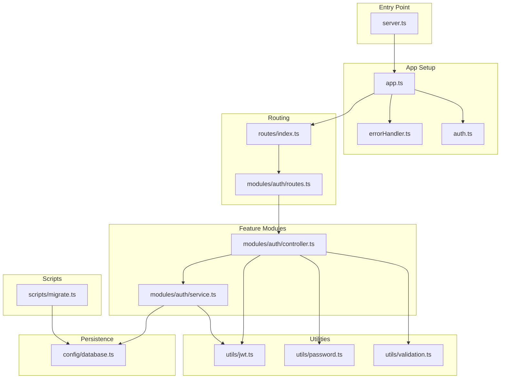
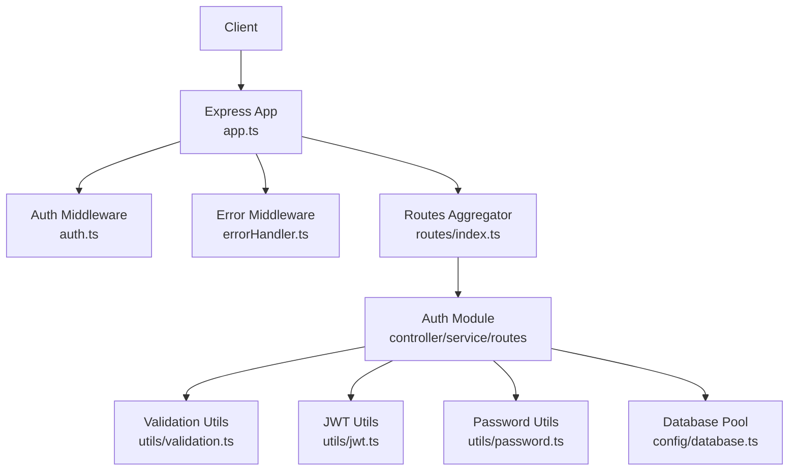
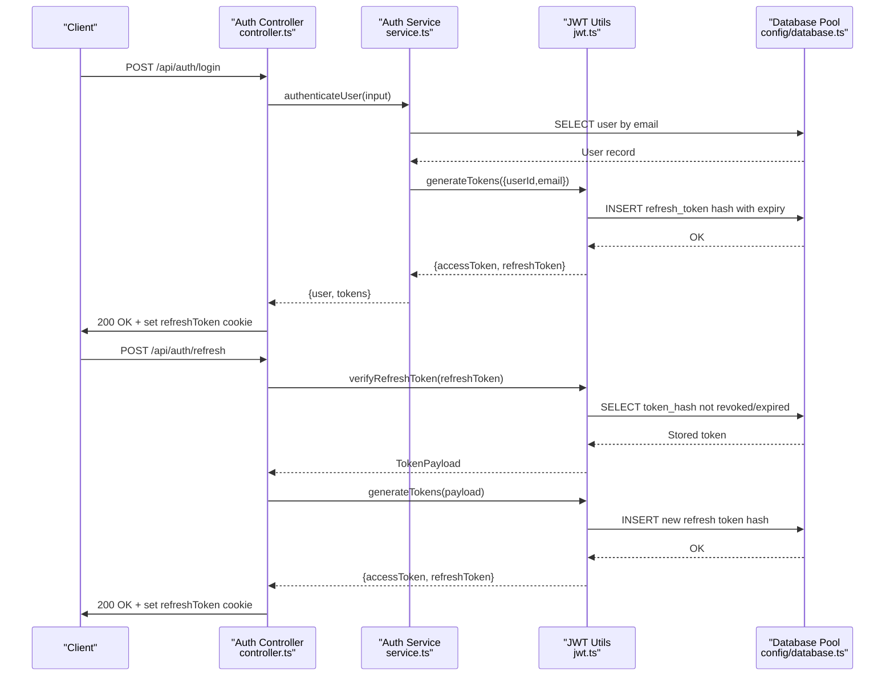
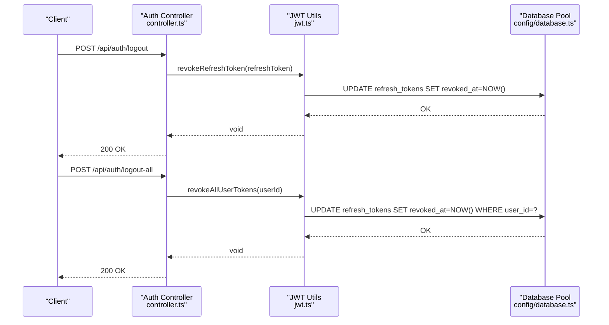
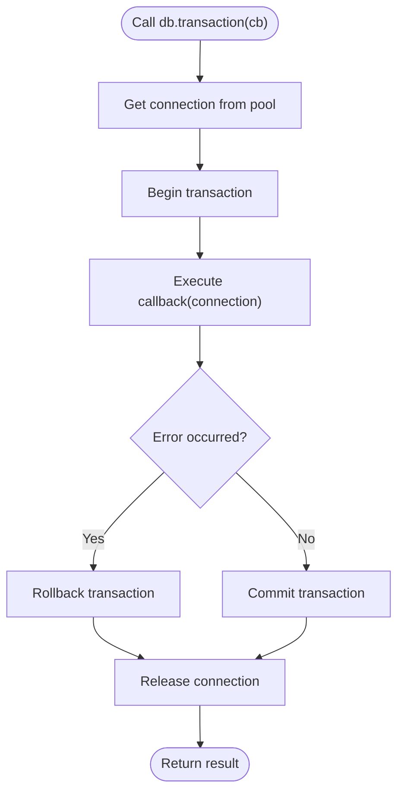
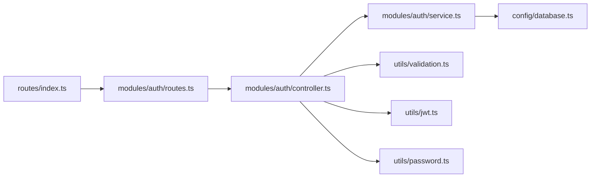
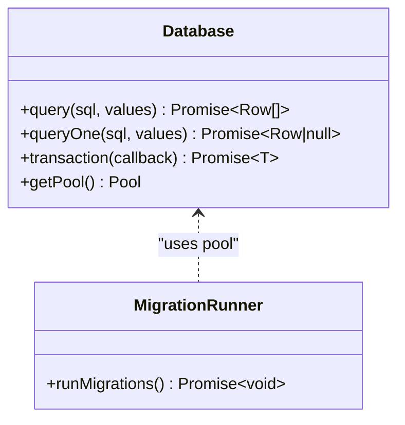
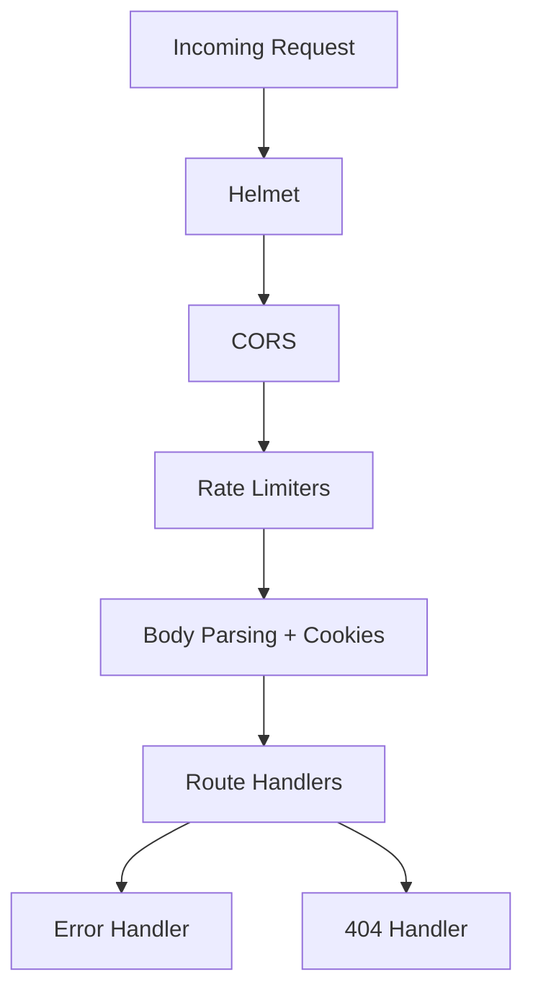
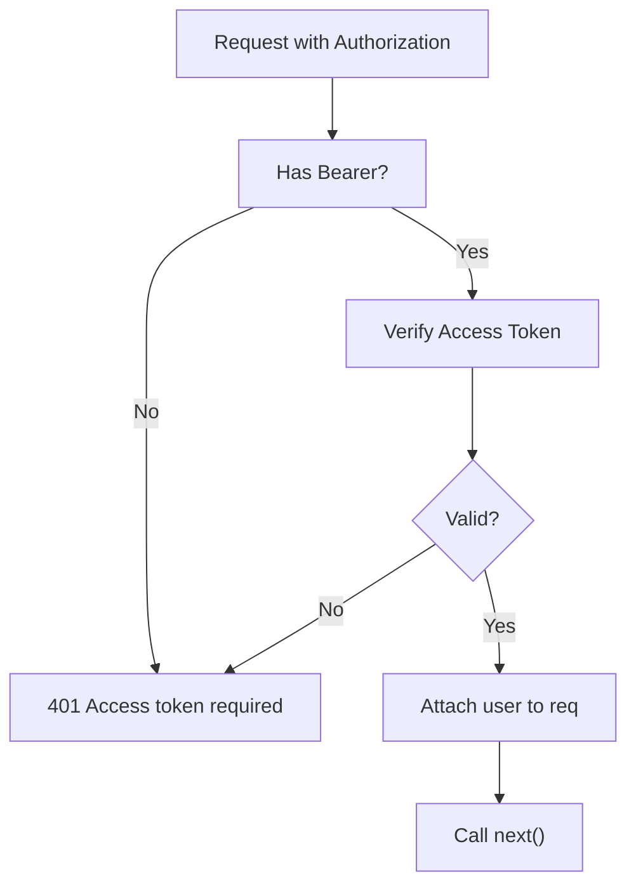
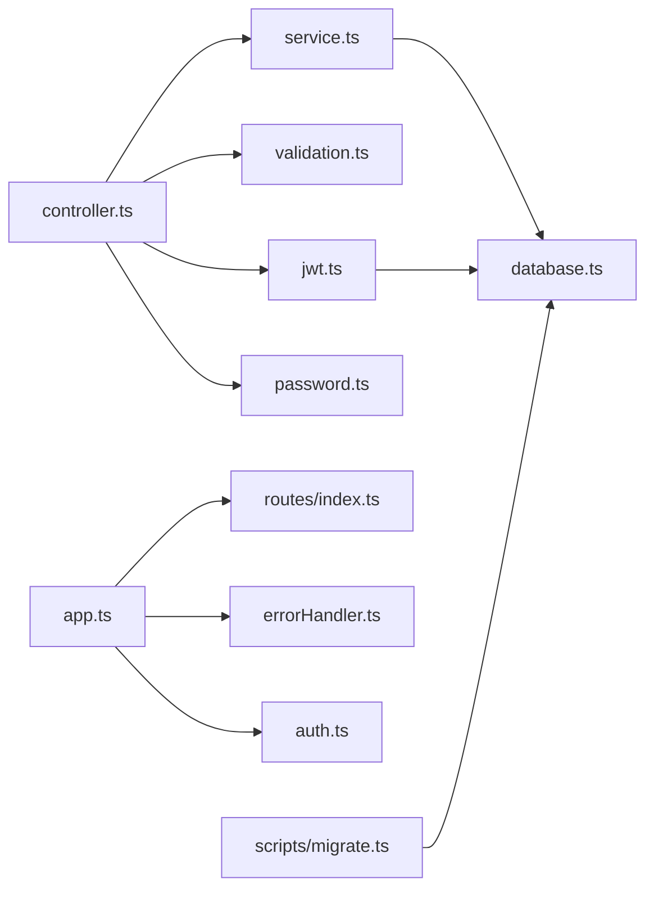

# Backend Architecture

<cite>
**Referenced Files in This Document**
- [server.ts](file://backend/src/server.ts)
- [app.ts](file://backend/src/app.ts)
- [database.ts](file://backend/src/config/database.ts)
- [auth.ts](file://backend/src/middleware/auth.ts)
- [errorHandler.ts](file://backend/src/middleware/errorHandler.ts)
- [index.ts](file://backend/src/routes/index.ts)
- [routes.ts](file://backend/src/modules/auth/routes.ts)
- [controller.ts](file://backend/src/modules/auth/controller.ts)
- [service.ts](file://backend/src/modules/auth/service.ts)
- [jwt.ts](file://backend/src/utils/jwt.ts)
- [password.ts](file://backend/src/utils/password.ts)
- [validation.ts](file://backend/src/utils/validation.ts)
- [migrate.ts](file://backend/src/scripts/migrate.ts)
- [package.json](file://backend/package.json)
- [tsconfig.json](file://backend/tsconfig.json)
</cite>

## Table of Contents
1. [Introduction](#introduction)
2. [Project Structure](#project-structure)
3. [Core Components](#core-components)
4. [Architecture Overview](#architecture-overview)
5. [Detailed Component Analysis](#detailed-component-analysis)
6. [Dependency Analysis](#dependency-analysis)
7. [Performance Considerations](#performance-considerations)
8. [Troubleshooting Guide](#troubleshooting-guide)
9. [Conclusion](#conclusion)
10. [Appendices](#appendices)

## Introduction
This document describes the backend architecture of the Express.js server for the Learning Management System. It explains the modular MVC-like structure separating controllers, services, and database layers; middleware for authentication, error handling, and request processing; route organization; and the database connection and migration system. It also covers security middleware, error handling strategies, API endpoint organization, dependency injection patterns, service abstractions, and inter-module interactions.

## Project Structure
The backend follows a layered, feature-based organization:
- Entry point initializes environment and starts the server.
- Application setup configures middleware, body parsing, CORS, rate limiting, and routes.
- Routes delegate to feature-specific route modules.
- Each feature module contains controller, service, and route files.
- Shared utilities include JWT, password hashing, and validation.
- Database configuration provides a MySQL connection pool and transaction helper.
- Scripts manage migrations and seeding.

**Diagram sources**
- [server.ts:1-32](file://backend/src/server.ts#L1-L32)
- [app.ts:1-54](file://backend/src/app.ts#L1-L54)
- [index.ts:1-25](file://backend/src/routes/index.ts#L1-L25)
- [routes.ts:1-15](file://backend/src/modules/auth/routes.ts#L1-L15)
- [controller.ts:1-99](file://backend/src/modules/auth/controller.ts#L1-L99)
- [service.ts:1-108](file://backend/src/modules/auth/service.ts#L1-L108)
- [jwt.ts:1-78](file://backend/src/utils/jwt.ts#L1-L78)
- [password.ts:1-12](file://backend/src/utils/password.ts#L1-L12)
- [validation.ts:1-31](file://backend/src/utils/validation.ts#L1-L31)
- [database.ts:1-53](file://backend/src/config/database.ts#L1-L53)
- [migrate.ts:1-40](file://backend/src/scripts/migrate.ts#L1-L40)

**Section sources**
- [server.ts:1-32](file://backend/src/server.ts#L1-L32)
- [app.ts:1-54](file://backend/src/app.ts#L1-L54)
- [index.ts:1-25](file://backend/src/routes/index.ts#L1-L25)
- [tsconfig.json:1-33](file://backend/tsconfig.json#L1-L33)
- [package.json:1-44](file://backend/package.json#L1-L44)

## Core Components
- Server bootstrap: Loads environment variables and starts the HTTP server with graceful error handling for uncaught exceptions and unhandled rejections.
- Application setup: Configures Helmet for security headers, CORS with credentials, rate limits (general and auth-specific), JSON/URL-encoded body parsing, cookies, and registers routes and error handlers.
- Middleware:
  - Authentication middleware validates bearer tokens and attaches user info to the request or allows optional auth.
  - Error middleware standardizes error responses and exposes an async wrapper to safely wrap async route handlers.
- Routing: Central route aggregator mounts feature routes and health checks.
- Feature modules: Each module encapsulates controller actions, service logic, and routes.
- Utilities: JWT token generation/verification/revoke, password hashing, and Zod-based input validation.
- Persistence: MySQL connection pool abstraction with helpers for queries, single-row queries, transactions, and a pool accessor.
- Scripts: Migration runner reads SQL files and executes statements sequentially.

**Section sources**
- [server.ts:1-32](file://backend/src/server.ts#L1-L32)
- [app.ts:1-54](file://backend/src/app.ts#L1-L54)
- [auth.ts:1-42](file://backend/src/middleware/auth.ts#L1-L42)
- [errorHandler.ts:1-38](file://backend/src/middleware/errorHandler.ts#L1-L38)
- [index.ts:1-25](file://backend/src/routes/index.ts#L1-L25)
- [jwt.ts:1-78](file://backend/src/utils/jwt.ts#L1-L78)
- [password.ts:1-12](file://backend/src/utils/password.ts#L1-L12)
- [validation.ts:1-31](file://backend/src/utils/validation.ts#L1-L31)
- [database.ts:1-53](file://backend/src/config/database.ts#L1-L53)
- [migrate.ts:1-40](file://backend/src/scripts/migrate.ts#L1-L40)

## Architecture Overview
The system adheres to a clean separation of concerns:
- Controllers: Thin HTTP handlers that parse inputs, apply async wrappers, and orchestrate service calls. They set cookies for refresh tokens and return standardized JSON responses.
- Services: Business logic layer performing validations, database operations, token generation/revoke, and user data retrieval. Services depend on the database abstraction and utilities.
- Database: Centralized pool with transaction helper to ensure ACID semantics for multi-statement operations.
- Middleware: Authentication and error handling applied globally and per-route as needed.
- Routes: Feature-based grouping delegating to controllers.

**Diagram sources**
- [app.ts:1-54](file://backend/src/app.ts#L1-L54)
- [auth.ts:1-42](file://backend/src/middleware/auth.ts#L1-L42)
- [errorHandler.ts:1-38](file://backend/src/middleware/errorHandler.ts#L1-L38)
- [index.ts:1-25](file://backend/src/routes/index.ts#L1-L25)
- [controller.ts:1-99](file://backend/src/modules/auth/controller.ts#L1-L99)
- [service.ts:1-108](file://backend/src/modules/auth/service.ts#L1-L108)
- [jwt.ts:1-78](file://backend/src/utils/jwt.ts#L1-L78)
- [password.ts:1-12](file://backend/src/utils/password.ts#L1-L12)
- [validation.ts:1-31](file://backend/src/utils/validation.ts#L1-L31)
- [database.ts:1-53](file://backend/src/config/database.ts#L1-L53)

## Detailed Component Analysis

### Authentication Flow
This sequence illustrates login, token issuance, and refresh cycles with persistence of hashed refresh tokens.

**Diagram sources**
- [controller.ts:18-70](file://backend/src/modules/auth/controller.ts#L18-L70)
- [service.ts:50-81](file://backend/src/modules/auth/service.ts#L50-L81)
- [jwt.ts:20-62](file://backend/src/utils/jwt.ts#L20-L62)
- [database.ts:19-50](file://backend/src/config/database.ts#L19-L50)

**Section sources**
- [controller.ts:18-70](file://backend/src/modules/auth/controller.ts#L18-L70)
- [service.ts:50-81](file://backend/src/modules/auth/service.ts#L50-L81)
- [jwt.ts:20-62](file://backend/src/utils/jwt.ts#L20-L62)

### Logout and Logout-All Flows
- Logout removes the current refresh token from the allowlist.
- Logout-all revokes all refresh tokens for the user.

**Diagram sources**
- [controller.ts:37-98](file://backend/src/modules/auth/controller.ts#L37-L98)
- [jwt.ts:64-77](file://backend/src/utils/jwt.ts#L64-L77)
- [database.ts:19-50](file://backend/src/config/database.ts#L19-L50)

**Section sources**
- [controller.ts:37-98](file://backend/src/modules/auth/controller.ts#L37-L98)
- [jwt.ts:64-77](file://backend/src/utils/jwt.ts#L64-L77)

### Transaction Handling Pattern
The database abstraction supports explicit transactions via a helper that:
- Acquires a connection from the pool.
- Starts a transaction.
- Executes a callback with the connection.
- Commits on success or rolls back on error.
- Releases the connection back to the pool.

**Diagram sources**
- [database.ts:31-45](file://backend/src/config/database.ts#L31-L45)

**Section sources**
- [database.ts:31-45](file://backend/src/config/database.ts#L31-L45)

### Route Organization and Controller Responsibilities
- Central routes aggregator mounts feature routes and exposes a health check endpoint.
- Auth routes define endpoints for registration, login, logout, refresh, profile, and logout-all.
- Controllers:
  - Apply Zod validation.
  - Use async error wrapper to forward errors to the global error handler.
  - Manage cookies for refresh tokens.
  - Delegate business logic to services.

**Diagram sources**
- [index.ts:1-25](file://backend/src/routes/index.ts#L1-L25)
- [routes.ts:1-15](file://backend/src/modules/auth/routes.ts#L1-L15)
- [controller.ts:1-99](file://backend/src/modules/auth/controller.ts#L1-L99)
- [service.ts:1-108](file://backend/src/modules/auth/service.ts#L1-L108)
- [validation.ts:1-31](file://backend/src/utils/validation.ts#L1-L31)
- [jwt.ts:1-78](file://backend/src/utils/jwt.ts#L1-L78)
- [password.ts:1-12](file://backend/src/utils/password.ts#L1-L12)
- [database.ts:1-53](file://backend/src/config/database.ts#L1-L53)

**Section sources**
- [index.ts:1-25](file://backend/src/routes/index.ts#L1-L25)
- [routes.ts:1-15](file://backend/src/modules/auth/routes.ts#L1-L15)
- [controller.ts:1-99](file://backend/src/modules/auth/controller.ts#L1-L99)
- [service.ts:1-108](file://backend/src/modules/auth/service.ts#L1-L108)

### Database Layer Patterns
- Connection pooling with configurable limits and keep-alive.
- Helper methods for generic queries and single-row fetches.
- Transaction helper ensures atomicity and resource cleanup.
- Migration script reads SQL files and executes statements sequentially.

**Diagram sources**
- [database.ts:19-50](file://backend/src/config/database.ts#L19-L50)
- [migrate.ts:5-37](file://backend/src/scripts/migrate.ts#L5-L37)

**Section sources**
- [database.ts:1-53](file://backend/src/config/database.ts#L1-L53)
- [migrate.ts:1-40](file://backend/src/scripts/migrate.ts#L1-L40)

### Security Middleware and Request Processing
- Helmet sets security headers.
- CORS configured for credentials and allowed methods/headers.
- Rate limiting:
  - General limiter applies to most routes.
  - Auth-specific limiter restricts login/register attempts.
- Body parsing and cookies enabled.
- Global error and not-found handlers registered after routes.

**Diagram sources**
- [app.ts:11-51](file://backend/src/app.ts#L11-L51)

**Section sources**
- [app.ts:11-51](file://backend/src/app.ts#L11-L51)

### Authentication Middleware Behavior
- Required auth rejects missing or invalid bearer tokens.
- Optional auth attaches user if present; otherwise continues without user context.

**Diagram sources**
- [auth.ts:8-24](file://backend/src/middleware/auth.ts#L8-L24)

**Section sources**
- [auth.ts:1-42](file://backend/src/middleware/auth.ts#L1-L42)

## Dependency Analysis
- Controllers depend on services, validation utilities, JWT utilities, and error handling wrapper.
- Services depend on the database abstraction and JWT/password utilities.
- JWT utilities depend on the database abstraction for refresh token persistence.
- Routes depend on controllers.
- App depends on routes, middleware, and error handlers.
- Scripts depend on the database pool.

**Diagram sources**
- [controller.ts:1-99](file://backend/src/modules/auth/controller.ts#L1-L99)
- [service.ts:1-108](file://backend/src/modules/auth/service.ts#L1-L108)
- [jwt.ts:1-78](file://backend/src/utils/jwt.ts#L1-L78)
- [password.ts:1-12](file://backend/src/utils/password.ts#L1-L12)
- [validation.ts:1-31](file://backend/src/utils/validation.ts#L1-L31)
- [database.ts:1-53](file://backend/src/config/database.ts#L1-L53)
- [app.ts:1-54](file://backend/src/app.ts#L1-L54)
- [index.ts:1-25](file://backend/src/routes/index.ts#L1-L25)
- [errorHandler.ts:1-38](file://backend/src/middleware/errorHandler.ts#L1-L38)
- [auth.ts:1-42](file://backend/src/middleware/auth.ts#L1-L42)
- [migrate.ts:1-40](file://backend/src/scripts/migrate.ts#L1-L40)

**Section sources**
- [controller.ts:1-99](file://backend/src/modules/auth/controller.ts#L1-L99)
- [service.ts:1-108](file://backend/src/modules/auth/service.ts#L1-L108)
- [jwt.ts:1-78](file://backend/src/utils/jwt.ts#L1-L78)
- [password.ts:1-12](file://backend/src/utils/password.ts#L1-L12)
- [validation.ts:1-31](file://backend/src/utils/validation.ts#L1-L31)
- [database.ts:1-53](file://backend/src/config/database.ts#L1-L53)
- [app.ts:1-54](file://backend/src/app.ts#L1-L54)
- [index.ts:1-25](file://backend/src/routes/index.ts#L1-L25)
- [errorHandler.ts:1-38](file://backend/src/middleware/errorHandler.ts#L1-L38)
- [auth.ts:1-42](file://backend/src/middleware/auth.ts#L1-L42)
- [migrate.ts:1-40](file://backend/src/scripts/migrate.ts#L1-L40)

## Performance Considerations
- Connection pooling reduces overhead and controls concurrency; tune limits and queue behavior based on workload.
- Transaction helper centralizes commit/rollback and connection release to prevent leaks.
- Rate limiting protects endpoints from abuse while allowing normal traffic.
- Body size limits prevent excessive memory usage on large payloads.
- Asynchronous error handling avoids unhandled promise rejections and keeps the event loop responsive.

[No sources needed since this section provides general guidance]

## Troubleshooting Guide
- Uncaught exceptions and unhandled rejections are logged and cause process exit to prevent inconsistent states.
- Error middleware standardizes responses with status codes and error codes; in development, stack traces are included.
- Not-found handler responds consistently for unknown routes.
- Async wrapper ensures async route handlers propagate errors to the error middleware.

**Section sources**
- [server.ts:22-31](file://backend/src/server.ts#L22-L31)
- [errorHandler.ts:8-31](file://backend/src/middleware/errorHandler.ts#L8-L31)

## Conclusion
The backend employs a clean, modular architecture with clear separation between controllers, services, and persistence. Security middleware, robust error handling, and structured routing provide a solid foundation. The database abstraction supports safe transactions, and the migration system automates schema evolution. Together, these patterns promote maintainability, testability, and scalability.

[No sources needed since this section summarizes without analyzing specific files]

## Appendices

### API Endpoint Organization
- Health check: GET /api/health
- Auth endpoints:
  - POST /api/auth/register
  - POST /api/auth/login
  - POST /api/auth/logout
  - POST /api/auth/refresh
  - GET /api/auth/me
  - POST /api/auth/logout-all

**Section sources**
- [index.ts:12-22](file://backend/src/routes/index.ts#L12-L22)
- [routes.ts:7-12](file://backend/src/modules/auth/routes.ts#L7-L12)

### Environment and Build Notes
- Scripts include dev, build, start, migrate, seed, lint, and typecheck.
- TypeScript configuration enables path aliases and strict mode.

**Section sources**
- [package.json:6-13](file://backend/package.json#L6-L13)
- [tsconfig.json:22-28](file://backend/tsconfig.json#L22-L28)