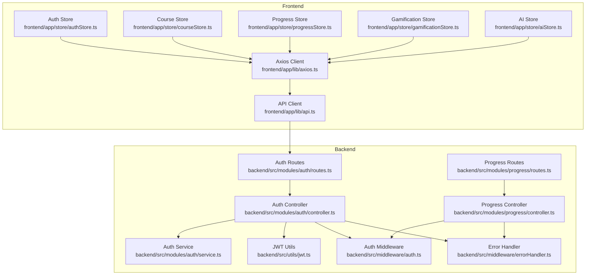
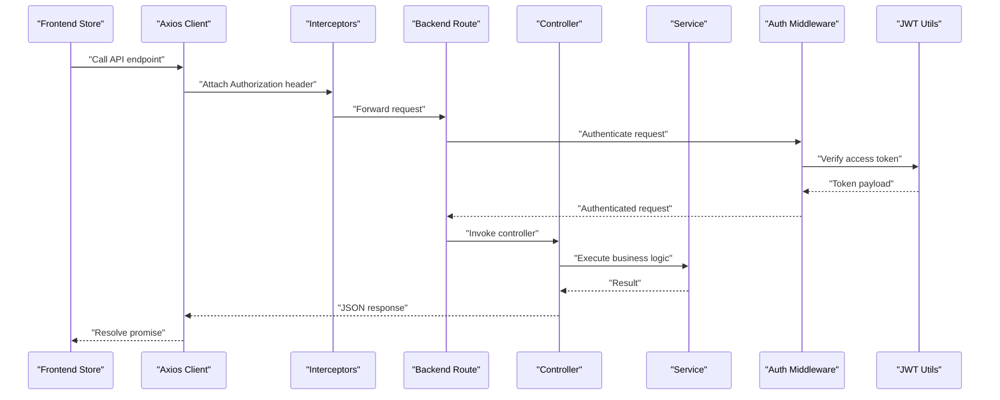
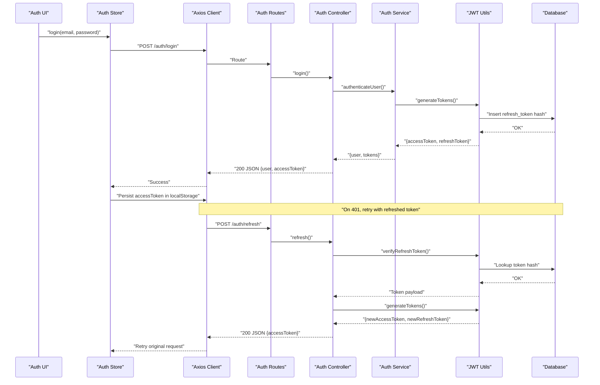
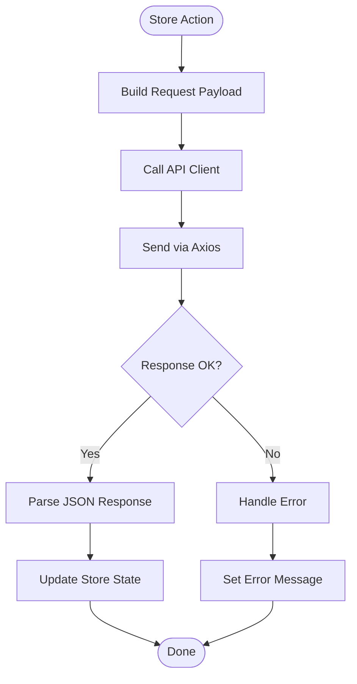
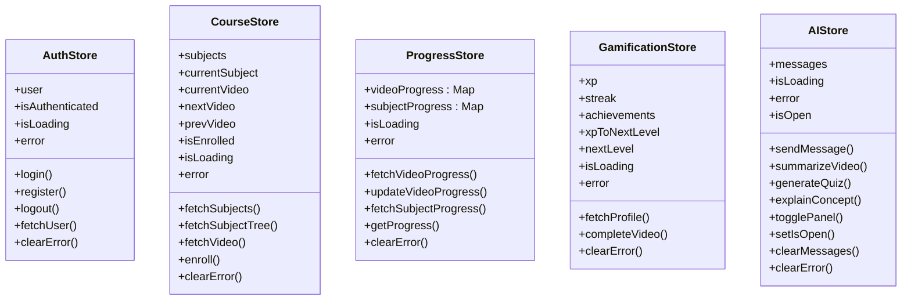
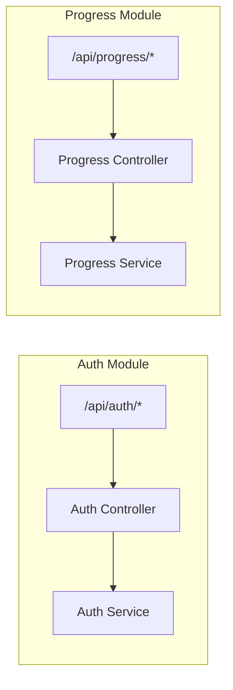
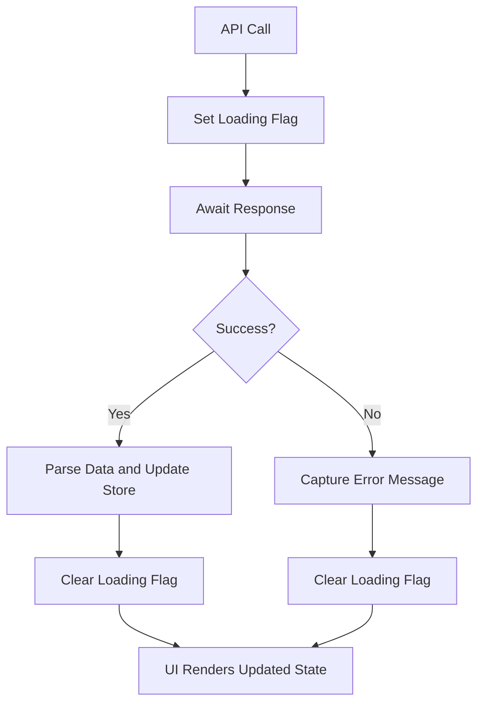
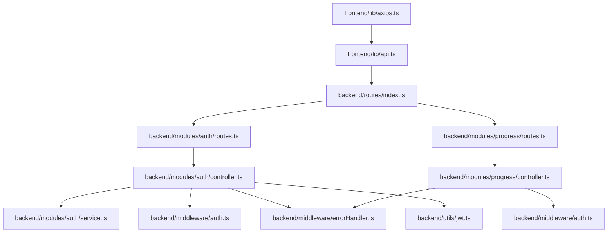

# Data Flow and Communication

<cite>
**Referenced Files in This Document**
- [axios.ts](file://frontend/app/lib/axios.ts)
- [api.ts](file://frontend/app/lib/api.ts)
- [authStore.ts](file://frontend/app/store/authStore.ts)
- [courseStore.ts](file://frontend/app/store/courseStore.ts)
- [progressStore.ts](file://frontend/app/store/progressStore.ts)
- [gamificationStore.ts](file://frontend/app/store/gamificationStore.ts)
- [aiStore.ts](file://frontend/app/store/aiStore.ts)
- [auth.ts](file://backend/src/middleware/auth.ts)
- [errorHandler.ts](file://backend/src/middleware/errorHandler.ts)
- [jwt.ts](file://backend/src/utils/jwt.ts)
- [controller.ts](file://backend/src/modules/auth/controller.ts)
- [routes.ts](file://backend/src/modules/auth/routes.ts)
- [service.ts](file://backend/src/modules/auth/service.ts)
- [progressController.ts](file://backend/src/modules/progress/controller.ts)
- [progressRoutes.ts](file://backend/src/modules/progress/routes.ts)
</cite>

## Table of Contents
1. [Introduction](#introduction)
2. [Project Structure](#project-structure)
3. [Core Components](#core-components)
4. [Architecture Overview](#architecture-overview)
5. [Detailed Component Analysis](#detailed-component-analysis)
6. [Dependency Analysis](#dependency-analysis)
7. [Performance Considerations](#performance-considerations)
8. [Troubleshooting Guide](#troubleshooting-guide)
9. [Conclusion](#conclusion)

## Introduction
This document explains the end-to-end data flow and communication mechanisms between the frontend and backend of the learning system. It covers API contracts, request/response patterns, state synchronization via stores, authentication and token lifecycle, error handling, loading state management, RESTful design, and asynchronous data processing. Real-time communication and caching strategies are discussed conceptually, along with optimistic updates and conflict resolution approaches suitable for this application.

## Project Structure
The application follows a clear separation of concerns:
- Frontend: Next.js app with API clients, interceptors, and Zustand stores for state management.
- Backend: Express-based REST API with modular routes, controllers, services, JWT utilities, and middleware for authentication and error handling.

**Diagram sources**
- [axios.ts:1-61](file://frontend/app/lib/axios.ts#L1-L61)
- [api.ts:1-80](file://frontend/app/lib/api.ts#L1-L80)
- [authStore.ts:1-98](file://frontend/app/store/authStore.ts#L1-L98)
- [courseStore.ts:1-121](file://frontend/app/store/courseStore.ts#L1-L121)
- [progressStore.ts:1-87](file://frontend/app/store/progressStore.ts#L1-L87)
- [gamificationStore.ts:1-86](file://frontend/app/store/gamificationStore.ts#L1-L86)
- [aiStore.ts:1-129](file://frontend/app/store/aiStore.ts#L1-L129)
- [auth.ts:1-42](file://backend/src/middleware/auth.ts#L1-L42)
- [errorHandler.ts:1-38](file://backend/src/middleware/errorHandler.ts#L1-L38)
- [jwt.ts:1-78](file://backend/src/utils/jwt.ts#L1-L78)
- [routes.ts:1-15](file://backend/src/modules/auth/routes.ts#L1-L15)
- [controller.ts:1-99](file://backend/src/modules/auth/controller.ts#L1-L99)
- [service.ts:1-108](file://backend/src/modules/auth/service.ts#L1-L108)
- [progressRoutes.ts:1-18](file://backend/src/modules/progress/routes.ts#L1-L18)
- [progressController.ts:1-66](file://backend/src/modules/progress/controller.ts#L1-L66)

**Section sources**
- [axios.ts:1-61](file://frontend/app/lib/axios.ts#L1-L61)
- [api.ts:1-80](file://frontend/app/lib/api.ts#L1-L80)
- [authStore.ts:1-98](file://frontend/app/store/authStore.ts#L1-L98)
- [courseStore.ts:1-121](file://frontend/app/store/courseStore.ts#L1-L121)
- [progressStore.ts:1-87](file://frontend/app/store/progressStore.ts#L1-L87)
- [gamificationStore.ts:1-86](file://frontend/app/store/gamificationStore.ts#L1-L86)
- [aiStore.ts:1-129](file://frontend/app/store/aiStore.ts#L1-L129)
- [auth.ts:1-42](file://backend/src/middleware/auth.ts#L1-L42)
- [errorHandler.ts:1-38](file://backend/src/middleware/errorHandler.ts#L1-L38)
- [jwt.ts:1-78](file://backend/src/utils/jwt.ts#L1-L78)
- [routes.ts:1-15](file://backend/src/modules/auth/routes.ts#L1-L15)
- [controller.ts:1-99](file://backend/src/modules/auth/controller.ts#L1-L99)
- [service.ts:1-108](file://backend/src/modules/auth/service.ts#L1-L108)
- [progressRoutes.ts:1-18](file://backend/src/modules/progress/routes.ts#L1-L18)
- [progressController.ts:1-66](file://backend/src/modules/progress/controller.ts#L1-L66)

## Core Components
- Axios client with base URL and credentials enables cross-origin requests and cookies.
- API client wraps endpoints per domain (auth, subjects, videos, progress, gamification, AI).
- Frontend stores manage loading, errors, and normalized state for each domain.
- Backend middleware enforces authentication and optional auth, while JWT utilities sign and verify tokens.
- Controllers orchestrate service calls, apply validation, and respond with JSON.
- Error handler centralizes error responses and async wrapper for route handlers.

Key implementation references:
- Axios client and interceptors: [axios.ts:1-61](file://frontend/app/lib/axios.ts#L1-L61)
- API client contracts: [api.ts:1-80](file://frontend/app/lib/api.ts#L1-L80)
- Auth store actions and state: [authStore.ts:1-98](file://frontend/app/store/authStore.ts#L1-L98)
- Course store actions and state: [courseStore.ts:1-121](file://frontend/app/store/courseStore.ts#L1-L121)
- Progress store actions and state: [progressStore.ts:1-87](file://frontend/app/store/progressStore.ts#L1-L87)
- Gamification store actions and state: [gamificationStore.ts:1-86](file://frontend/app/store/gamificationStore.ts#L1-L86)
- AI store actions and state: [aiStore.ts:1-129](file://frontend/app/store/aiStore.ts#L1-L129)
- Authentication middleware: [auth.ts:1-42](file://backend/src/middleware/auth.ts#L1-L42)
- JWT utilities: [jwt.ts:1-78](file://backend/src/utils/jwt.ts#L1-L78)
- Auth routes and controller: [routes.ts:1-15](file://backend/src/modules/auth/routes.ts#L1-L15), [controller.ts:1-99](file://backend/src/modules/auth/controller.ts#L1-L99)
- Progress routes and controller: [progressRoutes.ts:1-18](file://backend/src/modules/progress/routes.ts#L1-L18), [progressController.ts:1-66](file://backend/src/modules/progress/controller.ts#L1-L66)
- Error handling middleware: [errorHandler.ts:1-38](file://backend/src/middleware/errorHandler.ts#L1-L38)

**Section sources**
- [axios.ts:1-61](file://frontend/app/lib/axios.ts#L1-L61)
- [api.ts:1-80](file://frontend/app/lib/api.ts#L1-L80)
- [authStore.ts:1-98](file://frontend/app/store/authStore.ts#L1-L98)
- [courseStore.ts:1-121](file://frontend/app/store/courseStore.ts#L1-L121)
- [progressStore.ts:1-87](file://frontend/app/store/progressStore.ts#L1-L87)
- [gamificationStore.ts:1-86](file://frontend/app/store/gamificationStore.ts#L1-L86)
- [aiStore.ts:1-129](file://frontend/app/store/aiStore.ts#L1-L129)
- [auth.ts:1-42](file://backend/src/middleware/auth.ts#L1-L42)
- [jwt.ts:1-78](file://backend/src/utils/jwt.ts#L1-L78)
- [routes.ts:1-15](file://backend/src/modules/auth/routes.ts#L1-L15)
- [controller.ts:1-99](file://backend/src/modules/auth/controller.ts#L1-L99)
- [progressRoutes.ts:1-18](file://backend/src/modules/progress/routes.ts#L1-L18)
- [progressController.ts:1-66](file://backend/src/modules/progress/controller.ts#L1-L66)
- [errorHandler.ts:1-38](file://backend/src/middleware/errorHandler.ts#L1-L38)

## Architecture Overview
The frontend communicates with the backend through a typed API client built on Axios. Requests automatically include Authorization headers when present and handle token refresh on 401 responses. The backend enforces authentication via middleware and validates requests using schemas. Responses are standardized JSON with consistent error payloads.

**Diagram sources**
- [axios.ts:1-61](file://frontend/app/lib/axios.ts#L1-L61)
- [auth.ts:1-42](file://backend/src/middleware/auth.ts#L1-L42)
- [jwt.ts:1-78](file://backend/src/utils/jwt.ts#L1-L78)
- [controller.ts:1-99](file://backend/src/modules/auth/controller.ts#L1-L99)

## Detailed Component Analysis

### Authentication Flow and Token Management
- Frontend:
  - Stores access token in localStorage and attaches Authorization header to all requests.
  - On 401, attempts refresh via POST /auth/refresh and retries the original request.
  - Clears token and redirects to login on refresh failure.
- Backend:
  - Access tokens are validated by middleware; refresh tokens are verified against hashed tokens stored in the database.
  - Login sets an HTTP-only refresh cookie and returns an access token.
  - Logout revokes the refresh token; logout-all revokes all tokens for the user.

**Diagram sources**
- [authStore.ts:1-98](file://frontend/app/store/authStore.ts#L1-L98)
- [axios.ts:1-61](file://frontend/app/lib/axios.ts#L1-L61)
- [routes.ts:1-15](file://backend/src/modules/auth/routes.ts#L1-L15)
- [controller.ts:1-99](file://backend/src/modules/auth/controller.ts#L1-L99)
- [service.ts:1-108](file://backend/src/modules/auth/service.ts#L1-L108)
- [jwt.ts:1-78](file://backend/src/utils/jwt.ts#L1-L78)

**Section sources**
- [authStore.ts:1-98](file://frontend/app/store/authStore.ts#L1-L98)
- [axios.ts:1-61](file://frontend/app/lib/axios.ts#L1-L61)
- [controller.ts:1-99](file://backend/src/modules/auth/controller.ts#L1-L99)
- [service.ts:1-108](file://backend/src/modules/auth/service.ts#L1-L108)
- [jwt.ts:1-78](file://backend/src/utils/jwt.ts#L1-L78)
- [auth.ts:1-42](file://backend/src/middleware/auth.ts#L1-L42)

### API Contracts and Request/Response Patterns
- Base URL: /api with JSON content type and credentials enabled.
- Interceptors:
  - Request: Adds Authorization: Bearer <access-token> if present.
  - Response: Handles 401 by refreshing token and retrying; otherwise rejects.
- API client exposes typed endpoints grouped by domain:
  - Auth: register, login, logout, refresh, me.
  - Subjects: list, tree, enroll, enrolled.
  - Videos: by-id, lock-status.
  - Progress: per-video, per-subject, all.
  - Gamification: profile, achievements, earn XP, complete video.
  - AI: chat, summarize, quiz, explain.

**Diagram sources**
- [api.ts:1-80](file://frontend/app/lib/api.ts#L1-L80)
- [axios.ts:1-61](file://frontend/app/lib/axios.ts#L1-L61)
- [authStore.ts:1-98](file://frontend/app/store/authStore.ts#L1-L98)
- [courseStore.ts:1-121](file://frontend/app/store/courseStore.ts#L1-L121)
- [progressStore.ts:1-87](file://frontend/app/store/progressStore.ts#L1-L87)
- [gamificationStore.ts:1-86](file://frontend/app/store/gamificationStore.ts#L1-L86)
- [aiStore.ts:1-129](file://frontend/app/store/aiStore.ts#L1-L129)

**Section sources**
- [axios.ts:1-61](file://frontend/app/lib/axios.ts#L1-L61)
- [api.ts:1-80](file://frontend/app/lib/api.ts#L1-L80)
- [authStore.ts:1-98](file://frontend/app/store/authStore.ts#L1-L98)
- [courseStore.ts:1-121](file://frontend/app/store/courseStore.ts#L1-L121)
- [progressStore.ts:1-87](file://frontend/app/store/progressStore.ts#L1-L87)
- [gamificationStore.ts:1-86](file://frontend/app/store/gamificationStore.ts#L1-L86)
- [aiStore.ts:1-129](file://frontend/app/store/aiStore.ts#L1-L129)

### State Synchronization Strategies
- Stores encapsulate domain state and actions:
  - Loading flags prevent concurrent operations and improve UX.
  - Errors are captured from API responses and surfaced to UI.
  - Local storage persists minimal auth state (access token) for resilience across reloads.
- Progress store uses Map-based state for efficient per-video updates.
- AI store maintains chat history and panel state locally.

**Diagram sources**
- [authStore.ts:1-98](file://frontend/app/store/authStore.ts#L1-L98)
- [courseStore.ts:1-121](file://frontend/app/store/courseStore.ts#L1-L121)
- [progressStore.ts:1-87](file://frontend/app/store/progressStore.ts#L1-L87)
- [gamificationStore.ts:1-86](file://frontend/app/store/gamificationStore.ts#L1-L86)
- [aiStore.ts:1-129](file://frontend/app/store/aiStore.ts#L1-L129)

**Section sources**
- [authStore.ts:1-98](file://frontend/app/store/authStore.ts#L1-L98)
- [courseStore.ts:1-121](file://frontend/app/store/courseStore.ts#L1-L121)
- [progressStore.ts:1-87](file://frontend/app/store/progressStore.ts#L1-L87)
- [gamificationStore.ts:1-86](file://frontend/app/store/gamificationStore.ts#L1-L86)
- [aiStore.ts:1-129](file://frontend/app/store/aiStore.ts#L1-L129)

### RESTful API Design Principles and Endpoint Organization
- Modular routing organizes endpoints by domain:
  - Auth: POST /register, POST /login, POST /logout, POST /refresh, GET /me, POST /logout-all.
  - Progress: GET /videos/:id, POST /videos/:id, GET /subjects/:id, GET /all.
- Controllers enforce authentication and validate payloads before invoking services.
- Consistent JSON responses with { data } or { error, code } and appropriate status codes.

**Diagram sources**
- [routes.ts:1-15](file://backend/src/modules/auth/routes.ts#L1-L15)
- [controller.ts:1-99](file://backend/src/modules/auth/controller.ts#L1-L99)
- [progressRoutes.ts:1-18](file://backend/src/modules/progress/routes.ts#L1-L18)
- [progressController.ts:1-66](file://backend/src/modules/progress/controller.ts#L1-L66)

**Section sources**
- [routes.ts:1-15](file://backend/src/modules/auth/routes.ts#L1-L15)
- [controller.ts:1-99](file://backend/src/modules/auth/controller.ts#L1-L99)
- [progressRoutes.ts:1-18](file://backend/src/modules/progress/routes.ts#L1-L18)
- [progressController.ts:1-66](file://backend/src/modules/progress/controller.ts#L1-L66)

### Data Transformation Patterns
- Frontend stores transform raw API responses into normalized domain models:
  - CourseStore: subjects, sections, videos, next/prev video pointers.
  - ProgressStore: maps videoId to progress records.
  - GamificationStore: XP, streak, achievements, and level metadata.
  - AIStore: chat messages, suggestions, and generated content.
- Backend services encapsulate database queries and return structured payloads for controllers.

**Section sources**
- [courseStore.ts:1-121](file://frontend/app/store/courseStore.ts#L1-L121)
- [progressStore.ts:1-87](file://frontend/app/store/progressStore.ts#L1-L87)
- [gamificationStore.ts:1-86](file://frontend/app/store/gamificationStore.ts#L1-L86)
- [aiStore.ts:1-129](file://frontend/app/store/aiStore.ts#L1-L129)
- [service.ts:1-108](file://backend/src/modules/auth/service.ts#L1-L108)
- [progressController.ts:1-66](file://backend/src/modules/progress/controller.ts#L1-L66)

### Error Handling and Loading States
- Frontend:
  - Stores set isLoading during async operations and capture errors from API responses.
  - Axios interceptors centralize retry logic for token refresh.
- Backend:
  - Error handler responds with consistent error payloads and logs stack traces in development.
  - Async wrapper ensures uncaught exceptions are forwarded to the error handler.

**Diagram sources**
- [axios.ts:1-61](file://frontend/app/lib/axios.ts#L1-L61)
- [authStore.ts:1-98](file://frontend/app/store/authStore.ts#L1-L98)
- [errorHandler.ts:1-38](file://backend/src/middleware/errorHandler.ts#L1-L38)

**Section sources**
- [axios.ts:1-61](file://frontend/app/lib/axios.ts#L1-L61)
- [authStore.ts:1-98](file://frontend/app/store/authStore.ts#L1-L98)
- [errorHandler.ts:1-38](file://backend/src/middleware/errorHandler.ts#L1-L38)

### Real-Time Communication and Asynchronous Processing
- Current implementation relies on REST APIs and does not include WebSocket connections.
- Asynchronous processing occurs in controllers/services; no explicit job queues or message brokers are present.
- Recommendations for future enhancements:
  - Introduce WebSockets for live notifications (e.g., progress milestones, new achievements).
  - Use background jobs for heavy tasks (e.g., generating summaries, analytics) with idempotent updates.

[No sources needed since this section provides general guidance]

### Caching Strategies, Optimistic Updates, and Conflict Resolution
- Frontend caching:
  - Local state caches recent responses; consider adding a lightweight cache layer for repeated reads.
  - Persist essential auth state to localStorage to avoid re-authentication on reloads.
- Optimistic updates:
  - ProgressStore can optimistically update local state upon user actions (e.g., marking video complete) and reconcile with server response.
- Conflict resolution:
  - Implement server-side concurrency checks (e.g., last-modified timestamps) and merge strategies for simultaneous updates.
  - Use idempotency keys for critical write operations to prevent duplicates.

[No sources needed since this section provides general guidance]

## Dependency Analysis
The frontend depends on Axios and the API client, which in turn depend on backend routes. The backend controllers depend on services and middleware, and services depend on JWT utilities and the database.

**Diagram sources**
- [axios.ts:1-61](file://frontend/app/lib/axios.ts#L1-L61)
- [api.ts:1-80](file://frontend/app/lib/api.ts#L1-L80)
- [routes.ts:1-15](file://backend/src/modules/auth/routes.ts#L1-L15)
- [progressRoutes.ts:1-18](file://backend/src/modules/progress/routes.ts#L1-L18)
- [controller.ts:1-99](file://backend/src/modules/auth/controller.ts#L1-L99)
- [progressController.ts:1-66](file://backend/src/modules/progress/controller.ts#L1-L66)
- [auth.ts:1-42](file://backend/src/middleware/auth.ts#L1-L42)
- [errorHandler.ts:1-38](file://backend/src/middleware/errorHandler.ts#L1-L38)
- [jwt.ts:1-78](file://backend/src/utils/jwt.ts#L1-L78)

**Section sources**
- [axios.ts:1-61](file://frontend/app/lib/axios.ts#L1-L61)
- [api.ts:1-80](file://frontend/app/lib/api.ts#L1-L80)
- [routes.ts:1-15](file://backend/src/modules/auth/routes.ts#L1-L15)
- [progressRoutes.ts:1-18](file://backend/src/modules/progress/routes.ts#L1-L18)
- [controller.ts:1-99](file://backend/src/modules/auth/controller.ts#L1-L99)
- [progressController.ts:1-66](file://backend/src/modules/progress/controller.ts#L1-L66)
- [auth.ts:1-42](file://backend/src/middleware/auth.ts#L1-L42)
- [errorHandler.ts:1-38](file://backend/src/middleware/errorHandler.ts#L1-L38)
- [jwt.ts:1-78](file://backend/src/utils/jwt.ts#L1-L78)

## Performance Considerations
- Minimize redundant network calls by leveraging local state and selective updates.
- Batch progress updates where possible to reduce server load.
- Use pagination for large lists (subjects, videos) to limit payload sizes.
- Cache frequently accessed resources (e.g., subject trees) in memory with invalidation on mutations.

[No sources needed since this section provides general guidance]

## Troubleshooting Guide
- 401 Unauthorized:
  - Verify access token presence and validity; ensure refresh flow executes correctly.
  - Confirm cookies are sent with credentials enabled.
- 401 Refresh Failure:
  - Check refresh token validity and revocation status; clear stale tokens and re-authenticate.
- Validation Errors:
  - Inspect request payloads against schemas; ensure required fields are present.
- Database Errors:
  - Review service queries and constraints; confirm proper error propagation to the client.

**Section sources**
- [axios.ts:1-61](file://frontend/app/lib/axios.ts#L1-L61)
- [errorHandler.ts:1-38](file://backend/src/middleware/errorHandler.ts#L1-L38)
- [jwt.ts:1-78](file://backend/src/utils/jwt.ts#L1-L78)
- [controller.ts:1-99](file://backend/src/modules/auth/controller.ts#L1-L99)

## Conclusion
The application implements a clean separation between frontend and backend, with robust authentication, consistent API contracts, and centralized error handling. The frontend stores provide predictable state updates, while the backend enforces security and data integrity. Extending the system with real-time features, caching, and optimistic updates would further enhance responsiveness and user experience.