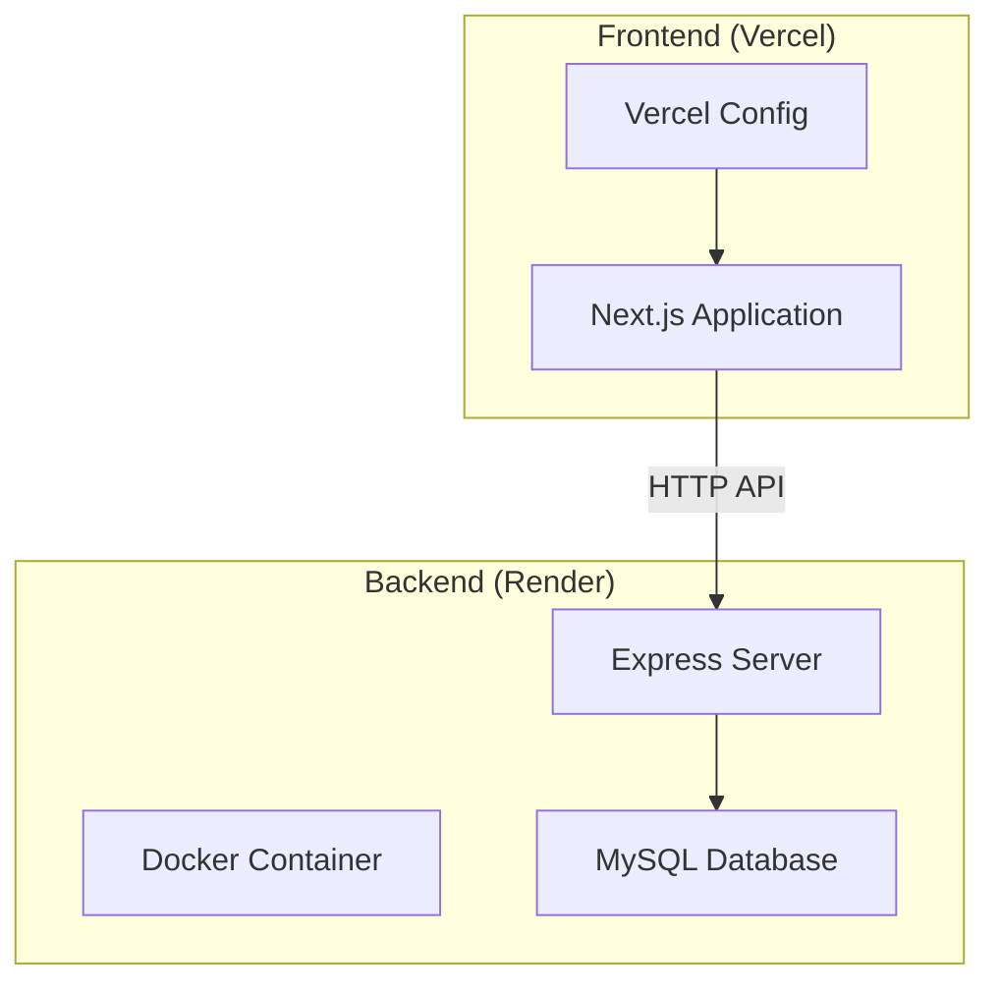
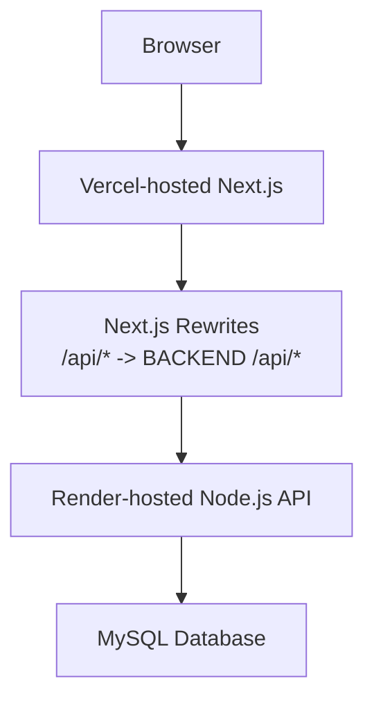
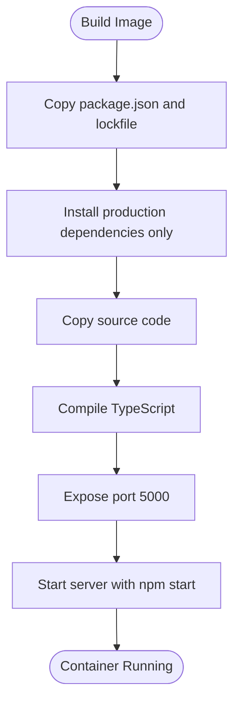
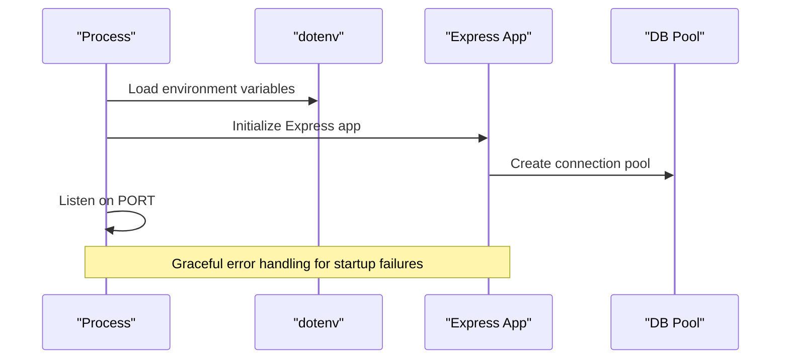
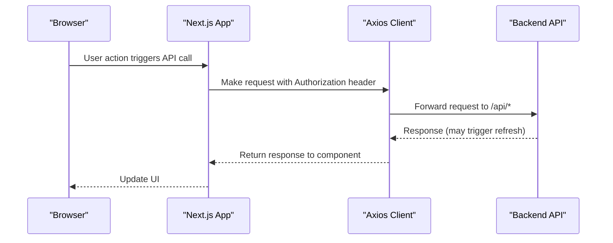
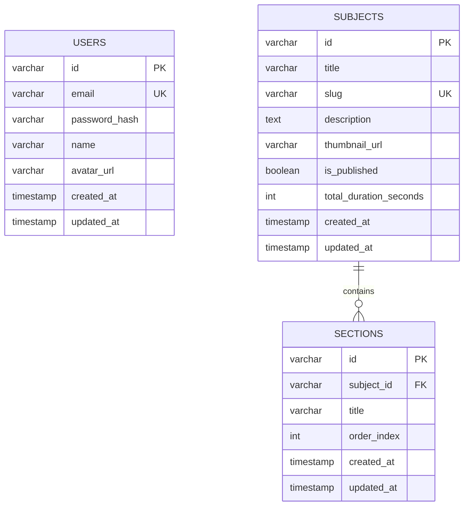
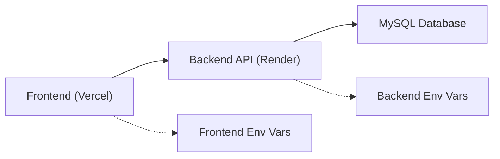
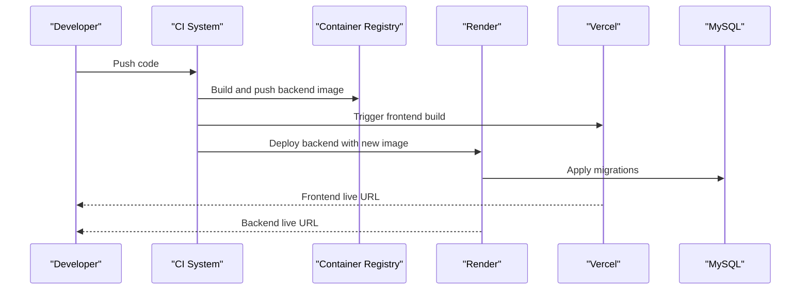

# Deployment Architecture

<cite>
**Referenced Files in This Document**
- [Dockerfile](file://backend/Dockerfile)
- [render.yaml](file://backend/render.yaml)
- [package.json](file://backend/package.json)
- [database.ts](file://backend/src/config/database.ts)
- [server.ts](file://backend/src/server.ts)
- [app.ts](file://backend/src/app.ts)
- [vercel.json](file://frontend/vercel.json)
- [package.json](file://frontend/package.json)
- [next.config.js](file://frontend/next.config.js)
- [axios.ts](file://frontend/app/lib/axios.ts)
- [api.ts](file://frontend/app/lib/api.ts)
- [001_create_users.sql](file://backend/migrations/001_create_users.sql)
- [002_create_subjects.sql](file://backend/migrations/002_create_subjects.sql)
- [003_create_sections.sql](file://backend/migrations/003_create_sections.sql)
</cite>

## Table of Contents
1. [Introduction](#introduction)
2. [Project Structure](#project-structure)
3. [Core Components](#core-components)
4. [Architecture Overview](#architecture-overview)
5. [Detailed Component Analysis](#detailed-component-analysis)
6. [Dependency Analysis](#dependency-analysis)
7. [Performance Considerations](#performance-considerations)
8. [Security Considerations](#security-considerations)
9. [Infrastructure Requirements](#infrastructure-requirements)
10. [Load Balancing and Scaling](#load-balancing-and-scaling)
11. [Monitoring and Observability](#monitoring-and-observability)
12. [CI/CD Pipeline Considerations](#cicd-pipeline-considerations)
13. [Environment Variables Management](#environment-variables-management)
14. [SSL/TLS Configuration](#ssltls-configuration)
15. [Backup Strategies](#backup-strategies)
16. [Deployment Workflow](#deployment-workflow)
17. [Rollback Procedures](#rollback-procedures)
18. [Maintenance Considerations](#maintenance-considerations)
19. [Troubleshooting Guide](#troubleshooting-guide)
20. [Conclusion](#conclusion)

## Introduction
This document provides comprehensive deployment architecture guidance for the full-stack Learning Management System. It covers containerization with Docker, cloud deployment on Render (backend) and Vercel (frontend), CI/CD considerations, environment variable management, scaling, load balancing, monitoring, security, SSL/TLS, backups, and operational procedures including rollbacks and maintenance.

## Project Structure
The system comprises:
- Backend: Node.js/Express API with TypeScript, MySQL database, and migration scripts.
- Frontend: Next.js 14 application using App Router, configured for client-side API routing via rewrites.
- Deployment artifacts: Dockerfile for containerization, Render configuration for backend hosting, and Vercel configuration for frontend hosting.

**Diagram sources**
- [Dockerfile](file://backend/Dockerfile)
- [render.yaml](file://backend/render.yaml)
- [vercel.json](file://frontend/vercel.json)

**Section sources**
- [Dockerfile](file://backend/Dockerfile)
- [render.yaml](file://backend/render.yaml)
- [vercel.json](file://frontend/vercel.json)

## Core Components
- Backend containerization strategy:
  - Base image: Node.js 20 Alpine Linux.
  - Production dependency installation only.
  - TypeScript build and runtime startup via npm scripts.
  - Port exposure and command configuration for production runtime.
- Backend runtime configuration:
  - Environment-driven configuration for database connectivity, JWT secrets, CORS origin, and port.
  - Express server initialization with graceful error handling.
- Frontend deployment configuration:
  - Vercel build configuration using Next.js builder.
  - Environment variable mapping for public API URL.
  - Next.js rewrites to proxy API traffic to the backend.

**Section sources**
- [Dockerfile](file://backend/Dockerfile)
- [render.yaml](file://backend/render.yaml)
- [server.ts](file://backend/src/server.ts)
- [database.ts](file://backend/src/config/database.ts)
- [vercel.json](file://frontend/vercel.json)
- [next.config.js](file://frontend/next.config.js)

## Architecture Overview
The frontend communicates with the backend through a proxied API route. The backend exposes REST endpoints secured with rate limiting and security headers, connects to a MySQL database, and manages environment-specific configuration.

**Diagram sources**
- [next.config.js](file://frontend/next.config.js)
- [axios.ts](file://frontend/app/lib/axios.ts)
- [render.yaml](file://backend/render.yaml)

**Section sources**
- [next.config.js](file://frontend/next.config.js)
- [axios.ts](file://frontend/app/lib/axios.ts)
- [render.yaml](file://backend/render.yaml)

## Detailed Component Analysis

### Backend Containerization Strategy
- Multi-stage considerations:
  - Current single-stage Dockerfile installs production dependencies and runs a production build.
  - Recommendation: Introduce a separate build stage using a Node.js image and a minimal runtime stage to reduce attack surface and image size.
- Environment configuration:
  - Runtime variables managed via Render environment variables (NODE_ENV, PORT, DB_* secrets, JWT secrets, FRONTEND_URL).
- Startup and health:
  - Startup command executes the built server binary.
  - No explicit health checks defined; consider adding liveness/readiness probes.

**Diagram sources**
- [Dockerfile](file://backend/Dockerfile)

**Section sources**
- [Dockerfile](file://backend/Dockerfile)
- [render.yaml](file://backend/render.yaml)

### Backend Runtime Configuration
- Database pool configuration:
  - Host, port, user, password, and database derived from environment variables.
  - Connection pooling with keep-alive enabled.
- Server bootstrap:
  - Loads environment variables, initializes Express app, and starts listening on configured port.
  - Global exception handlers for uncaught errors.
- Security middleware:
  - Helmet for secure headers.
  - CORS configured with origin from environment and credentials support.
  - Rate limiting applied to general routes and authentication endpoints.

**Diagram sources**
- [server.ts](file://backend/src/server.ts)
- [database.ts](file://backend/src/config/database.ts)
- [app.ts](file://backend/src/app.ts)

**Section sources**
- [server.ts](file://backend/src/server.ts)
- [database.ts](file://backend/src/config/database.ts)
- [app.ts](file://backend/src/app.ts)

### Frontend Deployment Configuration
- Vercel configuration:
  - Uses Next.js builder with a single build step.
  - Public environment variable NEXT_PUBLIC_API_URL mapped to a Vercel environment variable placeholder.
- API communication:
  - Axios client configured with base URL derived from NEXT_PUBLIC_API_URL.
  - Credentials enabled for cross-origin cookies.
  - Interceptors handle token injection and automatic refresh flow.

**Diagram sources**
- [vercel.json](file://frontend/vercel.json)
- [axios.ts](file://frontend/app/lib/axios.ts)
- [next.config.js](file://frontend/next.config.js)

**Section sources**
- [vercel.json](file://frontend/vercel.json)
- [axios.ts](file://frontend/app/lib/axios.ts)
- [next.config.js](file://frontend/next.config.js)

### Database Schema and Infrastructure Implications
- Users table supports unique email indexing and timestamps.
- Subjects table includes slug uniqueness, publishing flag, and duration tracking.
- Sections table enforces referential integrity with subjects and ordering index.
- These schemas imply relational data consistency and indexing strategies suitable for typical LMS workloads.

**Diagram sources**
- [001_create_users.sql](file://backend/migrations/001_create_users.sql)
- [002_create_subjects.sql](file://backend/migrations/002_create_subjects.sql)
- [003_create_sections.sql](file://backend/migrations/003_create_sections.sql)

**Section sources**
- [001_create_users.sql](file://backend/migrations/001_create_users.sql)
- [002_create_subjects.sql](file://backend/migrations/002_create_subjects.sql)
- [003_create_sections.sql](file://backend/migrations/003_create_sections.sql)

## Dependency Analysis
- Frontend depends on backend APIs via rewrites and environment-driven base URLs.
- Backend depends on MySQL for persistence and environment variables for configuration.
- Render and Vercel manage deployment lifecycles and environment variable injection.

**Diagram sources**
- [next.config.js](file://frontend/next.config.js)
- [axios.ts](file://frontend/app/lib/axios.ts)
- [render.yaml](file://backend/render.yaml)

**Section sources**
- [next.config.js](file://frontend/next.config.js)
- [axios.ts](file://frontend/app/lib/axios.ts)
- [render.yaml](file://backend/render.yaml)

## Performance Considerations
- Connection pooling: The backend uses a MySQL pool with configurable limits and keep-alive; tune based on expected concurrency.
- Rate limiting: General and authentication-specific rate limits are applied; adjust thresholds according to traffic patterns.
- Payload sizes: JSON body parsing includes a 10 MB limit; ensure client requests align with this constraint.
- Caching: Consider implementing CDN caching for static assets and API caching for read-heavy endpoints.

## Security Considerations
- Transport security: Configure HTTPS termination at platform level (Render/Vercel) and enforce secure cookies.
- CORS: Origin is controlled by environment variable; ensure it matches the deployed frontend domain.
- JWT: Secrets are generated via Render; rotate periodically and set appropriate expiration intervals.
- Helmet: Security headers are applied; validate compliance with organizational policies.
- Secrets management: Store sensitive keys (DB credentials, JWT secrets) in platform-managed secret stores.

## Infrastructure Requirements
- Backend:
  - Node.js runtime with production dependencies installed.
  - MySQL database with network accessibility from the backend runtime.
  - Environment variables for database connectivity, JWT, CORS origin, and port.
- Frontend:
  - Static site hosting with environment variable mapping for API base URL.
  - Rewrites to proxy API requests to the backend.

**Section sources**
- [Dockerfile](file://backend/Dockerfile)
- [render.yaml](file://backend/render.yaml)
- [database.ts](file://backend/src/config/database.ts)
- [vercel.json](file://frontend/vercel.json)

## Load Balancing and Scaling
- Horizontal scaling:
  - Backend: Deploy multiple instances behind a load balancer; ensure shared session storage or stateless design.
  - Frontend: Vercel automatically scales static assets; ensure API calls are resilient to backend instance changes.
- Database scaling:
  - Consider read replicas for reporting queries and optimize indexes for hotspots.
- Rate limiting:
  - Maintain global rate limits at the gateway or platform level to prevent abuse.

## Monitoring and Observability
- Backend metrics:
  - Track request latency, error rates, and database query performance.
  - Enable structured logging with correlation IDs for distributed tracing.
- Frontend monitoring:
  - Monitor client-side error rates and API response times.
- Platform observability:
  - Utilize Render and Vercel dashboards for logs and metrics.

## CI/CD Pipeline Considerations
- Build stages:
  - Frontend: Build and deploy via Vercel on branch pushes or PR merges.
  - Backend: Build Docker image and push to a registry; deploy to Render on successful builds.
- Environment promotion:
  - Use branch strategies (main for prod, develop for staging) with environment-specific configurations.
- Automated testing:
  - Include unit and integration tests in pipeline steps prior to deployment.
- Rollout strategies:
  - Canary deployments for low-risk changes; blue/green deployments for critical updates.

## Environment Variables Management
- Backend (Render):
  - Critical variables: NODE_ENV, PORT, DB_HOST, DB_PORT, DB_USER, DB_PASSWORD, DB_NAME, JWT_SECRET, JWT_EXPIRES_IN, JWT_REFRESH_EXPIRES_IN, FRONTEND_URL.
  - Use Render’s secret management for sensitive values; avoid committing secrets to version control.
- Frontend (Vercel):
  - NEXT_PUBLIC_API_URL mapped to a Vercel environment variable for public consumption.
  - Keep API base URL aligned with the deployed backend endpoint.

**Section sources**
- [render.yaml](file://backend/render.yaml)
- [vercel.json](file://frontend/vercel.json)
- [axios.ts](file://frontend/app/lib/axios.ts)

## SSL/TLS Configuration
- Termination:
  - Configure HTTPS at the platform edge (Render and Vercel) to terminate TLS.
- Cookie security:
  - Set secure and same-site attributes for cookies; ensure CORS origin matches HTTPS domain.
- Certificate management:
  - Rely on platform-managed certificates; automate renewal processes.

## Backup Strategies
- Database backups:
  - Schedule automated logical backups (mysqldump) and test restore procedures regularly.
- Version control:
  - Maintain migration scripts under version control for reproducible schema changes.
- Secrets rotation:
  - Periodically rotate JWT secrets and database credentials; update platform secrets accordingly.

## Deployment Workflow
- Backend:
  - Build Docker image locally or via CI; push to registry; trigger Render deployment.
  - Apply database migrations using the provided scripts before or after deployment.
- Frontend:
  - Commit changes; Vercel auto-builds and deploys on supported branches.
- Post-deployment:
  - Verify API availability, database connectivity, and frontend routing via rewrites.

**Diagram sources**
- [Dockerfile](file://backend/Dockerfile)
- [render.yaml](file://backend/render.yaml)
- [vercel.json](file://frontend/vercel.json)

## Rollback Procedures
- Backend:
  - Re-deploy previous container image tag; revert database migrations if necessary.
  - Use platform rollback features to switch to the last known good deployment.
- Frontend:
  - Switch Vercel deployment to the previous successful version.
- Communication:
  - Notify stakeholders and monitor metrics during rollback.

## Maintenance Considerations
- Backend:
  - Regularly update dependencies and rebuild images; monitor database performance and connection pool utilization.
- Frontend:
  - Keep dependencies current; validate API compatibility after backend changes.
- Operations:
  - Establish incident response procedures and maintain runbooks for common issues.

## Troubleshooting Guide
- Frontend API issues:
  - Verify NEXT_PUBLIC_API_URL matches the deployed backend endpoint.
  - Check browser network tab for rewrite behavior and CORS errors.
- Backend connectivity:
  - Confirm database host/port/user/password and network accessibility.
  - Review server logs for startup errors and uncaught exceptions.
- Authentication problems:
  - Validate JWT secret generation and expiration settings.
  - Ensure cookies are sent with credentials and secure flags.

**Section sources**
- [axios.ts](file://frontend/app/lib/axios.ts)
- [next.config.js](file://frontend/next.config.js)
- [database.ts](file://backend/src/config/database.ts)
- [server.ts](file://backend/src/server.ts)
- [render.yaml](file://backend/render.yaml)

## Conclusion
This deployment architecture leverages Render for backend scalability and Vercel for frontend delivery, with Docker containerization and environment-driven configuration. By following the outlined practices for CI/CD, security, monitoring, scaling, and operational procedures, the system can achieve reliable, secure, and maintainable production operations.