# Frontend Architecture

<cite>
**Referenced Files in This Document**
- [layout.tsx](file://frontend/app/layout.tsx)
- [page.tsx](file://frontend/app/page.tsx)
- [next.config.js](file://frontend/next.config.js)
- [tsconfig.json](file://frontend/tsconfig.json)
- [package.json](file://frontend/package.json)
- [(auth)\layout.tsx](file://frontend/app/(auth)/layout.tsx)
- [(app)\layout.tsx](file://frontend/app/(app)/layout.tsx)
- [(public)\courses\page.tsx](file://frontend/app/(public)/courses/page.tsx)
- [authStore.ts](file://frontend/app/store/authStore.ts)
- [courseStore.ts](file://frontend/app/store/courseStore.ts)
- [aiStore.ts](file://frontend/app/store/aiStore.ts)
</cite>

## Table of Contents
1. [Introduction](#introduction)
2. [Project Structure](#project-structure)
3. [Core Components](#core-components)
4. [Architecture Overview](#architecture-overview)
5. [Detailed Component Analysis](#detailed-component-analysis)
6. [Dependency Analysis](#dependency-analysis)
7. [Performance Considerations](#performance-considerations)
8. [Troubleshooting Guide](#troubleshooting-guide)
9. [Conclusion](#conclusion)

## Introduction
This document describes the frontend architecture of the Next.js application. It focuses on the App Router structure with route groups, component organization, state management using Zustand stores, and API integration patterns. It also explains the layout hierarchy, protected routes implementation, component composition patterns, and performance optimization techniques. The backend is proxied via Next.js rewrites to simplify API access from the frontend.

## Project Structure
The frontend follows Next.js App Router conventions with route groups to organize pages by purpose:
- Public area: routes under (public) for unauthenticated access (e.g., courses listing).
- Authentication area: routes under (auth) for login and registration.
- Application area: routes under (app) for authenticated experiences (e.g., dashboard, protected layouts).

Key configuration highlights:
- Rewrites proxy API requests from /api/* to the backend API URL.
- Path aliases configured for cleaner imports (@components, @store, @lib).
- Strict TypeScript compiler options and bundler module resolution.

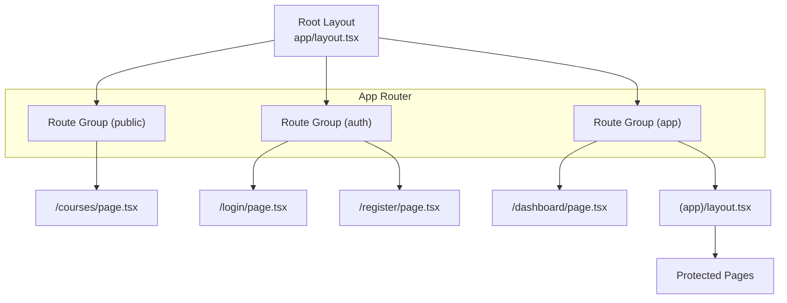

**Diagram sources**
- [layout.tsx:13-27](file://frontend/app/layout.tsx#L13-L27)
- [(public)\courses\page.tsx](file://frontend/app/(public)/courses/page.tsx#L1-L97)
- [(auth)\layout.tsx](file://frontend/app/(auth)/layout.tsx#L1-L12)
- [(app)\layout.tsx](file://frontend/app/(app)/layout.tsx#L1-L117)

**Section sources**
- [layout.tsx:1-28](file://frontend/app/layout.tsx#L1-L28)
- [next.config.js:1-20](file://frontend/next.config.js#L1-L20)
- [tsconfig.json:1-30](file://frontend/tsconfig.json#L1-L30)

## Core Components
- Root layout initializes theming and global styles.
- Home page demonstrates animated hero, features, and call-to-action sections.
- Public courses page fetches and renders subject listings with loading states and animations.
- Auth layout wraps authentication pages.
- App layout manages navigation, theme switching, user profile, logout, and protected routing.

**Section sources**
- [layout.tsx:1-28](file://frontend/app/layout.tsx#L1-L28)
- [page.tsx:1-165](file://frontend/app/page.tsx#L1-L165)
- [(public)\courses\page.tsx](file://frontend/app/(public)/courses/page.tsx#L1-L97)
- [(auth)\layout.tsx](file://frontend/app/(auth)/layout.tsx#L1-L12)
- [(app)\layout.tsx](file://frontend/app/(app)/layout.tsx#L1-L117)

## Architecture Overview
The frontend uses:
- Next.js App Router with route groups to separate concerns.
- Zustand stores for local state management (authentication, AI assistant, course management).
- Axios-based API client abstraction for backend communication.
- Rewrites to proxy /api/* to the backend API URL.
- Tailwind CSS for styling and next-themes for theme management.

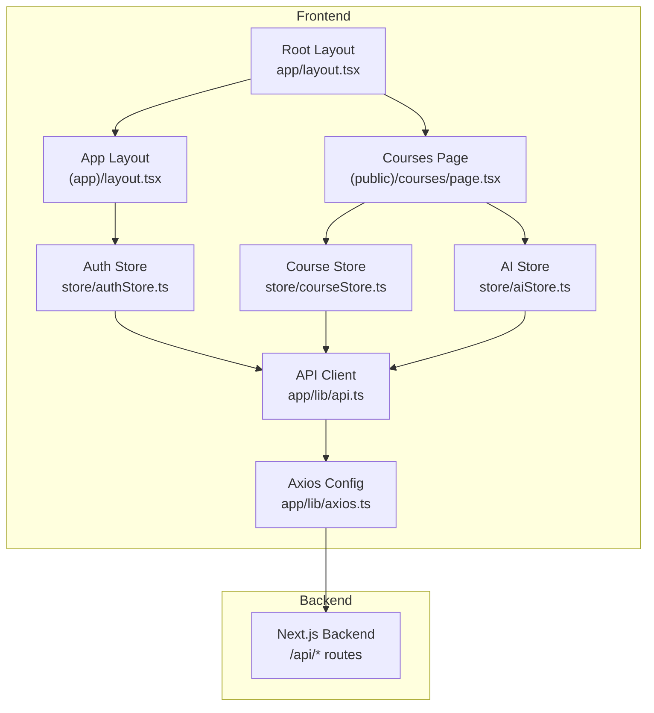

**Diagram sources**
- [layout.tsx:1-28](file://frontend/app/layout.tsx#L1-L28)
- [(app)\layout.tsx](file://frontend/app/(app)/layout.tsx#L1-L117)
- [(public)\courses\page.tsx](file://frontend/app/(public)/courses/page.tsx#L1-L97)
- [authStore.ts:1-98](file://frontend/app/store/authStore.ts#L1-L98)
- [courseStore.ts:1-121](file://frontend/app/store/courseStore.ts#L1-L121)
- [aiStore.ts:1-129](file://frontend/app/store/aiStore.ts#L1-L129)

## Detailed Component Analysis

### Route Groups and Layout Hierarchy
- Root layout sets up theming and global metadata.
- (auth) layout provides a minimal wrapper for login/register pages.
- (app) layout handles authentication checks, navigation sidebar, theme switcher, user profile, and logout. It also fetches user data on mount and redirects unauthenticated users away from protected areas.

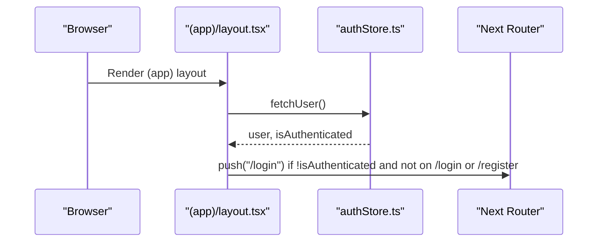

**Diagram sources**
- [(app)\layout.tsx](file://frontend/app/(app)/layout.tsx#L1-L117)
- [authStore.ts:74-88](file://frontend/app/store/authStore.ts#L74-L88)

**Section sources**
- [layout.tsx:1-28](file://frontend/app/layout.tsx#L1-L28)
- [(auth)\layout.tsx](file://frontend/app/(auth)/layout.tsx#L1-L12)
- [(app)\layout.tsx](file://frontend/app/(app)/layout.tsx#L1-L117)

### Protected Routes Implementation
- The (app) layout enforces protection by checking authentication state and redirecting to /login when necessary.
- It also fetches user data on mount to hydrate the auth store.

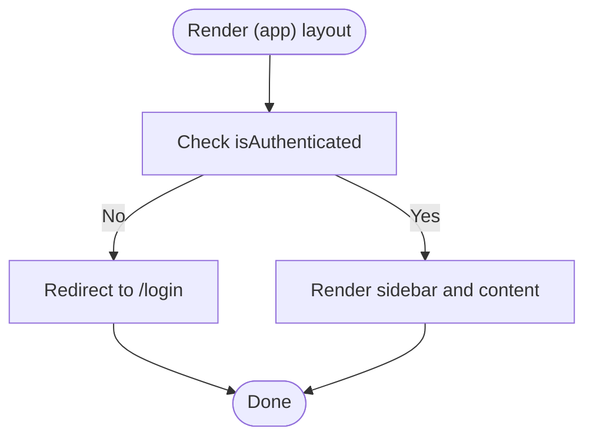

**Diagram sources**
- [(app)\layout.tsx](file://frontend/app/(app)/layout.tsx#L20-L28)

**Section sources**
- [(app)\layout.tsx](file://frontend/app/(app)/layout.tsx#L1-L117)

### Component Composition Patterns
- Home page composes animated sections with motion primitives and links to explore courses and sign up.
- Courses page composes a grid of subject cards, loading skeletons, and navigational links, driven by the course store.

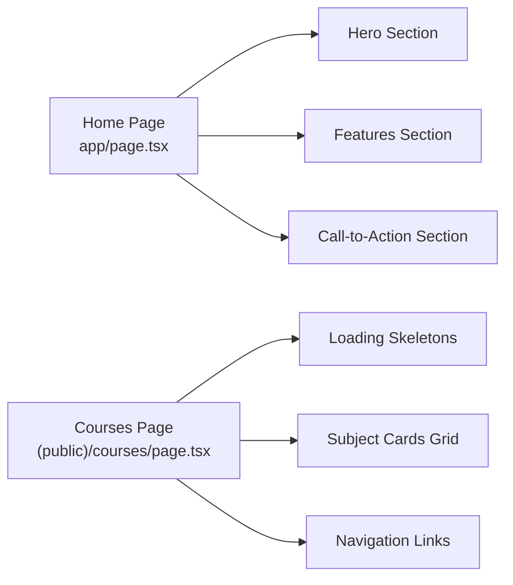

**Diagram sources**
- [page.tsx:1-165](file://frontend/app/page.tsx#L1-L165)
- [(public)\courses\page.tsx](file://frontend/app/(public)/courses/page.tsx#L1-L97)

**Section sources**
- [page.tsx:1-165](file://frontend/app/page.tsx#L1-L165)
- [(public)\courses\page.tsx](file://frontend/app/(public)/courses/page.tsx#L1-L97)

### State Management with Zustand Stores

#### Authentication Store
- Manages user, authentication state, loading, and errors.
- Provides actions for login, register, logout, fetchUser, and clearing errors.
- Persists selected parts of state to localStorage for session continuity.

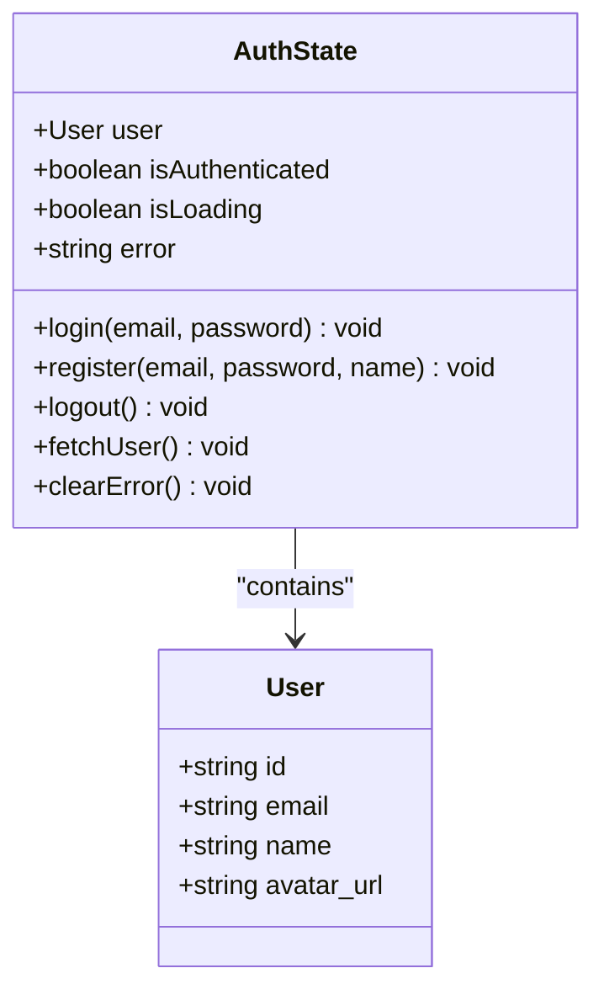

**Diagram sources**
- [authStore.ts:5-24](file://frontend/app/store/authStore.ts#L5-L24)
- [authStore.ts:26-98](file://frontend/app/store/authStore.ts#L26-L98)

**Section sources**
- [authStore.ts:1-98](file://frontend/app/store/authStore.ts#L1-L98)

#### Course Management Store
- Manages subjects, current subject/video context, enrollment state, and loading/error states.
- Provides actions to fetch subjects, fetch subject tree, fetch video, enroll, and clear error.

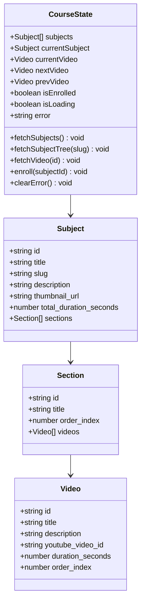

**Diagram sources**
- [courseStore.ts:20-46](file://frontend/app/store/courseStore.ts#L20-L46)
- [courseStore.ts:48-121](file://frontend/app/store/courseStore.ts#L48-L121)

**Section sources**
- [courseStore.ts:1-121](file://frontend/app/store/courseStore.ts#L1-L121)

#### AI Assistant Store
- Manages chat messages, panel open state, and loading/error states.
- Provides actions to send messages, summarize videos, generate quizzes, explain concepts, toggle panel, and clear messages/errors.

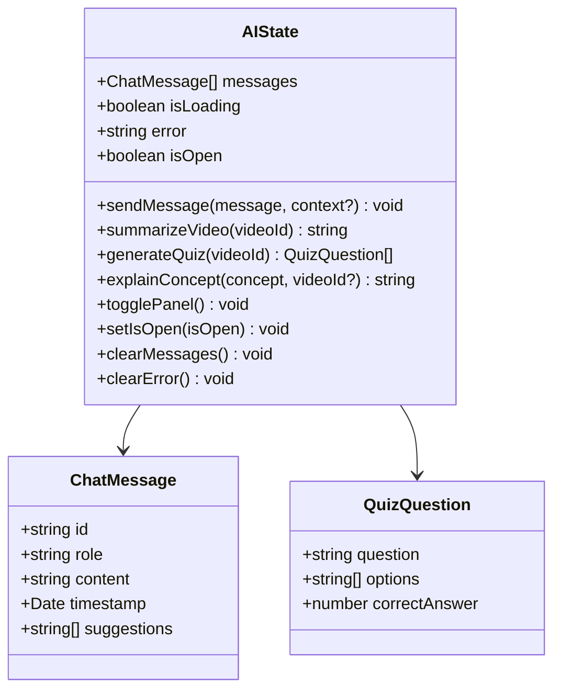

**Diagram sources**
- [aiStore.ts:4-33](file://frontend/app/store/aiStore.ts#L4-L33)
- [aiStore.ts:35-129](file://frontend/app/store/aiStore.ts#L35-L129)

**Section sources**
- [aiStore.ts:1-129](file://frontend/app/store/aiStore.ts#L1-L129)

### API Integration Patterns
- API client configuration and axios setup are located under app/lib. The API client exposes typed endpoints for auth, subjects, videos, and AI.
- Next.js rewrites forward /api/* to the backend API URL, enabling clean client-side calls.

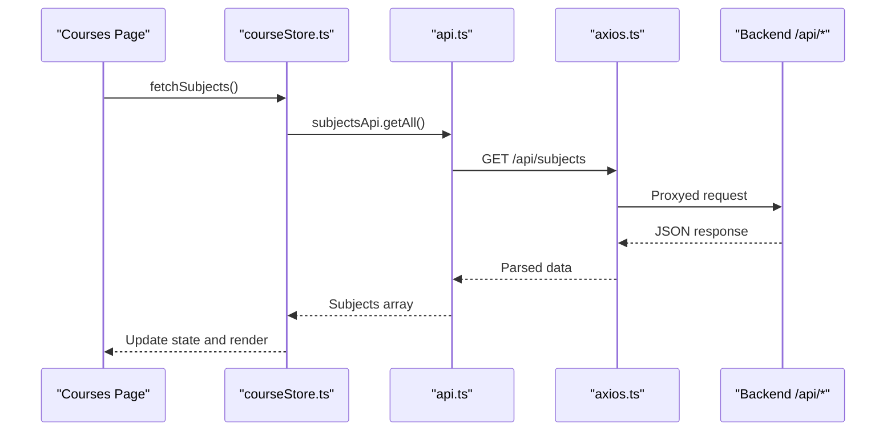

**Diagram sources**
- [(public)\courses\page.tsx](file://frontend/app/(public)/courses/page.tsx#L1-L97)
- [courseStore.ts:58-69](file://frontend/app/store/courseStore.ts#L58-L69)
- [next.config.js:9-16](file://frontend/next.config.js#L9-L16)

**Section sources**
- [next.config.js:1-20](file://frontend/next.config.js#L1-L20)
- [courseStore.ts:1-121](file://frontend/app/store/courseStore.ts#L1-L121)

### Component Lifecycle and Reactivity
- Pages declare "use client" and use useEffect to trigger data fetching on mount.
- Stores update state immutably; components subscribe via hooks and re-render on state changes.
- Animations leverage Framer Motion for smooth transitions and viewport-driven triggers.

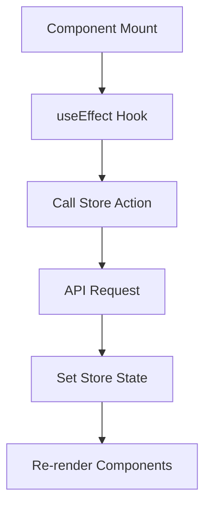

**Diagram sources**
- [(public)\courses\page.tsx](file://frontend/app/(public)/courses/page.tsx#L12-L14)
- [courseStore.ts:58-69](file://frontend/app/store/courseStore.ts#L58-L69)

**Section sources**
- [(public)\courses\page.tsx](file://frontend/app/(public)/courses/page.tsx#L1-L97)
- [courseStore.ts:1-121](file://frontend/app/store/courseStore.ts#L1-L121)

## Dependency Analysis
External libraries and their roles:
- next, react, react-dom: Next.js runtime and rendering.
- framer-motion: Animation primitives for engaging UI.
- lucide-react: Icons for UI elements.
- next-themes: Theme provider for light/dark mode.
- axios: HTTP client for API requests.
- zustand: Lightweight state management.

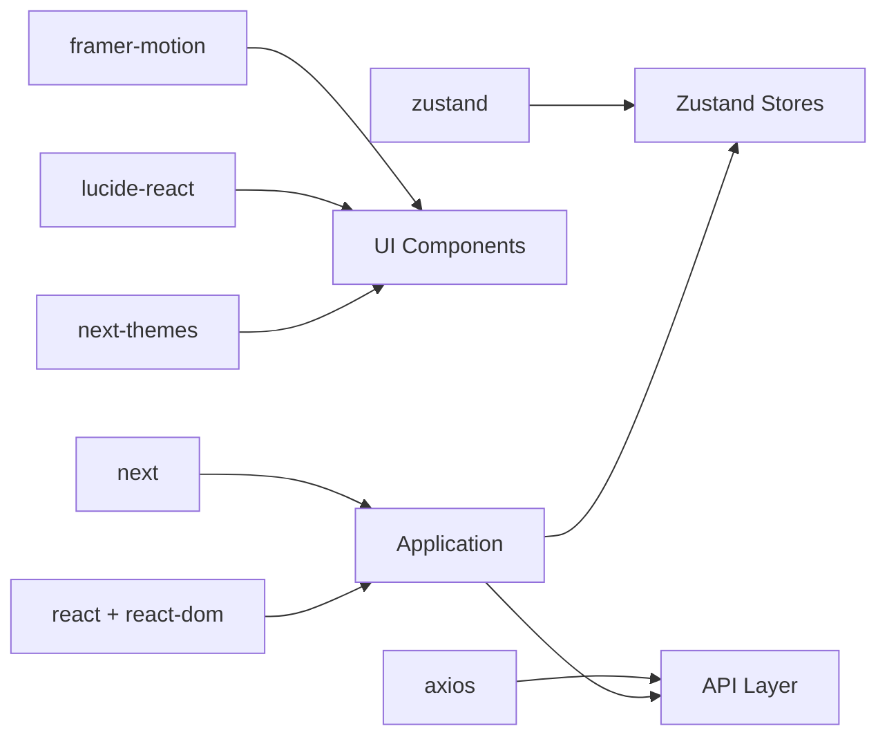

**Diagram sources**
- [package.json:12-23](file://frontend/package.json#L12-L23)

**Section sources**
- [package.json:1-37](file://frontend/package.json#L1-L37)

## Performance Considerations
- Use of path aliases reduces bundle bloat and improves maintainability.
- Strict TypeScript compilation prevents runtime errors and enables better tree-shaking.
- Framer Motion animations are scoped to improve rendering performance.
- Zustand stores minimize re-renders by updating only changed slices.
- Next.js App Router with route groups helps structure code for better code splitting and lazy loading.

[No sources needed since this section provides general guidance]

## Troubleshooting Guide
Common issues and resolutions:
- API proxy misconfiguration: Verify NEXT_PUBLIC_API_URL and rewrites in next.config.js.
- Authentication redirects loop: Ensure auth store hydration occurs before layout navigation guards.
- Missing assets: Confirm image domains are whitelisted in next.config.js images configuration.
- Type errors: Run typecheck script and fix TS errors reported by strict compiler options.

**Section sources**
- [next.config.js:1-20](file://frontend/next.config.js#L1-L20)
- [(app)\layout.tsx](file://frontend/app/(app)/layout.tsx#L20-L28)
- [package.json:24-35](file://frontend/package.json#L24-L35)

## Conclusion
The frontend leverages Next.js App Router with route groups to cleanly separate public, authentication, and application areas. Zustand stores encapsulate domain-specific state for authentication, course management, and AI assistant interactions. API integration is streamlined via axios and Next.js rewrites. The architecture emphasizes component composition, reactive updates, and performance through careful state management and animation usage.

[No sources needed since this section summarizes without analyzing specific files]