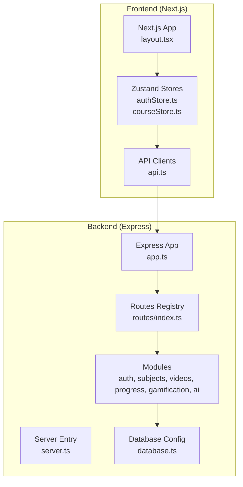
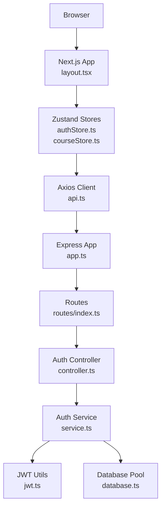
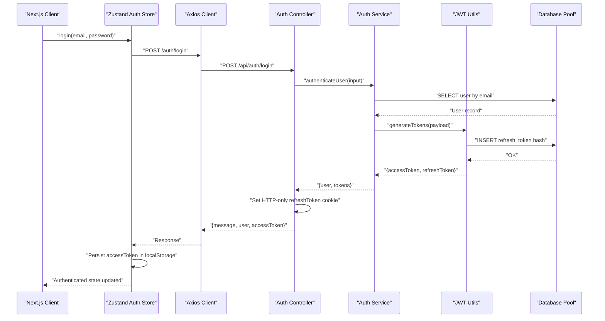
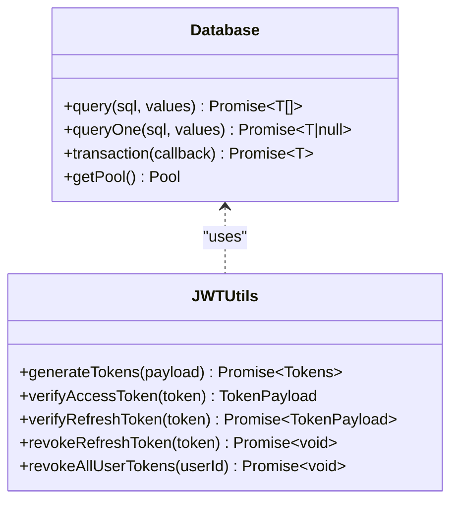
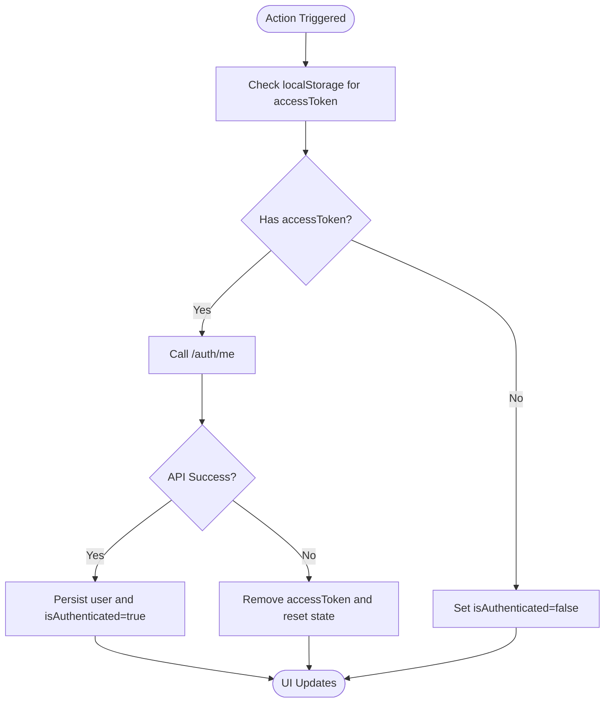
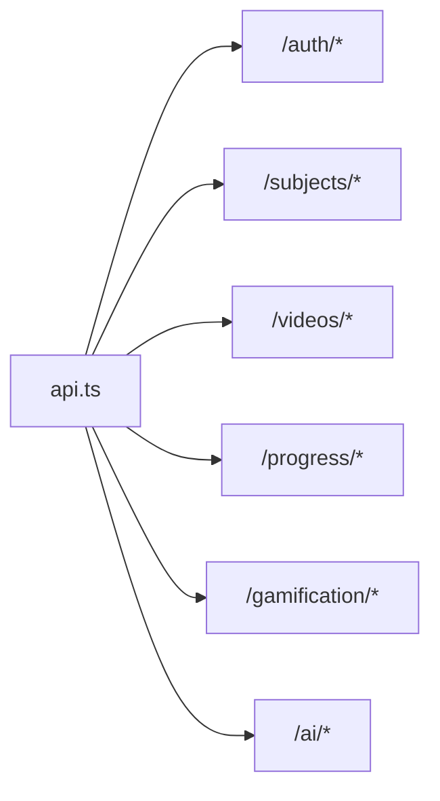
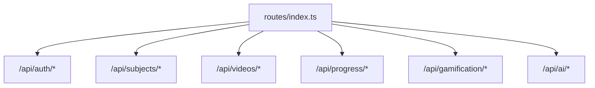
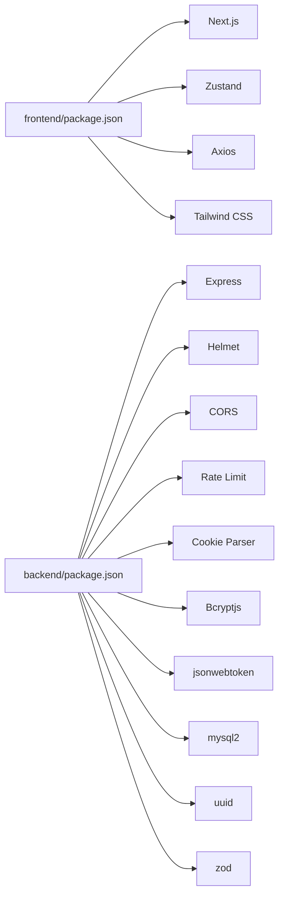

# System Architecture

<cite>
**Referenced Files in This Document**
- [backend/src/server.ts](file://backend/src/server.ts)
- [backend/src/app.ts](file://backend/src/app.ts)
- [backend/src/routes/index.ts](file://backend/src/routes/index.ts)
- [backend/src/modules/auth/controller.ts](file://backend/src/modules/auth/controller.ts)
- [backend/src/modules/auth/service.ts](file://backend/src/modules/auth/service.ts)
- [backend/src/middleware/auth.ts](file://backend/src/middleware/auth.ts)
- [backend/src/utils/jwt.ts](file://backend/src/utils/jwt.ts)
- [backend/src/config/database.ts](file://backend/src/config/database.ts)
- [backend/package.json](file://backend/package.json)
- [frontend/app/layout.tsx](file://frontend/app/layout.tsx)
- [frontend/app/lib/api.ts](file://frontend/app/lib/api.ts)
- [frontend/app/store/authStore.ts](file://frontend/app/store/authStore.ts)
- [frontend/app/store/courseStore.ts](file://frontend/app/store/courseStore.ts)
- [frontend/package.json](file://frontend/package.json)
</cite>

## Table of Contents
1. [Introduction](#introduction)
2. [Project Structure](#project-structure)
3. [Core Components](#core-components)
4. [Architecture Overview](#architecture-overview)
5. [Detailed Component Analysis](#detailed-component-analysis)
6. [Dependency Analysis](#dependency-analysis)
7. [Performance Considerations](#performance-considerations)
8. [Troubleshooting Guide](#troubleshooting-guide)
9. [Conclusion](#conclusion)
10. [Appendices](#appendices)

## Introduction
This document describes the full-stack architecture of the Learning Management System. The frontend is a Next.js application built with React and TypeScript, while the backend is an Express server also written in TypeScript. The system follows an MVC-like separation of concerns across modules, with clear boundaries between controllers, services, and data access. Authentication uses JSON Web Tokens with refresh tokens persisted in the database. State management is handled client-side using Zustand stores. The backend exposes RESTful APIs consumed by the frontend via Axios. The document outlines component interactions, data flows, infrastructure requirements, scalability considerations, and deployment topology.

## Project Structure
The repository is organized into two primary directories:
- backend: Express server with modular routes, controllers, services, middleware, utilities, and database configuration.
- frontend: Next.js app with pages, components, stores (Zustand), and API clients.

**Diagram sources**
- [backend/src/server.ts:1-32](file://backend/src/server.ts#L1-L32)
- [backend/src/app.ts:1-54](file://backend/src/app.ts#L1-L54)
- [backend/src/routes/index.ts:1-25](file://backend/src/routes/index.ts#L1-L25)
- [backend/src/config/database.ts:1-53](file://backend/src/config/database.ts#L1-L53)
- [frontend/app/layout.tsx:1-28](file://frontend/app/layout.tsx#L1-L28)
- [frontend/app/lib/api.ts:1-80](file://frontend/app/lib/api.ts#L1-L80)
- [frontend/app/store/authStore.ts:1-98](file://frontend/app/store/authStore.ts#L1-L98)
- [frontend/app/store/courseStore.ts:1-121](file://frontend/app/store/courseStore.ts#L1-L121)

**Section sources**
- [backend/src/server.ts:1-32](file://backend/src/server.ts#L1-L32)
- [backend/src/app.ts:1-54](file://backend/src/app.ts#L1-L54)
- [backend/src/routes/index.ts:1-25](file://backend/src/routes/index.ts#L1-L25)
- [backend/src/config/database.ts:1-53](file://backend/src/config/database.ts#L1-L53)
- [frontend/app/layout.tsx:1-28](file://frontend/app/layout.tsx#L1-L28)
- [frontend/app/lib/api.ts:1-80](file://frontend/app/lib/api.ts#L1-L80)
- [frontend/app/store/authStore.ts:1-98](file://frontend/app/store/authStore.ts#L1-L98)
- [frontend/app/store/courseStore.ts:1-121](file://frontend/app/store/courseStore.ts#L1-L121)

## Core Components
- Backend server initialization and lifecycle management.
- Express application with security middleware, CORS, rate limiting, body parsing, and route registration.
- Modular routing that groups features by domain (auth, subjects, videos, progress, gamification, ai).
- Authentication controller/service implementing registration, login, logout, refresh, and profile retrieval with JWT and refresh token persistence.
- Middleware for enforcing bearer token authentication and optional authentication.
- JWT utilities for token generation, verification, and revocation with database-backed refresh token storage.
- Database abstraction using a MySQL connection pool with helpers for queries and transactions.
- Frontend Next.js root layout and theme provider.
- API client module consolidating REST endpoints for all backend domains.
- Zustand stores for authentication and course-related state with persistence and optimistic updates.
- Frontend package.json declaring Next.js, Zustand, Axios, and related dependencies.

Key implementation patterns:
- MVC-like separation: controllers handle HTTP requests, services encapsulate business logic, and database utilities provide data access.
- Token-based authentication with refresh tokens stored securely in cookies and persisted hashed in the database.
- Client-side state management via Zustand stores with persistence to localStorage for session continuity.

**Section sources**
- [backend/src/server.ts:1-32](file://backend/src/server.ts#L1-L32)
- [backend/src/app.ts:1-54](file://backend/src/app.ts#L1-L54)
- [backend/src/routes/index.ts:1-25](file://backend/src/routes/index.ts#L1-L25)
- [backend/src/modules/auth/controller.ts:1-99](file://backend/src/modules/auth/controller.ts#L1-L99)
- [backend/src/modules/auth/service.ts:1-108](file://backend/src/modules/auth/service.ts#L1-L108)
- [backend/src/middleware/auth.ts:1-42](file://backend/src/middleware/auth.ts#L1-L42)
- [backend/src/utils/jwt.ts:1-78](file://backend/src/utils/jwt.ts#L1-L78)
- [backend/src/config/database.ts:1-53](file://backend/src/config/database.ts#L1-L53)
- [frontend/app/layout.tsx:1-28](file://frontend/app/layout.tsx#L1-L28)
- [frontend/app/lib/api.ts:1-80](file://frontend/app/lib/api.ts#L1-L80)
- [frontend/app/store/authStore.ts:1-98](file://frontend/app/store/authStore.ts#L1-L98)
- [frontend/app/store/courseStore.ts:1-121](file://frontend/app/store/courseStore.ts#L1-L121)
- [backend/package.json:1-44](file://backend/package.json#L1-L44)
- [frontend/package.json:1-37](file://frontend/package.json#L1-L37)

## Architecture Overview
The system employs a classic client-server architecture:
- Frontend (Next.js) renders UI and manages state locally with Zustand.
- Backend (Express) serves REST endpoints and enforces authentication and authorization.
- Database (MySQL) persists user accounts, course content, progress, gamification metrics, and refresh tokens.
- Communication: Frontend consumes backend APIs via Axios; backend uses a MySQL pool for data access.

**Diagram sources**
- [frontend/app/layout.tsx:1-28](file://frontend/app/layout.tsx#L1-L28)
- [frontend/app/store/authStore.ts:1-98](file://frontend/app/store/authStore.ts#L1-L98)
- [frontend/app/store/courseStore.ts:1-121](file://frontend/app/store/courseStore.ts#L1-L121)
- [frontend/app/lib/api.ts:1-80](file://frontend/app/lib/api.ts#L1-L80)
- [backend/src/app.ts:1-54](file://backend/src/app.ts#L1-L54)
- [backend/src/routes/index.ts:1-25](file://backend/src/routes/index.ts#L1-L25)
- [backend/src/modules/auth/controller.ts:1-99](file://backend/src/modules/auth/controller.ts#L1-L99)
- [backend/src/modules/auth/service.ts:1-108](file://backend/src/modules/auth/service.ts#L1-L108)
- [backend/src/utils/jwt.ts:1-78](file://backend/src/utils/jwt.ts#L1-L78)
- [backend/src/config/database.ts:1-53](file://backend/src/config/database.ts#L1-L53)

## Detailed Component Analysis

### Authentication Flow (End-to-End)
This sequence illustrates the typical login flow from frontend to backend and token issuance.

**Diagram sources**
- [frontend/app/store/authStore.ts:34-49](file://frontend/app/store/authStore.ts#L34-L49)
- [frontend/app/lib/api.ts:8-9](file://frontend/app/lib/api.ts#L8-L9)
- [backend/src/modules/auth/controller.ts:18-35](file://backend/src/modules/auth/controller.ts#L18-L35)
- [backend/src/modules/auth/service.ts:50-81](file://backend/src/modules/auth/service.ts#L50-L81)
- [backend/src/utils/jwt.ts:20-41](file://backend/src/utils/jwt.ts#L20-L41)
- [backend/src/config/database.ts:35-38](file://backend/src/config/database.ts#L35-L38)

**Section sources**
- [frontend/app/store/authStore.ts:1-98](file://frontend/app/store/authStore.ts#L1-L98)
- [frontend/app/lib/api.ts:1-80](file://frontend/app/lib/api.ts#L1-L80)
- [backend/src/modules/auth/controller.ts:1-99](file://backend/src/modules/auth/controller.ts#L1-L99)
- [backend/src/modules/auth/service.ts:1-108](file://backend/src/modules/auth/service.ts#L1-L108)
- [backend/src/utils/jwt.ts:1-78](file://backend/src/utils/jwt.ts#L1-L78)
- [backend/src/config/database.ts:1-53](file://backend/src/config/database.ts#L1-L53)

### Data Access Layer
The database abstraction provides a simple query API and supports transactions.

**Diagram sources**
- [backend/src/config/database.ts:19-50](file://backend/src/config/database.ts#L19-L50)
- [backend/src/utils/jwt.ts:20-77](file://backend/src/utils/jwt.ts#L20-L77)

**Section sources**
- [backend/src/config/database.ts:1-53](file://backend/src/config/database.ts#L1-L53)
- [backend/src/utils/jwt.ts:1-78](file://backend/src/utils/jwt.ts#L1-L78)

### Frontend State Management (Zustand)
Zustand stores encapsulate domain-specific state and actions, persisting relevant slices to localStorage.

**Diagram sources**
- [frontend/app/store/authStore.ts:74-88](file://frontend/app/store/authStore.ts#L74-L88)

**Section sources**
- [frontend/app/store/authStore.ts:1-98](file://frontend/app/store/authStore.ts#L1-L98)
- [frontend/app/store/courseStore.ts:1-121](file://frontend/app/store/courseStore.ts#L1-L121)

### API Client Module
The API client consolidates endpoint definitions for auth, subjects, videos, progress, gamification, and AI domains.

**Diagram sources**
- [frontend/app/lib/api.ts:1-80](file://frontend/app/lib/api.ts#L1-L80)

**Section sources**
- [frontend/app/lib/api.ts:1-80](file://frontend/app/lib/api.ts#L1-L80)

### Routing and Module Boundaries
The backend registers feature-specific routes under a shared base path, enabling clear separation of concerns.

**Diagram sources**
- [backend/src/routes/index.ts:17-22](file://backend/src/routes/index.ts#L17-L22)

**Section sources**
- [backend/src/routes/index.ts:1-25](file://backend/src/routes/index.ts#L1-L25)

## Dependency Analysis
- Frontend depends on Next.js, Zustand for state, Axios for HTTP, and Tailwind CSS for styling.
- Backend depends on Express, helmet for security, cors for cross-origin, express-rate-limit for rate limiting, cookie-parser for cookies, bcryptjs for password hashing, jsonwebtoken for JWT, mysql2 for database connectivity, uuid for refresh token IDs, and zod for validation.
- Frontend stores depend on the API client module; the API client depends on Axios; backend controllers depend on services; services depend on JWT utilities and the database pool.

**Diagram sources**
- [frontend/package.json:12-22](file://frontend/package.json#L12-L22)
- [backend/package.json:15-26](file://backend/package.json#L15-L26)

**Section sources**
- [frontend/package.json:1-37](file://frontend/package.json#L1-L37)
- [backend/package.json:1-44](file://backend/package.json#L1-L44)

## Performance Considerations
- Database pooling: The backend uses a MySQL pool with a fixed connection limit and keep-alive support to manage concurrent connections efficiently.
- Rate limiting: Express rate limiting is applied globally and specifically to authentication endpoints to prevent abuse.
- Payload sizes: Body parsing limits are configured to accommodate larger payloads if needed.
- Client caching: Zustand stores can cache data locally to reduce redundant network calls; consider adding selective invalidation and background refetch strategies.
- CDN and static assets: Serve static assets via a CDN and optimize video delivery for the video player component.
- Horizontal scaling: Run multiple backend instances behind a load balancer; ensure shared database and stateless servers.

[No sources needed since this section provides general guidance]

## Troubleshooting Guide
Common operational issues and remedies:
- Server startup failures: Verify environment variables and database connectivity; check logs for uncaught exceptions and unhandled rejections.
- CORS errors: Confirm frontend URL matches the allowed origin and credentials are enabled.
- Authentication failures: Ensure JWT secret is set, tokens are present in cookies for refresh, and refresh tokens are not revoked or expired.
- Database connectivity: Validate host, port, user, password, and database name; confirm the pool configuration and connection limits.
- Rate limiting: If receiving too many requests errors, adjust limits or implement client-side retry with exponential backoff.

**Section sources**
- [backend/src/server.ts:22-31](file://backend/src/server.ts#L22-L31)
- [backend/src/app.ts:14-20](file://backend/src/app.ts#L14-L20)
- [backend/src/utils/jwt.ts:47-62](file://backend/src/utils/jwt.ts#L47-L62)
- [backend/src/config/database.ts:6-17](file://backend/src/config/database.ts#L6-L17)

## Conclusion
The Learning Management System adopts a clean separation of concerns with a Next.js frontend and an Express backend, both implemented in TypeScript. The backend follows an MVC-like structure with controllers, services, and middleware, while the frontend leverages Zustand for state management. Authentication is robust with JWT and refresh tokens persisted in the database. The architecture supports scalability through a MySQL pool, rate limiting, and horizontal scaling of backend instances. The provided diagrams and references offer a clear blueprint for development, maintenance, and deployment.

[No sources needed since this section summarizes without analyzing specific files]

## Appendices

### Infrastructure Requirements
- Backend runtime: Node.js LTS with TypeScript transpilation.
- Database: MySQL 8+ with migration scripts applied.
- Environment variables: JWT secrets, database credentials, CORS origins, and ports.
- Optional: Redis for caching or session storage if scaling horizontally.

[No sources needed since this section provides general guidance]

### Deployment Topology
- Frontend: Deploy Next.js build artifacts to a static hosting provider or SSR-compatible platform.
- Backend: Containerize the Express server and deploy to a container orchestration platform or PaaS with autoscaling.
- Database: Managed MySQL service or self-hosted with backups and monitoring.
- Load balancing: Place a reverse proxy/load balancer in front of backend instances.
- CI/CD: Automated builds, migrations, and deployments with health checks.

[No sources needed since this section provides general guidance]